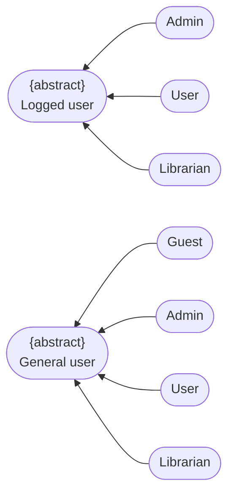
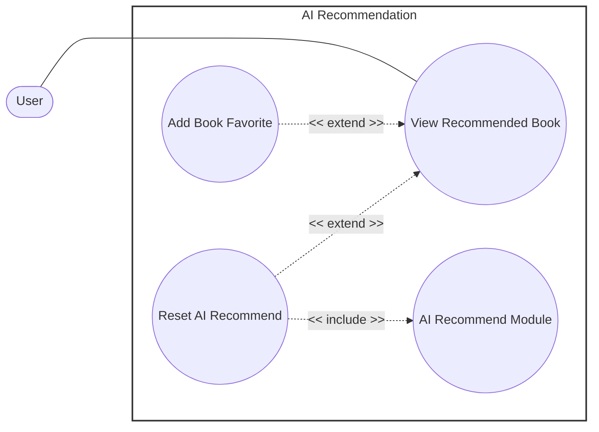

# Use-Case Specification: AI Recommendation Package

    Project Name: Modern Library Management System
    Course: CS300 – CSC13002 – Introduction to Software Engineering 
    Group ID: 03
    Group Name: Amethyst
    Assignment: PA3-2026
    Document Identifier: NGLP-SRS-AIR-001
    Version: 1.1

Performed by: Trần Lê Hoàng Gia, Phan Lê Anh Minh | Reviewed by: All Members | Edited by: Trần Lê Hoàng Gia, Phan Lê Anh Minh

---

## Revision History

| Date | Version | Description | Author |
| --- | --- | --- | --- |
| 20-Jul-2026 | 1.1 | AI Recommendation (RUP format layout). | Trần Lê Hoàng Gia, Phan Lê Anh Minh |

---

## Table of Contents
1. [Regulation](#regulation)
2. [Use case diagram](https://www.google.com/search?q=%23use-case-diagram)
3. [UC-AIR-01: View Recommended Book](#uc-air-01-view-recommended-book)
4. [UC-AIR-03: Reset AI Recommend](#uc-air-03-reset-ai-recommend)
5. [UC-AIR-04: AI Recommend Module](https://www.google.com/search?q=%23uc-air-04-ai-recommend-module)

---

## Regulation

---

## Use case diagram

---

## UC-AIR-01: View Recommended Book

### 1. Use-Case Name

View Recommended Book 

#### 1.1 Brief Description

Allows the user to view the list of books recommended by the AI recommendation engine. 

### 2. Flow of Events

#### 2.1 Basic Flow

1. **[Actor Action]**: The user navigates to the Recommended Book Dashboard within the main Dashboard tab workspace. 
2. **[System Response]**: The system queries backend microservices to retrieve the AI-generated list of recommended books. 
3. **[Display Result]**: The system renders the prioritized list of recommended books (containing 10-15 book items) directly onto the user interface viewport. 
4. **[Actor Action]**: The user reviews the recommendations, opens individual details panes to examine specific book records, and saves relevant candidate titles into their personal favorites collection array. 

#### 2.2 Alternative Flows

##### 2.2.1 Recommendation Generation Error (Step 3)

If the system encounters an error or timeout while compiling the recommendation data structures:

1. The system interrupts the presentation flow script. 
2. The system throws a contextual error notification alert block onto the screen interface. 

* **Postcondition (Alternative Flow):** No recommended books are displayed; the user workspace safely handles the failure and informs the individual that no recommendations are currently available. 

### 3. Special Requirements

#### 3.1 Recent Interest Real-Time Extraction

The displayed list compilation must dynamically track and accurately reflect the user's most recent reading and query interest parameters. 

#### 3.2 Analytical Behavioral Tracking

The system must actively log all granular user interaction vectors (e.g., viewing profiles, adding entries to wishlists, processing reservations) to continually update and train downstream machine learning recommendations. 

### 4. Preconditions

#### 4.1 Client Identity Verification

The session context maintains an actively verified and authenticated state flag. 

### 5. Postconditions

#### 5.1 Dashboard Presentation Complete

The targeted AI-generated list of book recommendations populates the visualization grid array successfully. 

#### 5.2 Performance Cache Staging

The calculated recommendation ranking matrix commits to high-speed cache memory systems to accelerate subsequent rendering retrieval loops. 

### 6. Extension Points

#### 6.1 Reset AI Recommend

* Location inside event flow: Viewing the recommended list grid (Step 4). 

### 7. Prototype Screen

---

## UC-AIR-02: Reset AI Recommend

*Extends UC-AIR-01 (View Recommended Book) — extension point: Regenerating the displayed recommendation list.* 

*Includes UC-AIR-03 (AI Recommend Module).* 

### 1. Use-Case Name

Reset AI Recommend 

#### 1.1 Brief Description

Allows the user to clear their current recommendation cache and trigger the system's background engine to immediately recalculate and regenerate a fresh book recommendation list. 

### 2. Flow of Events

#### 2.1 Basic Flow

1. **[Actor Action]**: While actively viewing the recommended book collection grid, the user selects the "Reset AI Recommend" interface control node option. 
2. **[System Response]**: The system intercepts the request command payload and systematically invokes the mandatory include sub-routine **AI Recommend Module (UC-AIR-04)**. 
3. **[Data Processing]**: The included AI Recommend Module processes the user's behavioral metrics dataset rows and evaluates a clean set of recommendations. 
4. **[Data Processing]**: The system purges historical cache frames and overrides the active recommendation data array rows with the newly received listings. 
5. **[Display Result]**: The system refreshes the client screen dashboard panel to render the fresh, updated recommended book list. 

#### 2.2 Alternative Flows

##### 2.2.1 Core Module Execution Crash (Step 2)

If the included AI Recommend Module fails to generate a new list due to model processing errors or connectivity breaks:

1. The system aborts the data staging transaction loops. 
2. The system displays a transactional fallback error alert text block on screen. 
3. The system retains the previous recommendation list array properties intact within the active display container. 

* **Postcondition (Alternative Flow):** No structural changes commit against the user's current recommendation dataset; the user interface notifies the individual of the operational failure. 

### 3. Special Requirements

#### 3.1 API Rate Limiting Guards

To prevent heavy backend compute degradation, reset invocation requests must enforce strict rate-limiting caps to control repetitive sequential manual regenerations. 

#### 3.2 Candidate Non-Overlap Constraints

The freshly generated recommendation candidate array rows must be evaluated against the immediately preceding listing to prevent redundant content repetition. 

### 4. Preconditions

#### 4.1 Workspace Context Active

The user is actively executing workspace visualization tasks within `UC-AIR-01`. 

### 5. Postconditions

#### 5.1 Ledger Regeneration Complete

The user's recommendation data structures are successfully overwritten, cached, and updated across the display interface viewport. 

### 6. Extension Points

None.

### 7. Prototype Screen

---

## UC-AIR-03: AI Recommend Module

*Included UC supporting parent operational blocks under UC-AIR-02 (Reset AI Recommend).* 

### 1. Use-Case Name

AI Recommend Module 

#### 1.1 Brief Description

Internal algorithmic processing service handling the aggregation of user profile features, execution of ML recommendation graphs, and output generation of recommendation datasets. 

### 2. Flow of Events

#### 2.1 Basic Flow

1. **[System Response]**: An external invoking orchestration use case dispatches an execution request payload demanding a new recommendation candidate array. 
2. **[Data Processing]**: The system queries active data store layers to extract user profile vectors, including favorites matrices, check-out reading history logs, and categorical interest preferences. 
3. **[Data Processing]**: The system pipes the gathered data arrays directly through the AI recommendation machine learning model engine. 
4. **[Data Processing]**: The model processes the input fields and outputs a newly calculated list structure of recommended book identifiers. 
5. **[System Response]**: The system packages the resulting dataset array and returns the completion callback variables directly to the high-level invoking orchestrator workflow. 

#### 2.2 Alternative Flows

##### 2.2.1 Cold-Start Insufficient User Data (Step 2)

If the target user account history records register empty rows or fall below the minimum training thresholds:

1. The system catches the data boundary constraint condition. 
2. The system routes processing logic patterns away from custom modeling, generating a default standard recommendation list based on global catalog popularity indexes instead. 
3. The system passes the global default dataset back to the master orchestration block. 

* **Postcondition (Alternative Flow):** A standard, non-personalized default recommendation collection list generates and returns to avoid application interface rendering breaks. 

##### 2.2.2 Processing Architecture Exception (Step 3)

If the recommendation machine learning framework throws a pipeline error or memory crunch during computation:

1. The system traps the model exception block securely. 
2. The system drops execution and returns a structured processing failure error code back out to the invoking use case. 

* **Postcondition (Alternative Flow):** No fresh recommendation list commits; the parent calling orchestrator receives an explicit processing failure callback warning. 

### 3. Special Requirements

#### 3.1 Model Latency Constraints

Model processing execution intervals and vector space distance parsing routines must operate within strict time thresholds to block prominent client rendering latency. 

### 4. Preconditions

#### 4.1 Relational Data Accessibility

Target profile behavioral tables (reading histories, interaction flags, item favorites) are completely online and available for parsing queries. 

### 5. Postconditions

#### 5.1 Matrix Object Return Commitment

A fresh set of recommendation index keys compiles completely and maps back into the parent caller workflow instance variables. 

### 6. Extension Points

None.