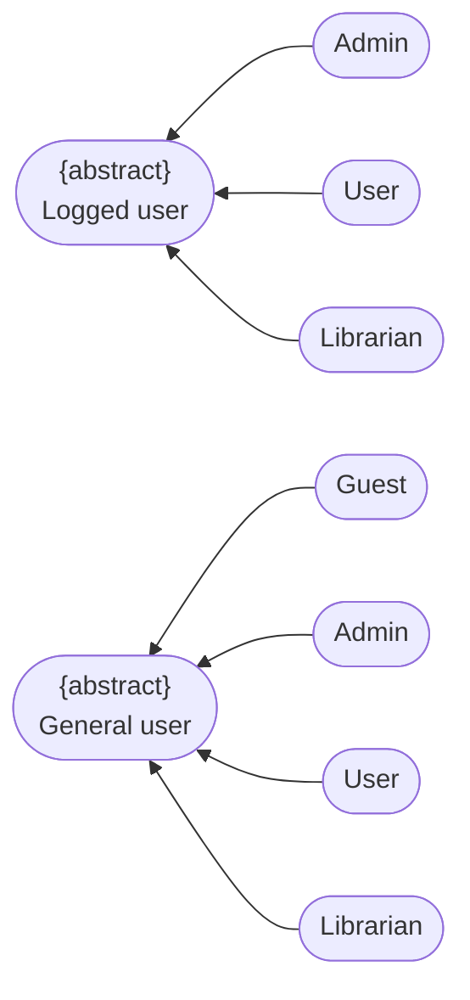
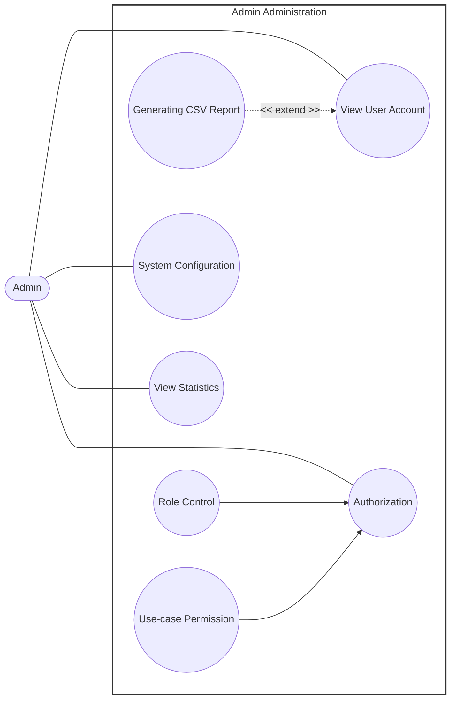
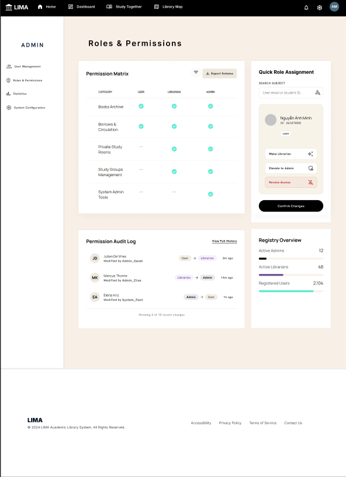

# Use-Case Specification: Admin Administration

    Project Name: Modern Library Management System
    Course: CS300 – CSC13002 – Introduction to Software Engineering 
    Group ID: 03
    Group Name: Amethyst
    Assignment: PA3-2026
    Version: 1.1

Performed by: Trần Lê Hoàng Gia, Phan Lê Anh Minh | Reviewed by: All Members | Edited by: Trần Lê Hoàng Gia, Phan Lê Anh Minh

---

## Revision History

| Date | Version | Description | Author |
| --- | --- | --- | --- |
| 21-Jul-2026 | 1.1 | Admin Administration use-case specifications (RUP specification layout) | Trần Lê Hoàng Gia, Phan Lê Anh Minh |

---

## Table of Contents
1. [Regulation](#regulation)
2. [Use case diagram](#use-case-diagram)
3. [UC-ADM-01: View User Account](#uc-adm-01-view-user-account)
4. [UC-ADM-02: Generating CSV Report](#uc-adm-02-generating-csv-report)
5. [UC-ADM-03: Authorization](#uc-adm-07-authorization)
6. [UC-ADM-04: Role Control](#uc-adm-05-role-control)
7. [UC-ADM-05: Use-case Permission](#uc-adm-06-use-case-permission)
8. [UC-ADM-06: System Configuration](#uc-adm-03-system-configuration)
9. [UC-ADM-07: View Statistics](#uc-adm-04-view-statistics)

---

## Regulation

---

## Use case diagram

---

## UC-ADM-01: View User Account

*Extended by Generating CSV Report (UC-ADM-02) at Step 5.*

### 1. Use-Case Name

View User Account

#### 1.1 Brief Description

Allows the Admin to browse the list of registered user accounts and inspect the details of a selected account.

### 2. Flow of Events

#### 2.1 Basic Flow

1. **[Actor Action]**: The Admin navigates to the User Account section.
2. **[Data Processing]**: The system retrieves the list of registered user accounts.
3. **[Display Result]**: The system displays the list of user accounts to the Admin.
4. **[Actor Action]**: The Admin selects a specific user account to inspect.
5. **[Display Result]**: The system retrieves and displays the detailed information of the selected account.

#### 2.2 Alternative Flows

##### 2.2.1 No User Accounts Exist (Step 2)

If no user accounts exist in the system:

1. The system displays an empty-state message instead of a list.

* **Postcondition (Alternative Flow):** No account data is displayed; system state remains unchanged.

##### 2.2.2 Selected Account No Longer Exists (Step 4)

If the selected account no longer exists (e.g., it was deleted):

1. The system displays an error message.
2. The system returns the Admin to the account list; the Basic Flow resumes at step 3.

* **Postcondition (Alternative Flow):** No detail view is rendered; the Admin remains on the account list.

### 3. Special Requirements

#### 3.1 Read-Only Access

This use case is strictly read-only; it must not permit modification of account data.

#### 3.2 Sensitive Field Masking

Sensitive account fields (e.g., stored credentials) must not be exposed in the displayed details.

### 4. Preconditions

#### 4.1 Verified Authentication State

The Admin is authenticated.

### 5. Postconditions

#### 5.1 Account Details Displayed

The requested user account information is displayed to the Admin; no account data is modified.

### 6. Extension Points

#### 6.1 Generating CSV Report

* Location inside event flow: While account data is currently displayed (after Step 5).

### 7. Prototype Screen

---

## UC-ADM-02: Generating CSV Report

*Extends View User Account (UC-ADM-01) — extension point: the Admin selects "Generate CSV Report" while account data is displayed.*

### 1. Use-Case Name

Generating CSV Report

#### 1.1 Brief Description

Extends the account view to let the Admin export the currently displayed user account data into a downloadable CSV file.

### 2. Flow of Events

#### 2.1 Basic Flow

1. **[Actor Action]**: While viewing user account data, the Admin selects the "Generate CSV Report" option.
2. **[Data Processing]**: The system compiles the currently displayed user account data into CSV format.
3. **[Data Processing]**: The system generates the CSV file.
4. **[System Response]**: The system prompts the Admin to download the generated file.
5. **[Data Processing]**: The system initiates the download.
6. **[Display Result]**: The system delivers the CSV file to the Admin.

#### 2.2 Alternative Flows

##### 2.2.1 No Data Available to Export (Step 2)

If there is no data available to export:

1. The system notifies the Admin that no report can be generated.

* **Postcondition (Alternative Flow):** No CSV file is generated; the Admin remains on the current view.

##### 2.2.2 File Generation Fails (Step 3)

If the system encounters an internal error while generating the file:

1. The system displays an error message; no file is produced.

* **Postcondition (Alternative Flow):** No CSV file is produced; the Admin is notified of the failure.

### 3. Special Requirements

#### 3.1 Sensitive Field Exclusion

Exported CSV files must exclude sensitive fields such as passwords or authentication tokens.

#### 3.2 Encoding Standard

The CSV file must use a standard, widely-compatible encoding (e.g., UTF-8).

### 4. Preconditions

#### 4.1 Active Base Context Display

The base use case `View User Account (UC-ADM-01)` must be currently active and displaying account data.

### 5. Postconditions

#### 5.1 CSV File Delivered

A CSV file containing the requested user account data is generated and made available to the Admin.

### 6. Extension Points

None.

### 7. Prototype Screen

---

## UC-ADM-03: Authorization

*Included by Role Control (UC-ADM-05) and Use-case Permission (UC-ADM-06).*

### 1. Use-Case Name

Authorization

#### 1.1 Brief Description

Verifies the Admin's identity and permission to perform a requested administrative function. Invoked internally by other use cases.

### 2. Flow of Events

#### 2.1 Basic Flow

1. **[Actor Action]**: The invoking use case requests authorization.
2. **[Data Processing]**: The system validates the Admin's credentials or session token.
3. **[Data Processing]**: The system retrieves the Admin's assigned roles and permissions.
4. **[Data Processing]**: The system evaluates whether the Admin is authorized for the requested function.
5. **[System Response]**: The system returns the authorization result to the invoking use case.

#### 2.2 Alternative Flows

##### 2.2.1 Invalid Credentials or Session (Step 2)

If the credentials or session are invalid:

1. The system denies access and displays an authentication error.
2. The failed attempt is logged.

* **Postcondition (Alternative Flow):** Access is denied; the failed attempt is logged.

##### 2.2.2 Insufficient Permission (Step 4)

If the Admin lacks sufficient permission for the requested function:

1. The system denies access and displays an authorization error.
2. The attempt is logged.

* **Postcondition (Alternative Flow):** Access to the requested function is denied; the attempt is logged.

### 3. Special Requirements

#### 3.1 Secure Credential Validation

Credential validation must be performed securely.

#### 3.2 Audit Logging

Failed authorization attempts must be logged for security auditing.

#### 3.3 Session Timeout Policy

Sessions must be subject to a defined timeout policy.

### 4. Preconditions

#### 4.1 Valid Credentials or Session

The Admin possesses valid credentials or an active session.

### 5. Postconditions

#### 5.1 Authorization Result Determined

The Admin's authorization status has been determined and returned to the invoking use case.

### 6. Extension Points

None.

### 7. Prototype Screen

---

## UC-ADM-04: Role Control

*Includes Authorization (UC-ADM-07).*

### 1. Use-Case Name

Role Control

#### 1.1 Brief Description

Allows the Admin to create, modify, and delete roles within the system.

### 2. Flow of Events

#### 2.1 Basic Flow

1. **[Actor Action]**: The Admin navigates to the Role Control section.
2. **[Data Processing]**: The system invokes `Authorization (UC-ADM-07)` to verify the Admin's permission to manage roles.
3. **[Display Result]**: Upon successful authorization, the system displays the list of existing roles.
4. **[Actor Action]**: The Admin creates, edits, or deletes a role.
5. **[Data Processing]**: The system validates the submitted role data.
6. **[Data Processing]**: The system saves the changes and confirms the update to the Admin.

#### 2.2 Alternative Flows

##### 2.2.1 Authorization Fails (Step 2)

If `Authorization (UC-ADM-07)` denies access:

1. The use case terminates.

* **Postcondition (Alternative Flow):** No role data is displayed or modified; access is denied.

##### 2.2.2 Validation Fails (Step 5)

If the submitted data is invalid (e.g., duplicate role name):

1. The system displays an error and prompts the Admin for correction.
2. The Admin resubmits corrected data; the Basic Flow resumes at step 5.

* **Postcondition (Alternative Flow):** No role changes are saved; the Admin is prompted to correct the input.

### 3. Special Requirements

#### 3.1 Audit Logging

Role modifications must be logged for audit purposes.

#### 3.2 Unique Role Names

Role names must be unique within the system.

### 4. Preconditions

#### 4.1 Verified Authentication State

The Admin is authenticated.

### 5. Postconditions

#### 5.1 Role Data Persisted

Role data is created, updated, or deleted and persisted in the system.

### 6. Extension Points

None.

### 7. Prototype Screen

---

## UC-ADM-05: Use-case Permission

*Includes Authorization (UC-ADM-07).*

### 1. Use-Case Name

Use-case Permission

#### 1.1 Brief Description

Allows the Admin to assign or modify the permissions required to access specific use cases or system functions.

### 2. Flow of Events

#### 2.1 Basic Flow

1. **[Actor Action]**: The Admin navigates to the Use-case Permission section.
2. **[Data Processing]**: The system invokes `Authorization (UC-ADM-07)` to verify the Admin's permission to manage use-case permissions.
3. **[Display Result]**: Upon successful authorization, the system displays the list of use cases along with their current permission settings.
4. **[Actor Action]**: The Admin modifies the permission configuration for a selected use case.
5. **[Data Processing]**: The system validates the submitted configuration.
6. **[Data Processing]**: The system saves the changes and confirms the update to the Admin.

#### 2.2 Alternative Flows

##### 2.2.1 Authorization Fails (Step 2)

If `Authorization (UC-ADM-07)` denies access:

1. The use case terminates.

* **Postcondition (Alternative Flow):** No permission data is displayed or modified; access is denied.

##### 2.2.2 Invalid Configuration (Step 5)

If the submitted configuration is invalid:

1. The system displays an error and does not save the change.
2. The Admin resubmits a corrected configuration; the Basic Flow resumes at step 5.

* **Postcondition (Alternative Flow):** No permission changes are saved; the Admin is prompted to correct the configuration.

### 3. Special Requirements

#### 3.1 Audit Logging

Permission changes must be logged for audit purposes.

#### 3.2 Change Propagation

Permission changes should take effect immediately or, at minimum, upon the affected user's next session.

### 4. Preconditions

#### 4.1 Verified Authentication State

The Admin is authenticated.

### 5. Postconditions

#### 5.1 Permission Settings Persisted

Use-case permission settings are updated and persisted in the system.

### 6. Extension Points

None.

### 7. Prototype Screen

---

## UC-ADM-06: System Configuration

### 1. Use-Case Name

System Configuration

#### 1.1 Brief Description

Allows the Admin to view and modify system-wide configuration settings.

### 2. Flow of Events

#### 2.1 Basic Flow

1. **[Actor Action]**: The Admin navigates to the System Configuration section.
2. **[Data Processing]**: The system retrieves the current configuration settings.
3. **[Display Result]**: The system displays the settings to the Admin.
4. **[Actor Action]**: The Admin modifies one or more configuration values.
5. **[Data Processing]**: The system validates the submitted values.
6. **[Data Processing]**: The system saves the updated configuration.

#### 2.2 Alternative Flows

##### 2.2.1 Invalid Configuration Value (Step 5)

If a submitted value is invalid:

1. The system displays a validation error and does not save the change.
2. The Admin resubmits a corrected value; the Basic Flow resumes at step 5.

* **Postcondition (Alternative Flow):** Configuration remains unchanged; the Admin is prompted to correct the invalid value.

### 3. Special Requirements

#### 3.1 Audit Logging

Configuration changes should be logged for audit purposes.

#### 3.2 Restart Dependency

Certain configuration changes may require a system restart or reload to take full effect.

### 4. Preconditions

#### 4.1 Verified Authentication State

The Admin is authenticated and holds sufficient privileges to access system configuration.

### 5. Postconditions

#### 5.1 Configuration Updated

The system configuration is updated and the new settings take effect.

### 6. Extension Points

None.

### 7. Prototype Screen

---

## UC-ADM-07: View Statistics

### 1. Use-Case Name

View Statistics

#### 1.1 Brief Description

Allows the Admin to view system usage and operational statistics.

### 2. Flow of Events

#### 2.1 Basic Flow

1. **[Actor Action]**: The Admin navigates to the Statistics section.
2. **[Data Processing]**: The system aggregates relevant statistical data.
3. **[Display Result]**: The system displays the statistics to the Admin.
4. **[Actor Action]**: The Admin optionally filters the statistics by date range or category.
5. **[Display Result]**: The system updates the displayed statistics based on the selected filter.

#### 2.2 Alternative Flows

##### 2.2.1 No Data Available for Requested Period or Category (Step 2)

If no data is available for the requested period or category:

1. The system displays an empty-state message.

* **Postcondition (Alternative Flow):** No statistical data is displayed; the Admin remains on the Statistics section.

### 3. Special Requirements

#### 3.1 Read-Only Access

This use case is strictly read-only.

#### 3.2 Data Freshness

Displayed statistics should reflect a defined refresh interval or be clearly timestamped.

### 4. Preconditions

#### 4.1 Verified Authentication State

The Admin is authenticated and holds sufficient privileges to access system statistics.

### 5. Postconditions

#### 5.1 Statistics Displayed

The requested statistics are displayed to the Admin.

### 6. Extension Points

None.

### 7. Prototype Screen

