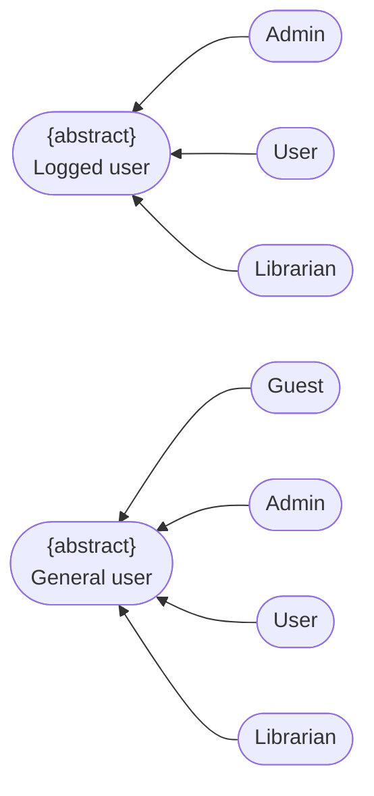
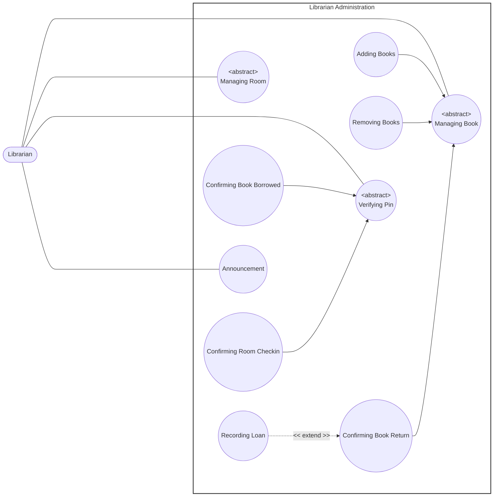
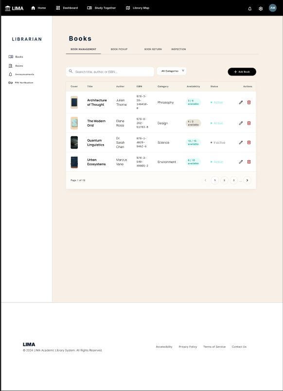
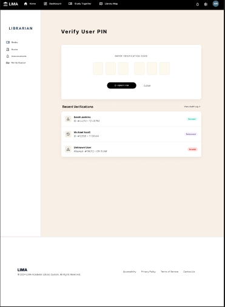
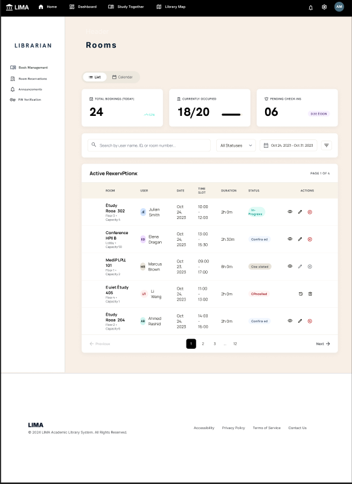

# Use-Case Specification: Librarian Administration

    Project Name: Modern Library Management System
    Course: CS300 – CSC13002 – Introduction to Software Engineering 
    Group ID: 03
    Group Name: Amethyst
    Assignment: PA3-2026
    Document Identifier: NGLP-SRS-LIB-001
    Version: 1.1

Performed by: Trần Lê Hoàng Gia, Phan Lê Anh Minh | Reviewed by: All Members | Edited by: Trần Lê Hoàng Gia, Phan Lê Anh Minh

---

## Revision History

| Date | Version | Description | Author |
| --- | --- | --- | --- |
| 21-Jul-2026 | 1.1 | Librarian Administration use case specification (RUP specification layout). | Phan Lê Anh Minh, Trần Lê Hoàng Gia |

---

## Table of Contents
1. [Regulation](#regulation)
2. [Use case diagram](#use-case-diagram)
3. [UC-LIB-01: Adding Books](#uc-lib-01-adding-books)
4. [UC-LIB-02: Removing Books](#uc-lib-02-removing-books)
5. [UC-LIB-03: Confirming Book Return](#uc-lib-03-confirming-book-return)
6. [UC-LIB-04: Recording Loan](#uc-lib-04-recording-loan)
7. [UC-LIB-05: Confirming Book Borrowed](#uc-lib-05-confirming-book-borrowed)
8. [UC-LIB-06: Confirming Room Checkin](#uc-lib-06-confirming-room-checkin)
9. [UC-LIB-07: Announcement](#uc-lib-07-announcement)

---

## Regulation

---

## Use case diagram

---
## UC-LIB-01: Adding Books

<table width="100%" border="1" cellpadding="8" cellspacing="0" style="border-collapse: collapse; font-family: Arial, sans-serif; font-size: 14px; border: 1px solid #d1d5db; margin-bottom: 20px;">
  <thead>
    <tr style="background-color: #1e3a8a; color: #ffffff;">
      <th colspan="2" style="text-align: left; padding: 12px; font-size: 16px;">
        Use Case: Adding Books
      </th>
    </tr>
  </thead>
  <tbody>
    <tr>
      <td width="22%" style="background-color: #f8fafc; font-weight: bold; vertical-align: top;">Use Case ID</td>
      <td style="vertical-align: top;"><strong>UC-LIB-01</strong></td>
    </tr>
    <tr>
      <td style="background-color: #f8fafc; font-weight: bold; vertical-align: top;">Brief Description</td>
      <td style="vertical-align: top;">
        Allows the Librarian to add a new book record to the library catalog.
      </td>
    </tr>
    <tr>
      <td style="background-color: #f8fafc; font-weight: bold; vertical-align: top;">Actor(s)</td>
      <td style="vertical-align: top;">Librarian</td>
    </tr>
    <tr>
      <td style="background-color: #f8fafc; font-weight: bold; vertical-align: top;">Preconditions</td>
      <td style="vertical-align: top;">
        <ul style="margin: 0; padding-left: 20px; line-height: 1.5;">
          <li><strong>Verified Authentication State:</strong> The Librarian has successfully authenticated.</li>
          <li><strong>Catalog Uniqueness Check:</strong> The book to be added does not already exist in the catalog.</li>
        </ul>
      </td>
    </tr>
    <tr>
      <td style="background-color: #f8fafc; font-weight: bold; vertical-align: top;">Flow of Events (Basic Flow)</td>
      <td style="vertical-align: top;">
        <ol style="margin: 0; padding-left: 20px; line-height: 1.6;">
          <li><strong>[Actor Action]:</strong> The Librarian selects the "Add Book" option.</li>
          <li><strong>[System Response]:</strong> The system displays the book entry form.</li>
          <li><strong>[Actor Action]:</strong> The Librarian enters the book's details, including title and author.</li>
          <li><strong>[Actor Action]:</strong> The Librarian submits the form.</li>
          <li><strong>[Data Processing]:</strong> The system validates the entered data and confirms the book is not already in the catalog.</li>
          <li><strong>[Data Processing]:</strong> The system stores the new book record.</li>
          <li><strong>[Display Result]:</strong> The system confirms the addition to the Librarian.</li>
        </ol>
      </td>
    </tr>
    <tr>
      <td style="background-color: #f8fafc; font-weight: bold; vertical-align: top;">Alternative / Exception Flows</td>
      <td style="vertical-align: top;">
        <ul style="margin: 0; padding-left: 20px; line-height: 1.5;">
          <li style="margin-bottom: 8px;">
            <strong>Invalid or Duplicate Data (Step 5):</strong> If the entered data is invalid or matches an existing catalog entry:
            <ol style="margin-top: 4px; margin-bottom: 4px; padding-left: 20px;">
              <li>The system rejects the submission.</li>
              <li>The system displays an error message and prompts the Librarian to correct the entry.</li>
            </ol>
            <strong>Postcondition (Alternative Flow):</strong> No new book record is created; the entry form remains open pending correction.
          </li>
        </ul>
      </td>
    </tr>
    <tr>
      <td style="background-color: #f8fafc; font-weight: bold; vertical-align: top;">Postconditions</td>
      <td style="vertical-align: top;">
        <ul style="margin: 0; padding-left: 20px;">
          <li><strong>Catalog Update:</strong> A new book record is stored in the catalog and becomes available for borrowing.</li>
        </ul>
      </td>
    </tr>
    <tr>
      <td style="background-color: #f8fafc; font-weight: bold; vertical-align: top;">Special Requirements</td>
      <td style="vertical-align: top;">
        <ul style="margin: 0; padding-left: 20px;">
          <li><strong>Catalog Uniqueness:</strong> Each book's identifying information must be unique within the catalog.</li>
        </ul>
      </td>
    </tr>
    <tr>
      <td style="background-color: #f8fafc; font-weight: bold; vertical-align: top;">Extension Points</td>
      <td style="vertical-align: top;">
        None
      </td>
    </tr>
    <tr>
      <td style="background-color: #f8fafc; font-weight: bold; vertical-align: top;">Prototype Screen</td>
      <td style="vertical-align: top;">
        
      </td>
    </tr>
  </tbody>
</table>

---

## UC-LIB-02: Removing Books

<table width="100%" border="1" cellpadding="8" cellspacing="0" style="border-collapse: collapse; font-family: Arial, sans-serif; font-size: 14px; border: 1px solid #d1d5db; margin-bottom: 20px;">
  <thead>
    <tr style="background-color: #1e3a8a; color: #ffffff;">
      <th colspan="2" style="text-align: left; padding: 12px; font-size: 16px;">
        Use Case: Removing Books
      </th>
    </tr>
  </thead>
  <tbody>
    <tr>
      <td width="22%" style="background-color: #f8fafc; font-weight: bold; vertical-align: top;">Use Case ID</td>
      <td style="vertical-align: top;"><strong>UC-LIB-02</strong></td>
    </tr>
    <tr>
      <td style="background-color: #f8fafc; font-weight: bold; vertical-align: top;">Brief Description</td>
      <td style="vertical-align: top;">
        Allows the Librarian to remove an existing book record from the library catalog.
      </td>
    </tr>
    <tr>
      <td style="background-color: #f8fafc; font-weight: bold; vertical-align: top;">Actor(s)</td>
      <td style="vertical-align: top;">Librarian</td>
    </tr>
    <tr>
      <td style="background-color: #f8fafc; font-weight: bold; vertical-align: top;">Preconditions</td>
      <td style="vertical-align: top;">
        <ul style="margin: 0; padding-left: 20px; line-height: 1.5;">
          <li><strong>Verified Authentication State:</strong> The Librarian has successfully authenticated.</li>
          <li><strong>Existing Catalog Entry:</strong> The book to be removed exists in the catalog.</li>
        </ul>
      </td>
    </tr>
    <tr>
      <td style="background-color: #f8fafc; font-weight: bold; vertical-align: top;">Flow of Events (Basic Flow)</td>
      <td style="vertical-align: top;">
        <ol style="margin: 0; padding-left: 20px; line-height: 1.6;">
          <li><strong>[Actor Action]:</strong> The Librarian selects the "Remove Book" option.</li>
          <li><strong>[System Response]:</strong> The system displays a book search interface.</li>
          <li><strong>[Actor Action]:</strong> The Librarian searches for and selects the book to remove.</li>
          <li><strong>[Data Processing]:</strong> The system checks the book's current loan status.</li>
          <li><strong>[Actor Action]:</strong> The Librarian confirms the removal.</li>
          <li><strong>[Data Processing]:</strong> The system removes the book record.</li>
          <li><strong>[Display Result]:</strong> The system confirms the removal to the Librarian.</li>
        </ol>
      </td>
    </tr>
    <tr>
      <td style="background-color: #f8fafc; font-weight: bold; vertical-align: top;">Alternative / Exception Flows</td>
      <td style="vertical-align: top;">
        <ul style="margin: 0; padding-left: 20px; line-height: 1.5;">
          <li style="margin-bottom: 8px;">
            <strong>Book Currently on Loan (Step 4):</strong> If the selected book is currently on loan:
            <ol style="margin-top: 4px; margin-bottom: 4px; padding-left: 20px;">
              <li>The system prevents the removal.</li>
              <li>The system displays a warning to the Librarian.</li>
            </ol>
            <strong>Postcondition (Alternative Flow):</strong> No removal is performed; the book record remains unchanged.
          </li>
        </ul>
      </td>
    </tr>
    <tr>
      <td style="background-color: #f8fafc; font-weight: bold; vertical-align: top;">Postconditions</td>
      <td style="vertical-align: top;">
        <ul style="margin: 0; padding-left: 20px;">
          <li><strong>Catalog Update:</strong> The selected book record is removed from the catalog.</li>
        </ul>
      </td>
    </tr>
    <tr>
      <td style="background-color: #f8fafc; font-weight: bold; vertical-align: top;">Special Requirements</td>
      <td style="vertical-align: top;">
        <ul style="margin: 0; padding-left: 20px;">
          <li><strong>Loan Status Restriction:</strong> A book that is currently on loan cannot be removed until it is returned.</li>
        </ul>
      </td>
    </tr>
    <tr>
      <td style="background-color: #f8fafc; font-weight: bold; vertical-align: top;">Extension Points</td>
      <td style="vertical-align: top;">
        None
      </td>
    </tr>
    <tr>
      <td style="background-color: #f8fafc; font-weight: bold; vertical-align: top;">Prototype Screen</td>
      <td style="vertical-align: top;">
        
      </td>
    </tr>
  </tbody>
</table>

---

## UC-LIB-03: Confirming Book Return

<table width="100%" border="1" cellpadding="8" cellspacing="0" style="border-collapse: collapse; font-family: Arial, sans-serif; font-size: 14px; border: 1px solid #d1d5db; margin-bottom: 20px;">
  <thead>
    <tr style="background-color: #1e3a8a; color: #ffffff;">
      <th colspan="2" style="text-align: left; padding: 12px; font-size: 16px;">
        Use Case: Confirming Book Return
      </th>
    </tr>
  </thead>
  <tbody>
    <tr>
      <td width="22%" style="background-color: #f8fafc; font-weight: bold; vertical-align: top;">Use Case ID</td>
      <td style="vertical-align: top;"><strong>UC-LIB-03</strong></td>
    </tr>
    <tr>
      <td style="background-color: #f8fafc; font-weight: bold; vertical-align: top;">Brief Description</td>
      <td style="vertical-align: top;">
        Allows the Librarian to confirm that a borrowed book has been physically returned, updating the associated loan record.
         <em>(Includes / Extends: <strong>Extended by Recording Loan (at Step 5).</strong>)</em>
      </td>
    </tr>
    <tr>
      <td style="background-color: #f8fafc; font-weight: bold; vertical-align: top;">Actor(s)</td>
      <td style="vertical-align: top;">Librarian</td>
    </tr>
    <tr>
      <td style="background-color: #f8fafc; font-weight: bold; vertical-align: top;">Preconditions</td>
      <td style="vertical-align: top;">
        <ul style="margin: 0; padding-left: 20px; line-height: 1.5;">
          <li><strong>Verified Authentication State:</strong> The Librarian has successfully authenticated.</li>
          <li><strong>Active Loan Record:</strong> An active loan record exists for the book being returned.</li>
        </ul>
      </td>
    </tr>
    <tr>
      <td style="background-color: #f8fafc; font-weight: bold; vertical-align: top;">Flow of Events (Basic Flow)</td>
      <td style="vertical-align: top;">
        <ol style="margin: 0; padding-left: 20px; line-height: 1.6;">
          <li><strong>[Actor Action]:</strong> The Librarian selects the "Confirm Book Return" option.</li>
          <li><strong>[System Response]:</strong> The system displays a search interface for active loans.</li>
          <li><strong>[Actor Action]:</strong> The Librarian selects or scans the book being returned.</li>
          <li><strong>[Data Processing]:</strong> The system marks the associated loan record as returned and updates the book's availability.</li>
          <li><strong>[System Response]:</strong> The system confirms the return and exposes the option to record a new loan for the returned book.</li>
        </ol>
      </td>
    </tr>
    <tr>
      <td style="background-color: #f8fafc; font-weight: bold; vertical-align: top;">Alternative / Exception Flows</td>
      <td style="vertical-align: top;">
        <ul style="margin: 0; padding-left: 20px; line-height: 1.5;">
          <li style="margin-bottom: 8px;">
            <strong>Record New Loan (Step 5):</strong> If the Librarian chooses to loan the returned book to another member immediately:
            <ol style="margin-top: 4px; margin-bottom: 4px; padding-left: 20px;">
              <li>The system invokes Recording Loan (UC-LIB-05).</li>
              <li>Control returns to this use case upon completion, and the use case ends.</li>
            </ol>
            <strong>Postcondition (Alternative Flow):</strong> Control passes to UC-LIB-05 (Recording Loan); the postconditions of that use case apply upon completion.
          </li>
        </ul>
      </td>
    </tr>
    <tr>
      <td style="background-color: #f8fafc; font-weight: bold; vertical-align: top;">Postconditions</td>
      <td style="vertical-align: top;">
        <ul style="margin: 0; padding-left: 20px;">
          <li><strong>Loan Closure:</strong> The loan record is marked as returned and the book is marked as available.</li>
        </ul>
      </td>
    </tr>
    <tr>
      <td style="background-color: #f8fafc; font-weight: bold; vertical-align: top;">Special Requirements</td>
      <td style="vertical-align: top;">
        <ul style="margin: 0; padding-left: 20px;">
          <li><strong>Extension Timing:</strong> The option to record a new loan is available only after the return has been confirmed; invoking it is optional.</li>
        </ul>
      </td>
    </tr>
    <tr>
      <td style="background-color: #f8fafc; font-weight: bold; vertical-align: top;">Extension Points</td>
      <td style="vertical-align: top;">
        <ul style="margin: 0; padding-left: 20px;">
          <li><strong>Recording Loan:</strong> Location inside event flow: After the return is confirmed (Step 5).</li>
        </ul>
      </td>
    </tr>
    <tr>
      <td style="background-color: #f8fafc; font-weight: bold; vertical-align: top;">Prototype Screen</td>
      <td style="vertical-align: top;">
        
      </td>
    </tr>
  </tbody>
</table>

---

## UC-LIB-04: Recording Loan

<table width="100%" border="1" cellpadding="8" cellspacing="0" style="border-collapse: collapse; font-family: Arial, sans-serif; font-size: 14px; border: 1px solid #d1d5db; margin-bottom: 20px;">
  <thead>
    <tr style="background-color: #1e3a8a; color: #ffffff;">
      <th colspan="2" style="text-align: left; padding: 12px; font-size: 16px;">
        Use Case: Recording Loan
      </th>
    </tr>
  </thead>
  <tbody>
    <tr>
      <td width="22%" style="background-color: #f8fafc; font-weight: bold; vertical-align: top;">Use Case ID</td>
      <td style="vertical-align: top;"><strong>UC-LIB-04</strong></td>
    </tr>
    <tr>
      <td style="background-color: #f8fafc; font-weight: bold; vertical-align: top;">Brief Description</td>
      <td style="vertical-align: top;">
        Extends Confirming Book Return to let the Librarian record a new loan of a book to a member. It may also be initiated directly, outside the extension point.
         <em>(Includes / Extends: <strong>Extends UC-LIB-04 (Confirming Book Return) at Step 5 when the Librarian chooses to loan the returned book to another member.</strong>)</em>
      </td>
    </tr>
    <tr>
      <td style="background-color: #f8fafc; font-weight: bold; vertical-align: top;">Actor(s)</td>
      <td style="vertical-align: top;">Librarian</td>
    </tr>
    <tr>
      <td style="background-color: #f8fafc; font-weight: bold; vertical-align: top;">Preconditions</td>
      <td style="vertical-align: top;">
        <ul style="margin: 0; padding-left: 20px; line-height: 1.5;">
          <li><strong>Verified Authentication State:</strong> The Librarian has successfully authenticated.</li>
          <li><strong>Selected Book and Member:</strong> The selected book exists in the catalog and a member has been identified.</li>
        </ul>
      </td>
    </tr>
    <tr>
      <td style="background-color: #f8fafc; font-weight: bold; vertical-align: top;">Flow of Events (Basic Flow)</td>
      <td style="vertical-align: top;">
        <ol style="margin: 0; padding-left: 20px; line-height: 1.6;">
          <li><strong>[Actor Action]:</strong> The Librarian initiates loan recording, either directly or via the extension point of Confirming Book Return.</li>
          <li><strong>[Actor Action]:</strong> The Librarian enters or selects the member's identification.</li>
          <li><strong>[Actor Action]:</strong> The Librarian selects the book to be loaned.</li>
          <li><strong>[Data Processing]:</strong> The system validates the member's eligibility and the book's availability.</li>
          <li><strong>[Data Processing]:</strong> The system creates a new loan record and calculates the due date.</li>
          <li><strong>[Display Result]:</strong> The system confirms the recorded loan to the Librarian.</li>
        </ol>
      </td>
    </tr>
    <tr>
      <td style="background-color: #f8fafc; font-weight: bold; vertical-align: top;">Alternative / Exception Flows</td>
      <td style="vertical-align: top;">
        <ul style="margin: 0; padding-left: 20px; line-height: 1.5;">
          <li style="margin-bottom: 8px;">
            <strong>Member Ineligible (Step 4):</strong> If the member is not eligible to borrow:
            <ol style="margin-top: 4px; margin-bottom: 4px; padding-left: 20px;">
              <li>The system denies the loan.</li>
              <li>The system displays the reason to the Librarian.</li>
            </ol>
            <strong>Postcondition (Alternative Flow):</strong> No loan record is created.
          </li>
        </ul>
      </td>
    </tr>
    <tr>
      <td style="background-color: #f8fafc; font-weight: bold; vertical-align: top;">Postconditions</td>
      <td style="vertical-align: top;">
        <ul style="margin: 0; padding-left: 20px;">
          <li><strong>Loan Creation:</strong> A new loan record is created and the selected book is marked as on loan.</li>
        </ul>
      </td>
    </tr>
    <tr>
      <td style="background-color: #f8fafc; font-weight: bold; vertical-align: top;">Special Requirements</td>
      <td style="vertical-align: top;">
        <ul style="margin: 0; padding-left: 20px;">
          <li><strong>Due Date Calculation:</strong> The due date is calculated according to the library's loan policy.</li>
        </ul>
      </td>
    </tr>
    <tr>
      <td style="background-color: #f8fafc; font-weight: bold; vertical-align: top;">Extension Points</td>
      <td style="vertical-align: top;">
        None
      </td>
    </tr>
    <tr>
      <td style="background-color: #f8fafc; font-weight: bold; vertical-align: top;">Prototype Screen</td>
      <td style="vertical-align: top;">
        
      </td>
    </tr>
  </tbody>
</table>

---

## UC-LIB-05: Confirming Book Borrowed

<table width="100%" border="1" cellpadding="8" cellspacing="0" style="border-collapse: collapse; font-family: Arial, sans-serif; font-size: 14px; border: 1px solid #d1d5db; margin-bottom: 20px;">
  <thead>
    <tr style="background-color: #1e3a8a; color: #ffffff;">
      <th colspan="2" style="text-align: left; padding: 12px; font-size: 16px;">
        Use Case: Confirming Book Borrowed
      </th>
    </tr>
  </thead>
  <tbody>
    <tr>
      <td width="22%" style="background-color: #f8fafc; font-weight: bold; vertical-align: top;">Use Case ID</td>
      <td style="vertical-align: top;"><strong>UC-LIB-05</strong></td>
    </tr>
    <tr>
      <td style="background-color: #f8fafc; font-weight: bold; vertical-align: top;">Brief Description</td>
      <td style="vertical-align: top;">
        Allows the Librarian to confirm a book borrowing transaction by verifying the borrowing member's PIN.
      </td>
    </tr>
    <tr>
      <td style="background-color: #f8fafc; font-weight: bold; vertical-align: top;">Actor(s)</td>
      <td style="vertical-align: top;">Librarian</td>
    </tr>
    <tr>
      <td style="background-color: #f8fafc; font-weight: bold; vertical-align: top;">Preconditions</td>
      <td style="vertical-align: top;">
        <ul style="margin: 0; padding-left: 20px; line-height: 1.5;">
          <li><strong>Verified Authentication State:</strong> The Librarian has successfully authenticated.</li>
          <li><strong>Pending Transaction:</strong> A book borrowing transaction is in progress and awaiting confirmation.</li>
        </ul>
      </td>
    </tr>
    <tr>
      <td style="background-color: #f8fafc; font-weight: bold; vertical-align: top;">Flow of Events (Basic Flow)</td>
      <td style="vertical-align: top;">
        <ol style="margin: 0; padding-left: 20px; line-height: 1.6;">
          <li><strong>[Actor Action]:</strong> The Librarian initiates confirmation of the book borrowing transaction.</li>
          <li><strong>[System Response]:</strong> The system prompts for the member's PIN.</li>
          <li><strong>[Actor Action]:</strong> The Librarian enters the member's PIN.</li>
          <li><strong>[Data Processing]:</strong> The system verifies the PIN against the member's record.</li>
          <li><strong>[Data Processing]:</strong> The system marks the transaction as confirmed and logs the confirmation.</li>
        </ol>
      </td>
    </tr>
    <tr>
      <td style="background-color: #f8fafc; font-weight: bold; vertical-align: top;">Alternative / Exception Flows</td>
      <td style="vertical-align: top;">
        <ul style="margin: 0; padding-left: 20px; line-height: 1.5;">
          <li style="margin-bottom: 8px;">
            <strong>Incorrect PIN (Step 4):</strong> If the entered PIN is invalid:
            <ol style="margin-top: 4px; margin-bottom: 4px; padding-left: 20px;">
              <li>The system displays an error message.</li>
              <li>The flow returns to Basic Flow step 2.</li>
            </ol>
            <strong>Postcondition (Alternative Flow):</strong> The borrowing transaction remains unconfirmed.
          </li>
        </ul>
      </td>
    </tr>
    <tr>
      <td style="background-color: #f8fafc; font-weight: bold; vertical-align: top;">Postconditions</td>
      <td style="vertical-align: top;">
        <ul style="margin: 0; padding-left: 20px;">
          <li><strong>Transaction Confirmation:</strong> The member's identity is verified and the borrowing transaction is confirmed.</li>
        </ul>
      </td>
    </tr>
    <tr>
      <td style="background-color: #f8fafc; font-weight: bold; vertical-align: top;">Special Requirements</td>
      <td style="vertical-align: top;">
        <ul style="margin: 0; padding-left: 20px;">
          <li><strong>Attempt Limiting:</strong> The system should limit the number of consecutive invalid PIN attempts.</li>
        </ul>
      </td>
    </tr>
    <tr>
      <td style="background-color: #f8fafc; font-weight: bold; vertical-align: top;">Extension Points</td>
      <td style="vertical-align: top;">
        None
      </td>
    </tr>
    <tr>
      <td style="background-color: #f8fafc; font-weight: bold; vertical-align: top;">Prototype Screen</td>
      <td style="vertical-align: top;">
        
      </td>
    </tr>
  </tbody>
</table>

---

## UC-LIB-06: Confirming Room Checkin

<table width="100%" border="1" cellpadding="8" cellspacing="0" style="border-collapse: collapse; font-family: Arial, sans-serif; font-size: 14px; border: 1px solid #d1d5db; margin-bottom: 20px;">
  <thead>
    <tr style="background-color: #1e3a8a; color: #ffffff;">
      <th colspan="2" style="text-align: left; padding: 12px; font-size: 16px;">
        Use Case: Confirming Room Checkin
      </th>
    </tr>
  </thead>
  <tbody>
    <tr>
      <td width="22%" style="background-color: #f8fafc; font-weight: bold; vertical-align: top;">Use Case ID</td>
      <td style="vertical-align: top;"><strong>UC-LIB-06</strong></td>
    </tr>
    <tr>
      <td style="background-color: #f8fafc; font-weight: bold; vertical-align: top;">Brief Description</td>
      <td style="vertical-align: top;">
        Allows the Librarian to confirm a member's check-in to a library room by verifying the member's PIN.
      </td>
    </tr>
    <tr>
      <td style="background-color: #f8fafc; font-weight: bold; vertical-align: top;">Actor(s)</td>
      <td style="vertical-align: top;">Librarian</td>
    </tr>
    <tr>
      <td style="background-color: #f8fafc; font-weight: bold; vertical-align: top;">Preconditions</td>
      <td style="vertical-align: top;">
        <ul style="margin: 0; padding-left: 20px; line-height: 1.5;">
          <li><strong>Verified Authentication State:</strong> The Librarian has successfully authenticated.</li>
          <li><strong>Pending Transaction:</strong> A room check-in transaction is in progress and awaiting confirmation.</li>
        </ul>
      </td>
    </tr>
    <tr>
      <td style="background-color: #f8fafc; font-weight: bold; vertical-align: top;">Flow of Events (Basic Flow)</td>
      <td style="vertical-align: top;">
        <ol style="margin: 0; padding-left: 20px; line-height: 1.6;">
          <li><strong>[Actor Action]:</strong> The Librarian initiates confirmation of the room check-in transaction.</li>
          <li><strong>[System Response]:</strong> The system prompts for the member's PIN.</li>
          <li><strong>[Actor Action]:</strong> The Librarian enters the member's PIN.</li>
          <li><strong>[Data Processing]:</strong> The system verifies the PIN against the member's record.</li>
          <li><strong>[Data Processing]:</strong> The system marks the member as checked into the room and logs the confirmation.</li>
        </ol>
      </td>
    </tr>
    <tr>
      <td style="background-color: #f8fafc; font-weight: bold; vertical-align: top;">Alternative / Exception Flows</td>
      <td style="vertical-align: top;">
        <ul style="margin: 0; padding-left: 20px; line-height: 1.5;">
          <li style="margin-bottom: 8px;">
            <strong>Incorrect PIN (Step 4):</strong> If the entered PIN is invalid:
            <ol style="margin-top: 4px; margin-bottom: 4px; padding-left: 20px;">
              <li>The system displays an error message.</li>
              <li>The flow returns to Basic Flow step 2.</li>
            </ol>
            <strong>Postcondition (Alternative Flow):</strong> The room check-in remains unconfirmed.
          </li>
        </ul>
      </td>
    </tr>
    <tr>
      <td style="background-color: #f8fafc; font-weight: bold; vertical-align: top;">Postconditions</td>
      <td style="vertical-align: top;">
        <ul style="margin: 0; padding-left: 20px;">
          <li><strong>Transaction Confirmation:</strong> The member's identity is verified and the member is confirmed as checked into the room.</li>
        </ul>
      </td>
    </tr>
    <tr>
      <td style="background-color: #f8fafc; font-weight: bold; vertical-align: top;">Special Requirements</td>
      <td style="vertical-align: top;">
        <ul style="margin: 0; padding-left: 20px;">
          <li><strong>Attempt Limiting:</strong> The system should limit the number of consecutive invalid PIN attempts.</li>
        </ul>
      </td>
    </tr>
    <tr>
      <td style="background-color: #f8fafc; font-weight: bold; vertical-align: top;">Extension Points</td>
      <td style="vertical-align: top;">
        None
      </td>
    </tr>
    <tr>
      <td style="background-color: #f8fafc; font-weight: bold; vertical-align: top;">Prototype Screen</td>
      <td style="vertical-align: top;">
        
      </td>
    </tr>
  </tbody>
</table>

---

## UC-LIB-07: Announcement

<table width="100%" border="1" cellpadding="8" cellspacing="0" style="border-collapse: collapse; font-family: Arial, sans-serif; font-size: 14px; border: 1px solid #d1d5db; margin-bottom: 20px;">
  <thead>
    <tr style="background-color: #1e3a8a; color: #ffffff;">
      <th colspan="2" style="text-align: left; padding: 12px; font-size: 16px;">
        Use Case: Announcement
      </th>
    </tr>
  </thead>
  <tbody>
    <tr>
      <td width="22%" style="background-color: #f8fafc; font-weight: bold; vertical-align: top;">Use Case ID</td>
      <td style="vertical-align: top;"><strong>UC-LIB-07</strong></td>
    </tr>
    <tr>
      <td style="background-color: #f8fafc; font-weight: bold; vertical-align: top;">Brief Description</td>
      <td style="vertical-align: top;">
        Allows the Librarian to create and publish an announcement for library members.
      </td>
    </tr>
    <tr>
      <td style="background-color: #f8fafc; font-weight: bold; vertical-align: top;">Actor(s)</td>
      <td style="vertical-align: top;">Librarian</td>
    </tr>
    <tr>
      <td style="background-color: #f8fafc; font-weight: bold; vertical-align: top;">Preconditions</td>
      <td style="vertical-align: top;">
        <ul style="margin: 0; padding-left: 20px; line-height: 1.5;">
          <li><strong>Verified Authentication State:</strong> The Librarian has successfully authenticated.</li>
        </ul>
      </td>
    </tr>
    <tr>
      <td style="background-color: #f8fafc; font-weight: bold; vertical-align: top;">Flow of Events (Basic Flow)</td>
      <td style="vertical-align: top;">
        <ol style="margin: 0; padding-left: 20px; line-height: 1.6;">
          <li><strong>[Actor Action]:</strong> The Librarian selects the "Create Announcement" option.</li>
          <li><strong>[System Response]:</strong> The system displays the announcement entry form.</li>
          <li><strong>[Actor Action]:</strong> The Librarian enters the announcement details.</li>
          <li><strong>[Actor Action]:</strong> The Librarian submits the announcement.</li>
          <li><strong>[Data Processing]:</strong> The system validates the content and publishes the announcement.</li>
          <li><strong>[Display Result]:</strong> The system confirms the publication to the Librarian.</li>
        </ol>
      </td>
    </tr>
    <tr>
      <td style="background-color: #f8fafc; font-weight: bold; vertical-align: top;">Alternative / Exception Flows</td>
      <td style="vertical-align: top;">
        <ul style="margin: 0; padding-left: 20px; line-height: 1.5;">
          <li style="margin-bottom: 8px;">
            <strong>Invalid Content (Step 5):</strong> If required fields are missing or the content is invalid:
            <ol style="margin-top: 4px; margin-bottom: 4px; padding-left: 20px;">
              <li>The system rejects the submission.</li>
              <li>The system displays a validation error and prompts the Librarian to correct the entry.</li>
            </ol>
            <strong>Postcondition (Alternative Flow):</strong> No announcement is published; the entry form remains open pending correction.
          </li>
        </ul>
      </td>
    </tr>
    <tr>
      <td style="background-color: #f8fafc; font-weight: bold; vertical-align: top;">Postconditions</td>
      <td style="vertical-align: top;">
        <ul style="margin: 0; padding-left: 20px;">
          <li><strong>Publication:</strong> The announcement is published and stored in the system.</li>
        </ul>
      </td>
    </tr>
    <tr>
      <td style="background-color: #f8fafc; font-weight: bold; vertical-align: top;">Special Requirements</td>
      <td style="vertical-align: top;">
        <ul style="margin: 0; padding-left: 20px;">
          <li><strong>Content Validation:</strong> Required fields, such as title and content, must be validated before publication.</li>
        </ul>
      </td>
    </tr>
    <tr>
      <td style="background-color: #f8fafc; font-weight: bold; vertical-align: top;">Extension Points</td>
      <td style="vertical-align: top;">
        None
      </td>
    </tr>
    <tr>
      <td style="background-color: #f8fafc; font-weight: bold; vertical-align: top;">Prototype Screen</td>
      <td style="vertical-align: top;">
        
      </td>
    </tr>
  </tbody>
</table>
