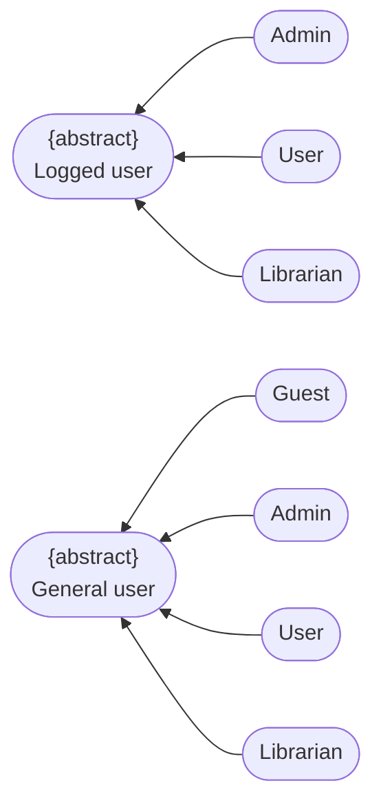
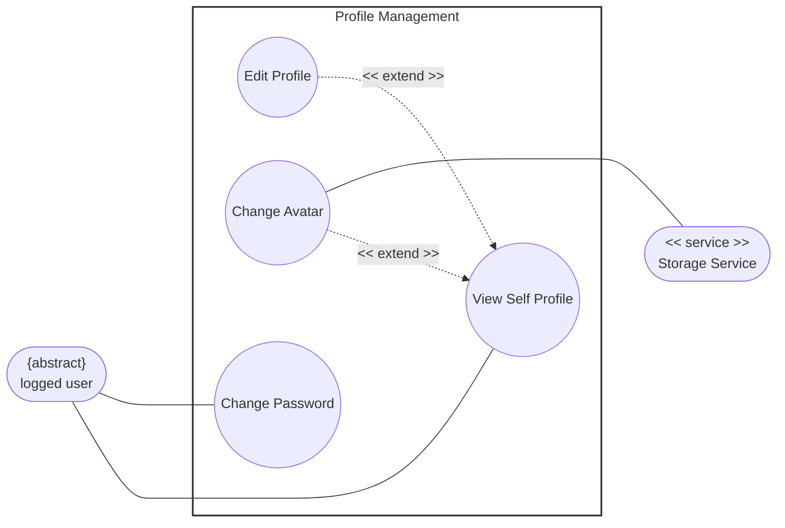

# Use-Case Specification: Profile Management

    Project Name: Modern Library Management System
    Course: CS300 – CSC13002 – Introduction to Software Engineering 
    Group ID: 03
    Group Name: Amethyst
    Assignment: PA3-2026
    Document Identifier: NGLP-SRS-PROF-001
    Version: 1.1

Performed by: Trần Lê Hoàng Gia, Phan Lê Anh Minh | Reviewed by: All Members | Edited by: Trần Lê Hoàng Gia, Phan Lê Anh Minh

---

## Revision History

| Date | Version | Description | Author |
| --- | --- | --- | --- |
| 20-Jul-2026 | 1.1 | Profile Management Use case specification(RUP specification layout). | Anh Minh, Hoang Gia |

---

## Table of Contents
1. [Regulation](#regulation)
2. [Use case diagram](#use-case-diagram)
3. [UC-PROF-01: View Self Profile](#uc-prof-01-view-self-profile)
4. [UC-PROF-02: Edit Profile](#uc-prof-02-edit-profile)
5. [UC-PROF-03: Change Avatar](#uc-prof-03-change-avatar)
6. [UC-PROF-04: Change Password](#uc-prof-04-change-password)

---

## Regulation

---

## Use case diagram

---

## UC-PROF-01: View Self Profile

*Extended by Edit Profile and Change Avatar (at Step 5).* 

### 1. Use-Case Name

View Self Profile 

#### 1.1 Brief Description

Allows an authenticated user to view their personal profile page dashboard, showcasing their account metadata, current avatar, and personal details. 

### 2. Flow of Events

#### 2.1 Basic Flow

1. **[Actor Action]**: The user clicks on the "My Profile" item link within the primary navigation menu layout. 
2. **[Data Processing]**: The system fetches the corresponding profile record metrics from the user database partition. 
3. **[Display Result]**: The system maps and populates user data fields (Display Name, Account Email, Registration Date) into the view interface template. 
4. **[Display Result]**: The system requests the active profile image thumbnail link to render the user's avatar image block. 
5. **[System Response]**: The system exposes extension interface interaction triggers ("Edit Profile" and "Change Avatar" button widgets). 

#### 2.2 Alternative Flows

##### 2.2.1 Database Partition Retrieval Failure (Step 2)

If profile data records fail to resolve due to localized database connection drops:

1. The system halts the dashboard layout compilation steps immediately. 
2. The system overlays a persistent error component banner layout: "Profile details are temporarily offline." 

* **Postcondition (Alternative Flow):** The screen display shows a structural retrieval error indicator; no empty form entry containers open. 

### 3. Special Requirements

#### 3.1 Sensitive Session Token Masking

The profile dashboard viewport screen must obscure highly sensitive configuration values (such as underlying token identifiers) from plain view elements. 

### 4. Preconditions

#### 4.1 Verified Authentication State

The user has successfully authenticated and holds an active session token. 

#### 4.2 Workspace Navigation Focus

The user has navigated to the account settings layout area. 

### 5. Postconditions

#### 5.1 Dashboard UI Component Staging

The user's complete private profile view profile template renders securely onto the client interface screen. 

### 6. Extension Points

#### 6.1 Edit Profile

* Location inside event flow: Exposing extension interface triggers (Step 5). 

#### 6.2 Change Avatar

* Location inside event flow: Exposing extension interface triggers (Step 5). 

---

## UC-PROF-02: Edit Profile

*Extends UC-PROF-01 (View Self Profile) — extension point: User triggers the active "Edit Profile" control button link within the profile dashboard view layout.* 

### 1. Use-Case Name

Edit Profile 

#### 1.1 Brief Description

Extends the basic profile view dashboard by converting plain-text data fields into dynamic, editable input forms to let users update their personal details. 

### 2. Flow of Events

#### 2.1 Basic Flow

1. **[Actor Action]**: The user clicks the "Edit Profile" action button component widget. 
2. **[System Response]**: The system toggles the dashboard interface layout state variables, swapping static display texts for live text input boxes. 
3. **[Actor Action]**: The user modifies targeted data entry string values (e.g., changes their Display Name or Bio summary details). 
4. **[Actor Action]**: The user clicks the "Save Changes" configuration submit button. 
5. **[Data Processing]**: The system parses inputs, sanitizes string objects, and executes a database update sequence transaction against the target user data row columns. 
6. **[Display Result]**: The system switches the view screen state criteria back to the standard text-display layout mode and surfaces a brief confirmation success toast banner notice. 

#### 2.2 Alternative Flows

##### 2.2.1 Lexical Parsing Constraints Rejection (Step 5)

If input text parsing rules flag validation constraint breakages (e.g. illegal structural characters in name elements):

1. The system prevents data persistence steps. 
2. The system returns visual focus to the problem field element and displays explicit inline error tips. 

* **Postcondition (Alternative Flow):** Database table values remain locked to historical state values; the input edit layout remains active pending string correction actions. 

### 3. Special Requirements

None. 

### 4. Preconditions

#### 4.1 Active Base Context Display

The base use case `View Self Profile (UC-PROF-01)` must be currently active and rendering data on screen. 

### 5. Postconditions

#### 5.1 Global Variable Synchronization

Revised personal metadata values write securely to production databases and update globally across active user session viewports. 

### 6. Extension Points

None.

### 7. Prototype screen

---

## UC-PROF-03: Change Avatar

*Extends UC-PROF-01 (View Self Profile) — extension point: User selects the profile picture thumbnail element or clicks the "Change Avatar" button action link.* 

### 1. Use-Case Name

Change Avatar 

#### 1.1 Brief Description

Extends the base profile display context to allow users to upload, process, and attach a customized picture graphic to act as their system identity avatar icon. 

### 2. Flow of Events

#### 2.1 Basic Flow

1. **[Actor Action]**: The user clicks on the "Change Avatar" image editing control button widget. 
2. **[System Response]**: The system triggers a local device filesystem upload dialogue wrapper window prompt. 
3. **[Actor Action]**: The user selects a target image file object and approves submission steps. 
4. **[Data Processing]**: The system validates the asset metadata properties client-side to verify file configuration boundaries match structural rules. 
5. **[Data Processing]**: The system establishes an API communication uplink tunnel to stream the binary image payload object directly out to the external secondary **Storage Service**. 
6. **[Data Processing]**: The **Storage Service** buffers the upload stream, saves the graphic file inside optimized media asset buckets, and passes a unique public reference image URL string parameter back down to the application server. 
7. **[Data Processing]**: The system updates the user's base record rows inside the database, mapping the `avatar_url` coordinate pointer value to the fresh link string. 
8. **[Display Result]**: The system refreshes image element sources on screen to display the updated profile avatar graphic asset instantly. 

#### 2.2 Alternative Flows

##### 2.2.1 File Volume Size Exception (Step 4)

If the selected graphic object file passes boundary parameters for maximum size limits (e.g., file sizes exceed 5MB benchmarks):

1. The system halts processing loops immediately. 
2. The system alerts users via popup text blocks: "File exceeds maximum size limits." 

* **Postcondition (Alternative Flow):** Network payloads are blocked from firing; user profile configuration records undergo zero status value changes. 

##### 2.2.2 Invalid MIME Asset Format (Step 4)

If the file parsing script flags unacceptable format MIME types (e.g., user uploads raw text documents instead of JPEG/PNG engines):

1. The system blocks transfer tasks completely. 
2. The system prints operational warning instructions to the client panel interface. 

* **Postcondition (Alternative Flow):** The system drops data components instantly; upload form workspaces reset back to baseline resting defaults. 

##### 2.2.3 Storage Pipeline Outage Timeout (Step 6)

If the connection interface endpoint linking application nodes to the external Storage Service encounters latency drops or timeouts:

1. The system drops active transaction staging states. 
2. The system clears target memory buffer pools and fires an application interface error notice. 

* **Postcondition (Alternative Flow):** Media record rows within system database tables maintain original data entries; image displays roll back parameters to current images. 

### 3. Special Requirements

#### 3.1 Asynchronous Image Compressing Rules

Upload pipelines must run optimized image compressing scripts asynchronously to crop, square, and scale uploaded source files down to standardized thumbnail dimensions before cloud transmission steps. 

### 4. Preconditions

#### 4.1 Parent Workspace Alignment

The user is currently interacting with the visual dashboard space inside `UC-PROF-01`. 

### 5. Postconditions

#### 5.1 Cloud Asset Mapping Commitment

Old media file references drop, target accounts link securely to new cloud image URLs, and graphics update across application headers. 

### 6. Extension Points

None.

### 7. Prototype screen

---

## UC-PROF-04: Change Password

### 1. Use-Case Name

Change Password 

#### 1.1 Brief Description

Enables a logged-in system member to securely re-verify their identity credentials and initialize a password modification procedure to overwrite existing authentication keys. 

### 2. Flow of Events

#### 2.1 Basic Flow

1. **[Actor Action]**: The user clicks the "Update Account Password" interaction panel control option. 
2. **[System Response]**: The system generates a credential editing secure form layout showcasing input boxes labeled "Current Password", "New Password", and "Confirm New Password". 
3. **[Actor Action]**: The user inputs their current secret key string along with a fresh replacement passphrase combination variant and triggers submission. 
4. **[Data Processing]**: The system securely hashes the input "Current Password" to perform matching comparisons against verification strings recorded inside account user database table indices. 
5. **[Data Processing]**: The system confirms credential accuracy, validates that the "New Password" string satisfies length and complexity parameter algorithms, and checks that both confirmation entries match exactly. 
6. **[Data Processing]**: The system passes the new password text string through structural hashing algorithms, creating a unique replacement secure credential string object. 
7. **[Data Processing]**: The system overrides database user authentication columns with the newly compiled hash values model. 
8. **[Display Result]**: The system renders a transaction complete validation message layout panel block and automatically log-purges other active stale cross-device cookie sessions for safety. 

#### 2.2 Alternative Flows

##### 2.2.1 Core Signature Verification Defect (Step 4)

If the validation evaluation proves the entered "Current Password" value fails signature matching metrics:

1. The system stops processing immediately and blocks database update transactions. 
2. The system returns an error notice banner: "The current password entered is incorrect." 

* **Postcondition (Alternative Flow):** Security tracking values count a configuration error instance; baseline account authentication records remain unchanged. 

##### 2.2.2 Density Metrics Criteria Violation (Step 5)

If the new replacement passphrase choice does not meet password density criteria benchmarks:

1. The system refuses form submissions. 
2. The system underlines broken constraint text rules explicitly below the formatting inputs. 

* **Postcondition (Alternative Flow):** Form view panels lock values in place; internal system tables reject any modification updates. 

##### 2.2.3 Prompt Field Input Discrepancy (Step 5)

If the confirmation entry box input differs from the target characters mapped inside the first password initialization prompt field:

1. The system blocks submission pipelines. 
2. The system prompts the user with warning text indicating: "New password fields do not match." 

* **Postcondition (Alternative Flow):** Authentication databases cancel commitment actions; interface layouts await fresh confirmation re-entry typings. 

### 3. Special Requirements

#### 3.1 Interface Visibility Masking

Entry placeholder forms must enforce hidden masking states (`type="password"`) on client interfaces to fully block shoulder-surfing security vulnerabilities. 

### 4. Preconditions

#### 4.1 Validated Configuration Entry Path

The user maintains verified access status parameters and has loaded the security configurations panel menu space. 

### 5. Postconditions

#### 5.1 Production Verification Update

Core account verification criteria fields update fully within production data layers, forcing all subsequent device sign-in events to map to the fresh secret key strings. 

### 6. Extension Points

None.

### 7.Prototype screen
