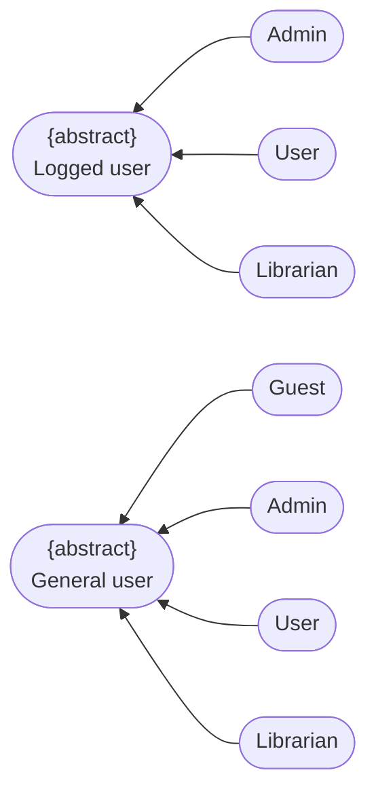
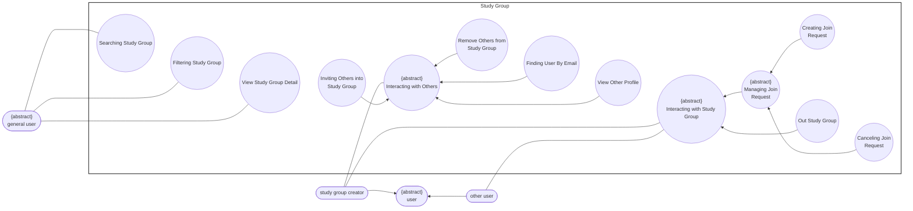
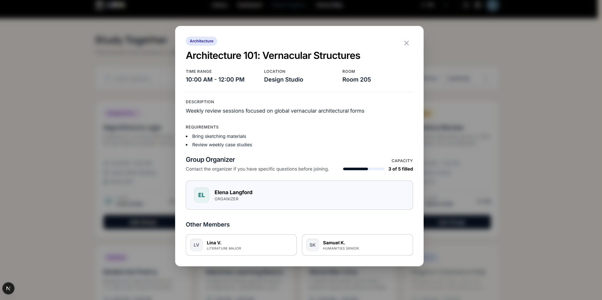
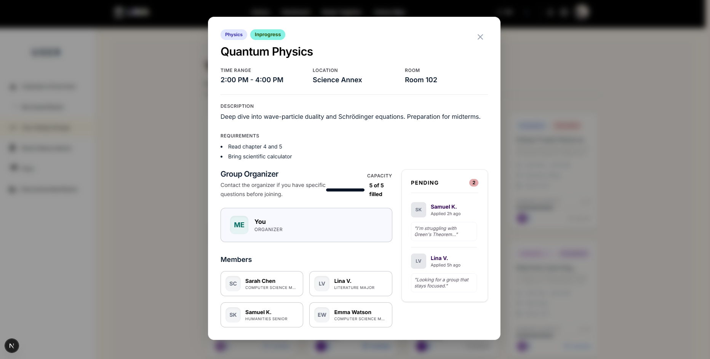
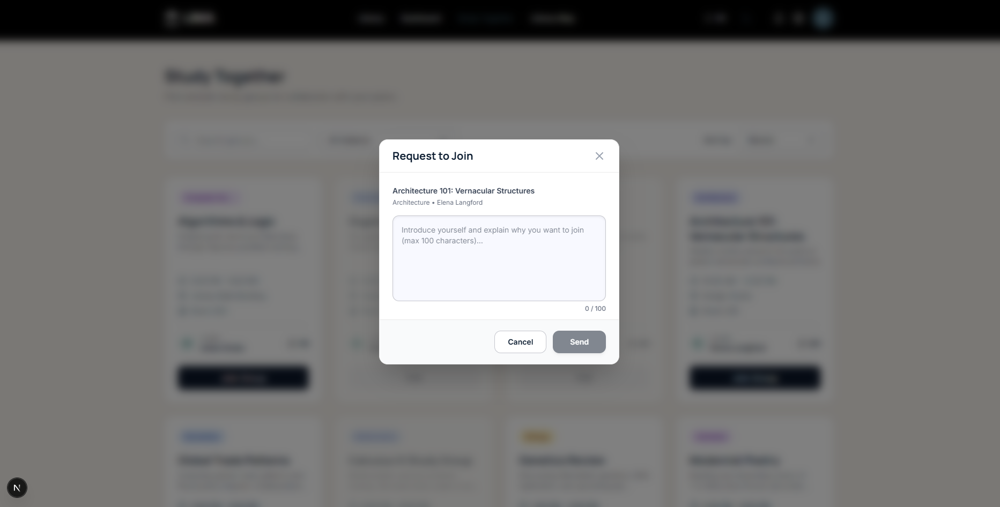
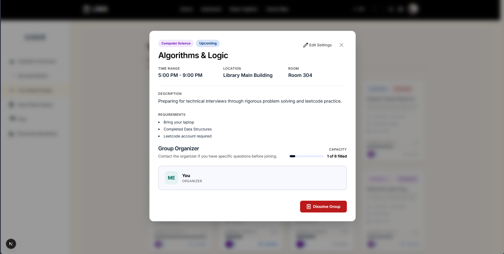

# Use-Case Specification: Study Group

    Project Name: Modern Library Management System
    Course: CS300 – CSC13002 – Introduction to Software Engineering 
    Group ID: 03
    Group Name: Amethyst
    Assignment: PA3-2026
    Document Identifier: NGLP-SRS-SG-001
    Version: 1.1

Performed by: Trần Lê Hoàng Gia, Phan Lê Anh Minh | Reviewed by: All Members | Edited by: Trần Lê Hoàng Gia, Phan Lê Anh Minh

---

## Revision History

| Date | Version | Description | Author |
| --- | --- | --- | --- |
| 21-Jul-2026 | 1.1 | Study Group use case specification (RUP specification layout). | Phan Lê Anh Minh, Trần Lê Hoàng Gia |

---

## Table of Contents
1. [Regulation](#regulation)
2. [Use case diagram](#use-case-diagram)
3. [UC-SG-01: Searching Study Group](#uc-sg-01-searching-study-group)
4. [UC-SG-02: Filtering Study Group](#uc-sg-02-filtering-study-group)
5. [UC-SG-03: View Study Group Detail](#uc-sg-03-view-study-group-detail)
6. [UC-SG-04: Inviting Others into Study Group](#uc-sg-04-inviting-others-into-study-group)
7. [UC-SG-05: Remove Others from Study Group](#uc-sg-05-remove-others-from-study-group)
8. [UC-SG-06: Finding User By Email](#uc-sg-06-finding-user-by-email)
9. [UC-SG-07: View Other Profile](#uc-sg-07-view-other-profile)
10. [UC-SG-08: Creating Join Request](#uc-sg-08-creating-join-request)
11. [UC-SG-09: Canceling Join Request](#uc-sg-09-canceling-join-request)
12. [UC-SG-10: Out Study Group](#uc-sg-10-out-study-group)

---

## Regulation

*Note: General User is an independent actor for public browsing use cases and is not a specialization of User.*

---

## Use case diagram

---
## UC-SG-01: Searching Study Group

<table width="100%" border="1" cellpadding="8" cellspacing="0" style="border-collapse: collapse; font-family: Arial, sans-serif; font-size: 14px; border: 1px solid #d1d5db; margin-bottom: 20px;">
  <thead>
    <tr style="background-color: #1e3a8a; color: #ffffff;">
      <th colspan="2" style="text-align: left; padding: 12px; font-size: 16px;">
        Use Case: Searching Study Group
      </th>
    </tr>
  </thead>
  <tbody>
    <tr>
      <td width="22%" style="background-color: #f8fafc; font-weight: bold; vertical-align: top;">Use Case ID</td>
      <td style="vertical-align: top;"><strong>UC-SG-01</strong></td>
    </tr>
    <tr>
      <td style="background-color: #f8fafc; font-weight: bold; vertical-align: top;">Brief Description</td>
      <td style="vertical-align: top;">
        Allows a General User to search for study groups by keyword.
      </td>
    </tr>
    <tr>
      <td style="background-color: #f8fafc; font-weight: bold; vertical-align: top;">Actor(s)</td>
      <td style="vertical-align: top;">General User</td>
    </tr>
    <tr>
      <td style="background-color: #f8fafc; font-weight: bold; vertical-align: top;">Preconditions</td>
      <td style="vertical-align: top;">
        <ul style="margin: 0; padding-left: 20px; line-height: 1.5;">
          <li><strong>Feature Availability:</strong> The General User has access to the study group search feature.</li>
        </ul>
      </td>
    </tr>
    <tr>
      <td style="background-color: #f8fafc; font-weight: bold; vertical-align: top;">Flow of Events (Basic Flow)</td>
      <td style="vertical-align: top;">
        <ol style="margin: 0; padding-left: 20px; line-height: 1.6;">
          <li><strong>[Actor Action]:</strong> The General User navigates to the study group search interface.</li>
          <li><strong>[Actor Action]:</strong> The General User enters a search keyword.</li>
          <li><strong>[Data Processing]:</strong> The system validates the input.</li>
          <li><strong>[Data Processing]:</strong> The system retrieves study groups matching the keyword.</li>
          <li><strong>[Display Result]:</strong> The system displays the list of matching study groups.</li>
        </ol>
      </td>
    </tr>
    <tr>
      <td style="background-color: #f8fafc; font-weight: bold; vertical-align: top;">Alternative / Exception Flows</td>
      <td style="vertical-align: top;">
        <ul style="margin: 0; padding-left: 20px; line-height: 1.5;">
          <li style="margin-bottom: 8px;">
            <strong>Empty or Invalid Input (Step 3):</strong> If the entered keyword is empty or invalid:
            <ol style="margin-top: 4px; margin-bottom: 4px; padding-left: 20px;">
              <li>The system rejects the search request.</li>
              <li>The system prompts the General User to enter a valid keyword.</li>
            </ol>
            <strong>Postcondition (Alternative Flow):</strong> No search is executed; the General User remains on the search interface.
          </li>
          <li style="margin-bottom: 8px;">
            <strong>No Matching Results (Step 4):</strong> If no study groups match the keyword:
            <ol style="margin-top: 4px; margin-bottom: 4px; padding-left: 20px;">
              <li>The system displays a "no results found" message.</li>
            </ol>
            <strong>Postcondition (Alternative Flow):</strong> No study group list is displayed.
          </li>
        </ul>
      </td>
    </tr>
    <tr>
      <td style="background-color: #f8fafc; font-weight: bold; vertical-align: top;">Postconditions</td>
      <td style="vertical-align: top;">
        <ul style="margin: 0; padding-left: 20px;">
          <li><strong>Result Display:</strong> A list of study groups matching the search criteria is displayed to the General User.</li>
        </ul>
      </td>
    </tr>
    <tr>
      <td style="background-color: #f8fafc; font-weight: bold; vertical-align: top;">Special Requirements</td>
      <td style="vertical-align: top;">
        <ul style="margin: 0; padding-left: 20px;">
          <li><strong>Response Time:</strong> Search results must be returned within an acceptable response time.</li>
          <li><strong>Input Validation:</strong> Search input must be validated to prevent malformed or malicious queries.</li>
        </ul>
      </td>
    </tr>
    <tr>
      <td style="background-color: #f8fafc; font-weight: bold; vertical-align: top;">Extension Points</td>
      <td style="vertical-align: top;">
        None
      </td>
    </tr>
    <tr>
      <td style="background-color: #f8fafc; font-weight: bold; vertical-align: top;">Prototype Screen</td>
      <td style="vertical-align: top;">
        
      </td>
    </tr>
  </tbody>
</table>

---

## UC-SG-02: Filtering Study Group

<table width="100%" border="1" cellpadding="8" cellspacing="0" style="border-collapse: collapse; font-family: Arial, sans-serif; font-size: 14px; border: 1px solid #d1d5db; margin-bottom: 20px;">
  <thead>
    <tr style="background-color: #1e3a8a; color: #ffffff;">
      <th colspan="2" style="text-align: left; padding: 12px; font-size: 16px;">
        Use Case: Filtering Study Group
      </th>
    </tr>
  </thead>
  <tbody>
    <tr>
      <td width="22%" style="background-color: #f8fafc; font-weight: bold; vertical-align: top;">Use Case ID</td>
      <td style="vertical-align: top;"><strong>UC-SG-02</strong></td>
    </tr>
    <tr>
      <td style="background-color: #f8fafc; font-weight: bold; vertical-align: top;">Brief Description</td>
      <td style="vertical-align: top;">
        Allows a General User to narrow a study group list using filter criteria such as subject, schedule, or size.
      </td>
    </tr>
    <tr>
      <td style="background-color: #f8fafc; font-weight: bold; vertical-align: top;">Actor(s)</td>
      <td style="vertical-align: top;">General User</td>
    </tr>
    <tr>
      <td style="background-color: #f8fafc; font-weight: bold; vertical-align: top;">Preconditions</td>
      <td style="vertical-align: top;">
        <ul style="margin: 0; padding-left: 20px; line-height: 1.5;">
          <li><strong>List Availability:</strong> A list of study groups is available for filtering (e.g., resulting from a search or a default listing).</li>
        </ul>
      </td>
    </tr>
    <tr>
      <td style="background-color: #f8fafc; font-weight: bold; vertical-align: top;">Flow of Events (Basic Flow)</td>
      <td style="vertical-align: top;">
        <ol style="margin: 0; padding-left: 20px; line-height: 1.6;">
          <li><strong>[Actor Action]:</strong> The General User accesses a study group listing.</li>
          <li><strong>[Actor Action]:</strong> The General User selects one or more filter criteria.</li>
          <li><strong>[Data Processing]:</strong> The system validates the selected criteria.</li>
          <li><strong>[Data Processing]:</strong> The system applies the filters to the current list.</li>
          <li><strong>[Display Result]:</strong> The system displays the filtered list.</li>
        </ol>
      </td>
    </tr>
    <tr>
      <td style="background-color: #f8fafc; font-weight: bold; vertical-align: top;">Alternative / Exception Flows</td>
      <td style="vertical-align: top;">
        <ul style="margin: 0; padding-left: 20px; line-height: 1.5;">
          <li style="margin-bottom: 8px;">
            <strong>Invalid Filter Combination (Step 3):</strong> If the selected filters are invalid or conflicting:
            <ol style="margin-top: 4px; margin-bottom: 4px; padding-left: 20px;">
              <li>The system rejects the filter request.</li>
              <li>The system notifies the General User and retains the previous list.</li>
            </ol>
            <strong>Postcondition (Alternative Flow):</strong> The previous study group list remains displayed.
          </li>
          <li style="margin-bottom: 8px;">
            <strong>No Results After Filtering (Step 4):</strong> If no study groups match the filters:
            <ol style="margin-top: 4px; margin-bottom: 4px; padding-left: 20px;">
              <li>The system displays a "no results found" message.</li>
              <li>The system allows the General User to adjust the filters.</li>
            </ol>
            <strong>Postcondition (Alternative Flow):</strong> The filtered list is empty.
          </li>
        </ul>
      </td>
    </tr>
    <tr>
      <td style="background-color: #f8fafc; font-weight: bold; vertical-align: top;">Postconditions</td>
      <td style="vertical-align: top;">
        <ul style="margin: 0; padding-left: 20px;">
          <li><strong>Result Display:</strong> The displayed list of study groups reflects the applied filter criteria.</li>
        </ul>
      </td>
    </tr>
    <tr>
      <td style="background-color: #f8fafc; font-weight: bold; vertical-align: top;">Special Requirements</td>
      <td style="vertical-align: top;">
        <ul style="margin: 0; padding-left: 20px;">
          <li><strong>Filter Usability:</strong> Filter options must be clearly presented and combinable where applicable.</li>
        </ul>
      </td>
    </tr>
    <tr>
      <td style="background-color: #f8fafc; font-weight: bold; vertical-align: top;">Extension Points</td>
      <td style="vertical-align: top;">
        None
      </td>
    </tr>
    <tr>
      <td style="background-color: #f8fafc; font-weight: bold; vertical-align: top;">Prototype Screen</td>
      <td style="vertical-align: top;">
        
      </td>
    </tr>
  </tbody>
</table>

---

## UC-SG-03: View Study Group Detail

<table width="100%" border="1" cellpadding="8" cellspacing="0" style="border-collapse: collapse; font-family: Arial, sans-serif; font-size: 14px; border: 1px solid #d1d5db; margin-bottom: 20px;">
  <thead>
    <tr style="background-color: #1e3a8a; color: #ffffff;">
      <th colspan="2" style="text-align: left; padding: 12px; font-size: 16px;">
        Use Case: View Study Group Detail
      </th>
    </tr>
  </thead>
  <tbody>
    <tr>
      <td width="22%" style="background-color: #f8fafc; font-weight: bold; vertical-align: top;">Use Case ID</td>
      <td style="vertical-align: top;"><strong>UC-SG-03</strong></td>
    </tr>
    <tr>
      <td style="background-color: #f8fafc; font-weight: bold; vertical-align: top;">Brief Description</td>
      <td style="vertical-align: top;">
        Allows a General User to view detailed information about a specific study group.
      </td>
    </tr>
    <tr>
      <td style="background-color: #f8fafc; font-weight: bold; vertical-align: top;">Actor(s)</td>
      <td style="vertical-align: top;">General User</td>
    </tr>
    <tr>
      <td style="background-color: #f8fafc; font-weight: bold; vertical-align: top;">Preconditions</td>
      <td style="vertical-align: top;">
        <ul style="margin: 0; padding-left: 20px; line-height: 1.5;">
          <li><strong>Group Accessibility:</strong> A study group exists and is accessible from a list (search or filtered results).</li>
        </ul>
      </td>
    </tr>
    <tr>
      <td style="background-color: #f8fafc; font-weight: bold; vertical-align: top;">Flow of Events (Basic Flow)</td>
      <td style="vertical-align: top;">
        <ol style="margin: 0; padding-left: 20px; line-height: 1.6;">
          <li><strong>[Actor Action]:</strong> The General User selects a study group from a list.</li>
          <li><strong>[Data Processing]:</strong> The system retrieves the study group's detailed information.</li>
          <li><strong>[Display Result]:</strong> The system displays the study group details, including description, members, and schedule.</li>
        </ol>
      </td>
    </tr>
    <tr>
      <td style="background-color: #f8fafc; font-weight: bold; vertical-align: top;">Alternative / Exception Flows</td>
      <td style="vertical-align: top;">
        <ul style="margin: 0; padding-left: 20px; line-height: 1.5;">
          <li style="margin-bottom: 8px;">
            <strong>Study Group Unavailable (Step 2):</strong> If the selected study group no longer exists or is inaccessible:
            <ol style="margin-top: 4px; margin-bottom: 4px; padding-left: 20px;">
              <li>The system displays an error message.</li>
            </ol>
            <strong>Postcondition (Alternative Flow):</strong> No detail view is displayed.
          </li>
        </ul>
      </td>
    </tr>
    <tr>
      <td style="background-color: #f8fafc; font-weight: bold; vertical-align: top;">Postconditions</td>
      <td style="vertical-align: top;">
        <ul style="margin: 0; padding-left: 20px;">
          <li><strong>Detail Display:</strong> The detailed information of the selected study group is displayed to the General User.</li>
        </ul>
      </td>
    </tr>
    <tr>
      <td style="background-color: #f8fafc; font-weight: bold; vertical-align: top;">Special Requirements</td>
      <td style="vertical-align: top;">
        <ul style="margin: 0; padding-left: 20px;">
          <li><strong>Access Level:</strong> Only information appropriate to the requesting General User's access level is displayed.</li>
        </ul>
      </td>
    </tr>
    <tr>
      <td style="background-color: #f8fafc; font-weight: bold; vertical-align: top;">Extension Points</td>
      <td style="vertical-align: top;">
        None
      </td>
    </tr>
    <tr>
      <td style="background-color: #f8fafc; font-weight: bold; vertical-align: top;">Prototype Screen</td>
      <td style="vertical-align: top;">
        
      </td>
    </tr>
  </tbody>
</table>

---

## UC-SG-04: Inviting Others into Study Group

<table width="100%" border="1" cellpadding="8" cellspacing="0" style="border-collapse: collapse; font-family: Arial, sans-serif; font-size: 14px; border: 1px solid #d1d5db; margin-bottom: 20px;">
  <thead>
    <tr style="background-color: #1e3a8a; color: #ffffff;">
      <th colspan="2" style="text-align: left; padding: 12px; font-size: 16px;">
        Use Case: Inviting Others into Study Group
      </th>
    </tr>
  </thead>
  <tbody>
    <tr>
      <td width="22%" style="background-color: #f8fafc; font-weight: bold; vertical-align: top;">Use Case ID</td>
      <td style="vertical-align: top;"><strong>UC-SG-04</strong></td>
    </tr>
    <tr>
      <td style="background-color: #f8fafc; font-weight: bold; vertical-align: top;">Brief Description</td>
      <td style="vertical-align: top;">
        Allows the Study Group Creator to invite a user to join a study group they manage.
      </td>
    </tr>
    <tr>
      <td style="background-color: #f8fafc; font-weight: bold; vertical-align: top;">Actor(s)</td>
      <td style="vertical-align: top;">Study Group Creator</td>
    </tr>
    <tr>
      <td style="background-color: #f8fafc; font-weight: bold; vertical-align: top;">Preconditions</td>
      <td style="vertical-align: top;">
        <ul style="margin: 0; padding-left: 20px; line-height: 1.5;">
          <li><strong>Authorization State:</strong> The Study Group Creator is authenticated and manages the selected study group.</li>
        </ul>
      </td>
    </tr>
    <tr>
      <td style="background-color: #f8fafc; font-weight: bold; vertical-align: top;">Flow of Events (Basic Flow)</td>
      <td style="vertical-align: top;">
        <ol style="margin: 0; padding-left: 20px; line-height: 1.6;">
          <li><strong>[Actor Action]:</strong> The Study Group Creator selects the study group to invite a member to.</li>
          <li><strong>[Actor Action]:</strong> The Study Group Creator selects a user to invite, optionally using UC-SG-07 (Finding User By Email).</li>
          <li><strong>[Data Processing]:</strong> The system validates that the target user is not already a member of the study group.</li>
          <li><strong>[Data Processing]:</strong> The system sends an invitation to the target user.</li>
          <li><strong>[Display Result]:</strong> The system confirms to the Study Group Creator that the invitation was sent.</li>
        </ol>
      </td>
    </tr>
    <tr>
      <td style="background-color: #f8fafc; font-weight: bold; vertical-align: top;">Alternative / Exception Flows</td>
      <td style="vertical-align: top;">
        <ul style="margin: 0; padding-left: 20px; line-height: 1.5;">
          <li style="margin-bottom: 8px;">
            <strong>Target User Already a Member (Step 3):</strong> If the target user is already a member of the study group:
            <ol style="margin-top: 4px; margin-bottom: 4px; padding-left: 20px;">
              <li>The system displays an error message.</li>
              <li>The system does not send an invitation.</li>
            </ol>
            <strong>Postcondition (Alternative Flow):</strong> No invitation is sent; the study group membership remains unchanged.
          </li>
        </ul>
      </td>
    </tr>
    <tr>
      <td style="background-color: #f8fafc; font-weight: bold; vertical-align: top;">Postconditions</td>
      <td style="vertical-align: top;">
        <ul style="margin: 0; padding-left: 20px;">
          <li><strong>Invitation Issued:</strong> An invitation has been issued to the specified user for the selected study group.</li>
        </ul>
      </td>
    </tr>
    <tr>
      <td style="background-color: #f8fafc; font-weight: bold; vertical-align: top;">Special Requirements</td>
      <td style="vertical-align: top;">
        <ul style="margin: 0; padding-left: 20px;">
          <li><strong>Authorization:</strong> Only the study group creator may issue invitations for a given study group.</li>
          <li><strong>Duplicate Prevention:</strong> Duplicate invitations to the same user for the same study group must be prevented.</li>
        </ul>
      </td>
    </tr>
    <tr>
      <td style="background-color: #f8fafc; font-weight: bold; vertical-align: top;">Extension Points</td>
      <td style="vertical-align: top;">
        None
      </td>
    </tr>
    <tr>
      <td style="background-color: #f8fafc; font-weight: bold; vertical-align: top;">Prototype Screen</td>
      <td style="vertical-align: top;">
        
      </td>
    </tr>
  </tbody>
</table>

---

## UC-SG-05: Remove Others from Study Group

<table width="100%" border="1" cellpadding="8" cellspacing="0" style="border-collapse: collapse; font-family: Arial, sans-serif; font-size: 14px; border: 1px solid #d1d5db; margin-bottom: 20px;">
  <thead>
    <tr style="background-color: #1e3a8a; color: #ffffff;">
      <th colspan="2" style="text-align: left; padding: 12px; font-size: 16px;">
        Use Case: Remove Others from Study Group
      </th>
    </tr>
  </thead>
  <tbody>
    <tr>
      <td width="22%" style="background-color: #f8fafc; font-weight: bold; vertical-align: top;">Use Case ID</td>
      <td style="vertical-align: top;"><strong>UC-SG-05</strong></td>
    </tr>
    <tr>
      <td style="background-color: #f8fafc; font-weight: bold; vertical-align: top;">Brief Description</td>
      <td style="vertical-align: top;">
        Allows the Study Group Creator to remove an existing member from a study group they manage.
      </td>
    </tr>
    <tr>
      <td style="background-color: #f8fafc; font-weight: bold; vertical-align: top;">Actor(s)</td>
      <td style="vertical-align: top;">Study Group Creator</td>
    </tr>
    <tr>
      <td style="background-color: #f8fafc; font-weight: bold; vertical-align: top;">Preconditions</td>
      <td style="vertical-align: top;">
        <ul style="margin: 0; padding-left: 20px; line-height: 1.5;">
          <li><strong>Authorization and Membership State:</strong> The Study Group Creator manages the study group; the target user is a current member of the study group.</li>
        </ul>
      </td>
    </tr>
    <tr>
      <td style="background-color: #f8fafc; font-weight: bold; vertical-align: top;">Flow of Events (Basic Flow)</td>
      <td style="vertical-align: top;">
        <ol style="margin: 0; padding-left: 20px; line-height: 1.6;">
          <li><strong>[Actor Action]:</strong> The Study Group Creator selects the study group and views its member list.</li>
          <li><strong>[Actor Action]:</strong> The Study Group Creator selects the member to remove.</li>
          <li><strong>[System Response]:</strong> The system requests confirmation of the removal.</li>
          <li><strong>[Data Processing]:</strong> The system removes the selected member from the study group.</li>
          <li><strong>[Display Result]:</strong> The system confirms the removal to the Study Group Creator.</li>
        </ol>
      </td>
    </tr>
    <tr>
      <td style="background-color: #f8fafc; font-weight: bold; vertical-align: top;">Alternative / Exception Flows</td>
      <td style="vertical-align: top;">
        <ul style="margin: 0; padding-left: 20px; line-height: 1.5;">
          <li style="margin-bottom: 8px;">
            <strong>Removal Canceled (Step 3):</strong> If the Study Group Creator cancels the confirmation:
            <ol style="margin-top: 4px; margin-bottom: 4px; padding-left: 20px;">
              <li>The system cancels the removal process.</li>
            </ol>
            <strong>Postcondition (Alternative Flow):</strong> The study group membership remains unchanged.
          </li>
          <li style="margin-bottom: 8px;">
            <strong>Target User Not a Member (Step 2):</strong> If the selected user is not currently a member:
            <ol style="margin-top: 4px; margin-bottom: 4px; padding-left: 20px;">
              <li>The system displays an error message.</li>
            </ol>
            <strong>Postcondition (Alternative Flow):</strong> The study group membership remains unchanged.
          </li>
        </ul>
      </td>
    </tr>
    <tr>
      <td style="background-color: #f8fafc; font-weight: bold; vertical-align: top;">Postconditions</td>
      <td style="vertical-align: top;">
        <ul style="margin: 0; padding-left: 20px;">
          <li><strong>Membership Update:</strong> The selected member is no longer part of the study group.</li>
        </ul>
      </td>
    </tr>
    <tr>
      <td style="background-color: #f8fafc; font-weight: bold; vertical-align: top;">Special Requirements</td>
      <td style="vertical-align: top;">
        <ul style="margin: 0; padding-left: 20px;">
          <li><strong>Authorization:</strong> Only the study group creator may remove members from a study group they manage.</li>
          <li><strong>Notification:</strong> The affected user should be notified of their removal.</li>
        </ul>
      </td>
    </tr>
    <tr>
      <td style="background-color: #f8fafc; font-weight: bold; vertical-align: top;">Extension Points</td>
      <td style="vertical-align: top;">
        None
      </td>
    </tr>
    <tr>
      <td style="background-color: #f8fafc; font-weight: bold; vertical-align: top;">Prototype Screen</td>
      <td style="vertical-align: top;">
        
      </td>
    </tr>
  </tbody>
</table>

---

## UC-SG-06: Finding User By Email

<table width="100%" border="1" cellpadding="8" cellspacing="0" style="border-collapse: collapse; font-family: Arial, sans-serif; font-size: 14px; border: 1px solid #d1d5db; margin-bottom: 20px;">
  <thead>
    <tr style="background-color: #1e3a8a; color: #ffffff;">
      <th colspan="2" style="text-align: left; padding: 12px; font-size: 16px;">
        Use Case: Finding User By Email
      </th>
    </tr>
  </thead>
  <tbody>
    <tr>
      <td width="22%" style="background-color: #f8fafc; font-weight: bold; vertical-align: top;">Use Case ID</td>
      <td style="vertical-align: top;"><strong>UC-SG-06</strong></td>
    </tr>
    <tr>
      <td style="background-color: #f8fafc; font-weight: bold; vertical-align: top;">Brief Description</td>
      <td style="vertical-align: top;">
        Allows the Study Group Creator to locate a registered user by email address, typically in support of inviting them to a study group.
      </td>
    </tr>
    <tr>
      <td style="background-color: #f8fafc; font-weight: bold; vertical-align: top;">Actor(s)</td>
      <td style="vertical-align: top;">Study Group Creator</td>
    </tr>
    <tr>
      <td style="background-color: #f8fafc; font-weight: bold; vertical-align: top;">Preconditions</td>
      <td style="vertical-align: top;">
        <ul style="margin: 0; padding-left: 20px; line-height: 1.5;">
          <li><strong>Feature Availability:</strong> The Study Group Creator has access to the user lookup feature.</li>
        </ul>
      </td>
    </tr>
    <tr>
      <td style="background-color: #f8fafc; font-weight: bold; vertical-align: top;">Flow of Events (Basic Flow)</td>
      <td style="vertical-align: top;">
        <ol style="margin: 0; padding-left: 20px; line-height: 1.6;">
          <li><strong>[Actor Action]:</strong> The Study Group Creator enters an email address to search for.</li>
          <li><strong>[Data Processing]:</strong> The system validates the format of the email address.</li>
          <li><strong>[Data Processing]:</strong> The system searches for a registered user matching the entered email address.</li>
          <li><strong>[Display Result]:</strong> The system displays the matching user's basic profile information.</li>
        </ol>
      </td>
    </tr>
    <tr>
      <td style="background-color: #f8fafc; font-weight: bold; vertical-align: top;">Alternative / Exception Flows</td>
      <td style="vertical-align: top;">
        <ul style="margin: 0; padding-left: 20px; line-height: 1.5;">
          <li style="margin-bottom: 8px;">
            <strong>Invalid Email Format (Step 2):</strong> If the email format is invalid:
            <ol style="margin-top: 4px; margin-bottom: 4px; padding-left: 20px;">
              <li>The system prompts the Study Group Creator to correct the input.</li>
            </ol>
            <strong>Postcondition (Alternative Flow):</strong> No user information is displayed.
          </li>
          <li style="margin-bottom: 8px;">
            <strong>No Matching User (Step 3):</strong> If no registered user matches the provided email:
            <ol style="margin-top: 4px; margin-bottom: 4px; padding-left: 20px;">
              <li>The system displays a "user not found" message.</li>
            </ol>
            <strong>Postcondition (Alternative Flow):</strong> No user information is displayed.
          </li>
        </ul>
      </td>
    </tr>
    <tr>
      <td style="background-color: #f8fafc; font-weight: bold; vertical-align: top;">Postconditions</td>
      <td style="vertical-align: top;">
        <ul style="margin: 0; padding-left: 20px;">
          <li><strong>Result Display:</strong> A user matching the provided email address, if found, is presented to the Study Group Creator.</li>
        </ul>
      </td>
    </tr>
    <tr>
      <td style="background-color: #f8fafc; font-weight: bold; vertical-align: top;">Special Requirements</td>
      <td style="vertical-align: top;">
        <ul style="margin: 0; padding-left: 20px;">
          <li><strong>Privacy:</strong> Only minimal, non-sensitive user information should be exposed through this lookup.</li>
        </ul>
      </td>
    </tr>
    <tr>
      <td style="background-color: #f8fafc; font-weight: bold; vertical-align: top;">Extension Points</td>
      <td style="vertical-align: top;">
        None
      </td>
    </tr>
    <tr>
      <td style="background-color: #f8fafc; font-weight: bold; vertical-align: top;">Prototype Screen</td>
      <td style="vertical-align: top;">
        
      </td>
    </tr>
  </tbody>
</table>

---

## UC-SG-07: View Other Profile

<table width="100%" border="1" cellpadding="8" cellspacing="0" style="border-collapse: collapse; font-family: Arial, sans-serif; font-size: 14px; border: 1px solid #d1d5db; margin-bottom: 20px;">
  <thead>
    <tr style="background-color: #1e3a8a; color: #ffffff;">
      <th colspan="2" style="text-align: left; padding: 12px; font-size: 16px;">
        Use Case: View Other Profile
      </th>
    </tr>
  </thead>
  <tbody>
    <tr>
      <td width="22%" style="background-color: #f8fafc; font-weight: bold; vertical-align: top;">Use Case ID</td>
      <td style="vertical-align: top;"><strong>UC-SG-07</strong></td>
    </tr>
    <tr>
      <td style="background-color: #f8fafc; font-weight: bold; vertical-align: top;">Brief Description</td>
      <td style="vertical-align: top;">
        Allows the Study Group Creator to view the profile information of another user, such as a study group member or a prospective invitee.
      </td>
    </tr>
    <tr>
      <td style="background-color: #f8fafc; font-weight: bold; vertical-align: top;">Actor(s)</td>
      <td style="vertical-align: top;">Study Group Creator</td>
    </tr>
    <tr>
      <td style="background-color: #f8fafc; font-weight: bold; vertical-align: top;">Preconditions</td>
      <td style="vertical-align: top;">
        <ul style="margin: 0; padding-left: 20px; line-height: 1.5;">
          <li><strong>Profile Accessibility:</strong> The target user's profile exists and is accessible to the Study Group Creator.</li>
        </ul>
      </td>
    </tr>
    <tr>
      <td style="background-color: #f8fafc; font-weight: bold; vertical-align: top;">Flow of Events (Basic Flow)</td>
      <td style="vertical-align: top;">
        <ol style="margin: 0; padding-left: 20px; line-height: 1.6;">
          <li><strong>[Actor Action]:</strong> The Study Group Creator selects a user, e.g., from a member list or search result.</li>
          <li><strong>[Data Processing]:</strong> The system retrieves the selected user's profile information according to the target user's visibility settings.</li>
          <li><strong>[Display Result]:</strong> The system displays the profile to the Study Group Creator.</li>
        </ol>
      </td>
    </tr>
    <tr>
      <td style="background-color: #f8fafc; font-weight: bold; vertical-align: top;">Alternative / Exception Flows</td>
      <td style="vertical-align: top;">
        <ul style="margin: 0; padding-left: 20px; line-height: 1.5;">
          <li style="margin-bottom: 8px;">
            <strong>Profile Unavailable (Step 2):</strong> If the target user's profile cannot be retrieved:
            <ol style="margin-top: 4px; margin-bottom: 4px; padding-left: 20px;">
              <li>The system displays an error message.</li>
            </ol>
            <strong>Postcondition (Alternative Flow):</strong> No profile information is displayed.
          </li>
        </ul>
      </td>
    </tr>
    <tr>
      <td style="background-color: #f8fafc; font-weight: bold; vertical-align: top;">Postconditions</td>
      <td style="vertical-align: top;">
        <ul style="margin: 0; padding-left: 20px;">
          <li><strong>Profile Display:</strong> The requested user's profile information is displayed to the Study Group Creator.</li>
        </ul>
      </td>
    </tr>
    <tr>
      <td style="background-color: #f8fafc; font-weight: bold; vertical-align: top;">Special Requirements</td>
      <td style="vertical-align: top;">
        <ul style="margin: 0; padding-left: 20px;">
          <li><strong>Visibility:</strong> Only profile information the target user has made visible/appropriate for this context should be shown.</li>
        </ul>
      </td>
    </tr>
    <tr>
      <td style="background-color: #f8fafc; font-weight: bold; vertical-align: top;">Extension Points</td>
      <td style="vertical-align: top;">
        None
      </td>
    </tr>
    <tr>
      <td style="background-color: #f8fafc; font-weight: bold; vertical-align: top;">Prototype Screen</td>
      <td style="vertical-align: top;">
        
      </td>
    </tr>
  </tbody>
</table>

---

## UC-SG-08: Creating Join Request

<table width="100%" border="1" cellpadding="8" cellspacing="0" style="border-collapse: collapse; font-family: Arial, sans-serif; font-size: 14px; border: 1px solid #d1d5db; margin-bottom: 20px;">
  <thead>
    <tr style="background-color: #1e3a8a; color: #ffffff;">
      <th colspan="2" style="text-align: left; padding: 12px; font-size: 16px;">
        Use Case: Creating Join Request
      </th>
    </tr>
  </thead>
  <tbody>
    <tr>
      <td width="22%" style="background-color: #f8fafc; font-weight: bold; vertical-align: top;">Use Case ID</td>
      <td style="vertical-align: top;"><strong>UC-SG-08</strong></td>
    </tr>
    <tr>
      <td style="background-color: #f8fafc; font-weight: bold; vertical-align: top;">Brief Description</td>
      <td style="vertical-align: top;">
        Allows a user to submit a request to join a study group.
      </td>
    </tr>
    <tr>
      <td style="background-color: #f8fafc; font-weight: bold; vertical-align: top;">Actor(s)</td>
      <td style="vertical-align: top;">Other User</td>
    </tr>
    <tr>
      <td style="background-color: #f8fafc; font-weight: bold; vertical-align: top;">Preconditions</td>
      <td style="vertical-align: top;">
        <ul style="margin: 0; padding-left: 20px; line-height: 1.5;">
          <li><strong>Authentication State:</strong> The Other User is authenticated, and the selected study group exists.</li>
        </ul>
      </td>
    </tr>
    <tr>
      <td style="background-color: #f8fafc; font-weight: bold; vertical-align: top;">Flow of Events (Basic Flow)</td>
      <td style="vertical-align: top;">
        <ol style="margin: 0; padding-left: 20px; line-height: 1.6;">
          <li><strong>[Actor Action]:</strong> The Other User selects the study group they wish to join.</li>
          <li><strong>[Actor Action]:</strong> The Other User submits a request to join.</li>
          <li><strong>[Data Processing]:</strong> The system validates that the Other User is not already a member and has no existing pending request for the study group.</li>
          <li><strong>[Data Processing]:</strong> The system creates the join request and associates it with the study group.</li>
          <li><strong>[Data Processing]:</strong> The system notifies the Study Group Creator of the new join request.</li>
          <li><strong>[Display Result]:</strong> The system confirms to the Other User that the request has been submitted.</li>
        </ol>
      </td>
    </tr>
    <tr>
      <td style="background-color: #f8fafc; font-weight: bold; vertical-align: top;">Alternative / Exception Flows</td>
      <td style="vertical-align: top;">
        <ul style="margin: 0; padding-left: 20px; line-height: 1.5;">
          <li style="margin-bottom: 8px;">
            <strong>User Already a Member (Step 3):</strong> If the Other User is already a member of the study group:
            <ol style="margin-top: 4px; margin-bottom: 4px; padding-left: 20px;">
              <li>The system displays an error message.</li>
              <li>The system does not create a request.</li>
            </ol>
            <strong>Postcondition (Alternative Flow):</strong> No new join request is created.
          </li>
          <li style="margin-bottom: 8px;">
            <strong>Duplicate Pending Request (Step 3):</strong> If a pending join request already exists for the Other User and study group:
            <ol style="margin-top: 4px; margin-bottom: 4px; padding-left: 20px;">
              <li>The system displays a message.</li>
              <li>The system does not create a duplicate request.</li>
            </ol>
            <strong>Postcondition (Alternative Flow):</strong> No new join request is created.
          </li>
        </ul>
      </td>
    </tr>
    <tr>
      <td style="background-color: #f8fafc; font-weight: bold; vertical-align: top;">Postconditions</td>
      <td style="vertical-align: top;">
        <ul style="margin: 0; padding-left: 20px;">
          <li><strong>Request Created:</strong> A pending join request for the Other User exists against the selected study group.</li>
        </ul>
      </td>
    </tr>
    <tr>
      <td style="background-color: #f8fafc; font-weight: bold; vertical-align: top;">Special Requirements</td>
      <td style="vertical-align: top;">
        <ul style="margin: 0; padding-left: 20px;">
          <li><strong>Request Limit:</strong> Each user may have at most one pending join request per study group at any given time.</li>
        </ul>
      </td>
    </tr>
    <tr>
      <td style="background-color: #f8fafc; font-weight: bold; vertical-align: top;">Extension Points</td>
      <td style="vertical-align: top;">
        None
      </td>
    </tr>
    <tr>
      <td style="background-color: #f8fafc; font-weight: bold; vertical-align: top;">Prototype Screen</td>
      <td style="vertical-align: top;">
        
      </td>
    </tr>
  </tbody>
</table>

---

## UC-SG-09: Canceling Join Request

<table width="100%" border="1" cellpadding="8" cellspacing="0" style="border-collapse: collapse; font-family: Arial, sans-serif; font-size: 14px; border: 1px solid #d1d5db; margin-bottom: 20px;">
  <thead>
    <tr style="background-color: #1e3a8a; color: #ffffff;">
      <th colspan="2" style="text-align: left; padding: 12px; font-size: 16px;">
        Use Case: Canceling Join Request
      </th>
    </tr>
  </thead>
  <tbody>
    <tr>
      <td width="22%" style="background-color: #f8fafc; font-weight: bold; vertical-align: top;">Use Case ID</td>
      <td style="vertical-align: top;"><strong>UC-SG-09</strong></td>
    </tr>
    <tr>
      <td style="background-color: #f8fafc; font-weight: bold; vertical-align: top;">Brief Description</td>
      <td style="vertical-align: top;">
        Allows a user to cancel a previously submitted, still-pending join request for a study group.
      </td>
    </tr>
    <tr>
      <td style="background-color: #f8fafc; font-weight: bold; vertical-align: top;">Actor(s)</td>
      <td style="vertical-align: top;">Other User</td>
    </tr>
    <tr>
      <td style="background-color: #f8fafc; font-weight: bold; vertical-align: top;">Preconditions</td>
      <td style="vertical-align: top;">
        <ul style="margin: 0; padding-left: 20px; line-height: 1.5;">
          <li><strong>Authentication State:</strong> The Other User is authenticated.</li>
        </ul>
      </td>
    </tr>
    <tr>
      <td style="background-color: #f8fafc; font-weight: bold; vertical-align: top;">Flow of Events (Basic Flow)</td>
      <td style="vertical-align: top;">
        <ol style="margin: 0; padding-left: 20px; line-height: 1.6;">
          <li><strong>[Actor Action]:</strong> The Other User views their pending join request(s).</li>
          <li><strong>[Actor Action]:</strong> The Other User selects a pending join request to cancel.</li>
          <li><strong>[Data Processing]:</strong> The system validates that the selected request is still pending.</li>
          <li><strong>[Data Processing]:</strong> The system cancels the join request.</li>
          <li><strong>[Display Result]:</strong> The system confirms the cancellation to the Other User.</li>
        </ol>
      </td>
    </tr>
    <tr>
      <td style="background-color: #f8fafc; font-weight: bold; vertical-align: top;">Alternative / Exception Flows</td>
      <td style="vertical-align: top;">
        <ul style="margin: 0; padding-left: 20px; line-height: 1.5;">
          <li style="margin-bottom: 8px;">
            <strong>Request No Longer Pending (Step 3):</strong> If the join request has already been resolved (e.g., approved or previously canceled):
            <ol style="margin-top: 4px; margin-bottom: 4px; padding-left: 20px;">
              <li>The system displays an error message.</li>
              <li>The system takes no action.</li>
            </ol>
            <strong>Postcondition (Alternative Flow):</strong> The join request status remains unchanged.
          </li>
        </ul>
      </td>
    </tr>
    <tr>
      <td style="background-color: #f8fafc; font-weight: bold; vertical-align: top;">Postconditions</td>
      <td style="vertical-align: top;">
        <ul style="margin: 0; padding-left: 20px;">
          <li><strong>Request Removed:</strong> The selected join request no longer exists / is no longer pending.</li>
        </ul>
      </td>
    </tr>
    <tr>
      <td style="background-color: #f8fafc; font-weight: bold; vertical-align: top;">Special Requirements</td>
      <td style="vertical-align: top;">
        <ul style="margin: 0; padding-left: 20px;">
          <li><strong>Authorization:</strong> Only the user who created the join request may cancel it.</li>
        </ul>
      </td>
    </tr>
    <tr>
      <td style="background-color: #f8fafc; font-weight: bold; vertical-align: top;">Extension Points</td>
      <td style="vertical-align: top;">
        <ul style="margin: 0; padding-left: 20px;">
          <li>--</li>
        </ul>
      </td>
    </tr>
    <tr>
      <td style="background-color: #f8fafc; font-weight: bold; vertical-align: top;">Prototype Screen</td>
      <td style="vertical-align: top;">
        None
      </td>
    </tr>
  </tbody>
</table>

---

## UC-SG-10: Out Study Group

<table width="100%" border="1" cellpadding="8" cellspacing="0" style="border-collapse: collapse; font-family: Arial, sans-serif; font-size: 14px; border: 1px solid #d1d5db; margin-bottom: 20px;">
  <thead>
    <tr style="background-color: #1e3a8a; color: #ffffff;">
      <th colspan="2" style="text-align: left; padding: 12px; font-size: 16px;">
        Use Case: Out Study Group
      </th>
    </tr>
  </thead>
  <tbody>
    <tr>
      <td width="22%" style="background-color: #f8fafc; font-weight: bold; vertical-align: top;">Use Case ID</td>
      <td style="vertical-align: top;"><strong>UC-SG-10</strong></td>
    </tr>
    <tr>
      <td style="background-color: #f8fafc; font-weight: bold; vertical-align: top;">Brief Description</td>
      <td style="vertical-align: top;">
        Allows a study group member (Study Group Creator or Other User) to voluntarily leave a study group they currently belong to.
      </td>
    </tr>
    <tr>
      <td style="background-color: #f8fafc; font-weight: bold; vertical-align: top;">Actor(s)</td>
      <td style="vertical-align: top;">User (Group Member)</td>
    </tr>
    <tr>
      <td style="background-color: #f8fafc; font-weight: bold; vertical-align: top;">Preconditions</td>
      <td style="vertical-align: top;">
        <ul style="margin: 0; padding-left: 20px; line-height: 1.5;">
          <li><strong>Membership State:</strong> The actor is authenticated and is a current member of the selected study group.</li>
        </ul>
      </td>
    </tr>
    <tr>
      <td style="background-color: #f8fafc; font-weight: bold; vertical-align: top;">Flow of Events (Basic Flow)</td>
      <td style="vertical-align: top;">
        <ol style="margin: 0; padding-left: 20px; line-height: 1.6;">
          <li><strong>[Actor Action]:</strong> The actor selects the study group they wish to leave.</li>
          <li><strong>[Actor Action]:</strong> The actor confirms the intent to leave the study group.</li>
          <li><strong>[Data Processing]:</strong> The system removes the actor from the study group's membership.</li>
          <li><strong>[Display Result]:</strong> The system confirms to the actor that they have left the study group.</li>
        </ol>
      </td>
    </tr>
    <tr>
      <td style="background-color: #f8fafc; font-weight: bold; vertical-align: top;">Alternative / Exception Flows</td>
      <td style="vertical-align: top;">
        <ul style="margin: 0; padding-left: 20px; line-height: 1.5;">
          <li style="margin-bottom: 8px;">
            <strong>Leave Not Confirmed (Step 2):</strong> If the actor cancels the confirmation:
            <ol style="margin-top: 4px; margin-bottom: 4px; padding-left: 20px;">
              <li>No membership change occurs.</li>
            </ol>
            <strong>Postcondition (Alternative Flow):</strong> The actor's membership status remains unchanged.
          </li>
        </ul>
      </td>
    </tr>
    <tr>
      <td style="background-color: #f8fafc; font-weight: bold; vertical-align: top;">Postconditions</td>
      <td style="vertical-align: top;">
        <ul style="margin: 0; padding-left: 20px;">
          <li><strong>Membership Update:</strong> The actor is no longer a member of the study group.</li>
        </ul>
      </td>
    </tr>
    <tr>
      <td style="background-color: #f8fafc; font-weight: bold; vertical-align: top;">Special Requirements</td>
      <td style="vertical-align: top;">
        <ul style="margin: 0; padding-left: 20px;">
          <li><strong>Creator Succession:</strong> If the actor is the Study Group Creator, the system must ensure another member is assigned as the creator before the creator can leave.</li>
        </ul>
      </td>
    </tr>
    <tr>
      <td style="background-color: #f8fafc; font-weight: bold; vertical-align: top;">Extension Points</td>
      <td style="vertical-align: top;">
        None
      </td>
    </tr>
    <tr>
      <td style="background-color: #f8fafc; font-weight: bold; vertical-align: top;">Prototype Screen</td>
      <td style="vertical-align: top;">
        
      </td>
    </tr>
  </tbody>
</table>
