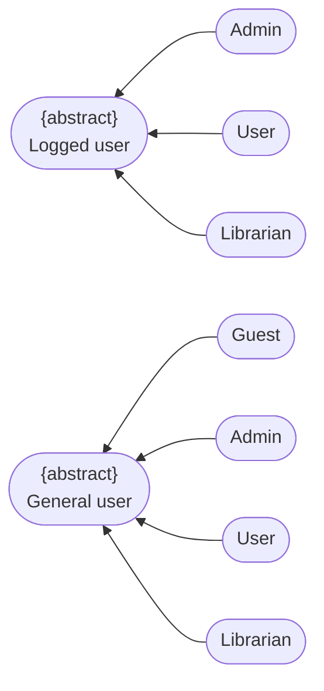
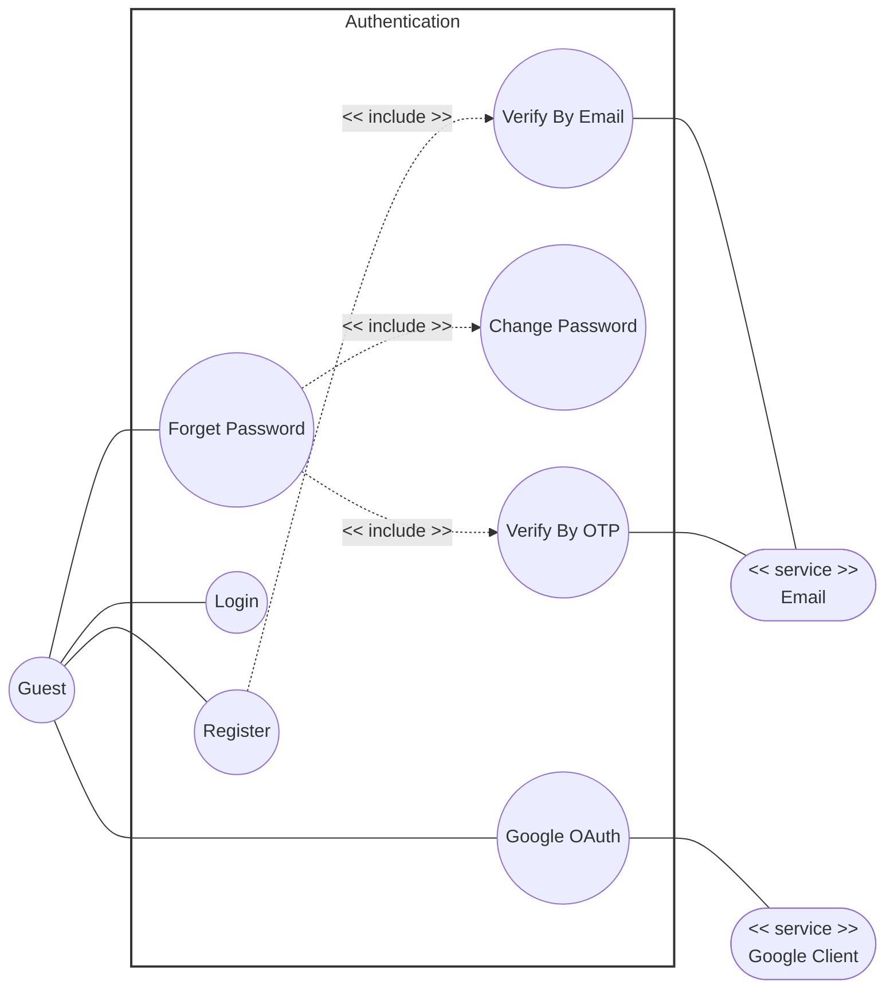
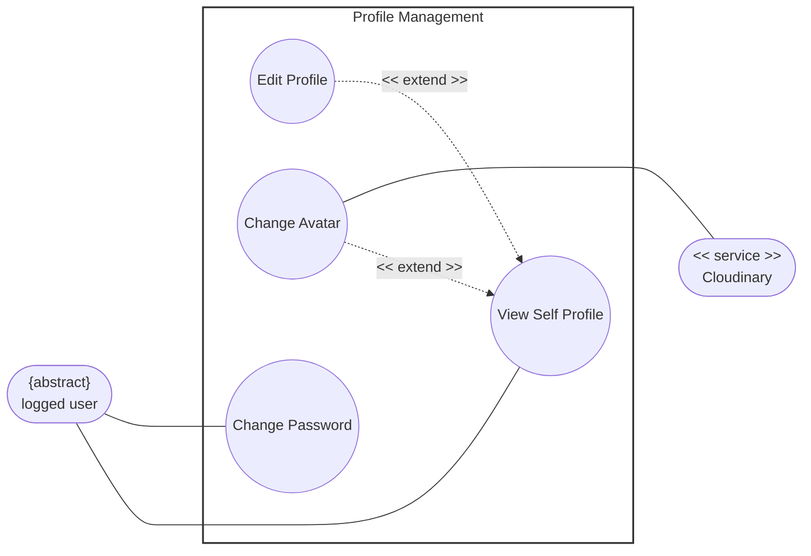
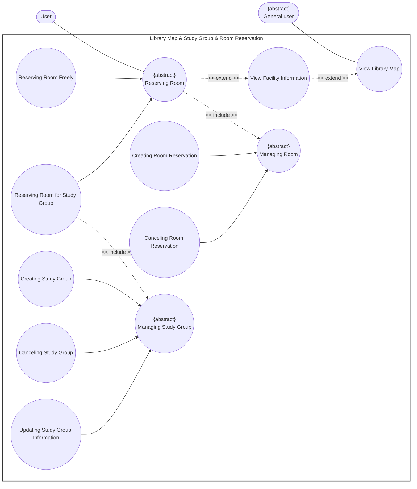
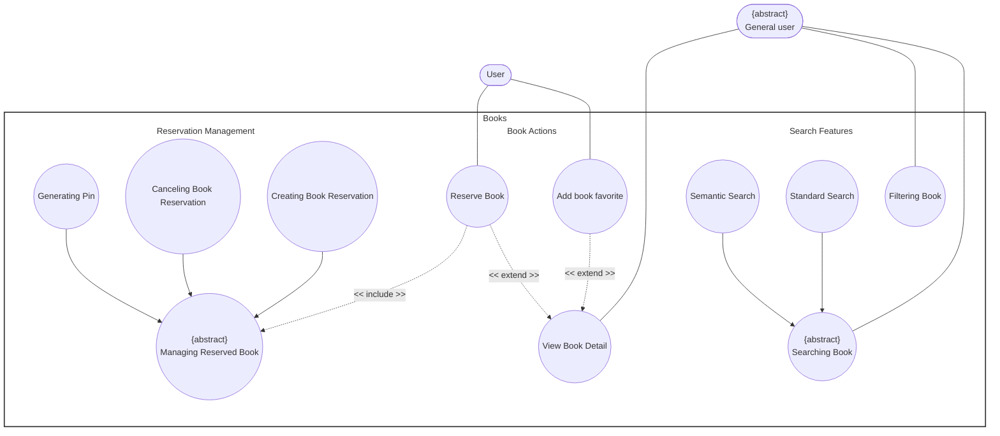
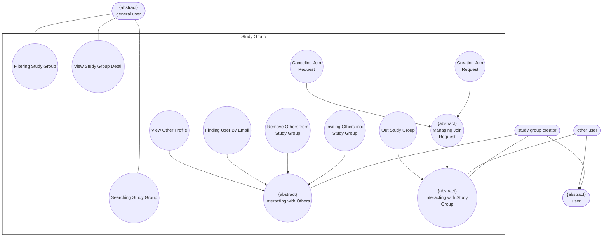
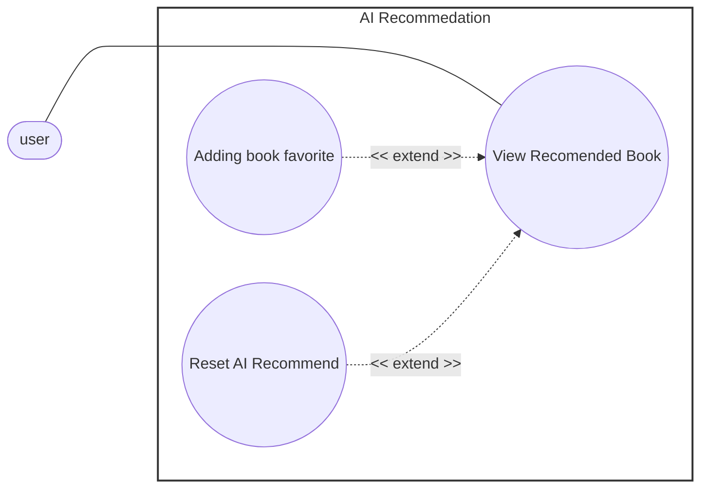
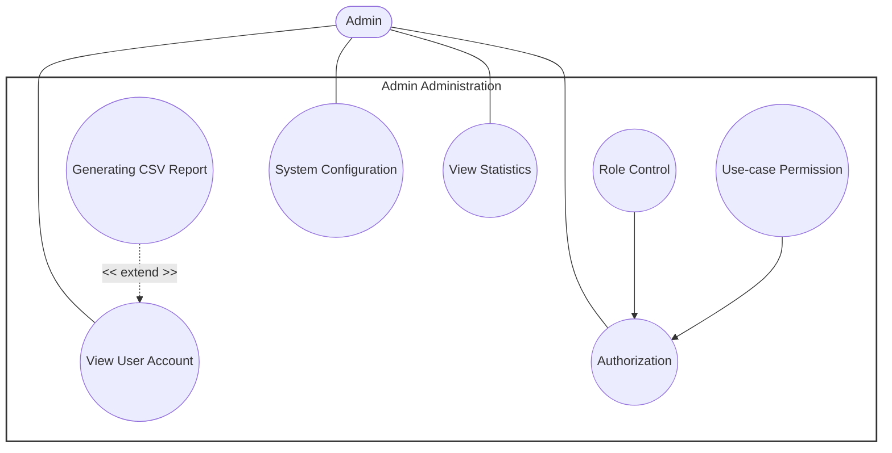
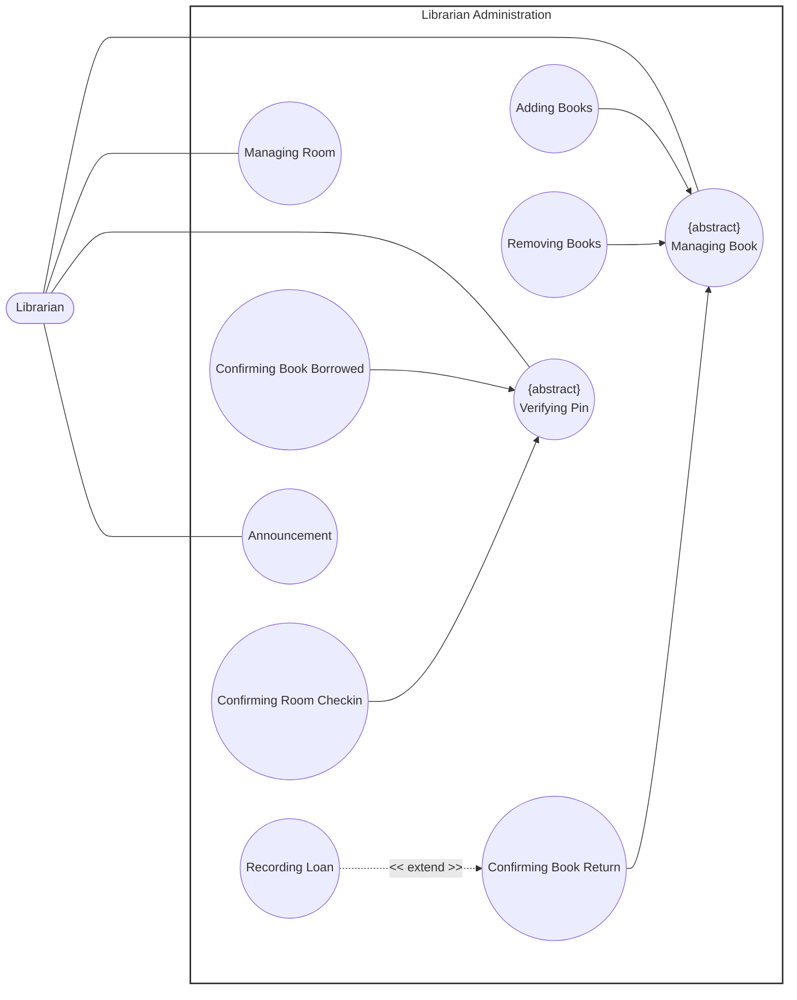

# Usecase Diagram

**Project Name:** Modern Library Management System

**Course:** CS300 – CSC13002 – Introduction to Software Engineering 

**Group ID:** 03

**Group Name:** Amethyst

**Assignment:** PA3-2026

## Table of content
- [Usecase Diagram](#usecase-diagram)
  - [Table of content](#table-of-content)
  - [Regulation](#regulation)
  - [Authentication](#authentication)
  - [Profile Management](#profile-management)
  - [Library Map \& Study Group \& Room Reservation](#library-map--study-group--room-reservation)
  - [Library Exploration](#library-exploration)
  - [Study Group](#study-group)
  - [AI Recomendations](#ai-recomendations)
  - [Admin Administration](#admin-administration)
  - [Librarian Administration](#librarian-administration)

## Regulation

## Authentication 

## Profile Management

## Library Map & Study Group & Room Reservation

## Library Exploration

## Study Group

## AI Recomendations

## Admin Administration

## Librarian Administration

