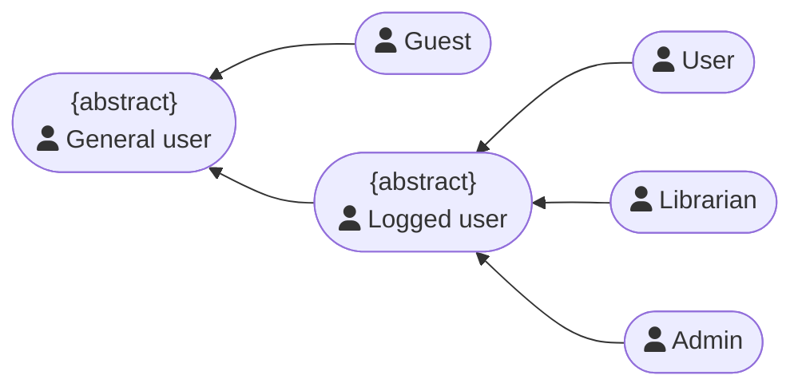
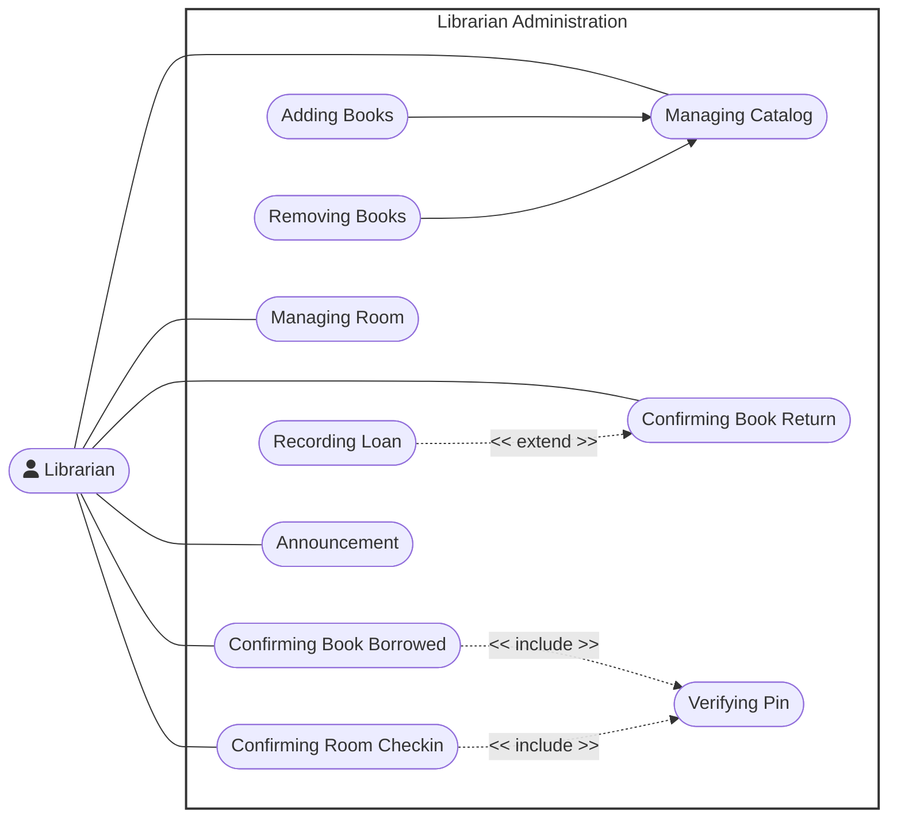
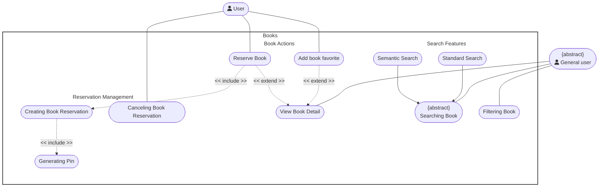

Yes, **generalization is significantly misused** in several sections of your Use Case diagrams.

In UML standard specifications, **Generalization** (`Child --> Parent`) represents an **"is-a" (specialization)** relationship, meaning the child use case is a specific variation of the parent's goal (for example, *Pay with Credit Card* **is a** *Pay Bill*).

In your diagrams, generalization has been confused with **sub-steps (`<< include >>`)**, **optional triggers (`<< extend >>`)**, and **category/folder grouping**.

---

### Major Misuses Identified

#### 1. Confusing Sub-steps (`<< include >>`) with Generalization

* **Location:** `Librarian Administration`
* **The Error:** `UC8 (Confirming Book Borrowed) --> UC7 (Verifying Pin)` and `UC9 (Confirming Room Checkin) --> UC7 (Verifying Pin)`.
* **Why it is wrong:** Confirming a borrowed book is **NOT** a "special type of Verifying PIN". Rather, verifying a PIN is a *reusable sub-step/validation* required during book pickup or room check-in.
* **How to fix:** Change the relationship from Generalization (`-->`) to `<< include >>`, with the arrow pointing **from** the main use case **to** `Verifying Pin`.

#### 2. Using Abstract Use Cases as "Folder/Category" Titles

* **Location:** `Study Group` and `Books Exploration & Interaction`
* **The Error:**
* `UC7 (Finding User By Email)` and `UC8 (View Other Profile)` point via generalization to `UC4 (Interacting with Others)`.
* `UC_GenPin (Generating Pin)` points via generalization to `UC_AbsManageReserve (Managing Reserved Book)`.

* **Why it is wrong:** "Finding User By Email" is not a "specialized form of interacting with others"—it is a search/helper step used when inviting a member (`<< include >>`). Abstract use cases should not be used as organizational "folders" for unrelated actions.
* **How to fix:** Connect search/view actions directly to the actor or relate them using `<< include >>` / `<< extend >>` to the main workflow.

#### 3. Over-complicated / Redundant Actor Hierarchy

* **Location:** `Regulation`
* **The Error:** `Admin`, `User`, and `Librarian` inherit from **both** `Logged user` **AND** `General user`, while `Guest` inherits from `General user`.
* **Why it is wrong:** If `Logged user` inherits from `General user`, then any actor inheriting from `Logged user` automatically inherits all capabilities of `General user` via **transitive inheritance**. Drawing parallel inheritance lines from every role to both abstract actors creates redundant clutter.

---

### Corrected Diagrams

Below are the corrected Mermaid diagrams for the affected sections:

#### Fix 1: Regulation (Clean Actor Hierarchy)

Establish a clean multi-level hierarchy where `Logged user` inherits from `General user`:

---

#### Fix 2: Librarian Administration

Replace incorrect generalization with `<< include >>` for PIN verification:

---

#### Fix 3: Books Exploration & Interaction

Fix `Generating Pin` to be an `<< include >>` of `Creating Book Reservation`:

