# APPLICATIONS SURVEY
  

Performed by: Trần Lê Hoàng Gia, Phan Lê Anh Minh

  

Reviewed by: Vũ Duy Nhất

  

Edited by: Trần Lê Hoàng Gia, Phan Lê Anh Minh

  
  

## 1. [The University of Chicago - Library](https://www.lib.uchicago.edu/)

  

### 1.1. Features Surveyed

  

#### 1.1.0. GUI Layout

  

Top navigation bar groups menus by user intent: *Search*, *Borrow & Request*, *Research & Teaching*, and *Visit & Study*. A large centralized search box dominates the homepage for immediate access to the collection.

  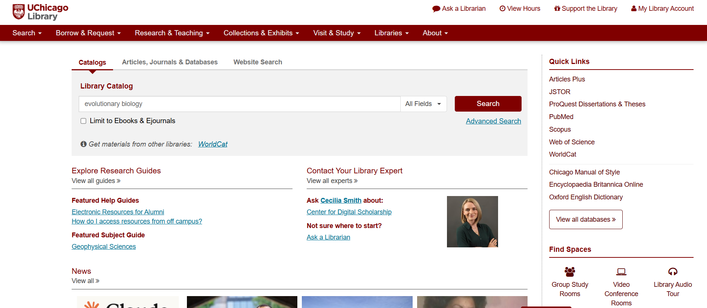

#### 1.1.1. Authentication

  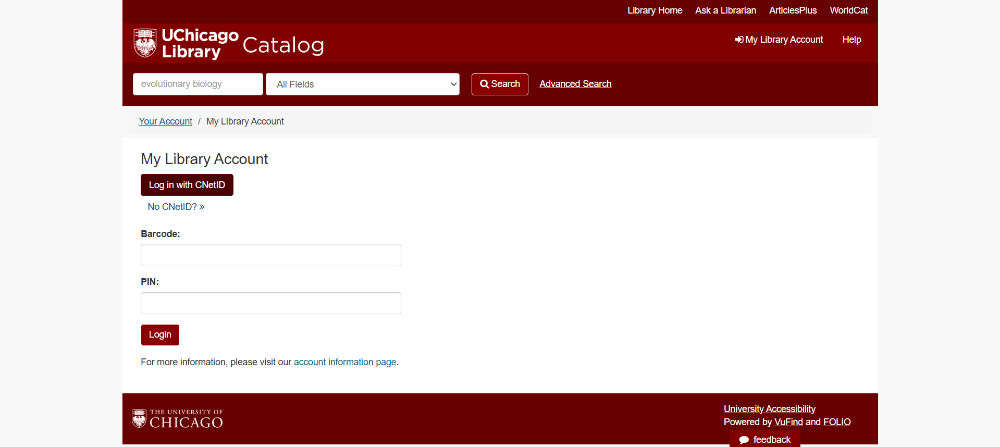

- Campus-wide SSO, users log in with standard university credentials.

- Unlocks personalization: borrowing history, online renewals, restricted journal access, and room booking.

  

#### 1.1.2. Borrowing & Returning Book

  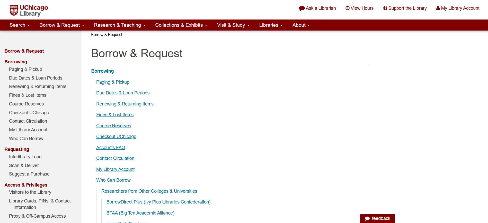

- Users submit a physical "Borrow Request" via the web interface and select a pickup location (front desk or locker).
- Only users and approved visitors can send borrow request. 

- An automated notification is sent when the item is ready.

- Active loans and due dates are listed in the portal; users can renew online.

- Physical returns go through campus drop-boxes; status updates after a librarian scans the item.
  
  

#### 1.1.3. Searching

`Search`→ `Library Catalog` → `Basic / Advanced Search`

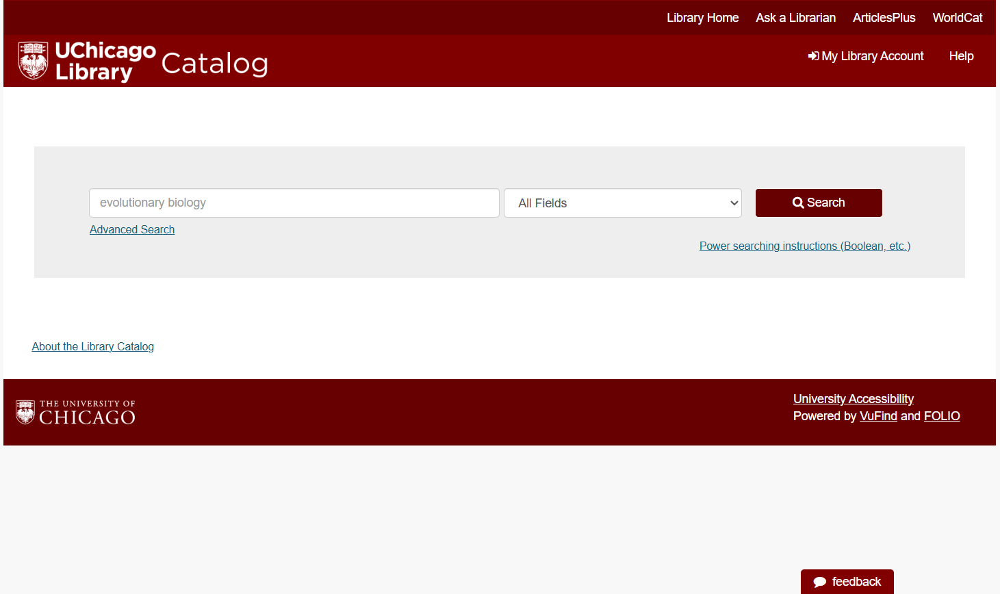


  


- Homepage search box supports keywords, author names, and titles.

- Advanced Search filters by year, language, material type, or campus collection.

  

#### 1.1.4. Citation Support

  `Research & Teaching` → `Citation Management`

- Book/article detail pages automatically extract bibliographic data (Author, Publisher, Year, Page Ranges).

- Users can copy APA/MLA/Chicago formats or export `.bib`/`.ris` files for Zotero or Mendeley.

  


  

#### 1.1.5. Study Room Reservation

  
`Visit & Study` → `Book a room`

- Real-time time-slot grid shows room availability.

- Selecting an empty slot triggers instant policy checks and sends a confirmation email.

  

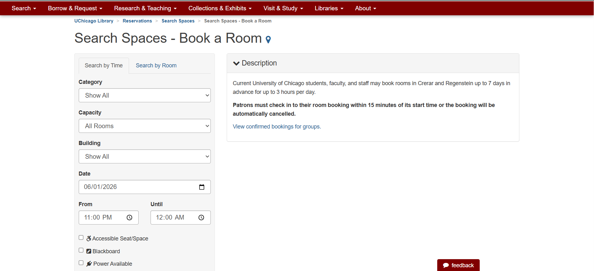


  

---

  

### 1.2. Workflow

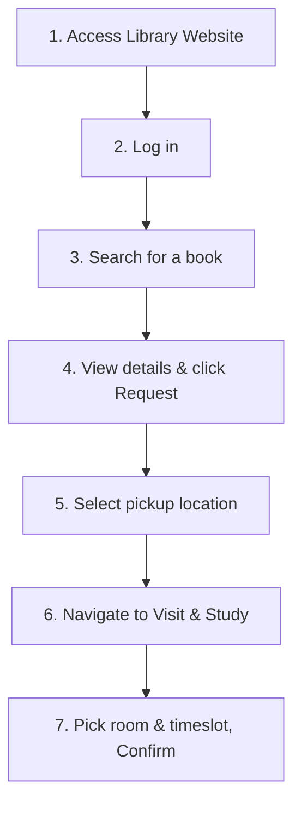
```mermaid
graph TD
    A["1. Access Library Website "] --> B["2. Log in"]
    B --> C["3. Search for a book"]
    C --> D["4. View details & click Request"]
    D --> E["5. Select pickup location"]
    E --> F["6. Navigate to Visit & Study"]
    F --> G["7. Pick room & timeslot, Confirm"]
```

  

1. Log in with school credentials to unlock access.

2. Use the search box to find a book; open its detail page for citation or to place a hold.

3. Go to room booking, pick an open slot on the grid, and confirm.

  

---

  

## 2. [Papyrus Library Cloud](https://www.papyruscloud.org/)

  

### 2.1. Features Surveyed

  

#### 2.1.0. GUI Layout

  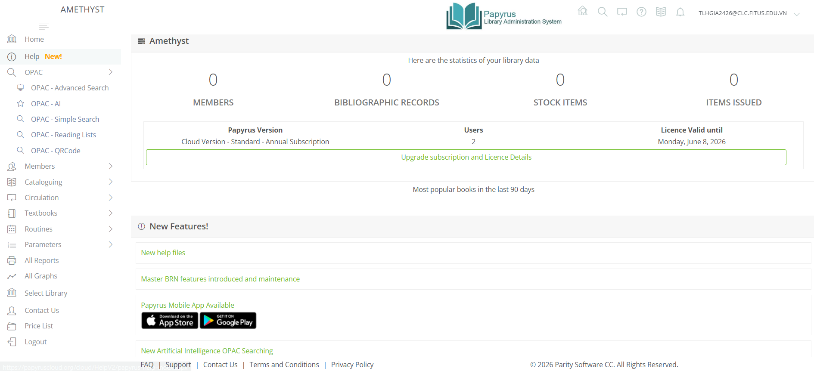

Staff-facing administrative dashboard. A main ribbon contains large buttons: *Members*, *Cataloguing*, *Front Desk*. Data is managed through input forms and grid ledgers.

  

#### 2.1.1. Authentication

  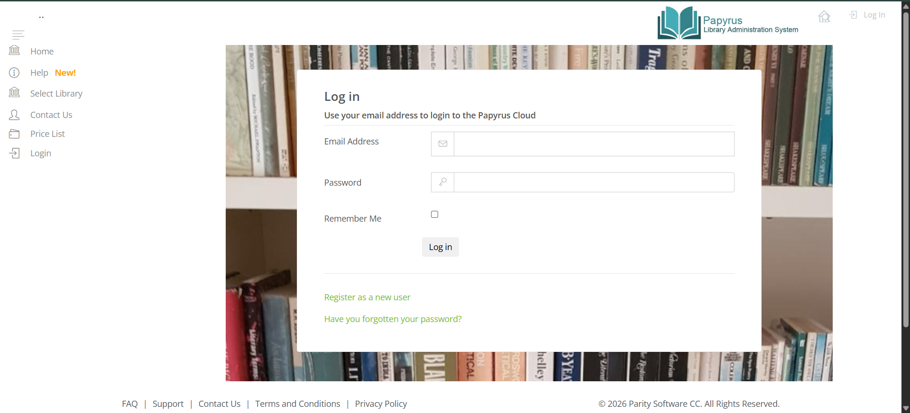

- Secure SaaS login gateway supporting multiple library organizations on the same platform.

- Role-Based Access Control (RBAC): front-desk staff handle checkouts/returns; admins manage configuration and reporting.

  
#### 2.1.2. Searching

`OPAC` -> choose 1 option of `OPAC` 

Advanced search
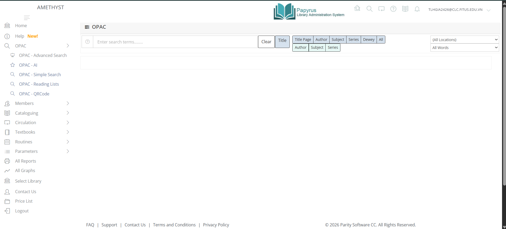

OPAC - AI
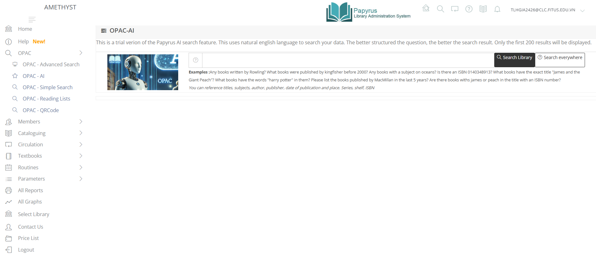
#### 2.1.3. Managing Members


- **Members** → **New**, fill in name, member type, and email, and the system assigns a sequential ID automatically.


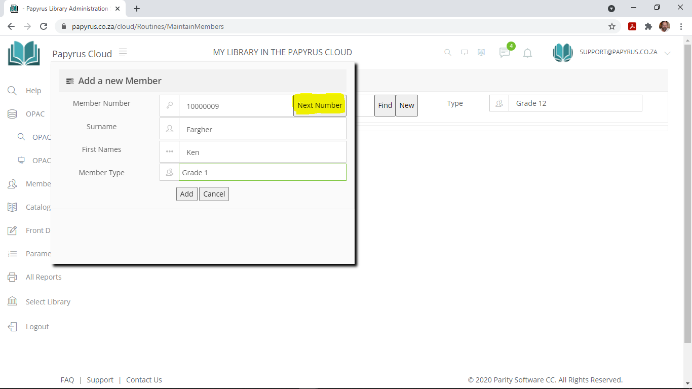


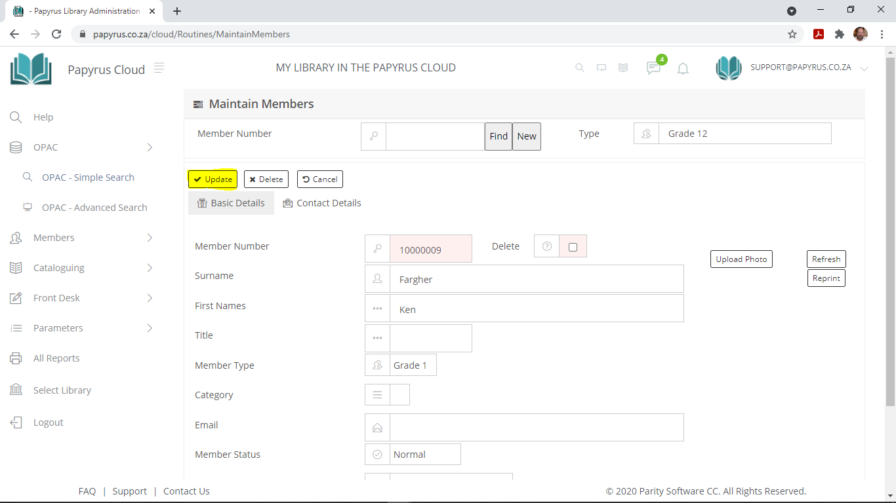


#### 2.1.4. Cataloguing Books and Adding Stock

`Cataloguing` -> choose a CAT option -> `Add`

- **Cataloguing:** Create a master book entry under *Cataloguing*; system generates a Bibliographic Record Number (BRN).

  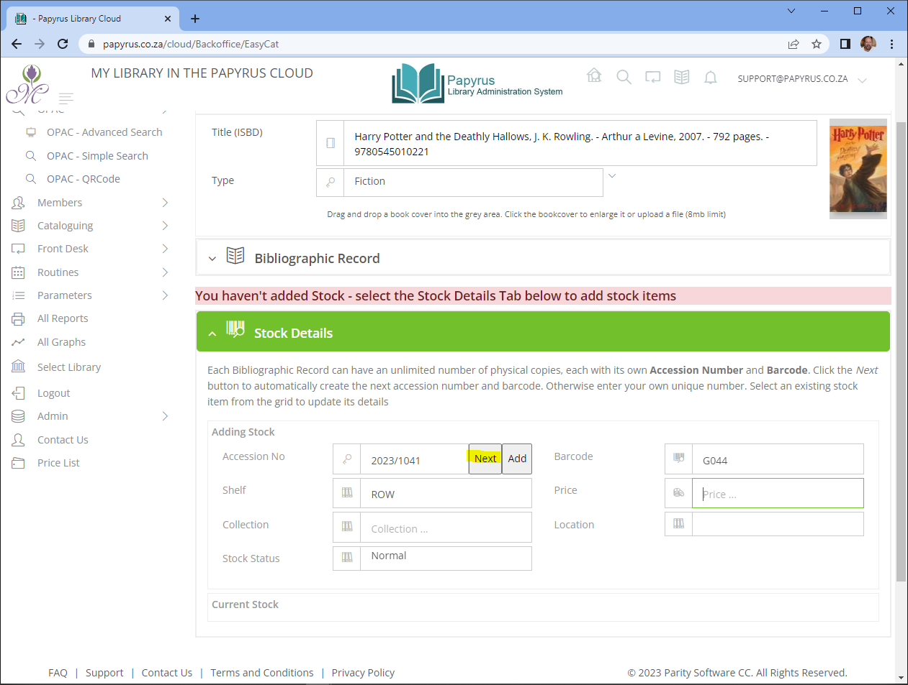

- **Adding Stock:** Under the **STOCK ITEMS** tab, staff add individual copies by assigning an Accession Number, scanning the barcode, and setting **Location > Collection > Shelf**.

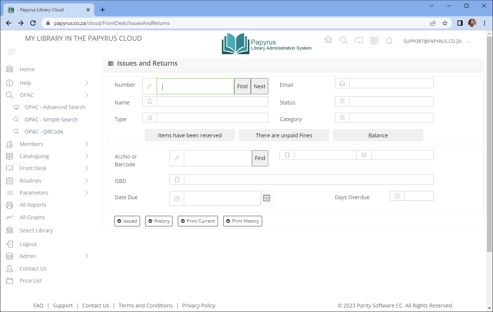

#### 2.1.5. Borrowing Book (Book Issues)

  

- Open **Front Desk** → scan patron's library card barcode to load their profile.

- Scan the book's barcode → press **Enter** to commit the loan with an auto-calculated due date.

  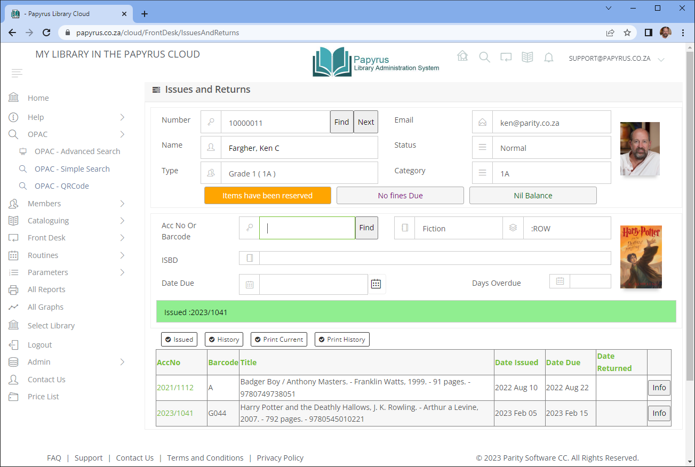

#### 2.1.6. Returning Book
  

- Scan the returned book's barcode directly, no need to look up the member first.

- System closes the loan, checks for fines, and reverts item status to "Available."


#### 2.1.7. QR / Barcode Scanning

  

Two-scan pattern keeps each transaction under 10 seconds: one scan for the patron's card, one for the book. Used across all checkout and return operations.

  

---

  

### 2.2. Workflow


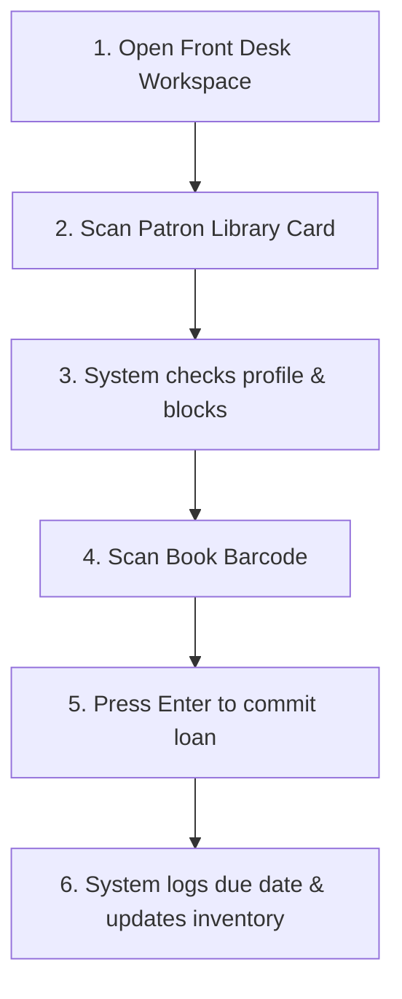
```mermaid

graph TD

    A["1. Open Front Desk Workspace "] --> B["2. Scan Patron Library Card"]

    B --> C["3. System checks profile & blocks"]

    C --> D["4. Scan Book Barcode"]

    D --> E["5. Press Enter to commit loan"]

    E --> F["6. System logs due date & updates inventory"]

```

  

1. Open *Front Desk* terminal.

2. Scan patron card → scan book barcode → press Enter.

3. Transaction complete; item marked "Checked Out" in the database.

  

---

  

## 3. [Accessit Library](https://www.accessitlibrary.com/)

  

### 3.1. Features Surveyed

  

#### 3.1.0. GUI Layout

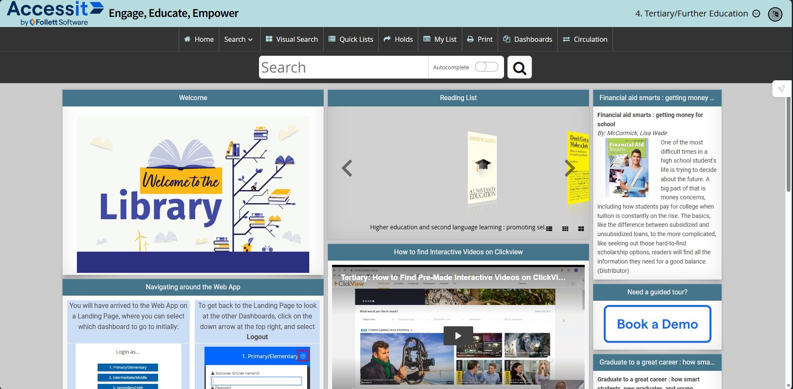

  

Modern educational hub layout using an asymmetric widget grid. The landing page supports embedded video tutorials, announcements, and information blocks rather than plain text tables.

  

#### 3.1.1. Authentication

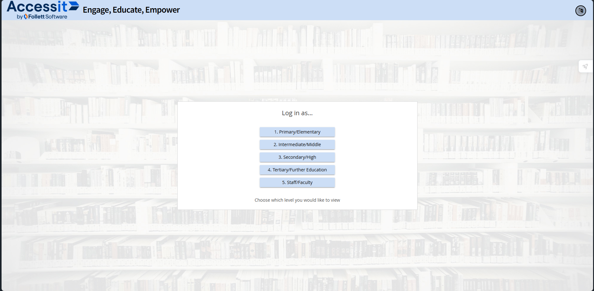

- Account-gated login that acts as a routing gateway.

- Interface complexity adjusts by role: young students get a visual, icon-heavy layout; librarians and older students get a full-featured data-dense view.

  

#### 3.1.2. Borrowing Book

  

- Students click **Borrow** on an item's detail page to request it.

- Staff finalize the checkout at the circulation desk by scanning both the patron card and book barcode.

  

#### 3.1.3. Returning Book

  

- Staff toggle to **Return** mode at the circulation panel and scan the book barcode.

- System ends the loan and updates item status to "Available" immediately.

  

#### 3.1.4. Searching & Filters

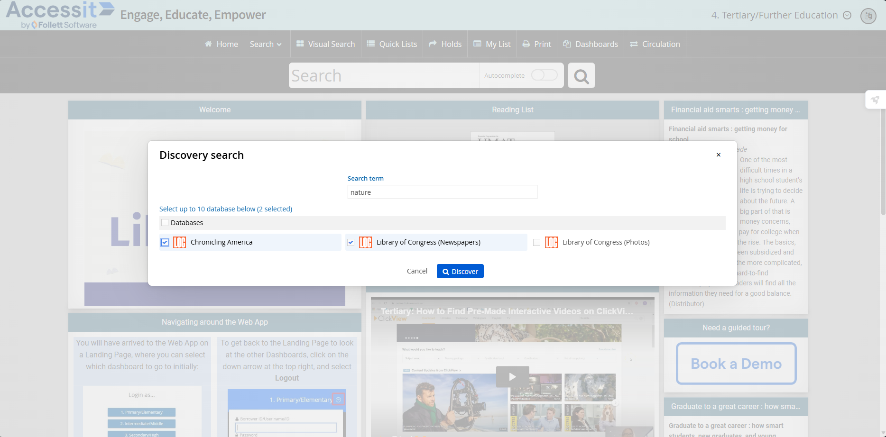

  

- **Advanced Search:** Multi-parameter queries across author, title, format, and collection.

- **Faceted Sidebar:** Real-time filter checkboxes (e.g., "Available on Shelf") to narrow results instantly.

- **Visual Search:** Icon buttons for broad topics (e.g., soccer ball for *Sports*, T-Rex for *History*) — no typing required, ideal for younger users.

  

#### 3.1.5. Circulation (Borrowing & Returning at the Desk)

  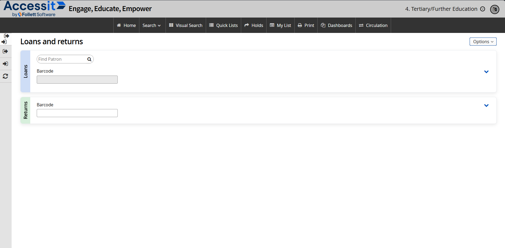

Split-panel front-desk workspace:

- **Issue mode:** Scan patron card → scan book barcode → loan logged.

- **Return mode:** Scan book barcode → loan closed, item set to "Available."

  

#### 3.1.6. Pay Fees


- Overdue fines are auto-calculated based on daily rate × days overdue.

- Outstanding balance shown on the patron's profile; staff record cash payment and clear the fine directly in the interface.

  

#### 3.1.7. Quick List

  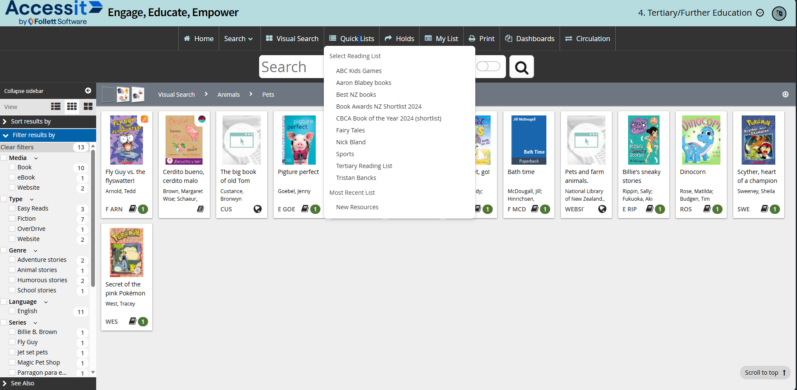

Users add items to a virtual tray while browsing (like a shopping cart) to save, review, or print a curated reading list within a session.

  

#### 3.1.8. Dashboard

  

Admin overview with daily statistics, circulation counts, and outstanding alerts in a scannable visual layout.

  

---

  

### 3.2. Workflow

  

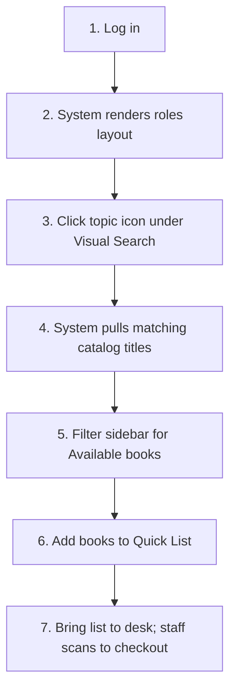
```mermaid

graph TD
    A["1. Log in"] --> B["2. System renders roles layout"]
    B --> C["3. Click topic icon under Visual Search"]
    C --> D["4. System pulls matching catalog titles"]
    D --> E["5. Filter sidebar for Available books"]
    E --> F["6. Add books to Quick List"]
    F --> G["7. Bring list to desk; staff scans to checkout"]
```

  

1. Log in — gateway renders a layout suited to the user's age/role.

2. Click a topic icon instead of typing; filter sidebar for available items.

3. Add books to Quick List; bring to desk for physical checkout.

  

---

  

## 4. Summary and Proposed App Improvements


### 4.1. Common Features Across Existing Products


- **Identity & Access Management:** Role-separated authentication (students, librarians, admins).

- **Catalog Discovery:** Bibliographic storage and keyword search.

- **Circulation:** Loan/return processing via barcode, with due date and overdue tracking.

  
---
### 4.2. Comparison of approaches

| **Entity**                            | **Deployment Model**          | **Target Audience**                                                     |
| ------------------------------------- | ----------------------------- | ----------------------------------------------------------------------- |
| **The University of Chicago Library** | **On-Premises / Distributed** | **Researchers** & End-User Students                                     |
| **Papyrus Library Cloud**             | **Multi-Tenant / Cloud**      | **Library IT Administrators** & Operations Personnel                    |
| **Accessit Library**                  | **Cloud SaaS / Hybrid**       | **End-User Students**, K-12/Tertiary Learners, & Operational Librarians |

### 4.2. Proposed Features Our App Adds

  

#### 4.2.1. Semantic Search with AI Support


- **Problem:** Typos or vague descriptions return zero results in traditional search.

- **Solution:** Text-embedding AI converts catalog summaries to vectors; queries are matched by meaning, not exact keywords.

```
[User Quote/Concept] ➔ [Ollama / OpenAI Embedding] ➔ [Vector DB Lookup] ➔ [Neo4j Work/Edition Fetch] ➔ [Display with OpenLibrary Cover]
```

- **Benefit:** Users can search by concept or plot description in plain language, no exact title needed.

  - **The Tools:** Ollama (`nomic-embed-text` model for local $0 development) or OpenAI API (`text-embedding-3-small`), **ChromaDB** (free local vector database), and the **Open Library Covers API**.
    
- **The Workflow:**
    
    1. **Ingestion:** Python loader saves the 20,000 `Work` titles, it passes the text string through the embedding model to get a vector array (e.g., a list of numbers like `[0.12, -0.43, ...]`). We this vector in ChromaDB using the `work_id` as the reference key.
        
    2. **Querying:** When a user types _"a book about animals taking over a farm"_ into the search bar,  `FastAPI` backend converts that string into a vector using the exact same embedding model.
        
    3. **Matching:** Query ChromaDB for the closest vector match (Cosine Similarity). Take the returned `work_id`, look it up instantly in **Neo4j** to grab the title and matching ISBN, and display it on the frontend with its Open Library cover string.

#### 4.2.2. Study Companion or Group Matching

  
- **Problem:** Library portals are purely transactional; no way to connect with nearby students on the same topic.

- **Solution:** A matching engine lets users toggle "Looking for a Study Partner" and select a subject when booking a room. The platform connects students in the same building with the same goal.


- **Benefit:** Turns the library into a collaborative hub, helping students find accountability partners and reduce academic isolation.


  - **The Tools:** **Neo4j, AuraDB** (utilizing Cypher pattern matching) and FastAPI WebSockets.
    
- **The Workflow:**
    
    1. **The Toggle:** When a student books a study room, they toggle a checkbox: `[x] Looking for a Study Partner` and select a `Topic` (e.g., _"Software Engineering"_).
        
    2. **The Graph Write:** `FastAPI` saves the room booking and adds a temporary state relationship to the user node: `(User)-[:LOOKING_FOR_PARTNER {topic: "Software Engineering"}]->(TimeSlot)`.
        
    3. **The Matching Engine:** The backend instantly fires a Cypher traversal query to find overlaps.
        
    4. **The Result:** The UI displays a list of matched peers right inside the booking flow, allowing the student to invite them to the room reservation.

#### 4.2.3. Spatial Description of Study Room Layouts
  

- **Problem:** Room booking is blind, users can't tell if a room has a whiteboard, outlets, or accessible entry.

- **Solution:** 2D room map embedded in the reservation flow. Users inspect seating, windows, and outlet placement before booking.

- **Benefit:** No more arriving to find a room unsuitable — users make informed choices upfront.

  

#### 4.2.4. Personal AI Recommendation Engine


- **Solution:** Collaborative Filtering maps checkout history, ratings, and search patterns to model each user's reading taste.

- **Benefit:** A personalized "Recommended for You" feed on the homepage helps students discover relevant resources they wouldn't have searched for.

- **The Tools:** **Neo4j AuraDB** (Collaborative Filtering via Cypher queries).
    
- **The Workflow:**
    
    1. **User History tracking:** Every time a user interacts with a book, your backend records it as a transaction: `(User)-[:BORROWED]->(BookCopy)` or `(User)-[:REVIEWED {rating: 5}]->(Work)`.
        
    2. **Graph Traversal Recommendation:** On the app homepage, the "Recommended for You" section executes an item-based collaborative filtering query over your RecKG network:
        
    3. **The Rendering:** `FastAPI` returns this array of raw book items to the frontend, which injects them straight into your swipeable book-jacket carousels.
  


---

  

### 4.3. UI/UX Patterns Adoption

The potential UX/UI pattern that could be reused in our project:

- **In-Box Mode Toggles:** Radio switches inside the search bar to swap between keyword and AI semantic search without changing pages.

- **Intent-Based Navigation:** Menus named after user goals (*Collaborate*, *Research & Learn*, *Reserve Space*) instead of system modules.

- **Color-Coded Availability Badges:** Green/red status badges on book cards — no need to click into a detail page to check availability.

- **Fluid Carousels:** Swipeable book-jacket layouts for recommendations to encourage browsing and discovery.