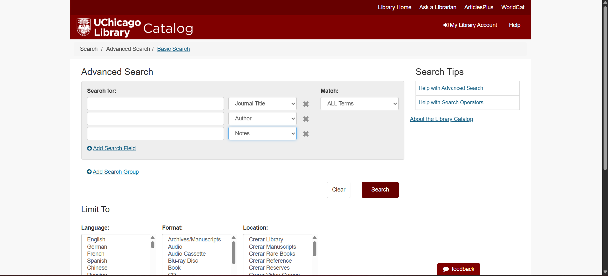
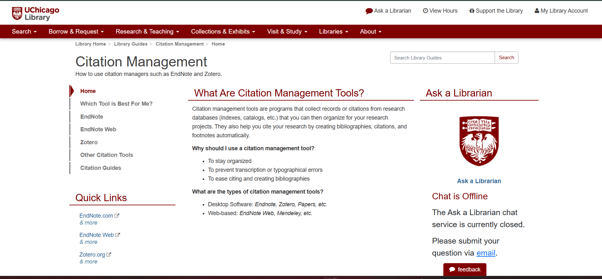
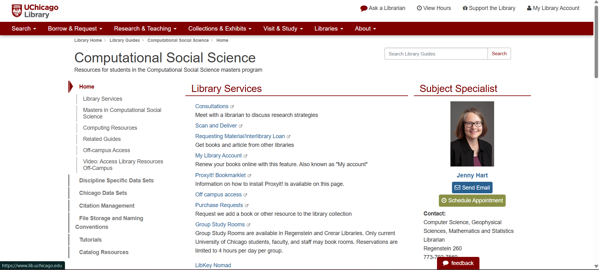
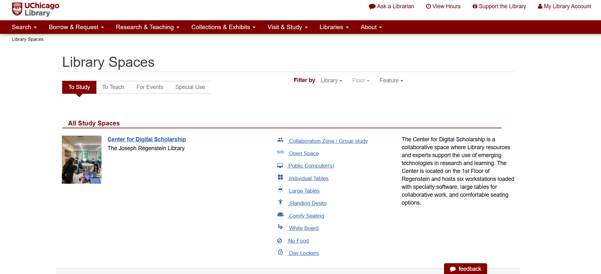
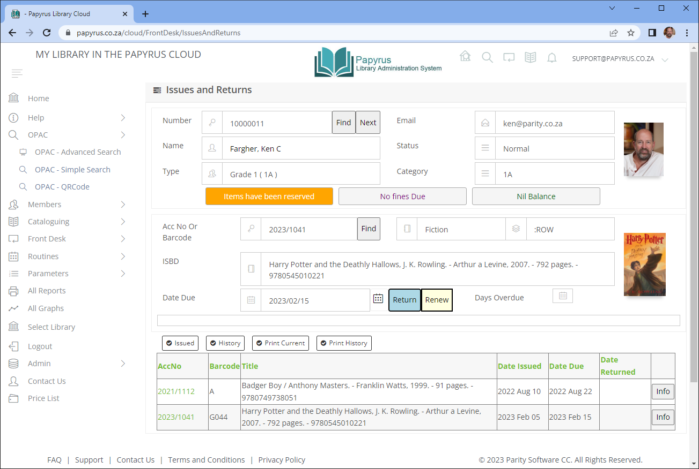

## Existing app UI 
### [The University of Chicago - Library](https://www.lib.uchicago.edu/)
- Searching tools: text query for available work

`Search` -> `Library Catalog` -> `Basic / Advanced Search` 

- Citation Management:extracts bibliographic attributes (Author, Publisher, Year, Page Ranges) and instantly serializes them into standardized files (like .bib or .ris) that sync directly into software tools like Zotero or Mendeley.

`Research & Teaching` -> `Citation Management` 

- Subject guide: an overrall instruction on a specific topic in text and online resources, each subject goes with instructor contact info for further need.    

`Research & Teaching` -> `Subject Guide` 

- Booking room: A time-slot booking engine that tracks spatial availability in real time. It allows patrons to reserve specific rooms, manages maximum reservation durations, enforces library policies, and prevents overlapping booking conflicts.

`Visit & Study` -> `Book a room` 

- Library spaces: Description of study corner including capacity, resources availability...

`Visit & Study` -> `Spaces to study` 

### [Papyrus Library Cloud](https://www.papyruscloud.org/)
The images in this section are take from [this link](https://papyruscloud.org/cloud/HelpV2/papyrus-quickstart-guide) 

- Home page:

- Adding and maintaining member:
  Every patron who borrows library materials must possess a unique operational record to track liabilities and privileges.

  - *Initiation:* Click the **Members** icon on the main Tool Strip.
  - *Creating the Form:* Click the **New** button. A popup form will appear.
  - *Identifier Assignment:* Click **Next Member**.
  - Enter the patron’s **Surname** and **First Names**.
  - Select a **Member Type** from the dropdown menu.
  - Fill in auxiliary contact points, prioritizing the **Email Address** for automated system notifications.
  - *Saving:* Click the **ADD** button to commit the core record. 

- Cataloguing books and Adding stock

  - Navigate to **Cataloguing** and launch the **EasyCAT** module workspace.
  -  Click **New** to prompt a new master entry profile.
  - The system assigns an internal **BRN (Bibliographic Record Number)** sequentially. Select the matching general publication format template.
  - Complete the input fields. Click **UPDATE** to save the master schema.
  
  -  Within the same EasyCAT book record view, click on the **STOCK ITEMS** tab layout.
  - Click the **ADD NEW STOCK ITEM** button.
  - Assign an **Accession Number**.
  - *Scan or Input Barcode:* Click into the Barcode field. Use a barcode scanner or keyboard to map the exact unique sticker barcode attached to that physical copy.
  - *Physical Location Mapping:* Designate the spatial home for the item inside the three-tiered organizational architecture: **Location > Collection > Shelf**. At minimum, assign a distinct **Shelf** coordinate so patrons can find it.

- Book issues and Returning
  - Open the **Front Desk** workspace view from the main ribbon.
  - Identify the Patron:** The cursor sits by default in the `Member Number` field. Type or scan the user's library card barcode. The system instantly loads the profile information, checking for blocks or caps.
  - *Identify the Asset:* The system automatically drops the terminal focus directly down into the  **AccNo / Accession Barcode** input field.
  - **Commit the Loan:** Scan the barcode attached to the physical book. Press **Enter/Return**. The transaction executes instantly, binding the item to the user profile and displaying calculated custom due dates down in the action grid ledger.
    In case of returning:
  - **Scan directly:** Take the physical book being returned and scan its barcode straight into the main entry field.
  - **System Evaluation:** Papyrus identifies that the item status is currently "On Issue," automatically loads the corresponding borrower's liability parameters, marks the asset as returned safely to stock, and stops loan counters.

### Open-source: FOLIO Platform

- **Microservice Architecture:** Architected as a decoupled ecosystem of containerized backend applications that utilize an API gateway to talk to one another over REST interfaces, allowing institutions to run only the services they need.
    
- **Community Governance Councils:** Governed openly through a structured framework led by an independent Product Council, Technical Council, and Community Council, supplemented by domain-specific Special Interest Groups (SIGs).
    
- **Native ERM Capabilities:** Built from its inception with core electronic resource management (ERM) modules designed to ingest and process digital contract parameters, including native apps for _Agreements_, _Licenses_, _eHoldings_, and _eUsage_ data metrics.
    
- **Decoupled Data Analytics (Metadb):** Isolates operational reporting via a distinct analytics database layer (`Metadb`) that transforms highly variable, transactional JSON data from microservices into standard relational tables, avoiding performance degradation on production clusters.

### Papyrus Library Cloud

- **Commercial SaaS Delivery Model:** Implements a pure software-as-a-service model hosted, maintained, and deployed entirely on vendor-managed cloud networks under a commercial operating structure.
    
- **Vendor-Managed Paradigm:** Incorporates an integrated, client-facing _Price List_ and corporate service-tier architecture natively within the platform ecosystem, targeting buyers who want to outsource infrastructure overhead.
    
- **Client Authentication Footprint:** Utilizes an account-gated, minimalist landing page optimized for secure tenant authentication and administrative workflows rather than functioning as an open public discovery portal.

### Accessit Library

- **Role-Gated Interface Profiling:** Uses an initial gateway path to filter users by their academic level, dynamically re-rendering the frontend layout, visual vocabulary, and data density to accommodate different learning age groups.
    
- **Component-Driven Educational Hub:** Replaces standard catalog tables with an asymmetric widget grid that embeds multimedia tutorials, citation advice, and external university research references directly into the user interface.
    
- **Faceted Visual Search Taxonomy:** Lowers the barrier to entry for early stage researchers by offering iconographic category buttons that trigger automated background search parameters without requiring manual keyword drafting.

## Common features of existing products

- **Identity and Access Management (IAM)**
    
    - University Stack Implementation:_ Orchestrated via enterprise Single Sign-On (SSO) infrastructures such as Shibboleth or Central Authentication Service (CAS). This maps digital patron identities to physical security parameters, including building turnstiles, private study space resource schedulers, and off-campus proxies (e.g., EZproxy) for restricted publisher networks.
        
    - _Software Codebase Implementation:_ Expressed via web token verifiers, security filter middlewares, and strict Role-Based Access Control (RBAC) permission tables. The codebase acts as a digital gatekeeper, explicitly evaluating whether an authenticated system account possesses the specific cryptographic scopes required to alter ledger balances, invoke API endpoints, or modify a patron profile.
        
    - _Objectives_: Guarantees institutional data privacy compliance, prevents privilege escalation by unauthorized staff or external actors, and creates a frictionless user experience by removing multi-login barriers for researchers moving between disparate databases.
        
- **Metadata Management and Discovery Control**
    
    - _University Stack Implementation:_ Executed through active local cataloging, metadata curation, and database maintenance workflows. Staff verify and enrich bibliographic records (e.g., MARC schemas) and map them directly to physical shelf locations across a campus footprint, exposing these records to unified user-facing discovery networks like WorldCat or UC Library Search.
        
    - _Software Codebase Implementation:_ Managed via database storage configurations, ingestion pipelines, and search index mappings. In FOLIO, this manifests as specialized back-end inventory applications, QuickMARC editing modules, and data import/export engines that store abstract instance, holding, and item records independently of any physical building layout.
        
    - _Objectives:_ Delivers high-precision retrieval of complex academic resources, enforces cross-system data standardization across institutional boundaries, and provides real-time, accurate availability matching for physical and electronic items.
        
- **Fulfillment and Circulation Workflows**
    
    - _University Stack Implementation:_ The operational orchestration of logistics, personnel, and physical inventory. It relies on circulation desks, sorting equipment, physical drop-boxes, course reserve shelves, and regional courier transport vehicles moving items through the physical campus network.
        
    - _Software Codebase Implementation:_ Modeled as an abstract, deterministic state machine. Items are persisted as database records with changing status attributes (e.g., `Available`, `Checked Out`, `Missing`, `On Hold`). Code subroutines calculate loan rules, process renewals, trigger notices, and generate fine or fee entries when loan boundaries are violated.
        
    - _Objectives:_ Secures equitable access to high-demand materials through automated loan enforcement, provides workflow predictability for patrons tracking holds, and delivers unalterable transactional logs for administrative clarity.
        
- **External Integration Infrastructure**
    
    - _University Stack Implementation:_ The physical and institutional boundaries established with third-party networks. This includes configuring local network routing to external content providers (e.g., JSTOR, PubMed) and establishing secure data connections to book vendors (e.g., GOBI) and central campus enterprise resource planning (ERP) financial frameworks.
        
    - _Software Codebase Implementation:_ Expressed via programmatic interfaces, protocol adapters, and web standards. The system executes these integrations using RESTful web APIs, EDIFACT data parsers for automated acquisitions processing, OAI-PMH data-harvesting modules, and generic webhook configurations.
        
    - _Objectives:_ Consolidates access into a single search environment, cuts administrative labor via automated procurement pipelines, and ensures platform future-proofing by allowing developers to swap or upgrade modules cleanly.
    
## Comparison on existing apps

| **Entity**                            | **Deployment Model**      | **Target Audience**                              |
| ------------------------------------- | ------------------------- | ------------------------------------------------ |
| **FOLIO Platform**                    | Distributed / Cloud       | Library IT Administrators & System Developers    |
| **Papyrus Library Cloud**             | Multi-Tenant / Cloud      | Library IT Administrators & Operations Personnel |
| **UC Berkeley Library**               | Distributed               | End-User Students, Researchers, & Staff          |
| **The University of Chicago Library** | On-Premises / Distributed | Researchers & End-User Students                  |
|**Accessit Library**                   | Cloud SaaS / Hybrid (Multi-tier web application) | End-User Students, K-12/Tertiary Learners, & Operational Librarians |

# UX/UI Adoptation
- **The In-Box Mode Toggle:** Place tab controls or crisp radio toggles right inside or directly above the primary search box. This lets users change the underlying target database (e.g., searching for _local catalog entries_ vs. _all external database connections_) without switching pages.
    
- **Contextual Scoping Checkboxes:** filtering checkboxes directly beneath the text box. This keeps users from needing to navigate a complex advanced filter menu for common queries.
    
- **Fallback Redirect Anchors:** Place a clear secondary link below the search field (e.g., _"Not finding what you need? Search WorldCat"_). This guides the user to a fallback partner network or external integration.
      
- **Color-Coded Boolean State Indicators:** Group locations or service endpoints into a clean vertical list. Pair each item with a clear, color-coded state badge (e.g., a red background badge for `Closed`, a green one for `Open`) alongside current timestamp data (e.g., _"Hours today: 11 a.m. - 5 p.m."_).
    
- **"See Full Details" Contextual Drills:** Keep the main location dashboard clean by placing a uniform, low-emphasis action link (_"See full library details"_) beneath every entry. This prevents secondary data—like maps, floor plans, or staff contacts—from cluttering the high-level summary views.
       
- **Action-Oriented Intent Nesting:** Instead of naming the navigation items after the internal software modules , group the menus by user intent, such as **Borrow & Request**, **Research & Teaching**, or **Visit & Study**.
    
- **Categorized Functional Columns:** When a user opens a top-level menu category, split the submenu panel into distinct columns based on what the user wants to know versus what they want to do.
      
- **The "Account at a Glance" Header Link:** Keep a persistent **"My Library Account"** anchor link pinned to the global header. This gives users a 1-click path to view their active states, items checked out, and system notifications from anywhere in the app.
    
- **High-Frequency Utility Blocks:** Create a specific section on your home dashboard for the most common user workflows.
  
- **Dynamic Role-Selection Route Dispatcher:** Provide an entry splash card that segregates layouts based on organizational standing, adapting data complexity seamlessly for younger vs. older user sets.
    
- **Interactive Fluid Carousels:** Display resource offerings using 3D visual book-jacket sliders that users can scroll through on the home screen to increase click-through interactions.
    
- **Color-Coded Numerical Availability Badging:** Attach explicit green (available) or red (unavailable) counters directly to the thumbnail layout matrices to broadcast asset states straight from the database machine without clicking the item page.

## Existing app UI 
### [The University of Chicago - Library](https://www.lib.uchicago.edu/)
- Searching tools:

- Citation Management

- Library subject guide

- Booking room

- Library spaces:

### [Papyrus Library Cloud](https://www.papyruscloud.org/)
The images in this section are take from [this link](https://papyruscloud.org/cloud/HelpV2/papyrus-quickstart-guide) 

- Home page:

## The difference proposed app can do
Besides efforts to implement and reuse existing features, we propose some potential improvement that may be remarkable reasons for choosing our approach.

### Semantic Search with AI Support

- **The Concept:** Traditional keyword search might break if a user searches a concept or description. Semantic search maps the underlying _meaning_ of the phrase.
    
- **The Architecture:**
    
    - When books are cataloged, combine the Title, Description, Subject Tags, and First Chapter/Blurb into a unified text block.
        
    - Pass this text block through an embedding model (like `text-embedding-3-small`) to generate a vector representation (a coordinate array of real numbers representing semantic meaning).
        
    - Store these inside a vector-supported database extension like **Pgvector** running inside AuraDB.
        
    - When a user searches, compute the mathematical distance (Cosine Similarity) between the search vector and your catalog vectors to return conceptual matches instantly.

### Personal Recommendation
- **The Concept:** Standard systems use basic genre matching. We aim to predict user taste dynamically.
    
- **The Architecture:**
    
    - Implement **Collaborative Filtering** paired with **Content-Based Embeddings**.
        
    - Track explicit events: checkouts, holds placed, and search history.
        
    - If a user checked out three books that cluster closely together in your vector space, calculate the centroid of those three vectors. Search the database for other books closest to that centroid that they haven't read yet.
        
### Reviews Comparison

- **The Concept:** Instead of making a patron scroll through 50 contradictory reviews, provide an AI-generated meta-review summary alongside a comparison metric.
    
- **The Architecture:**
    - When a user pulls up a book detail page, an asynchronous background task pulls user-submitted reviews.
        
    - Run an LLM-based map-reduce operation: _“Summarize what readers loved, what they disliked, and who this book is best for based on these 30 reviews.”_
        
    - **Sentiment Analysis:** Score reviews computationally ($+1.0$ for highly positive, $-1.0$ for negative). Display a clean UI widget showing a metric breakdown: "85% praise the plot pacing, but 40% found the ending rushed."
        
### Book Trend Prediction 

- **The Concept:** Predict what books the library needs to buy _before_ they bottleneck or go out of stock.
    
- **The Architecture:**
    
    - Store checkout data with timestamp history and speacial occasion (semester exams, entrance exams...). Treat circulation velocity as a time-series regression problem.
        
    - If a book’s checkout frequency increases significantly week-over-week, flag it on the admin dashboard: _"Warning: 'Book X' is trending upward. Available copies: 2. Estimated bottleneck in 6 days. Recommend ordering 3 more licenses."_
        
### Disability Support

- **Digital Accessibility (Screen Readers, Dyslexia, Blindness):**
    
    - Strict adherence to **WCAG 2.2 / 3.0** standards. Every image must have dynamic alt-text (generated by an image-to-text LLM if a librarian uploads a custom cover file).
        
    - Integrate native **Text-to-Speech (TTS)** audio streaming interfaces directly on e-book item views.
        
    - Provide accessibility toggles in the CSS framework: a **Dyslexia-friendly font choice** (like OpenDyslexic), a high-contrast mode, and dynamic text scaling layout reflows.
    
- **Physical Space Accessibility:**
    
    - **Metadata Fields for Physical Accessibility:** Add attributes to your book record schema indicating if a title has a matching physical Braille edition or large-print copy available on shelves.
        
    - **ADA/Ergonomic Layout Integration:** If your app links with smart self-checkout kiosks or digital library lockers, the UI elements must dynamically shift down to an ergonomic lower height profile ($45\text{--}125\text{ cm}$) if a patron switches their account settings to "Wheelchair/Accessible Mode."
        
    - **Micro-Location Routing:** When showing a user where a physical book is (e.g., Section B, Shelf 4), map an alternative "accessible path" route if the system detects that the destination requires navigating tight aisles or steps.

### Gamification
- **The "Library Visit" Streak Engine**: To encourage patrons to physically or digitally engage with the library

  - Physical: Scanning an app-based QR code at a library kiosk, or completing a book check-out/return.

  - Digital: Opening an integrated e-book inside the web client, submitting a book review, or completing a semantic research query.

  - The Freeze/Grace Mechanic: To protect user motivation from dropping to zero if they miss a single day (which causes psychological burnout), build a "Streak Shield" mechanic. Patrons can spend points earned from writing reviews or returning books early to buy a protection item that freezes their streak for 24 hours.

- **Achievement Tiers**:Create milestones that turn routine administrative actions into meaningful badges. 

  - The Exploration Track: Earning badges for discovering new material types (e.g., "Polymath" for checking out books in 5 completely different vector embedding categories).

  - The Social Track: Earning milestones for community contributions (e.g., "Literary Critic" for writing 10 highly-rated reviews).

  - The Altruism/Operational Track: Rewarding good library citizenship (e.g., "Perfect Return" for bringing back 5 physical items sequentially before the due date).