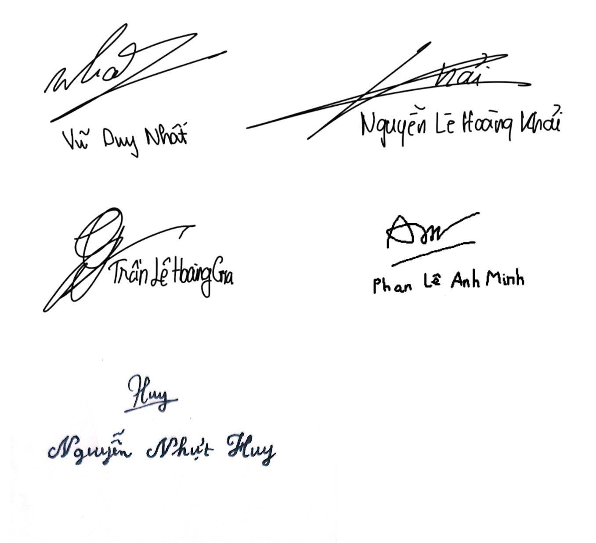

# Team Contract
Performed by: Nguyễn Nhựt Huy  

Reviewed by: Vũ Duy Nhất  

Editied by: Nguyễn Nhựt Huy  

## 1. Team Roles and Responsibilities

* **[Vũ Duy Nhất]**: Project Manager & Full-stack Engineer (Team Leader)
  * *Main Responsibilities:* Manage project timelines, assign tasks, coordinate team communication, and take ownership of the overall system architecture. Participate in both Front-end and Back-end development for core features.

* **[Nguyễn Nhựt Huy]**: UI/UX Designer & Front-end Engineer
  * *Main Responsibilities:* Design user interfaces (Wireframes, Prototypes) and optimize user experience. Responsible for translating design mockups into clean, production-ready Front-end code, ensuring responsiveness and smooth user interactions.

* **[Trần Lê Hoàng Gia]**: Technical Lead & Back-end Engineer
  * *Main Responsibilities:* Design database schemas, build and optimize robust APIs, and handle server-side logic. Provide technical guidance, solve complex engineering challenges, and ensure system security and scalability.

* **[Nguyễn Lê Hoàng Khải]**: Full-stack Engineer & DevOps Specialist
  * *Main Responsibilities:* Flexibly develop both Front-end and Back-end features based on project needs. Responsible for environment configuration, setting up CI/CD pipelines, managing repositories, and deploying the application to cloud platforms.

* **[Phan Lê Anh Minh]**: Full-stack Engineer & Quality Assurance (Tester)
  * *Main Responsibilities:* Contribute to feature development and code implementation. Concurrently lead the QA process by writing test cases, executing manual/automated testing, tracking bugs, and ensuring product quality before final delivery.

## 2. Communication Plan
* **Primary Communication Tools:** Messenger (for daily updates), Google Meet (for meetings), Jira (for task tracking)
* **Meeting Frequency:** * Fixed weekly meetings are held every **Saturday at 9:00 PM**.
  * Ad-hoc/emergency meetings will be scheduled based on the time slot where the maximum number of members are available. For any members unable to attend, meeting minutes and key updates will be documented and shared immediately afterward.
* **Response Time Guidelines:** * Urgent/daytime work messages must be responded to within **15 minutes to 2 hours**.
  * For messages sent after **11:00 PM**, members are permitted to respond late or follow up the next morning.
* **Deliverable Deadlines:** * All team members must update their individual task progress by **11:59 PM on the day of the meeting** to ensure the host has sufficient time to consolidate the report.

## 3. Work Schedule and Deadlines
* **Milestones (5-Sprint Scrum Roadmap):**
  * **Sprint 1 (Weeks 1-2) - Preparation [Current]:** Finalize project topic (Library Management Website), complete project documentation, SRS, and initial planning.
  * **Sprint 2 (Weeks 3-4) - Design & Core Database:** Complete UI/UX wireframes/mockups (Figma), design the database schema (ERD), and set up the project repository (Frontend/Backend initialization).
  * **Sprint 3 (Weeks 5-6) - Core Features Development:** Implement User Authentication (Login/Register/Roles), Book Management (CRUD operations), and basic Search/Filter functionalities.
  * **Sprint 4 (Weeks 7-8) - Advanced Features & AI Integration:** Implement Borrowing/Returning management, fine/penalty calculations. Integrate **AI Features** (AI-powered book recommendation system,...) and complete Frontend-Backend integration.
  * **Sprint 5 (Weeks 9-10) - Testing, Deployment & Finalization:** Perform system testing and bug fixing, deploy the website, write the final report, and prepare the presentation slides.
* **Work Sessions:**
  * The team will hold an in-person co-working session every **Wednesday afternoon for 1.5 hours at the school library** to collaborate, code together, and resolve blockers.
* **Contingency Plans:**
  * If a member encounters an unexpected issue or risks missing a deadline, they must notify the team at least **24 hours prior to the deadline**.
  * **Mitigation:** The team will mobilize available members to assist with the workload to keep the project on track. Consequently, the delayed member must make up for it by taking on a larger workload or compensating for the progress in subsequent tasks.

## 4. Code and Documentation Standards
* **Coding Conventions:**
  * **Tech Stack:** Next.js (Frontend), Node.js & Express.js (Backend), with rapid development assisted by Speckit/AI coding tools.
  * **JavaScript/TypeScript Standards:** Follow standard ESLint guidelines.
    * Use `camelCase` for variable and function names (e.g., `const bookList = []`, `function getBorrowerDetails()`).
    * Use `PascalCase` for Next.js components, pages, and Express models/classes (e.g., `LibraryCard.jsx`, `BookModel.js`).
    * Use `UPPERCASE_SNAKE_CASE` for environment variables and global constants (e.g., `PORT`, `DATABASE_URL`).
  * **AI-Assisted (Speckit) Code Integrity:** While utilizing AI generation for rapid coding, all generated code must be manually inspected to ensure proper variable naming, structured modularity, and alignment with the team's architectural patterns before committing.
* **Source Control Management (SCM) & Git Workflow:**
  * **Repository Hosting:** GitHub.
  * **Branching Strategy:**
    * `main`: Production-ready branch. Code is only merged here for final releases.
    * `dev`: Main integration branch for active development.
    * `feature/feature-name`: Feature branches branched out from `dev`. (e.g., `feature/login-page`).
    * `doc/doc-name`: Branches dedicated exclusively to writing reports, specifications, and Markdown files.
  * **Workflow Rules:**
    * **Always Sync First:** Members must run `git fetch` and `git pull` to sync the latest remote updates before starting any new coding session to avoid code conflicts.
    * Direct commits to `main` or `dev` are strictly prohibited.
* **Code Reviews & Testing:**
  * Every Pull Request (PR) from a `feature/*` or `doc/*` branch into `dev` must be reviewed and approved by at least one other team member before merging.
  * Ensure the app compiles successfully without errors before making a PR.
* **Documentation Standards:**
  * Markdown (`.md` files) must be used for all project documentation, specifications, setup guides, and progress reports in the repository.

## 5. Accountability and Performance
* **Criteria for Measuring Contribution:**
  * **Task Completion:** Measured by the quantity and sub-task breakdown of Jira issues completed on time and matching the defined acceptance criteria.
  * **Code Quality:** Evaluated through GitHub Pull Requests, ensuring code follows the project standards and successfully passes peer reviews without critical bugs.
  * **Team Engagement:** Active participation and updates during team meetings (via Google Meet) and responsive communication in the group chat (via Messenger).

* **Procedure for Addressing Low Performance or Lack of Participation:**
  * **1st Instance (Friendly Reminder):** The Project Manager or team members will reach out privately via Messenger to check on the situation, offer support, and adjust the task deadline if necessary.
  * **2nd Instance (Official Warning):** A formal warning will be issued during the weekly meeting. The issue will be documented in Jira, and the member's contribution percentage will be penalized (reduced by 20%–30%).
  * **3rd Instance (Escalation):** If there is no improvement or communication within 48 hours after the second warning, the team will formally report the case to the Instructor/TA with full evidence (Jira logs, Git history, Messenger screenshots) to remove the member from the group or request a separate grading scale.

* **Consequences for Breaching the Team Agreement:**
  * Missing a final deliverable deadline without a valid, pre-notified reason (at least 24 hours in advance) will result in a direct 50% deduction in that specific sprint's contribution score.
  * If a member pushes unreviewed code or forcefully merges their own Pull Request causing the main branch to break, they must fix the issue immediately and will receive a formal warning.
  * Final peer-evaluation scores (Contribution Scores) will be calculated mathematically based on the percentage of Jira story points successfully delivered by each individual.

## 6. Decision-Making Process
* **Decision-Making Methods:**
  * **Consensus First:** For major project directions, architecture design, and scope changes, the team will discuss during meetings to reach a unanimous agreement.
  * **Majority Vote:** If a consensus cannot be reached after 15 minutes of discussion, a majority vote (via Messenger poll or Meet voting) will be used. Each member has one vote, and a simple majority (> 50%) wins.

* **Final Decision-Maker in Disputes:**
  * If a vote results in a tie or a deadlock occurs that threatens the project timeline, the **Project Manager (PM)** will have the final authority to make the executive decision.
  * For purely technical disputes (e.g., choosing a specific algorithm or database schema), the **Technical Lead** (or the member in charge of that specific feature on Jira) will make the final call after hearing all perspectives.

## 7. Conflict Resolution
* **Conflict Resolution Framework:**
  * **Objective Approach:** Conflicts regarding technical solutions, task assignments, or deadlines must be discussed based on facts, project requirements, and data, rather than personal feelings.
  * **Direct Communication:** The involved parties are encouraged to discuss openly and resolve the issue directly first, keeping the conversation constructive and respectful.

* **Escalation Steps:**
  * **Step 1 (Private Discussion):** The individuals involved will arrange a private call or message exchange to clear up misunderstandings and find a mutual compromise within 24 hours of the dispute.
  * **Step 2 (Team Mediation):** If the conflict remains unresolved, the issue will be brought to the Project Manager and the rest of the team. A dedicated meeting will be held where both sides present their perspectives, and the team will vote or the PM will make a final judgment.
  * **Step 3 (Instructor/TA Intervention):** If the dispute heavily impacts the project progress, involves ethical violations, or causes a complete deadlock that the team cannot settle internally, the PM will officially document the issue and escalate it to the Instructor or Teaching Assistant (TA) for academic mediation.

## 8. Review and Update Process
* **Timeline for Agreement Review:**
  * **Mid-Project Review:** The team will formally review this agreement at the midpoint of the semester (typically around Week 7) to assess its effectiveness and adjust rules if necessary.
  * **Ad-hoc Reviews:** An emergency review can be triggered immediately if there are major changes in project requirements, scope adjustments by the instructor, or changes in team composition (e.g., a member leaving the group).

* **Update and Amendment Procedure:**
  * **Proposal:** Any member can propose an amendment to these terms by creating a brief note and raising it during the weekly meeting.
  * **Unanimous Approval:** To ensure fairness, any changes or updates to this team agreement must receive **100% unanimous approval** from all team members.
  * **Documentation:** Once approved, the Project Manager will update this document directly on GitHub/Markdown repository, and all members must react or acknowledge the update in the Messenger group chat to confirm their commitment to the new terms.

## 9. Agreement
