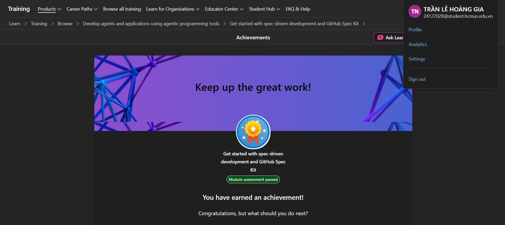
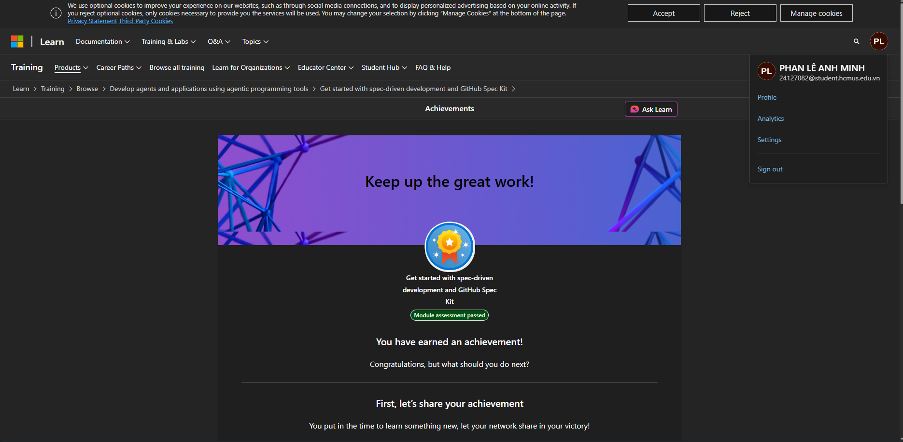
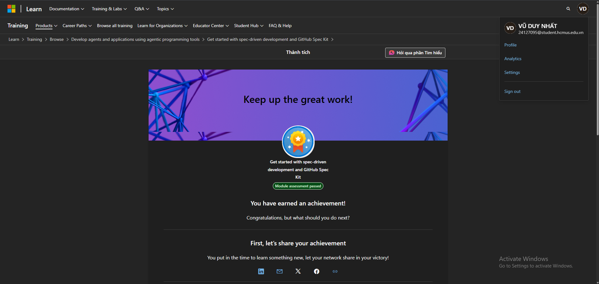

# Spec Kit Summary

    Project: Modern Library Management System 
    Course: CS300 – CSC13002 – Introduction to Software Engineering 
    Group ID: 03
    Group Name: AmeThyst 
    Assignment: PA2-2026

Performed by: All Members | Reviewed by: All Members | Edited by: Vũ Duy Nhất

## I. Spec Kit Self-Traning course

* **Course Material:** Get started with spec-driven development and GitHub Spec Kit from Microsoft
* **Completion Status:** Completed
* **Objective:** Understand how to initialize, configure, and utilize Spec Kit inside a GitHub repository. After this course, the whole team is able to apply SDD workflow to our current team project.

## II. Summary from 24127028 - Trần Lê Hoàng Gia

### A. Repository Initialization and Architecture
* Learned how to set up and initialize Spec Kit configurations directly within the `/src` folder of a project repository.
* Understood the structure and function of the generated `constitution.md` file, which sets the foundational rules, operational protocols, and architectural boundary constraints for the project's development lifecycle.

### B. Executing Feature Specifications (`/speckit-specify`)
* Learned the utilization of Spec Kit's prompt engineering syntax, the `/speckit-specify` command pattern, to bridge the gap between high-level user interface requests and explicit backend system logic.

* Understood how to map diverse inputs into clean operational criteria, such as translating complex UI interactions into distinct processing rules.

### C. Lifecycle and Workflow Integration
* Learned how to continuously update Markdown specifications inside the source directory as software goals change.
* Discovered how to use Spec Kit’s analytical definitions to verify that newly engineered features strictly match user-centric goals, non-functional performance requirements, and architectural database configurations.

## III. Summary from 24127082 - Phan Lê Anh Minh

### A. Installation on Windows

* The first step was installing Spec Kit locally on a Windows machine via the terminal. After cloning the repository, the required dependencies were installed through the command line before proceeding to any configuration.

* Since Spec Kit requires an AI backend to execute its commands, **Gemini CLI** was installed as the AI provider. Gemini CLI allows Spec Kit to interface with Google's Gemini model directly from the terminal, enabling the full specify → plan → tasks → implement workflow to run locally without a browser-based interface.

* Once Gemini CLI was confirmed to be working correctly, the initialization process for Spec Kit could begin.

### B. Initializing Spec Kit

* With both Spec Kit and Gemini CLI installed, the next step was running the initialization command inside the project's `/src` directory. This generated the foundational `constitution.md` file, which defines the project's core architecture, coding conventions, and constraints that the AI must follow throughout all subsequent feature development.

* The initialization process also set up the `.specify/feature.json` file, which tracks the currently active feature directory. This file is updated each time a new feature specification is started, pointing the AI to the correct spec folder.

### C. Spec Kit Artifacts

For each feature, Spec Kit generates and relies on a set of structured documents:

* **`constitution.md`**: Written once during initialization. Establishes the rules, tech stack, and architectural boundaries the AI must respect across all features.
* **`spec.md`**: Describes the feature's requirements, user stories, and acceptance criteria in plain language, without implementation details.
* **`plan.md`**: The AI's proposed implementation strategy, including which files to modify and the technical approach.
* **`tasks.md`**: A granular checklist of steps the AI will execute based on the spec and plan.

### D. Key Takeaways

* **Installation order matters:** Gemini CLI must be fully configured before initializing Spec Kit, since the init process itself may invoke the AI.
* **Constitution first:** The `constitution.md` file is the most important artifact. Time spent defining it carefully saves significant rework later, as the AI references it for every subsequent feature.
* **Spec before code:** The temptation to skip straight to implementation is high, but writing a clear `spec.md` first consistently produces better-structured output from the AI.
* **Validate everything:** AI-generated plans and code must be reviewed against the actual project structure. The AI works from the constitution and spec, so any gap between those documents and reality will surface as incorrect output.

## VI. Summary from 24127398 - Nguyễn Nhựt Huy

### A. Overview of Training Objectives

* The Spec Kit training module focused on establishing solid foundations in structured system deployment, algorithmic efficiency, and seamless interface integration. Through individual study and architectural analysis, the core mechanics of systematic problem-solving and rigorous verification workflows were deeply explored.

* A central theme throughout the training was **Specification-Driven Development (SDD)**, an engineering methodology that emphasizes defining and validating requirements before implementation. Rather than writing code immediately, development follows a structured lifecycle consisting of requirement analysis, clarification, specification design, architectural planning, task decomposition, implementation, and continuous verification. This workflow reduces ambiguity, improves maintainability, and ensures that every implementation remains aligned with the original project objectives.

### B. Engineering Principles Learned

Beyond learning individual commands, the training reinforced several software engineering principles that guide the entire development process:

* **Specification before implementation:** Requirements should be clearly defined and documented before any source code is written.
* **Requirement clarification:** Ambiguous or incomplete requirements should be resolved through clarification rather than assumptions.
* **Task decomposition:** Large features should be divided into small, independent, and manageable implementation tasks.
* **Architecture-first design:** Software architecture should be planned before implementation to ensure scalability and maintainability.
* **Verification-first mindset:** Validate requirements, architecture, and edge cases before committing implementation.
* **Iterative refinement:** Specifications, plans, and implementations should be continuously improved through repeated analysis and feedback.
* **Traceability:** Every implementation task should be traceable back to an explicit requirement within the specification.
* **Modularity:** Build reusable, loosely coupled components with clear responsibilities to simplify future maintenance and extension.

### C. Command References & Operational Syntaxes

A critical technical competency acquired during this training phase was the strict application of command-line directives and core behavioral rules designed to guide software engineering scaffolding, problem decomposition, and systematic execution.

* **`/speckit.constitution`:** Functions as the primary governance layer or the system's "constitution." This directive enforces overarching structural rules, coding standards, formatting conventions, project constraints, and baseline safety principles that every subsequent phase must follow.

* **`/speckit.specify`:** Instantiates and formalizes explicit technical engineering blueprints by transforming user requirements into structured specifications. It defines functional requirements, constraints, input/output behaviors, validation rules, assumptions, and edge cases before implementation begins.

* **`/speckit.plan`:** Formulates a high-level architectural strategy that bridges specifications and implementation. It outlines system architecture, module responsibilities, development phases, dependency relationships, and the overall implementation roadmap.

* **`/speckit.tasks`:** Decomposes the architectural plan into small, atomic, and independently implementable tasks. This structured breakdown improves development tracking, collaboration, incremental implementation, and testing.

* **`/speckit.analyze`:** Performs architectural analysis, logical validation, debugging, and optimization before implementation. It evaluates design consistency, identifies potential bottlenecks, analyzes constraints, and verifies that proposed solutions satisfy the project requirements.

* **`/speckit.clarify`:** Resolves ambiguity by requesting additional information whenever project requirements are incomplete or unclear. This verification stage minimizes incorrect assumptions and improves alignment between stakeholder expectations and implementation.

* **`/speckit.implement`:** Executes the generation of clean, modular, maintainable, and deterministic source code that strictly follows the validated specification, architectural plan, and decomposed task structure established during previous stages.

### D. Practical Application & Verification

* The methodologies covered in the Spec Kit training were reinforced through practical exercises involving structured software planning, modular application design, backend architecture, algorithm implementation, and iterative verification. The workflow consistently emphasized validating requirements before coding, maintaining modular separation between components, documenting implementation decisions, and testing edge cases throughout development.

* This engineering process demonstrated how a specification-first workflow leads to more maintainable software, improved collaboration, reduced implementation ambiguity, and higher overall software quality.

## V. Summary from 24127408 - Nguyễn Lê Hoàng Khải

### A. Spec-Driven Development

* Spec Kit follows a workflow known as **Spec-Driven Development**. For medium or large-scale projects, using raw AI prompts often lacks consistency throughout the development process. Spec Kit provides the AI with specific capabilities—such as specifying, planning, tasking, clarifying, and implementing—to generate specification documents that help the AI better understand the system architecture.

* In this workflow, the programmer's responsibility is to define and refine these specification documents based on project requirements, while the AI handles the actual coding execution. Afterward, the programmer must rigorously review and edit the generated code to ensure it aligns with the original vision.

* Spec Kit significantly improves how AI is utilized in complex projects. **It does not completely replace the programmer;** rather, it elevates them to a managerial role. The developer must still possess foundational programming knowledge to oversee, direct, and validate the AI's workflow.

### B. Spec Kit Artifacts

To implement features, Spec Kit utilizes several core specification documents. The primary setup file is:

* **`constitution.md`**: This document establishes the core rules, coding conventions, and guidelines adhered to throughout the development process. It only needs to be written once during initialization.

For each individual feature implementation, specific commands are used to set up the following main documents inside the repository:

* **`specify.md`**: Outlines the desired requirements and expectations for the feature.
* **`plan.md`**: The execution plan generated by the AI detailing how it will implement the changes.
* **`tasks.md`**: Granular, step-by-step tasks broken down by the AI based on the previous two documents.

### C. Lessons Learned Working with AI

Beyond the basic documents required to set up a feature, several commands are crucial for materializing ideas effectively:

* **`/speckit.clarify`**: The AI asks targeted questions about ambiguous or unclear requirements to determine the correct technical approach.
* **`/speckit.analyze`**: The AI reviews the existing codebase or requirements to assess impact and context before planning.
* **`/speckit.checklist`**: Used to verify steps and ensure all requirements and edge cases are accounted for.

**Key Takeaways as a Summary of Learning:**
* **Review Specs Carefully:** Always thoroughly inspect the specification documents before allowing the AI to start generating code.
* **Iterative Approach:** Do not overload a single specification document with too much information. Avoid describing the entire system at once. Instead, use Spec Kit to implement and build the application feature by feature.
* **Code Verification:** Always manually review, test, and validate the AI-generated code after completion.

## VI. Summary from 24127095 - Vũ Duy Nhất

### A. About SDD - Specification Driven Development
* **Specification Drive Development (SDD)** is a structured approach to software development that treats specification as executable sources of truth rather than throwaway planning documents.

* When using SDD with AI Coding Agent like Github Copilot, Gemini CLI, Antigravity,..., the specification guides code generation directly, ensuring the implementation matches your intended behavior from the start.

* **Core Principles of SDD:**
  * The specification (spec) is king. All developments pivots around the spec.
  * Precision is critical. Specs are detailed enough to generate executable code.
  * The spec is alive. If code needs to be updated, the spec is updated first.
  * AI collaboration. The AI automates, but humans maintain control

### B. About Spec Kit
* Github **Spec Kit** is not an AI model or agent itself - it is a framework and CLI that supports **SDD with the chosen AI agent.** It helps transform a high-level idea into working code by generating the spec, plan, and tasks with AI rather than writing everything manually.

* **Spec Kit components:**
  * **Specify CLI:** Initialize and manage project
  * **Artifacts:** `spec.md`, `plan.md`, `task.md`, `clarify.md`,...
  * **Slash Commands (Skills):** Integrated into the IDE and use in TUI (Terminal User Interface) when activating AI agent
  * **Multi-Agent Support:** Github Copilot, Claude, Cursor,...

* Convenience from Spec Kit:
  * **Efficiency:** Tasks are completed in minutes rather than hours (faster)
  * **Consistency:** Everything fits together across teams and projects
  * **Enterprise Ready:** Company standards and best practice are enforced

### C. Spec Kit workflow when using AI Agent skills (slash commands)
* To initialize Spec Kit into the Code Base, using command `specify init --here` in the Code Base. After executing this command, it create `.specify` folder and there are some important artifacts in this file that need to be taken into consideration:
  * `memory` folder: This place contains the `constitution.md` created after running `/speckit.constitution`. The `constitution.md` is extremely important because it contains project-wide principles, constraints and non-negotiable requirements orienting AI Coding Agent.
  * `templates` folder: This place contains template of spec files generated after using skils (slash commands), including: `checklist-template.md`, `constitution-template.md`, `plan-template.md`, `spec-template.md`, `tasks-template.md`
* When using these below skills (slash commands) from AI Agent, it generates the spec file based on outline in `templates` folder:
  * `/speckit.specify`
  * `/speckit.plan`
  * `/speckit.clarify`
  * `/speckit.tasks`
  * `/speckit.analyze`
* Finally, after reviewing and ensuring that the contents of those spec files are detailed enough for AI Coding Agent. Running `/speckit.implement` to order the AI Agent to generate code, based on spec files in current use-case spec folder and `constitution.md` as coding regulations.