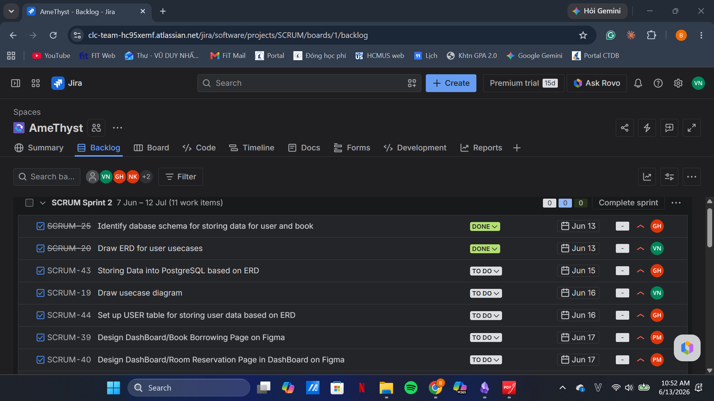
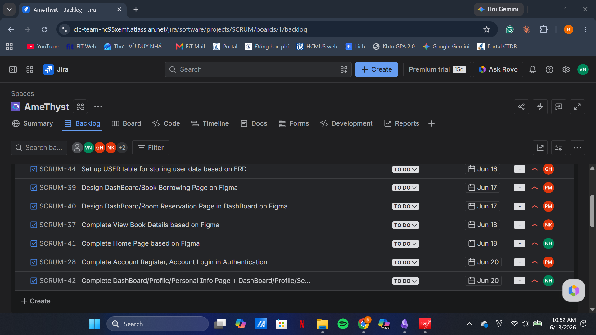
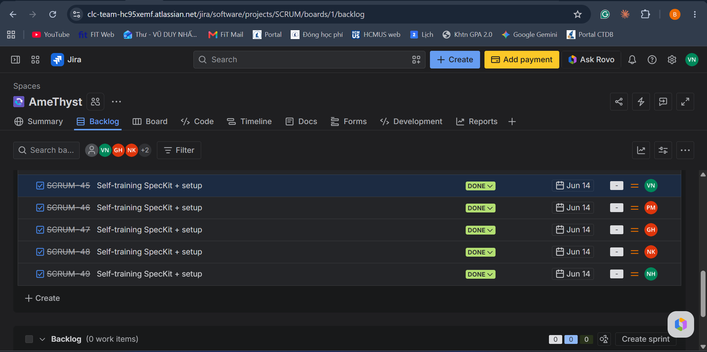
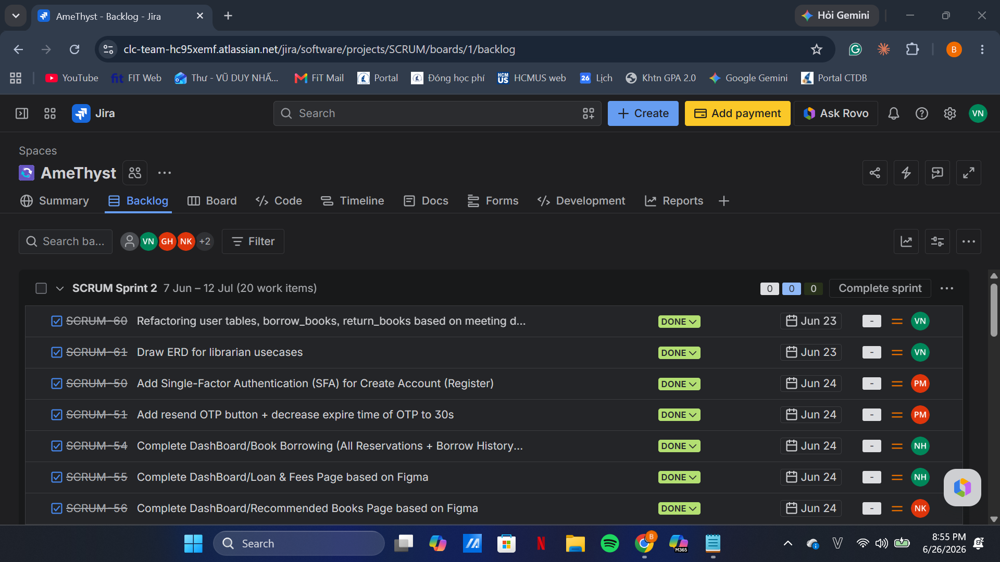
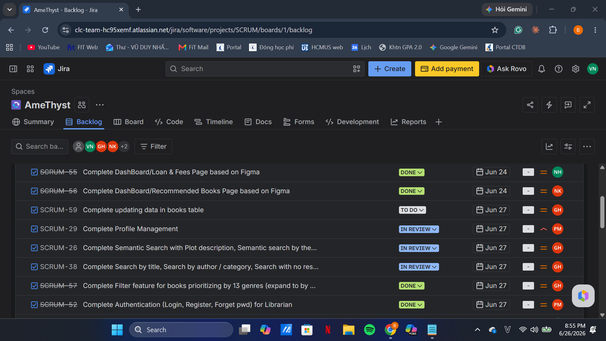
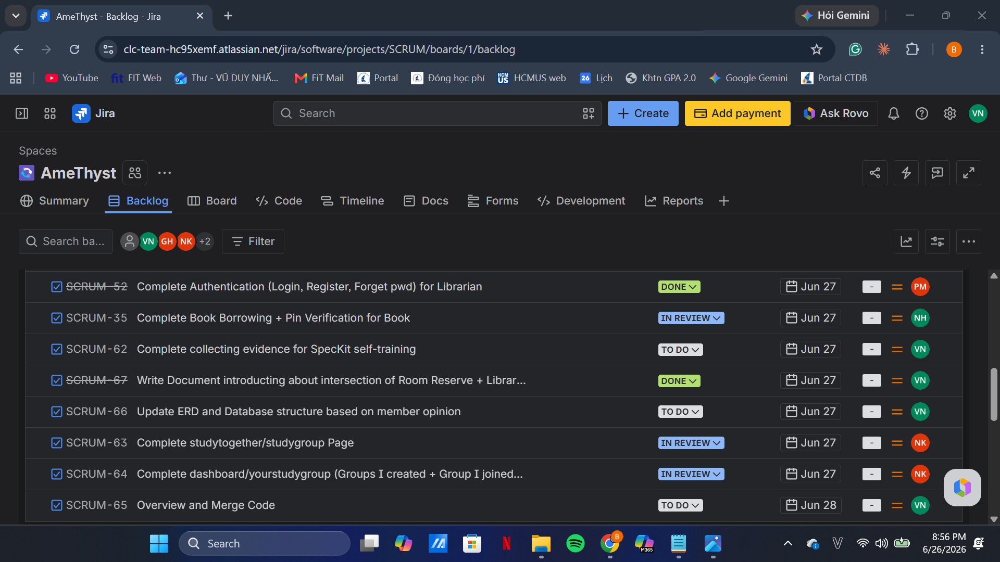
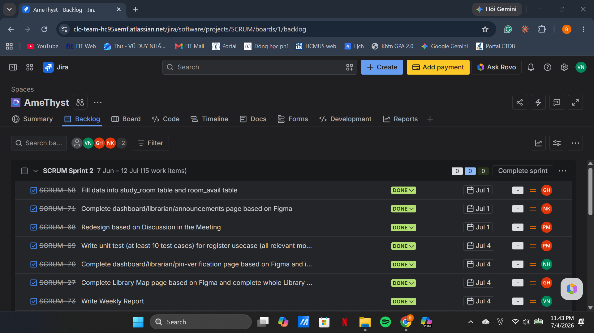
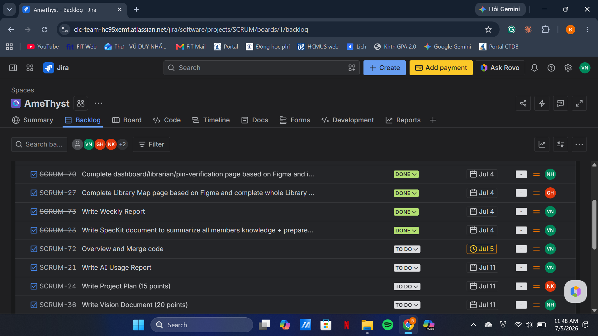
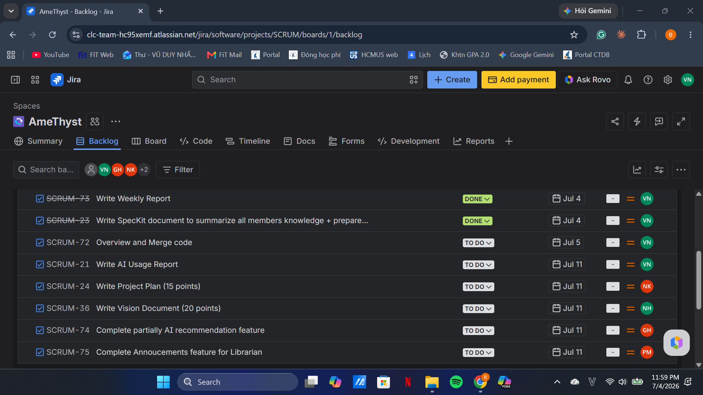

# Weekly Report
Performed by: Vũ Duy Nhất

Reviewed by: All Other Members

Editied by: Vũ Duy Nhất

## I. Meeting Minutes:  21/6/2026
- **Team member present:**
  - Vũ Duy Nhất
  - Trần Lê Hoàng Gia
  - Phan Lê Anh Minh
  - Nguyễn Nhựt Huy
  - Nguyễn Lê Hoàng Khải
- **Status Report:**
  - **Vũ Duy Nhất**
    - Completed task
      - Draw ERD in Physical for user role to design database
      - Self-learning SpecKit + setup
      - Setup database structure and tables based on Physical ERD
      - Draw usecase diagram (partially)
    - To-do task
      - Draw ERD in Physical for librarian role to design database
      - Write Document introducing about intersection idea of Room Reservation + Library Map + Study Group feature
      - Complete collecting evidence for SpecKit self-training
      - Overview and Merge Code
    - Obstacles/Issues
      - The initial design of ERD is based completely on my idea and it needs to be added more fields, tables or revised data type to suit with idea of developers.
      - Need to consider order and structure of table when setting up because of their foreign key.
      - Need to consider order of assignments and arange them based on priority
  - **Trần Lê Hoàng Gia**
    - Completed task
      - Self-learning SpecKit + setup
      - Prepare book data
      - Storing book data into PostgresSQL based on Physical ERD
    - To-do task
      - Complete Search (Semantic + Standard search) usecase in Book Retrieve
      - Complete Filter usecase in Book Retrieve
    - Obstacles/Issues
      - Book data misses a lot of information in fields planned in ERD
      - The book data scraped on cloud took a lot of time
  - **Phan Lê Anh Minh**
    - Completed task
      - Self-learning SpecKit + setup
      - Design DashBoard/User/BookBorrowing Page on Figma
      - Design DashBoard/User/RoomReservation Page on Figma
      - Complete Register, Login usecases in Authentication
    - To-do task
      - Add Single-Factor Authentication (SFA) for Register
      - Complete Forget Password usecase in Authentication
      - Complete Profile Management
    - Obstacles/Issues
      - Taking time to get familiar with SpecKit and using agents for coding.
      - Taking time to get familiar with PostgreSQL and Docker.
      - Taking time to get familiar the source code modularization rules emphasized by the team leader.
      - The design lacks of some details to suit with implement ideas in next week
  - **Nguyễn Nhựt Huy**
    - Completed task
      - Self-learning SpecKit + setup
      - Complete Home Page based on Figma design
      - Complete View Self Profile and Security Page based on Figma design
    - To-do task
      - Complete DashBoard/User/BookBorrowing (All Reservations + Borrow History tabs) Page based on Figma - due day: 24/6
      - Complete DashBoard/User/Loan&Fees Page based on Figma
      - Complete Book Borrowing and Pin Verification usecase in Borrowing & Reserving
    - Obstacle/Issues
      - Taking time to get familiar with SpecKit and using agents for coding.
      - Taking time to get familiar with PostgreSQL and Docker.
      - Taking time to get familiar the source code modularization rules emphasized by the team leader.
  - **Nguyễn Lê Hoàng Khải**
    - Completed task
      - Self-learning SpecKit + setup
      - Complete View Book Details Page based on Figma design
    - To-do task
      - Complete DashBoard/User/RecommendedBook Page based on Figma
      - Complete StudyTogether/StudyGroup Page based on Figma
      - Complete DashBoard/User/YourStudyGroup (Group I created + Group I joined tabs) based on Figma
    - Obstacle/Issues
      - Taking time to get familiar with SpecKit and using agents for coding.
      - Taking time to get familiar with PostgreSQL and Docker.
      - Taking time to get familiar the source code modularization rules emphasized by the team leader.
- **Action:**
  - **Vũ Duy Nhất**: Add more fields and tables into database based on discussion in the meeting.
  - **Trần Lê Hoàng Gia**: Update book data to make it more complete.
  - **Phan Lê Anh Minh**: Design more details based on discussion in the meeting.
  - **Nguyễn Lê Hoàng Khải**: Add UI display for branches, book availability, and shelf locations in View Book Details Page.
  - **Whole team**: Write AI Usage Note when using AI agent or any other forms of AI for coding and doing other tasks; Write short summary about knowledge acquired from Self-learning SpecKit. 
- **Summary of the meeting:** Firstly, the team reviewed the past week's progress, evaluating the current web architecture and code organization. To prepare for the next sprint, we then identified fixes for edge cases, discussed the GUI design for the Filter use case, and aligned on role definitions (Librarian/Admin) according to design on Figma, which requires adding new fields to the users table. Additionally, the team leader talked about change of repository structure (database folder, Makefile, package files), SpecKit agent workflows and discussed switching to alternative agent models to save token. Finally, the team leader assigned tasks to team members and provided them implementation ideas if needed.
## II. Meeting Minutes: 28/6/2026
- **Team member present:**
  - Vũ Duy Nhất
  - Trần Lê Hoàng Gia
  - Phan Lê Anh Minh
  - Nguyễn Nhựt Huy
  - Nguyễn Lê Hoàng Khải
- **Status Report:**
  - **Vũ Duy Nhất**
    - Completed task
      - Draw ERD in Physical for librarian role to design database - due day: 23/6
      - Write Document introducing about intersection idea of Room Reservation, Library Map and Study Group feature - due day: 27/6
      - Complete collecting evidence for SpecKit self-training - due day: 27/6
      - Overview and Merge Code - due day: 28/6
    - To-do task
      - Write Weekly Report
      - Write SpecKit document to summarize all members knowledge
      - Write AI Usage Report
      - Overview and Merge Code
    - Obstacle/issues
      - Need to consider the Code Merge order and have an overview everyone's code to resolve conflicts if any.
      - Need to consider the feasibility and find reference GUI for the integrating 3 features, Room Reservation, Library Map and Study Group
    - **Trần Lê Hoàng Gia**
      - Completed task
        - Complete Search (Semantic + Standard search) usecase in Book Retrieve
        - Complete Filter usecase in Book Retrieve
      - To-do task
        - Storing data into study_room and room_avail tables for room reservation usecase
        - Complere Library Map Page based on Figma and complete whole Library Map feature
        - Complete partially AI recommendation (having initial setup)
      - Obstacle/issues
        - There is a lot of edge cases needed to solve in Search implementation
        - Both semantic and keyword search have their limitations, so a hybrid approach is needed to complement each other and achieve better results.
    - **Phan Lê Anh Mỉnh**
      - Completed task
        - Add Single-Factor Authentication (SFA) for Register
        - Complete Forget Password usecase in Authentication
        - Complete Profile Management
      - To-do task
        - Design Library Map Page + Floor plan on Figma
        - Write unit test (at least 10 test cases) for Register usecase
        - Complete Announcements usecase in Librarian Administration
      - Obstacle/issues
        - Floor plan had many details to complete
        - The design of floor plan needed to be practical to prepare data for facility
        - Need to find out more about Vitest to write unit test
    - **Nguyễn Nhựt Huy**
      - Completed task
        - Complete DashBoard/User/BookBorrowing (All Reservations + Borrow History tabs) Page based on Figma
        - Complete DashBoard/User/Loan&Fees Page based on Figma
        - Complete Book Reserving and Pin Generation usecase in Borrowing & Reserving
      - To-do task
        - Complete DashBoard/Librarian/Pin-Verification Page based on Figma
        - Complete Borrowing Book Confirmation usecase in Librarian Administration
        - Write Vision Document (Hoàng Khải supports)
      - Obstacle/issues
        - The book-borrowing procedure is relatively complicated because it is associated with both user and librarian roles.
        - Having initial confusion about status of reserved book in the procedure
    - **Nguyễn Lê Hoàng Khải**
      - Completed task
        - Complete DashBoard/User/RecommendedBook Page based on Figma
        - Complete StudyTogether/StudyGroup Page based on Figma
        - Complete DashBoard/User/YourStudyGroup (Group I created + Group I joined tabs) based on Figma 
      - To-do task
        - Complete DashBoard/Librarian/Announcements Page based on Figma
        - Write Project Plan (Duy Nhất supports)
- **Action:**
  - **Vũ Duy Nhất**: Replace Jest by Vitest for unit test writing because it integrates better with ES Modules
- **Summary of the meeting**: Firstly, the team reviewed the past week's accomplishments and mentioned the methodologies and technology stack used for feature implementation. We finalized a conceptual idea to combine the Room Reservation, Study Groups, and Library Map features. Significant UI/UX design updates were discussed, including View Other Profile Card used in Study Group feature, 2D floor plan placements for two separate campuses, and an avatar cropping feature. Then, the team leader introduce the Jest library, structure of test folder and a standard test case. Finally, the team leader assigned tasks to team members and provided them implementation ideas if needed.
## III. Task Screenshot on Jira
### 1. Week 1: 8/6 - 14/6 & Week 2: 15/6 - 21/6

### 2. Week 3: 22/6 - 28/6

### 3. Week 4: 29/6 - 5/7 & Week 5: 6/7 - 11/7

