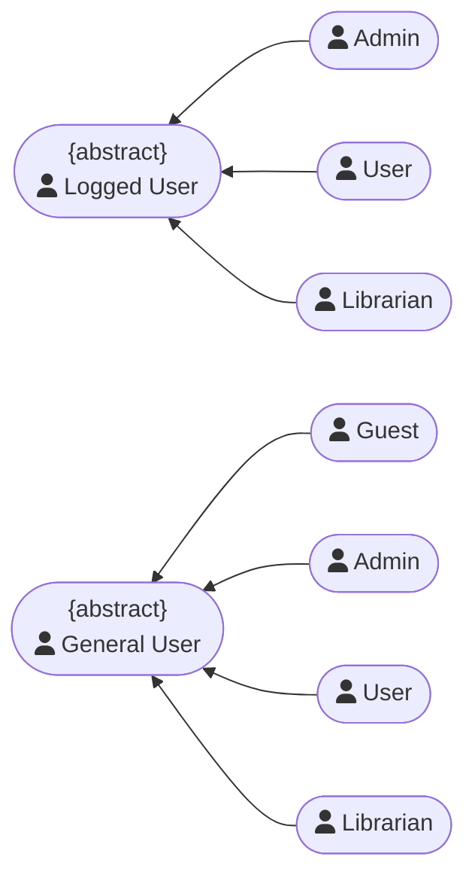
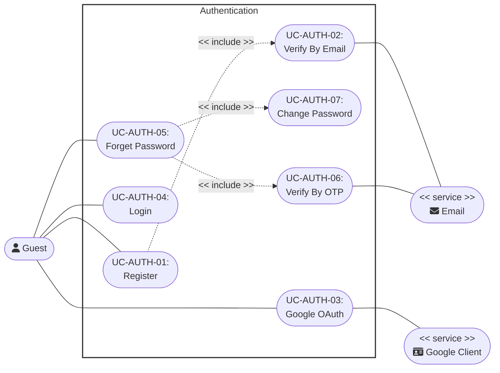
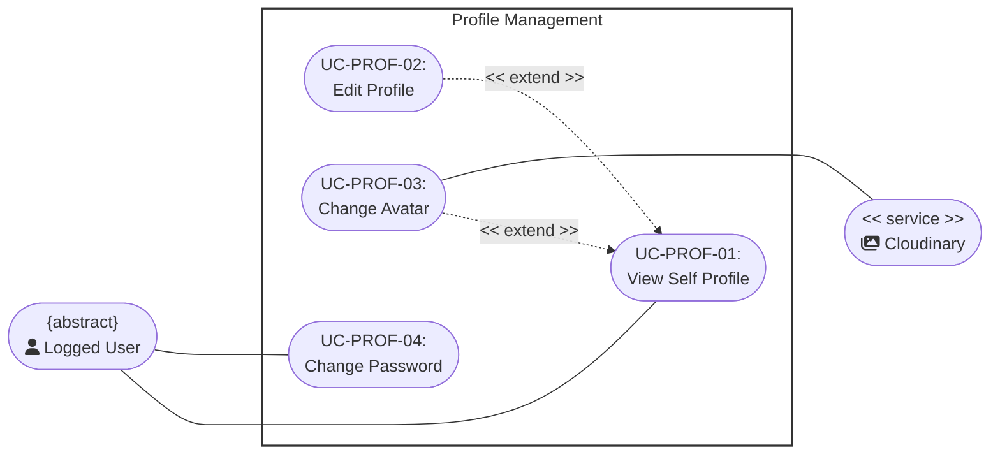
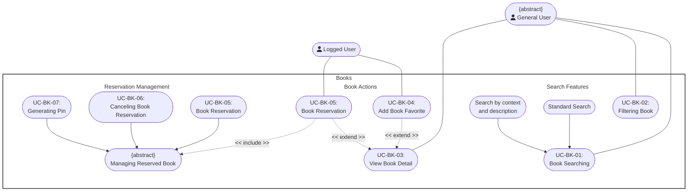
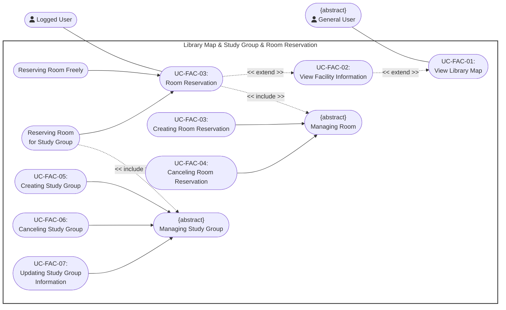
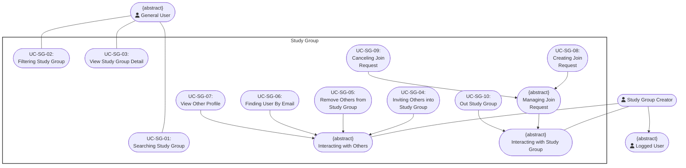
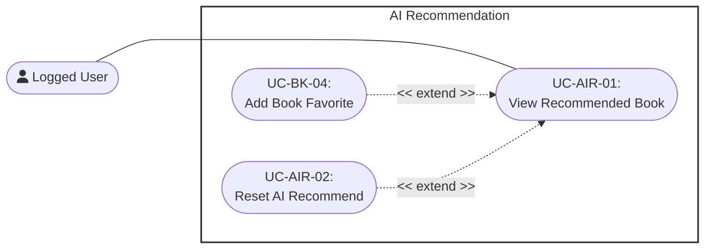
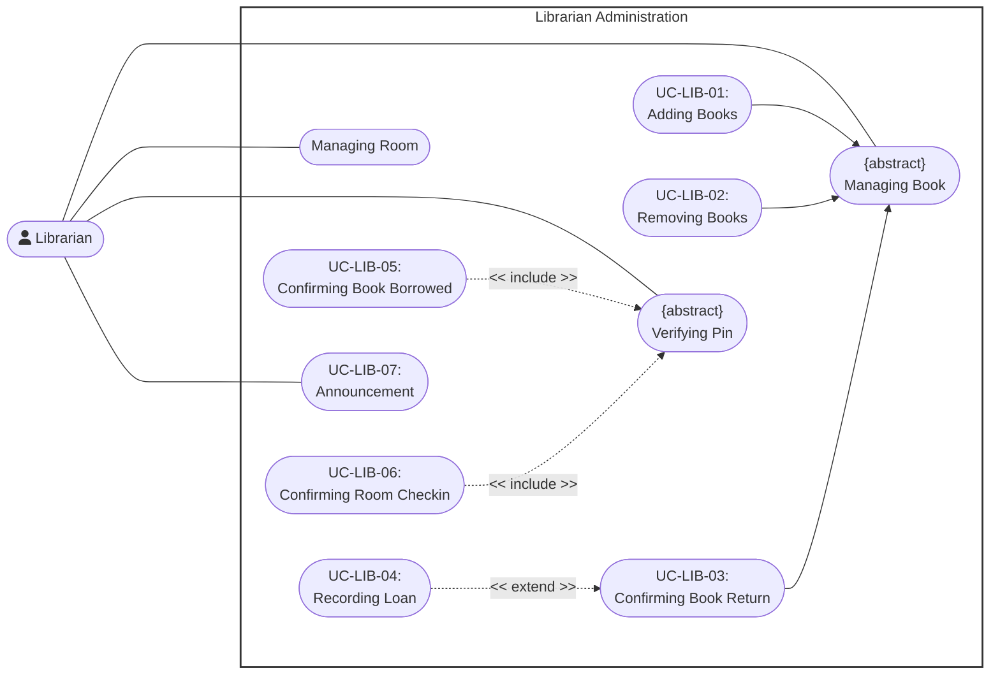
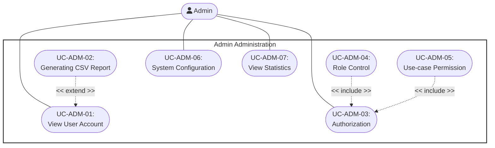

# Usecase Diagram
    Project: Modern Library Management System 
    Course: CS300 – CSC13002 – Introduction to Software Engineering 
    Group ID: 03
    Group Name: AmeThyst 
    Assignment: PA3-2026

Performed by: Trần Lê Hoàng Gia, Vũ Duy Nhất | Reviewed by: All Other Members | Edited by: Trần Lê Hoàng Gia

## Table of content
- [Usecase Diagram](#usecase-diagram)
  - [Table of content](#table-of-content)
  - [Regulation](#regulation)
  - [Authentication](#authentication)
  - [Profile Management](#profile-management)
  - [Books Exploration \& Interaction](#books-exploration--interaction)
  - [Study Group Creation \& Facility Reservation](#study-group-creation--facility-reservation)
  - [Study Group](#study-group)
  - [AI Recommendations](#ai-recommendations)
  - [Librarian Administration](#librarian-administration)
  - [Admin Administration](#admin-administration)

## Regulation

## Authentication 

## Profile Management

## Books Exploration \& Interaction

## Study Group Creation & Facility Reservation

## Study Group

## AI Recommendations

## Librarian Administration

## Admin Administration

