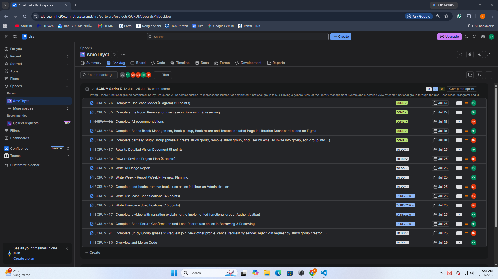

# Weekly Report

    Project: Modern Library Management System 
    Course: CS300 – CSC13002 – Introduction to Software Engineering 
    Group ID: 03
    Group Name: AmeThyst 
    Assignment: PA3-2026

Performed by: Vũ Duy Nhất | Reviewed by: All Other Members | Edited by: Vũ Duy Nhất

## I. Meeting Minutes:  19/7/2026
- **Team member present:**
  - Vũ Duy Nhất
  - Trần Lê Hoàng Gia
  - Phan Lê Anh Minh
  - Nguyễn Nhựt Huy
  - Nguyễn Lê Hoàng Khải
- **Status Report:**
  - **Vũ Duy Nhất**:
    - Completed task
      - Complete Use-case Model (Diagram) (10 points)
      - Overview and Merge Code
    - To-do task
      - Complete AI Usage Report
      - Complete Weekly Report
      - Complete a video with narration explaining the implemented functional group (Authentication)
    - Obstacles/Issues
      - Need to decompose the system into sub-systems to prevent use-case diagrams from becoming overly complex
      - Converting use-case diagrams from Draw.io to Mermaid is difficult because Mermaid lacks the necessary notations
  - **Trần Lê Hoàng Gia**
    - Completed task
      - Complete AI Recommendations
    - To-do task
      - Complete Use-Case Specifications (45 points)
      - Complete add books, remove books use cases in Librarian Administration
    - Obstacles/Issues
      - Need to automate the startup sequence (Python backend before Node.js) to simplify system execution
  - **Phan Lê Anh Minh**
    - Completed task
      - Write more business tests for register use case
      - Complete partially Announcement use case in Librarian Administration
    - To-do task
      - Complete Use-Case Specifications (45 points)
      - Add Socket to support Librarian Announcement use case
    - Obstacles/Issues
      - A new table is required to synchronize and handle user notifications across re-visits
  - **Nguyễn Nhựt Huy**
    - Completed task
      - Complete the Room Reservation use case in Borrowing & Reserving
      - Complete Books (Book Management, Book pickup, Book return and Inspection tabs) Page in Librarian Dashboard based on Figma
    - To-do task
      - Rewrite Detailed Vision Document (5 points)
      - Complete Book Return Confirmation and Loan Record use cases in Borrowing & Reserving
    - Obstacles/Issues: None
  - **Nguyễn Lê Hoàng Khải**
    - Completed task
      - Complete partially Study Group (phase 1: create study group, remove study group, find user by email to invite into group, edit group info,...)
    - To-do task
      - Rewrite Revised Project Plan (5 points)
      - Complete Study Group phase 2: (request join, view other profile, cancel request by sender, reject join request by study group creator,...)
    - Obstacles/Issues
      - Need to distinguish between invite and request in **group_request** table
      - There are many announcements generated from sending, receiving features and need to be synchronized
- **Action:**
  - **Trần Lê Hoàng Gia:** Use Docker to automate startup sequence within only one command
  - **Phan Lê Anh Minh:** Propose detail structure of necessary table to team leader
  - **Nguyễn Lê Hoàng Khải**: Use Socket in sending, receiving features in Study Group
- **Summary of the meeting:** Firstly, the team reviewed completed progress, including the AI recommendation feature, room reservations, announcement management, and Phase 1 of the Study Group module (creation, deletion, invitations, and editing info). Remaining tasks were identified across Admin Administration, the rest of the Study Group features (e.g., join requests, profile viewing, cancellations, and rejections), and remaining Librarian Administration functions (e.g., book and room return confirmations, loan records, and book management). The team also discussed documentation guidelines for PA3—focusing on Use-case diagram notations, diagram reading techniques, and the Use-case specification outline and template. After that, the team leader proposed using Socket.io library for the product to solve current synchronized problems. Finally, the team leader assigned tasks to team members and provided them implementation ideas if needed.
## II. Meeting Minutes:  23/7/2026
- **Team member present:**
  - Vũ Duy Nhất
  - Trần Lê Hoàng Gia
  - Phan Lê Anh Minh
  - Nguyễn Nhựt Huy
  - Nguyễn Lê Hoàng Khải
- **Status Report:**
  - **Vũ Duy Nhất**:
    - Completed task
      - Complete a video with narration explaining the implemented functional group (Authentication)
    - To-do task
      - Adjust Use-Case Diagram based on feedback
      - Complete AI Usage Report
      - Complete Weekly Report
    - Obstacles/Issues: None
  - **Trần Lê Hoàng Gia**
    - Completed task
      - Complete add books, remove books use cases in Librarian Administration
    - To-do task
      - Adjust Use-Case Specifications based on feedback
    - Obstacles/Issues
      - The mermaid script is inadequate for displaying Use-Case diagram
  - **Phan Lê Anh Minh**
    - Completed task
      - Add Socket to support Librarian Announcement use case
    - To-do task
      - Adjust Use-Case Specifications based on feedback
    - Obstacles/Issues
      - Need to insert GUI screenshot as prototype for Use-Case Specification
  - **Nguyễn Nhựt Huy**
    - Completed task
      - Complete Book Return Confirmation and Loan Record use cases in Borrowing & Reserving
    - To-do task
      - Rewrite Detailed Vision Document based on feedback
    - Obstacles/Issues
      - Two above use cases had many edge cases and need to restructure the table system to solve
  - **Nguyễn Lê Hoàng Khải**
    - Completed task
      - Complete Study Group phase 2: (request join, view other profile, cancel request by sender, reject join request by study group creator,...)
    - To-do task
      - Rewrite Revised Project Plan based on feedback
    - Obstacles/Issues
      - Remaining use cases in Study Group also had many edge cases and need to restructure the table system to solve
- **Action:**
  - **Vũ Duy Nhất**: Refactoring the Use-Case Diagram to avoid workflow interpretation.
  - **Trần Lê Hoàng Gia:** Adjust the display layout of Use-Case Specification into table for easily reading and gather all Use-Case Specifications into only one file.
  - **Phan Lê Anh Minh:** Adjust the display layout of Use-Case Specification into table for easily reading and gather all Use-Case Specifications into only one file.
- **Summary of the meeting:** Firstly, the team reviewed the progress completed by the end of Sprint 3. The team successfully finished the entire Study Group functional group, as well as the book management (add/remove books), return book confirmations, and loan records features under Librarian Administration. Remaining tasks include Admin Administration and room return confirmations for Librarian Administration. Additionally, the team reviewed feedback from the TA regarding PA3 documentation—specifically updates for the Vision Document and Project Plan, alongside Use-case Specifications and Use-case Diagrams.

## III. Task Screenshot on Jira (Week 1: 13/7 - 19/7 & Week 2: 20/7 - 25/7)

