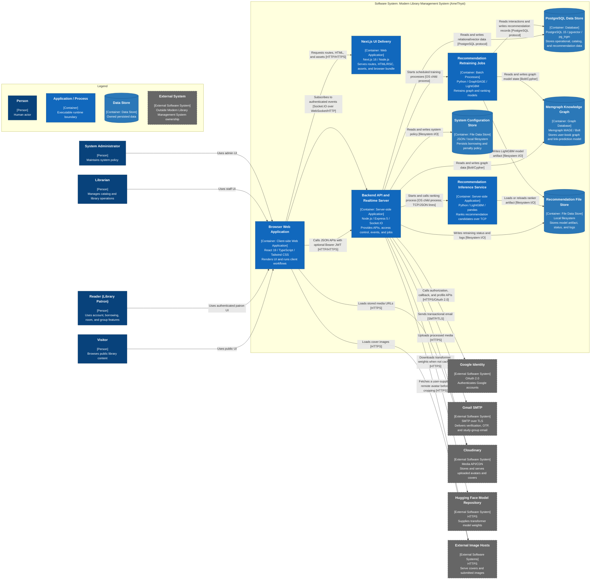
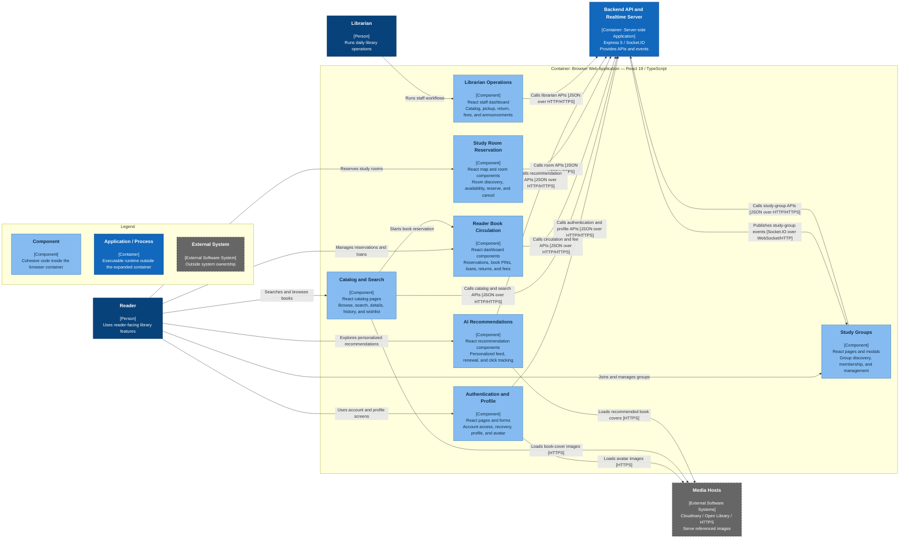
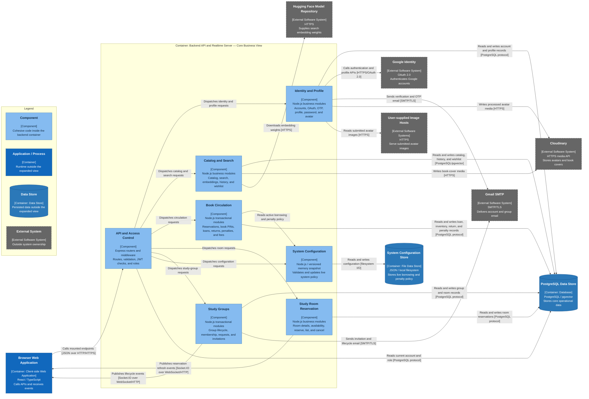
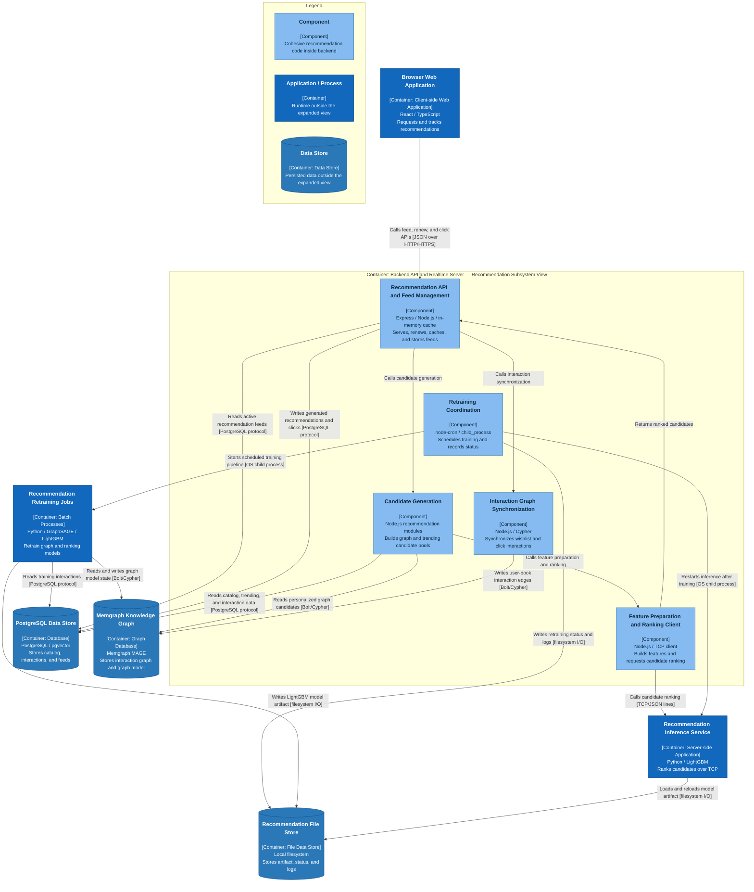

# Container and Component Diagram

    Project: Modern Library Management System
    Course: CS300 – CSC13002 – Introduction to Software Engineering
    Group ID: 03
    Group Name: AmeThyst
    Assignment: PA4-2026

Performed by: Nguyễn Lê Hoàng Khải | Reviewed by: All Members | Edited by: Nguyễn Lê Hoàng Khải

## Table of Contents

- [Container and Component Diagram](#container-and-component-diagram)
  - [Table of Contents](#table-of-contents)
  - [1. C4 Model — Level 2: Container Diagram](#1-c4-model--level-2-container-diagram)
    - [1.1 Main Flow](#11-main-flow)
    - [1.2 Container Descriptions](#12-container-descriptions)
    - [1.3 External System Descriptions](#13-external-system-descriptions)
  - [2. C4 Model — Level 3: Frontend Component Diagram](#2-c4-model--level-3-frontend-component-diagram)
    - [2.1 Main Flow](#21-main-flow)
    - [2.2 Frontend Component Descriptions](#22-frontend-component-descriptions)
  - [3. C4 Model — Level 3: Backend Core Business Component Diagram](#3-c4-model--level-3-backend-core-business-component-diagram)
    - [3.1 Main Flow](#31-main-flow)
    - [3.2 Backend Core Component Descriptions](#32-backend-core-component-descriptions)
  - [4. C4 Model — Level 3: Recommendation Subsystem Component Diagram](#4-c4-model--level-3-recommendation-subsystem-component-diagram)
    - [4.1 Main Flow](#41-main-flow)
    - [4.2 Recommendation Component Descriptions](#42-recommendation-component-descriptions)
  - [5. AI Usage Notes](#5-ai-usage-notes)

## 1. C4 Model — Level 2: Container Diagram

### 1.1 Main Flow

A user loads the Browser Web Application from Next.js UI Delivery. The browser calls the Backend API for business operations and subscribes to realtime events. The backend reads and writes PostgreSQL, uses Memgraph and the Python processes for recommendations, and calls external services for identity, email, media, and model downloads.

### 1.2 Container Descriptions

| Container | Responsibility and services provided | Technology/framework | Communication |
|---|---|---|---|
| Next.js UI Delivery | Serves pages, RSC payloads, browser bundles, and static assets. | Next.js 16.2, Node.js | HTTP/HTTPS from browsers. |
| Browser Web Application | Renders the UI, keeps client auth state, calls APIs, and receives realtime events. | React 19.2, TypeScript, Tailwind CSS 4, Socket.IO client | HTTP/HTTPS to Next.js and backend; Socket.IO to backend; HTTPS to media hosts. |
| Backend API and Realtime Server | Runs APIs, access control, business workflows, realtime events, schedulers, and recommendation process control. | Node.js, Express 5.2, Socket.IO 4.8, Passport, JWT, node-cron | HTTP/HTTPS, Socket.IO, PostgreSQL, Bolt/Cypher, TCP/JSON lines, SMTP/TLS, HTTPS, filesystem, and child processes. |
| PostgreSQL Data Store | Stores accounts, catalog, circulation, rooms, groups, announcements, history, wishlist, and recommendations. | PostgreSQL 15, pgvector, pg_trgm, intarray | PostgreSQL protocol from Node and Python. |
| Memgraph Knowledge Graph | Stores user-book interactions and provides graph recommendation scores. | Memgraph MAGE | Bolt/Cypher from backend and GraphSAGE jobs. |
| Recommendation Inference Service | Ranks candidates with LightGBM or GraphSAGE-score fallback. | Python, LightGBM, pandas | Newline-delimited JSON over local TCP; reads model files. |
| Recommendation Retraining Jobs | Retrains GraphSAGE and LightGBM models. | Python, GraphSAGE, LightGBM, scikit-learn | Spawned child processes; PostgreSQL, Bolt/Cypher, and filesystem. |
| System Configuration Store | Stores borrowing limits, fees, and damage coefficients. | JSON, Node.js filesystem APIs | Read at startup; replaced atomically on update. |
| Recommendation File Store | Stores model artifacts, retraining status, and logs. | Local filesystem, JSON, LightGBM model | Written by backend/jobs and read by inference. |

### 1.3 External System Descriptions

| External system | Purpose | Integration and evidence |
|---|---|---|
| Google Identity | Google sign-in and profile data. | OAuth 2.0 through Passport and backend auth routes. |
| Gmail SMTP | Verification, OTP, invitation, and group emails. | SMTP/TLS through Nodemailer. |
| Cloudinary | Stores uploaded avatars and book covers. | HTTPS media API and CDN URLs. |
| Hugging Face Model Repository | Supplies the local search embedding model. | HTTPS through `@huggingface/transformers`; database/hash fallbacks are available. |
| External Image Hosts | Serve Open Library covers and submitted avatar images. | Browser HTTPS requests or validated backend HTTPS fetches. |

## 2. C4 Model — Level 3: Frontend Component Diagram

### 2.1 Main Flow

A reader searches the catalog and opens a book detail page. Catalog and Search calls the backend for book data, then starts the reservation workflow in Reader Book Circulation. That component calls the backend to validate the reader and inventory before showing the updated reservation on the dashboard.

### 2.2 Frontend Component Descriptions

| Component | Responsibility | Representative code/modules | Relationships |
|---|---|---|---|
| Authentication and Profile | Handles login, registration, verification, recovery, profile, password, and avatar screens. | Auth/profile pages, `LoginFormCard.tsx`, `RegisterFormCard.tsx`, `SecurityFormCard.tsx`, `AvatarUploader.tsx` | Calls `/auth` and `/user`; loads avatar media. |
| Catalog and Search | Supports browsing, filters, search, book details, history, and wishlist. | Library pages, `FilterPanel.tsx`, `SearchBar.tsx`, `BookDetailTemplate.tsx`, `WishlistHeart.tsx` | Calls catalog/search/history/wishlist APIs and starts reservation. |
| Reader Book Circulation | Shows reservations, pickup/return PINs, loans, extensions, history, and fees. | User dashboard pages, `BorrowedBookCard.tsx`, `PinModal.tsx`, `DashboardCalendar.tsx`, `FeesBreakdownPanel.tsx` | Calls circulation and fee APIs. |
| Study Room Reservation | Shows floor maps, room details, availability, reservations, and cancellation. | `map/page.tsx`, `FloorMap.tsx`, `RoomDetailPanel.tsx`, `ReservationCard.tsx`, `utils/room.ts` | Calls `/api/rooms`; room check-in PIN is not implemented. |
| Study Groups | Supports discovery, creation, membership requests, invitations, and management. | Study-group pages, `StudyGroup.tsx`, `StudyGroupInfoModal.tsx`, `AuthActions.tsx`, `utils/studyGroup.ts` | Calls `/api/study-groups` and receives Socket.IO events. |
| AI Recommendations | Shows, renews, and tracks personalized recommendations. | Recommendation page, `RecommendationCarousel.tsx`, `BookCard.tsx` | Calls recommendation and wishlist APIs; loads cover media. |
| Librarian Operations | Manages catalog, pickup, return inspection, fees, and announcements. | `BookManagementTab.tsx`, `InlinePinVerification.tsx`, `ReturnFlowPanel.tsx`, `LoanFeesPanel.tsx`, `LibrarianAnnouncementsPanel.tsx` | Calls librarian, catalog, and announcement APIs; stock transfer is partial. |

## 3. C4 Model — Level 3: Backend Core Business Component Diagram

### 3.1 Main Flow

The browser calls API and Access Control with a Bearer JWT. For a book reservation, the API dispatches the request to Book Circulation, which reads the active policy, checks and updates inventory in PostgreSQL, and writes the reservation. Other requests follow the same entry point and are dispatched to their matching business component.

### 3.2 Backend Core Component Descriptions

| Component | Responsibility | Representative code/modules | Relationships |
|---|---|---|---|
| API and Access Control | Routes requests, validates input and JWTs, reloads account roles, and enforces access. | `server.mjs`, `routes/*.mjs`, auth/role/validation middleware | Receives browser calls, reads account roles, and dispatches requests. |
| Identity and Profile | Handles accounts, password/Google login, verification, OTP, profiles, passwords, and avatars. | Auth/user/avatar controllers, services, models, Passport, and mail helpers | Reads/writes PostgreSQL and calls Google, Gmail, Cloudinary, and image hosts. |
| Catalog and Search | Handles catalog data, text/vector search, embeddings, history, CRUD, and wishlist. | Library/search/history/wishlist modules, `embedding.services.mjs` | Reads/writes PostgreSQL and calls Hugging Face and Cloudinary. |
| Book Circulation | Handles reservations, pickup/return PINs, loans, extensions, returns, penalties, inventory, and payments. | Library and user/librarian dashboard modules, `penalty.utils.mjs`, `pinScheduler.mjs` | Reads policy and writes circulation transactions to PostgreSQL. |
| Study Room Reservation | Provides room data and conflict-safe reservation, listing, and cancellation. | Room routes, controllers, services, and models | Reads/writes PostgreSQL and publishes reservation refresh events. |
| Study Groups | Handles group creation, room booking, membership, requests, invitations, and lifecycle actions. | Study-group routes, middleware, controllers, services, and models | Reads/writes PostgreSQL, publishes Socket.IO events, and sends Gmail messages. |
| System Configuration | Validates, versions, reads, and atomically updates live borrowing and penalty policy. | System-configuration modules and JSON document | Reads/writes the configuration store and supplies policy to circulation. |

## 4. C4 Model — Level 3: Recommendation Subsystem Component Diagram

### 4.1 Main Flow

For feed generation, the browser calls Recommendation API and Feed Management. It reads an existing feed or calls Candidate Generation, which reads PostgreSQL and Memgraph before Feature Preparation and Ranking Client calls the Python inference process. The API writes the selected recommendations to PostgreSQL. Separately, Retraining Coordination starts the scheduled GraphSAGE and LightGBM jobs, writes their status, and restarts inference after a new artifact is created.

### 4.2 Recommendation Component Descriptions

| Component | Responsibility | Representative code/modules | Relationships |
|---|---|---|---|
| Recommendation API and Feed Management | Serves recommendation feeds, renews them, tracks clicks, keeps the user cache, and stores results. | Recommendation routes/controllers/services and in-memory cache | Calls candidate generation and graph synchronization; reads/writes PostgreSQL. |
| Candidate Generation | Combines Memgraph personalized candidates with PostgreSQL trending fallbacks. | Candidate selection in `recommendation.services.mjs` | Reads PostgreSQL and Memgraph, then calls ranking. |
| Feature Preparation and Ranking Client | Builds ranking features and exchanges newline-delimited JSON with Python inference. | Feature compilation and TCP client in `recommendation.services.mjs` | Calls Recommendation Inference Service and returns ranked candidates. |
| Interaction Graph Synchronization | Synchronizes wishlist and recommendation-click interactions. | `memgraphSync.services.mjs` and recommendation click handling | Writes user-book edges to Memgraph. |
| Retraining Coordination | Schedules weekly training, prevents overlap, records status/logs, and restarts inference. | `scheduler.services.mjs`, startup calls in `server.mjs` | Starts training jobs, writes file status, and restarts inference. |

## 5. AI Usage Notes

This document was drafted with the assistance of an AI tool, declared as follows:

### AI Tool 1

- **Tool name:** ChatGPT (OpenAI)
- **Access time:** August 2, 2026
- **Prompt:** “Using the PA4 requirements, Project Plan, Vision Document, and C4 guidance, read the whole system and create its container and component diagrams.”
- **Purpose:** Review the current implementation and document its C4 container and component architecture.
- **Content generated by AI:** Mermaid diagrams, architecture descriptions, terminology alignment, and document formatting.
- **Student's work and validation:** The student provided the requirements and reference documents. Architecture details were checked against source code, runtime configuration, database schema, and rendered Mermaid output.
