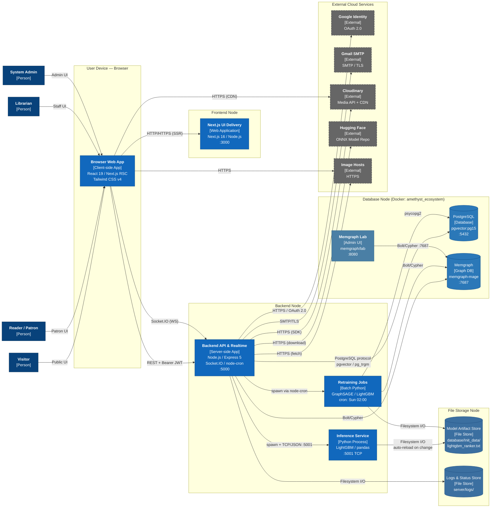

# Deployment Diagram

    Project: Modern Library Management System
    Course: CS300 – CSC13002 – Introduction to Software Engineering
    Group ID: 03
    Group Name: AmeThyst
    Assignment: PA4-2026

Performed by: Vũ Duy Nhất | Reviewed by: All Members | Edited by: Vũ Duy Nhất

## 1. Deployment Diagram

---

## 2. Node Description

| # | Node | Hardware / Cloud Service | Containers / Components | Port(s) | Communication Protocols |
|---|------|--------------------------|-------------------------|---------|-------------------------|
| 1 | **User Device (Browser)** | End-user physical device (PC, laptop, tablet, phone) | Browser Web Application — React 19, Next.js RSC client bundle, Tailwind CSS v4 | — (browser-side) | HTTP/HTTPS (→ Frontend, Backend), WebSocket/HTTP via Socket.IO (→ Backend), HTTPS (→ Cloudinary, External Image Hosts) |
| 2 | **Frontend Node** | Local machine (logical node) | Next.js UI Delivery — Next.js 16 / Node.js; serves SSR pages, RSC, static assets, and hydrated client bundle | **3000** | HTTP/HTTPS (← Browser) |
| 3 | **Backend Node** | Local machine (logical node) | **(a)** Backend API & Realtime Server — Node.js / Express 5 / Socket.IO / node-cron / `@huggingface/transformers` (local ONNX); **(b)** Recommendation Inference Service — Python 3 / LightGBM / pandas, TCP socket server; **(c)** Recommendation Retraining Jobs — Python 3 / GraphSAGE (Cypher MAGE) / LightGBM / psycopg2, cron-spawned batch processes | **5000** (API), **5001** (Python TCP) | HTTP/HTTPS (← Browser), PostgreSQL wire protocol (→ DB Node), Bolt/Cypher via neo4j-driver (→ DB Node), TCP/JSON Lines (API ↔ Inference, loopback), OS child process spawn (API → Retrain), HTTPS (→ External), SMTP/TLS (→ Gmail) |
| 4 | **Database Node** | Local machine — Docker Compose (`amethyst_ecosystem`) | **(a)** PostgreSQL 15 + pgvector + pg_trgm (`pgvector/pgvector:pg15`); **(b)** Memgraph MAGE (`memgraph/memgraph-mage:latest`); **(c)** Memgraph Lab (`memgraph/lab:latest`) — visual query and admin UI | **5432** (PostgreSQL), **7687** (Memgraph Bolt), **8080** (Memgraph Lab) | PostgreSQL wire protocol (← Backend API, ← Retraining Jobs), Bolt/Cypher (← Backend API, ← Retraining Jobs, ← Memgraph Lab) |
| 5 | **File Storage Node** | Local machine filesystem (two directories) | **(a)** Model Artifact Store (`database/Init_data/`) — `lightgbm_ranker.txt` (LightGBM GBDT), GraphSAGE embedding snapshot; **(b)** Retraining Logs & Status Store (`server/logs/`) — `recommendation_retraining.log`, `retrain_status.json` | — | Filesystem I/O (← Retraining Jobs write model artifact; ← Inference Service reads/reloads model; ← Backend API writes logs & status) |
| 6 | **Google Identity** | Google Cloud (external) | OAuth 2.0 authorization server; integrated via `passport-google-oauth20` | — | HTTPS / OAuth 2.0 (← Backend API) |
| 7 | **Gmail SMTP** | Google Cloud (external) | SMTP relay; integrated via `nodemailer` | — | SMTP over TLS (← Backend API) |
| 8 | **Cloudinary** | Cloudinary CDN (external) | Media storage and CDN for processed avatars and book covers; integrated via `cloudinary` SDK | — | HTTPS / Cloudinary API (← Backend API upload); HTTPS CDN (← Browser load) |
| 9 | **Hugging Face Model Repository** | Hugging Face (external) | Hosts `Xenova/all-MiniLM-L6-v2` ONNX transformer weights; accessed via `@huggingface/transformers` | — | HTTPS (← Backend API on first use; weights auto-cached locally) |
| 10 | **External Image Hosts** | Third-party servers (external) | Remotely hosted book cover images and user-supplied avatar URLs | — | HTTPS (← Browser for display; ← Backend API for avatar fetch before `sharp` crop) |

---

## 3. Communication Protocol Summary

| # | Link | Source | Destination | Protocol / Mechanism |
|---|------|--------|-------------|----------------------|
| 1 | Browser → Frontend | Browser Web App | Next.js UI Delivery | HTTP / HTTPS |
| 2 | Browser → Backend (REST) | Browser Web App | Backend API & Realtime Server | HTTP / HTTPS — REST API + Bearer JWT |
| 3 | Browser → Backend (Realtime) | Browser Web App | Backend API & Realtime Server | WebSocket / HTTP — Socket.IO (JWT auth middleware) |
| 4 | Browser → Cloudinary | Browser Web App | Cloudinary CDN | HTTPS — direct CDN URL |
| 5 | Browser → Image Hosts | Browser Web App | External Image Hosts | HTTPS |
| 6 | Backend API → PostgreSQL | Backend API | PostgreSQL Data Store | PostgreSQL wire protocol (via `pg` pool) |
| 7 | Backend API → Memgraph | Backend API | Memgraph Knowledge Graph | Bolt / Cypher (via `neo4j-driver`) |
| 8 | Backend API → Inference | Backend API | Recommendation Inference Service | OS `spawn()` to start; TCP / JSON Lines on loopback port 5001 |
| 9 | Backend API → Retraining | Backend API | Recommendation Retraining Jobs | OS `spawn()` via `node-cron` (no persistent IPC) |
| 10 | Backend API → Logs Store | Backend API | Retraining Logs & Status Store | Filesystem I/O (`fs.appendFileSync`, `fs.writeFileSync`) |
| 11 | Backend API → Google | Backend API | Google Identity | HTTPS / OAuth 2.0 (`passport-google-oauth20`) |
| 12 | Backend API → Gmail | Backend API | Gmail SMTP | SMTP over TLS (`nodemailer`) |
| 13 | Backend API → Cloudinary | Backend API | Cloudinary | HTTPS (`cloudinary` SDK upload) |
| 14 | Backend API → Hugging Face | Backend API | Hugging Face Model Repository | HTTPS (`@huggingface/transformers` — cached after first download) |
| 15 | Backend API → Image Hosts | Backend API | External Image Hosts | HTTPS (`sharp` + fetch for avatar crop) |
| 16 | Inference → Model Artifact | Recommendation Inference Service | Model Artifact Store | Filesystem I/O — reads `lightgbm_ranker.txt`, auto-reloads on mtime change |
| 17 | Retraining → PostgreSQL | Recommendation Retraining Jobs | PostgreSQL Data Store | PostgreSQL wire protocol (`psycopg2`) |
| 18 | Retraining → Memgraph | Recommendation Retraining Jobs | Memgraph Knowledge Graph | Bolt / Cypher (`neo4j` Python driver) |
| 19 | Retraining → Model Artifact | Recommendation Retraining Jobs | Model Artifact Store | Filesystem I/O — writes `lightgbm_ranker.txt` and GraphSAGE snapshot |
| 20 | Memgraph Lab → Memgraph | Memgraph Lab | Memgraph Knowledge Graph | Bolt / Cypher (port 7687, Docker internal network) |

## 4. AI Usage Note
This document was drafted with the assistance of an AI tool, declared as follows:

### AI Tool 1

- **Tool name:** Antigravity Agent (Sonnet 4.6)
- **Access time:** August 5, 2026 15:00
- **Prompt:** *Based on the deploymentDiagramRequirent.md, draw the deployment diagram using mermaid, then create file DeploymentDiagram.md and insert into it.*
- **Purpose:** To ensure the deployment diagram follow stricly the requirenments in PA4 and the structure of Container Diagram (C4 level 2)
- **Content generated by AI:** Mermaid diagram in the file DeploymentDiagram.md
- **Student's work and validation:** The student reviewed the generated Mermaid syntax, verified that all C4 level 2 containers and node mappings strictly satisfied the criteria in `deploymentDiagramRequirent.md`, adjusted element labels for visual clarity, and validated that the container architecture accurately reflected the planned infrastructure.

### AI Tool 2

- **Tool name:** Antigravity Agent (Sonnet 4.6)
- **Access time:** August 5, 2026 15:10
- **Prompt:** *Based on source code in folder src, fix if any missing and use flowchart LR tag for the mermaid diagram*
- **Purpose:** To ensure the deployment diagram reflect correctly the our current system based on source code
- **Content generated by AI:** The new Mermaid Diagram using flowchart LR is more complete and suitable with our system
- **Student's work and validation:** The student cross-referenced the generated flowchart against the active codebase in the `src` folder, verified all network protocols and container dependencies, manually corrected minor node naming discrepancies, and performed a final dry run to ensure the diagram accurately represented the live deployment layout.
