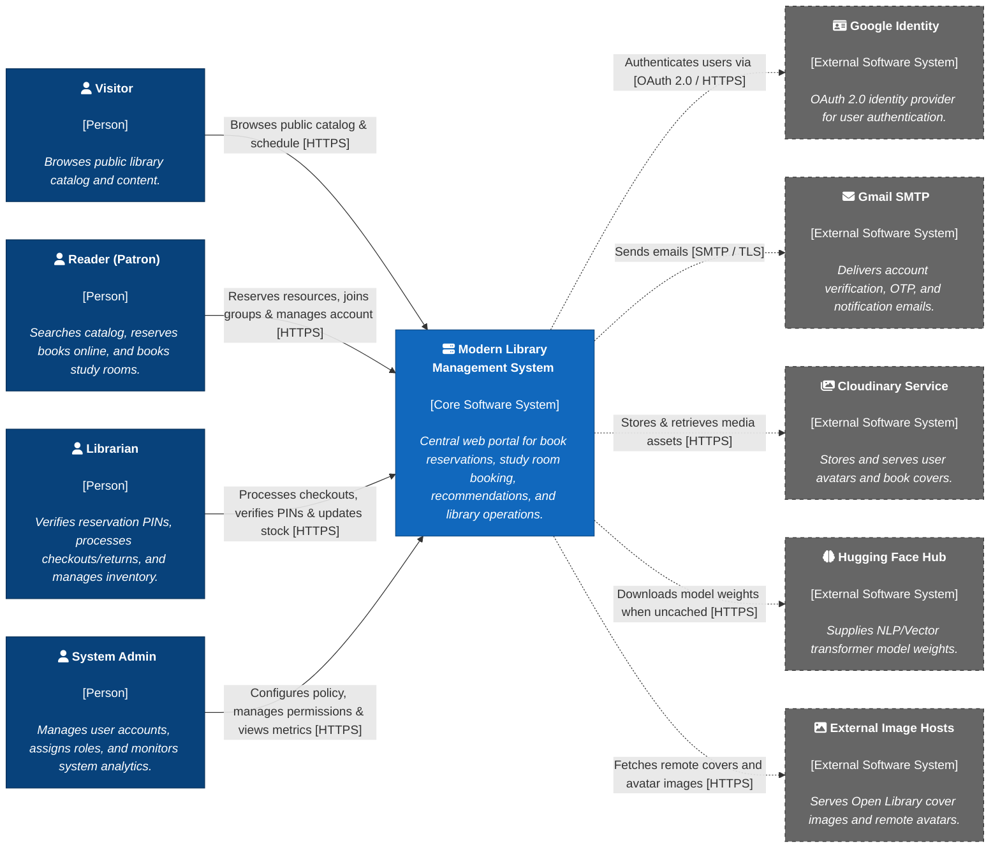

# Software Architecture: System Context Diagram

    Project: Modern Library Management System
    Course: CS300 – CSC13002 – Introduction to Software Engineering
    Group ID: 03
    Group Name: AmeThyst
    Assignment: PA4-2026

Performed by: Trần Lê Hoàng Gia | Reviewed by: All Members | Edited by: Trần Lê Hoàng Gia

## Table of Contents

- [Software Architecture: System Context Diagram](#software-architecture-system-context-diagram)
  - [Table of Contents](#table-of-contents)
  - [1. Technology Stack](#1-technology-stack)
  - [2. C4 Model — Level 1: System Context Diagram](#2-c4-model--level-1-system-context-diagram)
  - [3. AI Usage Notes](#3-ai-usage-notes)

---

## 1. Technology Stack

The platform covers all core workflows spanning PA1 through PA4, including catalog search, book circulation, study room reservation, study groups, real-time notifications, and AI recommendation pipelines.

| Layer / Component | Technologies & Libraries | Purpose & Coverage |
| :--- | :--- | :--- |
| **Frontend UI** | Next.js 16 (App Router / RSC), React 19, TypeScript, Tailwind CSS 4 | Renders dynamic interfaces, executes client workflows, and delivers server-rendered pages for readers, librarians, and admins. |
| **Backend API Server** | Node.js, Express 5, Socket.IO 4.8, Passport.js, JWT, `node-cron` | Hosts RESTful endpoints, handles access control, runs scheduled jobs (e.g., PIN expiration), and pushes real-time events. |
| **Recommendation Engine** | Python 3, LightGBM, GraphSAGE, pandas, scikit-learn | Implements graph link prediction and candidate re-ranking for personalized book recommendations over TCP/JSON lines. |
| **Primary Database** | PostgreSQL 15, `pgvector`, `pg_trgm`, `intarray` | Stores relational catalog, circulation, room bookings, user accounts, and vector search embeddings. |
| **Knowledge Graph DB** | Memgraph MAGE (Bolt Protocol / Cypher) | Stores user-book interaction graphs to run real-time link-prediction algorithms. |
| **Authentication & Email** | Google OAuth 2.0, Nodemailer (Gmail SMTP) | Provides Single Sign-On (SSO) and handles transactional emails (OTPs, password recovery, group invites). |
| **Media & CDN** | Cloudinary API, External CDNs (Open Library) | Manages image uploads, profile avatars, and book cover asset delivery. |
| **AI / Machine Learning** | Hugging Face Transformers (`@huggingface/transformers`) | Supplies local NLP transformer models for generating catalog search embeddings. |

---

## 2. C4 Model — Level 1: System Context Diagram

## 3. AI Usage Notes

This document was drafted with the assistance of an AI tool, declared as follows:

- **Tool name**: Gemini (Google)

- **Access time**: August 3, 2026

- **Prompt**: “Assure the consistency of C4 system context diagram with Vision Document, and deeper level C4 diagram. Provide the description and explaination of the diagram components.”

- **Purpose**: Synthesize and format the C4 Level 1 System Context diagram and entity descriptions to integrate the main architectural document.

- **Content generated by AI**: C4 Level 1 System Context Mermaid diagram, person descriptions, external system table, and main flow prose.

- **Student's work and validation**: The student audited actor/persona consistency across Level 1 and Level 2, verified external dependencies (Google Identity, Gmail SMTP, Cloudinary, Hugging Face Hub, and External Image Hosts), and verified diagram alignment against the codebase and database schema.