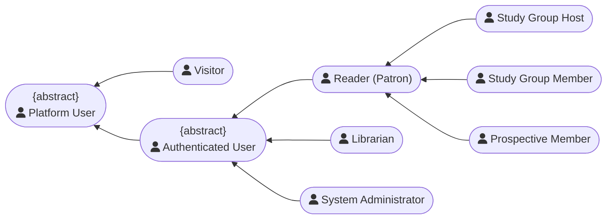
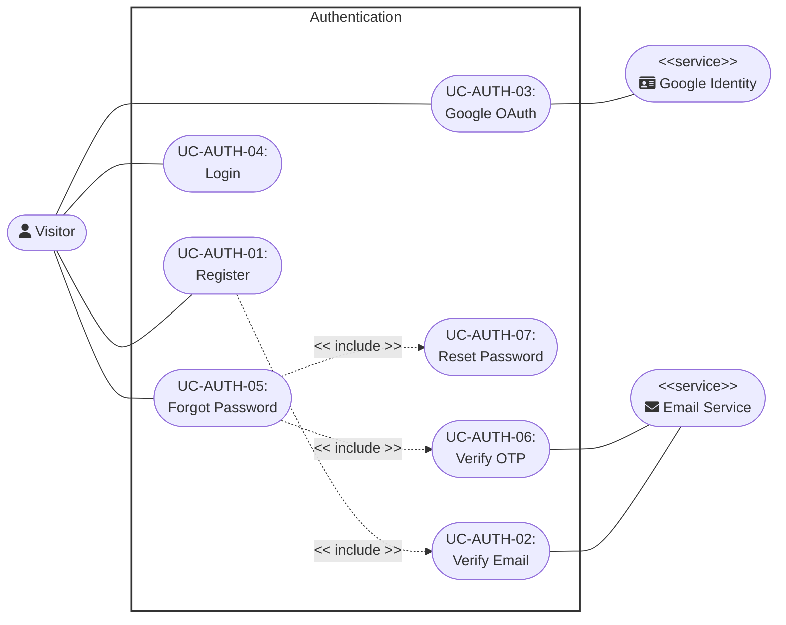
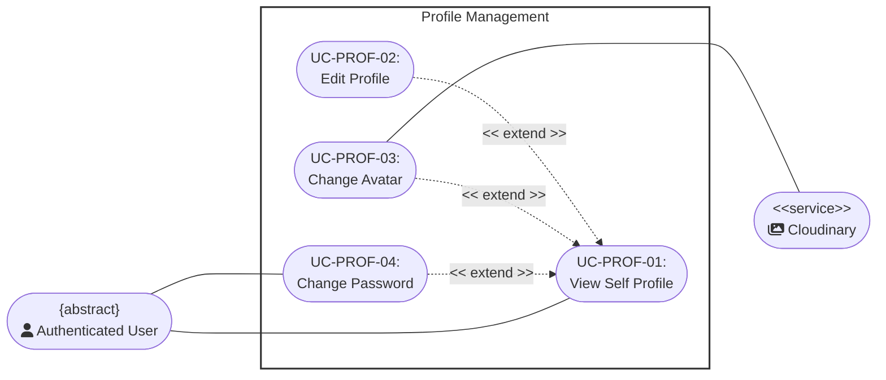
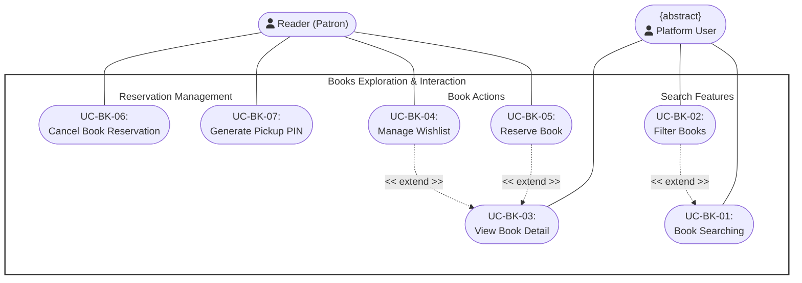
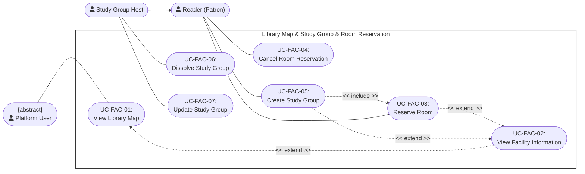
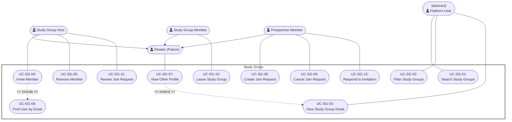
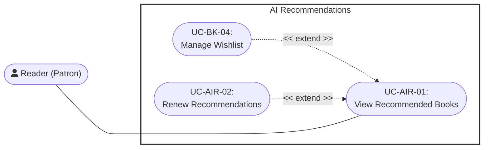
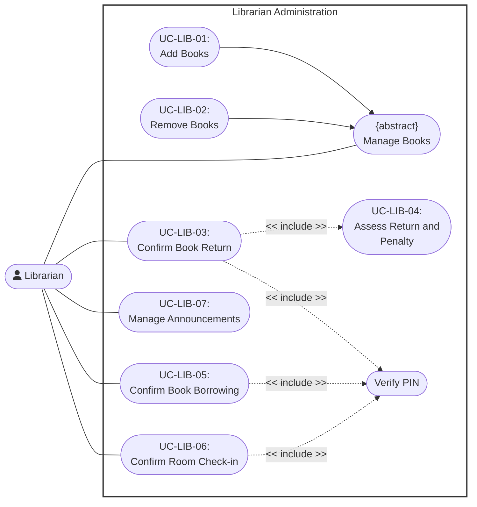
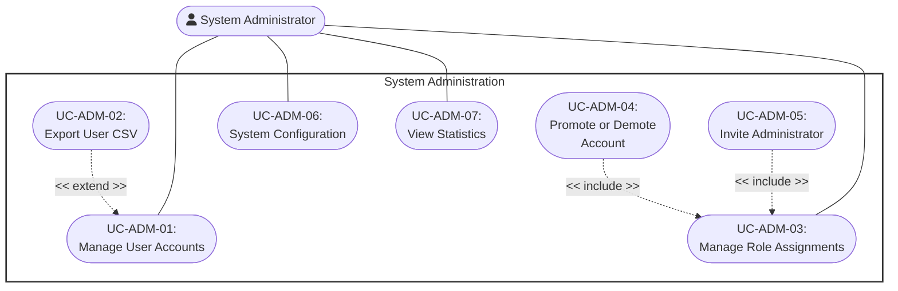

<link rel="stylesheet" href="https://cdnjs.cloudflare.com/ajax/libs/font-awesome/5.15.4/css/all.min.css">

# Use Case Diagram

    Project: Modern Library Management System
    Course: CS300 – CSC13002 – Introduction to Software Engineering
    Group ID: 03
    Group Name: AmeThyst
    Assignment: PA4-2026

Performed by: Trần Lê Hoàng Gia, Vũ Duy Nhất | Reviewed by: All Other Members | Edited by: Trần Lê Hoàng Gia

## Table of Contents

- [Use Case Diagram](#use-case-diagram)
  - [Table of Contents](#table-of-contents)
  - [Actor Regulation](#actor-regulation)
  - [Authentication](#authentication)
  - [Profile Management](#profile-management)
  - [Books Exploration \& Interaction](#books-exploration--interaction)
  - [Study Group Creation \& Facility Reservation](#study-group-creation--facility-reservation)
  - [Study Group](#study-group)
  - [AI Recommendations](#ai-recommendations)
  - [Librarian Administration](#librarian-administration)
  - [System Administration](#system-administration)

## Actor Regulation

`Reader (Patron)` maps to the persisted application role `user`. `Authenticated User` is an abstract actor shared by Reader, Librarian, and System Administrator. Contextual study-group actors specialize Reader rather than introducing new application roles.

## Authentication

## Profile Management

## Books Exploration \& Interaction

## Study Group Creation & Facility Reservation

## Study Group

## AI Recommendations

## Librarian Administration

## System Administration

