# Use-Case Specification

    Project: Modern Library Management System
    Course: CS300 – CSC13002 – Introduction to Software Engineering
    Group ID: 03
    Group Name: AmeThyst
    Assignment: PA4-2026
    Version: 2.0
Performed by: Phan Lê Anh Minh, Trần Lê Hoàng Gia | Reviewed by: All Members | Edited by: Phan Lê Anh Minh, Trần Lê Hoàng Gia

## Revision History

| Date | Version | Description | Author |
| --- | --- | --- | --- |
| 20-Jul-2026 | 1.1 | Authentication Use case specification (RUP format layout). | Phan Lê Anh Minh, Trần Lê Hoàng Gia |
| 23-Jul-2026 | 1.2 | Update use-case table layout (HTML) | Phan Lê Anh Minh, Trần Lê Hoàng Gia |
| 23-Jul-2026 | 1.3 | Merge file content | Phan Lê Anh Minh, Trần Lê Hoàng Gia |
| 24-Jul-2026 | 1.4 | Update format, fix spellings | Phan Lê Anh Minh, Trần Lê Hoàng Gia |
| 7-Aug-2026 | 2.0 | Update ImageGUI, fix diagrams | Phan Lê Anh Minh, Trần Lê Hoàng Gia |

## Table of Contents

- [Use-Case Specification](#use-case-specification)
  - [Revision History](#revision-history)
  - [Table of Contents](#table-of-contents)
  - [I. Actor Regulation](#i-actor-regulation)
  - [II. Authentication](#ii-authentication)
    - [Use case diagram](#use-case-diagram)
    - [UC-AUTH-01: Register](#uc-auth-01-register)
    - [UC-AUTH-02: Verify Email](#uc-auth-02-verify-email)
    - [UC-AUTH-03: Google OAuth](#uc-auth-03-google-oauth)
    - [UC-AUTH-04: Login](#uc-auth-04-login)
    - [UC-AUTH-05: Forgot Password](#uc-auth-05-forgot-password)
    - [UC-AUTH-06: Verify OTP](#uc-auth-06-verify-otp)
    - [UC-AUTH-07: Reset Password](#uc-auth-07-reset-password)
  - [III. Profile Management](#iii-profile-management)
    - [Use case diagram](#use-case-diagram-1)
    - [UC-PROF-01: View Self Profile](#uc-prof-01-view-self-profile)
    - [UC-PROF-02: Edit Profile](#uc-prof-02-edit-profile)
    - [UC-PROF-03: Change Avatar](#uc-prof-03-change-avatar)
    - [UC-PROF-04: Change Password](#uc-prof-04-change-password)
  - [IV. Books Exploration \& Interaction](#iv-books-exploration--interaction)
    - [Use case diagram](#use-case-diagram-2)
    - [UC-BK-01: Book Searching](#uc-bk-01-book-searching)
    - [UC-BK-02: Filter Books](#uc-bk-02-filter-books)
    - [UC-BK-03: View Book Detail](#uc-bk-03-view-book-detail)
    - [UC-BK-04: Manage Wishlist](#uc-bk-04-manage-wishlist)
    - [UC-BK-05: Reserve Book](#uc-bk-05-reserve-book)
    - [UC-BK-06: Cancel Book Reservation](#uc-bk-06-cancel-book-reservation)
    - [UC-BK-07: Generate Pickup PIN](#uc-bk-07-generate-pickup-pin)
  - [V. Study Group Creation \& Facility Reservation](#v-study-group-creation--facility-reservation)
    - [Use case diagram](#use-case-diagram-3)
    - [UC-FAC-01: View Library Map](#uc-fac-01-view-library-map)
    - [UC-FAC-02: View Facility Information](#uc-fac-02-view-facility-information)
    - [UC-FAC-03: Reserve Room](#uc-fac-03-reserve-room)
    - [UC-FAC-04: Cancel Room Reservation](#uc-fac-04-cancel-room-reservation)
    - [UC-FAC-05: Create Study Group](#uc-fac-05-create-study-group)
    - [UC-FAC-06: Dissolve Study Group](#uc-fac-06-dissolve-study-group)
    - [UC-FAC-07: Update Study Group](#uc-fac-07-update-study-group)
  - [VI. Study Group](#vi-study-group)
    - [Use case diagram](#use-case-diagram-4)
    - [UC-SG-01: Search Study Groups](#uc-sg-01-search-study-groups)
    - [UC-SG-02: Filter Study Groups](#uc-sg-02-filter-study-groups)
    - [UC-SG-03: View Study Group Detail](#uc-sg-03-view-study-group-detail)
    - [UC-SG-04: Invite Member](#uc-sg-04-invite-member)
    - [UC-SG-05: Remove Member](#uc-sg-05-remove-member)
    - [UC-SG-06: Find User by Email](#uc-sg-06-find-user-by-email)
    - [UC-SG-07: View Other Profile](#uc-sg-07-view-other-profile)
    - [UC-SG-08: Create Join Request](#uc-sg-08-create-join-request)
    - [UC-SG-09: Cancel Join Request](#uc-sg-09-cancel-join-request)
    - [UC-SG-10: Leave Study Group](#uc-sg-10-leave-study-group)
    - [UC-SG-11: Review Join Request](#uc-sg-11-review-join-request)
    - [UC-SG-12: Respond to Invitation](#uc-sg-12-respond-to-invitation)
  - [VII. AI Recommendation](#vii-ai-recommendation)
    - [Use case diagram](#use-case-diagram-5)
    - [UC-AIR-01: View Recommended Books](#uc-air-01-view-recommended-books)
    - [UC-AIR-02: Renew Recommendations](#uc-air-02-renew-recommendations)
  - [VIII. Librarian](#viii-librarian)
    - [Use case diagram](#use-case-diagram-6)
    - [UC-LIB-01: Add Books](#uc-lib-01-add-books)
    - [UC-LIB-02: Remove Books](#uc-lib-02-remove-books)
    - [UC-LIB-03: Confirm Book Return](#uc-lib-03-confirm-book-return)
    - [UC-LIB-04: Assess Return and Penalty](#uc-lib-04-assess-return-and-penalty)
    - [UC-LIB-05: Confirm Book Borrowing](#uc-lib-05-confirm-book-borrowing)
    - [UC-LIB-06: Confirm Room Check-in](#uc-lib-06-confirm-room-check-in)
    - [UC-LIB-07: Manage Announcements](#uc-lib-07-manage-announcements)
  - [IX. System Administration](#ix-system-administration)
    - [Use case diagram](#use-case-diagram-7)
    - [UC-ADM-01: Manage User Accounts](#uc-adm-01-manage-user-accounts)
    - [UC-ADM-02: Export User CSV](#uc-adm-02-export-user-csv)
    - [UC-ADM-03: Manage Role Assignments](#uc-adm-03-manage-role-assignments)
    - [UC-ADM-04: Promote or Demote Account](#uc-adm-04-promote-or-demote-account)
    - [UC-ADM-05: Invite Administrator](#uc-adm-05-invite-administrator)
    - [UC-ADM-06: System Configuration](#uc-adm-06-system-configuration)
    - [UC-ADM-07: View Statistics](#uc-adm-07-view-statistics)

## I. Actor Regulation

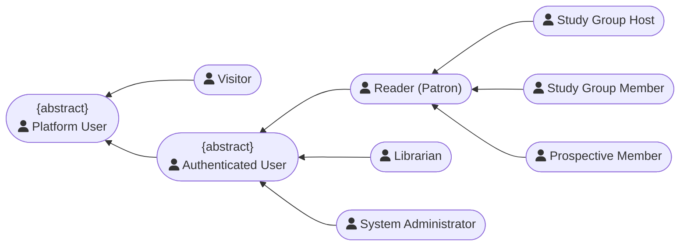

`Reader (Patron)` maps to the persisted application role `user`. `Authenticated User` is an abstract actor shared by Reader, Librarian, and System Administrator. Contextual study-group actors specialize Reader rather than introducing new application roles.

## II. Authentication

### Use case diagram

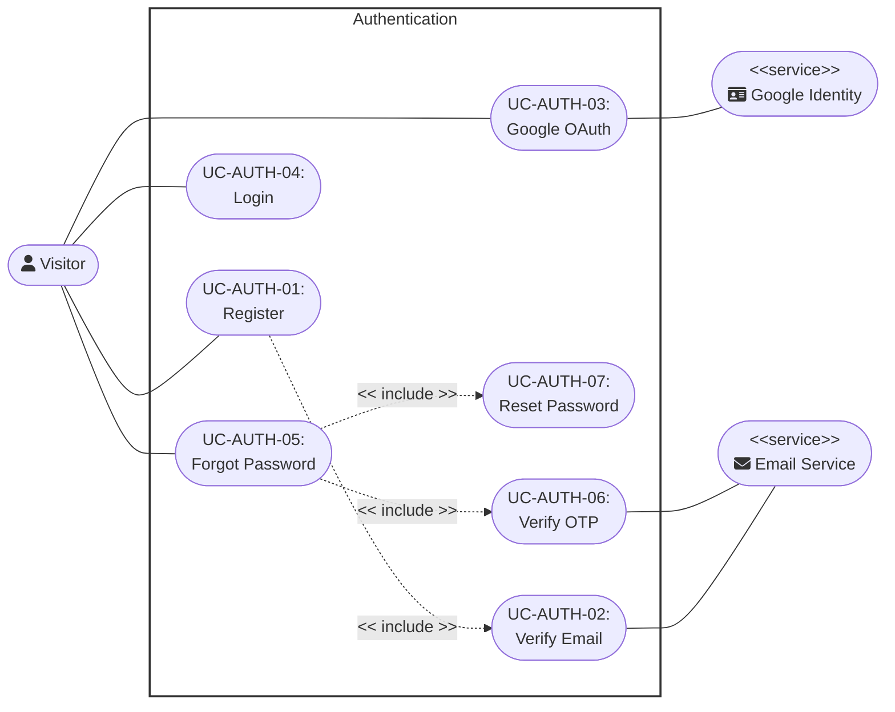

---

### UC-AUTH-01: Register

<table width="100%" border="1" cellpadding="8" cellspacing="0" style="border-collapse: collapse; font-family: Arial, sans-serif; font-size: 14px; border: 1px solid #d1d5db; margin-bottom: 20px;">
  <thead>
    <tr style="background-color: #1e3a8a; color: #ffffff;">
      <th colspan="2" style="text-align: left; padding: 12px; font-size: 16px;">
        Use Case: Register
      </th>
    </tr>
  </thead>
  <tbody>
    <tr>
      <td width="22%" style="background-color: #f8fafc; font-weight: bold; vertical-align: top;">Use Case ID</td>
      <td style="vertical-align: top;"><strong>UC-AUTH-01</strong></td>
    </tr>
    <tr>
      <td style="background-color: #f8fafc; font-weight: bold; vertical-align: top;">Brief Description</td>
      <td style="vertical-align: top;">
        Allows a visitor to submit registration details and receive an email-verification link before an account is activated.
         <em>(Includes / Extends: <strong>Includes UC-AUTH-02 (Verify Email).</strong>)</em>
      </td>
    </tr>
    <tr>
      <td style="background-color: #f8fafc; font-weight: bold; vertical-align: top;">Actor(s)</td>
      <td style="vertical-align: top;">Visitor</td>
    </tr>
    <tr>
      <td style="background-color: #f8fafc; font-weight: bold; vertical-align: top;">Preconditions</td>
      <td style="vertical-align: top;">
        <ul style="margin: 0; padding-left: 20px; line-height: 1.5;">
          <li><strong>Session Isolation:</strong> The user is not currently authenticated within the active session environment.</li>
          <li><strong>UI Navigation Context:</strong> The user has opened the registration view layout component.</li>
        </ul>
      </td>
    </tr>
    <tr>
      <td style="background-color: #f8fafc; font-weight: bold; vertical-align: top;">Flow of Events (Basic Flow)</td>
      <td style="vertical-align: top;">
        <ol style="margin: 0; padding-left: 20px; line-height: 1.6;">
          <li><strong>[Actor Action]:</strong> The user enters their name, email address, password, and password confirmation into the designated registration fields.</li>
          <li><strong>[Actor Action]:</strong> The user submits the registration form.</li>
          <li><strong>[Data Processing]:</strong> The system validates the submitted fields and checks both active and pending registrations for the email address.</li>
          <li><strong>[Data Processing]:</strong> The system hashes the password and creates or replaces a record in <code>pending_users</code> with a time-limited verification token.</li>
          <li><strong>[System Response]:</strong> The system executes <code>Verify Email (UC-AUTH-02)</code> by sending the verification link.</li>
          <li><strong>[Display Result]:</strong> The system displays a registration success message instructing the user to check their email inbox to complete the verification sequence.</li>
        </ol>
      </td>
    </tr>
    <tr>
      <td style="background-color: #f8fafc; font-weight: bold; vertical-align: top;">Alternative / Exception Flows</td>
      <td style="vertical-align: top;">
        <ul style="margin: 0; padding-left: 20px; line-height: 1.5;">
          <li style="margin-bottom: 8px;">
            <strong>Existing Account (Step 3):</strong> If the email address already belongs to an active account:
            <ol style="margin-top: 4px; margin-bottom: 4px; padding-left: 20px;">
              <li>The system does not create or replace a pending registration.</li>
              <li>The system returns the same generic check-email response used by the normal flow, preventing account enumeration.</li>
            </ol>
            <strong>Postcondition (Alternative Flow):</strong> No database writes commit; the registration form state remains intact with user inputs preserved.
          </li>
          <li style="margin-bottom: 8px;">
            <strong>Password Complexity Rejection (Step 3):</strong> If the password complexity requirements are not met:
            <ol style="margin-top: 4px; margin-bottom: 4px; padding-left: 20px;">
              <li>The system rejects the payload parameters.</li>
              <li>The system returns a detailed structural validation notice detailing missing criteria (e.g., character length, special symbols).</li>
            </ol>
            <strong>Postcondition (Alternative Flow):</strong> The account parameters are unchanged; the interface updates to highlight the non-compliant password fields.
          </li>
        </ul>
      </td>
    </tr>
    <tr>
      <td style="background-color: #f8fafc; font-weight: bold; vertical-align: top;">Postconditions</td>
      <td style="vertical-align: top;">
        <ul style="margin: 0; padding-left: 20px;">
          <li><strong>Staged Registration:</strong> A pending registration exists in <code>pending_users</code>; no active <code>users</code> row is created until email verification succeeds.</li>
        </ul>
      </td>
    </tr>
    <tr>
      <td style="background-color: #f8fafc; font-weight: bold; vertical-align: top;">Special Requirements</td>
      <td style="vertical-align: top;">
        <ul style="margin: 0; padding-left: 20px;">
          <li><strong>TLS Transit Encryption:</strong> All client-side transmission payloads containing passwords must be encrypted in transit via TLS.</li>
        </ul>
      </td>
    </tr>
    <tr>
      <td style="background-color: #f8fafc; font-weight: bold; vertical-align: top;">Extension Points</td>
      <td style="vertical-align: top;">
        None
      </td>
    </tr>
    <tr>
      <td style="background-color: #f8fafc; font-weight: bold; vertical-align: top;">Prototype Screen</td>
      <td style="vertical-align: top;">
        

        
<em>Figure P-AUTH-01-BF01 – Registration Form</em>

        

        
<em>Figure P-AUTH-01-AF01 – Email Already Registered</em>

        

        
<em>Figure P-AUTH-01-AF02 – Password Requirements Not Met</em>

      </td>
    </tr>
  </tbody>
</table>

---

### UC-AUTH-02: Verify Email

<table width="100%" border="1" cellpadding="8" cellspacing="0" style="border-collapse: collapse; font-family: Arial, sans-serif; font-size: 14px; border: 1px solid #d1d5db; margin-bottom: 20px;">
  <thead>
    <tr style="background-color: #1e3a8a; color: #ffffff;">
      <th colspan="2" style="text-align: left; padding: 12px; font-size: 16px;">
        Use Case: Verify Email
      </th>
    </tr>
  </thead>
  <tbody>
    <tr>
      <td width="22%" style="background-color: #f8fafc; font-weight: bold; vertical-align: top;">Use Case ID</td>
      <td style="vertical-align: top;"><strong>UC-AUTH-02</strong></td>
    </tr>
    <tr>
      <td style="background-color: #f8fafc; font-weight: bold; vertical-align: top;">Brief Description</td>
      <td style="vertical-align: top;">
        Internal system routine handling verification token string generation, external email transactional routing, and account activation logic.
         <em>(Includes / Extends: <strong>Included UC supporting parent operational blocks under UC-AUTH-01 (Register).</strong>)</em>
      </td>
    </tr>
    <tr>
      <td style="background-color: #f8fafc; font-weight: bold; vertical-align: top;">Actor(s)</td>
      <td style="vertical-align: top;">Visitor</td>
    </tr>
    <tr>
      <td style="background-color: #f8fafc; font-weight: bold; vertical-align: top;">Preconditions</td>
      <td style="vertical-align: top;">
        <ul style="margin: 0; padding-left: 20px; line-height: 1.5;">
          <li><strong>Registration Pipeline Activation:</strong> An orchestration call framework request is actively triggered via a parent user registration event.</li>
        </ul>
      </td>
    </tr>
    <tr>
      <td style="background-color: #f8fafc; font-weight: bold; vertical-align: top;">Flow of Events (Basic Flow)</td>
      <td style="vertical-align: top;">
        <ol style="margin: 0; padding-left: 20px; line-height: 1.6;">
          <li><strong>[Data Processing]:</strong> The system generates a cryptographically secure, time-limited verification token string link.</li>
          <li><strong>[Data Processing]:</strong> The system packages a transactional email notification payload enclosing the activation token URI link parameters.</li>
          <li><strong>[Data Processing]:</strong> The system dispatches the compilation payload out to the external Transactional Email Service Provider engine API.</li>
          <li><strong>[Actor Action]:</strong> The user opens their personal email client workspace, opens the message, and clicks the enclosed activation link parameter object.</li>
          <li><strong>[System Response]:</strong> The system validates the token, creates the active Reader account from the pending record, removes that pending record, establishes an authenticated session, and redirects to the application.</li>
        </ol>
      </td>
    </tr>
    <tr>
      <td style="background-color: #f8fafc; font-weight: bold; vertical-align: top;">Alternative / Exception Flows</td>
      <td style="vertical-align: top;">
        <ul style="margin: 0; padding-left: 20px; line-height: 1.5;">
          <li style="margin-bottom: 8px;">
            <strong>Boundary Horizon Exceeded (Step 5):</strong> If the user clicks the validation link after the expiration boundary has passed:
            <ol style="margin-top: 4px; margin-bottom: 4px; padding-left: 20px;">
              <li>The system flags the token lifecycle entry as invalid.</li>
              <li>The system removes the expired pending registration and displays an expired-link result; the visitor must register again to receive a new link.</li>
            </ol>
            <strong>Postcondition (Alternative Flow):</strong> No active account or authenticated session is created.
          </li>
        </ul>
      </td>
    </tr>
    <tr>
      <td style="background-color: #f8fafc; font-weight: bold; vertical-align: top;">Postconditions</td>
      <td style="vertical-align: top;">
        <ul style="margin: 0; padding-left: 20px;">
          <li><strong>Account Activation:</strong> An active Reader account is created, the pending registration is removed, and an authenticated cookie session is established.</li>
        </ul>
      </td>
    </tr>
    <tr>
      <td style="background-color: #f8fafc; font-weight: bold; vertical-align: top;">Special Requirements</td>
      <td style="vertical-align: top;">
        <ul style="margin: 0; padding-left: 20px;">
          <li><strong>Nonce Cryptographic Signature:</strong> Verification tokens must be unique nonces signed with an HMAC signature protocol layer.</li>
        </ul>
      </td>
    </tr>
    <tr>
      <td style="background-color: #f8fafc; font-weight: bold; vertical-align: top;">Extension Points</td>
      <td style="vertical-align: top;">
        None
      </td>
    </tr>
    <tr>
      <td style="background-color: #f8fafc; font-weight: bold; vertical-align: top;">Prototype Screen</td>
      <td style="vertical-align: top;">
        

        
<em>Figure P-AUTH-02-BF01 – Check Inbox</em>

        

        
<em>Figure P-AUTH-02-BF02 – Verification Success</em>

        

        
<em>Figure P-AUTH-02-AF01 – Verification Link Expired</em>

      </td>
    </tr>
  </tbody>
</table>

---

### UC-AUTH-03: Google OAuth

<table width="100%" border="1" cellpadding="8" cellspacing="0" style="border-collapse: collapse; font-family: Arial, sans-serif; font-size: 14px; border: 1px solid #d1d5db; margin-bottom: 20px;">
  <thead>
    <tr style="background-color: #1e3a8a; color: #ffffff;">
      <th colspan="2" style="text-align: left; padding: 12px; font-size: 16px;">
        Use Case: Google OAuth
      </th>
    </tr>
  </thead>
  <tbody>
    <tr>
      <td width="22%" style="background-color: #f8fafc; font-weight: bold; vertical-align: top;">Use Case ID</td>
      <td style="vertical-align: top;"><strong>UC-AUTH-03</strong></td>
    </tr>
    <tr>
      <td style="background-color: #f8fafc; font-weight: bold; vertical-align: top;">Brief Description</td>
      <td style="vertical-align: top;">
        Allows a user to instantly log in or register a new profile by authenticating via their external Google account credentials.
      </td>
    </tr>
    <tr>
      <td style="background-color: #f8fafc; font-weight: bold; vertical-align: top;">Actor(s)</td>
      <td style="vertical-align: top;">Visitor</td>
    </tr>
    <tr>
      <td style="background-color: #f8fafc; font-weight: bold; vertical-align: top;">Preconditions</td>
      <td style="vertical-align: top;">
        <ul style="margin: 0; padding-left: 20px; line-height: 1.5;">
          <li><strong>Integration Mapping Active:</strong> The system maintains a valid OAuth client integration configuration mapping with Google APIs.</li>
        </ul>
      </td>
    </tr>
    <tr>
      <td style="background-color: #f8fafc; font-weight: bold; vertical-align: top;">Flow of Events (Basic Flow)</td>
      <td style="vertical-align: top;">
        <ol style="margin: 0; padding-left: 20px; line-height: 1.6;">
          <li><strong>[Actor Action]:</strong> The user clicks the "Continue with Google" layout control object node.</li>
          <li><strong>[System Response]:</strong> The system redirects the user's browser context to the secure Google Identity Provider authentication interface page.</li>
          <li><strong>[Actor Action]:</strong> The user logs into their Google account (if not already logged in) and grants authorization permissions to the application.</li>
          <li><strong>[System Response]:</strong> The Google Identity Provider returns a secure authorization token callback signal parameter to the system's redirect URI.</li>
          <li><strong>[Data Processing]:</strong> The system verifies the token integrity with Google's servers, extracts the user profile data (email, name, external ID), and checks if the user exists.</li>
          <li><strong>[System Response]:</strong> The system instantiates a valid authenticated application session token block and routes the user directly to the home dashboard view workspace.</li>
        </ol>
      </td>
    </tr>
    <tr>
      <td style="background-color: #f8fafc; font-weight: bold; vertical-align: top;">Alternative / Exception Flows</td>
      <td style="vertical-align: top;">
        <ul style="margin: 0; padding-left: 20px; line-height: 1.5;">
          <li style="margin-bottom: 8px;">
            <strong>Identity Provider Cancellation (Step 4):</strong> If the user cancels the authentication request on the Google portal side:
            <ol style="margin-top: 4px; margin-bottom: 4px; padding-left: 20px;">
              <li>The external provider passes a cancellation callback parameter string.</li>
              <li>The system catches the state error and returns the user back to the default login screen workspace.</li>
            </ol>
            <strong>Postcondition (Alternative Flow):</strong> Session token flags maintain an unauthenticated resting state; no user data modifications occur.
          </li>
          <li style="margin-bottom: 8px;">
            <strong>Suspended Account Access (Step 5):</strong> If the user account linked to the incoming Google email address has been explicitly suspended/banned internally:
            <ol style="margin-top: 4px; margin-bottom: 4px; padding-left: 20px;">
              <li>The system drops the incoming token lifecycle validation processing.</li>
              <li>The system presents an account blockade notification card layout component.</li>
            </ol>
            <strong>Postcondition (Alternative Flow):</strong> Authentication is denied; security tracking logs record the blocked access attempt instance.
          </li>
        </ul>
      </td>
    </tr>
    <tr>
      <td style="background-color: #f8fafc; font-weight: bold; vertical-align: top;">Postconditions</td>
      <td style="vertical-align: top;">
        <ul style="margin: 0; padding-left: 20px;">
          <li><strong>Client Session Bound:</strong> A secure application session token binds to the client browser, establishing a fully authenticated state.</li>
        </ul>
      </td>
    </tr>
    <tr>
      <td style="background-color: #f8fafc; font-weight: bold; vertical-align: top;">Special Requirements</td>
      <td style="vertical-align: top;">
        <ul style="margin: 0; padding-left: 20px;">
          <li><strong>Endpoint Latency Fallbacks:</strong> The system must fallback gracefully if third-party token validation endpoints experience sudden latency spikes or service outages.</li>
        </ul>
      </td>
    </tr>
    <tr>
      <td style="background-color: #f8fafc; font-weight: bold; vertical-align: top;">Extension Points</td>
      <td style="vertical-align: top;">
        None
      </td>
    </tr>
    <tr>
      <td style="background-color: #f8fafc; font-weight: bold; vertical-align: top;">Prototype Screen</td>
      <td style="vertical-align: top;">
        

        
<em>Figure P-AUTH-03-BF01 – Google Account Selection</em>

        

        
<em>Figure P-AUTH-03-AF01 – Suspended Account</em>

      </td>
    </tr>
  </tbody>
</table>

---

### UC-AUTH-04: Login

<table width="100%" border="1" cellpadding="8" cellspacing="0" style="border-collapse: collapse; font-family: Arial, sans-serif; font-size: 14px; border: 1px solid #d1d5db; margin-bottom: 20px;">
  <thead>
    <tr style="background-color: #1e3a8a; color: #ffffff;">
      <th colspan="2" style="text-align: left; padding: 12px; font-size: 16px;">
        Use Case: Login
      </th>
    </tr>
  </thead>
  <tbody>
    <tr>
      <td width="22%" style="background-color: #f8fafc; font-weight: bold; vertical-align: top;">Use Case ID</td>
      <td style="vertical-align: top;"><strong>UC-AUTH-04</strong></td>
    </tr>
    <tr>
      <td style="background-color: #f8fafc; font-weight: bold; vertical-align: top;">Brief Description</td>
      <td style="vertical-align: top;">
        Authenticates an existing user utilizing their registered email address and password string credentials.
      </td>
    </tr>
    <tr>
      <td style="background-color: #f8fafc; font-weight: bold; vertical-align: top;">Actor(s)</td>
      <td style="vertical-align: top;">Visitor</td>
    </tr>
    <tr>
      <td style="background-color: #f8fafc; font-weight: bold; vertical-align: top;">Preconditions</td>
      <td style="vertical-align: top;">
        <ul style="margin: 0; padding-left: 20px; line-height: 1.5;">
          <li><strong>Verified Roster Record:</strong> The user possesses an active, fully verified account record inside the system database.</li>
        </ul>
      </td>
    </tr>
    <tr>
      <td style="background-color: #f8fafc; font-weight: bold; vertical-align: top;">Flow of Events (Basic Flow)</td>
      <td style="vertical-align: top;">
        <ol style="margin: 0; padding-left: 20px; line-height: 1.6;">
          <li><strong>[Actor Action]:</strong> The user inputs their email address and account password into the login card component interface fields.</li>
          <li><strong>[Actor Action]:</strong> The user hits the primary "Login" submission action node control.</li>
          <li><strong>[System Response]:</strong> The system queries the identity tables to locate the matching user profile by the supplied email parameter identifier.</li>
          <li><strong>[Data Processing]:</strong> The system extracts the saved hashed password string and runs a comparison matrix check against the incoming plain text password.</li>
          <li><strong>[Data Processing]:</strong> The system initializes an active authenticated session context array block and updates the user's "Last Login" metadata timestamp log row.</li>
          <li><strong>[Display Result]:</strong> The system redirects the active UI framework viewport into the central authenticated landing layout dashboard.</li>
        </ol>
      </td>
    </tr>
    <tr>
      <td style="background-color: #f8fafc; font-weight: bold; vertical-align: top;">Alternative / Exception Flows</td>
      <td style="vertical-align: top;">
        <ul style="margin: 0; padding-left: 20px; line-height: 1.5;">
          <li style="margin-bottom: 8px;">
            <strong>Mismatched Credentials Validation Failure (Step 3 / Step 4):</strong> If the supplied email parameter does not exist, or the computed password hash fails verification checks:
            <ol style="margin-top: 4px; margin-bottom: 4px; padding-left: 20px;">
              <li>The system blocks credential confirmation parameters.</li>
              <li>The system displays a generalized interface summary error: "Invalid email or password combination."</li>
            </ol>
            <strong>Postcondition (Alternative Flow):</strong> Session context objects remain completely unauthenticated; internal login failure counter logs increment.
          </li>
          <li style="margin-bottom: 8px;">
            <strong>Temporary Account Lock (Step 4):</strong> After five consecutive failed attempts, the system locks password login for that account for 15 minutes and returns a generic authentication error.
             <strong>Postcondition (Alternative Flow):</strong> No authenticated session is created; the lockout timestamp is retained.
          </li>
        </ul>
      </td>
    </tr>
    <tr>
      <td style="background-color: #f8fafc; font-weight: bold; vertical-align: top;">Postconditions</td>
      <td style="vertical-align: top;">
        <ul style="margin: 0; padding-left: 20px;">
          <li><strong>Context Workspace Mounted:</strong> An active authenticated session token mounts securely inside the user workspace context environment.</li>
        </ul>
      </td>
    </tr>
    <tr>
      <td style="background-color: #f8fafc; font-weight: bold; vertical-align: top;">Special Requirements</td>
      <td style="vertical-align: top;">
        <ul style="margin: 0; padding-left: 20px;">
          <li><strong>Brute-Force Rate Limiting:</strong> To prevent brute-force profiling vectors, the login endpoint must enforce strict rate-limiting mechanics after 5 sequential authentication failures.</li>
        </ul>
      </td>
    </tr>
    <tr>
      <td style="background-color: #f8fafc; font-weight: bold; vertical-align: top;">Extension Points</td>
      <td style="vertical-align: top;">
        None
      </td>
    </tr>
    <tr>
      <td style="background-color: #f8fafc; font-weight: bold; vertical-align: top;">Prototype Screen</td>
      <td style="vertical-align: top;">
        

        
<em>Figure P-AUTH-04-BF01 – Login Form</em>

        

        
<em>Figure P-AUTH-04-AF01 – Invalid Credentials</em>

        

        
<em>Figure P-AUTH-02-BF01 – Check Inbox (reused for the unverified account flow)</em>

      </td>
    </tr>
  </tbody>
</table>

---

### UC-AUTH-05: Forgot Password

<table width="100%" border="1" cellpadding="8" cellspacing="0" style="border-collapse: collapse; font-family: Arial, sans-serif; font-size: 14px; border: 1px solid #d1d5db; margin-bottom: 20px;">
  <thead>
    <tr style="background-color: #1e3a8a; color: #ffffff;">
      <th colspan="2" style="text-align: left; padding: 12px; font-size: 16px;">
        Use Case: Forgot Password
      </th>
    </tr>
  </thead>
  <tbody>
    <tr>
      <td width="22%" style="background-color: #f8fafc; font-weight: bold; vertical-align: top;">Use Case ID</td>
      <td style="vertical-align: top;"><strong>UC-AUTH-05</strong></td>
    </tr>
    <tr>
      <td style="background-color: #f8fafc; font-weight: bold; vertical-align: top;">Brief Description</td>
      <td style="vertical-align: top;">
        Orchestrates the multi-stage account recovery sequence allowing a user who lost their credentials to re-secure account access via dynamic secondary channel checks.
         <em>(Includes / Extends: <strong>Includes UC-AUTH-06 (Verify OTP) and UC-AUTH-07 (Reset Password).</strong>)</em>
      </td>
    </tr>
    <tr>
      <td style="background-color: #f8fafc; font-weight: bold; vertical-align: top;">Actor(s)</td>
      <td style="vertical-align: top;">Visitor</td>
    </tr>
    <tr>
      <td style="background-color: #f8fafc; font-weight: bold; vertical-align: top;">Preconditions</td>
      <td style="vertical-align: top;">
        <ul style="margin: 0; padding-left: 20px; line-height: 1.5;">
          <li><strong>Lost Access Context:</strong> The user cannot access their account due to forgotten credential parameters.</li>
        </ul>
      </td>
    </tr>
    <tr>
      <td style="background-color: #f8fafc; font-weight: bold; vertical-align: top;">Flow of Events (Basic Flow)</td>
      <td style="vertical-align: top;">
        <ol style="margin: 0; padding-left: 20px; line-height: 1.6;">
          <li><strong>[Actor Action]:</strong> The user clicks the "Forgot Password?" text link navigation node on the login view panel layout.</li>
          <li><strong>[Actor Action]:</strong> The user inputs their registered account email identifier into the recovery prompt and submits.</li>
          <li><strong>[System Response]:</strong> The system always displays the same generic response; only an existing account receives an OTP email through <code>Verify OTP (UC-AUTH-06)</code>.</li>
          <li><strong>[System Response]:</strong> After successful OTP validation, the system permits <code>Reset Password (UC-AUTH-07)</code>.</li>
          <li><strong>[Display Result]:</strong> The system presents a password reset complete confirmation view layout with a redirection button linking back to the login page.</li>
        </ol>
      </td>
    </tr>
    <tr>
      <td style="background-color: #f8fafc; font-weight: bold; vertical-align: top;">Alternative / Exception Flows</td>
      <td style="vertical-align: top;">
        <ul style="margin: 0; padding-left: 20px; line-height: 1.5;">
          <li style="margin-bottom: 8px;">
            <strong>User Enumeration Guard Obscurity (Step 3):</strong> If the provided email parameter cannot be found inside active database records:
            <ol style="margin-top: 4px; margin-bottom: 4px; padding-left: 20px;">
              <li>The system executes a silent fallback dummy path (to prevent user enumeration exploits).</li>
              <li>The system surfaces an identical notification layout screen block: "Recovery steps dispatched if account exists."</li>
            </ol>
            <strong>Postcondition (Alternative Flow):</strong> No background system variables update; downstream OTP generation routines abort safely.
          </li>
        </ul>
      </td>
    </tr>
    <tr>
      <td style="background-color: #f8fafc; font-weight: bold; vertical-align: top;">Postconditions</td>
      <td style="vertical-align: top;">
        <ul style="margin: 0; padding-left: 20px;">
          <li><strong>Operational Account Commit:</strong> The targeted user account credentials update to the new password configuration block successfully.</li>
        </ul>
      </td>
    </tr>
    <tr>
      <td style="background-color: #f8fafc; font-weight: bold; vertical-align: top;">Special Requirements</td>
      <td style="vertical-align: top;">
        <ul style="margin: 0; padding-left: 20px;">
          <li><strong>Enumeration Protection:</strong> The response must not reveal whether the submitted email belongs to an account.</li>
        </ul>
      </td>
    </tr>
    <tr>
      <td style="background-color: #f8fafc; font-weight: bold; vertical-align: top;">Extension Points</td>
      <td style="vertical-align: top;">
        None
      </td>
    </tr>
    <tr>
      <td style="background-color: #f8fafc; font-weight: bold; vertical-align: top;">Prototype Screen</td>
      <td style="vertical-align: top;">
        

        
<em>Figure P-AUTH-05-BF01 – Forgot Password Form</em>

        

        
<em>Figure P-AUTH-05-BF02 – Password Reset Success</em>

      </td>
    </tr>
  </tbody>
</table>

---

### UC-AUTH-06: Verify OTP

<table width="100%" border="1" cellpadding="8" cellspacing="0" style="border-collapse: collapse; font-family: Arial, sans-serif; font-size: 14px; border: 1px solid #d1d5db; margin-bottom: 20px;">
  <thead>
    <tr style="background-color: #1e3a8a; color: #ffffff;">
      <th colspan="2" style="text-align: left; padding: 12px; font-size: 16px;">
        Use Case: Verify OTP
      </th>
    </tr>
  </thead>
  <tbody>
    <tr>
      <td width="22%" style="background-color: #f8fafc; font-weight: bold; vertical-align: top;">Use Case ID</td>
      <td style="vertical-align: top;"><strong>UC-AUTH-06</strong></td>
    </tr>
    <tr>
      <td style="background-color: #f8fafc; font-weight: bold; vertical-align: top;">Brief Description</td>
      <td style="vertical-align: top;">
        Internal identity verification framework routine processing temporary One-Time Password generation, delivery routing, and validation.
         <em>(Includes / Extends: <strong>Included by UC-AUTH-05 (Forgot Password).</strong>)</em>
      </td>
    </tr>
    <tr>
      <td style="background-color: #f8fafc; font-weight: bold; vertical-align: top;">Actor(s)</td>
      <td style="vertical-align: top;">Visitor</td>
    </tr>
    <tr>
      <td style="background-color: #f8fafc; font-weight: bold; vertical-align: top;">Preconditions</td>
      <td style="vertical-align: top;">
        <ul style="margin: 0; padding-left: 20px; line-height: 1.5;">
          <li><strong>Master Invocation Context:</strong> Context validation parameters are received systematically via parent recovery orchestration flows.</li>
        </ul>
      </td>
    </tr>
    <tr>
      <td style="background-color: #f8fafc; font-weight: bold; vertical-align: top;">Flow of Events (Basic Flow)</td>
      <td style="vertical-align: top;">
        <ol style="margin: 0; padding-left: 20px; line-height: 1.6;">
          <li><strong>[Data Processing]:</strong> The system generates a highly localized 6-digit numeric One-Time Password parameter token.</li>
          <li><strong>[Data Processing]:</strong> The system stores a hash of the OTP in PostgreSQL with a 60-second initial validity period and a maximum of five verification attempts.</li>
          <li><strong>[Data Processing]:</strong> The system sends the OTP to the account email address through the transactional email service.</li>
          <li><strong>[Actor Action]:</strong> The user receives the numeric passcode, types the characters into the application UI validation interface layout box, and submits.</li>
          <li><strong>[System Response]:</strong> The system compares the submitted value with the stored hash and, on success, records password-reset authorization valid for five minutes.</li>
        </ol>
      </td>
    </tr>
    <tr>
      <td style="background-color: #f8fafc; font-weight: bold; vertical-align: top;">Alternative / Exception Flows</td>
      <td style="vertical-align: top;">
        <ul style="margin: 0; padding-left: 20px; line-height: 1.5;">
          <li style="margin-bottom: 8px;">
            <strong>Mismatched Passcode Entry (Step 5):</strong> If the visitor enters an incorrect OTP:
            <ol style="margin-top: 4px; margin-bottom: 4px; padding-left: 20px;">
              <li>The system blocks transaction submission loops.</li>
              <li>The system increments a failure tally index row and throws a validation mismatch warning notice.</li>
            </ol>
            <strong>Postcondition (Alternative Flow):</strong> Verification remains incomplete; after five failed attempts, that OTP can no longer be used.
          </li>
          <li style="margin-bottom: 8px;">
            <strong>OTP Expired (Step 5):</strong> If the submitted OTP has passed its validity period:
            <ol style="margin-top: 4px; margin-bottom: 4px; padding-left: 20px;">
              <li>The system invalidates the current recovery attempt path parameters.</li>
              <li>The system forces a fresh configuration request iteration workflow.</li>
            </ol>
            <strong>Postcondition (Alternative Flow):</strong> The OTP is rejected and the visitor must request a new recovery OTP.
          </li>
        </ul>
      </td>
    </tr>
    <tr>
      <td style="background-color: #f8fafc; font-weight: bold; vertical-align: top;">Postconditions</td>
      <td style="vertical-align: top;">
        <ul style="margin: 0; padding-left: 20px;">
          <li><strong>Temporary Reset Authorization:</strong> The PostgreSQL OTP record is marked verified for five minutes.</li>
        </ul>
      </td>
    </tr>
    <tr>
      <td style="background-color: #f8fafc; font-weight: bold; vertical-align: top;">Special Requirements</td>
      <td style="vertical-align: top;">
        <ul style="margin: 0; padding-left: 20px;">
          <li><strong>Frequency Generation Caps:</strong> The system must prevent brute forcing by restricting individual OTP generation requests to a maximum frequency of once per 60 seconds per user profile.</li>
        </ul>
      </td>
    </tr>
    <tr>
      <td style="background-color: #f8fafc; font-weight: bold; vertical-align: top;">Extension Points</td>
      <td style="vertical-align: top;">
        None
      </td>
    </tr>
    <tr>
      <td style="background-color: #f8fafc; font-weight: bold; vertical-align: top;">Prototype Screen</td>
      <td style="vertical-align: top;">
        

        
<em>Figure P-AUTH-06-BF01 – Enter OTP</em>

        

        
<em>Figure P-AUTH-06-AF01 – Incorrect OTP</em>

        

        
<em>Figure P-AUTH-06-AF02 – OTP Expired</em>

      </td>
    </tr>
  </tbody>
</table>

---

### UC-AUTH-07: Reset Password

<table width="100%" border="1" cellpadding="8" cellspacing="0" style="border-collapse: collapse; font-family: Arial, sans-serif; font-size: 14px; border: 1px solid #d1d5db; margin-bottom: 20px;">
  <thead>
    <tr style="background-color: #1e3a8a; color: #ffffff;">
      <th colspan="2" style="text-align: left; padding: 12px; font-size: 16px;">
        Use Case: Reset Password
      </th>
    </tr>
  </thead>
  <tbody>
    <tr>
      <td width="22%" style="background-color: #f8fafc; font-weight: bold; vertical-align: top;">Use Case ID</td>
      <td style="vertical-align: top;"><strong>UC-AUTH-07</strong></td>
    </tr>
    <tr>
      <td style="background-color: #f8fafc; font-weight: bold; vertical-align: top;">Brief Description</td>
      <td style="vertical-align: top;">
        Internal business utility module managing new password parameter capture, verification constraints check, and core database credential updates.
         <em>(Includes / Extends: <strong>Included by UC-AUTH-05 (Forgot Password).</strong>)</em>
      </td>
    </tr>
    <tr>
      <td style="background-color: #f8fafc; font-weight: bold; vertical-align: top;">Actor(s)</td>
      <td style="vertical-align: top;">Visitor</td>
    </tr>
    <tr>
      <td style="background-color: #f8fafc; font-weight: bold; vertical-align: top;">Preconditions</td>
      <td style="vertical-align: top;">
        <ul style="margin: 0; padding-left: 20px; line-height: 1.5;">
          <li><strong>Validation Staging Verification:</strong> The current transaction flow state contains a valid "Identity Confirmed" pass flag passed forward from `UC-AUTH-06`.</li>
        </ul>
      </td>
    </tr>
    <tr>
      <td style="background-color: #f8fafc; font-weight: bold; vertical-align: top;">Flow of Events (Basic Flow)</td>
      <td style="vertical-align: top;">
        <ol style="margin: 0; padding-left: 20px; line-height: 1.6;">
          <li><strong>[Display Result]:</strong> The system displays a structural "Reset Password" input entry form layout component framework.</li>
          <li><strong>[Actor Action]:</strong> The user inputs a fresh password string value and completes the verifying confirmation field duplication text box.</li>
          <li><strong>[System Response]:</strong> The system evaluates the input parameters to ensure both entries align perfectly and clear complexity criteria check limits.</li>
          <li><strong>[Data Processing]:</strong> The system hashes the fresh input password selection payload using cryptographic salt properties and writes the value directly to the user profile table column database space.</li>
          <li><strong>[Data Processing]:</strong> The system increments the user's token version, revokes all existing sessions, and removes the used OTP record.</li>
          <li><strong>[System Response]:</strong> The system issues a successful operation completion code signal return back out to the master workflow orchestrator.</li>
        </ol>
      </td>
    </tr>
    <tr>
      <td style="background-color: #f8fafc; font-weight: bold; vertical-align: top;">Alternative / Exception Flows</td>
      <td style="vertical-align: top;">
        <ul style="margin: 0; padding-left: 20px; line-height: 1.5;">
          <li style="margin-bottom: 8px;">
            <strong>Form Match Verification Defect (Step 3):</strong> If the secondary confirmation verification text input does not match the primary new password string entry:
            <ol style="margin-top: 4px; margin-bottom: 4px; padding-left: 20px;">
              <li>The system blocks submission pipelines.</li>
              <li>The system displays a localized validation text warning notice: "Passwords do not match."</li>
            </ol>
            <strong>Postcondition (Alternative Flow):</strong> Security credentials preserve historical states exactly; write operations are intercepted and discarded prior to database execution threads.
          </li>
        </ul>
      </td>
    </tr>
    <tr>
      <td style="background-color: #f8fafc; font-weight: bold; vertical-align: top;">Postconditions</td>
      <td style="vertical-align: top;">
        <ul style="margin: 0; padding-left: 20px;">
          <li><strong>Ledger Attribute Mutation:</strong> The underlying application database records permanent structural mutations over the user's credential secret parameter attributes.</li>
        </ul>
      </td>
    </tr>
    <tr>
      <td style="background-color: #f8fafc; font-weight: bold; vertical-align: top;">Special Requirements</td>
      <td style="vertical-align: top;">
        None
      </td>
    </tr>
    <tr>
      <td style="background-color: #f8fafc; font-weight: bold; vertical-align: top;">Extension Points</td>
      <td style="vertical-align: top;">
        None
      </td>
    </tr>
    <tr>
      <td style="background-color: #f8fafc; font-weight: bold; vertical-align: top;">Prototype Screen</td>
      <td style="vertical-align: top;">
        

        
<em>Figure P-AUTH-07-BF01 – Reset Password Form</em>

        

        
<em>Figure P-AUTH-07-AF01 – Passwords Do Not Match</em>

      </td>
    </tr>
  </tbody>
</table>

---

## III. Profile Management

### Use case diagram

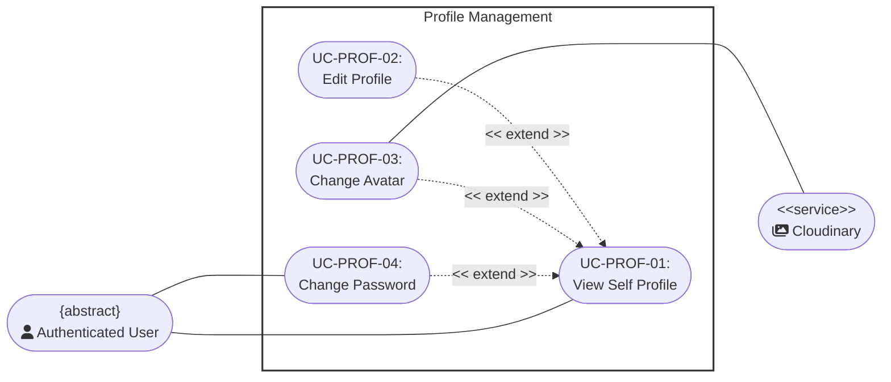

---

### UC-PROF-01: View Self Profile

<table width="100%" border="1" cellpadding="8" cellspacing="0" style="border-collapse: collapse; font-family: Arial, sans-serif; font-size: 14px; border: 1px solid #d1d5db; margin-bottom: 20px;">
  <thead>
    <tr style="background-color: #1e3a8a; color: #ffffff;">
      <th colspan="2" style="text-align: left; padding: 12px; font-size: 16px;">
        Use Case: View Self Profile
      </th>
    </tr>
  </thead>
  <tbody>
    <tr>
      <td width="22%" style="background-color: #f8fafc; font-weight: bold; vertical-align: top;">Use Case ID</td>
      <td style="vertical-align: top;"><strong>UC-PROF-01</strong></td>
    </tr>
    <tr>
      <td style="background-color: #f8fafc; font-weight: bold; vertical-align: top;">Brief Description</td>
      <td style="vertical-align: top;">
        Allows an authenticated user to view their personal profile page dashboard, showcasing their account metadata, current avatar, and personal details.
         <em>(Includes / Extends: <strong>Extended by Edit Profile and Change Avatar (at Step 5).</strong>)</em>
      </td>
    </tr>
    <tr>
      <td style="background-color: #f8fafc; font-weight: bold; vertical-align: top;">Actor(s)</td>
      <td style="vertical-align: top;">Authenticated User</td>
    </tr>
    <tr>
      <td style="background-color: #f8fafc; font-weight: bold; vertical-align: top;">Preconditions</td>
      <td style="vertical-align: top;">
        <ul style="margin: 0; padding-left: 20px; line-height: 1.5;">
          <li><strong>Verified Authentication State:</strong> The user has successfully authenticated and holds an active session token.</li>
          <li><strong>Workspace Navigation Focus:</strong> The user has navigated to the account settings layout area.</li>
        </ul>
      </td>
    </tr>
    <tr>
      <td style="background-color: #f8fafc; font-weight: bold; vertical-align: top;">Flow of Events (Basic Flow)</td>
      <td style="vertical-align: top;">
        <ol style="margin: 0; padding-left: 20px; line-height: 1.6;">
          <li><strong>[Actor Action]:</strong> The user clicks on the "My Profile" item link within the primary navigation menu layout.</li>
          <li><strong>[Data Processing]:</strong> The system fetches the corresponding profile record metrics from the user database partition.</li>
          <li><strong>[Display Result]:</strong> The system maps and populates user data fields (Display Name, Account Email, Registration Date) into the view interface template.</li>
          <li><strong>[Display Result]:</strong> The system requests the active profile image thumbnail link to render the user's avatar image block.</li>
          <li><strong>[System Response]:</strong> The system exposes extension interface interaction triggers ("Edit Profile" and "Change Avatar" button widgets).</li>
        </ol>
      </td>
    </tr>
    <tr>
      <td style="background-color: #f8fafc; font-weight: bold; vertical-align: top;">Alternative / Exception Flows</td>
      <td style="vertical-align: top;">
        <ul style="margin: 0; padding-left: 20px; line-height: 1.5;">
          <li style="margin-bottom: 8px;">
            <strong>Database Partition Retrieval Failure (Step 2):</strong> If profile data records fail to resolve due to localized database connection drops:
            <ol style="margin-top: 4px; margin-bottom: 4px; padding-left: 20px;">
              <li>The system halts the dashboard layout compilation steps immediately.</li>
              <li>The system overlays a persistent error component banner layout: "Profile details are temporarily offline."</li>
            </ol>
            <strong>Postcondition (Alternative Flow):</strong> The screen display shows a structural retrieval error indicator; no empty form entry containers open.
          </li>
        </ul>
      </td>
    </tr>
    <tr>
      <td style="background-color: #f8fafc; font-weight: bold; vertical-align: top;">Postconditions</td>
      <td style="vertical-align: top;">
        <ul style="margin: 0; padding-left: 20px;">
          <li><strong>Dashboard UI Component Staging:</strong> The user's complete private profile view profile template renders securely onto the client interface screen.</li>
        </ul>
      </td>
    </tr>
    <tr>
      <td style="background-color: #f8fafc; font-weight: bold; vertical-align: top;">Special Requirements</td>
      <td style="vertical-align: top;">
        <ul style="margin: 0; padding-left: 20px;">
          <li><strong>Sensitive Session Token Masking:</strong> The profile dashboard viewport screen must obscure highly sensitive configuration values (such as underlying token identifiers) from plain view elements.</li>
        </ul>
      </td>
    </tr>
    <tr>
      <td style="background-color: #f8fafc; font-weight: bold; vertical-align: top;">Extension Points</td>
      <td style="vertical-align: top;">
        <ul style="margin: 0; padding-left: 20px;">
          <li><strong>Edit Profile:</strong> Location inside event flow: Exposing extension interface triggers (Step 5).</li>
          <li><strong>Change Avatar:</strong> Location inside event flow: Exposing extension interface triggers (Step 5).</li>
        </ul>
      </td>
    </tr>
    <tr>
      <td style="background-color: #f8fafc; font-weight: bold; vertical-align: top;">Prototype Screen</td>
      <td style="vertical-align: top;">
        

        
<em>Figure P-PROF-01-BF01 – View Profile</em>

        

        
<em>Figure P-PROF-01-AF01 – Profile Unavailable</em>

      </td>
    </tr>
  </tbody>
</table>

---

### UC-PROF-02: Edit Profile

<table width="100%" border="1" cellpadding="8" cellspacing="0" style="border-collapse: collapse; font-family: Arial, sans-serif; font-size: 14px; border: 1px solid #d1d5db; margin-bottom: 20px;">
  <thead>
    <tr style="background-color: #1e3a8a; color: #ffffff;">
      <th colspan="2" style="text-align: left; padding: 12px; font-size: 16px;">
        Use Case: Edit Profile
      </th>
    </tr>
  </thead>
  <tbody>
    <tr>
      <td width="22%" style="background-color: #f8fafc; font-weight: bold; vertical-align: top;">Use Case ID</td>
      <td style="vertical-align: top;"><strong>UC-PROF-02</strong></td>
    </tr>
    <tr>
      <td style="background-color: #f8fafc; font-weight: bold; vertical-align: top;">Brief Description</td>
      <td style="vertical-align: top;">
        Extends the basic profile view dashboard by converting plain-text data fields into dynamic, editable input forms to let users update their personal details.
         <em>(Includes / Extends: <strong>Extends UC-PROF-01 (View Self Profile) — extension point: User triggers the active "Edit Profile" control button link within the profile dashboard view layout.</strong>)</em>
      </td>
    </tr>
    <tr>
      <td style="background-color: #f8fafc; font-weight: bold; vertical-align: top;">Actor(s)</td>
      <td style="vertical-align: top;">Authenticated User</td>
    </tr>
    <tr>
      <td style="background-color: #f8fafc; font-weight: bold; vertical-align: top;">Preconditions</td>
      <td style="vertical-align: top;">
        <ul style="margin: 0; padding-left: 20px; line-height: 1.5;">
          <li><strong>Active Base Context Display:</strong> The base use case `View Self Profile (UC-PROF-01)` must be currently active and rendering data on screen.</li>
        </ul>
      </td>
    </tr>
    <tr>
      <td style="background-color: #f8fafc; font-weight: bold; vertical-align: top;">Flow of Events (Basic Flow)</td>
      <td style="vertical-align: top;">
        <ol style="margin: 0; padding-left: 20px; line-height: 1.6;">
          <li><strong>[Actor Action]:</strong> The user clicks the "Edit Profile" action button component widget.</li>
          <li><strong>[System Response]:</strong> The system toggles the dashboard interface layout state variables, swapping static display texts for live text input boxes.</li>
          <li><strong>[Actor Action]:</strong> The user modifies targeted data entry string values (e.g., changes their Display Name or Bio summary details).</li>
          <li><strong>[Actor Action]:</strong> The user clicks the "Save Changes" configuration submit button.</li>
          <li><strong>[Data Processing]:</strong> The system parses inputs, sanitizes string objects, and executes a database update sequence transaction against the target user data row columns.</li>
          <li><strong>[Display Result]:</strong> The system switches the view screen state criteria back to the standard text-display layout mode and surfaces a brief confirmation success toast banner notice.</li>
        </ol>
      </td>
    </tr>
    <tr>
      <td style="background-color: #f8fafc; font-weight: bold; vertical-align: top;">Alternative / Exception Flows</td>
      <td style="vertical-align: top;">
        <ul style="margin: 0; padding-left: 20px; line-height: 1.5;">
          <li style="margin-bottom: 8px;">
            <strong>Lexical Parsing Constraints Rejection (Step 5):</strong> If input text parsing rules flag validation constraint breakages (e.g. illegal structural characters in name elements):
            <ol style="margin-top: 4px; margin-bottom: 4px; padding-left: 20px;">
              <li>The system prevents data persistence steps.</li>
              <li>The system returns visual focus to the problem field element and displays explicit inline error tips.</li>
            </ol>
            <strong>Postcondition (Alternative Flow):</strong> Database table values remain locked to historical state values; the input edit layout remains active pending string correction actions.
          </li>
        </ul>
      </td>
    </tr>
    <tr>
      <td style="background-color: #f8fafc; font-weight: bold; vertical-align: top;">Postconditions</td>
      <td style="vertical-align: top;">
        <ul style="margin: 0; padding-left: 20px;">
          <li><strong>Global Variable Synchronization:</strong> Revised personal metadata values write securely to production databases and update globally across active user session viewports.</li>
        </ul>
      </td>
    </tr>
    <tr>
      <td style="background-color: #f8fafc; font-weight: bold; vertical-align: top;">Special Requirements</td>
      <td style="vertical-align: top;">
        None
      </td>
    </tr>
    <tr>
      <td style="background-color: #f8fafc; font-weight: bold; vertical-align: top;">Extension Points</td>
      <td style="vertical-align: top;">
        None
      </td>
    </tr>
    <tr>
      <td style="background-color: #f8fafc; font-weight: bold; vertical-align: top;">Prototype Screen</td>
      <td style="vertical-align: top;">
        

        
<em>Figure P-PROF-01-BF01 – View Profile (reused as the profile editing entry screen)</em>

        

        
<em>Figure P-PROF-02-AF01 – Invalid Profile Information</em>

      </td>
    </tr>
  </tbody>
</table>

---

### UC-PROF-03: Change Avatar

<table width="100%" border="1" cellpadding="8" cellspacing="0" style="border-collapse: collapse; font-family: Arial, sans-serif; font-size: 14px; border: 1px solid #d1d5db; margin-bottom: 20px;">
  <thead>
    <tr style="background-color: #1e3a8a; color: #ffffff;">
      <th colspan="2" style="text-align: left; padding: 12px; font-size: 16px;">
        Use Case: Change Avatar
      </th>
    </tr>
  </thead>
  <tbody>
    <tr>
      <td width="22%" style="background-color: #f8fafc; font-weight: bold; vertical-align: top;">Use Case ID</td>
      <td style="vertical-align: top;"><strong>UC-PROF-03</strong></td>
    </tr>
    <tr>
      <td style="background-color: #f8fafc; font-weight: bold; vertical-align: top;">Brief Description</td>
      <td style="vertical-align: top;">
        Extends the base profile display context to allow users to upload, process, and attach a customized picture graphic to act as their system identity avatar icon.
         <em>(Includes / Extends: <strong>Extends UC-PROF-01 (View Self Profile) — extension point: User selects the profile picture thumbnail element or clicks the "Change Avatar" button action link.</strong>)</em>
      </td>
    </tr>
    <tr>
      <td style="background-color: #f8fafc; font-weight: bold; vertical-align: top;">Actor(s)</td>
      <td style="vertical-align: top;">Authenticated User</td>
    </tr>
    <tr>
      <td style="background-color: #f8fafc; font-weight: bold; vertical-align: top;">Preconditions</td>
      <td style="vertical-align: top;">
        <ul style="margin: 0; padding-left: 20px; line-height: 1.5;">
          <li><strong>Parent Workspace Alignment:</strong> The user is currently interacting with the visual dashboard space inside `UC-PROF-01`.</li>
        </ul>
      </td>
    </tr>
    <tr>
      <td style="background-color: #f8fafc; font-weight: bold; vertical-align: top;">Flow of Events (Basic Flow)</td>
      <td style="vertical-align: top;">
        <ol style="margin: 0; padding-left: 20px; line-height: 1.6;">
          <li><strong>[Actor Action]:</strong> The user clicks on the "Change Avatar" image editing control button widget.</li>
          <li><strong>[System Response]:</strong> The system triggers a local device filesystem upload dialogue wrapper window prompt.</li>
          <li><strong>[Actor Action]:</strong> The user selects a target image file object and approves submission steps.</li>
          <li><strong>[Data Processing]:</strong> The system validates the asset metadata properties client-side to verify file configuration boundaries match structural rules.</li>
          <li><strong>[Data Processing]:</strong> The system establishes an API communication uplink tunnel to stream the binary image payload object directly out to the external secondary <strong>Storage Service</strong>.</li>
          <li><strong>[Data Processing]:</strong> The <strong>Storage Service</strong> buffers the upload stream, saves the graphic file inside optimized media asset buckets, and passes a unique public reference image URL string parameter back down to the application server.</li>
          <li><strong>[Data Processing]:</strong> The system updates the user's base record rows inside the database, mapping the <code>avatar_url</code> coordinate pointer value to the fresh link string.</li>
          <li><strong>[Display Result]:</strong> The system refreshes image element sources on screen to display the updated profile avatar graphic asset instantly.</li>
        </ol>
      </td>
    </tr>
    <tr>
      <td style="background-color: #f8fafc; font-weight: bold; vertical-align: top;">Alternative / Exception Flows</td>
      <td style="vertical-align: top;">
        <ul style="margin: 0; padding-left: 20px; line-height: 1.5;">
          <li style="margin-bottom: 8px;">
            <strong>File Volume Size Exception (Step 4):</strong> If the selected graphic object file passes boundary parameters for maximum size limits (e.g., file sizes exceed 5MB benchmarks):
            <ol style="margin-top: 4px; margin-bottom: 4px; padding-left: 20px;">
              <li>The system halts processing loops immediately.</li>
              <li>The system alerts users via popup text blocks: "File exceeds maximum size limits."</li>
            </ol>
            <strong>Postcondition (Alternative Flow):</strong> Network payloads are blocked from firing; user profile configuration records undergo zero status value changes.
          </li>
          <li style="margin-bottom: 8px;">
            <strong>Invalid MIME Asset Format (Step 4):</strong> If the file parsing script flags unacceptable format MIME types (e.g., user uploads raw text documents instead of JPEG/PNG engines):
            <ol style="margin-top: 4px; margin-bottom: 4px; padding-left: 20px;">
              <li>The system blocks transfer tasks completely.</li>
              <li>The system prints operational warning instructions to the client panel interface.</li>
            </ol>
            <strong>Postcondition (Alternative Flow):</strong> The system drops data components instantly; upload form workspaces reset back to baseline resting defaults.
          </li>
          <li style="margin-bottom: 8px;">
            <strong>Storage Pipeline Outage Timeout (Step 6):</strong> If the connection interface endpoint linking application nodes to the external Storage Service encounters latency drops or timeouts:
            <ol style="margin-top: 4px; margin-bottom: 4px; padding-left: 20px;">
              <li>The system drops active transaction staging states.</li>
              <li>The system clears target memory buffer pools and fires an application interface error notice.</li>
            </ol>
            <strong>Postcondition (Alternative Flow):</strong> Media record rows within system database tables maintain original data entries; image displays roll back parameters to current images.
          </li>
        </ul>
      </td>
    </tr>
    <tr>
      <td style="background-color: #f8fafc; font-weight: bold; vertical-align: top;">Postconditions</td>
      <td style="vertical-align: top;">
        <ul style="margin: 0; padding-left: 20px;">
          <li><strong>Cloud Asset Mapping Commitment:</strong> Old media file references drop, target accounts link securely to new cloud image URLs, and graphics update across application headers.</li>
        </ul>
      </td>
    </tr>
    <tr>
      <td style="background-color: #f8fafc; font-weight: bold; vertical-align: top;">Special Requirements</td>
      <td style="vertical-align: top;">
        <ul style="margin: 0; padding-left: 20px;">
          <li><strong>Asynchronous Image Compressing Rules:</strong> Upload pipelines must run optimized image compressing scripts asynchronously to crop, square, and scale uploaded source files down to standardized thumbnail dimensions before cloud transmission steps.</li>
        </ul>
      </td>
    </tr>
    <tr>
      <td style="background-color: #f8fafc; font-weight: bold; vertical-align: top;">Extension Points</td>
      <td style="vertical-align: top;">
        None
      </td>
    </tr>
    <tr>
      <td style="background-color: #f8fafc; font-weight: bold; vertical-align: top;">Prototype Screen</td>
      <td style="vertical-align: top;">
        

        
<em>Figure P-PROF-03-BF01 – Crop Avatar</em>

         
        

        
<em>Figure P-PROF-03-BF02 – Avatar Updated</em>

        

        
<em>Figure P-PROF-03-AF01 – File Too Large</em>

      </td>
    </tr>
  </tbody>
</table>

---

### UC-PROF-04: Change Password

<table width="100%" border="1" cellpadding="8" cellspacing="0" style="border-collapse: collapse; font-family: Arial, sans-serif; font-size: 14px; border: 1px solid #d1d5db; margin-bottom: 20px;">
  <thead>
    <tr style="background-color: #1e3a8a; color: #ffffff;">
      <th colspan="2" style="text-align: left; padding: 12px; font-size: 16px;">
        Use Case: Change Password
      </th>
    </tr>
  </thead>
  <tbody>
    <tr>
      <td width="22%" style="background-color: #f8fafc; font-weight: bold; vertical-align: top;">Use Case ID</td>
      <td style="vertical-align: top;"><strong>UC-PROF-04</strong></td>
    </tr>
    <tr>
      <td style="background-color: #f8fafc; font-weight: bold; vertical-align: top;">Brief Description</td>
      <td style="vertical-align: top;">
        Enables an Authenticated User to verify the current password and replace it with a new password.
      </td>
    </tr>
    <tr>
      <td style="background-color: #f8fafc; font-weight: bold; vertical-align: top;">Actor(s)</td>
      <td style="vertical-align: top;">Authenticated User</td>
    </tr>
    <tr>
      <td style="background-color: #f8fafc; font-weight: bold; vertical-align: top;">Preconditions</td>
      <td style="vertical-align: top;">
        <ul style="margin: 0; padding-left: 20px; line-height: 1.5;">
          <li><strong>Validated Configuration Entry Path:</strong> The user maintains verified access status parameters and has loaded the security configurations panel menu space.</li>
        </ul>
      </td>
    </tr>
    <tr>
      <td style="background-color: #f8fafc; font-weight: bold; vertical-align: top;">Flow of Events (Basic Flow)</td>
      <td style="vertical-align: top;">
        <ol style="margin: 0; padding-left: 20px; line-height: 1.6;">
          <li><strong>[Actor Action]:</strong> The user clicks the "Update Account Password" interaction panel control option.</li>
          <li><strong>[System Response]:</strong> The system generates a credential editing secure form layout showcasing input boxes labeled "Current Password", "New Password", and "Confirm New Password".</li>
          <li><strong>[Actor Action]:</strong> The user inputs their current secret key string along with a fresh replacement passphrase combination variant and triggers submission.</li>
          <li><strong>[Data Processing]:</strong> The system securely hashes the input "Current Password" to perform matching comparisons against verification strings recorded inside account user database table indices.</li>
          <li><strong>[Data Processing]:</strong> The system confirms credential accuracy, validates that the "New Password" string satisfies length and complexity parameter algorithms, and checks that both confirmation entries match exactly.</li>
          <li><strong>[Data Processing]:</strong> The system passes the new password text string through structural hashing algorithms, creating a unique replacement secure credential string object.</li>
          <li><strong>[Data Processing]:</strong> The system overrides database user authentication columns with the newly compiled hash values model.</li>
          <li><strong>[Display Result]:</strong> The system renders a transaction complete validation message layout panel block and automatically log-purges other active stale cross-device cookie sessions for safety.</li>
        </ol>
      </td>
    </tr>
    <tr>
      <td style="background-color: #f8fafc; font-weight: bold; vertical-align: top;">Alternative / Exception Flows</td>
      <td style="vertical-align: top;">
        <ul style="margin: 0; padding-left: 20px; line-height: 1.5;">
          <li style="margin-bottom: 8px;">
            <strong>Core Signature Verification Defect (Step 4):</strong> If the validation evaluation proves the entered "Current Password" value fails signature matching metrics:
            <ol style="margin-top: 4px; margin-bottom: 4px; padding-left: 20px;">
              <li>The system stops processing immediately and blocks database update transactions.</li>
              <li>The system returns an error notice banner: "The current password entered is incorrect."</li>
            </ol>
            <strong>Postcondition (Alternative Flow):</strong> Security tracking values count a configuration error instance; baseline account authentication records remain unchanged.
          </li>
          <li style="margin-bottom: 8px;">
            <strong>Density Metrics Criteria Violation (Step 5):</strong> If the new replacement passphrase choice does not meet password density criteria benchmarks:
            <ol style="margin-top: 4px; margin-bottom: 4px; padding-left: 20px;">
              <li>The system refuses form submissions.</li>
              <li>The system underlines broken constraint text rules explicitly below the formatting inputs.</li>
            </ol>
            <strong>Postcondition (Alternative Flow):</strong> Form view panels lock values in place; internal system tables reject any modification updates.
          </li>
          <li style="margin-bottom: 8px;">
            <strong>Prompt Field Input Discrepancy (Step 5):</strong> If the confirmation entry box input differs from the target characters mapped inside the first password initialization prompt field:
            <ol style="margin-top: 4px; margin-bottom: 4px; padding-left: 20px;">
              <li>The system blocks submission pipelines.</li>
              <li>The system prompts the user with warning text indicating: "New password fields do not match."</li>
            </ol>
            <strong>Postcondition (Alternative Flow):</strong> Authentication databases cancel commitment actions; interface layouts await fresh confirmation re-entry typings.
          </li>
        </ul>
      </td>
    </tr>
    <tr>
      <td style="background-color: #f8fafc; font-weight: bold; vertical-align: top;">Postconditions</td>
      <td style="vertical-align: top;">
        <ul style="margin: 0; padding-left: 20px;">
          <li><strong>Production Verification Update:</strong> Core account verification criteria fields update fully within production data layers, forcing all subsequent device sign-in events to map to the fresh secret key strings.</li>
        </ul>
      </td>
    </tr>
    <tr>
      <td style="background-color: #f8fafc; font-weight: bold; vertical-align: top;">Special Requirements</td>
      <td style="vertical-align: top;">
        <ul style="margin: 0; padding-left: 20px;">
          <li><strong>Interface Visibility Masking:</strong> Entry placeholder forms must enforce hidden masking states (`type="password"`) on client interfaces to fully block shoulder-surfing security vulnerabilities.</li>
        </ul>
      </td>
    </tr>
    <tr>
      <td style="background-color: #f8fafc; font-weight: bold; vertical-align: top;">Extension Points</td>
      <td style="vertical-align: top;">
        None
      </td>
    </tr>
    <tr>
      <td style="background-color: #f8fafc; font-weight: bold; vertical-align: top;">Prototype Screen</td>
      <td style="vertical-align: top;">
        

        
<em>Figure P-PROF-04-BF01 – Change Password Form</em>

        

        
<em>Figure P-PROF-04-AF01 – Current Password Incorrect</em>

        

        
<em>Figure P-PROF-04-AF02 – Password Requirements Not Met</em>

        

        
<em>Figure P-PROF-04-AF03 – Passwords Do Not Match</em>

      </td>
    </tr>
  </tbody>
</table>

## IV. Books Exploration & Interaction

### Use case diagram

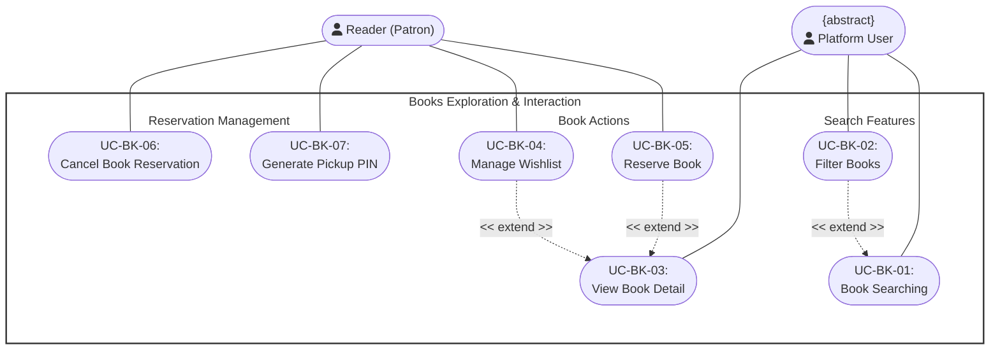

---

### UC-BK-01: Book Searching

<table width="100%" border="1" cellpadding="8" cellspacing="0" style="border-collapse: collapse; font-family: Arial, sans-serif; font-size: 14px; border: 1px solid #d1d5db; margin-bottom: 20px;">
  <thead>
    <tr style="background-color: #1e3a8a; color: #ffffff;">
      <th colspan="2" style="text-align: left; padding: 12px; font-size: 16px;">
        Use Case: Book Searching
      </th>
    </tr>
  </thead>
  <tbody>
    <tr>
      <td width="22%" style="background-color: #f8fafc; font-weight: bold; vertical-align: top;">Use Case ID</td>
      <td style="vertical-align: top;"><strong>UC-BK-01</strong></td>
    </tr>
    <tr>
      <td style="background-color: #f8fafc; font-weight: bold; vertical-align: top;">Brief Description</td>
      <td style="vertical-align: top;">
        Allows any platform user to search the catalog. The backend runs text and semantic retrieval in parallel, merges the ranked results, and applies the selected catalog filters.
         <em>(Includes / Extends: <strong>Extended by UC-BK-02 (Filter Books).</strong>)</em>
      </td>
    </tr>
    <tr>
      <td style="background-color: #f8fafc; font-weight: bold; vertical-align: top;">Actor(s)</td>
      <td style="vertical-align: top;">Platform User</td>
    </tr>
    <tr>
      <td style="background-color: #f8fafc; font-weight: bold; vertical-align: top;">Preconditions</td>
      <td style="vertical-align: top;">
        <ul style="margin: 0; padding-left: 20px; line-height: 1.5;">
          <li><strong>UI Location Context:</strong> The user has navigated to the catalog query dashboard interface.</li>
          <li><strong>Core Subsystem Verification:</strong> The book relational database index and specialized vector storage AI model database module are active and online.</li>
        </ul>
      </td>
    </tr>
    <tr>
      <td style="background-color: #f8fafc; font-weight: bold; vertical-align: top;">Flow of Events (Basic Flow)</td>
      <td style="vertical-align: top;">
        <ol style="margin: 0; padding-left: 20px; line-height: 1.6;">
          <li><strong>[Actor Action]:</strong> The user accesses the primary catalog search interface view.</li>
          <li><strong>[System Response]:</strong> The system displays one search field and the available metadata filters.</li>
          <li><strong>[Actor Action]:</strong> <em>Optional:</em> The user selects catalog filters such as category or availability.</li>
          <li><strong>[Actor Action]:</strong> The user types their query string into the search input box. (The background typo-tolerance layer dynamically monitors input parameters for character permutations).</li>
          <li><strong>[Actor Action]:</strong> The user executes the query by pressing the <code>Enter</code> key on their keyboard or clicking the search icon button widget.</li>
          <li><strong>[Data Processing]:</strong> The system runs text and semantic retrieval in parallel and merges their ranked results.</li>
          <li><strong>[Data Processing]:</strong> For an authenticated Reader and an explicit search submission, the system records the search history; public browsing is not attributed to a user.</li>
          <li><strong>[Data Processing]:</strong> The system applies any active metadata filter constraint parameters to strip disqualified records out of the resulting query dataset match array.</li>
          <li><strong>[Display Result]:</strong> The system displays the final ranked, filtered list layout array of matching book cards (cover image, title, author, genre) onto the viewport panel.</li>
          <li><strong>[Actor Action]:</strong> The user may scroll through the results and optionally choose to save a specific book directly to their wishlist.</li>
        </ol>
      </td>
    </tr>
    <tr>
      <td style="background-color: #f8fafc; font-weight: bold; vertical-align: top;">Alternative / Exception Flows</td>
      <td style="vertical-align: top;">
        <ul style="margin: 0; padding-left: 20px; line-height: 1.5;">
          <li style="margin-bottom: 8px;">
            <strong>Search History Logging Failure (Step 7):</strong> If the search history database logging pipeline encounters an error or timeout:
            <ol style="margin-top: 4px; margin-bottom: 4px; padding-left: 20px;">
              <li>The system catches the write exception silently.</li>
              <li>The system logs it within internal application diagnostic error frameworks.</li>
              <li>The system bypasses the historical logging block directly and resumes execution at Step 8 to prevent disrupting the user search lifecycle experience.</li>
            </ol>
            <strong>Postcondition (Alternative Flow):</strong> Search results render normally on the interface viewport layer, but the specific search instance context is omitted from historical user logs.
          </li>
          <li style="margin-bottom: 8px;">
            <strong>Zero Catalog Matches (Step 8):</strong> If the system identifies zero exact, partial, fuzzy, or semantic catalog matches:
            <ol style="margin-top: 4px; margin-bottom: 4px; padding-left: 20px;">
              <li>The system interrupts standard rendering and outputs an empty panel state layout.</li>
            </ol>
            <strong>Postcondition (Alternative Flow):</strong> A zero-match notification prompt window appears on-screen alongside generic default popular listings. Alternate permutations may drop back to standard keyword text match structural summaries (logging an infrastructure error notice behind the scenes) or push cached historical index layers directly into viewport screens with warning alerts flashed.
          </li>
        </ul>
      </td>
    </tr>
    <tr>
      <td style="background-color: #f8fafc; font-weight: bold; vertical-align: top;">Postconditions</td>
      <td style="vertical-align: top;">
        <ul style="margin: 0; padding-left: 20px;">
          <li><strong>Workspace Population:</strong> The relevant search query matches successfully populate the active layout window on screen.</li>
          <li><strong>Conditional History:</strong> Search history is recorded only for an authenticated Reader when history logging is requested.</li>
        </ul>
      </td>
    </tr>
    <tr>
      <td style="background-color: #f8fafc; font-weight: bold; vertical-align: top;">Special Requirements</td>
      <td style="vertical-align: top;">
        <ul style="margin: 0; padding-left: 20px;">
          <li><strong>Performance SLA Boundaries:</strong> Standard keyword lookup database queries must complete rendering cycles within 1.5 seconds; semantic vector model matching operations must execute under a 3.0-second performance limit window.</li>
          <li><strong>Dynamic Typo Tolerance:</strong> The background fuzzy logic typo-tolerance algorithm must dynamically resolve single/double character transpositions or common character substitutions without creating measurable lookup degradation.</li>
          <li><strong>String Sanitization Injection Guards:</strong> Wildcard processing expressions must pass through string cookies sanitization parameters to fully block malicious SQL pattern injection vectors.</li>
          <li><strong>Non-Blocking Thread Execution:</strong> Search history database insertion commands must be non-blocking and execute strictly on background threads to ensure the UI interface main rendering loop remains highly responsive.</li>
        </ul>
      </td>
    </tr>
    <tr>
      <td style="background-color: #f8fafc; font-weight: bold; vertical-align: top;">Extension Points</td>
      <td style="vertical-align: top;">
        None
      </td>
    </tr>
    <tr>
      <td style="background-color: #f8fafc; font-weight: bold; vertical-align: top;">Prototype Screen</td>
      <td style="vertical-align: top;">
        

        
<em>Figure P-BK-01-BF01 – Search Results</em>

        

        
<em>Figure P-BK-01-AF01 – No Search Results</em>

      </td>
    </tr>
  </tbody>
</table>

---

### UC-BK-02: Filter Books

<table width="100%" border="1" cellpadding="8" cellspacing="0" style="border-collapse: collapse; font-family: Arial, sans-serif; font-size: 14px; border: 1px solid #d1d5db; margin-bottom: 20px;">
  <thead>
    <tr style="background-color: #1e3a8a; color: #ffffff;">
      <th colspan="2" style="text-align: left; padding: 12px; font-size: 16px;">
        Use Case: Filter Books
      </th>
    </tr>
  </thead>
  <tbody>
    <tr>
      <td width="22%" style="background-color: #f8fafc; font-weight: bold; vertical-align: top;">Use Case ID</td>
      <td style="vertical-align: top;"><strong>UC-BK-02</strong></td>
    </tr>
    <tr>
      <td style="background-color: #f8fafc; font-weight: bold; vertical-align: top;">Brief Description</td>
      <td style="vertical-align: top;">
        Enables the granular filtering of active displayed collections by parameters such as availability status, structural categories, languages, or publication eras.
      </td>
    </tr>
    <tr>
      <td style="background-color: #f8fafc; font-weight: bold; vertical-align: top;">Actor(s)</td>
      <td style="vertical-align: top;">Platform User</td>
    </tr>
    <tr>
      <td style="background-color: #f8fafc; font-weight: bold; vertical-align: top;">Preconditions</td>
      <td style="vertical-align: top;">
        <ul style="margin: 0; padding-left: 20px; line-height: 1.5;">
          <li><strong>Populated Dataset Context:</strong> An active population list of catalog items is rendered inside the view browser pane area.</li>
        </ul>
      </td>
    </tr>
    <tr>
      <td style="background-color: #f8fafc; font-weight: bold; vertical-align: top;">Flow of Events (Basic Flow)</td>
      <td style="vertical-align: top;">
        <ol style="margin: 0; padding-left: 20px; line-height: 1.6;">
          <li><strong>[Actor Action]:</strong> The user opens the filter settings sidebar control interface module panel.</li>
          <li><strong>[System Response]:</strong> The system shows checkboxes representing system metadata filter categories.</li>
          <li><strong>[Actor Action]:</strong> The user sets multiple overlapping constraint toggle checks.</li>
          <li><strong>[Data Processing]:</strong> The system dynamically updates the query arrays to crop records failing check matches.</li>
          <li><strong>[Display Result]:</strong> The system strips disqualified cards out of view without forcing complete browser workspace reloads.</li>
        </ol>
      </td>
    </tr>
    <tr>
      <td style="background-color: #f8fafc; font-weight: bold; vertical-align: top;">Alternative / Exception Flows</td>
      <td style="vertical-align: top;">
        <ul style="margin: 0; padding-left: 20px; line-height: 1.5;">
          <li style="margin-bottom: 8px;">
            <strong>Overfiltering Outcome (Step 4):</strong> If overfiltering occurs, yielding zero matching index properties:
            <ol style="margin-top: 4px; margin-bottom: 4px; padding-left: 20px;">
              <li>The system presents an active "Reset All Applied Filters" UI component widget inside an explicit helper panel layout block.</li>
            </ol>
            <strong>Postcondition (Alternative Flow):</strong> A null results screen layout element displays along with active reset interaction shortcuts.
          </li>
        </ul>
      </td>
    </tr>
    <tr>
      <td style="background-color: #f8fafc; font-weight: bold; vertical-align: top;">Postconditions</td>
      <td style="vertical-align: top;">
        <ul style="margin: 0; padding-left: 20px;">
          <li><strong>Grid Alignment State:</strong> Active browse window lists map exactly to all applied parameter limit criteria states.</li>
        </ul>
      </td>
    </tr>
    <tr>
      <td style="background-color: #f8fafc; font-weight: bold; vertical-align: top;">Special Requirements</td>
      <td style="vertical-align: top;">
        <ul style="margin: 0; padding-left: 20px;">
          <li><strong>Asynchronous Adjustments:</strong> Filter matrix indexing state checks must be applied asynchronously to guarantee zero-latency listing adjustments.</li>
        </ul>
      </td>
    </tr>
    <tr>
      <td style="background-color: #f8fafc; font-weight: bold; vertical-align: top;">Extension Points</td>
      <td style="vertical-align: top;">
        None
      </td>
    </tr>
    <tr>
      <td style="background-color: #f8fafc; font-weight: bold; vertical-align: top;">Prototype Screen</td>
      <td style="vertical-align: top;">
        

        
<em>Figure P-BK-02-BF01 – Book Filters</em>

        

        
<em>Figure P-BK-02-AF01 – No Filter Results</em>

      </td>
    </tr>
  </tbody>
</table>

---

### UC-BK-03: View Book Detail

<table width="100%" border="1" cellpadding="8" cellspacing="0" style="border-collapse: collapse; font-family: Arial, sans-serif; font-size: 14px; border: 1px solid #d1d5db; margin-bottom: 20px;">
  <thead>
    <tr style="background-color: #1e3a8a; color: #ffffff;">
      <th colspan="2" style="text-align: left; padding: 12px; font-size: 16px;">
        Use Case: View Book Detail
      </th>
    </tr>
  </thead>
  <tbody>
    <tr>
      <td width="22%" style="background-color: #f8fafc; font-weight: bold; vertical-align: top;">Use Case ID</td>
      <td style="vertical-align: top;"><strong>UC-BK-03</strong></td>
    </tr>
    <tr>
      <td style="background-color: #f8fafc; font-weight: bold; vertical-align: top;">Brief Description</td>
      <td style="vertical-align: top;">
        Displays a book's catalog metadata, current inventory and related books, and exposes Reader-only wishlist and reservation actions.
         <em>(Includes / Extends: <strong>Extended by UC-BK-04 (Manage Wishlist) and UC-BK-05 (Reserve Book).</strong>)</em>
      </td>
    </tr>
    <tr>
      <td style="background-color: #f8fafc; font-weight: bold; vertical-align: top;">Actor(s)</td>
      <td style="vertical-align: top;">Platform User</td>
    </tr>
    <tr>
      <td style="background-color: #f8fafc; font-weight: bold; vertical-align: top;">Preconditions</td>
      <td style="vertical-align: top;">
        <ul style="margin: 0; padding-left: 20px; line-height: 1.5;">
          <li><strong>Visual Target Anchor:</strong> A targeted book item component, link anchor text, or search result card is rendered on the user's active screen layout.</li>
        </ul>
      </td>
    </tr>
    <tr>
      <td style="background-color: #f8fafc; font-weight: bold; vertical-align: top;">Flow of Events (Basic Flow)</td>
      <td style="vertical-align: top;">
        <ol style="margin: 0; padding-left: 20px; line-height: 1.6;">
          <li><strong>[Actor Action]:</strong> The user clicks on a specific book cover visual image component or text link element anchor object from any display grid or search result array.</li>
          <li><strong>[System Response]:</strong> The system captures the event parameter and calls a background object retrieval query to fetch database records tied to the chosen unique identification string (`Book_ID`).</li>
          <li><strong>[Data Processing]:</strong> The system extracts the book's catalog metadata, including title, author, publisher, description, categories and image information.</li>
          <li><strong>[Data Processing]:</strong> The system requests live, real-time snapshot inventory balance summaries to calculate total copies owned versus active copies currently available for circulation.</li>
          <li><strong>[Data Processing]:</strong> The system queries the book catalog database to isolate up to 10 highly rated or trending books sharing matching genre classifications with the current target book.</li>
          <li><strong>[Display Result]:</strong> The system renders the metadata and inventory state in the book-detail view.</li>
          <li><strong>[Display Result]:</strong> The system populates a horizontal, swipeable "Related Books by Genre" carousel grid component at the terminal end of the page viewport layout.</li>
          <li><strong>[System Response]:</strong> All platform users can view the details and related books; an authenticated Reader can additionally manage the wishlist or reserve the book.</li>
          <li><strong>[Actor Action]:</strong> The user reviews the details and can scroll through the carousel, click a related book to transition views, or click an interaction button to trigger a secondary workflow.</li>
        </ol>
      </td>
    </tr>
    <tr>
      <td style="background-color: #f8fafc; font-weight: bold; vertical-align: top;">Alternative / Exception Flows</td>
      <td style="vertical-align: top;">
        <ul style="margin: 0; padding-left: 20px; line-height: 1.5;">
          <li style="margin-bottom: 8px;">
            <strong>Empty Genre Associations (Step 5):</strong> If no related books are found in the matching genre catalog data arrays:
            <ol style="margin-top: 4px; margin-bottom: 4px; padding-left: 20px;">
              <li>The system dynamically alters its query criteria to retrieve a list of random books instead.</li>
              <li>The workflow proceeds directly to Step 6 of the Basic Flow.</li>
            </ol>
          </li>
          <li style="margin-bottom: 8px;">
            <strong>Record Reference Corruption (Step 2):</strong> If the specific `Book_ID` string refers to a record that has been permanently purged or corrupted:
            <ol style="margin-top: 4px; margin-bottom: 4px; padding-left: 20px;">
              <li>The system aborts the page layout compilation script immediately.</li>
              <li>The system triggers a contextual toast notification modal warning window: "The selected book profile is currently unavailable."</li>
              <li>The system routes the user viewport cleanly backward to their previously active listing dashboard workspace.</li>
            </ol>
            <strong>Postcondition (Alternative Flow):</strong> No data attributes modify; the user workspace safely falls back to stable resting panels.
          </li>
        </ul>
      </td>
    </tr>
    <tr>
      <td style="background-color: #f8fafc; font-weight: bold; vertical-align: top;">Postconditions</td>
      <td style="vertical-align: top;">
        <ul style="margin: 0; padding-left: 20px;">
          <li><strong>Sheet Output Delivery:</strong> The requested book detail sheet successfully outputs to the client interface window.</li>
          <li><strong>Entry Node Accessibility:</strong> All relevant context-driven interactive entry paths (Wishlist/Reservation links) sit in a fully receptive, ready-to-click state.</li>
        </ul>
      </td>
    </tr>
    <tr>
      <td style="background-color: #f8fafc; font-weight: bold; vertical-align: top;">Special Requirements</td>
      <td style="vertical-align: top;">
        <ul style="margin: 0; padding-left: 20px;">
          <li><strong>Metadata Performance Thresholds:</strong> The primary page layout metadata elements (Title, Author, Inventory counts) must load within a maximum 1.0-second time ceiling; the lower related genre carousel asset pipeline can execute asynchronously to prevent locking the initial main frame rendering loop.</li>
        </ul>
      </td>
    </tr>
    <tr>
      <td style="background-color: #f8fafc; font-weight: bold; vertical-align: top;">Extension Points</td>
      <td style="vertical-align: top;">
        <ul style="margin: 0; padding-left: 20px;">
          <li><strong>Manage Wishlist:</strong> Available to a Reader from the book-detail view.</li>
          <li><strong>Reserve Book:</strong> Available to a Reader from the book-detail view.</li>
        </ul>
      </td>
    </tr>
    <tr>
      <td style="background-color: #f8fafc; font-weight: bold; vertical-align: top;">Prototype Screen</td>
      <td style="vertical-align: top;">
        

        
<em>Figure P-BK-03-BF01 – Book Details</em>

      </td>
    </tr>
  </tbody>
</table>

---

### UC-BK-04: Manage Wishlist

<table width="100%" border="1" cellpadding="8" cellspacing="0" style="border-collapse: collapse; font-family: Arial, sans-serif; font-size: 14px; border: 1px solid #d1d5db; margin-bottom: 20px;">
  <thead>
    <tr style="background-color: #1e3a8a; color: #ffffff;">
      <th colspan="2" style="text-align: left; padding: 12px; font-size: 16px;">
        Use Case: Manage Wishlist
      </th>
    </tr>
  </thead>
  <tbody>
    <tr>
      <td width="22%" style="background-color: #f8fafc; font-weight: bold; vertical-align: top;">Use Case ID</td>
      <td style="vertical-align: top;"><strong>UC-BK-04</strong></td>
    </tr>
    <tr>
      <td style="background-color: #f8fafc; font-weight: bold; vertical-align: top;">Brief Description</td>
      <td style="vertical-align: top;">
        Extends book details so a Reader can add or remove a book from their personal wishlist.
         <em>(Includes / Extends: <strong>Extends UC-BK-03 (View Book Detail) — extension point: Exposing action controls for authenticated users.</strong>)</em>
      </td>
    </tr>
    <tr>
      <td style="background-color: #f8fafc; font-weight: bold; vertical-align: top;">Actor(s)</td>
      <td style="vertical-align: top;">Reader</td>
    </tr>
    <tr>
      <td style="background-color: #f8fafc; font-weight: bold; vertical-align: top;">Preconditions</td>
      <td style="vertical-align: top;">
        <ul style="margin: 0; padding-left: 20px; line-height: 1.5;">
          <li><strong>Session Verification:</strong> The user account profile state checks match valid system authentication benchmarks.</li>
          <li><strong>Context Parameter:</strong> The user is actively executing active workspace viewing tasks inside `UC-BK-03`.</li>
        </ul>
      </td>
    </tr>
    <tr>
      <td style="background-color: #f8fafc; font-weight: bold; vertical-align: top;">Flow of Events (Basic Flow)</td>
      <td style="vertical-align: top;">
        <ol style="margin: 0; padding-left: 20px; line-height: 1.6;">
          <li><strong>[Actor Action]:</strong> The user initiates a request by clicking the Heart icon on the book details cover pane interface.</li>
          <li><strong>[Data Processing]:</strong> The system inserts the Reader–Book wishlist relationship in PostgreSQL and attempts to synchronize the preference edge to Memgraph.</li>
          <li><strong>[Display Result]:</strong> The system modifies the color of the icon component to red and fires a system status toast announcement to demonstrate successful data binding.</li>
          <li><strong>[Actor Action]:</strong> The user can later review the personal wishlist in their main wishlist dashboard space.</li>
        </ol>
      </td>
    </tr>
    <tr>
      <td style="background-color: #f8fafc; font-weight: bold; vertical-align: top;">Alternative / Exception Flows</td>
      <td style="vertical-align: top;">
        <ul style="margin: 0; padding-left: 20px; line-height: 1.5;">
          <li style="margin-bottom: 8px;">
            <strong>Asset Redundancy (Step 1):</strong> If the selected catalog asset identity string already resides inside active user favorites data arrays:
            <ol style="margin-top: 4px; margin-bottom: 4px; padding-left: 20px;">
              <li>The system registers the action as an intentional favorite deletion prompt.</li>
              <li>The system extracts the relationship string link row from database tables.</li>
              <li>The system clears the heart icon color highlight indicators back to default status configurations.</li>
            </ol>
            <strong>Postcondition (Alternative Flow):</strong> Association metrics delete cleanly; visual markers change status flags back to default baseline states.
          </li>
        </ul>
      </td>
    </tr>
    <tr>
      <td style="background-color: #f8fafc; font-weight: bold; vertical-align: top;">Postconditions</td>
      <td style="vertical-align: top;">
        <ul style="margin: 0; padding-left: 20px;">
          <li><strong>Structural Element UI Changes:</strong> The color of the heart icon turns red on the client side interface.</li>
          <li><strong>Storage Confirmation:</strong> Target catalog objects sit successfully inside user dashboard wishlist modules.</li>
        </ul>
      </td>
    </tr>
    <tr>
      <td style="background-color: #f8fafc; font-weight: bold; vertical-align: top;">Special Requirements</td>
      <td style="vertical-align: top;">
        <ul style="margin: 0; padding-left: 20px;">
          <li><strong>Real-Time Cross-Device Sync:</strong> Favorites list data synchronization configurations must update global account views across cross-device endpoints instantaneously.</li>
        </ul>
      </td>
    </tr>
    <tr>
      <td style="background-color: #f8fafc; font-weight: bold; vertical-align: top;">Extension Points</td>
      <td style="vertical-align: top;">
        <ul style="margin: 0; padding-left: 20px;">
          None
        </ul>
      </td>
    </tr>
    <tr>
      <td style="background-color: #f8fafc; font-weight: bold; vertical-align: top;">Prototype Screen</td>
      <td style="vertical-align: top;">
        

        
<em>Figure P-BK-04-BF01 – Book Added to Favorites</em>

         
        

        
<em>Figure P-BK-04-BF02 – Wishlist Dashboard</em>

        

        
<em>Figure P-BK-04-AF01 – Book Removed from Favorites</em>

      </td>
    </tr>
  </tbody>
</table>

---

### UC-BK-05: Reserve Book

<table width="100%" border="1" cellpadding="8" cellspacing="0" style="border-collapse: collapse; font-family: Arial, sans-serif; font-size: 14px; border: 1px solid #d1d5db; margin-bottom: 20px;">
  <thead>
    <tr style="background-color: #1e3a8a; color: #ffffff;">
      <th colspan="2" style="text-align: left; padding: 12px; font-size: 16px;">
        Use Case: Reserve Book
      </th>
    </tr>
  </thead>
  <tbody>
    <tr>
      <td width="22%" style="background-color: #f8fafc; font-weight: bold; vertical-align: top;">Use Case ID</td>
      <td style="vertical-align: top;"><strong>UC-BK-05</strong></td>
    </tr>
    <tr>
      <td style="background-color: #f8fafc; font-weight: bold; vertical-align: top;">Brief Description</td>
      <td style="vertical-align: top;">
        Allows a Reader to reserve an available book at a selected branch after account, policy, duplication and inventory checks succeed.
         <em>(Includes / Extends: <strong>Extends UC-BK-03 (View Book Detail) — extension point: Exposing action controls for authenticated users. Specializes the abstract usecase Managing Reserved Books.</strong>)</em>
      </td>
    </tr>
    <tr>
      <td style="background-color: #f8fafc; font-weight: bold; vertical-align: top;">Actor(s)</td>
      <td style="vertical-align: top;">Reader</td>
    </tr>
    <tr>
      <td style="background-color: #f8fafc; font-weight: bold; vertical-align: top;">Preconditions</td>
      <td style="vertical-align: top;">
        <ul style="margin: 0; padding-left: 20px; line-height: 1.5;">
          <li><strong>Token Security Check:</strong> The user session tokens maintain authenticated statuses inside core system modules.</li>
          <li><strong>Parent Context Reference:</strong> The user is actively executing workspace view processing steps inside `UC-BK-03`.</li>
        </ul>
      </td>
    </tr>
    <tr>
      <td style="background-color: #f8fafc; font-weight: bold; vertical-align: top;">Flow of Events (Basic Flow)</td>
      <td style="vertical-align: top;">
        <ol style="margin: 0; padding-left: 20px; line-height: 1.6;">
          <li><strong>[Actor Action]:</strong> The user clicks the primary "Reserve Book" action button parameter layout object node on the book details screen.</li>
          <li><strong>[System Response]:</strong> The system rejects Readers with unpaid debt, enforces the configured active-borrow limit, and rejects a duplicate active reservation for the same book.</li>
          <li><strong>[System Response]:</strong> The system locks the book inventory row for the selected branch and verifies that at least one copy is available.</li>
          <li><strong>[Data Processing]:</strong> Within one transaction, the system decrements available quantity, increments the Reader's borrow count, and creates a <code>reserved</code> borrowing record.</li>
          <li><strong>[Display Result]:</strong> The system confirms the reservation. A pickup PIN is generated later through UC-BK-07, not during this use case.</li>
        </ol>
      </td>
    </tr>
    <tr>
      <td style="background-color: #f8fafc; font-weight: bold; vertical-align: top;">Alternative / Exception Flows</td>
      <td style="vertical-align: top;">
        <ul style="margin: 0; padding-left: 20px; line-height: 1.5;">
          <li style="margin-bottom: 8px;">
            <strong>Account Caps Reached (Step 2):</strong> If user metrics show current concurrent items match or pass system cap limits:
            <ol style="margin-top: 4px; margin-bottom: 4px; padding-left: 20px;">
              <li>The system blocks processing workflows and halts the allocation sequence execution.</li>
              <li>The system throws and displays an explicit validation error interface block: "Account Reservation Limit Reached".</li>
            </ol>
          </li>
          <li style="margin-bottom: 8px;">
            <strong>Material Allocation Shortage (Step 3):</strong> If the inventory query reveals that all physical tracking records for the matching asset register zero available quantities:
            <ol style="margin-top: 4px; margin-bottom: 4px; padding-left: 20px;">
              <li>The system cancels the standard booking pathway logic parameters.</li>
              <li>The system reports that the selected branch has no available copy; no wait-list record is created.</li>
            </ol>
          </li>
        </ul>
      </td>
    </tr>
    <tr>
      <td style="background-color: #f8fafc; font-weight: bold; vertical-align: top;">Postconditions</td>
      <td style="vertical-align: top;">
        <ul style="margin: 0; padding-left: 20px;">
          <li><strong>Structural Account Allocation:</strong> A digital item hold reservation token binds securely against the user’s account database portfolio records.</li>
          <li><strong>Material Ledger Reduction:</strong> Physical library copy availability allocations drop dynamically, and a transactional database logging instance records securely in history tables.</li>
        </ul>
      </td>
    </tr>
    <tr>
      <td style="background-color: #f8fafc; font-weight: bold; vertical-align: top;">Special Requirements</td>
      <td style="vertical-align: top;">
        <ul style="margin: 0; padding-left: 20px;">
          <li><strong>Strict Data Isolation Concurrency Guards:</strong> Inventory state checking steps and status parameter adjustments must rely entirely on strict isolation transaction patterns (atomic locking mechanisms) to fully block database race conditions or double-booking conflicts during concurrent heavy usage spikes.</li>
        </ul>
      </td>
    </tr>
    <tr>
      <td style="background-color: #f8fafc; font-weight: bold; vertical-align: top;">Extension Points</td>
      <td style="vertical-align: top;">
        None
      </td>
    </tr>
    <tr>
      <td style="background-color: #f8fafc; font-weight: bold; vertical-align: top;">Prototype Screen</td>
      <td style="vertical-align: top;">
        

        
<em>Figure P-BK-05-BF01 – Book Reservation</em>

        

        
<em>Figure P-BK-05-AF01 – Reservation Limit Reached</em>

        

        
<em>Figure P-BK-05-AF02 – No Copies Available</em>

      </td>
    </tr>
  </tbody>
</table>

---

### UC-BK-06: Cancel Book Reservation

<table width="100%" border="1" cellpadding="8" cellspacing="0" style="border-collapse: collapse; font-family: Arial, sans-serif; font-size: 14px; border: 1px solid #d1d5db; margin-bottom: 20px;">
  <thead>
    <tr style="background-color: #1e3a8a; color: #ffffff;">
      <th colspan="2" style="text-align: left; padding: 12px; font-size: 16px;">
        Use Case: Cancel Book Reservation
      </th>
    </tr>
  </thead>
  <tbody>
    <tr>
      <td width="22%" style="background-color: #f8fafc; font-weight: bold; vertical-align: top;">Use Case ID</td>
      <td style="vertical-align: top;"><strong>UC-BK-06</strong></td>
    </tr>
    <tr>
      <td style="background-color: #f8fafc; font-weight: bold; vertical-align: top;">Brief Description</td>
      <td style="vertical-align: top;">
        Allows a Reader to cancel an active book reservation, remove its reservation row, and restore the branch inventory count.
         <em>(Includes / Extends: <strong>Specializes the abstract usecase Managing Reserved Books.</strong>)</em>
      </td>
    </tr>
    <tr>
      <td style="background-color: #f8fafc; font-weight: bold; vertical-align: top;">Actor(s)</td>
      <td style="vertical-align: top;">Reader</td>
    </tr>
    <tr>
      <td style="background-color: #f8fafc; font-weight: bold; vertical-align: top;">Preconditions</td>
      <td style="vertical-align: top;">
        <ul style="margin: 0; padding-left: 20px; line-height: 1.5;">
          <li><strong>Identity Check:</strong> The user is authenticated within core security frameworks.</li>
          <li><strong>Extant Record Verification:</strong> An active hold profile row data record exists mapped against the user identifier profile key attributes.</li>
        </ul>
      </td>
    </tr>
    <tr>
      <td style="background-color: #f8fafc; font-weight: bold; vertical-align: top;">Flow of Events (Basic Flow)</td>
      <td style="vertical-align: top;">
        <ol style="margin: 0; padding-left: 20px; line-height: 1.6;">
          <li><strong>[Actor Action]:</strong> The user accesses their account profile reservation review summary board.</li>
          <li><strong>[Actor Action]:</strong> The user identifies the specific reservation card item layout block and clicks the "Cancel Reservation" text control trigger button.</li>
          <li><strong>[Data Processing]:</strong> Within one transaction, the system deletes the active reservation record, restores the branch's available quantity, and decrements the Reader's borrow count.</li>
          <li><strong>[Display Result]:</strong> The system strips the active item block out of current summary layout screens.</li>
        </ol>
      </td>
    </tr>
    <tr>
      <td style="background-color: #f8fafc; font-weight: bold; vertical-align: top;">Alternative / Exception Flows</td>
      <td style="vertical-align: top;">
        <ul style="margin: 0; padding-left: 20px; line-height: 1.5;">
          <li style="margin-bottom: 8px;">
            <strong>Network Drops Mid-Commit (Step 3):</strong> If system network connections drop mid-cancellation updates:
            <ol style="margin-top: 4px; margin-bottom: 4px; padding-left: 20px;">
              <li>The system rolls database operational steps backward cleanly.</li>
              <li>The system prompts users with a warning modal box stating "Action failed, please attempt transaction verification again."</li>
            </ol>
            <strong>Postcondition (Alternative Flow):</strong> Data records drop out of update routines; original reservation statuses maintain their state configurations.
          </li>
        </ul>
      </td>
    </tr>
    <tr>
      <td style="background-color: #f8fafc; font-weight: bold; vertical-align: top;">Postconditions</td>
      <td style="vertical-align: top;">
        <ul style="margin: 0; padding-left: 20px;">
          <li><strong>Account Queue Dropping:</strong> Active reservation entry parameters drop out of active queues; physical library counts update successfully.</li>
        </ul>
      </td>
    </tr>
    <tr>
      <td style="background-color: #f8fafc; font-weight: bold; vertical-align: top;">Special Requirements</td>
      <td style="vertical-align: top;">
        <ul style="margin: 0; padding-left: 20px;">
          <li><strong>Broadcast Synchronicity:</strong> Canceled item inventory allocation changes must synchronize instantaneously across search discovery database pools to reflect open availability fields.</li>
        </ul>
      </td>
    </tr>
    <tr>
      <td style="background-color: #f8fafc; font-weight: bold; vertical-align: top;">Extension Points</td>
      <td style="vertical-align: top;">
        None
      </td>
    </tr>
    <tr>
      <td style="background-color: #f8fafc; font-weight: bold; vertical-align: top;">Prototype Screen</td>
      <td style="vertical-align: top;">
        

        
<em>Figure P-BK-06-BF01 – Reservation Dashboard</em>

        

        
<em>Figure P-BK-06-BF02 – Cancel Reservation</em>

        

        
<em>Figure P-BK-06-AF01 – Cancellation Failed (Network Error)</em>

      </td>
    </tr>
  </tbody>
</table>

---

### UC-BK-07: Generate Pickup PIN

<table width="100%" border="1" cellpadding="8" cellspacing="0" style="border-collapse: collapse; font-family: Arial, sans-serif; font-size: 14px; border: 1px solid #d1d5db; margin-bottom: 20px;">
  <thead>
    <tr style="background-color: #1e3a8a; color: #ffffff;">
      <th colspan="2" style="text-align: left; padding: 12px; font-size: 16px;">
        Use Case: Generate Pickup PIN
      </th>
    </tr>
  </thead>
  <tbody>
    <tr>
      <td width="22%" style="background-color: #f8fafc; font-weight: bold; vertical-align: top;">Use Case ID</td>
      <td style="vertical-align: top;"><strong>UC-BK-07</strong></td>
    </tr>
    <tr>
      <td style="background-color: #f8fafc; font-weight: bold; vertical-align: top;">Brief Description</td>
      <td style="vertical-align: top;">
        Generates or reuses a short-lived pickup PIN for a Reader's active book reservation so a Librarian can confirm borrowing.
         <em>(Includes / Extends: <strong>Specializes the abstract usecase Managing Reserved Books.</strong>)</em>
      </td>
    </tr>
    <tr>
      <td style="background-color: #f8fafc; font-weight: bold; vertical-align: top;">Actor(s)</td>
      <td style="vertical-align: top;">Reader</td>
    </tr>
    <tr>
      <td style="background-color: #f8fafc; font-weight: bold; vertical-align: top;">Preconditions</td>
      <td style="vertical-align: top;">
        <ul style="margin: 0; padding-left: 20px; line-height: 1.5;">
          <li><strong>Reservation State:</strong> The Reader owns an active reservation whose status permits pickup PIN generation.</li>
        </ul>
      </td>
    </tr>
    <tr>
      <td style="background-color: #f8fafc; font-weight: bold; vertical-align: top;">Flow of Events (Basic Flow)</td>
      <td style="vertical-align: top;">
        <ol style="margin: 0; padding-left: 20px; line-height: 1.6;">
          <li><strong>[Actor Action]:</strong> The user navigates to the active booking details pane within their account hub dashboard.</li>
          <li><strong>[Actor Action]:</strong> The user triggers the "Generate Pickup PIN" transaction button control item.</li>
          <li><strong>[System Response]:</strong> The system generates a 6-digit PIN, or reuses the still-valid PIN for that reservation.</li>
          <li><strong>[Data Processing]:</strong> The system stores the PIN and expiry timestamp on the borrowing record in PostgreSQL with a 3-minute validity period.</li>
          <li><strong>[Display Result]:</strong> The system renders the generated PIN digits on-screen using large high-contrast text styling components alongside a live visual countdown progress bar tracker.</li>
        </ol>
      </td>
    </tr>
    <tr>
      <td style="background-color: #f8fafc; font-weight: bold; vertical-align: top;">Alternative / Exception Flows</td>
      <td style="vertical-align: top;">
        <ul style="margin: 0; padding-left: 20px; line-height: 1.5;">
          <li style="margin-bottom: 8px;">
            <strong>Checkout Expiration Time Breach (Step 4):</strong> If the tracking countdown reaches zero before terminal checkouts finish:
            <ol style="margin-top: 4px; margin-bottom: 4px; padding-left: 20px;">
              <li>The system treats the stored PIN as expired and allows the Reader to generate a replacement.</li>
              <li>The system alters UI layouts to reveal a "Regenerate Expired Token" control shortcut.</li>
            </ol>
            <strong>Postcondition (Alternative Flow):</strong> The expired PIN cannot authorize checkout.
          </li>
        </ul>
      </td>
    </tr>
    <tr>
      <td style="background-color: #f8fafc; font-weight: bold; vertical-align: top;">Postconditions</td>
      <td style="vertical-align: top;">
        <ul style="margin: 0; padding-left: 20px;">
          <li><strong>Pickup Authorization:</strong> A time-limited PIN is stored on the reservation and displayed to the Reader.</li>
        </ul>
      </td>
    </tr>
    <tr>
      <td style="background-color: #f8fafc; font-weight: bold; vertical-align: top;">Special Requirements</td>
      <td style="vertical-align: top;">
        <ul style="margin: 0; padding-left: 20px;">
          <li><strong>Cryptographic Randomization:</strong> Numeric token generation engines must use cryptographically secure random values to prevent predictable generation strings.</li>
        </ul>
      </td>
    </tr>
    <tr>
      <td style="background-color: #f8fafc; font-weight: bold; vertical-align: top;">Extension Points</td>
      <td style="vertical-align: top;">
        None
      </td>
    </tr>
    <tr>
      <td style="background-color: #f8fafc; font-weight: bold; vertical-align: top;">Prototype Screen</td>
      <td style="vertical-align: top;">
        

        
<em>Figure P-BK-07-BF01 – Generated Pickup PIN</em>

        

        
<em>Figure P-BK-07-AF01 – Pickup PIN Expired</em>

      </td>
    </tr>
  </tbody>
</table>

---

## V. Study Group Creation & Facility Reservation

### Use case diagram

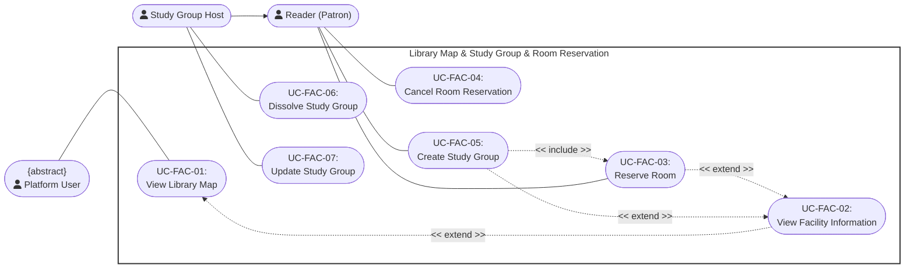
---

### UC-FAC-01: View Library Map

<table width="100%" border="1" cellpadding="8" cellspacing="0" style="border-collapse: collapse; font-family: Arial, sans-serif; font-size: 14px; border: 1px solid #d1d5db; margin-bottom: 20px;">
  <thead>
    <tr style="background-color: #1e3a8a; color: #ffffff;">
      <th colspan="2" style="text-align: left; padding: 12px; font-size: 16px;">
        Use Case: View Library Map
      </th>
    </tr>
  </thead>
  <tbody>
    <tr>
      <td width="22%" style="background-color: #f8fafc; font-weight: bold; vertical-align: top;">Use Case ID</td>
      <td style="vertical-align: top;"><strong>UC-FAC-01</strong></td>
    </tr>
    <tr>
      <td style="background-color: #f8fafc; font-weight: bold; vertical-align: top;">Brief Description</td>
      <td style="vertical-align: top;">
        Allows any platform user to view the interactive library floor map and select mapped rooms or facilities.
      </td>
    </tr>
    <tr>
      <td style="background-color: #f8fafc; font-weight: bold; vertical-align: top;">Actor(s)</td>
      <td style="vertical-align: top;">Platform User</td>
    </tr>
    <tr>
      <td style="background-color: #f8fafc; font-weight: bold; vertical-align: top;">Preconditions</td>
      <td style="vertical-align: top;">
        <ul style="margin: 0; padding-left: 20px; line-height: 1.5;">
          <li><strong>Interface Initialization:</strong> The user has launched the library digital map display.</li>
        </ul>
      </td>
    </tr>
    <tr>
      <td style="background-color: #f8fafc; font-weight: bold; vertical-align: top;">Flow of Events (Basic Flow)</td>
      <td style="vertical-align: top;">
        <ol style="margin: 0; padding-left: 20px; line-height: 1.6;">
          <li><strong>[Actor Action]:</strong> The user selects the "Interactive Map" tab component link from the primary navigation portal.</li>
          <li><strong>[System Response]:</strong> The client loads the maintained static floor-map asset and its interactive room identifiers.</li>
          <li><strong>[Display Result]:</strong> The system renders the complete high-resolution layout map canvas onto the active user screen interface.</li>
          <li><strong>[Actor Action]:</strong> The user navigates, pans, or zooms around the active floor coordinate spaces.</li>
        </ol>
      </td>
    </tr>
    <tr>
      <td style="background-color: #f8fafc; font-weight: bold; vertical-align: top;">Alternative / Exception Flows</td>
      <td style="vertical-align: top;">
        <ul style="margin: 0; padding-left: 20px; line-height: 1.5;">
          <li style="margin-bottom: 8px;">
            <strong>Asset Loading Failure (Step 2):</strong> If map structural asset vector files fail to load from backend content delivery nodes:
            <ol style="margin-top: 4px; margin-bottom: 4px; padding-left: 20px;">
              <li>The system stops the interactive-map initialization.</li>
              <li>The interface displays an asset-unavailable state and allows the user to retry or return to facility navigation.</li>
            </ol>
            <strong>Postcondition (Alternative Flow):</strong> The active workspace falls back to descriptive layout index directories; errors parse securely into diagnostic logs.
          </li>
        </ul>
      </td>
    </tr>
    <tr>
      <td style="background-color: #f8fafc; font-weight: bold; vertical-align: top;">Postconditions</td>
      <td style="vertical-align: top;">
        <ul style="margin: 0; padding-left: 20px;">
          <li><strong>Interactive Map State:</strong> The digital structural blueprint map is fully loaded and remains interactive within the client application container workspace.</li>
        </ul>
      </td>
    </tr>
    <tr>
      <td style="background-color: #f8fafc; font-weight: bold; vertical-align: top;">Special Requirements</td>
      <td style="vertical-align: top;">
        <ul style="margin: 0; padding-left: 20px;">
          <li><strong>Render Performance Ceiling:</strong> The graphical layout component structure must render interactively within 1.0 second on modern client application endpoints.</li>
        </ul>
      </td>
    </tr>
    <tr>
      <td style="background-color: #f8fafc; font-weight: bold; vertical-align: top;">Extension Points</td>
      <td style="vertical-align: top;">
        None
      </td>
    </tr>
    <tr>
      <td style="background-color: #f8fafc; font-weight: bold; vertical-align: top;">Prototype Screen</td>
      <td style="vertical-align: top;">
        

        
<em>Figure P-FAC-01-BF01 – Library Map</em>

        

        
<em>Figure P-FAC-01-AF01 – Library Map Unavailable</em>

      </td>
    </tr>
  </tbody>
</table>

---

### UC-FAC-02: View Facility Information

<table width="100%" border="1" cellpadding="8" cellspacing="0" style="border-collapse: collapse; font-family: Arial, sans-serif; font-size: 14px; border: 1px solid #d1d5db; margin-bottom: 20px;">
  <thead>
    <tr style="background-color: #1e3a8a; color: #ffffff;">
      <th colspan="2" style="text-align: left; padding: 12px; font-size: 16px;">
        Use Case: View Facility Information
      </th>
    </tr>
  </thead>
  <tbody>
    <tr>
      <td width="22%" style="background-color: #f8fafc; font-weight: bold; vertical-align: top;">Use Case ID</td>
      <td style="vertical-align: top;"><strong>UC-FAC-02</strong></td>
    </tr>
    <tr>
      <td style="background-color: #f8fafc; font-weight: bold; vertical-align: top;">Brief Description</td>
      <td style="vertical-align: top;">
        Extends the library map to display a selected room's metadata, capacity and equipment. Availability data and reservation actions are exposed only to an authenticated Reader.
         <em>(Includes / Extends: <strong>Extends UC-FAC-01 (View Library Map) — extension point: User selects a specific room or point-of-interest zone node anchor element within the visual map array space.</strong>)</em>
      </td>
    </tr>
    <tr>
      <td style="background-color: #f8fafc; font-weight: bold; vertical-align: top;">Actor(s)</td>
      <td style="vertical-align: top;">Platform User</td>
    </tr>
    <tr>
      <td style="background-color: #f8fafc; font-weight: bold; vertical-align: top;">Preconditions</td>
      <td style="vertical-align: top;">
        <ul style="margin: 0; padding-left: 20px; line-height: 1.5;">
          <li><strong>Underlying Map Session Active:</strong> The core baseline `View Library Map (UC-FAC-01)` flow is fully executed and active on screen.</li>
        </ul>
      </td>
    </tr>
    <tr>
      <td style="background-color: #f8fafc; font-weight: bold; vertical-align: top;">Flow of Events (Basic Flow)</td>
      <td style="vertical-align: top;">
        <ol style="margin: 0; padding-left: 20px; line-height: 1.6;">
          <li><strong>[Actor Action]:</strong> The user hovers over and clicks an active structural facility zone/room element node anchor on the map layout model.</li>
          <li><strong>[System Response]:</strong> The system reads the clicked room ID parameter, intercepting the base mapping loop.</li>
          <li><strong>[Data Processing]:</strong> The system retrieves the room metadata from PostgreSQL. If the actor is a Reader, it also retrieves reservable availability slots.</li>
          <li><strong>[Display Result]:</strong> The system updates the UI by opening an aligned descriptive contextual informational summary side-drawer panel sheet component over the map workspace.</li>
        </ol>
      </td>
    </tr>
    <tr>
      <td style="background-color: #f8fafc; font-weight: bold; vertical-align: top;">Alternative / Exception Flows</td>
      <td style="vertical-align: top;">
        <ul style="margin: 0; padding-left: 20px; line-height: 1.5;">
          <li style="margin-bottom: 8px;">
            <strong>Room Not Found (Step 3):</strong> If the selected room identifier no longer resolves to an active room:
            <ol style="margin-top: 4px; margin-bottom: 4px; padding-left: 20px;">
              <li>The system reports that the room is unavailable and closes or refreshes the detail panel.</li>
            </ol>
            <strong>Postcondition (Alternative Flow):</strong> Invalid profile popups close immediately; the base layer interactive map forces an automatic silent index update routine.
          </li>
        </ul>
      </td>
    </tr>
    <tr>
      <td style="background-color: #f8fafc; font-weight: bold; vertical-align: top;">Postconditions</td>
      <td style="vertical-align: top;">
        <ul style="margin: 0; padding-left: 20px;">
          <li><strong>Overlay Statistics Presentation:</strong> Detailed individual facility asset performance metrics, resource lists, and structural availability maps display clearly alongside graphic canvases.</li>
        </ul>
      </td>
    </tr>
    <tr>
      <td style="background-color: #f8fafc; font-weight: bold; vertical-align: top;">Special Requirements</td>
      <td style="vertical-align: top;">
        <ul style="margin: 0; padding-left: 20px;">
          <li><strong>Overlay Interface Non-Disruption:</strong> Context detail slide-drawer components must overlay fluidly without modifying or breaking current canvas viewport layout locations.</li>
          <li><strong>Dynamic Functional Layout Capabilities:</strong> The "reserve" option and capacity information are available explicitly for the study room panel type, while other facility layout zones will display descriptive content matrices only.</li>
        </ul>
      </td>
    </tr>
    <tr>
      <td style="background-color: #f8fafc; font-weight: bold; vertical-align: top;">Extension Points</td>
      <td style="vertical-align: top;">
        None
      </td>
    </tr>
    <tr>
      <td style="background-color: #f8fafc; font-weight: bold; vertical-align: top;">Prototype Screen</td>
      <td style="vertical-align: top;">
        

        
<em>Figure P-FAC-02-BF01 – Facility Information</em>

      </td>
    </tr>
  </tbody>
</table>

---

### UC-FAC-03: Reserve Room

<table width="100%" border="1" cellpadding="8" cellspacing="0" style="border-collapse: collapse; font-family: Arial, sans-serif; font-size: 14px; border: 1px solid #d1d5db; margin-bottom: 20px;">
  <thead>
    <tr style="background-color: #1e3a8a; color: #ffffff;">
      <th colspan="2" style="text-align: left; padding: 12px; font-size: 16px;">
        Use Case: Reserve Room
      </th>
    </tr>
  </thead>
  <tbody>
    <tr>
      <td width="22%" style="background-color: #f8fafc; font-weight: bold; vertical-align: top;">Use Case ID</td>
      <td style="vertical-align: top;"><strong>UC-FAC-03</strong></td>
    </tr>
    <tr>
      <td style="background-color: #f8fafc; font-weight: bold; vertical-align: top;">Brief Description</td>
      <td style="vertical-align: top;">
        Allows a Reader to reserve one predefined room-availability slot for individual use, or continue to UC-FAC-05 to create a study group for that slot.
         <em>(Related flow: <strong>Group mode continues to UC-FAC-05 (Create Study Group), which includes this room-reservation behavior.</strong>)</em>
      </td>
    </tr>
    <tr>
      <td style="background-color: #f8fafc; font-weight: bold; vertical-align: top;">Actor(s)</td>
      <td style="vertical-align: top;">Reader</td>
    </tr>
    <tr>
      <td style="background-color: #f8fafc; font-weight: bold; vertical-align: top;">Preconditions</td>
      <td style="vertical-align: top;">
        <ul style="margin: 0; padding-left: 20px; line-height: 1.5;">
          <li><strong>Central Identity Clearance:</strong> The user profile account identity successfully clears central access authorization checks.</li>
          <li><strong>Material Open Status:</strong> The chosen facility room asset calendar matches open, non-restricted booking states.</li>
        </ul>
      </td>
    </tr>
    <tr>
      <td style="background-color: #f8fafc; font-weight: bold; vertical-align: top;">Flow of Events (Basic Flow)</td>
      <td style="vertical-align: top;">
        <ol style="margin: 0; padding-left: 20px; line-height: 1.6;">
          <li><strong>[Actor Action]:</strong> The user opens the structural room booking schedule board tool component layout screen.</li>
          <li><strong>[Actor Action]:</strong> The user isolates an open target timeslot parameter block row on a free room workspace slot and hits the "Book Instantly" action control.</li>
          <li><strong>[Actor Action]:</strong> The user selects the reservation purpose mode (Free Reservation or Study Group Reservation):
            <ul style="margin-top: 4px; margin-bottom: 4px; padding-left: 20px;">
              <li><strong>Free Reservation:</strong> The user proceeds with reserving the room for personal study, and the workflow continues directly.</li>
              <li><strong>Study Group Reservation:</strong> The user selects study group reservation and fills out additional required information (e.g., study group selection/name, study topic/purpose, and member list).</li>
            </ul>
          </li>
          <li><strong>[System Response]:</strong> The system reads the selected availability ID and date, then verifies that the Reader has fewer than five active room reservations.</li>
          <li><strong>[Data Processing]:</strong> The system locks the selected availability slot and rejects any duplicate reservation through the database constraint.</li>
          <li><strong>[Data Processing]:</strong> For individual mode, the system creates a <code>reserved</code> room-reservation row and increments the Reader's reservation count. Group mode continues through UC-FAC-05 in the same transaction.</li>
          <li><strong>[Display Result]:</strong> The system confirms the selected fixed slot. The room check-in PIN is generated later from the Reader's reservation dashboard.</li>
        </ol>
      </td>
    </tr>
    <tr>
      <td style="background-color: #f8fafc; font-weight: bold; vertical-align: top;">Alternative / Exception Flows</td>
      <td style="vertical-align: top;">
        <ul style="margin: 0; padding-left: 20px; line-height: 1.5;">
          <li style="margin-bottom: 8px;">
            <strong>Incomplete Study Group Details (Step 3):</strong> If the user selects reservation for a Study Group but fails to fill out the mandatory study group information fields:
            <ol style="margin-top: 4px; margin-bottom: 4px; padding-left: 20px;">
              <li>The system interrupts the reservation submission logic.</li>
              <li>The system highlights the unfulfilled study group form fields on screen with an inline validation alert notice.</li>
            </ol>
            <strong>Postcondition (Alternative Flow):</strong> No reservation is submitted or written to the database; the active booking form remains open pending complete data entry.
          </li>
          <li style="margin-bottom: 8px;">
            <strong>Reservation Limit Reached:</strong> If the Reader already has five active room reservations:
            <ol style="margin-top: 4px; margin-bottom: 4px; padding-left: 20px;">
              <li>The system rejects the request without creating a reservation.</li>
              <li>The interface reports that the active room-reservation limit has been reached.</li>
            </ol>
            <strong>Postcondition (Alternative Flow):</strong> The selected slot remains unchanged.
          </li>
          <li style="margin-bottom: 8px;">
            <strong>Grid Collision Race Condition (Step 7):</strong> If another concurrent transaction session locks the exact same spatial grid slot milliseconds before submission:
            <ol style="margin-top: 4px; margin-bottom: 4px; padding-left: 20px;">
              <li>The system database layer traps the conflict error and rejects the execution command thread.</li>
              <li>The system cancels the workflow block execution and rolls back any pending staging changes.</li>
              <li>The system surfaces a priority alert header bar onto the screen layout stating: "Timeslot reservation conflict encountered; this room slot has already been claimed."</li>
            </ol>
            <strong>Postcondition (Alternative Flow):</strong> The active space booking matrix refreshes its visual structural layout immediately to show accurate states; database tables remain fully uncorrupted.
          </li>
        </ul>
      </td>
    </tr>
    <tr>
      <td style="background-color: #f8fafc; font-weight: bold; vertical-align: top;">Postconditions</td>
      <td style="vertical-align: top;">
        <ul style="margin: 0; padding-left: 20px;">
          <li><strong>Reservation Created:</strong> One reservation row owns the selected predefined availability slot and date.</li>
          <li><strong>Availability Protected:</strong> A concurrent request cannot reserve the same slot and date.</li>
        </ul>
      </td>
    </tr>
    <tr>
      <td style="background-color: #f8fafc; font-weight: bold; vertical-align: top;">Special Requirements</td>
      <td style="vertical-align: top;">
        <ul style="margin: 0; padding-left: 20px;">
          <li><strong>Concurrency Protection:</strong> Slot selection uses a database transaction, row locking, and a uniqueness constraint to prevent double booking.</li>
        </ul>
      </td>
    </tr>
    <tr>
      <td style="background-color: #f8fafc; font-weight: bold; vertical-align: top;">Extension Points</td>
      <td style="vertical-align: top;">
        None
      </td>
    </tr>
    <tr>
      <td style="background-color: #f8fafc; font-weight: bold; vertical-align: top;">Prototype Screen</td>
      <td style="vertical-align: top;">
        

        
<em>Figure P-FAC-03-BF01 – Room Reservations</em>

        
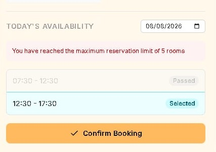

        
<em>Figure P-FAC-03-AF01 – Reservation Limit Reached</em>

        

        
<em>Figure P-FAC-03-AF02 – Time Slot Conflict</em>

      </td>
    </tr>
  </tbody>
</table>

---

### UC-FAC-04: Cancel Room Reservation

<table width="100%" border="1" cellpadding="8" cellspacing="0" style="border-collapse: collapse; font-family: Arial, sans-serif; font-size: 14px; border: 1px solid #d1d5db; margin-bottom: 20px;">
  <thead>
    <tr style="background-color: #1e3a8a; color: #ffffff;">
      <th colspan="2" style="text-align: left; padding: 12px; font-size: 16px;">
        Use Case: Cancel Room Reservation
      </th>
    </tr>
  </thead>
  <tbody>
    <tr>
      <td width="22%" style="background-color: #f8fafc; font-weight: bold; vertical-align: top;">Use Case ID</td>
      <td style="vertical-align: top;"><strong>UC-FAC-04</strong></td>
    </tr>
    <tr>
      <td style="background-color: #f8fafc; font-weight: bold; vertical-align: top;">Brief Description</td>
      <td style="vertical-align: top;">
        Allows a Reader to cancel an owned pending or reserved room booking and release its selected slot.
      </td>
    </tr>
    <tr>
      <td style="background-color: #f8fafc; font-weight: bold; vertical-align: top;">Actor(s)</td>
      <td style="vertical-align: top;">Reader</td>
    </tr>
    <tr>
      <td style="background-color: #f8fafc; font-weight: bold; vertical-align: top;">Preconditions</td>
      <td style="vertical-align: top;">
        <ul style="margin: 0; padding-left: 20px; line-height: 1.5;">
          <li><strong>Matching Relational Hold:</strong> An active space allocation record is mapped under the user profile credentials matching upcoming timeline dates.</li>
        </ul>
      </td>
    </tr>
    <tr>
      <td style="background-color: #f8fafc; font-weight: bold; vertical-align: top;">Flow of Events (Basic Flow)</td>
      <td style="vertical-align: top;">
        <ol style="margin: 0; padding-left: 20px; line-height: 1.6;">
          <li><strong>[Actor Action]:</strong> The user opens their personal active schedule dashboard interface window panel.</li>
          <li><strong>[Actor Action]:</strong> The user selects a target upcoming room reservation object row control card and hits "Cancel Booking".</li>
          <li><strong>[Data Processing]:</strong> Within one transaction, the system deletes the owned pending/reserved reservation row and decrements the Reader's active reservation count.</li>
          <li><strong>[Display Result]:</strong> The system sends confirmation notices to the user workspace screen while triggering background clearing loops.</li>
        </ol>
      </td>
    </tr>
    <tr>
      <td style="background-color: #f8fafc; font-weight: bold; vertical-align: top;">Alternative / Exception Flows</td>
      <td style="vertical-align: top;">
        <ul style="margin: 0; padding-left: 20px; line-height: 1.5;">
          <li style="margin-bottom: 8px;">
            <strong>Reservation Is Not Cancellable (Step 3):</strong> If the reservation is absent, belongs to another Reader, or is no longer pending/reserved:
            <ol style="margin-top: 4px; margin-bottom: 4px; padding-left: 20px;">
              <li>The system rejects the request and preserves the current record.</li>
            </ol>
            <strong>Postcondition (Alternative Flow):</strong> No reservation or account count is changed.
          </li>
        </ul>
      </td>
    </tr>
    <tr>
      <td style="background-color: #f8fafc; font-weight: bold; vertical-align: top;">Postconditions</td>
      <td style="vertical-align: top;">
        <ul style="margin: 0; padding-left: 20px;">
          <li><strong>Matrix Release Commitment:</strong> Outstanding space tracking parameters invalidate completely; room availability timelines clear to open registration access.</li>
        </ul>
      </td>
    </tr>
    <tr>
      <td style="background-color: #f8fafc; font-weight: bold; vertical-align: top;">Special Requirements</td>
      <td style="vertical-align: top;">
        <ul style="margin: 0; padding-left: 20px;">
          <li><strong>Atomic Cancellation:</strong> Reservation deletion and the Reader's reservation-count update complete within one database transaction.</li>
        </ul>
      </td>
    </tr>
    <tr>
      <td style="background-color: #f8fafc; font-weight: bold; vertical-align: top;">Extension Points</td>
      <td style="vertical-align: top;">
        None
      </td>
    </tr>
    <tr>
      <td style="background-color: #f8fafc; font-weight: bold; vertical-align: top;">Prototype Screen</td>
      <td style="vertical-align: top;">
        

        
<em>Figure P-FAC-03-BF01 – Room Reservations (reused for canceling a room reservation)</em>

        

        
<em>Figure P-FAC-04-AF01 – Legacy prototype; image will be refreshed separately</em>

      </td>
    </tr>
  </tbody>
</table>

---

### UC-FAC-05: Create Study Group

<table width="100%" border="1" cellpadding="8" cellspacing="0" style="border-collapse: collapse; font-family: Arial, sans-serif; font-size: 14px; border: 1px solid #d1d5db; margin-bottom: 20px;">
  <thead>
    <tr style="background-color: #1e3a8a; color: #ffffff;">
      <th colspan="2" style="text-align: left; padding: 12px; font-size: 16px;">
        Use Case: Create Study Group
      </th>
    </tr>
  </thead>
  <tbody>
    <tr>
      <td width="22%" style="background-color: #f8fafc; font-weight: bold; vertical-align: top;">Use Case ID</td>
      <td style="vertical-align: top;"><strong>UC-FAC-05</strong></td>
    </tr>
    <tr>
      <td style="background-color: #f8fafc; font-weight: bold; vertical-align: top;">Brief Description</td>
      <td style="vertical-align: top;">
        Creates a study group and its room reservation atomically for the Reader-selected availability slot.
         <em>(Includes / Extends: <strong>Includes UC-FAC-03 (Reserve Room) for the selected availability slot.</strong>)</em>
      </td>
    </tr>
    <tr>
      <td style="background-color: #f8fafc; font-weight: bold; vertical-align: top;">Actor(s)</td>
      <td style="vertical-align: top;">Reader</td>
    </tr>
    <tr>
      <td style="background-color: #f8fafc; font-weight: bold; vertical-align: top;">Preconditions</td>
      <td style="vertical-align: top;">
        <ul style="margin: 0; padding-left: 20px; line-height: 1.5;">
          <li><strong>System Roster Identity Active:</strong> The team coordinator account holds active registration statuses within system databases.</li>
        </ul>
      </td>
    </tr>
    <tr>
      <td style="background-color: #f8fafc; font-weight: bold; vertical-align: top;">Flow of Events (Basic Flow)</td>
      <td style="vertical-align: top;">
        <ol style="margin: 0; padding-left: 20px; line-height: 1.6;">
          <li><strong>[Actor Action]:</strong> The user selects "Form New Study Group" via their group coordination tool dashboard panel.</li>
          <li><strong>[System Response]:</strong> The system prompts for title, description, subject and up to five requirements; room capacity comes from the selected room.</li>
          <li><strong>[Actor Action]:</strong> The user populates the configuration fields and clicks "Confirm Setup".</li>
          <li><strong>[Data Processing]:</strong> The system validates the required fields, locks the selected room slot, creates the room reservation, and creates the study-group row in one transaction.</li>
          <li><strong>[Data Processing]:</strong> The initiating Reader becomes the Study Group Host.</li>
          <li><strong>[Display Result]:</strong> The system displays the empty group management cockpit interface screen layout views.</li>
        </ol>
      </td>
    </tr>
    <tr>
      <td style="background-color: #f8fafc; font-weight: bold; vertical-align: top;">Alternative / Exception Flows</td>
      <td style="vertical-align: top;">
        <ul style="margin: 0; padding-left: 20px; line-height: 1.5;">
          <li style="margin-bottom: 8px;">
            <strong>Invalid Details or Unavailable Slot (Step 4):</strong> If required fields are invalid, requirements exceed five, or the slot was already reserved:
            <ol style="margin-top: 4px; margin-bottom: 4px; padding-left: 20px;">
              <li>The system rolls back the transaction so neither the room reservation nor study group is created.</li>
              <li>The interface reports the validation or slot-conflict error.</li>
            </ol>
            <strong>Postcondition (Alternative Flow):</strong> Group registry tables experience zero modification tasks; the form setup view model remains open.
          </li>
        </ul>
      </td>
    </tr>
    <tr>
      <td style="background-color: #f8fafc; font-weight: bold; vertical-align: top;">Postconditions</td>
      <td style="vertical-align: top;">
        <ul style="margin: 0; padding-left: 20px;">
          <li><strong>Collaborative Record Instantiated:</strong> A structural collaborative group object profile instantiates within application tables, ready to intercept member mapping data streams.</li>
        </ul>
      </td>
    </tr>
    <tr>
      <td style="background-color: #f8fafc; font-weight: bold; vertical-align: top;">Special Requirements</td>
      <td style="vertical-align: top;">
        None
      </td>
    </tr>
    <tr>
      <td style="background-color: #f8fafc; font-weight: bold; vertical-align: top;">Extension Points</td>
      <td style="vertical-align: top;">
        None
      </td>
    </tr>
    <tr>
      <td style="background-color: #f8fafc; font-weight: bold; vertical-align: top;">Prototype Screen</td>
      <td style="vertical-align: top;">
        

        
<em>Figure P-FAC-05-BF01 – Create Study Group Form</em>

         
        

        
<em>Figure P-FAC-05-BF02 – Study Group Created</em>

        

        
<em>Figure P-FAC-05-BF03 – Your Study Groups</em>

      </td>
    </tr>
  </tbody>
</table>

---

### UC-FAC-06: Dissolve Study Group

<table width="100%" border="1" cellpadding="8" cellspacing="0" style="border-collapse: collapse; font-family: Arial, sans-serif; font-size: 14px; border: 1px solid #d1d5db; margin-bottom: 20px;">
  <thead>
    <tr style="background-color: #1e3a8a; color: #ffffff;">
      <th colspan="2" style="text-align: left; padding: 12px; font-size: 16px;">
        Use Case: Dissolve Study Group
      </th>
    </tr>
  </thead>
  <tbody>
    <tr>
      <td width="22%" style="background-color: #f8fafc; font-weight: bold; vertical-align: top;">Use Case ID</td>
      <td style="vertical-align: top;"><strong>UC-FAC-06</strong></td>
    </tr>
    <tr>
      <td style="background-color: #f8fafc; font-weight: bold; vertical-align: top;">Brief Description</td>
      <td style="vertical-align: top;">
        Completely disbands an active study group team profile structure entity, purging associated participant mapping rows and linked metadata records.
         <em>(Includes / Extends: <strong>Specializes abstract parent {abstract} Managing Study Group.</strong>)</em>
      </td>
    </tr>
    <tr>
      <td style="background-color: #f8fafc; font-weight: bold; vertical-align: top;">Actor(s)</td>
      <td style="vertical-align: top;">Study Group Host</td>
    </tr>
    <tr>
      <td style="background-color: #f8fafc; font-weight: bold; vertical-align: top;">Preconditions</td>
      <td style="vertical-align: top;">
        <ul style="margin: 0; padding-left: 20px; line-height: 1.5;">
          <li><strong>Elevated Security Authority:</strong> The actor's account role profile parameter matches explicit "Group Owner / Administrator" authorization permissions keys.</li>
        </ul>
      </td>
    </tr>
    <tr>
      <td style="background-color: #f8fafc; font-weight: bold; vertical-align: top;">Flow of Events (Basic Flow)</td>
      <td style="vertical-align: top;">
        <ol style="margin: 0; padding-left: 20px; line-height: 1.6;">
          <li><strong>[Actor Action]:</strong> The user opens the administrative settings panel inside the target study group configuration dashboard.</li>
          <li><strong>[Actor Action]:</strong> The user clicks the priority action control link labeled "Disband / Delete Study Group".</li>
          <li><strong>[System Response]:</strong> The system raises an interactive safety validation challenge popup confirmation box module.</li>
          <li><strong>[Actor Action]:</strong> The user completes the verification prompt action step.</li>
          <li><strong>[Data Processing]:</strong> If the group is manageable and starts at least three hours later, the system deletes its room reservation; database cascades remove the study group and related records.</li>
          <li><strong>[Data Processing]:</strong> The system decrements the Host's reservation count.</li>
          <li><strong>[Display Result]:</strong> The system notifies all active team members via operational dashboard alert feeds that the group space has closed.</li>
        </ol>
      </td>
    </tr>
    <tr>
      <td style="background-color: #f8fafc; font-weight: bold; vertical-align: top;">Alternative / Exception Flows</td>
      <td style="vertical-align: top;">
        <ul style="margin: 0; padding-left: 20px; line-height: 1.5;">
          <li style="margin-bottom: 8px;">
            <strong>Cancellation Window Closed (Step 5):</strong> If the group is no longer manageable or begins in less than three hours:
            <ol style="margin-top: 4px; margin-bottom: 4px; padding-left: 20px;">
              <li>The system rejects the dissolution and preserves the group and reservation.</li>
            </ol>
            <strong>Postcondition (Alternative Flow):</strong> The group deletion command sequence aborts; operational group entity variables maintain status-quo parameters.
          </li>
        </ul>
      </td>
    </tr>
    <tr>
      <td style="background-color: #f8fafc; font-weight: bold; vertical-align: top;">Postconditions</td>
      <td style="vertical-align: top;">
        <ul style="margin: 0; padding-left: 20px;">
          <li><strong>Relational Dissolution Complete:</strong> Coordinated team database index entities change to a fully inactive state model layout; member groupings break apart cleanly.</li>
        </ul>
      </td>
    </tr>
    <tr>
      <td style="background-color: #f8fafc; font-weight: bold; vertical-align: top;">Special Requirements</td>
      <td style="vertical-align: top;">
        <ul style="margin: 0; padding-left: 20px;">
          <li><strong>Automated Cascade Validation:</strong> Group termination cleanup rules must fully run automated cascade validation checks across linked records to verify zero dangling relational index nodes remain in structural table spaces.</li>
        </ul>
      </td>
    </tr>
    <tr>
      <td style="background-color: #f8fafc; font-weight: bold; vertical-align: top;">Extension Points</td>
      <td style="vertical-align: top;">
        None
      </td>
    </tr>
    <tr>
      <td style="background-color: #f8fafc; font-weight: bold; vertical-align: top;">Prototype Screen</td>
      <td style="vertical-align: top;">
        

        
<em>Figure P-FAC-07-BF01 – Study Group Management (reused for canceling a study group)</em>

        
<em>Figure P-FAC-06-BF02 – Cancellation Denial</em>

        

        
<em>Figure P-FAC-06-AF01 – Disband Study Group Failed</em>

      </td>
    </tr>
  </tbody>
</table>

---

### UC-FAC-07: Update Study Group

<table width="100%" border="1" cellpadding="8" cellspacing="0" style="border-collapse: collapse; font-family: Arial, sans-serif; font-size: 14px; border: 1px solid #d1d5db; margin-bottom: 20px;">
  <thead>
    <tr style="background-color: #1e3a8a; color: #ffffff;">
      <th colspan="2" style="text-align: left; padding: 12px; font-size: 16px;">
        Use Case: Update Study Group
      </th>
    </tr>
  </thead>
  <tbody>
    <tr>
      <td width="22%" style="background-color: #f8fafc; font-weight: bold; vertical-align: top;">Use Case ID</td>
      <td style="vertical-align: top;"><strong>UC-FAC-07</strong></td>
    </tr>
    <tr>
      <td style="background-color: #f8fafc; font-weight: bold; vertical-align: top;">Brief Description</td>
      <td style="vertical-align: top;">
        Allows the Study Group Host to update the title, description, subject and requirements of a manageable group.
      </td>
    </tr>
    <tr>
      <td style="background-color: #f8fafc; font-weight: bold; vertical-align: top;">Actor(s)</td>
      <td style="vertical-align: top;">Study Group Host</td>
    </tr>
    <tr>
      <td style="background-color: #f8fafc; font-weight: bold; vertical-align: top;">Preconditions</td>
      <td style="vertical-align: top;">
        <ul style="margin: 0; padding-left: 20px; line-height: 1.5;">
          <li><strong>Ownership Permissions:</strong> The user profile account identity possesses necessary editing permission rights parameters within the group database records.</li>
        </ul>
      </td>
    </tr>
    <tr>
      <td style="background-color: #f8fafc; font-weight: bold; vertical-align: top;">Flow of Events (Basic Flow)</td>
      <td style="vertical-align: top;">
        <ol style="margin: 0; padding-left: 20px; line-height: 1.6;">
          <li><strong>[Actor Action]:</strong> The user navigates to the group configuration editing dashboard profile template view layout.</li>
          <li><strong>[System Response]:</strong> The system populates input data entry text boxes with existing live database parameters.</li>
          <li><strong>[Actor Action]:</strong> The Host modifies title, description, subject or the list of up to five requirements.</li>
          <li><strong>[Actor Action]:</strong> The user clicks the "Save Modifications" processing control button widget.</li>
          <li><strong>[Data Processing]:</strong> The system validates the allowed fields and confirms that the group is still manageable.</li>
          <li><strong>[Data Processing]:</strong> The system updates the targeted group configuration database columns with the revised parameters.</li>
          <li><strong>[Display Result]:</strong> The system updates workspace windows, rendering flash confirmation notification banners.</li>
        </ol>
      </td>
    </tr>
    <tr>
      <td style="background-color: #f8fafc; font-weight: bold; vertical-align: top;">Alternative / Exception Flows</td>
      <td style="vertical-align: top;">
        <ul style="margin: 0; padding-left: 20px; line-height: 1.5;">
          <li style="margin-bottom: 8px;">
            <strong>Invalid Update or Group State (Step 5):</strong> If the payload contains unsupported/invalid values, more than five requirements, or the group is no longer manageable:
            <ol style="margin-top: 4px; margin-bottom: 4px; padding-left: 20px;">
              <li>The system rejects the update and reports the applicable validation error.</li>
            </ol>
            <strong>Postcondition (Alternative Flow):</strong> Data updates abort entirely; previous configuration fields remain unchanged inside database storage rows.
          </li>
        </ul>
      </td>
    </tr>
    <tr>
      <td style="background-color: #f8fafc; font-weight: bold; vertical-align: top;">Postconditions</td>
      <td style="vertical-align: top;">
        <ul style="margin: 0; padding-left: 20px;">
          <li><strong>Global Property Synchronization:</strong> Modified structural team layout profile properties match user updates instantly across all connected client interfaces.</li>
        </ul>
      </td>
    </tr>
    <tr>
      <td style="background-color: #f8fafc; font-weight: bold; vertical-align: top;">Special Requirements</td>
      <td style="vertical-align: top;">
        None
      </td>
    </tr>
    <tr>
      <td style="background-color: #f8fafc; font-weight: bold; vertical-align: top;">Extension Points</td>
      <td style="vertical-align: top;">
        None
      </td>
    </tr>
    <tr>
      <td style="background-color: #f8fafc; font-weight: bold; vertical-align: top;">Prototype Screen</td>
      <td style="vertical-align: top;">
        

        
<em>Figure P-FAC-07-BF01 – Study Group Management</em>

      </td>
    </tr>
  </tbody>
</table>

---

## VI. Study Group

### Use case diagram

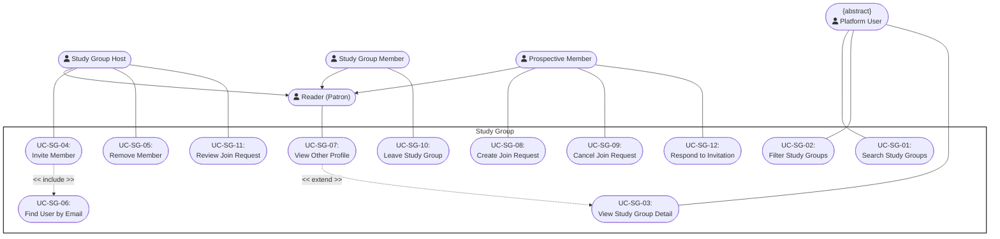

---

### UC-SG-01: Search Study Groups

<table width="100%" border="1" cellpadding="8" cellspacing="0" style="border-collapse: collapse; font-family: Arial, sans-serif; font-size: 14px; border: 1px solid #d1d5db; margin-bottom: 20px;">
  <thead>
    <tr style="background-color: #1e3a8a; color: #ffffff;">
      <th colspan="2" style="text-align: left; padding: 12px; font-size: 16px;">
        Use Case: Search Study Groups
      </th>
    </tr>
  </thead>
  <tbody>
    <tr>
      <td width="22%" style="background-color: #f8fafc; font-weight: bold; vertical-align: top;">Use Case ID</td>
      <td style="vertical-align: top;"><strong>UC-SG-01</strong></td>
    </tr>
    <tr>
      <td style="background-color: #f8fafc; font-weight: bold; vertical-align: top;">Brief Description</td>
      <td style="vertical-align: top;">
        Allows any Platform User to search the public study-group listing by keyword.
      </td>
    </tr>
    <tr>
      <td style="background-color: #f8fafc; font-weight: bold; vertical-align: top;">Actor(s)</td>
      <td style="vertical-align: top;">Platform User</td>
    </tr>
    <tr>
      <td style="background-color: #f8fafc; font-weight: bold; vertical-align: top;">Preconditions</td>
      <td style="vertical-align: top;">
        <ul style="margin: 0; padding-left: 20px; line-height: 1.5;">
          <li><strong>Feature Availability:</strong> The Platform User has access to the public study-group search feature.</li>
        </ul>
      </td>
    </tr>
    <tr>
      <td style="background-color: #f8fafc; font-weight: bold; vertical-align: top;">Flow of Events (Basic Flow)</td>
      <td style="vertical-align: top;">
        <ol style="margin: 0; padding-left: 20px; line-height: 1.6;">
          <li><strong>[Actor Action]:</strong> The Platform User navigates to the study-group search interface.</li>
          <li><strong>[Actor Action]:</strong> The Platform User enters a search keyword.</li>
          <li><strong>[Data Processing]:</strong> The system validates the input.</li>
          <li><strong>[Data Processing]:</strong> The system retrieves study groups matching the keyword.</li>
          <li><strong>[Display Result]:</strong> The system displays the list of matching study groups.</li>
        </ol>
      </td>
    </tr>
    <tr>
      <td style="background-color: #f8fafc; font-weight: bold; vertical-align: top;">Alternative / Exception Flows</td>
      <td style="vertical-align: top;">
        <ul style="margin: 0; padding-left: 20px; line-height: 1.5;">
          <li style="margin-bottom: 8px;">
            <strong>Empty or Invalid Input (Step 3):</strong> If the entered keyword is empty or invalid:
            <ol style="margin-top: 4px; margin-bottom: 4px; padding-left: 20px;">
              <li>The system rejects the search request.</li>
              <li>The system prompts the Platform User to enter a valid keyword.</li>
            </ol>
            <strong>Postcondition (Alternative Flow):</strong> No search is executed; the Platform User remains on the search interface.
          </li>
          <li style="margin-bottom: 8px;">
            <strong>No Matching Results (Step 4):</strong> If no study groups match the keyword:
            <ol style="margin-top: 4px; margin-bottom: 4px; padding-left: 20px;">
              <li>The system displays a "no results found" message.</li>
            </ol>
            <strong>Postcondition (Alternative Flow):</strong> No study group list is displayed.
          </li>
        </ul>
      </td>
    </tr>
    <tr>
      <td style="background-color: #f8fafc; font-weight: bold; vertical-align: top;">Postconditions</td>
      <td style="vertical-align: top;">
        <ul style="margin: 0; padding-left: 20px;">
          <li><strong>Result Display:</strong> A list of study groups matching the search criteria is displayed to the Platform User.</li>
        </ul>
      </td>
    </tr>
    <tr>
      <td style="background-color: #f8fafc; font-weight: bold; vertical-align: top;">Special Requirements</td>
      <td style="vertical-align: top;">
        <ul style="margin: 0; padding-left: 20px;">
          <li><strong>Response Time:</strong> Search results must be returned within an acceptable response time.</li>
          <li><strong>Input Validation:</strong> Search input must be validated to prevent malformed or malicious queries.</li>
        </ul>
      </td>
    </tr>
    <tr>
      <td style="background-color: #f8fafc; font-weight: bold; vertical-align: top;">Extension Points</td>
      <td style="vertical-align: top;">
        None
      </td>
    </tr>
    <tr>
      <td style="background-color: #f8fafc; font-weight: bold; vertical-align: top;">Prototype Screen</td>
      <td style="vertical-align: top;">
        

        
<em>Figure P-SG-01-BF01 – Search Study Groups</em>

        

        
<em>Figure P-SG-01-AF02 – No Search Results</em>

      </td>
    </tr>
  </tbody>
</table>

---

### UC-SG-02: Filter Study Groups

<table width="100%" border="1" cellpadding="8" cellspacing="0" style="border-collapse: collapse; font-family: Arial, sans-serif; font-size: 14px; border: 1px solid #d1d5db; margin-bottom: 20px;">
  <thead>
    <tr style="background-color: #1e3a8a; color: #ffffff;">
      <th colspan="2" style="text-align: left; padding: 12px; font-size: 16px;">
        Use Case: Filter Study Groups
      </th>
    </tr>
  </thead>
  <tbody>
    <tr>
      <td width="22%" style="background-color: #f8fafc; font-weight: bold; vertical-align: top;">Use Case ID</td>
      <td style="vertical-align: top;"><strong>UC-SG-02</strong></td>
    </tr>
    <tr>
      <td style="background-color: #f8fafc; font-weight: bold; vertical-align: top;">Brief Description</td>
      <td style="vertical-align: top;">
        Allows any Platform User to narrow the public study-group listing with the supported filters.
      </td>
    </tr>
    <tr>
      <td style="background-color: #f8fafc; font-weight: bold; vertical-align: top;">Actor(s)</td>
      <td style="vertical-align: top;">Platform User</td>
    </tr>
    <tr>
      <td style="background-color: #f8fafc; font-weight: bold; vertical-align: top;">Preconditions</td>
      <td style="vertical-align: top;">
        <ul style="margin: 0; padding-left: 20px; line-height: 1.5;">
          <li><strong>List Availability:</strong> A list of study groups is available for filtering (e.g., resulting from a search or a default listing).</li>
        </ul>
      </td>
    </tr>
    <tr>
      <td style="background-color: #f8fafc; font-weight: bold; vertical-align: top;">Flow of Events (Basic Flow)</td>
      <td style="vertical-align: top;">
        <ol style="margin: 0; padding-left: 20px; line-height: 1.6;">
          <li><strong>[Actor Action]:</strong> The Platform User accesses a study-group listing.</li>
          <li><strong>[Actor Action]:</strong> The Platform User selects one or more filter criteria.</li>
          <li><strong>[Data Processing]:</strong> The system validates the selected criteria.</li>
          <li><strong>[Data Processing]:</strong> The system applies the filters to the current list.</li>
          <li><strong>[Display Result]:</strong> The system displays the filtered list.</li>
        </ol>
      </td>
    </tr>
    <tr>
      <td style="background-color: #f8fafc; font-weight: bold; vertical-align: top;">Alternative / Exception Flows</td>
      <td style="vertical-align: top;">
        <ul style="margin: 0; padding-left: 20px; line-height: 1.5;">
          <li style="margin-bottom: 8px;">
            <strong>Invalid Filter Combination (Step 3):</strong> If the selected filters are invalid or conflicting:
            <ol style="margin-top: 4px; margin-bottom: 4px; padding-left: 20px;">
              <li>The system rejects the filter request.</li>
              <li>The system notifies the Platform User and retains the previous list.</li>
            </ol>
            <strong>Postcondition (Alternative Flow):</strong> The previous study group list remains displayed.
          </li>
          <li style="margin-bottom: 8px;">
            <strong>No Results After Filtering (Step 4):</strong> If no study groups match the filters:
            <ol style="margin-top: 4px; margin-bottom: 4px; padding-left: 20px;">
              <li>The system displays a "no results found" message.</li>
              <li>The system allows the Platform User to adjust the filters.</li>
            </ol>
            <strong>Postcondition (Alternative Flow):</strong> The filtered list is empty.
          </li>
        </ul>
      </td>
    </tr>
    <tr>
      <td style="background-color: #f8fafc; font-weight: bold; vertical-align: top;">Postconditions</td>
      <td style="vertical-align: top;">
        <ul style="margin: 0; padding-left: 20px;">
          <li><strong>Result Display:</strong> The displayed list of study groups reflects the applied filter criteria.</li>
        </ul>
      </td>
    </tr>
    <tr>
      <td style="background-color: #f8fafc; font-weight: bold; vertical-align: top;">Special Requirements</td>
      <td style="vertical-align: top;">
        <ul style="margin: 0; padding-left: 20px;">
          <li><strong>Filter Usability:</strong> Filter options must be clearly presented and combinable where applicable.</li>
        </ul>
      </td>
    </tr>
    <tr>
      <td style="background-color: #f8fafc; font-weight: bold; vertical-align: top;">Extension Points</td>
      <td style="vertical-align: top;">
        None
      </td>
    </tr>
    <tr>
      <td style="background-color: #f8fafc; font-weight: bold; vertical-align: top;">Prototype Screen</td>
      <td style="vertical-align: top;">
        

        
<em>Figure P-SG-02-BF01 – Filter Study Groups</em>

      </td>
    </tr>
  </tbody>
</table>

---

### UC-SG-03: View Study Group Detail

<table width="100%" border="1" cellpadding="8" cellspacing="0" style="border-collapse: collapse; font-family: Arial, sans-serif; font-size: 14px; border: 1px solid #d1d5db; margin-bottom: 20px;">
  <thead>
    <tr style="background-color: #1e3a8a; color: #ffffff;">
      <th colspan="2" style="text-align: left; padding: 12px; font-size: 16px;">
        Use Case: View Study Group Detail
      </th>
    </tr>
  </thead>
  <tbody>
    <tr>
      <td width="22%" style="background-color: #f8fafc; font-weight: bold; vertical-align: top;">Use Case ID</td>
      <td style="vertical-align: top;"><strong>UC-SG-03</strong></td>
    </tr>
    <tr>
      <td style="background-color: #f8fafc; font-weight: bold; vertical-align: top;">Brief Description</td>
      <td style="vertical-align: top;">
        Allows any Platform User to view the public details of a study group.
      </td>
    </tr>
    <tr>
      <td style="background-color: #f8fafc; font-weight: bold; vertical-align: top;">Actor(s)</td>
      <td style="vertical-align: top;">Platform User</td>
    </tr>
    <tr>
      <td style="background-color: #f8fafc; font-weight: bold; vertical-align: top;">Preconditions</td>
      <td style="vertical-align: top;">
        <ul style="margin: 0; padding-left: 20px; line-height: 1.5;">
          <li><strong>Group Accessibility:</strong> A study group exists and is accessible from a list (search or filtered results).</li>
        </ul>
      </td>
    </tr>
    <tr>
      <td style="background-color: #f8fafc; font-weight: bold; vertical-align: top;">Flow of Events (Basic Flow)</td>
      <td style="vertical-align: top;">
        <ol style="margin: 0; padding-left: 20px; line-height: 1.6;">
          <li><strong>[Actor Action]:</strong> The Platform User selects a study group from a list.</li>
          <li><strong>[Data Processing]:</strong> The system retrieves the study group's detailed information.</li>
          <li><strong>[Display Result]:</strong> The system displays the study group details, including description, members, and schedule.</li>
        </ol>
      </td>
    </tr>
    <tr>
      <td style="background-color: #f8fafc; font-weight: bold; vertical-align: top;">Alternative / Exception Flows</td>
      <td style="vertical-align: top;">
        <ul style="margin: 0; padding-left: 20px; line-height: 1.5;">
          <li style="margin-bottom: 8px;">
            <strong>Study Group Unavailable (Step 2):</strong> If the selected study group no longer exists or is inaccessible:
            <ol style="margin-top: 4px; margin-bottom: 4px; padding-left: 20px;">
              <li>The system displays an error message.</li>
            </ol>
            <strong>Postcondition (Alternative Flow):</strong> No detail view is displayed.
          </li>
        </ul>
      </td>
    </tr>
    <tr>
      <td style="background-color: #f8fafc; font-weight: bold; vertical-align: top;">Postconditions</td>
      <td style="vertical-align: top;">
        <ul style="margin: 0; padding-left: 20px;">
          <li><strong>Detail Display:</strong> The detailed information of the selected study group is displayed to the Platform User.</li>
        </ul>
      </td>
    </tr>
    <tr>
      <td style="background-color: #f8fafc; font-weight: bold; vertical-align: top;">Special Requirements</td>
      <td style="vertical-align: top;">
        <ul style="margin: 0; padding-left: 20px;">
          <li><strong>Public Scope:</strong> Only information exposed by the public study-group detail response is displayed.</li>
        </ul>
      </td>
    </tr>
    <tr>
      <td style="background-color: #f8fafc; font-weight: bold; vertical-align: top;">Extension Points</td>
      <td style="vertical-align: top;">
        None
      </td>
    </tr>
    <tr>
      <td style="background-color: #f8fafc; font-weight: bold; vertical-align: top;">Prototype Screen</td>
      <td style="vertical-align: top;">
        

        
<em>Figure P-SG-03-BF01 – Study Group Details</em>

      </td>
    </tr>
  </tbody>
</table>

---

### UC-SG-04: Invite Member

<table width="100%" border="1" cellpadding="8" cellspacing="0" style="border-collapse: collapse; font-family: Arial, sans-serif; font-size: 14px; border: 1px solid #d1d5db; margin-bottom: 20px;">
  <thead>
    <tr style="background-color: #1e3a8a; color: #ffffff;">
      <th colspan="2" style="text-align: left; padding: 12px; font-size: 16px;">
        Use Case: Invite Member
      </th>
    </tr>
  </thead>
  <tbody>
    <tr>
      <td width="22%" style="background-color: #f8fafc; font-weight: bold; vertical-align: top;">Use Case ID</td>
      <td style="vertical-align: top;"><strong>UC-SG-04</strong></td>
    </tr>
    <tr>
      <td style="background-color: #f8fafc; font-weight: bold; vertical-align: top;">Brief Description</td>
      <td style="vertical-align: top;">
        Allows the Study Group Host to invite a registered Reader by email to a manageable study group.
      </td>
    </tr>
    <tr>
      <td style="background-color: #f8fafc; font-weight: bold; vertical-align: top;">Actor(s)</td>
      <td style="vertical-align: top;">Study Group Host</td>
    </tr>
    <tr>
      <td style="background-color: #f8fafc; font-weight: bold; vertical-align: top;">Preconditions</td>
      <td style="vertical-align: top;">
        <ul style="margin: 0; padding-left: 20px; line-height: 1.5;">
          <li><strong>Authorization State:</strong> The Study Group Host is authenticated and manages the selected study group.</li>
        </ul>
      </td>
    </tr>
    <tr>
      <td style="background-color: #f8fafc; font-weight: bold; vertical-align: top;">Flow of Events (Basic Flow)</td>
      <td style="vertical-align: top;">
        <ol style="margin: 0; padding-left: 20px; line-height: 1.6;">
          <li><strong>[Actor Action]:</strong> The Study Group Host selects the study group to invite a member to.</li>
          <li><strong>[Actor Action]:</strong> The Host enters the target Reader's email address.</li>
          <li><strong>[Data Processing]:</strong> Through UC-SG-06, the system resolves the account and validates the group state, membership and existing invitation/request state.</li>
          <li><strong>[Data Processing]:</strong> The system creates a pending invitation and sends the invitation email.</li>
          <li><strong>[Display Result]:</strong> The system confirms to the Study Group Host that the invitation was sent.</li>
        </ol>
      </td>
    </tr>
    <tr>
      <td style="background-color: #f8fafc; font-weight: bold; vertical-align: top;">Alternative / Exception Flows</td>
      <td style="vertical-align: top;">
        <ul style="margin: 0; padding-left: 20px; line-height: 1.5;">
          <li style="margin-bottom: 8px;">
            <strong>Target User Already a Member (Step 3):</strong> If the target user is already a member of the study group:
            <ol style="margin-top: 4px; margin-bottom: 4px; padding-left: 20px;">
              <li>The system displays an error message.</li>
              <li>The system does not send an invitation.</li>
            </ol>
            <strong>Postcondition (Alternative Flow):</strong> No invitation is sent; the study group membership remains unchanged.
          </li>
        </ul>
      </td>
    </tr>
    <tr>
      <td style="background-color: #f8fafc; font-weight: bold; vertical-align: top;">Postconditions</td>
      <td style="vertical-align: top;">
        <ul style="margin: 0; padding-left: 20px;">
          <li><strong>Invitation Issued:</strong> An invitation has been issued to the specified user for the selected study group.</li>
        </ul>
      </td>
    </tr>
    <tr>
      <td style="background-color: #f8fafc; font-weight: bold; vertical-align: top;">Special Requirements</td>
      <td style="vertical-align: top;">
        <ul style="margin: 0; padding-left: 20px;">
          <li><strong>Authorization:</strong> Only the study group creator may issue invitations for a given study group.</li>
          <li><strong>Duplicate Prevention:</strong> Duplicate invitations to the same user for the same study group must be prevented.</li>
        </ul>
      </td>
    </tr>
    <tr>
      <td style="background-color: #f8fafc; font-weight: bold; vertical-align: top;">Extension Points</td>
      <td style="vertical-align: top;">
        None
      </td>
    </tr>
    <tr>
      <td style="background-color: #f8fafc; font-weight: bold; vertical-align: top;">Prototype Screen</td>
      <td style="vertical-align: top;">
        

        
<em>Figure P-SG-04-BF01 – Manage Group Members</em>

        

        
<em>Figure P-SG-04-AF01 – User Already a Member</em>

      </td>
    </tr>
  </tbody>
</table>

---

### UC-SG-05: Remove Member

<table width="100%" border="1" cellpadding="8" cellspacing="0" style="border-collapse: collapse; font-family: Arial, sans-serif; font-size: 14px; border: 1px solid #d1d5db; margin-bottom: 20px;">
  <thead>
    <tr style="background-color: #1e3a8a; color: #ffffff;">
      <th colspan="2" style="text-align: left; padding: 12px; font-size: 16px;">
        Use Case: Remove Member
      </th>
    </tr>
  </thead>
  <tbody>
    <tr>
      <td width="22%" style="background-color: #f8fafc; font-weight: bold; vertical-align: top;">Use Case ID</td>
      <td style="vertical-align: top;"><strong>UC-SG-05</strong></td>
    </tr>
    <tr>
      <td style="background-color: #f8fafc; font-weight: bold; vertical-align: top;">Brief Description</td>
      <td style="vertical-align: top;">
        Allows the Study Group Host to remove an existing member from a manageable study group.
      </td>
    </tr>
    <tr>
      <td style="background-color: #f8fafc; font-weight: bold; vertical-align: top;">Actor(s)</td>
      <td style="vertical-align: top;">Study Group Host</td>
    </tr>
    <tr>
      <td style="background-color: #f8fafc; font-weight: bold; vertical-align: top;">Preconditions</td>
      <td style="vertical-align: top;">
        <ul style="margin: 0; padding-left: 20px; line-height: 1.5;">
          <li><strong>Authorization and Membership State:</strong> The Study Group Host manages the group; the target Reader is a current member.</li>
        </ul>
      </td>
    </tr>
    <tr>
      <td style="background-color: #f8fafc; font-weight: bold; vertical-align: top;">Flow of Events (Basic Flow)</td>
      <td style="vertical-align: top;">
        <ol style="margin: 0; padding-left: 20px; line-height: 1.6;">
          <li><strong>[Actor Action]:</strong> The Study Group Host selects the group and views its member list.</li>
          <li><strong>[Actor Action]:</strong> The Study Group Host selects the member to remove.</li>
          <li><strong>[System Response]:</strong> The system requests confirmation of the removal.</li>
          <li><strong>[Data Processing]:</strong> The system removes the selected member from the study group.</li>
          <li><strong>[Display Result]:</strong> The system confirms the removal to the Study Group Host.</li>
        </ol>
      </td>
    </tr>
    <tr>
      <td style="background-color: #f8fafc; font-weight: bold; vertical-align: top;">Alternative / Exception Flows</td>
      <td style="vertical-align: top;">
        <ul style="margin: 0; padding-left: 20px; line-height: 1.5;">
          <li style="margin-bottom: 8px;">
            <strong>Removal Canceled (Step 3):</strong> If the Study Group Host cancels the confirmation:
            <ol style="margin-top: 4px; margin-bottom: 4px; padding-left: 20px;">
              <li>The system cancels the removal process.</li>
            </ol>
            <strong>Postcondition (Alternative Flow):</strong> The study group membership remains unchanged.
          </li>
          <li style="margin-bottom: 8px;">
            <strong>Target User Not a Member (Step 2):</strong> If the selected user is not currently a member:
            <ol style="margin-top: 4px; margin-bottom: 4px; padding-left: 20px;">
              <li>The system displays an error message.</li>
            </ol>
            <strong>Postcondition (Alternative Flow):</strong> The study group membership remains unchanged.
          </li>
        </ul>
      </td>
    </tr>
    <tr>
      <td style="background-color: #f8fafc; font-weight: bold; vertical-align: top;">Postconditions</td>
      <td style="vertical-align: top;">
        <ul style="margin: 0; padding-left: 20px;">
          <li><strong>Membership Update:</strong> The selected member is no longer part of the study group.</li>
        </ul>
      </td>
    </tr>
    <tr>
      <td style="background-color: #f8fafc; font-weight: bold; vertical-align: top;">Special Requirements</td>
      <td style="vertical-align: top;">
        <ul style="margin: 0; padding-left: 20px;">
          <li><strong>Authorization:</strong> Only the study group creator may remove members from a study group they manage.</li>
          <li><strong>Notification:</strong> The affected user should be notified of their removal.</li>
        </ul>
      </td>
    </tr>
    <tr>
      <td style="background-color: #f8fafc; font-weight: bold; vertical-align: top;">Extension Points</td>
      <td style="vertical-align: top;">
        None
      </td>
    </tr>
    <tr>
      <td style="background-color: #f8fafc; font-weight: bold; vertical-align: top;">Prototype Screen</td>
      <td style="vertical-align: top;">
        

        
<em>Figure P-SG-05-BF01 – Remove Group Member</em>

      </td>
    </tr>
  </tbody>
</table>

---

### UC-SG-06: Find User by Email

<table width="100%" border="1" cellpadding="8" cellspacing="0" style="border-collapse: collapse; font-family: Arial, sans-serif; font-size: 14px; border: 1px solid #d1d5db; margin-bottom: 20px;">
  <thead>
    <tr style="background-color: #1e3a8a; color: #ffffff;">
      <th colspan="2" style="text-align: left; padding: 12px; font-size: 16px;">
        Use Case: Find User by Email
      </th>
    </tr>
  </thead>
  <tbody>
    <tr>
      <td width="22%" style="background-color: #f8fafc; font-weight: bold; vertical-align: top;">Use Case ID</td>
      <td style="vertical-align: top;"><strong>UC-SG-06</strong></td>
    </tr>
    <tr>
      <td style="background-color: #f8fafc; font-weight: bold; vertical-align: top;">Brief Description</td>
      <td style="vertical-align: top;">
        Allows the Study Group Host to resolve a registered Reader by email while creating an invitation.
      </td>
    </tr>
    <tr>
      <td style="background-color: #f8fafc; font-weight: bold; vertical-align: top;">Actor(s)</td>
      <td style="vertical-align: top;">Study Group Host</td>
    </tr>
    <tr>
      <td style="background-color: #f8fafc; font-weight: bold; vertical-align: top;">Preconditions</td>
      <td style="vertical-align: top;">
        <ul style="margin: 0; padding-left: 20px; line-height: 1.5;">
          <li><strong>Feature Availability:</strong> The Study Group Host is creating an invitation for a manageable group.</li>
        </ul>
      </td>
    </tr>
    <tr>
      <td style="background-color: #f8fafc; font-weight: bold; vertical-align: top;">Flow of Events (Basic Flow)</td>
      <td style="vertical-align: top;">
        <ol style="margin: 0; padding-left: 20px; line-height: 1.6;">
          <li><strong>[Actor Action]:</strong> The Study Group Host enters an email address.</li>
          <li><strong>[Data Processing]:</strong> The system validates the format of the email address.</li>
          <li><strong>[Data Processing]:</strong> The system searches for a registered user matching the entered email address.</li>
          <li><strong>[Display Result]:</strong> The system displays the matching user's basic profile information.</li>
        </ol>
      </td>
    </tr>
    <tr>
      <td style="background-color: #f8fafc; font-weight: bold; vertical-align: top;">Alternative / Exception Flows</td>
      <td style="vertical-align: top;">
        <ul style="margin: 0; padding-left: 20px; line-height: 1.5;">
          <li style="margin-bottom: 8px;">
            <strong>Invalid Email Format (Step 2):</strong> If the email format is invalid:
            <ol style="margin-top: 4px; margin-bottom: 4px; padding-left: 20px;">
              <li>The system prompts the Study Group Host to correct the input.</li>
            </ol>
            <strong>Postcondition (Alternative Flow):</strong> No user information is displayed.
          </li>
          <li style="margin-bottom: 8px;">
            <strong>No Matching User (Step 3):</strong> If no registered user matches the provided email:
            <ol style="margin-top: 4px; margin-bottom: 4px; padding-left: 20px;">
              <li>The system displays a "user not found" message.</li>
            </ol>
            <strong>Postcondition (Alternative Flow):</strong> No user information is displayed.
          </li>
        </ul>
      </td>
    </tr>
    <tr>
      <td style="background-color: #f8fafc; font-weight: bold; vertical-align: top;">Postconditions</td>
      <td style="vertical-align: top;">
        <ul style="margin: 0; padding-left: 20px;">
          <li><strong>Result Available:</strong> The matching account is returned to the invitation flow without exposing sensitive profile fields.</li>
        </ul>
      </td>
    </tr>
    <tr>
      <td style="background-color: #f8fafc; font-weight: bold; vertical-align: top;">Special Requirements</td>
      <td style="vertical-align: top;">
        <ul style="margin: 0; padding-left: 20px;">
          <li><strong>Privacy:</strong> Only minimal, non-sensitive user information should be exposed through this lookup.</li>
        </ul>
      </td>
    </tr>
    <tr>
      <td style="background-color: #f8fafc; font-weight: bold; vertical-align: top;">Extension Points</td>
      <td style="vertical-align: top;">
        None
      </td>
    </tr>
    <tr>
      <td style="background-color: #f8fafc; font-weight: bold; vertical-align: top;">Prototype Screen</td>
      <td style="vertical-align: top;">
        

        
<em>Figure P-SG-07-BF01 – View Other Profile (reused as the found-user result screen)</em>

        

        
<em>Figure P-SG-06-AF01 – Invalid Email</em>

        

        
<em>Figure P-SG-06-AF02 – User Not Found</em>

      </td>
    </tr>
  </tbody>
</table>

---

### UC-SG-07: View Other Profile

<table width="100%" border="1" cellpadding="8" cellspacing="0" style="border-collapse: collapse; font-family: Arial, sans-serif; font-size: 14px; border: 1px solid #d1d5db; margin-bottom: 20px;">
  <thead>
    <tr style="background-color: #1e3a8a; color: #ffffff;">
      <th colspan="2" style="text-align: left; padding: 12px; font-size: 16px;">
        Use Case: View Other Profile
      </th>
    </tr>
  </thead>
  <tbody>
    <tr>
      <td width="22%" style="background-color: #f8fafc; font-weight: bold; vertical-align: top;">Use Case ID</td>
      <td style="vertical-align: top;"><strong>UC-SG-07</strong></td>
    </tr>
    <tr>
      <td style="background-color: #f8fafc; font-weight: bold; vertical-align: top;">Brief Description</td>
      <td style="vertical-align: top;">
        Allows an authenticated Reader to view the basic profile data exposed in the study-group context.
      </td>
    </tr>
    <tr>
      <td style="background-color: #f8fafc; font-weight: bold; vertical-align: top;">Actor(s)</td>
      <td style="vertical-align: top;">Reader</td>
    </tr>
    <tr>
      <td style="background-color: #f8fafc; font-weight: bold; vertical-align: top;">Preconditions</td>
      <td style="vertical-align: top;">
        <ul style="margin: 0; padding-left: 20px; line-height: 1.5;">
          <li><strong>Profile Accessibility:</strong> The target Reader's basic profile is available in the study-group context.</li>
        </ul>
      </td>
    </tr>
    <tr>
      <td style="background-color: #f8fafc; font-weight: bold; vertical-align: top;">Flow of Events (Basic Flow)</td>
      <td style="vertical-align: top;">
        <ol style="margin: 0; padding-left: 20px; line-height: 1.6;">
          <li><strong>[Actor Action]:</strong> The Reader selects another Reader from the study-group context.</li>
          <li><strong>[Data Processing]:</strong> The system retrieves the target Reader's basic profile information included by the study-group detail service.</li>
          <li><strong>[Display Result]:</strong> The system displays the basic profile to the Reader.</li>
        </ol>
      </td>
    </tr>
    <tr>
      <td style="background-color: #f8fafc; font-weight: bold; vertical-align: top;">Alternative / Exception Flows</td>
      <td style="vertical-align: top;">
        <ul style="margin: 0; padding-left: 20px; line-height: 1.5;">
          <li style="margin-bottom: 8px;">
            <strong>Profile Unavailable (Step 2):</strong> If the target user's profile cannot be retrieved:
            <ol style="margin-top: 4px; margin-bottom: 4px; padding-left: 20px;">
              <li>The system displays an error message.</li>
            </ol>
            <strong>Postcondition (Alternative Flow):</strong> No profile information is displayed.
          </li>
        </ul>
      </td>
    </tr>
    <tr>
      <td style="background-color: #f8fafc; font-weight: bold; vertical-align: top;">Postconditions</td>
      <td style="vertical-align: top;">
        <ul style="margin: 0; padding-left: 20px;">
          <li><strong>Profile Display:</strong> The requested basic profile information is displayed to the Reader.</li>
        </ul>
      </td>
    </tr>
    <tr>
      <td style="background-color: #f8fafc; font-weight: bold; vertical-align: top;">Special Requirements</td>
      <td style="vertical-align: top;">
        <ul style="margin: 0; padding-left: 20px;">
          <li><strong>Visibility:</strong> Only profile information the target user has made visible/appropriate for this context should be shown.</li>
        </ul>
      </td>
    </tr>
    <tr>
      <td style="background-color: #f8fafc; font-weight: bold; vertical-align: top;">Extension Points</td>
      <td style="vertical-align: top;">
        None
      </td>
    </tr>
    <tr>
      <td style="background-color: #f8fafc; font-weight: bold; vertical-align: top;">Prototype Screen</td>
      <td style="vertical-align: top;">
        

        
<em>Figure P-SG-07-BF01 – View Other Profile</em>

      </td>
    </tr>
  </tbody>
</table>

---

### UC-SG-08: Create Join Request

<table width="100%" border="1" cellpadding="8" cellspacing="0" style="border-collapse: collapse; font-family: Arial, sans-serif; font-size: 14px; border: 1px solid #d1d5db; margin-bottom: 20px;">
  <thead>
    <tr style="background-color: #1e3a8a; color: #ffffff;">
      <th colspan="2" style="text-align: left; padding: 12px; font-size: 16px;">
        Use Case: Create Join Request
      </th>
    </tr>
  </thead>
  <tbody>
    <tr>
      <td width="22%" style="background-color: #f8fafc; font-weight: bold; vertical-align: top;">Use Case ID</td>
      <td style="vertical-align: top;"><strong>UC-SG-08</strong></td>
    </tr>
    <tr>
      <td style="background-color: #f8fafc; font-weight: bold; vertical-align: top;">Brief Description</td>
      <td style="vertical-align: top;">
        Allows a Prospective Member to request membership in an upcoming study group that is not full.
      </td>
    </tr>
    <tr>
      <td style="background-color: #f8fafc; font-weight: bold; vertical-align: top;">Actor(s)</td>
      <td style="vertical-align: top;">Prospective Member</td>
    </tr>
    <tr>
      <td style="background-color: #f8fafc; font-weight: bold; vertical-align: top;">Preconditions</td>
      <td style="vertical-align: top;">
        <ul style="margin: 0; padding-left: 20px; line-height: 1.5;">
          <li><strong>Authentication State:</strong> The Prospective Member is authenticated, and the selected study group exists.</li>
        </ul>
      </td>
    </tr>
    <tr>
      <td style="background-color: #f8fafc; font-weight: bold; vertical-align: top;">Flow of Events (Basic Flow)</td>
      <td style="vertical-align: top;">
        <ol style="margin: 0; padding-left: 20px; line-height: 1.6;">
          <li><strong>[Actor Action]:</strong> The Prospective Member selects the study group they wish to join.</li>
          <li><strong>[Actor Action]:</strong> The Prospective Member submits a request to join.</li>
          <li><strong>[Data Processing]:</strong> The system verifies the group is upcoming and not full, the actor is not the Host or an approved member, no request is pending, and any denial cooldown has elapsed.</li>
          <li><strong>[Data Processing]:</strong> The system creates the join request and associates it with the study group.</li>
          <li><strong>[Data Processing]:</strong> The system notifies the Study Group Host of the new join request.</li>
          <li><strong>[Display Result]:</strong> The system confirms to the Prospective Member that the request has been submitted.</li>
        </ol>
      </td>
    </tr>
    <tr>
      <td style="background-color: #f8fafc; font-weight: bold; vertical-align: top;">Alternative / Exception Flows</td>
      <td style="vertical-align: top;">
        <ul style="margin: 0; padding-left: 20px; line-height: 1.5;">
          <li style="margin-bottom: 8px;">
            <strong>User Already a Member (Step 3):</strong> If the Prospective Member is already an approved member of the study group:
            <ol style="margin-top: 4px; margin-bottom: 4px; padding-left: 20px;">
              <li>The system displays an error message.</li>
              <li>The system does not create a request.</li>
            </ol>
            <strong>Postcondition (Alternative Flow):</strong> No new join request is created.
          </li>
          <li style="margin-bottom: 8px;">
            <strong>Duplicate Pending Request (Step 3):</strong> If a pending join request already exists for the Prospective Member and study group:
            <ol style="margin-top: 4px; margin-bottom: 4px; padding-left: 20px;">
              <li>The system displays a message.</li>
              <li>The system does not create a duplicate request.</li>
            </ol>
            <strong>Postcondition (Alternative Flow):</strong> No new join request is created.
          </li>
        </ul>
      </td>
    </tr>
    <tr>
      <td style="background-color: #f8fafc; font-weight: bold; vertical-align: top;">Postconditions</td>
      <td style="vertical-align: top;">
        <ul style="margin: 0; padding-left: 20px;">
          <li><strong>Request Created:</strong> A pending join request for the Prospective Member exists against the selected study group.</li>
        </ul>
      </td>
    </tr>
    <tr>
      <td style="background-color: #f8fafc; font-weight: bold; vertical-align: top;">Special Requirements</td>
      <td style="vertical-align: top;">
        <ul style="margin: 0; padding-left: 20px;">
          <li><strong>Request Limit:</strong> Each user may have at most one pending join request per study group at any given time.</li>
        </ul>
      </td>
    </tr>
    <tr>
      <td style="background-color: #f8fafc; font-weight: bold; vertical-align: top;">Extension Points</td>
      <td style="vertical-align: top;">
        None
      </td>
    </tr>
    <tr>
      <td style="background-color: #f8fafc; font-weight: bold; vertical-align: top;">Prototype Screen</td>
      <td style="vertical-align: top;">
        

        
<em>Figure P-SG-08-BF01 – Create Join Request</em>

      </td>
    </tr>
  </tbody>
</table>

---

### UC-SG-09: Cancel Join Request

<table width="100%" border="1" cellpadding="8" cellspacing="0" style="border-collapse: collapse; font-family: Arial, sans-serif; font-size: 14px; border: 1px solid #d1d5db; margin-bottom: 20px;">
  <thead>
    <tr style="background-color: #1e3a8a; color: #ffffff;">
      <th colspan="2" style="text-align: left; padding: 12px; font-size: 16px;">
        Use Case: Cancel Join Request
      </th>
    </tr>
  </thead>
  <tbody>
    <tr>
      <td width="22%" style="background-color: #f8fafc; font-weight: bold; vertical-align: top;">Use Case ID</td>
      <td style="vertical-align: top;"><strong>UC-SG-09</strong></td>
    </tr>
    <tr>
      <td style="background-color: #f8fafc; font-weight: bold; vertical-align: top;">Brief Description</td>
      <td style="vertical-align: top;">
        Allows a user to cancel a previously submitted, still-pending join request for a study group.
      </td>
    </tr>
    <tr>
      <td style="background-color: #f8fafc; font-weight: bold; vertical-align: top;">Actor(s)</td>
      <td style="vertical-align: top;">Prospective Member</td>
    </tr>
    <tr>
      <td style="background-color: #f8fafc; font-weight: bold; vertical-align: top;">Preconditions</td>
      <td style="vertical-align: top;">
        <ul style="margin: 0; padding-left: 20px; line-height: 1.5;">
          <li><strong>Authentication State:</strong> The Prospective Member is authenticated.</li>
        </ul>
      </td>
    </tr>
    <tr>
      <td style="background-color: #f8fafc; font-weight: bold; vertical-align: top;">Flow of Events (Basic Flow)</td>
      <td style="vertical-align: top;">
        <ol style="margin: 0; padding-left: 20px; line-height: 1.6;">
          <li><strong>[Actor Action]:</strong> The Prospective Member views their pending join request(s).</li>
          <li><strong>[Actor Action]:</strong> The Prospective Member selects a pending join request to cancel.</li>
          <li><strong>[Data Processing]:</strong> The system validates that the selected request is still pending.</li>
          <li><strong>[Data Processing]:</strong> The system deletes the actor's pending join-request row.</li>
          <li><strong>[Display Result]:</strong> The system confirms the cancellation to the Prospective Member.</li>
        </ol>
      </td>
    </tr>
    <tr>
      <td style="background-color: #f8fafc; font-weight: bold; vertical-align: top;">Alternative / Exception Flows</td>
      <td style="vertical-align: top;">
        <ul style="margin: 0; padding-left: 20px; line-height: 1.5;">
          <li style="margin-bottom: 8px;">
            <strong>Request No Longer Pending (Step 3):</strong> If the join request has already been resolved (e.g., approved or previously canceled):
            <ol style="margin-top: 4px; margin-bottom: 4px; padding-left: 20px;">
              <li>The system displays an error message.</li>
              <li>The system takes no action.</li>
            </ol>
            <strong>Postcondition (Alternative Flow):</strong> The join request status remains unchanged.
          </li>
        </ul>
      </td>
    </tr>
    <tr>
      <td style="background-color: #f8fafc; font-weight: bold; vertical-align: top;">Postconditions</td>
      <td style="vertical-align: top;">
        <ul style="margin: 0; padding-left: 20px;">
          <li><strong>Request Removed:</strong> The selected join request no longer exists / is no longer pending.</li>
        </ul>
      </td>
    </tr>
    <tr>
      <td style="background-color: #f8fafc; font-weight: bold; vertical-align: top;">Special Requirements</td>
      <td style="vertical-align: top;">
        <ul style="margin: 0; padding-left: 20px;">
          <li><strong>Authorization:</strong> Only the user who created the join request may cancel it.</li>
        </ul>
      </td>
    </tr>
    <tr>
      <td style="background-color: #f8fafc; font-weight: bold; vertical-align: top;">Extension Points</td>
      <td style="vertical-align: top;">
        <ul style="margin: 0; padding-left: 20px;">
          <li>--</li>
        </ul>
      </td>
    </tr>
    <tr>
      <td style="background-color: #f8fafc; font-weight: bold; vertical-align: top;">Prototype Screen</td>
      <td style="vertical-align: top;">
        

        
<em>Figure P-SG-09-BF01 – Cancel Join Request</em>

      </td>
    </tr>
  </tbody>
</table>

---

### UC-SG-10: Leave Study Group

<table width="100%" border="1" cellpadding="8" cellspacing="0" style="border-collapse: collapse; font-family: Arial, sans-serif; font-size: 14px; border: 1px solid #d1d5db; margin-bottom: 20px;">
  <thead>
    <tr style="background-color: #1e3a8a; color: #ffffff;">
      <th colspan="2" style="text-align: left; padding: 12px; font-size: 16px;">
        Use Case: Leave Study Group
      </th>
    </tr>
  </thead>
  <tbody>
    <tr>
      <td width="22%" style="background-color: #f8fafc; font-weight: bold; vertical-align: top;">Use Case ID</td>
      <td style="vertical-align: top;"><strong>UC-SG-10</strong></td>
    </tr>
    <tr>
      <td style="background-color: #f8fafc; font-weight: bold; vertical-align: top;">Brief Description</td>
      <td style="vertical-align: top;">
        Allows a non-host Study Group Member to leave an upcoming or full group before the three-hour cutoff.
      </td>
    </tr>
    <tr>
      <td style="background-color: #f8fafc; font-weight: bold; vertical-align: top;">Actor(s)</td>
      <td style="vertical-align: top;">Study Group Member</td>
    </tr>
    <tr>
      <td style="background-color: #f8fafc; font-weight: bold; vertical-align: top;">Preconditions</td>
      <td style="vertical-align: top;">
        <ul style="margin: 0; padding-left: 20px; line-height: 1.5;">
          <li><strong>Membership State:</strong> The actor is authenticated and is a current member of the selected study group.</li>
        </ul>
      </td>
    </tr>
    <tr>
      <td style="background-color: #f8fafc; font-weight: bold; vertical-align: top;">Flow of Events (Basic Flow)</td>
      <td style="vertical-align: top;">
        <ol style="margin: 0; padding-left: 20px; line-height: 1.6;">
          <li><strong>[Actor Action]:</strong> The actor selects the study group they wish to leave.</li>
          <li><strong>[Actor Action]:</strong> The actor confirms the intent to leave the study group.</li>
          <li><strong>[Data Processing]:</strong> The system removes the actor from the study group's membership.</li>
          <li><strong>[Display Result]:</strong> The system confirms to the actor that they have left the study group.</li>
        </ol>
      </td>
    </tr>
    <tr>
      <td style="background-color: #f8fafc; font-weight: bold; vertical-align: top;">Alternative / Exception Flows</td>
      <td style="vertical-align: top;">
        <ul style="margin: 0; padding-left: 20px; line-height: 1.5;">
          <li style="margin-bottom: 8px;">
            <strong>Leave Not Confirmed (Step 2):</strong> If the actor cancels the confirmation:
            <ol style="margin-top: 4px; margin-bottom: 4px; padding-left: 20px;">
              <li>No membership change occurs.</li>
            </ol>
            <strong>Postcondition (Alternative Flow):</strong> The actor's membership status remains unchanged.
          </li>
        </ul>
      </td>
    </tr>
    <tr>
      <td style="background-color: #f8fafc; font-weight: bold; vertical-align: top;">Postconditions</td>
      <td style="vertical-align: top;">
        <ul style="margin: 0; padding-left: 20px;">
          <li><strong>Membership Update:</strong> The actor is no longer a member of the study group.</li>
        </ul>
      </td>
    </tr>
    <tr>
      <td style="background-color: #f8fafc; font-weight: bold; vertical-align: top;">Special Requirements</td>
      <td style="vertical-align: top;">
        <ul style="margin: 0; padding-left: 20px;">
          <li><strong>Host Restriction:</strong> The Host cannot leave the group; the Host must dissolve it through UC-FAC-06 when allowed.</li>
          <li><strong>Time Restriction:</strong> Leaving is rejected when the group starts in less than three hours.</li>
        </ul>
      </td>
    </tr>
    <tr>
      <td style="background-color: #f8fafc; font-weight: bold; vertical-align: top;">Extension Points</td>
      <td style="vertical-align: top;">
        None
      </td>
    </tr>
    <tr>
      <td style="background-color: #f8fafc; font-weight: bold; vertical-align: top;">Prototype Screen</td>
      <td style="vertical-align: top;">
        

        
<em>Figure P-SG-10-BF01 – Leave Study Group</em>

      </td>
    </tr>
  </tbody>
</table>

---

### UC-SG-11: Review Join Request

<table width="100%" border="1" cellpadding="8" cellspacing="0" style="border-collapse: collapse; font-family: Arial, sans-serif; font-size: 14px; border: 1px solid #d1d5db; margin-bottom: 20px;">
  <thead>
    <tr style="background-color: #1e3a8a; color: #ffffff;">
      <th colspan="2" style="text-align: left; padding: 12px; font-size: 16px;">Use Case: Review Join Request</th>
    </tr>
  </thead>
  <tbody>
    <tr>
      <td width="22%" style="background-color: #f8fafc; font-weight: bold; vertical-align: top;">Use Case ID</td>
      <td style="vertical-align: top;"><strong>UC-SG-11</strong></td>
    </tr>
    <tr>
      <td style="background-color: #f8fafc; font-weight: bold; vertical-align: top;">Brief Description</td>
      <td style="vertical-align: top;">Allows the Study Group Host to approve or deny a Reader's pending request to join a group. The decision and any resulting membership, member-count, and group-status changes are committed atomically.</td>
    </tr>
    <tr>
      <td style="background-color: #f8fafc; font-weight: bold; vertical-align: top;">Actor(s)</td>
      <td style="vertical-align: top;">Study Group Host</td>
    </tr>
    <tr>
      <td style="background-color: #f8fafc; font-weight: bold; vertical-align: top;">Preconditions</td>
      <td style="vertical-align: top;">
        <ul style="margin: 0; padding-left: 20px; line-height: 1.5;">
          <li><strong>Authentication:</strong> The actor is signed in as a Reader.</li>
          <li><strong>Ownership:</strong> The actor is the Host who created the selected study group.</li>
          <li><strong>Request State:</strong> The selected record is a pending join request, not an invitation.</li>
          <li><strong>Group State:</strong> The study group exists and remains manageable before its start time.</li>
        </ul>
      </td>
    </tr>
    <tr>
      <td style="background-color: #f8fafc; font-weight: bold; vertical-align: top;">Flow of Events (Basic Flow)</td>
      <td style="vertical-align: top;">
        <ol style="margin: 0; padding-left: 20px; line-height: 1.6;">
          <li><strong>[Actor Action]:</strong> The Host opens a created study group and views its pending join requests.</li>
          <li><strong>[System Response]:</strong> The system displays each pending request and the requesting Reader's information.</li>
          <li><strong>[Actor Action]:</strong> The Host selects a request and chooses <em>Approve</em> or <em>Deny</em>.</li>
          <li><strong>[Validation]:</strong> The system locks the group and request records, then verifies Host ownership, request type, pending status, and the current group state.</li>
          <li><strong>[Approve Branch]:</strong> If approved, the system verifies that the group is upcoming and has capacity, marks the request as approved, increases the member count, and marks the group full when capacity is reached.</li>
          <li><strong>[Deny Branch]:</strong> If denied, the system marks the request as denied without changing the member count.</li>
          <li><strong>[Data Processing]:</strong> The system records the decision time and commits the decision in one transaction.</li>
          <li><strong>[Display Result]:</strong> The system refreshes the request list and notifies the requester of the Host's decision. Applicable lifecycle emails are sent after the transaction succeeds.</li>
        </ol>
      </td>
    </tr>
    <tr>
      <td style="background-color: #f8fafc; font-weight: bold; vertical-align: top;">Alternative / Exception Flows</td>
      <td style="vertical-align: top;">
        <ul style="margin: 0; padding-left: 20px; line-height: 1.5;">
          <li style="margin-bottom: 8px;">
            <strong>Unauthorized Review (Step 4):</strong> If the actor is not the group Host, the system rejects the action.
             <strong>Postcondition (Exception Flow):</strong> The request and membership remain unchanged.
          </li>
          <li style="margin-bottom: 8px;">
            <strong>Request Missing or Already Resolved (Step 4):</strong> If the request does not exist, is not a join request, or is no longer pending, the system reports that it cannot be processed.
             <strong>Postcondition (Exception Flow):</strong> No duplicate decision or membership is created.
          </li>
          <li style="margin-bottom: 8px;">
            <strong>Approval Not Available (Step 5):</strong> If the group has started, is closed, or has reached capacity, the system rejects approval.
             <strong>Postcondition (Exception Flow):</strong> The join request remains pending and the group is unchanged.
          </li>
          <li>
            <strong>Concurrent Update (Steps 4–7):</strong> If another transaction resolves the request or fills the final place first, the system rolls back this transaction and displays the latest state.
             <strong>Postcondition (Exception Flow):</strong> Member count and request status remain consistent.
          </li>
        </ul>
      </td>
    </tr>
    <tr>
      <td style="background-color: #f8fafc; font-weight: bold; vertical-align: top;">Postconditions</td>
      <td style="vertical-align: top;">
        <ul style="margin: 0; padding-left: 20px; line-height: 1.5;">
          <li><strong>Approved:</strong> The request is approved, the requester becomes a Study Group Member, and the group member count and status reflect the new membership.</li>
          <li><strong>Denied:</strong> The request is denied and no membership or member-count change is made.</li>
          <li><strong>Notification:</strong> The requester receives the decision notification; the Host also receives the applicable membership update when approval succeeds.</li>
        </ul>
      </td>
    </tr>
    <tr>
      <td style="background-color: #f8fafc; font-weight: bold; vertical-align: top;">Special Requirements</td>
      <td style="vertical-align: top;">
        <ul style="margin: 0; padding-left: 20px; line-height: 1.5;">
          <li><strong>Authorization:</strong> Only the group Host may review join requests.</li>
          <li><strong>Concurrency:</strong> The group and request are locked and updated transactionally so capacity cannot be exceeded.</li>
          <li><strong>Consistency:</strong> A pending request can be resolved only once; stale actions must not create duplicate membership.</li>
          <li><strong>Delivery Isolation:</strong> A notification or email delivery failure after commit must not reverse the recorded decision.</li>
        </ul>
      </td>
    </tr>
    <tr>
      <td style="background-color: #f8fafc; font-weight: bold; vertical-align: top;">Extension Points</td>
      <td style="vertical-align: top;">None</td>
    </tr>
    <tr>
      <td style="background-color: #f8fafc; font-weight: bold; vertical-align: top;">Prototype Screen</td>
      <td style="vertical-align: top;">
        
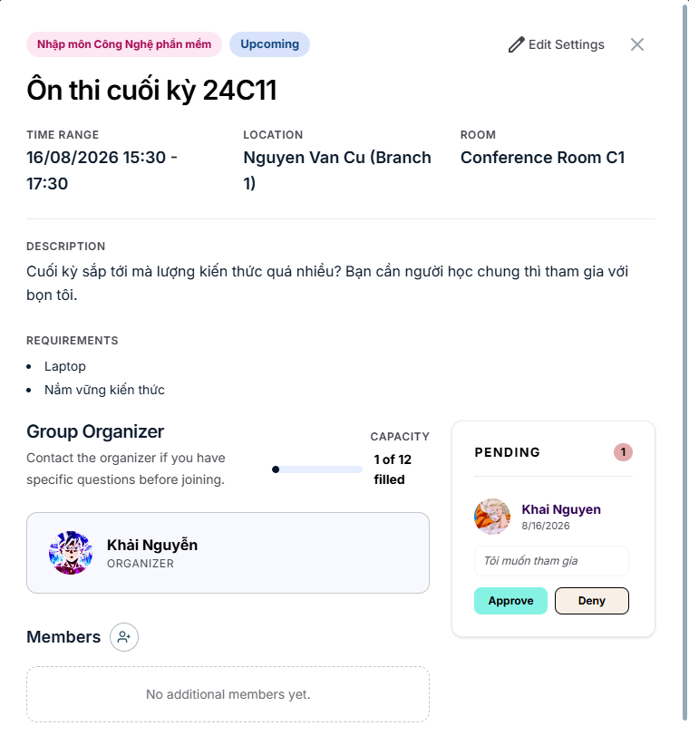

        
<em>Figure P-SG-11-BF01 – Review Join Request</em>

        
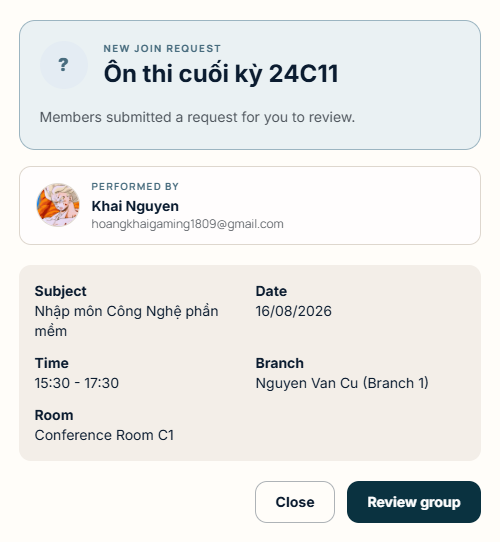

        
<em>Figure P-SG-11-BF01 (Bell) – Join Request Notification</em>

        
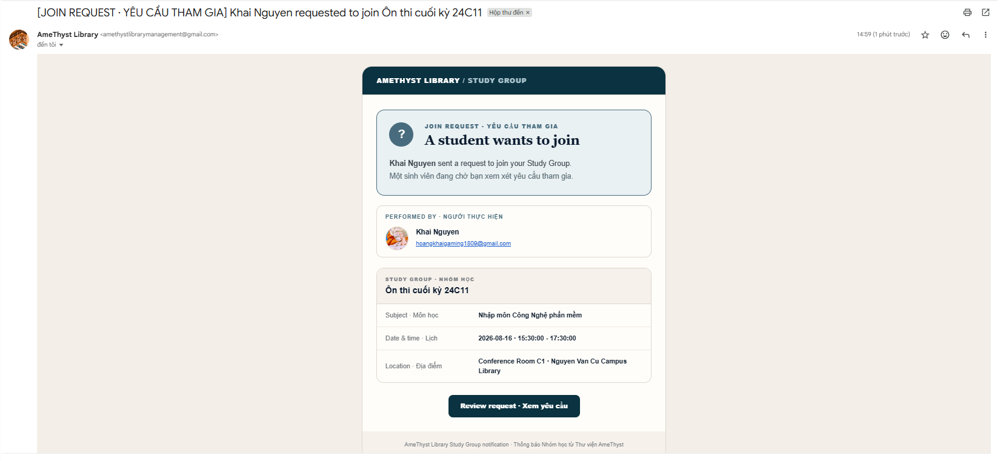

        
<em>Figure P-SG-11-BF01 (Mail) – Join Request Email Notification</em>

      </td>
    </tr>
  </tbody>
</table>

---

### UC-SG-12: Respond to Invitation

<table width="100%" border="1" cellpadding="8" cellspacing="0" style="border-collapse: collapse; font-family: Arial, sans-serif; font-size: 14px; border: 1px solid #d1d5db; margin-bottom: 20px;">
  <thead>
    <tr style="background-color: #1e3a8a; color: #ffffff;">
      <th colspan="2" style="text-align: left; padding: 12px; font-size: 16px;">Use Case: Respond to Invitation</th>
    </tr>
  </thead>
  <tbody>
    <tr>
      <td width="22%" style="background-color: #f8fafc; font-weight: bold; vertical-align: top;">Use Case ID</td>
      <td style="vertical-align: top;"><strong>UC-SG-12</strong></td>
    </tr>
    <tr>
      <td style="background-color: #f8fafc; font-weight: bold; vertical-align: top;">Brief Description</td>
      <td style="vertical-align: top;">Allows the invited Reader, acting as a Prospective Member, to accept or decline a pending study-group invitation. Acceptance creates membership only when the group still has capacity.</td>
    </tr>
    <tr>
      <td style="background-color: #f8fafc; font-weight: bold; vertical-align: top;">Actor(s)</td>
      <td style="vertical-align: top;">Prospective Member</td>
    </tr>
    <tr>
      <td style="background-color: #f8fafc; font-weight: bold; vertical-align: top;">Preconditions</td>
      <td style="vertical-align: top;">
        <ul style="margin: 0; padding-left: 20px; line-height: 1.5;">
          <li><strong>Authentication:</strong> The actor is signed in as a Reader.</li>
          <li><strong>Invitation Ownership:</strong> The actor is the recipient of the selected invitation.</li>
          <li><strong>Invitation State:</strong> The selected record is a pending invitation, not a join request.</li>
          <li><strong>Group State:</strong> The study group exists, has not started, and is not cancelled, completed, or expired.</li>
        </ul>
      </td>
    </tr>
    <tr>
      <td style="background-color: #f8fafc; font-weight: bold; vertical-align: top;">Flow of Events (Basic Flow)</td>
      <td style="vertical-align: top;">
        <ol style="margin: 0; padding-left: 20px; line-height: 1.6;">
          <li><strong>[Actor Action]:</strong> The Prospective Member opens the list of pending study-group invitations.</li>
          <li><strong>[System Response]:</strong> The system displays invitations for future groups that can still receive a response.</li>
          <li><strong>[Actor Action]:</strong> The Prospective Member selects an invitation and chooses <em>Accept</em> or <em>Decline</em>.</li>
          <li><strong>[Validation]:</strong> The system locks the group and invitation records, then verifies recipient ownership, invitation type, pending status, and current group state.</li>
          <li><strong>[Accept Branch]:</strong> If accepted, the system verifies that the group is upcoming and has capacity, marks the invitation as approved, increases the member count, and marks the group full when capacity is reached.</li>
          <li><strong>[Decline Branch]:</strong> If declined, the system marks the invitation as denied without creating membership or changing the member count.</li>
          <li><strong>[Data Processing]:</strong> The system records the decision time and commits the response in one transaction.</li>
          <li><strong>[Display Result]:</strong> The system refreshes the invitation list and notifies the Host. An acceptance also triggers the applicable membership email to the Host.</li>
        </ol>
      </td>
    </tr>
    <tr>
      <td style="background-color: #f8fafc; font-weight: bold; vertical-align: top;">Alternative / Exception Flows</td>
      <td style="vertical-align: top;">
        <ul style="margin: 0; padding-left: 20px; line-height: 1.5;">
          <li style="margin-bottom: 8px;">
            <strong>Wrong Recipient (Step 4):</strong> If the signed-in Reader is not the invitation recipient, the system rejects the response.
             <strong>Postcondition (Exception Flow):</strong> The invitation and membership remain unchanged.
          </li>
          <li style="margin-bottom: 8px;">
            <strong>Invitation Missing or Already Resolved (Step 4):</strong> If the invitation does not exist, is not an invitation, or is no longer pending, the system reports that it cannot be processed.
             <strong>Postcondition (Exception Flow):</strong> No duplicate response or membership is created.
          </li>
          <li style="margin-bottom: 8px;">
            <strong>Acceptance Not Available (Step 5):</strong> If the group has started, is closed, or is full, the system rejects acceptance.
             <strong>Postcondition (Exception Flow):</strong> The invitation remains pending and no membership is created.
          </li>
          <li>
            <strong>Concurrent Capacity Change (Steps 4–7):</strong> If another transaction takes the final place first, the system rolls back this response and displays the latest group state.
             <strong>Postcondition (Exception Flow):</strong> The invitation remains pending and the group capacity is not exceeded.
          </li>
        </ul>
      </td>
    </tr>
    <tr>
      <td style="background-color: #f8fafc; font-weight: bold; vertical-align: top;">Postconditions</td>
      <td style="vertical-align: top;">
        <ul style="margin: 0; padding-left: 20px; line-height: 1.5;">
          <li><strong>Accepted:</strong> The invitation is approved, the invitee becomes a Study Group Member, and the member count and group status reflect the new membership.</li>
          <li><strong>Declined:</strong> The invitation is denied and no membership or member-count change is made.</li>
          <li><strong>Notification:</strong> The Host receives the invitation-response notification.</li>
        </ul>
      </td>
    </tr>
    <tr>
      <td style="background-color: #f8fafc; font-weight: bold; vertical-align: top;">Special Requirements</td>
      <td style="vertical-align: top;">
        <ul style="margin: 0; padding-left: 20px; line-height: 1.5;">
          <li><strong>Authorization:</strong> Only the invitation recipient may accept or decline it.</li>
          <li><strong>Concurrency:</strong> The group and invitation are locked and updated transactionally so capacity cannot be exceeded.</li>
          <li><strong>Consistency:</strong> A pending invitation can be resolved only once; a failed acceptance leaves it pending.</li>
          <li><strong>Delivery Isolation:</strong> A notification or email delivery failure after commit must not reverse the recorded response.</li>
        </ul>
      </td>
    </tr>
    <tr>
      <td style="background-color: #f8fafc; font-weight: bold; vertical-align: top;">Extension Points</td>
      <td style="vertical-align: top;">None</td>
    </tr>
    <tr>
      <td style="background-color: #f8fafc; font-weight: bold; vertical-align: top;">Prototype Screen</td>
      <td style="vertical-align: top;">
        
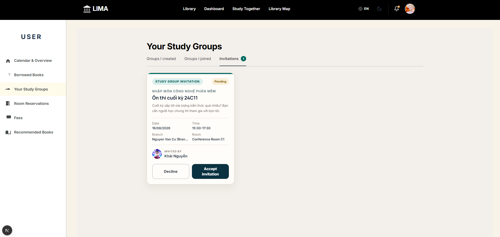

        
<em>Figure P-SG-12-BF01 – Respond to Invitation</em>

        
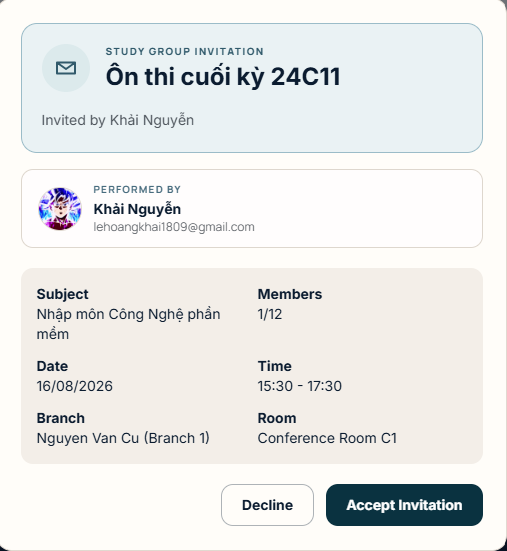

        
<em>Figure P-SG-12-BF01 (Bell) – Invitation Response Notification</em>

        
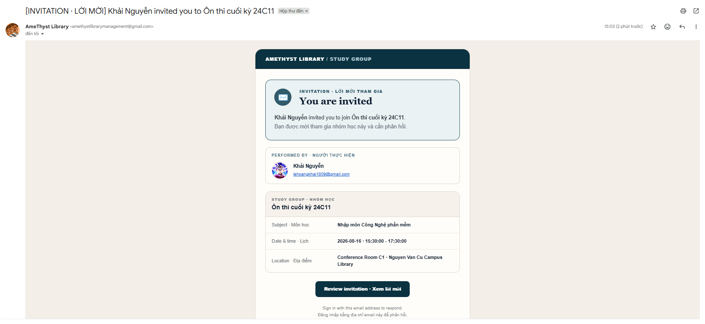

        
<em>Figure P-SG-12-BF01 (Mail) – Invitation Response Email Notification</em>

      </td>
    </tr>
  </tbody>
</table>

## VII. AI Recommendation

### Use case diagram

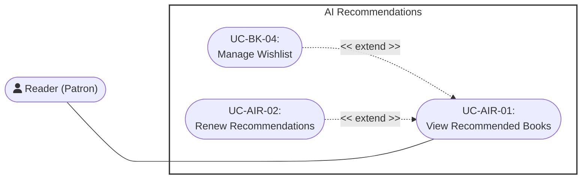

---

### UC-AIR-01: View Recommended Books

<table width="100%" border="1" cellpadding="8" cellspacing="0" style="border-collapse: collapse; font-family: Arial, sans-serif; font-size: 14px; border: 1px solid #d1d5db; margin-bottom: 20px;">
  <thead>
    <tr style="background-color: #1e3a8a; color: #ffffff;">
      <th colspan="2" style="text-align: left; padding: 12px; font-size: 16px;">
        Use Case: View Recommended Books
      </th>
    </tr>
  </thead>
  <tbody>
    <tr>
      <td width="22%" style="background-color: #f8fafc; font-weight: bold; vertical-align: top;">Use Case ID</td>
      <td style="vertical-align: top;"><strong>UC-AIR-01</strong></td>
    </tr>
    <tr>
      <td style="background-color: #f8fafc; font-weight: bold; vertical-align: top;">Brief Description</td>
      <td style="vertical-align: top;">
        Allows a Reader to view the personalized recommendation feed generated from current catalog and interaction data.
      </td>
    </tr>
    <tr>
      <td style="background-color: #f8fafc; font-weight: bold; vertical-align: top;">Actor(s)</td>
      <td style="vertical-align: top;">Reader</td>
    </tr>
    <tr>
      <td style="background-color: #f8fafc; font-weight: bold; vertical-align: top;">Preconditions</td>
      <td style="vertical-align: top;">
        <ul style="margin: 0; padding-left: 20px; line-height: 1.5;">
          <li><strong>Client Identity Verification:</strong> The session context maintains an actively verified and authenticated state flag.</li>
        </ul>
      </td>
    </tr>
    <tr>
      <td style="background-color: #f8fafc; font-weight: bold; vertical-align: top;">Flow of Events (Basic Flow)</td>
      <td style="vertical-align: top;">
        <ol style="margin: 0; padding-left: 20px; line-height: 1.6;">
          <li><strong>[Actor Action]:</strong> The user navigates to the Recommended Book Dashboard within the main Dashboard tab workspace.</li>
          <li><strong>[System Response]:</strong> The system first checks its short-lived feed cache, then the active recommendation rows in PostgreSQL; if neither is available, it generates a feed through the recommendation subsystem.</li>
          <li><strong>[Display Result]:</strong> The system renders the prioritized personalized book list.</li>
          <li><strong>[Actor Action]:</strong> The user reviews the recommendations, opens individual details panes to examine specific book records, and saves relevant candidate titles into their personal favorites collection array.</li>
        </ol>
      </td>
    </tr>
    <tr>
      <td style="background-color: #f8fafc; font-weight: bold; vertical-align: top;">Alternative / Exception Flows</td>
      <td style="vertical-align: top;">
        <ul style="margin: 0; padding-left: 20px; line-height: 1.5;">
          <li style="margin-bottom: 8px;">
            <strong>Recommendation Generation Error (Step 3):</strong> If the system encounters an error or timeout while compiling the recommendation data structures:
            <ol style="margin-top: 4px; margin-bottom: 4px; padding-left: 20px;">
              <li>The system interrupts the presentation flow script.</li>
              <li>The system throws a contextual error notification alert block onto the screen interface.</li>
            </ol>
            <strong>Postcondition (Alternative Flow):</strong> No recommended books are displayed; the user workspace safely handles the failure and informs the individual that no recommendations are currently available.
          </li>
        </ul>
      </td>
    </tr>
    <tr>
      <td style="background-color: #f8fafc; font-weight: bold; vertical-align: top;">Postconditions</td>
      <td style="vertical-align: top;">
        <ul style="margin: 0; padding-left: 20px;">
          <li><strong>Dashboard Presentation Complete:</strong> The targeted AI-generated list of book recommendations populates the visualization grid array successfully.</li>
          <li><strong>Performance Cache Staging:</strong> The calculated recommendation ranking matrix commits to high-speed cache memory systems to accelerate subsequent rendering retrieval loops.</li>
        </ul>
      </td>
    </tr>
    <tr>
      <td style="background-color: #f8fafc; font-weight: bold; vertical-align: top;">Special Requirements</td>
      <td style="vertical-align: top;">
        <ul style="margin: 0; padding-left: 20px;">
          <li><strong>Recent Interest Real-Time Extraction:</strong> The displayed list compilation must dynamically track and accurately reflect the user's most recent reading and query interest parameters.</li>
          <li><strong>Cold start for new users:</strong> Recommendation generation based on global trend (books with high borrow turns or hot keywords).</li>
          <li><strong>Analytical Behavioral Tracking:</strong> The system must actively log all granular user interaction vectors (e.g. searching books, adding entries to wishlists, processing reservations) to continually update and train downstream machine learning recommendations.</li>
        </ul>
      </td>
    </tr>
    <tr>
      <td style="background-color: #f8fafc; font-weight: bold; vertical-align: top;">Extension Points</td>
      <td style="vertical-align: top;">
        <ul style="margin: 0; padding-left: 20px;">
          <li><strong>Renew Recommendations:</strong> Available while viewing the current recommendation feed.</li>
        </ul>
      </td>
    </tr>
    <tr>
      <td style="background-color: #f8fafc; font-weight: bold; vertical-align: top;">Prototype Screen</td>
      <td style="vertical-align: top;">
        

        
<em>Figure P-AIR-01-BF01 – Recommended Books</em>

        

        
<em>Figure P-AIR-01-AF01 – Recommendation Error</em>

      </td>
    </tr>
  </tbody>
</table>

---

### UC-AIR-02: Renew Recommendations

<table width="100%" border="1" cellpadding="8" cellspacing="0" style="border-collapse: collapse; font-family: Arial, sans-serif; font-size: 14px; border: 1px solid #d1d5db; margin-bottom: 20px;">
  <thead>
    <tr style="background-color: #1e3a8a; color: #ffffff;">
      <th colspan="2" style="text-align: left; padding: 12px; font-size: 16px;">
        Use Case: Renew Recommendations
      </th>
    </tr>
  </thead>
  <tbody>
    <tr>
      <td width="22%" style="background-color: #f8fafc; font-weight: bold; vertical-align: top;">Use Case ID</td>
      <td style="vertical-align: top;"><strong>UC-AIR-02</strong></td>
    </tr>
    <tr>
      <td style="background-color: #f8fafc; font-weight: bold; vertical-align: top;">Brief Description</td>
      <td style="vertical-align: top;">
        Allows a Reader to retire the active recommendation feed and request a newly generated list.
         <em>(Includes / Extends: <strong>Extends UC-AIR-01 (View Recommended Books) — extension point: renewing the displayed feed.</strong>)</em>
      </td>
    </tr>
    <tr>
      <td style="background-color: #f8fafc; font-weight: bold; vertical-align: top;">Actor(s)</td>
      <td style="vertical-align: top;">Reader</td>
    </tr>
    <tr>
      <td style="background-color: #f8fafc; font-weight: bold; vertical-align: top;">Preconditions</td>
      <td style="vertical-align: top;">
        <ul style="margin: 0; padding-left: 20px; line-height: 1.5;">
          <li><strong>Workspace Context Active:</strong> The user is actively executing workspace visualization tasks within <code>UC-AIR-01</code>.</li>
        </ul>
      </td>
    </tr>
    <tr>
      <td style="background-color: #f8fafc; font-weight: bold; vertical-align: top;">Flow of Events (Basic Flow)</td>
      <td style="vertical-align: top;">
        <ol style="margin: 0; padding-left: 20px; line-height: 1.6;">
          <li><strong>[Actor Action]:</strong> While actively viewing the recommended book collection lists, the user selects the <code>Renew</code> buttons.</li>
          <li><strong>[System Response]:</strong> The system intercepts the request command payload and systematically invokes the AI Recommend Module.</li>
          <li><strong>[Data Processing]:</strong> The included AI Recommend Module processes the user's behaviors and evaluates a clean set of recommendations.</li>
          <li><strong>[Data Processing]:</strong> The system marks current recommendation rows as renewed, invalidates the active cache entry, and persists a freshly generated feed.</li>
          <li><strong>[Display Result]:</strong> The system refreshes the client screen dashboard panel to render the fresh, updated recommended book list.</li>
        </ol>
      </td>
    </tr>
    <tr>
      <td style="background-color: #f8fafc; font-weight: bold; vertical-align: top;">Alternative / Exception Flows</td>
      <td style="vertical-align: top;">
        <ul style="margin: 0; padding-left: 20px; line-height: 1.5;">
          <li style="margin-bottom: 8px;">
            <strong>Core Module Execution Crash (Step 2):</strong> If the included AI Recommend Module fails to generate a new list due to model processing errors or connectivity breaks:
            <ol style="margin-top: 4px; margin-bottom: 4px; padding-left: 20px;">
              <li>The system aborts the data staging transaction loops.</li>
              <li>The system displays a transactional fallback error alert text block on screen.</li>
              <li>The system retains the previous recommendation list array properties intact within the active display container.</li>
            </ol>
            <strong>Postcondition (Alternative Flow):</strong> No structural changes commit against the user's current recommendation dataset; the user interface notifies the individual of the operational failure.
          </li>
        </ul>
      </td>
    </tr>
    <tr>
      <td style="background-color: #f8fafc; font-weight: bold; vertical-align: top;">Postconditions</td>
      <td style="vertical-align: top;">
        <ul style="margin: 0; padding-left: 20px;">
          <li><strong>Ledger Regeneration Complete:</strong> The user's recommendation data structures are successfully overwritten, cached, and updated across the display interface viewport.</li>
        </ul>
      </td>
    </tr>
    <tr>
      <td style="background-color: #f8fafc; font-weight: bold; vertical-align: top;">Special Requirements</td>
      <td style="vertical-align: top;">
        <ul style="margin: 0; padding-left: 20px;">
          <li><strong>API Rate Limiting Guards:</strong> To prevent heavy backend compute degradation, reset invocation requests must enforce strict rate-limiting caps to control repetitive sequential manual regenerations.</li>
          <li><strong>Candidate Non-Overlap Constraints:</strong> The freshly generated recommendation candidate array rows must be evaluated against the immediately preceding listing to prevent redundant content repetition.</li>
        </ul>
      </td>
    </tr>
    <tr>
      <td style="background-color: #f8fafc; font-weight: bold; vertical-align: top;">Extension Points</td>
      <td style="vertical-align: top;">
        None
      </td>
    </tr>
    <tr>
      <td style="background-color: #f8fafc; font-weight: bold; vertical-align: top;">Prototype Screen</td>
      <td style="vertical-align: top;">
        

        
<em>Figure P-AIR-02-BF01 – Reset Recommendation Confirmation</em>

      </td>
    </tr>
  </tbody>
</table>

---

## VIII. Librarian

### Use case diagram

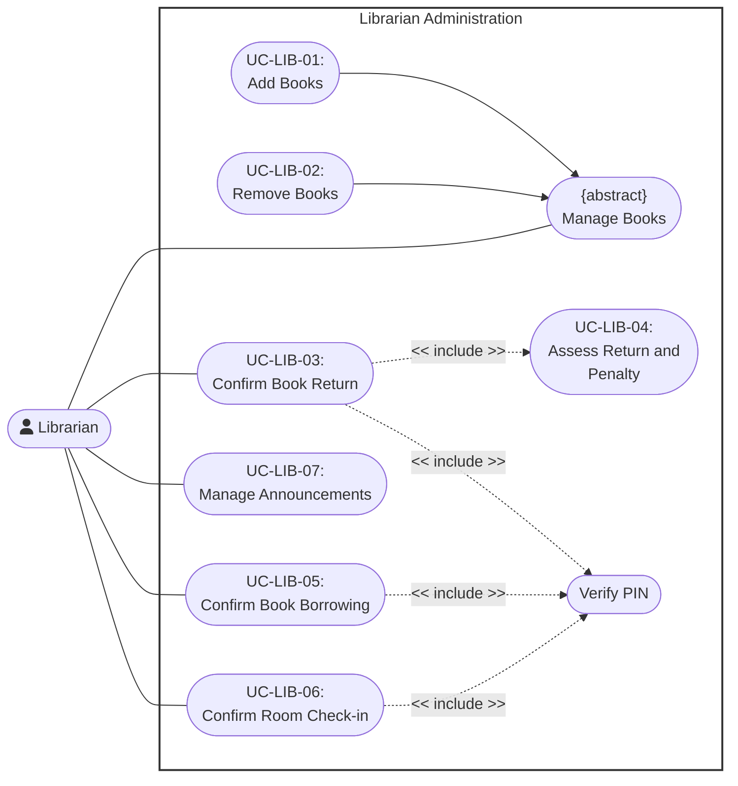

---

### UC-LIB-01: Add Books

<table width="100%" border="1" cellpadding="8" cellspacing="0" style="border-collapse: collapse; font-family: Arial, sans-serif; font-size: 14px; border: 1px solid #d1d5db; margin-bottom: 20px;">
  <thead>
    <tr style="background-color: #1e3a8a; color: #ffffff;">
      <th colspan="2" style="text-align: left; padding: 12px; font-size: 16px;">
        Use Case: Add Books
      </th>
    </tr>
  </thead>
  <tbody>
    <tr>
      <td width="22%" style="background-color: #f8fafc; font-weight: bold; vertical-align: top;">Use Case ID</td>
      <td style="vertical-align: top;"><strong>UC-LIB-01</strong></td>
    </tr>
    <tr>
      <td style="background-color: #f8fafc; font-weight: bold; vertical-align: top;">Brief Description</td>
      <td style="vertical-align: top;">
        Allows the Librarian to add a new book record to the library catalog.
      </td>
    </tr>
    <tr>
      <td style="background-color: #f8fafc; font-weight: bold; vertical-align: top;">Actor(s)</td>
      <td style="vertical-align: top;">Librarian</td>
    </tr>
    <tr>
      <td style="background-color: #f8fafc; font-weight: bold; vertical-align: top;">Preconditions</td>
      <td style="vertical-align: top;">
        <ul style="margin: 0; padding-left: 20px; line-height: 1.5;">
          <li><strong>Verified Authentication State:</strong> The Librarian has successfully authenticated.</li>
          <li><strong>Catalog Uniqueness Check:</strong> The book to be added does not already exist in the catalog.</li>
        </ul>
      </td>
    </tr>
    <tr>
      <td style="background-color: #f8fafc; font-weight: bold; vertical-align: top;">Flow of Events (Basic Flow)</td>
      <td style="vertical-align: top;">
        <ol style="margin: 0; padding-left: 20px; line-height: 1.6;">
          <li><strong>[Actor Action]:</strong> The Librarian selects the "Add Book" option.</li>
          <li><strong>[System Response]:</strong> The system displays the book entry form.</li>
          <li><strong>[Actor Action]:</strong> The Librarian enters the book's details, including title and author.</li>
          <li><strong>[Actor Action]:</strong> The Librarian submits the form.</li>
          <li><strong>[Data Processing]:</strong> The system validates the entered data and confirms the book is not already in the catalog.</li>
          <li><strong>[Data Processing]:</strong> The system stores the new book record.</li>
          <li><strong>[Display Result]:</strong> The system confirms the addition to the Librarian.</li>
        </ol>
      </td>
    </tr>
    <tr>
      <td style="background-color: #f8fafc; font-weight: bold; vertical-align: top;">Alternative / Exception Flows</td>
      <td style="vertical-align: top;">
        <ul style="margin: 0; padding-left: 20px; line-height: 1.5;">
          <li style="margin-bottom: 8px;">
            <strong>Invalid or Duplicate Data (Step 5):</strong> If the entered data is invalid or matches an existing catalog entry:
            <ol style="margin-top: 4px; margin-bottom: 4px; padding-left: 20px;">
              <li>The system rejects the submission.</li>
              <li>The system displays an error message and prompts the Librarian to correct the entry.</li>
            </ol>
            <strong>Postcondition (Alternative Flow):</strong> No new book record is created; the entry form remains open pending correction.
          </li>
        </ul>
      </td>
    </tr>
    <tr>
      <td style="background-color: #f8fafc; font-weight: bold; vertical-align: top;">Postconditions</td>
      <td style="vertical-align: top;">
        <ul style="margin: 0; padding-left: 20px;">
          <li><strong>Catalog Update:</strong> A new book record is stored in the catalog and becomes available for borrowing.</li>
        </ul>
      </td>
    </tr>
    <tr>
      <td style="background-color: #f8fafc; font-weight: bold; vertical-align: top;">Special Requirements</td>
      <td style="vertical-align: top;">
        <ul style="margin: 0; padding-left: 20px;">
          <li><strong>Catalog Uniqueness:</strong> Each book's identifying information must be unique within the catalog.</li>
        </ul>
      </td>
    </tr>
    <tr>
      <td style="background-color: #f8fafc; font-weight: bold; vertical-align: top;">Extension Points</td>
      <td style="vertical-align: top;">
        None
      </td>
    </tr>
    <tr>
      <td style="background-color: #f8fafc; font-weight: bold; vertical-align: top;">Prototype Screen</td>
      <td style="vertical-align: top;">
        

        
<em>Figure P-LIB-01-BF01 – Book Management</em>

        

        
<em>Figure P-LIB-01-BF02 – Add Book Form</em>

      </td>
    </tr>
  </tbody>
</table>

---

### UC-LIB-02: Remove Books

<table width="100%" border="1" cellpadding="8" cellspacing="0" style="border-collapse: collapse; font-family: Arial, sans-serif; font-size: 14px; border: 1px solid #d1d5db; margin-bottom: 20px;">
  <thead>
    <tr style="background-color: #1e3a8a; color: #ffffff;">
      <th colspan="2" style="text-align: left; padding: 12px; font-size: 16px;">
        Use Case: Remove Books
      </th>
    </tr>
  </thead>
  <tbody>
    <tr>
      <td width="22%" style="background-color: #f8fafc; font-weight: bold; vertical-align: top;">Use Case ID</td>
      <td style="vertical-align: top;"><strong>UC-LIB-02</strong></td>
    </tr>
    <tr>
      <td style="background-color: #f8fafc; font-weight: bold; vertical-align: top;">Brief Description</td>
      <td style="vertical-align: top;">
        Allows the Librarian to remove an existing book record from the library catalog.
      </td>
    </tr>
    <tr>
      <td style="background-color: #f8fafc; font-weight: bold; vertical-align: top;">Actor(s)</td>
      <td style="vertical-align: top;">Librarian</td>
    </tr>
    <tr>
      <td style="background-color: #f8fafc; font-weight: bold; vertical-align: top;">Preconditions</td>
      <td style="vertical-align: top;">
        <ul style="margin: 0; padding-left: 20px; line-height: 1.5;">
          <li><strong>Verified Authentication State:</strong> The Librarian has successfully authenticated.</li>
          <li><strong>Existing Catalog Entry:</strong> The book to be removed exists in the catalog.</li>
        </ul>
      </td>
    </tr>
    <tr>
      <td style="background-color: #f8fafc; font-weight: bold; vertical-align: top;">Flow of Events (Basic Flow)</td>
      <td style="vertical-align: top;">
        <ol style="margin: 0; padding-left: 20px; line-height: 1.6;">
          <li><strong>[Actor Action]:</strong> The Librarian selects the "Remove Book" option.</li>
          <li><strong>[System Response]:</strong> The system displays a book search interface.</li>
          <li><strong>[Actor Action]:</strong> The Librarian searches for and selects the book to remove.</li>
          <li><strong>[Data Processing]:</strong> The system checks the book's current loan status.</li>
          <li><strong>[Actor Action]:</strong> The Librarian confirms the removal.</li>
          <li><strong>[Data Processing]:</strong> The system removes the book record.</li>
          <li><strong>[Display Result]:</strong> The system confirms the removal to the Librarian.</li>
        </ol>
      </td>
    </tr>
    <tr>
      <td style="background-color: #f8fafc; font-weight: bold; vertical-align: top;">Alternative / Exception Flows</td>
      <td style="vertical-align: top;">
        <ul style="margin: 0; padding-left: 20px; line-height: 1.5;">
          <li style="margin-bottom: 8px;">
            <strong>Book Currently on Loan (Step 4):</strong> If the selected book is currently on loan:
            <ol style="margin-top: 4px; margin-bottom: 4px; padding-left: 20px;">
              <li>The system prevents the removal.</li>
              <li>The system displays a warning to the Librarian.</li>
            </ol>
            <strong>Postcondition (Alternative Flow):</strong> No removal is performed; the book record remains unchanged.
          </li>
        </ul>
      </td>
    </tr>
    <tr>
      <td style="background-color: #f8fafc; font-weight: bold; vertical-align: top;">Postconditions</td>
      <td style="vertical-align: top;">
        <ul style="margin: 0; padding-left: 20px;">
          <li><strong>Catalog Update:</strong> The selected book record is removed from the catalog.</li>
        </ul>
      </td>
    </tr>
    <tr>
      <td style="background-color: #f8fafc; font-weight: bold; vertical-align: top;">Special Requirements</td>
      <td style="vertical-align: top;">
        <ul style="margin: 0; padding-left: 20px;">
          <li><strong>Loan Status Restriction:</strong> A book that is currently on loan cannot be removed until it is returned.</li>
        </ul>
      </td>
    </tr>
    <tr>
      <td style="background-color: #f8fafc; font-weight: bold; vertical-align: top;">Extension Points</td>
      <td style="vertical-align: top;">
        None
      </td>
    </tr>
    <tr>
      <td style="background-color: #f8fafc; font-weight: bold; vertical-align: top;">Prototype Screen</td>
      <td style="vertical-align: top;">
        

        
<em>Figure P-LIB-02-BF01 – Remove Book Confirmation</em>

      </td>
    </tr>
  </tbody>
</table>

---

### UC-LIB-03: Confirm Book Return

<table width="100%" border="1" cellpadding="8" cellspacing="0" style="border-collapse: collapse; font-family: Arial, sans-serif; font-size: 14px; border: 1px solid #d1d5db; margin-bottom: 20px;">
  <thead>
    <tr style="background-color: #1e3a8a; color: #ffffff;">
      <th colspan="2" style="text-align: left; padding: 12px; font-size: 16px;">
        Use Case: Confirm Book Return
      </th>
    </tr>
  </thead>
  <tbody>
    <tr>
      <td width="22%" style="background-color: #f8fafc; font-weight: bold; vertical-align: top;">Use Case ID</td>
      <td style="vertical-align: top;"><strong>UC-LIB-03</strong></td>
    </tr>
    <tr>
      <td style="background-color: #f8fafc; font-weight: bold; vertical-align: top;">Brief Description</td>
      <td style="vertical-align: top;">
        Allows the Librarian to verify a return PIN, inspect the returned copy, assess any penalty, and complete the return.
         <em>(Includes / Extends: <strong>Includes UC-LIB-04 (Assess Return and Penalty).</strong>)</em>
      </td>
    </tr>
    <tr>
      <td style="background-color: #f8fafc; font-weight: bold; vertical-align: top;">Actor(s)</td>
      <td style="vertical-align: top;">Librarian</td>
    </tr>
    <tr>
      <td style="background-color: #f8fafc; font-weight: bold; vertical-align: top;">Preconditions</td>
      <td style="vertical-align: top;">
        <ul style="margin: 0; padding-left: 20px; line-height: 1.5;">
          <li><strong>Verified Authentication State:</strong> The Librarian has successfully authenticated.</li>
          <li><strong>Active Loan Record:</strong> An active loan record exists for the book being returned.</li>
        </ul>
      </td>
    </tr>
    <tr>
      <td style="background-color: #f8fafc; font-weight: bold; vertical-align: top;">Flow of Events (Basic Flow)</td>
      <td style="vertical-align: top;">
        <ol style="margin: 0; padding-left: 20px; line-height: 1.6;">
          <li><strong>[Actor Action]:</strong> The Librarian enters the Reader's return PIN.</li>
          <li><strong>[Data Processing]:</strong> The system verifies the PIN and retrieves the matching active borrowing record.</li>
          <li><strong>[Actor Action]:</strong> The Librarian records the copy condition and whether the copy is lost.</li>
          <li><strong>[Data Processing]:</strong> Through UC-LIB-04, the system previews overdue, damage or loss charges and waits for confirmation.</li>
          <li><strong>[Data Processing]:</strong> The system records the return and any penalty, restores inventory unless the copy is lost, and decrements the Reader's active borrow count.</li>
        </ol>
      </td>
    </tr>
    <tr>
      <td style="background-color: #f8fafc; font-weight: bold; vertical-align: top;">Alternative / Exception Flows</td>
      <td style="vertical-align: top;">
        <ul style="margin: 0; padding-left: 20px; line-height: 1.5;">
          <li style="margin-bottom: 8px;">
            <strong>Penalty Confirmation Declined (Step 4):</strong> If the Librarian does not confirm the assessed return and penalty:
            <ol style="margin-top: 4px; margin-bottom: 4px; padding-left: 20px;">
              <li>The system makes no return, inventory or penalty changes.</li>
            </ol>
            <strong>Postcondition (Alternative Flow):</strong> The borrowing record remains active.
          </li>
        </ul>
      </td>
    </tr>
    <tr>
      <td style="background-color: #f8fafc; font-weight: bold; vertical-align: top;">Postconditions</td>
      <td style="vertical-align: top;">
        <ul style="margin: 0; padding-left: 20px;">
          <li><strong>Return Completed:</strong> The return and any applicable penalty are recorded; inventory is restored unless the item was marked lost.</li>
        </ul>
      </td>
    </tr>
    <tr>
      <td style="background-color: #f8fafc; font-weight: bold; vertical-align: top;">Special Requirements</td>
      <td style="vertical-align: top;">
        <ul style="margin: 0; padding-left: 20px;">
          <li><strong>Assessment Timing:</strong> The penalty assessment occurs after return-PIN verification and condition entry, before the Librarian confirms persistence.</li>
        </ul>
      </td>
    </tr>
    <tr>
      <td style="background-color: #f8fafc; font-weight: bold; vertical-align: top;">Extension Points</td>
      <td style="vertical-align: top;">
        <ul style="margin: 0; padding-left: 20px;">
          <li><strong>Assess Return and Penalty:</strong> Invoked after PIN verification and return-condition entry.</li>
        </ul>
      </td>
    </tr>
    <tr>
      <td style="background-color: #f8fafc; font-weight: bold; vertical-align: top;">Prototype Screen</td>
      <td style="vertical-align: top;">
        

        
<em>Figure P-LIB-03-BF01 – Book Return Inspection</em>

        

        
<em>Figure P-LIB-03-BF02 – Confirm Book Return</em>

      </td>
    </tr>
  </tbody>
</table>

---

### UC-LIB-04: Assess Return and Penalty

<table width="100%" border="1" cellpadding="8" cellspacing="0" style="border-collapse: collapse; font-family: Arial, sans-serif; font-size: 14px; border: 1px solid #d1d5db; margin-bottom: 20px;">
  <thead>
    <tr style="background-color: #1e3a8a; color: #ffffff;">
      <th colspan="2" style="text-align: left; padding: 12px; font-size: 16px;">
        Use Case: Assess Return and Penalty
      </th>
    </tr>
  </thead>
  <tbody>
    <tr>
      <td width="22%" style="background-color: #f8fafc; font-weight: bold; vertical-align: top;">Use Case ID</td>
      <td style="vertical-align: top;"><strong>UC-LIB-04</strong></td>
    </tr>
    <tr>
      <td style="background-color: #f8fafc; font-weight: bold; vertical-align: top;">Brief Description</td>
      <td style="vertical-align: top;">
        Calculates and previews the overdue, damaged-book or lost-book charges used while confirming a return.
         <em>(Includes / Extends: <strong>Included by UC-LIB-03 (Confirm Book Return).</strong>)</em>
      </td>
    </tr>
    <tr>
      <td style="background-color: #f8fafc; font-weight: bold; vertical-align: top;">Actor(s)</td>
      <td style="vertical-align: top;">Librarian</td>
    </tr>
    <tr>
      <td style="background-color: #f8fafc; font-weight: bold; vertical-align: top;">Preconditions</td>
      <td style="vertical-align: top;">
        <ul style="margin: 0; padding-left: 20px; line-height: 1.5;">
          <li><strong>Verified Authentication State:</strong> The Librarian has successfully authenticated.</li>
          <li><strong>Verified Return:</strong> UC-LIB-03 has resolved an active borrowing record and supplied the return date and condition.</li>
        </ul>
      </td>
    </tr>
    <tr>
      <td style="background-color: #f8fafc; font-weight: bold; vertical-align: top;">Flow of Events (Basic Flow)</td>
      <td style="vertical-align: top;">
        <ol style="margin: 0; padding-left: 20px; line-height: 1.6;">
          <li><strong>[Data Processing]:</strong> The system calculates overdue days from the borrowing due date.</li>
          <li><strong>[Actor Action]:</strong> The Librarian supplies the inspected condition and lost-item flag.</li>
          <li><strong>[Data Processing]:</strong> The system applies the configured overdue, damage and loss rules.</li>
          <li><strong>[Display Result]:</strong> The system returns an itemized penalty preview to UC-LIB-03 for confirmation.</li>
        </ol>
      </td>
    </tr>
    <tr>
      <td style="background-color: #f8fafc; font-weight: bold; vertical-align: top;">Alternative / Exception Flows</td>
      <td style="vertical-align: top;">
        <ul style="margin: 0; padding-left: 20px; line-height: 1.5;">
          <li style="margin-bottom: 8px;">
            <strong>No Penalty Applies:</strong> If the return is on time and the copy has no damage or loss:
            <ol style="margin-top: 4px; margin-bottom: 4px; padding-left: 20px;">
              <li>The system returns a zero-value penalty preview and UC-LIB-03 continues normally.</li>
            </ol>
            <strong>Postcondition (Alternative Flow):</strong> No loan record is created.
          </li>
        </ul>
      </td>
    </tr>
    <tr>
      <td style="background-color: #f8fafc; font-weight: bold; vertical-align: top;">Postconditions</td>
      <td style="vertical-align: top;">
        <ul style="margin: 0; padding-left: 20px;">
          <li><strong>Assessment Ready:</strong> An itemized penalty preview is available to UC-LIB-03; persistence occurs only when the return is confirmed.</li>
        </ul>
      </td>
    </tr>
    <tr>
      <td style="background-color: #f8fafc; font-weight: bold; vertical-align: top;">Special Requirements</td>
      <td style="vertical-align: top;">
        <ul style="margin: 0; padding-left: 20px;">
          <li><strong>Policy Consistency:</strong> Calculations use the current system-configuration values for overdue, damage and loss charges.</li>
        </ul>
      </td>
    </tr>
    <tr>
      <td style="background-color: #f8fafc; font-weight: bold; vertical-align: top;">Extension Points</td>
      <td style="vertical-align: top;">
        None
      </td>
    </tr>
    <tr>
      <td style="background-color: #f8fafc; font-weight: bold; vertical-align: top;">Prototype Screen</td>
      <td style="vertical-align: top;">
        

        
<em>Figure P-LIB-04-BF01 – Return Assessment Summary (prototype image to be refreshed)</em>

      </td>
    </tr>
  </tbody>
</table>

---

### UC-LIB-05: Confirm Book Borrowing

<table width="100%" border="1" cellpadding="8" cellspacing="0" style="border-collapse: collapse; font-family: Arial, sans-serif; font-size: 14px; border: 1px solid #d1d5db; margin-bottom: 20px;">
  <thead>
    <tr style="background-color: #1e3a8a; color: #ffffff;">
      <th colspan="2" style="text-align: left; padding: 12px; font-size: 16px;">
        Use Case: Confirm Book Borrowing
      </th>
    </tr>
  </thead>
  <tbody>
    <tr>
      <td width="22%" style="background-color: #f8fafc; font-weight: bold; vertical-align: top;">Use Case ID</td>
      <td style="vertical-align: top;"><strong>UC-LIB-05</strong></td>
    </tr>
    <tr>
      <td style="background-color: #f8fafc; font-weight: bold; vertical-align: top;">Brief Description</td>
      <td style="vertical-align: top;">
        Allows the Librarian to confirm a book borrowing transaction by verifying the borrowing member's PIN.
      </td>
    </tr>
    <tr>
      <td style="background-color: #f8fafc; font-weight: bold; vertical-align: top;">Actor(s)</td>
      <td style="vertical-align: top;">Librarian</td>
    </tr>
    <tr>
      <td style="background-color: #f8fafc; font-weight: bold; vertical-align: top;">Preconditions</td>
      <td style="vertical-align: top;">
        <ul style="margin: 0; padding-left: 20px; line-height: 1.5;">
          <li><strong>Verified Authentication State:</strong> The Librarian has successfully authenticated.</li>
          <li><strong>Pending Transaction:</strong> A book borrowing transaction is in progress and awaiting confirmation.</li>
        </ul>
      </td>
    </tr>
    <tr>
      <td style="background-color: #f8fafc; font-weight: bold; vertical-align: top;">Flow of Events (Basic Flow)</td>
      <td style="vertical-align: top;">
        <ol style="margin: 0; padding-left: 20px; line-height: 1.6;">
          <li><strong>[Actor Action]:</strong> The Librarian initiates confirmation of the book borrowing transaction.</li>
          <li><strong>[System Response]:</strong> The system prompts for the member's PIN.</li>
          <li><strong>[Actor Action]:</strong> The Librarian enters the member's PIN.</li>
          <li><strong>[Data Processing]:</strong> The system verifies the unexpired PIN against the Reader's existing reserved borrowing record.</li>
          <li><strong>[Data Processing]:</strong> The system changes that reservation to <code>borrowed</code> and records the borrowing date and 14-day due date.</li>
        </ol>
      </td>
    </tr>
    <tr>
      <td style="background-color: #f8fafc; font-weight: bold; vertical-align: top;">Alternative / Exception Flows</td>
      <td style="vertical-align: top;">
        <ul style="margin: 0; padding-left: 20px; line-height: 1.5;">
          <li style="margin-bottom: 8px;">
            <strong>Incorrect PIN (Step 4):</strong> If the entered PIN is invalid:
            <ol style="margin-top: 4px; margin-bottom: 4px; padding-left: 20px;">
              <li>The system displays an error message.</li>
              <li>The flow returns to Basic Flow step 2.</li>
            </ol>
            <strong>Postcondition (Alternative Flow):</strong> The borrowing transaction remains unconfirmed.
          </li>
        </ul>
      </td>
    </tr>
    <tr>
      <td style="background-color: #f8fafc; font-weight: bold; vertical-align: top;">Postconditions</td>
      <td style="vertical-align: top;">
        <ul style="margin: 0; padding-left: 20px;">
          <li><strong>Transaction Confirmation:</strong> The member's identity is verified and the borrowing transaction is confirmed.</li>
        </ul>
      </td>
    </tr>
    <tr>
      <td style="background-color: #f8fafc; font-weight: bold; vertical-align: top;">Special Requirements</td>
      <td style="vertical-align: top;">
        <ul style="margin: 0; padding-left: 20px;">
          <li><strong>Attempt Limiting:</strong> The system should limit the number of consecutive invalid PIN attempts.</li>
        </ul>
      </td>
    </tr>
    <tr>
      <td style="background-color: #f8fafc; font-weight: bold; vertical-align: top;">Extension Points</td>
      <td style="vertical-align: top;">
        None
      </td>
    </tr>
    <tr>
      <td style="background-color: #f8fafc; font-weight: bold; vertical-align: top;">Prototype Screen</td>
      <td style="vertical-align: top;">
        

        
<em>Figure P-LIB-05-BF01 – Book Pickup Dashboard</em>

        

        
<em>Figure P-LIB-05-BF02 – Verify Borrowing PIN</em>

        

        
<em>Figure P-LIB-05-BF03 – Borrower Details</em>

        

        
<em>Figure P-LIB-05-AF01 – Incorrect PIN</em>

      </td>
    </tr>
  </tbody>
</table>

---

### UC-LIB-06: Confirm Room Check-in

<table width="100%" border="1" cellpadding="8" cellspacing="0" style="border-collapse: collapse; font-family: Arial, sans-serif; font-size: 14px; border: 1px solid #d1d5db; margin-bottom: 20px;">
  <thead>
    <tr style="background-color: #1e3a8a; color: #ffffff;">
      <th colspan="2" style="text-align: left; padding: 12px; font-size: 16px;">
        Use Case: Confirm Room Check-in
      </th>
    </tr>
  </thead>
  <tbody>
    <tr>
      <td width="22%" style="background-color: #f8fafc; font-weight: bold; vertical-align: top;">Use Case ID</td>
      <td style="vertical-align: top;"><strong>UC-LIB-06</strong></td>
    </tr>
    <tr>
      <td style="background-color: #f8fafc; font-weight: bold; vertical-align: top;">Brief Description</td>
      <td style="vertical-align: top;">
        Allows the Librarian to confirm a member's check-in to a library room by verifying the member's PIN.
      </td>
    </tr>
    <tr>
      <td style="background-color: #f8fafc; font-weight: bold; vertical-align: top;">Actor(s)</td>
      <td style="vertical-align: top;">Librarian</td>
    </tr>
    <tr>
      <td style="background-color: #f8fafc; font-weight: bold; vertical-align: top;">Preconditions</td>
      <td style="vertical-align: top;">
        <ul style="margin: 0; padding-left: 20px; line-height: 1.5;">
          <li><strong>Verified Authentication State:</strong> The Librarian has successfully authenticated.</li>
          <li><strong>Pending Transaction:</strong> A room check-in transaction is in progress and awaiting confirmation.</li>
        </ul>
      </td>
    </tr>
    <tr>
      <td style="background-color: #f8fafc; font-weight: bold; vertical-align: top;">Flow of Events (Basic Flow)</td>
      <td style="vertical-align: top;">
        <ol style="margin: 0; padding-left: 20px; line-height: 1.6;">
          <li><strong>[Actor Action]:</strong> The Librarian initiates confirmation of the room check-in transaction.</li>
          <li><strong>[System Response]:</strong> The system prompts for the member's PIN.</li>
          <li><strong>[Actor Action]:</strong> The Librarian enters the member's PIN.</li>
          <li><strong>[Data Processing]:</strong> The system verifies the unexpired PIN against the reservation and confirms the Librarian's branch matches the reserved room branch.</li>
          <li><strong>[Data Processing]:</strong> The system changes the room reservation status to <code>used</code>.</li>
        </ol>
      </td>
    </tr>
    <tr>
      <td style="background-color: #f8fafc; font-weight: bold; vertical-align: top;">Alternative / Exception Flows</td>
      <td style="vertical-align: top;">
        <ul style="margin: 0; padding-left: 20px; line-height: 1.5;">
          <li style="margin-bottom: 8px;">
            <strong>Incorrect PIN (Step 4):</strong> If the entered PIN is invalid:
            <ol style="margin-top: 4px; margin-bottom: 4px; padding-left: 20px;">
              <li>The system displays an error message.</li>
              <li>The flow returns to Basic Flow step 2.</li>
            </ol>
            <strong>Postcondition (Alternative Flow):</strong> The room check-in remains unconfirmed.
          </li>
        </ul>
      </td>
    </tr>
    <tr>
      <td style="background-color: #f8fafc; font-weight: bold; vertical-align: top;">Postconditions</td>
      <td style="vertical-align: top;">
        <ul style="margin: 0; padding-left: 20px;">
          <li><strong>Transaction Confirmation:</strong> The member's identity is verified and the member is confirmed as checked into the room.</li>
        </ul>
      </td>
    </tr>
    <tr>
      <td style="background-color: #f8fafc; font-weight: bold; vertical-align: top;">Special Requirements</td>
      <td style="vertical-align: top;">
        <ul style="margin: 0; padding-left: 20px;">
          <li><strong>Attempt Limiting:</strong> The system should limit the number of consecutive invalid PIN attempts.</li>
        </ul>
      </td>
    </tr>
    <tr>
      <td style="background-color: #f8fafc; font-weight: bold; vertical-align: top;">Extension Points</td>
      <td style="vertical-align: top;">
        None
      </td>
    </tr>
    <tr>
      <td style="background-color: #f8fafc; font-weight: bold; vertical-align: top;">Prototype Screen</td>
      <td style="vertical-align: top;">
        

        
<em>Figure P-LIB-06-BF01 – Room Reservations</em>

      </td>
    </tr>
  </tbody>
</table>

---

### UC-LIB-07: Manage Announcements

<table width="100%" border="1" cellpadding="8" cellspacing="0" style="border-collapse: collapse; font-family: Arial, sans-serif; font-size: 14px; border: 1px solid #d1d5db; margin-bottom: 20px;">
  <thead>
    <tr style="background-color: #1e3a8a; color: #ffffff;">
      <th colspan="2" style="text-align: left; padding: 12px; font-size: 16px;">
        Use Case: Manage Announcements
      </th>
    </tr>
  </thead>
  <tbody>
    <tr>
      <td width="22%" style="background-color: #f8fafc; font-weight: bold; vertical-align: top;">Use Case ID</td>
      <td style="vertical-align: top;"><strong>UC-LIB-07</strong></td>
    </tr>
    <tr>
      <td style="background-color: #f8fafc; font-weight: bold; vertical-align: top;">Brief Description</td>
      <td style="vertical-align: top;">
        Allows the Librarian to list, create, update and delete announcements, including draft, active and expired states.
      </td>
    </tr>
    <tr>
      <td style="background-color: #f8fafc; font-weight: bold; vertical-align: top;">Actor(s)</td>
      <td style="vertical-align: top;">Librarian</td>
    </tr>
    <tr>
      <td style="background-color: #f8fafc; font-weight: bold; vertical-align: top;">Preconditions</td>
      <td style="vertical-align: top;">
        <ul style="margin: 0; padding-left: 20px; line-height: 1.5;">
          <li><strong>Verified Authentication State:</strong> The Librarian has successfully authenticated.</li>
        </ul>
      </td>
    </tr>
    <tr>
      <td style="background-color: #f8fafc; font-weight: bold; vertical-align: top;">Flow of Events (Basic Flow)</td>
      <td style="vertical-align: top;">
        <ol style="margin: 0; padding-left: 20px; line-height: 1.6;">
          <li><strong>[Actor Action]:</strong> The Librarian opens announcement management and chooses to create or modify an announcement.</li>
          <li><strong>[System Response]:</strong> The system displays the current announcements and the announcement form.</li>
          <li><strong>[Actor Action]:</strong> The Librarian enters the content, publication state and applicable scheduling fields, then submits.</li>
          <li><strong>[Data Processing]:</strong> The system validates and persists the announcement.</li>
          <li><strong>[Display Result]:</strong> The system refreshes the management list and confirms the operation. Deletion follows the same authorization and validation boundary.</li>
        </ol>
      </td>
    </tr>
    <tr>
      <td style="background-color: #f8fafc; font-weight: bold; vertical-align: top;">Alternative / Exception Flows</td>
      <td style="vertical-align: top;">
        <ul style="margin: 0; padding-left: 20px; line-height: 1.5;">
          <li style="margin-bottom: 8px;">
            <strong>Invalid Content (Step 5):</strong> If required fields are missing or the content is invalid:
            <ol style="margin-top: 4px; margin-bottom: 4px; padding-left: 20px;">
              <li>The system rejects the submission.</li>
              <li>The system displays a validation error and prompts the Librarian to correct the entry.</li>
            </ol>
            <strong>Postcondition (Alternative Flow):</strong> No announcement is published; the entry form remains open pending correction.
          </li>
        </ul>
      </td>
    </tr>
    <tr>
      <td style="background-color: #f8fafc; font-weight: bold; vertical-align: top;">Postconditions</td>
      <td style="vertical-align: top;">
        <ul style="margin: 0; padding-left: 20px;">
          <li><strong>Publication:</strong> The announcement is published and stored in the system.</li>
        </ul>
      </td>
    </tr>
    <tr>
      <td style="background-color: #f8fafc; font-weight: bold; vertical-align: top;">Special Requirements</td>
      <td style="vertical-align: top;">
        <ul style="margin: 0; padding-left: 20px;">
          <li><strong>Content Validation:</strong> Required fields, such as title and content, must be validated before publication.</li>
        </ul>
      </td>
    </tr>
    <tr>
      <td style="background-color: #f8fafc; font-weight: bold; vertical-align: top;">Extension Points</td>
      <td style="vertical-align: top;">
        None
      </td>
    </tr>
    <tr>
      <td style="background-color: #f8fafc; font-weight: bold; vertical-align: top;">Prototype Screen</td>
      <td style="vertical-align: top;">
        

        
<em>Figure P-LIB-07-BF01 – Announcement Management</em>

        

        
<em>Figure P-LIB-07-AF01 – Invalid Announcement Content</em>

      </td>
    </tr>
  </tbody>
</table>

---

## IX. System Administration

### Use case diagram

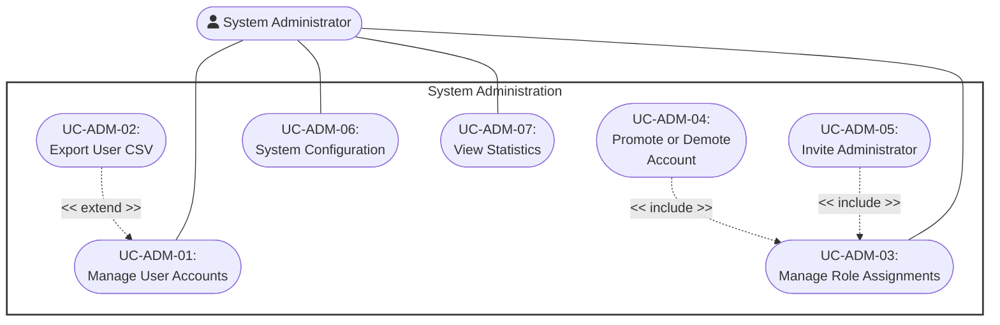

---

### UC-ADM-01: Manage User Accounts

<table width="100%" border="1" cellpadding="8" cellspacing="0" style="border-collapse: collapse; font-family: Arial, sans-serif; font-size: 14px; border: 1px solid #d1d5db; margin-bottom: 20px;">
  <thead>
    <tr style="background-color: #1e3a8a; color: #ffffff;">
      <th colspan="2" style="text-align: left; padding: 12px; font-size: 16px;">
        Use Case: Manage User Accounts
      </th>
    </tr>
  </thead>
  <tbody>
    <tr>
      <td width="22%" style="background-color: #f8fafc; font-weight: bold; vertical-align: top;">Use Case ID</td>
      <td style="vertical-align: top;"><strong>UC-ADM-01</strong></td>
    </tr>
    <tr>
      <td style="background-color: #f8fafc; font-weight: bold; vertical-align: top;">Brief Description</td>
      <td style="vertical-align: top;">
        Allows the System Administrator to list, filter and inspect accounts, update supported account fields, and suspend or restore access.
         <em>(Includes / Extends: <strong>Extended by UC-ADM-02 (Export User CSV).</strong>)</em>
      </td>
    </tr>
    <tr>
      <td style="background-color: #f8fafc; font-weight: bold; vertical-align: top;">Actor(s)</td>
      <td style="vertical-align: top;">System Administrator</td>
    </tr>
    <tr>
      <td style="background-color: #f8fafc; font-weight: bold; vertical-align: top;">Preconditions</td>
      <td style="vertical-align: top;">
        <ul style="margin: 0; padding-left: 20px; line-height: 1.5;">
          <li><strong>Verified Authentication State:</strong> The Admin is authenticated.</li>
        </ul>
      </td>
    </tr>
    <tr>
      <td style="background-color: #f8fafc; font-weight: bold; vertical-align: top;">Flow of Events (Basic Flow)</td>
      <td style="vertical-align: top;">
        <ol style="margin: 0; padding-left: 20px; line-height: 1.6;">
          <li><strong>[Actor Action]:</strong> The Admin navigates to the User Account section.</li>
          <li><strong>[Data Processing]:</strong> The system retrieves the list of registered user accounts.</li>
          <li><strong>[Display Result]:</strong> The system displays the list of user accounts to the Admin.</li>
          <li><strong>[Actor Action]:</strong> The Admin selects a specific user account to inspect.</li>
          <li><strong>[Display Result]:</strong> The system retrieves and displays account details and the available management actions.</li>
          <li><strong>[Actor Action]:</strong> The System Administrator may update supported account data or suspend/unsuspend the account.</li>
          <li><strong>[Data Processing]:</strong> The system validates and persists the change and writes the administrative audit entry.</li>
        </ol>
      </td>
    </tr>
    <tr>
      <td style="background-color: #f8fafc; font-weight: bold; vertical-align: top;">Alternative / Exception Flows</td>
      <td style="vertical-align: top;">
        <ul style="margin: 0; padding-left: 20px; line-height: 1.5;">
          <li style="margin-bottom: 8px;">
            <strong>No User Accounts Exist (Step 2):</strong> If no user accounts exist in the system:
            <ol style="margin-top: 4px; margin-bottom: 4px; padding-left: 20px;">
              <li>The system displays an empty-state message instead of a list.</li>
            </ol>
            <strong>Postcondition (Alternative Flow):</strong> No account data is displayed; system state remains unchanged.
          </li>
          <li style="margin-bottom: 8px;">
            <strong>Selected Account No Longer Exists (Step 4):</strong> If the selected account no longer exists (e.g., it was deleted):
            <ol style="margin-top: 4px; margin-bottom: 4px; padding-left: 20px;">
              <li>The system displays an error message.</li>
              <li>The system returns the Admin to the account list; the Basic Flow resumes at step 3.</li>
            </ol>
            <strong>Postcondition (Alternative Flow):</strong> No detail view is rendered; the Admin remains on the account list.
          </li>
        </ul>
      </td>
    </tr>
    <tr>
      <td style="background-color: #f8fafc; font-weight: bold; vertical-align: top;">Postconditions</td>
      <td style="vertical-align: top;">
        <ul style="margin: 0; padding-left: 20px;">
          <li><strong>Account Management Complete:</strong> The requested account data is displayed and any submitted valid status/profile change is persisted and audited.</li>
        </ul>
      </td>
    </tr>
    <tr>
      <td style="background-color: #f8fafc; font-weight: bold; vertical-align: top;">Special Requirements</td>
      <td style="vertical-align: top;">
        <ul style="margin: 0; padding-left: 20px;">
          <li><strong>Sensitive Field Masking:</strong> Sensitive account fields (e.g., stored credentials) must not be exposed in the displayed details.</li>
        </ul>
      </td>
    </tr>
    <tr>
      <td style="background-color: #f8fafc; font-weight: bold; vertical-align: top;">Extension Points</td>
      <td style="vertical-align: top;">
        <ul style="margin: 0; padding-left: 20px;">
          <li><strong>Export User CSV:</strong> Available from the filtered account list.</li>
        </ul>
      </td>
    </tr>
    <tr>
      <td style="background-color: #f8fafc; font-weight: bold; vertical-align: top;">Prototype Screen</td>
      <td style="vertical-align: top;">
        

        
<em>Figure P-ADM-01-BF01 – User Management</em>

      </td>
    </tr>
  </tbody>
</table>

---

### UC-ADM-02: Export User CSV

<table width="100%" border="1" cellpadding="8" cellspacing="0" style="border-collapse: collapse; font-family: Arial, sans-serif; font-size: 14px; border: 1px solid #d1d5db; margin-bottom: 20px;">
  <thead>
    <tr style="background-color: #1e3a8a; color: #ffffff;">
      <th colspan="2" style="text-align: left; padding: 12px; font-size: 16px;">
        Use Case: Export User CSV
      </th>
    </tr>
  </thead>
  <tbody>
    <tr>
      <td width="22%" style="background-color: #f8fafc; font-weight: bold; vertical-align: top;">Use Case ID</td>
      <td style="vertical-align: top;"><strong>UC-ADM-02</strong></td>
    </tr>
    <tr>
      <td style="background-color: #f8fafc; font-weight: bold; vertical-align: top;">Brief Description</td>
      <td style="vertical-align: top;">
        Exports up to 1,000 user-account rows matching the active account-management filters as a downloadable CSV file.
         <em>(Includes / Extends: <strong>Extends UC-ADM-01 (Manage User Accounts).</strong>)</em>
      </td>
    </tr>
    <tr>
      <td style="background-color: #f8fafc; font-weight: bold; vertical-align: top;">Actor(s)</td>
      <td style="vertical-align: top;">System Administrator</td>
    </tr>
    <tr>
      <td style="background-color: #f8fafc; font-weight: bold; vertical-align: top;">Preconditions</td>
      <td style="vertical-align: top;">
        <ul style="margin: 0; padding-left: 20px; line-height: 1.5;">
          <li><strong>Active Base Context Display:</strong> UC-ADM-01 (Manage User Accounts) is active with the desired filters.</li>
        </ul>
      </td>
    </tr>
    <tr>
      <td style="background-color: #f8fafc; font-weight: bold; vertical-align: top;">Flow of Events (Basic Flow)</td>
      <td style="vertical-align: top;">
        <ol style="margin: 0; padding-left: 20px; line-height: 1.6;">
          <li><strong>[Actor Action]:</strong> While viewing user account data, the Admin selects the "Generate CSV Report" option.</li>
          <li><strong>[Data Processing]:</strong> The system compiles the currently displayed user account data into CSV format.</li>
          <li><strong>[Data Processing]:</strong> The system generates the CSV file.</li>
          <li><strong>[System Response]:</strong> The system prompts the Admin to download the generated file.</li>
          <li><strong>[Data Processing]:</strong> The system initiates the download.</li>
          <li><strong>[Display Result]:</strong> The system delivers the CSV file to the Admin.</li>
        </ol>
      </td>
    </tr>
    <tr>
      <td style="background-color: #f8fafc; font-weight: bold; vertical-align: top;">Alternative / Exception Flows</td>
      <td style="vertical-align: top;">
        <ul style="margin: 0; padding-left: 20px; line-height: 1.5;">
          <li style="margin-bottom: 8px;">
            <strong>No Data Available to Export (Step 2):</strong> If there is no data available to export:
            <ol style="margin-top: 4px; margin-bottom: 4px; padding-left: 20px;">
              <li>The system notifies the Admin that no report can be generated.</li>
            </ol>
            <strong>Postcondition (Alternative Flow):</strong> No CSV file is generated; the Admin remains on the current view.
          </li>
          <li style="margin-bottom: 8px;">
            <strong>File Generation Fails (Step 3):</strong> If the system encounters an internal error while generating the file:
            <ol style="margin-top: 4px; margin-bottom: 4px; padding-left: 20px;">
              <li>The system displays an error message; no file is produced.</li>
            </ol>
            <strong>Postcondition (Alternative Flow):</strong> No CSV file is produced; the Admin is notified of the failure.
          </li>
        </ul>
      </td>
    </tr>
    <tr>
      <td style="background-color: #f8fafc; font-weight: bold; vertical-align: top;">Postconditions</td>
      <td style="vertical-align: top;">
        <ul style="margin: 0; padding-left: 20px;">
          <li><strong>CSV File Delivered:</strong> A CSV file containing the requested user account data is generated and made available to the Admin.</li>
        </ul>
      </td>
    </tr>
    <tr>
      <td style="background-color: #f8fafc; font-weight: bold; vertical-align: top;">Special Requirements</td>
      <td style="vertical-align: top;">
        <ul style="margin: 0; padding-left: 20px;">
          <li><strong>Sensitive Field Exclusion:</strong> Exported CSV files must exclude sensitive fields such as passwords or authentication tokens.</li>
          <li><strong>Encoding Standard:</strong> The CSV file must use a standard, widely-compatible encoding (e.g., UTF-8).</li>
        </ul>
      </td>
    </tr>
    <tr>
      <td style="background-color: #f8fafc; font-weight: bold; vertical-align: top;">Extension Points</td>
      <td style="vertical-align: top;">
        None
      </td>
    </tr>
    <tr>
      <td style="background-color: #f8fafc; font-weight: bold; vertical-align: top;">Prototype Screen</td>
      <td style="vertical-align: top;">
        

        
<em>Figure P-ADM-01-BF01 – User Management (reused as the CSV report entry screen)</em>

      </td>
    </tr>
  </tbody>
</table>

---

### UC-ADM-03: Manage Role Assignments

<table width="100%" border="1" cellpadding="8" cellspacing="0" style="border-collapse: collapse; font-family: Arial, sans-serif; font-size: 14px; border: 1px solid #d1d5db; margin-bottom: 20px;">
  <thead>
    <tr style="background-color: #1e3a8a; color: #ffffff;">
      <th colspan="2" style="text-align: left; padding: 12px; font-size: 16px;">
        Use Case: Manage Role Assignments
      </th>
    </tr>
  </thead>
  <tbody>
    <tr>
      <td width="22%" style="background-color: #f8fafc; font-weight: bold; vertical-align: top;">Use Case ID</td>
      <td style="vertical-align: top;"><strong>UC-ADM-03</strong></td>
    </tr>
    <tr>
      <td style="background-color: #f8fafc; font-weight: bold; vertical-align: top;">Brief Description</td>
      <td style="vertical-align: top;">
        Allows the System Administrator to list and filter managed accounts, inspect outstanding liabilities and role history, and initiate supported role-assignment actions.
         <em>(Includes / Extends: <strong>Includes UC-ADM-04 (Promote or Demote Account) and UC-ADM-05 (Invite Administrator) when those actions are selected.</strong>)</em>
      </td>
    </tr>
    <tr>
      <td style="background-color: #f8fafc; font-weight: bold; vertical-align: top;">Actor(s)</td>
      <td style="vertical-align: top;">System Administrator</td>
    </tr>
    <tr>
      <td style="background-color: #f8fafc; font-weight: bold; vertical-align: top;">Preconditions</td>
      <td style="vertical-align: top;">
        <ul style="margin: 0; padding-left: 20px; line-height: 1.5;">
          <li><strong>Valid Credentials or Session:</strong> The Admin possesses valid credentials or an active session.</li>
        </ul>
      </td>
    </tr>
    <tr>
      <td style="background-color: #f8fafc; font-weight: bold; vertical-align: top;">Flow of Events (Basic Flow)</td>
      <td style="vertical-align: top;">
        <ol style="margin: 0; padding-left: 20px; line-height: 1.6;">
          <li><strong>[Actor Action]:</strong> The System Administrator opens role management and optionally applies role/status filters.</li>
          <li><strong>[Data Processing]:</strong> The system validates the administrator session and retrieves manageable accounts.</li>
          <li><strong>[Display Result]:</strong> The system displays each account's current role and relevant outstanding liabilities.</li>
          <li><strong>[Actor Action]:</strong> The System Administrator selects an account and reviews its role-change history.</li>
          <li><strong>[Actor Action]:</strong> The administrator may initiate UC-ADM-04 or UC-ADM-05.</li>
        </ol>
      </td>
    </tr>
    <tr>
      <td style="background-color: #f8fafc; font-weight: bold; vertical-align: top;">Alternative / Exception Flows</td>
      <td style="vertical-align: top;">
        <ul style="margin: 0; padding-left: 20px; line-height: 1.5;">
          <li style="margin-bottom: 8px;">
            <strong>Invalid Credentials or Session (Step 2):</strong> If the credentials or session are invalid:
            <ol style="margin-top: 4px; margin-bottom: 4px; padding-left: 20px;">
              <li>The system denies access and displays an authentication error.</li>
              <li>The failed attempt is logged.</li>
            </ol>
            <strong>Postcondition (Alternative Flow):</strong> Access is denied; the failed attempt is logged.
          </li>
          <li style="margin-bottom: 8px;">
            <strong>Insufficient Permission (Step 4):</strong> If the Admin lacks sufficient permission for the requested function:
            <ol style="margin-top: 4px; margin-bottom: 4px; padding-left: 20px;">
              <li>The system denies access and displays an authorization error.</li>
              <li>The attempt is logged.</li>
            </ol>
            <strong>Postcondition (Alternative Flow):</strong> Access to the requested function is denied; the attempt is logged.
          </li>
        </ul>
      </td>
    </tr>
    <tr>
      <td style="background-color: #f8fafc; font-weight: bold; vertical-align: top;">Postconditions</td>
      <td style="vertical-align: top;">
        <ul style="margin: 0; padding-left: 20px;">
          <li><strong>Role Management Context Ready:</strong> The manageable-account list, liabilities and role history are available for the supported assignment actions.</li>
        </ul>
      </td>
    </tr>
    <tr>
      <td style="background-color: #f8fafc; font-weight: bold; vertical-align: top;">Special Requirements</td>
      <td style="vertical-align: top;">
        <ul style="margin: 0; padding-left: 20px;">
          <li><strong>Secure Credential Validation:</strong> Credential validation must be performed securely.</li>
          <li><strong>Audit Logging:</strong> Failed authorization attempts must be logged for security auditing.</li>
          <li><strong>Session Timeout Policy:</strong> Sessions must be subject to a defined timeout policy.</li>
        </ul>
      </td>
    </tr>
    <tr>
      <td style="background-color: #f8fafc; font-weight: bold; vertical-align: top;">Extension Points</td>
      <td style="vertical-align: top;">
        None
      </td>
    </tr>
    <tr>
      <td style="background-color: #f8fafc; font-weight: bold; vertical-align: top;">Prototype Screen</td>
      <td style="vertical-align: top;">
        

        
<em>Figure P-ADM-04-BF01 – Roles and Permissions (reused for authorization)</em>

      </td>
    </tr>
  </tbody>
</table>

---

### UC-ADM-04: Promote or Demote Account

<table width="100%" border="1" cellpadding="8" cellspacing="0" style="border-collapse: collapse; font-family: Arial, sans-serif; font-size: 14px; border: 1px solid #d1d5db; margin-bottom: 20px;">
  <thead>
    <tr style="background-color: #1e3a8a; color: #ffffff;">
      <th colspan="2" style="text-align: left; padding: 12px; font-size: 16px;">
        Use Case: Promote or Demote Account
      </th>
    </tr>
  </thead>
  <tbody>
    <tr>
      <td width="22%" style="background-color: #f8fafc; font-weight: bold; vertical-align: top;">Use Case ID</td>
      <td style="vertical-align: top;"><strong>UC-ADM-04</strong></td>
    </tr>
    <tr>
      <td style="background-color: #f8fafc; font-weight: bold; vertical-align: top;">Brief Description</td>
      <td style="vertical-align: top;">
        Changes an eligible account among the system's fixed Reader, Librarian and System Administrator roles.
         <em>(Includes / Extends: <strong>Included by UC-ADM-03 (Manage Role Assignments).</strong>)</em>
      </td>
    </tr>
    <tr>
      <td style="background-color: #f8fafc; font-weight: bold; vertical-align: top;">Actor(s)</td>
      <td style="vertical-align: top;">System Administrator</td>
    </tr>
    <tr>
      <td style="background-color: #f8fafc; font-weight: bold; vertical-align: top;">Preconditions</td>
      <td style="vertical-align: top;">
        <ul style="margin: 0; padding-left: 20px; line-height: 1.5;">
          <li><strong>Verified Authentication State:</strong> The Admin is authenticated.</li>
        </ul>
      </td>
    </tr>
    <tr>
      <td style="background-color: #f8fafc; font-weight: bold; vertical-align: top;">Flow of Events (Basic Flow)</td>
      <td style="vertical-align: top;">
        <ol style="margin: 0; padding-left: 20px; line-height: 1.6;">
          <li><strong>[Actor Action]:</strong> From role management, the System Administrator selects a target account and one of the fixed target roles.</li>
          <li><strong>[Data Processing]:</strong> The system validates that the administrator is not modifying themself and that the transition is allowed.</li>
          <li><strong>[Data Processing]:</strong> Promotion from Reader is blocked while borrowing, reservation or penalty liabilities remain; administrator transitions require sudo confirmation and protect the last/senior administrator constraints.</li>
          <li><strong>[Data Processing]:</strong> The system changes the role, records role history/audit data, and revokes the target account's existing sessions.</li>
          <li><strong>[Display Result]:</strong> The system confirms the new role.</li>
        </ol>
      </td>
    </tr>
    <tr>
      <td style="background-color: #f8fafc; font-weight: bold; vertical-align: top;">Alternative / Exception Flows</td>
      <td style="vertical-align: top;">
        <ul style="margin: 0; padding-left: 20px; line-height: 1.5;">
          <li style="margin-bottom: 8px;">
            <strong>Administrative Session Invalid:</strong> If the System Administrator session is invalid or unauthorized:
            <ol style="margin-top: 4px; margin-bottom: 4px; padding-left: 20px;">
              <li>The use case terminates.</li>
            </ol>
            <strong>Postcondition (Alternative Flow):</strong> No role data is displayed or modified; access is denied.
          </li>
          <li style="margin-bottom: 8px;">
            <strong>Role Change Ineligible:</strong> If the transition violates liability, self-change, last-administrator or seniority safeguards:
            <ol style="margin-top: 4px; margin-bottom: 4px; padding-left: 20px;">
              <li>The system rejects the role change and reports the applicable reason.</li>
            </ol>
            <strong>Postcondition (Alternative Flow):</strong> The target role and sessions remain unchanged.
          </li>
        </ul>
      </td>
    </tr>
    <tr>
      <td style="background-color: #f8fafc; font-weight: bold; vertical-align: top;">Postconditions</td>
      <td style="vertical-align: top;">
        <ul style="margin: 0; padding-left: 20px;">
          <li><strong>Assignment Persisted:</strong> The account has one supported role, the change is audited, and prior sessions are revoked.</li>
        </ul>
      </td>
    </tr>
    <tr>
      <td style="background-color: #f8fafc; font-weight: bold; vertical-align: top;">Special Requirements</td>
      <td style="vertical-align: top;">
        <ul style="margin: 0; padding-left: 20px;">
          <li><strong>Audit Logging:</strong> Role modifications must be logged for audit purposes.</li>
          <li><strong>Fixed Role Set:</strong> This use case does not create, edit or delete role definitions.</li>
        </ul>
      </td>
    </tr>
    <tr>
      <td style="background-color: #f8fafc; font-weight: bold; vertical-align: top;">Extension Points</td>
      <td style="vertical-align: top;">
        None
      </td>
    </tr>
    <tr>
      <td style="background-color: #f8fafc; font-weight: bold; vertical-align: top;">Prototype Screen</td>
      <td style="vertical-align: top;">
        

        
<em>Figure P-ADM-04-BF01 – Roles and Permissions</em>

      </td>
    </tr>
  </tbody>
</table>

---

### UC-ADM-05: Invite Administrator

<table width="100%" border="1" cellpadding="8" cellspacing="0" style="border-collapse: collapse; font-family: Arial, sans-serif; font-size: 14px; border: 1px solid #d1d5db; margin-bottom: 20px;">
  <thead>
    <tr style="background-color: #1e3a8a; color: #ffffff;">
      <th colspan="2" style="text-align: left; padding: 12px; font-size: 16px;">
        Use Case: Invite Administrator
      </th>
    </tr>
  </thead>
  <tbody>
    <tr>
      <td width="22%" style="background-color: #f8fafc; font-weight: bold; vertical-align: top;">Use Case ID</td>
      <td style="vertical-align: top;"><strong>UC-ADM-05</strong></td>
    </tr>
    <tr>
      <td style="background-color: #f8fafc; font-weight: bold; vertical-align: top;">Brief Description</td>
      <td style="vertical-align: top;">
        Allows the System Administrator to create a new administrator account by email and deliver one-time credentials securely.
         <em>(Includes / Extends: <strong>Included by UC-ADM-03 (Manage Role Assignments).</strong>)</em>
      </td>
    </tr>
    <tr>
      <td style="background-color: #f8fafc; font-weight: bold; vertical-align: top;">Actor(s)</td>
      <td style="vertical-align: top;">System Administrator</td>
    </tr>
    <tr>
      <td style="background-color: #f8fafc; font-weight: bold; vertical-align: top;">Preconditions</td>
      <td style="vertical-align: top;">
        <ul style="margin: 0; padding-left: 20px; line-height: 1.5;">
          <li><strong>Verified Authentication State:</strong> The System Administrator is authenticated and can complete sudo confirmation.</li>
        </ul>
      </td>
    </tr>
    <tr>
      <td style="background-color: #f8fafc; font-weight: bold; vertical-align: top;">Flow of Events (Basic Flow)</td>
      <td style="vertical-align: top;">
        <ol style="margin: 0; padding-left: 20px; line-height: 1.6;">
          <li><strong>[Actor Action]:</strong> The System Administrator enters the invitee's email and confirms the operation with sudo authentication.</li>
          <li><strong>[Data Processing]:</strong> The system validates the email and confirms that no account already uses it.</li>
          <li><strong>[Data Processing]:</strong> The system creates a System Administrator account with a generated temporary password and <code>must_change_password</code> enabled.</li>
          <li><strong>[System Response]:</strong> The system emails the temporary credentials to the invitee.</li>
          <li><strong>[Display Result]:</strong> The system confirms the invitation and records the administrative action.</li>
        </ol>
      </td>
    </tr>
    <tr>
      <td style="background-color: #f8fafc; font-weight: bold; vertical-align: top;">Alternative / Exception Flows</td>
      <td style="vertical-align: top;">
        <ul style="margin: 0; padding-left: 20px; line-height: 1.5;">
          <li style="margin-bottom: 8px;">
            <strong>Sudo Confirmation Fails:</strong> If the System Administrator cannot confirm sudo authentication:
            <ol style="margin-top: 4px; margin-bottom: 4px; padding-left: 20px;">
              <li>The use case terminates.</li>
            </ol>
            <strong>Postcondition (Alternative Flow):</strong> No administrator account is created.
          </li>
          <li style="margin-bottom: 8px;">
            <strong>Duplicate Email or Delivery Failure:</strong> If the email already exists or the credential email cannot be delivered:
            <ol style="margin-top: 4px; margin-bottom: 4px; padding-left: 20px;">
              <li>The system rejects a duplicate before creation.</li>
              <li>If email delivery fails after insertion, the system rolls back the newly created administrator account.</li>
            </ol>
            <strong>Postcondition (Alternative Flow):</strong> No unusable administrator account remains.
          </li>
        </ul>
      </td>
    </tr>
    <tr>
      <td style="background-color: #f8fafc; font-weight: bold; vertical-align: top;">Postconditions</td>
      <td style="vertical-align: top;">
        <ul style="margin: 0; padding-left: 20px;">
          <li><strong>Administrator Invited:</strong> The new account requires a password change at first login and the invitation action is audited.</li>
        </ul>
      </td>
    </tr>
    <tr>
      <td style="background-color: #f8fafc; font-weight: bold; vertical-align: top;">Special Requirements</td>
      <td style="vertical-align: top;">
        <ul style="margin: 0; padding-left: 20px;">
          <li><strong>Credential Safety:</strong> The generated temporary password is delivered only through the configured transactional email channel.</li>
          <li><strong>Mandatory Rotation:</strong> The invited administrator must change the temporary password at first login.</li>
        </ul>
      </td>
    </tr>
    <tr>
      <td style="background-color: #f8fafc; font-weight: bold; vertical-align: top;">Extension Points</td>
      <td style="vertical-align: top;">
        None
      </td>
    </tr>
    <tr>
      <td style="background-color: #f8fafc; font-weight: bold; vertical-align: top;">Prototype Screen</td>
      <td style="vertical-align: top;">
        

        
<em>Figure P-ADM-04-BF01 – Role Management (prototype image to be refreshed for administrator invitation)</em>

      </td>
    </tr>
  </tbody>
</table>

---

### UC-ADM-06: System Configuration

<table width="100%" border="1" cellpadding="8" cellspacing="0" style="border-collapse: collapse; font-family: Arial, sans-serif; font-size: 14px; border: 1px solid #d1d5db; margin-bottom: 20px;">
  <thead>
    <tr style="background-color: #1e3a8a; color: #ffffff;">
      <th colspan="2" style="text-align: left; padding: 12px; font-size: 16px;">
        Use Case: System Configuration
      </th>
    </tr>
  </thead>
  <tbody>
    <tr>
      <td width="22%" style="background-color: #f8fafc; font-weight: bold; vertical-align: top;">Use Case ID</td>
      <td style="vertical-align: top;"><strong>UC-ADM-06</strong></td>
    </tr>
    <tr>
      <td style="background-color: #f8fafc; font-weight: bold; vertical-align: top;">Brief Description</td>
      <td style="vertical-align: top;">
        Allows the Admin to view and modify system-wide configuration settings.
      </td>
    </tr>
    <tr>
      <td style="background-color: #f8fafc; font-weight: bold; vertical-align: top;">Actor(s)</td>
      <td style="vertical-align: top;">System Administrator</td>
    </tr>
    <tr>
      <td style="background-color: #f8fafc; font-weight: bold; vertical-align: top;">Preconditions</td>
      <td style="vertical-align: top;">
        <ul style="margin: 0; padding-left: 20px; line-height: 1.5;">
          <li><strong>Verified Authentication State:</strong> The Admin is authenticated and holds sufficient privileges to access system configuration.</li>
        </ul>
      </td>
    </tr>
    <tr>
      <td style="background-color: #f8fafc; font-weight: bold; vertical-align: top;">Flow of Events (Basic Flow)</td>
      <td style="vertical-align: top;">
        <ol style="margin: 0; padding-left: 20px; line-height: 1.6;">
          <li><strong>[Actor Action]:</strong> The Admin navigates to the System Configuration section.</li>
          <li><strong>[Data Processing]:</strong> The system retrieves the current configuration settings.</li>
          <li><strong>[Display Result]:</strong> The system displays the settings to the Admin.</li>
          <li><strong>[Actor Action]:</strong> The Admin modifies one or more configuration values.</li>
          <li><strong>[Data Processing]:</strong> The system validates the submitted values.</li>
          <li><strong>[Data Processing]:</strong> The system saves the updated configuration.</li>
        </ol>
      </td>
    </tr>
    <tr>
      <td style="background-color: #f8fafc; font-weight: bold; vertical-align: top;">Alternative / Exception Flows</td>
      <td style="vertical-align: top;">
        <ul style="margin: 0; padding-left: 20px; line-height: 1.5;">
          <li style="margin-bottom: 8px;">
            <strong>Invalid Configuration Value (Step 5):</strong> If a submitted value is invalid:
            <ol style="margin-top: 4px; margin-bottom: 4px; padding-left: 20px;">
              <li>The system displays a validation error and does not save the change.</li>
              <li>The Admin resubmits a corrected value; the Basic Flow resumes at step 5.</li>
            </ol>
            <strong>Postcondition (Alternative Flow):</strong> Configuration remains unchanged; the Admin is prompted to correct the invalid value.
          </li>
        </ul>
      </td>
    </tr>
    <tr>
      <td style="background-color: #f8fafc; font-weight: bold; vertical-align: top;">Postconditions</td>
      <td style="vertical-align: top;">
        <ul style="margin: 0; padding-left: 20px;">
          <li><strong>Configuration Updated:</strong> The system configuration is updated and the new settings take effect.</li>
        </ul>
      </td>
    </tr>
    <tr>
      <td style="background-color: #f8fafc; font-weight: bold; vertical-align: top;">Special Requirements</td>
      <td style="vertical-align: top;">
        <ul style="margin: 0; padding-left: 20px;">
          <li><strong>Audit Logging:</strong> Configuration changes should be logged for audit purposes.</li>
          <li><strong>Restart Dependency:</strong> Certain configuration changes may require a system restart or reload to take full effect.</li>
        </ul>
      </td>
    </tr>
    <tr>
      <td style="background-color: #f8fafc; font-weight: bold; vertical-align: top;">Extension Points</td>
      <td style="vertical-align: top;">
        None
      </td>
    </tr>
    <tr>
      <td style="background-color: #f8fafc; font-weight: bold; vertical-align: top;">Prototype Screen</td>
      <td style="vertical-align: top;">
        

        
<em>Figure P-ADM-06-BF01 – System Configuration</em>

        

        
<em>Figure P-ADM-06-AF01 – Invalid Configuration Value</em>

      </td>
    </tr>
  </tbody>
</table>

---

### UC-ADM-07: View Statistics

<table width="100%" border="1" cellpadding="8" cellspacing="0" style="border-collapse: collapse; font-family: Arial, sans-serif; font-size: 14px; border: 1px solid #d1d5db; margin-bottom: 20px;">
  <thead>
    <tr style="background-color: #1e3a8a; color: #ffffff;">
      <th colspan="2" style="text-align: left; padding: 12px; font-size: 16px;">
        Use Case: View Statistics
      </th>
    </tr>
  </thead>
  <tbody>
    <tr>
      <td width="22%" style="background-color: #f8fafc; font-weight: bold; vertical-align: top;">Use Case ID</td>
      <td style="vertical-align: top;"><strong>UC-ADM-07</strong></td>
    </tr>
    <tr>
      <td style="background-color: #f8fafc; font-weight: bold; vertical-align: top;">Brief Description</td>
      <td style="vertical-align: top;">
        Allows the Admin to view system usage and operational statistics.
      </td>
    </tr>
    <tr>
      <td style="background-color: #f8fafc; font-weight: bold; vertical-align: top;">Actor(s)</td>
      <td style="vertical-align: top;">System Administrator</td>
    </tr>
    <tr>
      <td style="background-color: #f8fafc; font-weight: bold; vertical-align: top;">Preconditions</td>
      <td style="vertical-align: top;">
        <ul style="margin: 0; padding-left: 20px; line-height: 1.5;">
          <li><strong>Verified Authentication State:</strong> The Admin is authenticated and holds sufficient privileges to access system statistics.</li>
        </ul>
      </td>
    </tr>
    <tr>
      <td style="background-color: #f8fafc; font-weight: bold; vertical-align: top;">Flow of Events (Basic Flow)</td>
      <td style="vertical-align: top;">
        <ol style="margin: 0; padding-left: 20px; line-height: 1.6;">
          <li><strong>[Actor Action]:</strong> The Admin navigates to the Statistics section.</li>
          <li><strong>[Data Processing]:</strong> The system aggregates relevant statistical data.</li>
          <li><strong>[Display Result]:</strong> The system displays the statistics to the Admin.</li>
          <li><strong>[Actor Action]:</strong> The Admin optionally filters the statistics by date range or category.</li>
          <li><strong>[Display Result]:</strong> The system updates the displayed statistics based on the selected filter.</li>
        </ol>
      </td>
    </tr>
    <tr>
      <td style="background-color: #f8fafc; font-weight: bold; vertical-align: top;">Alternative / Exception Flows</td>
      <td style="vertical-align: top;">
        <ul style="margin: 0; padding-left: 20px; line-height: 1.5;">
          <li style="margin-bottom: 8px;">
            <strong>No Data Available for Requested Period or Category (Step 2):</strong> If no data is available for the requested period or category:
            <ol style="margin-top: 4px; margin-bottom: 4px; padding-left: 20px;">
              <li>The system displays an empty-state message.</li>
            </ol>
            <strong>Postcondition (Alternative Flow):</strong> No statistical data is displayed; the Admin remains on the Statistics section.
          </li>
        </ul>
      </td>
    </tr>
    <tr>
      <td style="background-color: #f8fafc; font-weight: bold; vertical-align: top;">Postconditions</td>
      <td style="vertical-align: top;">
        <ul style="margin: 0; padding-left: 20px;">
          <li><strong>Statistics Displayed:</strong> The requested statistics are displayed to the Admin.</li>
        </ul>
      </td>
    </tr>
    <tr>
      <td style="background-color: #f8fafc; font-weight: bold; vertical-align: top;">Special Requirements</td>
      <td style="vertical-align: top;">
        <ul style="margin: 0; padding-left: 20px;">
          <li><strong>Read-Only Access:</strong> This use case is strictly read-only.</li>
          <li><strong>Data Freshness:</strong> Displayed statistics should reflect a defined refresh interval or be clearly timestamped.</li>
        </ul>
      </td>
    </tr>
    <tr>
      <td style="background-color: #f8fafc; font-weight: bold; vertical-align: top;">Extension Points</td>
      <td style="vertical-align: top;">
        None
      </td>
    </tr>
    <tr>
      <td style="background-color: #f8fafc; font-weight: bold; vertical-align: top;">Prototype Screen</td>
      <td style="vertical-align: top;">
        

        
<em>Figure P-ADM-07-BF01 – Statistics Dashboard</em>

        

        
<em>Figure P-ADM-07-BF02 – Empty Statistics Data</em>

      </td>
    </tr>
  </tbody>
</table>
