# Use-Case Specification

    Project: Modern Library Management System 
    Course: CS300 – CSC13002 – Introduction to Software Engineering 
    Group ID: 03
    Group Name: AmeThyst 
    Assignment: PA4-2026
    Version: 2.0
Performed by: Phan Lê Anh Minh, Trần Lê Hoàng Gia | Reviewed by: All Members | Edited by: Phan Lê Anh Minh, Trần Lê Hoàng Gia

## Revision History

| Date | Version | Description | Author |
| --- | --- | --- | --- |
| 20-Jul-2026 | 1.1 | Authentication Use case specification (RUP format layout). | Phan Lê Anh Minh, Trần Lê Hoàng Gia |
| 23-Jul-2026 | 1.2 | Update use-case table layout (HTML) | Phan Lê Anh Minh, Trần Lê Hoàng Gia |
| 23-Jul-2026 | 1.3 | Merge file content | Phan Lê Anh Minh, Trần Lê Hoàng Gia |
| 24-Jul-2026 | 1.4 | Update format, fix spellings | Phan Lê Anh Minh, Trần Lê Hoàng Gia |
| 7-Aug-2026 | 2.0 | Update ImageGUI, fix diagrams | Phan Lê Anh Minh, Trần Lê Hoàng Gia |
## Table of Contents
- [Use-Case Specification](#use-case-specification)
  - [Revision History](#revision-history)
  - [Table of Contents](#table-of-contents)
  - [I. Regulation of Abstract Actors](#i-regulation-of-abstract-actors)
  - [II. Authentication](#ii-authentication)
    - [Use case diagram](#use-case-diagram)
    - [UC-AUTH-01: Register](#uc-auth-01-register)
    - [UC-AUTH-02: Verify By Email](#uc-auth-02-verify-by-email)
    - [UC-AUTH-03: Google OAuth](#uc-auth-03-google-oauth)
    - [UC-AUTH-04: Login](#uc-auth-04-login)
    - [UC-AUTH-05: Forget Password](#uc-auth-05-forget-password)
    - [UC-AUTH-06: Verify By OTP](#uc-auth-06-verify-by-otp)
    - [UC-AUTH-07: Change Password](#uc-auth-07-change-password)
  - [III. Profile Management](#iii-profile-management)
    - [Use case diagram](#use-case-diagram-1)
    - [UC-PROF-01: View Self Profile](#uc-prof-01-view-self-profile)
    - [UC-PROF-02: Edit Profile](#uc-prof-02-edit-profile)
    - [UC-PROF-03: Change Avatar](#uc-prof-03-change-avatar)
    - [UC-PROF-04: Change Password](#uc-prof-04-change-password)
  - [IV. Books Exploration \& Interaction](#iv-books-exploration--interaction)
    - [Usecase Diagram](#usecase-diagram)
    - [UC-BK-01: Book Searching](#uc-bk-01-book-searching)
    - [UC-BK-02: Filtering Book](#uc-bk-02-filtering-book)
    - [UC-BK-03: View Book Detail](#uc-bk-03-view-book-detail)
    - [UC-BK-04: Add Book Favorite](#uc-bk-04-add-book-favorite)
    - [UC-BK-05: Book Reservation](#uc-bk-05-book-reservation)
    - [UC-BK-06: Canceling Book Reservation](#uc-bk-06-canceling-book-reservation)
    - [UC-BK-07: Generating Pin](#uc-bk-07-generating-pin)
  - [V. Study Group Creation \& Facility Reservation](#v-study-group-creation--facility-reservation)
    - [Use case diagram](#use-case-diagram-2)
    - [UC-FAC-01: View Library Map](#uc-fac-01-view-library-map)
    - [UC-FAC-02: View Facility Information](#uc-fac-02-view-facility-information)
    - [UC-FAC-03: Room Reservation](#uc-fac-03-room-reservation)
    - [UC-FAC-04: Canceling Room Reservation](#uc-fac-04-canceling-room-reservation)
    - [UC-FAC-05: Creating Study Group](#uc-fac-05-creating-study-group)
    - [UC-FAC-06: Canceling Study Group](#uc-fac-06-canceling-study-group)
    - [UC-FAC-07: Updating Study Group Information](#uc-fac-07-updating-study-group-information)
  - [VI. Study Group](#vi-study-group)
    - [Use case diagram](#use-case-diagram-3)
    - [UC-SG-01: Searching Study Group](#uc-sg-01-searching-study-group)
    - [UC-SG-02: Filtering Study Group](#uc-sg-02-filtering-study-group)
    - [UC-SG-03: View Study Group Detail](#uc-sg-03-view-study-group-detail)
    - [UC-SG-04: Inviting Others into Study Group](#uc-sg-04-inviting-others-into-study-group)
    - [UC-SG-05: Remove Others from Study Group](#uc-sg-05-remove-others-from-study-group)
    - [UC-SG-06: Finding User By Email](#uc-sg-06-finding-user-by-email)
    - [UC-SG-07: View Other Profile](#uc-sg-07-view-other-profile)
    - [UC-SG-08: Creating Join Request](#uc-sg-08-creating-join-request)
    - [UC-SG-09: Canceling Join Request](#uc-sg-09-canceling-join-request)
    - [UC-SG-10: Out Study Group](#uc-sg-10-out-study-group)
  - [VII. AI Recommendation](#vii-ai-recommendation)
    - [Use case diagram](#use-case-diagram-4)
    - [UC-AIR-01: View Recommended Book](#uc-air-01-view-recommended-book)
    - [UC-AIR-02: Reset AI Recommend](#uc-air-02-reset-ai-recommend)
  - [VIII. Librarian](#viii-librarian)
    - [Use case diagram](#use-case-diagram-5)
    - [UC-LIB-01: Adding Books](#uc-lib-01-adding-books)
    - [UC-LIB-02: Removing Books](#uc-lib-02-removing-books)
    - [UC-LIB-03: Confirming Book Return](#uc-lib-03-confirming-book-return)
    - [UC-LIB-04: Recording Loan](#uc-lib-04-recording-loan)
    - [UC-LIB-05: Confirming Book Borrowed](#uc-lib-05-confirming-book-borrowed)
    - [UC-LIB-06: Confirming Room Checkin](#uc-lib-06-confirming-room-checkin)
    - [UC-LIB-07: Announcement](#uc-lib-07-announcement)
  - [IX. Admin](#ix-admin)
    - [Use case diagram](#use-case-diagram-6)
    - [UC-ADM-01: View User Account](#uc-adm-01-view-user-account)
    - [UC-ADM-02: Generating CSV Report](#uc-adm-02-generating-csv-report)
    - [UC-ADM-03: Authorization](#uc-adm-03-authorization)
    - [UC-ADM-04: Role Control](#uc-adm-04-role-control)
    - [UC-ADM-05: Use-case Permission](#uc-adm-05-use-case-permission)
    - [UC-ADM-06: System Configuration](#uc-adm-06-system-configuration)
    - [UC-ADM-07: View Statistics](#uc-adm-07-view-statistics)

## I. Regulation of Abstract Actors

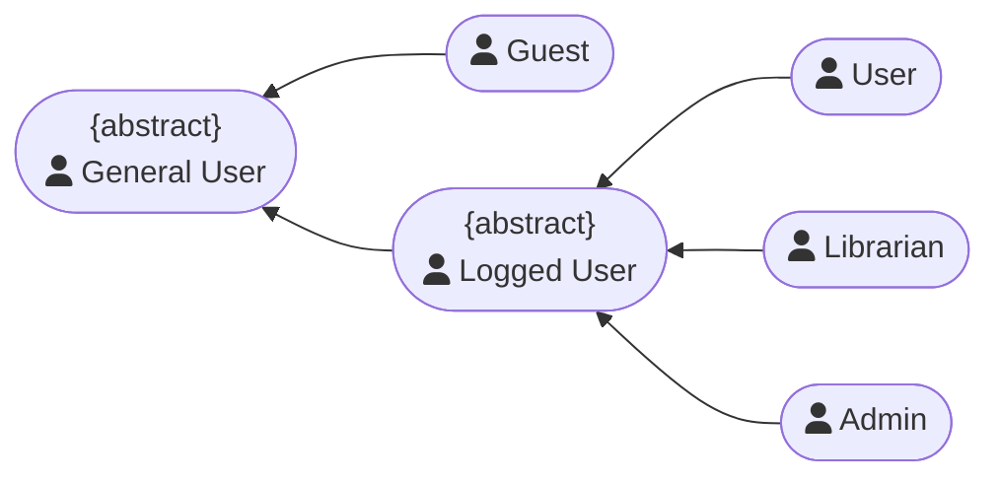
```mermaid
flowchart RL
    %% Abstract Parent Actors
    GeneralUser(["<center>{abstract} <br> fa:fa-user General User</center>"])
    LoggedUser(["<center>{abstract} <br> fa:fa-user Logged User</center>"])

    %% Concrete Actors
    Guest([fa:fa-user Guest])
    User([fa:fa-user User])
    Librarian([fa:fa-user Librarian])
    Admin([fa:fa-user Admin])

    %% Hierarchy (Child --> Parent)
    Guest --> GeneralUser
    LoggedUser --> GeneralUser
    
    User --> LoggedUser
    Librarian --> LoggedUser
    Admin --> LoggedUser
```

## II. Authentication

### Use case diagram

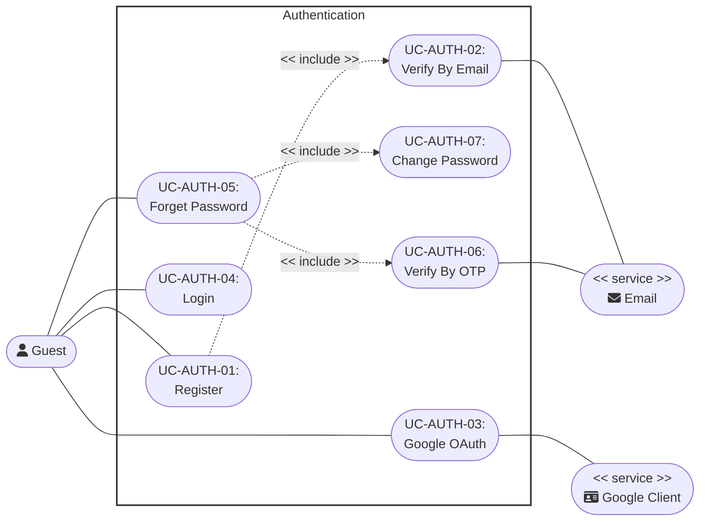
```mermaid
flowchart LR
    %% Left Actor
    ActorGuest(["<center>fa:fa-user Guest</center>"])
        %% Central System Boundary Subgraph
    subgraph Authentication [Authentication]
        UC_Reg(["<center>UC-AUTH-01:<br>Register</center>"])
        UC_OAuth(["<center> UC-AUTH-03:<br>Google OAuth</center>"])
        UC_Login(["<center>UC-AUTH-04:<br>Login</center>"])
        UC_Forget(["<center>UC-AUTH-05:<br>Forget Password</center>"])
        UC_Change(["<center>UC-AUTH-07:<br>Change Password</center>"])
        UC_VerifyEmail(["<center>UC-AUTH-02:<br>Verify By Email</center>"])
        UC_VerifyOTP(["<center>UC-AUTH-06:<br>Verify By OTP</center>"])
    end

    %% Right Actors
    ActorEmail(["<center>&lt;&lt; service &gt;&gt;<br>fa:fa-envelope Email</center>"])
    ActorGoogle(["<center>&lt;&lt; service &gt;&gt;<br>fa:fa-id-card Google Client</center>"])

    %% -------------------------------------------------------------
    %% Structural Layout Anchors (Invisible lines to center-align the subgraph)
    %% -------------------------------------------------------------
    ActorGuest ~~~ Authentication ~~~ ActorEmail
    ActorGuest ~~~ Authentication ~~~~ ActorGoogle

    %% -------------------------------------------------------------
    %% Actual Connections (Matching your image exactly)
    %% -------------------------------------------------------------
    %% Left Actor Associations
    ActorGuest --- UC_Reg
    ActorGuest --- UC_OAuth
    ActorGuest --- UC_Login
    ActorGuest --- UC_Forget

    %% Subgraph Internal Include Relationships
    UC_Reg -. "<< include >>" .-> UC_VerifyEmail
    UC_Forget -. "<< include >>" .-> UC_VerifyOTP
    UC_Forget -. "<< include >>" .-> UC_Change

    %% Right Actor Associations
    UC_VerifyEmail --- ActorEmail
    UC_OAuth --- ActorGoogle
    UC_VerifyOTP --- ActorEmail

    %% Styling
    style Authentication fill:#fff,stroke:#333,stroke-width:2px
```

---

### UC-AUTH-01: Register

<table width="100%" border="1" cellpadding="8" cellspacing="0" style="border-collapse: collapse; font-family: Arial, sans-serif; font-size: 14px; border: 1px solid #d1d5db; margin-bottom: 20px;">
  <thead>
    <tr style="background-color: #1e3a8a; color: #ffffff;">
      <th colspan="2" style="text-align: left; padding: 12px; font-size: 16px;">
        Use Case: Register
      </th>
    </tr>
  </thead>
  <tbody>
    <tr>
      <td width="22%" style="background-color: #f8fafc; font-weight: bold; vertical-align: top;">Use Case ID</td>
      <td style="vertical-align: top;"><strong>UC-AUTH-01</strong></td>
    </tr>
    <tr>
      <td style="background-color: #f8fafc; font-weight: bold; vertical-align: top;">Brief Description</td>
      <td style="vertical-align: top;">
        Allows a new guest user to create an account within the system by providing an email address and creating a secure password.
         <em>(Includes / Extends: <strong>Includes UC-AUTH-02 (Verify By Email).</strong>)</em>
      </td>
    </tr>
    <tr>
      <td style="background-color: #f8fafc; font-weight: bold; vertical-align: top;">Actor(s)</td>
      <td style="vertical-align: top;">Guest / User</td>
    </tr>
    <tr>
      <td style="background-color: #f8fafc; font-weight: bold; vertical-align: top;">Preconditions</td>
      <td style="vertical-align: top;">
        <ul style="margin: 0; padding-left: 20px; line-height: 1.5;">
          <li><strong>Session Isolation:</strong> The user is not currently authenticated within the active session environment.</li>
          <li><strong>UI Navigation Context:</strong> The user has opened the registration view layout component.</li>
        </ul>
      </td>
    </tr>
    <tr>
      <td style="background-color: #f8fafc; font-weight: bold; vertical-align: top;">Flow of Events (Basic Flow)</td>
      <td style="vertical-align: top;">
        <ol style="margin: 0; padding-left: 20px; line-height: 1.6;">
          <li><strong>[Actor Action]:</strong> The user enters their name, email address, password, and password confirmation into the designated registration fields.</li>
          <li><strong>[Actor Action]:</strong> The user submits the registration form.</li>
          <li><strong>[Data Processing]:</strong> The system validates that the email format is correct and checks the database to verify the email is not already associated with an existing account.</li>
          <li><strong>[System Response]:</strong> The system executes the mandatory include sub-routine <code>Verify By Email (UC-AUTH-02)</code> to issue a verification link.</li>
          <li><strong>[Data Processing]:</strong> The system hashes the password using a secure cryptographic algorithm and saves a new user record with a "Pending Verification" status flag.</li>
          <li><strong>[Display Result]:</strong> The system displays a registration success message instructing the user to check their email inbox to complete the verification sequence.</li>
        </ol>
      </td>
    </tr>
    <tr>
      <td style="background-color: #f8fafc; font-weight: bold; vertical-align: top;">Alternative / Exception Flows</td>
      <td style="vertical-align: top;">
        <ul style="margin: 0; padding-left: 20px; line-height: 1.5;">
          <li style="margin-bottom: 8px;">
            <strong>Email Redundancy (Step 3):</strong> If the email address already exists in the system database:
            <ol style="margin-top: 4px; margin-bottom: 4px; padding-left: 20px;">
              <li>The system terminates the registration sequence.</li>
              <li>The system prevents record creation and displays an inline validation error: "Email address is already registered."</li>
            </ol>
            <strong>Postcondition (Alternative Flow):</strong> No database writes commit; the registration form state remains intact with user inputs preserved.
          </li>
          <li style="margin-bottom: 8px;">
            <strong>Password Complexity Rejection (Step 3):</strong> If the password complexity requirements are not met:
            <ol style="margin-top: 4px; margin-bottom: 4px; padding-left: 20px;">
              <li>The system rejects the payload payload parameters.</li>
              <li>The system returns a detailed structural validation notice detailing missing criteria (e.g., character length, special symbols).</li>
            </ol>
            <strong>Postcondition (Alternative Flow):</strong> The account parameters are unchanged; the interface updates to highlight the non-compliant password fields.
          </li>
        </ul>
      </td>
    </tr>
    <tr>
      <td style="background-color: #f8fafc; font-weight: bold; vertical-align: top;">Postconditions</td>
      <td style="vertical-align: top;">
        <ul style="margin: 0; padding-left: 20px;">
          <li><strong>Staged Database Profile:</strong> A new user profile record is instantiated in the database with a status set to "Pending Verification".</li>
        </ul>
      </td>
    </tr>
    <tr>
      <td style="background-color: #f8fafc; font-weight: bold; vertical-align: top;">Special Requirements</td>
      <td style="vertical-align: top;">
        <ul style="margin: 0; padding-left: 20px;">
          <li><strong>TLS Transit Encryption:</strong> All client-side transmission payloads containing passwords must be encrypted in transit via TLS.</li>
        </ul>
      </td>
    </tr>
    <tr>
      <td style="background-color: #f8fafc; font-weight: bold; vertical-align: top;">Extension Points</td>
      <td style="vertical-align: top;">
        None
      </td>
    </tr>
    <tr>
      <td style="background-color: #f8fafc; font-weight: bold; vertical-align: top;">Prototype Screen</td>
      <td style="vertical-align: top;">
        
        
<em>Figure P-AUTH-01-BF01 – Registration Form</em>

        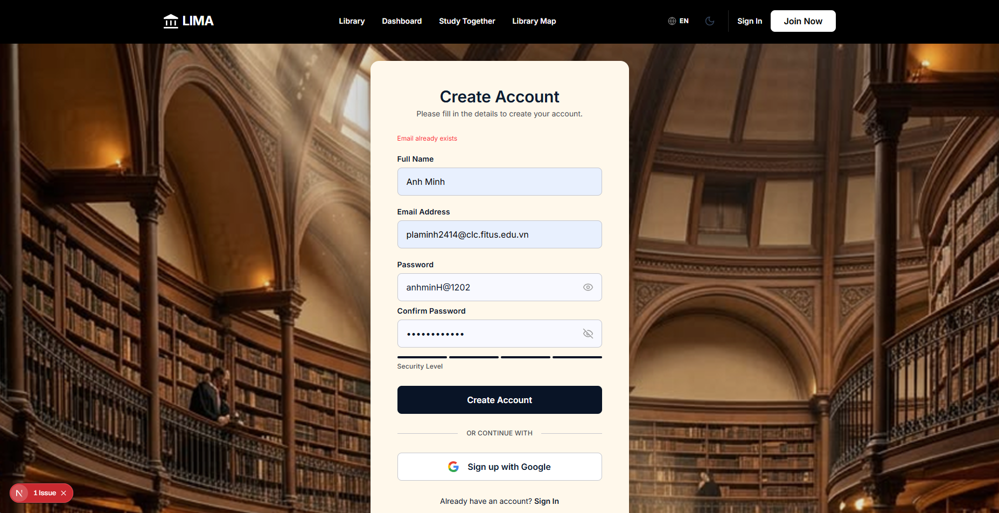
        
<em>Figure P-AUTH-01-AF01 – Email Already Registered</em>

        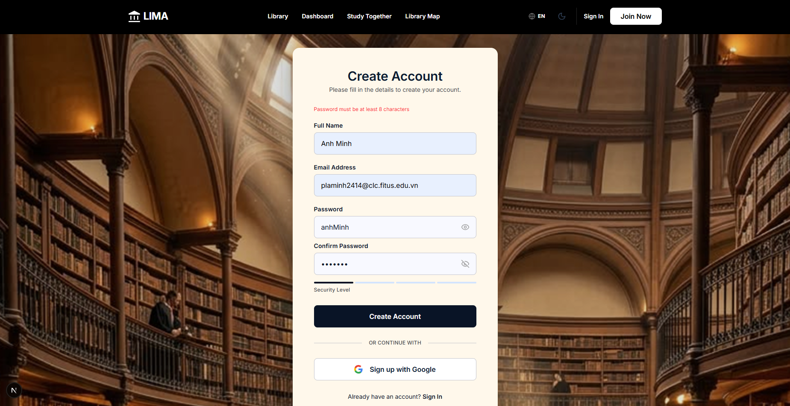
        
<em>Figure P-AUTH-01-AF02 – Password Requirements Not Met</em>

      </td>
    </tr>
  </tbody>
</table>

---

### UC-AUTH-02: Verify By Email

<table width="100%" border="1" cellpadding="8" cellspacing="0" style="border-collapse: collapse; font-family: Arial, sans-serif; font-size: 14px; border: 1px solid #d1d5db; margin-bottom: 20px;">
  <thead>
    <tr style="background-color: #1e3a8a; color: #ffffff;">
      <th colspan="2" style="text-align: left; padding: 12px; font-size: 16px;">
        Use Case: Verify By Email
      </th>
    </tr>
  </thead>
  <tbody>
    <tr>
      <td width="22%" style="background-color: #f8fafc; font-weight: bold; vertical-align: top;">Use Case ID</td>
      <td style="vertical-align: top;"><strong>UC-AUTH-02</strong></td>
    </tr>
    <tr>
      <td style="background-color: #f8fafc; font-weight: bold; vertical-align: top;">Brief Description</td>
      <td style="vertical-align: top;">
        Internal system routine handling verification token string generation, external email transactional routing, and account activation logic.
         <em>(Includes / Extends: <strong>Included UC supporting parent operational blocks under UC-AUTH-01 (Register).</strong>)</em>
      </td>
    </tr>
    <tr>
      <td style="background-color: #f8fafc; font-weight: bold; vertical-align: top;">Actor(s)</td>
      <td style="vertical-align: top;">User</td>
    </tr>
    <tr>
      <td style="background-color: #f8fafc; font-weight: bold; vertical-align: top;">Preconditions</td>
      <td style="vertical-align: top;">
        <ul style="margin: 0; padding-left: 20px; line-height: 1.5;">
          <li><strong>Registration Pipeline Activation:</strong> An orchestration call framework request is actively triggered via a parent user registration event.</li>
        </ul>
      </td>
    </tr>
    <tr>
      <td style="background-color: #f8fafc; font-weight: bold; vertical-align: top;">Flow of Events (Basic Flow)</td>
      <td style="vertical-align: top;">
        <ol style="margin: 0; padding-left: 20px; line-height: 1.6;">
          <li><strong>[Data Processing]:</strong> The system generates a cryptographically secure, time-limited verification token string link.</li>
          <li><strong>[Data Processing]:</strong> The system packages a transactional email notification payload enclosing the activation token URI link parameters.</li>
          <li><strong>[Data Processing]:</strong> The system dispatches the compilation payload out to the external Transactional Email Service Provider engine API.</li>
          <li><strong>[Actor Action]:</strong> The user opens their personal email client workspace, opens the message, and clicks the enclosed activation link parameter object.</li>
          <li><strong>[System Response]:</strong> The system interceptor parses the incoming request URI, confirms token validity, updates the matching user account status parameter flag from "Pending" to "Active", and returns a verification success confirmation callback to the parent context.</li>
        </ol>
      </td>
    </tr>
    <tr>
      <td style="background-color: #f8fafc; font-weight: bold; vertical-align: top;">Alternative / Exception Flows</td>
      <td style="vertical-align: top;">
        <ul style="margin: 0; padding-left: 20px; line-height: 1.5;">
          <li style="margin-bottom: 8px;">
            <strong>Boundary Horizon Exceeded (Step 5):</strong> If the user clicks the validation link after the expiration boundary has passed:
            <ol style="margin-top: 4px; margin-bottom: 4px; padding-left: 20px;">
              <li>The system flags the token lifecycle entry as invalid.</li>
              <li>The system renders a "Link Expired" error block layout panel and provides an interface node to request a new verification message block.</li>
            </ol>
            <strong>Postcondition (Alternative Flow):</strong> Account attributes retain their unverified resting states; target token entries purge from the operational caching memory layer.
          </li>
        </ul>
      </td>
    </tr>
    <tr>
      <td style="background-color: #f8fafc; font-weight: bold; vertical-align: top;">Postconditions</td>
      <td style="vertical-align: top;">
        <ul style="margin: 0; padding-left: 20px;">
          <li><strong>Account Modification Activation:</strong> User profile database rows convert permanently to fully verified "Active" operation states.</li>
        </ul>
      </td>
    </tr>
    <tr>
      <td style="background-color: #f8fafc; font-weight: bold; vertical-align: top;">Special Requirements</td>
      <td style="vertical-align: top;">
        <ul style="margin: 0; padding-left: 20px;">
          <li><strong>Nonce Cryptographic Signature:</strong> Verification tokens must be unique nonces signed with an HMAC signature protocol layer.</li>
        </ul>
      </td>
    </tr>
    <tr>
      <td style="background-color: #f8fafc; font-weight: bold; vertical-align: top;">Extension Points</td>
      <td style="vertical-align: top;">
        None
      </td>
    </tr>
    <tr>
      <td style="background-color: #f8fafc; font-weight: bold; vertical-align: top;">Prototype Screen</td>
      <td style="vertical-align: top;">
        
        
<em>Figure P-AUTH-02-BF01 – Check Inbox</em>

        
        
<em>Figure P-AUTH-02-BF02 – Verification Success</em>

        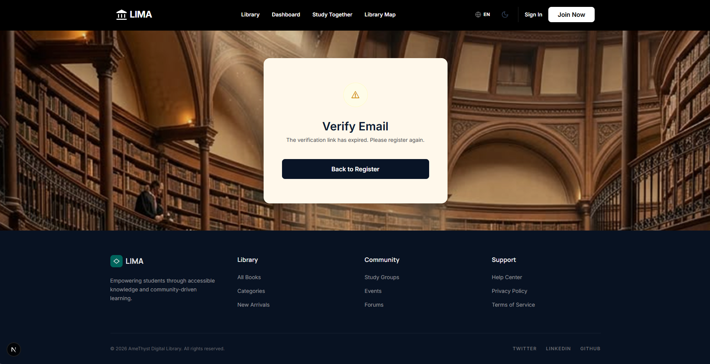
        
<em>Figure P-AUTH-02-AF01 – Verification Link Expired</em>

      </td>
    </tr>
  </tbody>
</table>

---

### UC-AUTH-03: Google OAuth

<table width="100%" border="1" cellpadding="8" cellspacing="0" style="border-collapse: collapse; font-family: Arial, sans-serif; font-size: 14px; border: 1px solid #d1d5db; margin-bottom: 20px;">
  <thead>
    <tr style="background-color: #1e3a8a; color: #ffffff;">
      <th colspan="2" style="text-align: left; padding: 12px; font-size: 16px;">
        Use Case: Google OAuth
      </th>
    </tr>
  </thead>
  <tbody>
    <tr>
      <td width="22%" style="background-color: #f8fafc; font-weight: bold; vertical-align: top;">Use Case ID</td>
      <td style="vertical-align: top;"><strong>UC-AUTH-03</strong></td>
    </tr>
    <tr>
      <td style="background-color: #f8fafc; font-weight: bold; vertical-align: top;">Brief Description</td>
      <td style="vertical-align: top;">
        Allows a user to instantly log in or register a new profile by authenticating via their external Google account credentials.
      </td>
    </tr>
    <tr>
      <td style="background-color: #f8fafc; font-weight: bold; vertical-align: top;">Actor(s)</td>
      <td style="vertical-align: top;">User</td>
    </tr>
    <tr>
      <td style="background-color: #f8fafc; font-weight: bold; vertical-align: top;">Preconditions</td>
      <td style="vertical-align: top;">
        <ul style="margin: 0; padding-left: 20px; line-height: 1.5;">
          <li><strong>Integration Mapping Active:</strong> The system maintains a valid OAuth client integration configuration mapping with Google APIs.</li>
        </ul>
      </td>
    </tr>
    <tr>
      <td style="background-color: #f8fafc; font-weight: bold; vertical-align: top;">Flow of Events (Basic Flow)</td>
      <td style="vertical-align: top;">
        <ol style="margin: 0; padding-left: 20px; line-height: 1.6;">
          <li><strong>[Actor Action]:</strong> The user clicks the "Continue with Google" layout control object node.</li>
          <li><strong>[System Response]:</strong> The system redirects the user's browser context to the secure Google Identity Provider authentication interface page.</li>
          <li><strong>[Actor Action]:</strong> The user logs into their Google account (if not already logged in) and grants authorization permissions to the application.</li>
          <li><strong>[System Response]:</strong> The Google Identity Provider returns a secure authorization token callback signal parameter to the system's redirect URI.</li>
          <li><strong>[Data Processing]:</strong> The system verifies the token integrity with Google's servers, extracts the user profile data (email, name, external ID), and checks if the user exists.</li>
          <li><strong>[System Response]:</strong> The system instantiates a valid authenticated application session token block and routes the user directly to the home dashboard view workspace.</li>
        </ol>
      </td>
    </tr>
    <tr>
      <td style="background-color: #f8fafc; font-weight: bold; vertical-align: top;">Alternative / Exception Flows</td>
      <td style="vertical-align: top;">
        <ul style="margin: 0; padding-left: 20px; line-height: 1.5;">
          <li style="margin-bottom: 8px;">
            <strong>Identity Provider Cancellation (Step 4):</strong> If the user cancels the authentication request on the Google portal side:
            <ol style="margin-top: 4px; margin-bottom: 4px; padding-left: 20px;">
              <li>The external provider passes a cancellation callback parameter string.</li>
              <li>The system catches the state error and returns the user back to the default login screen workspace.</li>
            </ol>
            <strong>Postcondition (Alternative Flow):</strong> Session token flags maintain an unauthenticated resting state; no user data modifications occur.
          </li>
          <li style="margin-bottom: 8px;">
            <strong>Suspended Account Access (Step 5):</strong> If the user account linked to the incoming Google email address has been explicitly suspended/banned internally:
            <ol style="margin-top: 4px; margin-bottom: 4px; padding-left: 20px;">
              <li>The system drops the incoming token lifecycle validation processing.</li>
              <li>The system presents an account blockade notification card layout component.</li>
            </ol>
            <strong>Postcondition (Alternative Flow):</strong> Authentication is denied; security tracking logs record the blocked access attempt instance.
          </li>
        </ul>
      </td>
    </tr>
    <tr>
      <td style="background-color: #f8fafc; font-weight: bold; vertical-align: top;">Postconditions</td>
      <td style="vertical-align: top;">
        <ul style="margin: 0; padding-left: 20px;">
          <li><strong>Client Session Bound:</strong> A secure application session token binds to the client browser, establishing a fully authenticated state.</li>
        </ul>
      </td>
    </tr>
    <tr>
      <td style="background-color: #f8fafc; font-weight: bold; vertical-align: top;">Special Requirements</td>
      <td style="vertical-align: top;">
        <ul style="margin: 0; padding-left: 20px;">
          <li><strong>Endpoint Latency Fallbacks:</strong> The system must fallback gracefully if third-party token validation endpoints experience sudden latency spikes or service outages.</li>
        </ul>
      </td>
    </tr>
    <tr>
      <td style="background-color: #f8fafc; font-weight: bold; vertical-align: top;">Extension Points</td>
      <td style="vertical-align: top;">
        None
      </td>
    </tr>
    <tr>
      <td style="background-color: #f8fafc; font-weight: bold; vertical-align: top;">Prototype Screen</td>
      <td style="vertical-align: top;">
        
        
<em>Figure P-AUTH-03-BF01 – Google Account Selection</em>

        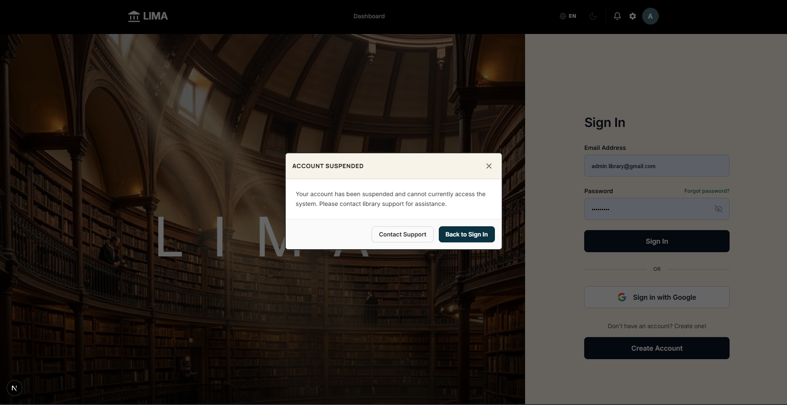
        
<em>Figure P-AUTH-03-AF01 – Suspended Account</em>

      </td>
    </tr>
  </tbody>
</table>

---

### UC-AUTH-04: Login

<table width="100%" border="1" cellpadding="8" cellspacing="0" style="border-collapse: collapse; font-family: Arial, sans-serif; font-size: 14px; border: 1px solid #d1d5db; margin-bottom: 20px;">
  <thead>
    <tr style="background-color: #1e3a8a; color: #ffffff;">
      <th colspan="2" style="text-align: left; padding: 12px; font-size: 16px;">
        Use Case: Login
      </th>
    </tr>
  </thead>
  <tbody>
    <tr>
      <td width="22%" style="background-color: #f8fafc; font-weight: bold; vertical-align: top;">Use Case ID</td>
      <td style="vertical-align: top;"><strong>UC-AUTH-04</strong></td>
    </tr>
    <tr>
      <td style="background-color: #f8fafc; font-weight: bold; vertical-align: top;">Brief Description</td>
      <td style="vertical-align: top;">
        Authenticates an existing user utilizing their registered email address and password string credentials.
      </td>
    </tr>
    <tr>
      <td style="background-color: #f8fafc; font-weight: bold; vertical-align: top;">Actor(s)</td>
      <td style="vertical-align: top;">User</td>
    </tr>
    <tr>
      <td style="background-color: #f8fafc; font-weight: bold; vertical-align: top;">Preconditions</td>
      <td style="vertical-align: top;">
        <ul style="margin: 0; padding-left: 20px; line-height: 1.5;">
          <li><strong>Verified Roster Record:</strong> The user possesses an active, fully verified account record inside the system database.</li>
        </ul>
      </td>
    </tr>
    <tr>
      <td style="background-color: #f8fafc; font-weight: bold; vertical-align: top;">Flow of Events (Basic Flow)</td>
      <td style="vertical-align: top;">
        <ol style="margin: 0; padding-left: 20px; line-height: 1.6;">
          <li><strong>[Actor Action]:</strong> The user inputs their email address and account password into the login card component interface fields.</li>
          <li><strong>[Actor Action]:</strong> The user hits the primary "Login" submission action node control.</li>
          <li><strong>[System Response]:</strong> The system queries the identity tables to locate the matching user profile by the supplied email parameter identifier.</li>
          <li><strong>[Data Processing]:</strong> The system extracts the saved hashed password string and runs a comparison matrix check against the incoming plain text password.</li>
          <li><strong>[Data Processing]:</strong> The system initializes an active authenticated session context array block and updates the user's "Last Login" metadata timestamp log row.</li>
          <li><strong>[Display Result]:</strong> The system redirects the active UI framework viewport into the central authenticated landing layout dashboard.</li>
        </ol>
      </td>
    </tr>
    <tr>
      <td style="background-color: #f8fafc; font-weight: bold; vertical-align: top;">Alternative / Exception Flows</td>
      <td style="vertical-align: top;">
        <ul style="margin: 0; padding-left: 20px; line-height: 1.5;">
          <li style="margin-bottom: 8px;">
            <strong>Mismatched Credentials Validation Failure (Step 3 / Step 4):</strong> If the supplied email parameter does not exist, or the computed password hash fails verification checks:
            <ol style="margin-top: 4px; margin-bottom: 4px; padding-left: 20px;">
              <li>The system blocks credential confirmation parameters.</li>
              <li>The system displays a generalized interface summary error: "Invalid email or password combination."</li>
            </ol>
            <strong>Postcondition (Alternative Flow):</strong> Session context objects remain completely unauthenticated; internal login failure counter logs increment.
          </li>
          <li style="margin-bottom: 8px;">
            <strong>Unverified Registration Blockade (Step 5):</strong> If the target account profile maintains an unverified state flag (e.g., registration incomplete):
            <ol style="margin-top: 4px; margin-bottom: 4px; padding-left: 20px;">
              <li>The system interrupts the standard loading routine parameter scripts.</li>
              <li>The system redirects the user viewport frame to a dynamic email re-verification workflow layout.</li>
            </ol>
            <strong>Postcondition (Alternative Flow):</strong> Access to secure workspaces remains blocked; the user is locked to the verification dashboard lane.
          </li>
        </ul>
      </td>
    </tr>
    <tr>
      <td style="background-color: #f8fafc; font-weight: bold; vertical-align: top;">Postconditions</td>
      <td style="vertical-align: top;">
        <ul style="margin: 0; padding-left: 20px;">
          <li><strong>Context Workspace Mounted:</strong> An active authenticated session token mounts securely inside the user workspace context environment.</li>
        </ul>
      </td>
    </tr>
    <tr>
      <td style="background-color: #f8fafc; font-weight: bold; vertical-align: top;">Special Requirements</td>
      <td style="vertical-align: top;">
        <ul style="margin: 0; padding-left: 20px;">
          <li><strong>Brute-Force Rate Limiting:</strong> To prevent brute-force profiling vectors, the login endpoint must enforce strict rate-limiting mechanics after 5 sequential authentication failures.</li>
        </ul>
      </td>
    </tr>
    <tr>
      <td style="background-color: #f8fafc; font-weight: bold; vertical-align: top;">Extension Points</td>
      <td style="vertical-align: top;">
        None
      </td>
    </tr>
    <tr>
      <td style="background-color: #f8fafc; font-weight: bold; vertical-align: top;">Prototype Screen</td>
      <td style="vertical-align: top;">
        
        
<em>Figure P-AUTH-04-BF01 – Login Form</em>

        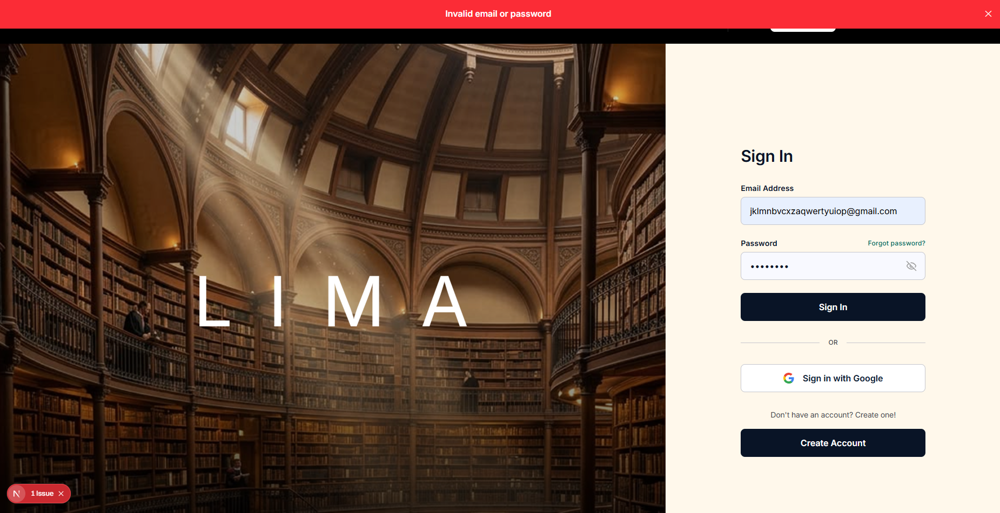
        
<em>Figure P-AUTH-04-AF01 – Invalid Credentials</em>

        
        
<em>Figure P-AUTH-02-BF01 – Check Inbox (reused for the unverified account flow)</em>

      </td>
    </tr>
  </tbody>
</table>

---

### UC-AUTH-05: Forget Password

<table width="100%" border="1" cellpadding="8" cellspacing="0" style="border-collapse: collapse; font-family: Arial, sans-serif; font-size: 14px; border: 1px solid #d1d5db; margin-bottom: 20px;">
  <thead>
    <tr style="background-color: #1e3a8a; color: #ffffff;">
      <th colspan="2" style="text-align: left; padding: 12px; font-size: 16px;">
        Use Case: Forget Password
      </th>
    </tr>
  </thead>
  <tbody>
    <tr>
      <td width="22%" style="background-color: #f8fafc; font-weight: bold; vertical-align: top;">Use Case ID</td>
      <td style="vertical-align: top;"><strong>UC-AUTH-05</strong></td>
    </tr>
    <tr>
      <td style="background-color: #f8fafc; font-weight: bold; vertical-align: top;">Brief Description</td>
      <td style="vertical-align: top;">
        Orchestrates the multi-stage account recovery sequence allowing a user who lost their credentials to re-secure account access via dynamic secondary channel checks.
         <em>(Includes / Extends: <strong>Includes UC-AUTH-06 (Verify By OTP) and UC-AUTH-07 (Change Password).</strong>)</em>
      </td>
    </tr>
    <tr>
      <td style="background-color: #f8fafc; font-weight: bold; vertical-align: top;">Actor(s)</td>
      <td style="vertical-align: top;">User</td>
    </tr>
    <tr>
      <td style="background-color: #f8fafc; font-weight: bold; vertical-align: top;">Preconditions</td>
      <td style="vertical-align: top;">
        <ul style="margin: 0; padding-left: 20px; line-height: 1.5;">
          <li><strong>Lost Access Context:</strong> The user cannot access their account due to forgotten credential parameters.</li>
        </ul>
      </td>
    </tr>
    <tr>
      <td style="background-color: #f8fafc; font-weight: bold; vertical-align: top;">Flow of Events (Basic Flow)</td>
      <td style="vertical-align: top;">
        <ol style="margin: 0; padding-left: 20px; line-height: 1.6;">
          <li><strong>[Actor Action]:</strong> The user clicks the "Forgot Password?" text link navigation node on the login view panel layout.</li>
          <li><strong>[Actor Action]:</strong> The user inputs their registered account email identifier into the recovery prompt and submits.</li>
          <li><strong>[System Response]:</strong> The system verifies the user record exists and triggers the mandatory include sub-routine <code> Verify By OTP (UC-AUTH-06)</code> to validate identity.</li>
          <li><strong>[System Response]:</strong> Upon catching a successful callback validation status from the OTP routine, the system invokes the mandatory include sub-routine <code>Change Password (UC-AUTH-07)</code>.</li>
          <li><strong>[Display Result]:</strong> The system presents a password reset complete confirmation view layout with a redirection button linking back to the login page.</li>
        </ol>
      </td>
    </tr>
    <tr>
      <td style="background-color: #f8fafc; font-weight: bold; vertical-align: top;">Alternative / Exception Flows</td>
      <td style="vertical-align: top;">
        <ul style="margin: 0; padding-left: 20px; line-height: 1.5;">
          <li style="margin-bottom: 8px;">
            <strong>User Enumeration Guard Obscurity (Step 3):</strong> If the provided email parameter cannot be found inside active database records:
            <ol style="margin-top: 4px; margin-bottom: 4px; padding-left: 20px;">
              <li>The system executes a silent fallback dummy path (to prevent user enumeration exploits).</li>
              <li>The system surfaces an identical notification layout screen block: "Recovery steps dispatched if account exists."</li>
            </ol>
            <strong>Postcondition (Alternative Flow):</strong> No background system variables update; downstream OTP generation routines abort safely.
          </li>
        </ul>
      </td>
    </tr>
    <tr>
      <td style="background-color: #f8fafc; font-weight: bold; vertical-align: top;">Postconditions</td>
      <td style="vertical-align: top;">
        <ul style="margin: 0; padding-left: 20px;">
          <li><strong>Operational Account Commit:</strong> The targeted user account credentials update to the new password configuration block successfully.</li>
        </ul>
      </td>
    </tr>
    <tr>
      <td style="background-color: #f8fafc; font-weight: bold; vertical-align: top;">Special Requirements</td>
      <td style="vertical-align: top;">
        <ul style="margin: 0; padding-left: 20px;">
          <li><strong>Token Expiration Ceiling:</strong> The recovery orchestration flow lifecycle must expire within 15 minutes of initial generation token stamping.</li>
        </ul>
      </td>
    </tr>
    <tr>
      <td style="background-color: #f8fafc; font-weight: bold; vertical-align: top;">Extension Points</td>
      <td style="vertical-align: top;">
        None
      </td>
    </tr>
    <tr>
      <td style="background-color: #f8fafc; font-weight: bold; vertical-align: top;">Prototype Screen</td>
      <td style="vertical-align: top;">
        
        
<em>Figure P-AUTH-05-BF01 – Forgot Password Form</em>

        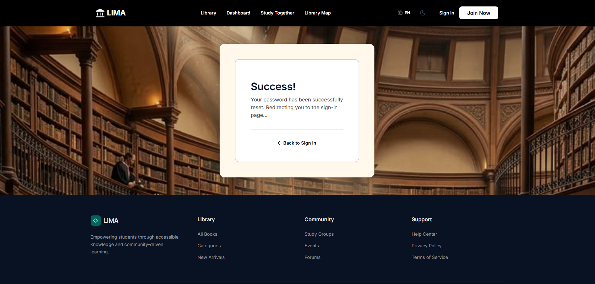
        
<em>Figure P-AUTH-05-BF02 – Password Reset Success</em>

      </td>
    </tr>
  </tbody>
</table>

---

### UC-AUTH-06: Verify By OTP

<table width="100%" border="1" cellpadding="8" cellspacing="0" style="border-collapse: collapse; font-family: Arial, sans-serif; font-size: 14px; border: 1px solid #d1d5db; margin-bottom: 20px;">
  <thead>
    <tr style="background-color: #1e3a8a; color: #ffffff;">
      <th colspan="2" style="text-align: left; padding: 12px; font-size: 16px;">
        Use Case: Verify By OTP
      </th>
    </tr>
  </thead>
  <tbody>
    <tr>
      <td width="22%" style="background-color: #f8fafc; font-weight: bold; vertical-align: top;">Use Case ID</td>
      <td style="vertical-align: top;"><strong>UC-AUTH-06</strong></td>
    </tr>
    <tr>
      <td style="background-color: #f8fafc; font-weight: bold; vertical-align: top;">Brief Description</td>
      <td style="vertical-align: top;">
        Internal identity verification framework routine processing temporary One-Time Password generation, delivery routing, and validation.
         <em>(Includes / Extends: <strong>Included UC supporting parent operational blocks under UC-AUTH-05 (Forget Password).</strong>)</em>
      </td>
    </tr>
    <tr>
      <td style="background-color: #f8fafc; font-weight: bold; vertical-align: top;">Actor(s)</td>
      <td style="vertical-align: top;">User</td>
    </tr>
    <tr>
      <td style="background-color: #f8fafc; font-weight: bold; vertical-align: top;">Preconditions</td>
      <td style="vertical-align: top;">
        <ul style="margin: 0; padding-left: 20px; line-height: 1.5;">
          <li><strong>Master Invocation Context:</strong> Context validation parameters are received systematically via parent recovery orchestration flows.</li>
        </ul>
      </td>
    </tr>
    <tr>
      <td style="background-color: #f8fafc; font-weight: bold; vertical-align: top;">Flow of Events (Basic Flow)</td>
      <td style="vertical-align: top;">
        <ol style="margin: 0; padding-left: 20px; line-height: 1.6;">
          <li><strong>[Data Processing]:</strong> The system generates a highly localized 6-digit numeric One-Time Password parameter token.</li>
          <li><strong>[Data Processing]:</strong> The system saves the generated OTP token to a short-lived memory cache with an explicit 5-minute time-to-live parameter.</li>
          <li><strong>[Data Processing]:</strong> The system routes the OTP payload to the user's secondary verification channel via the External Messaging Service Provider API.</li>
          <li><strong>[Actor Action]:</strong> The user receives the numeric passcode, types the characters into the application UI validation interface layout box, and submits.</li>
          <li><strong>[System Response]:</strong> The system references the cache layer to verify match alignment and returns a successful verification completion token callback.</li>
        </ol>
      </td>
    </tr>
    <tr>
      <td style="background-color: #f8fafc; font-weight: bold; vertical-align: top;">Alternative / Exception Flows</td>
      <td style="vertical-align: top;">
        <ul style="margin: 0; padding-left: 20px; line-height: 1.5;">
          <li style="margin-bottom: 8px;">
            <strong>Mismatched Passcode Entry (Step 5):</strong> If the user inputs a numeric sequence that does not match the active cached value:
            <ol style="margin-top: 4px; margin-bottom: 4px; padding-left: 20px;">
              <li>The system blocks transaction submission loops.</li>
              <li>The system increments a failure tally index row and throws a validation mismatch warning notice.</li>
            </ol>
            <strong>Postcondition (Alternative Flow):</strong> The verification validation step remains unfulfilled; if failures surpass 3 consecutive attempts, the session token blocks completely.
          </li>
          <li style="margin-bottom: 8px;">
            <strong>Cache Expiration Cleared (Step 5):</strong> If the user interface session remains idle until the 5-minute TTL cache window completely clears:
            <ol style="margin-top: 4px; margin-bottom: 4px; padding-left: 20px;">
              <li>The system invalidates the current recovery attempt path parameters.</li>
              <li>The system forces a fresh configuration request iteration workflow.</li>
            </ol>
            <strong>Postcondition (Alternative Flow):</strong> The memory cache layer purges the entry parameters cleanly; the user interface falls back to step 1.
          </li>
        </ul>
      </td>
    </tr>
    <tr>
      <td style="background-color: #f8fafc; font-weight: bold; vertical-align: top;">Postconditions</td>
      <td style="vertical-align: top;">
        <ul style="margin: 0; padding-left: 20px;">
          <li><strong>Temporary Authentication Staging:</strong> The current browser session context earns a temporary "Identity Confirmed" verification token pass.</li>
        </ul>
      </td>
    </tr>
    <tr>
      <td style="background-color: #f8fafc; font-weight: bold; vertical-align: top;">Special Requirements</td>
      <td style="vertical-align: top;">
        <ul style="margin: 0; padding-left: 20px;">
          <li><strong>Frequency Generation Caps:</strong> The system must prevent brute forcing by restricting individual OTP generation requests to a maximum frequency of once per 60 seconds per user profile.</li>
        </ul>
      </td>
    </tr>
    <tr>
      <td style="background-color: #f8fafc; font-weight: bold; vertical-align: top;">Extension Points</td>
      <td style="vertical-align: top;">
        None
      </td>
    </tr>
    <tr>
      <td style="background-color: #f8fafc; font-weight: bold; vertical-align: top;">Prototype Screen</td>
      <td style="vertical-align: top;">
        
        
<em>Figure P-AUTH-06-BF01 – Enter OTP</em>

        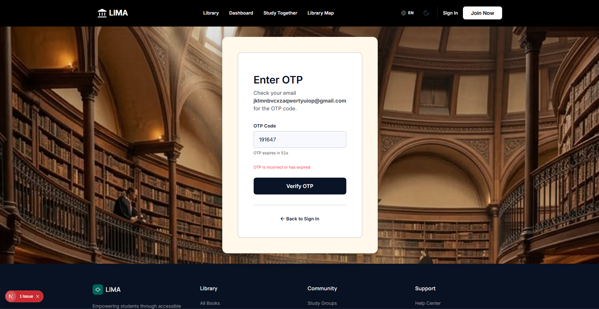
        
<em>Figure P-AUTH-06-AF01 – Incorrect OTP</em>

        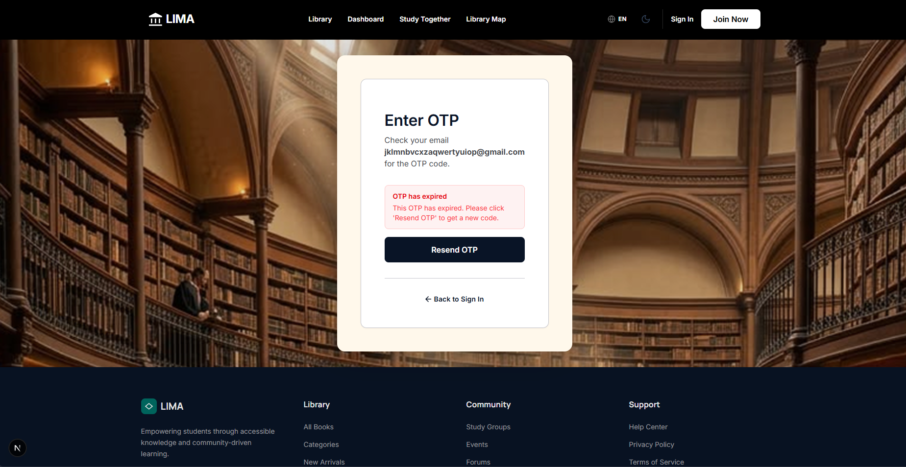
        
<em>Figure P-AUTH-06-AF02 – OTP Expired</em>

      </td>
    </tr>
  </tbody>
</table>

---

### UC-AUTH-07: Change Password

<table width="100%" border="1" cellpadding="8" cellspacing="0" style="border-collapse: collapse; font-family: Arial, sans-serif; font-size: 14px; border: 1px solid #d1d5db; margin-bottom: 20px;">
  <thead>
    <tr style="background-color: #1e3a8a; color: #ffffff;">
      <th colspan="2" style="text-align: left; padding: 12px; font-size: 16px;">
        Use Case: Change Password
      </th>
    </tr>
  </thead>
  <tbody>
    <tr>
      <td width="22%" style="background-color: #f8fafc; font-weight: bold; vertical-align: top;">Use Case ID</td>
      <td style="vertical-align: top;"><strong>UC-AUTH-07</strong></td>
    </tr>
    <tr>
      <td style="background-color: #f8fafc; font-weight: bold; vertical-align: top;">Brief Description</td>
      <td style="vertical-align: top;">
        Internal business utility module managing new password parameter capture, verification constraints check, and core database credential updates.
         <em>(Includes / Extends: <strong>Included UC supporting parent operational blocks under UC-AUTH-05 (Forget Password).</strong>)</em>
      </td>
    </tr>
    <tr>
      <td style="background-color: #f8fafc; font-weight: bold; vertical-align: top;">Actor(s)</td>
      <td style="vertical-align: top;">Logged user</td>
    </tr>
    <tr>
      <td style="background-color: #f8fafc; font-weight: bold; vertical-align: top;">Preconditions</td>
      <td style="vertical-align: top;">
        <ul style="margin: 0; padding-left: 20px; line-height: 1.5;">
          <li><strong>Validation Staging Verification:</strong> The current transaction flow state contains a valid "Identity Confirmed" pass flag passed forward from `UC-AUTH-06`.</li>
        </ul>
      </td>
    </tr>
    <tr>
      <td style="background-color: #f8fafc; font-weight: bold; vertical-align: top;">Flow of Events (Basic Flow)</td>
      <td style="vertical-align: top;">
        <ol style="margin: 0; padding-left: 20px; line-height: 1.6;">
          <li><strong>[Display Result]:</strong> The system displays a structural "Reset Password" input entry form layout component framework.</li>
          <li><strong>[Actor Action]:</strong> The user inputs a fresh password string value and completes the verifying confirmation field duplication text box.</li>
          <li><strong>[System Response]:</strong> The system evaluates the input parameters to ensure both entries align perfectly and clear complexity criteria check limits.</li>
          <li><strong>[Data Processing]:</strong> The system hashes the fresh input password selection payload using cryptographic salt properties and writes the value directly to the user profile table column database space.</li>
          <li><strong>[Data Processing]:</strong> The system clears out any active external session token allocations for this user to enforce a global logout across all peripheral devices.</li>
          <li><strong>[System Response]:</strong> The system issues a successful operation completion code signal return back out to the master workflow orchestrator.</li>
        </ol>
      </td>
    </tr>
    <tr>
      <td style="background-color: #f8fafc; font-weight: bold; vertical-align: top;">Alternative / Exception Flows</td>
      <td style="vertical-align: top;">
        <ul style="margin: 0; padding-left: 20px; line-height: 1.5;">
          <li style="margin-bottom: 8px;">
            <strong>Form Match Verification Defect (Step 3):</strong> If the secondary confirmation verification text input does not match the primary new password string entry:
            <ol style="margin-top: 4px; margin-bottom: 4px; padding-left: 20px;">
              <li>The system blocks submission pipelines.</li>
              <li>The system displays a localized validation text warning notice: "Passwords do not match."</li>
            </ol>
            <strong>Postcondition (Alternative Flow):</strong> Security credentials preserve historical states exactly; write operations are intercepted and discarded prior to database execution threads.
          </li>
        </ul>
      </td>
    </tr>
    <tr>
      <td style="background-color: #f8fafc; font-weight: bold; vertical-align: top;">Postconditions</td>
      <td style="vertical-align: top;">
        <ul style="margin: 0; padding-left: 20px;">
          <li><strong>Ledger Attribute Mutation:</strong> The underlying application database records permanent structural mutations over the user's credential secret parameter attributes.</li>
        </ul>
      </td>
    </tr>
    <tr>
      <td style="background-color: #f8fafc; font-weight: bold; vertical-align: top;">Special Requirements</td>
      <td style="vertical-align: top;">
        None
      </td>
    </tr>
    <tr>
      <td style="background-color: #f8fafc; font-weight: bold; vertical-align: top;">Extension Points</td>
      <td style="vertical-align: top;">
        None
      </td>
    </tr>
    <tr>
      <td style="background-color: #f8fafc; font-weight: bold; vertical-align: top;">Prototype Screen</td>
      <td style="vertical-align: top;">
        
        
<em>Figure P-AUTH-07-BF01 – Reset Password Form</em>

        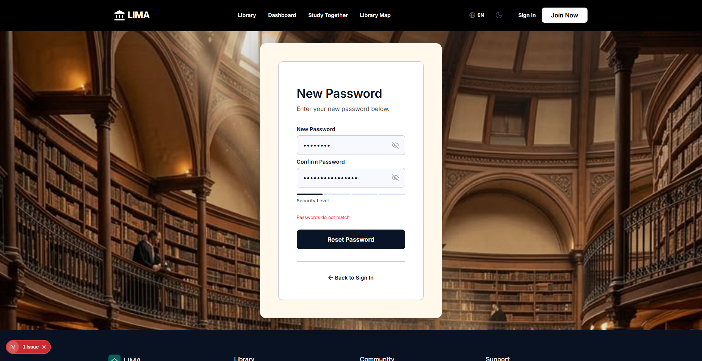
        
<em>Figure P-AUTH-07-AF01 – Passwords Do Not Match</em>

      </td>
    </tr>
  </tbody>
</table>

---

## III. Profile Management
### Use case diagram

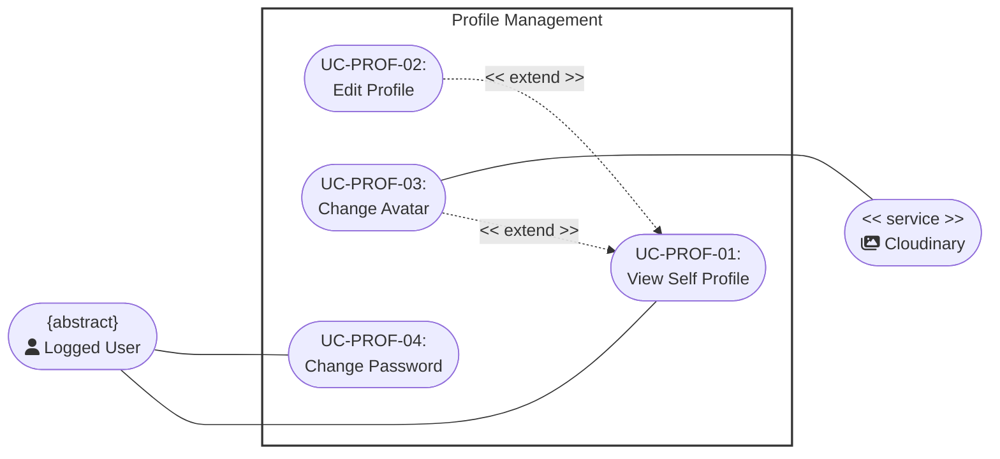
```mermaid
flowchart LR
    %% Actors
    ActorLeft(["<center>{abstract} <br> fa:fa-user Logged User</center>"])
    ActorRight(["<center>&lt;&lt; service &gt;&gt; <br>fa:fa-images Cloudinary</center>"]) 

    %% System Boundary
    subgraph ProfileManagement [Profile Management]
        UC1(["<center>UC-PROF-01:<br>View Self Profile</center>"])
        UC2(["<center>UC-PROF-02:<br>Edit Profile</center>"])
        UC3(["<center>UC-PROF-03:<br>Change Avatar</center>"])
        UC4(["<center>UC-PROF-04:<br>Change Password</center>"])
    end
    
	ActorLeft ~~~~~ ProfileManagement ~~~ ActorRight

    %% Relationships
    ActorLeft --- UC1
    ActorLeft --- UC4
    
    UC2 -. "<< extend >>" .-> UC1
    UC3 -. "<< extend >>" .-> UC1
    
    UC3 --- ActorRight 
   
    %% Styling to make it clean
    style ProfileManagement fill:#fff,stroke:#333,stroke-width:2px
```

---
### UC-PROF-01: View Self Profile

<table width="100%" border="1" cellpadding="8" cellspacing="0" style="border-collapse: collapse; font-family: Arial, sans-serif; font-size: 14px; border: 1px solid #d1d5db; margin-bottom: 20px;">
  <thead>
    <tr style="background-color: #1e3a8a; color: #ffffff;">
      <th colspan="2" style="text-align: left; padding: 12px; font-size: 16px;">
        Use Case: View Self Profile
      </th>
    </tr>
  </thead>
  <tbody>
    <tr>
      <td width="22%" style="background-color: #f8fafc; font-weight: bold; vertical-align: top;">Use Case ID</td>
      <td style="vertical-align: top;"><strong>UC-PROF-01</strong></td>
    </tr>
    <tr>
      <td style="background-color: #f8fafc; font-weight: bold; vertical-align: top;">Brief Description</td>
      <td style="vertical-align: top;">
        Allows an authenticated user to view their personal profile page dashboard, showcasing their account metadata, current avatar, and personal details.
         <em>(Includes / Extends: <strong>Extended by Edit Profile and Change Avatar (at Step 5).</strong>)</em>
      </td>
    </tr>
    <tr>
      <td style="background-color: #f8fafc; font-weight: bold; vertical-align: top;">Actor(s)</td>
      <td style="vertical-align: top;">Logged user</td>
    </tr>
    <tr>
      <td style="background-color: #f8fafc; font-weight: bold; vertical-align: top;">Preconditions</td>
      <td style="vertical-align: top;">
        <ul style="margin: 0; padding-left: 20px; line-height: 1.5;">
          <li><strong>Verified Authentication State:</strong> The user has successfully authenticated and holds an active session token.</li>
          <li><strong>Workspace Navigation Focus:</strong> The user has navigated to the account settings layout area.</li>
        </ul>
      </td>
    </tr>
    <tr>
      <td style="background-color: #f8fafc; font-weight: bold; vertical-align: top;">Flow of Events (Basic Flow)</td>
      <td style="vertical-align: top;">
        <ol style="margin: 0; padding-left: 20px; line-height: 1.6;">
          <li><strong>[Actor Action]:</strong> The user clicks on the "My Profile" item link within the primary navigation menu layout.</li>
          <li><strong>[Data Processing]:</strong> The system fetches the corresponding profile record metrics from the user database partition.</li>
          <li><strong>[Display Result]:</strong> The system maps and populates user data fields (Display Name, Account Email, Registration Date) into the view interface template.</li>
          <li><strong>[Display Result]:</strong> The system requests the active profile image thumbnail link to render the user's avatar image block.</li>
          <li><strong>[System Response]:</strong> The system exposes extension interface interaction triggers ("Edit Profile" and "Change Avatar" button widgets).</li>
        </ol>
      </td>
    </tr>
    <tr>
      <td style="background-color: #f8fafc; font-weight: bold; vertical-align: top;">Alternative / Exception Flows</td>
      <td style="vertical-align: top;">
        <ul style="margin: 0; padding-left: 20px; line-height: 1.5;">
          <li style="margin-bottom: 8px;">
            <strong>Database Partition Retrieval Failure (Step 2):</strong> If profile data records fail to resolve due to localized database connection drops:
            <ol style="margin-top: 4px; margin-bottom: 4px; padding-left: 20px;">
              <li>The system halts the dashboard layout compilation steps immediately.</li>
              <li>The system overlays a persistent error component banner layout: "Profile details are temporarily offline."</li>
            </ol>
            <strong>Postcondition (Alternative Flow):</strong> The screen display shows a structural retrieval error indicator; no empty form entry containers open.
          </li>
        </ul>
      </td>
    </tr>
    <tr>
      <td style="background-color: #f8fafc; font-weight: bold; vertical-align: top;">Postconditions</td>
      <td style="vertical-align: top;">
        <ul style="margin: 0; padding-left: 20px;">
          <li><strong>Dashboard UI Component Staging:</strong> The user's complete private profile view profile template renders securely onto the client interface screen.</li>
        </ul>
      </td>
    </tr>
    <tr>
      <td style="background-color: #f8fafc; font-weight: bold; vertical-align: top;">Special Requirements</td>
      <td style="vertical-align: top;">
        <ul style="margin: 0; padding-left: 20px;">
          <li><strong>Sensitive Session Token Masking:</strong> The profile dashboard viewport screen must obscure highly sensitive configuration values (such as underlying token identifiers) from plain view elements.</li>
        </ul>
      </td>
    </tr>
    <tr>
      <td style="background-color: #f8fafc; font-weight: bold; vertical-align: top;">Extension Points</td>
      <td style="vertical-align: top;">
        <ul style="margin: 0; padding-left: 20px;">
          <li><strong>Edit Profile:</strong> Location inside event flow: Exposing extension interface triggers (Step 5).</li>
          <li><strong>Change Avatar:</strong> Location inside event flow: Exposing extension interface triggers (Step 5).   ---</li>
        </ul>
      </td>
    </tr>
    <tr>
      <td style="background-color: #f8fafc; font-weight: bold; vertical-align: top;">Prototype Screen</td>
      <td style="vertical-align: top;">
        
        
<em>Figure P-PROF-01-BF01 – View Profile</em>

        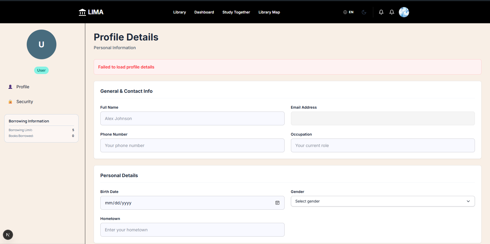
        
<em>Figure P-PROF-01-AF01 – Profile Unavailable</em>

      </td>
    </tr>
  </tbody>
</table>

---

### UC-PROF-02: Edit Profile

<table width="100%" border="1" cellpadding="8" cellspacing="0" style="border-collapse: collapse; font-family: Arial, sans-serif; font-size: 14px; border: 1px solid #d1d5db; margin-bottom: 20px;">
  <thead>
    <tr style="background-color: #1e3a8a; color: #ffffff;">
      <th colspan="2" style="text-align: left; padding: 12px; font-size: 16px;">
        Use Case: Edit Profile
      </th>
    </tr>
  </thead>
  <tbody>
    <tr>
      <td width="22%" style="background-color: #f8fafc; font-weight: bold; vertical-align: top;">Use Case ID</td>
      <td style="vertical-align: top;"><strong>UC-PROF-02</strong></td>
    </tr>
    <tr>
      <td style="background-color: #f8fafc; font-weight: bold; vertical-align: top;">Brief Description</td>
      <td style="vertical-align: top;">
        Extends the basic profile view dashboard by converting plain-text data fields into dynamic, editable input forms to let users update their personal details.
         <em>(Includes / Extends: <strong>Extends UC-PROF-01 (View Self Profile) — extension point: User triggers the active "Edit Profile" control button link within the profile dashboard view layout.</strong>)</em>
      </td>
    </tr>
    <tr>
      <td style="background-color: #f8fafc; font-weight: bold; vertical-align: top;">Actor(s)</td>
      <td style="vertical-align: top;">Logged user</td>
    </tr>
    <tr>
      <td style="background-color: #f8fafc; font-weight: bold; vertical-align: top;">Preconditions</td>
      <td style="vertical-align: top;">
        <ul style="margin: 0; padding-left: 20px; line-height: 1.5;">
          <li><strong>Active Base Context Display:</strong> The base use case `View Self Profile (UC-PROF-01)` must be currently active and rendering data on screen.</li>
        </ul>
      </td>
    </tr>
    <tr>
      <td style="background-color: #f8fafc; font-weight: bold; vertical-align: top;">Flow of Events (Basic Flow)</td>
      <td style="vertical-align: top;">
        <ol style="margin: 0; padding-left: 20px; line-height: 1.6;">
          <li><strong>[Actor Action]:</strong> The user clicks the "Edit Profile" action button component widget.</li>
          <li><strong>[System Response]:</strong> The system toggles the dashboard interface layout state variables, swapping static display texts for live text input boxes.</li>
          <li><strong>[Actor Action]:</strong> The user modifies targeted data entry string values (e.g., changes their Display Name or Bio summary details).</li>
          <li><strong>[Actor Action]:</strong> The user clicks the "Save Changes" configuration submit button.</li>
          <li><strong>[Data Processing]:</strong> The system parses inputs, sanitizes string objects, and executes a database update sequence transaction against the target user data row columns.</li>
          <li><strong>[Display Result]:</strong> The system switches the view screen state criteria back to the standard text-display layout mode and surfaces a brief confirmation success toast banner notice.</li>
        </ol>
      </td>
    </tr>
    <tr>
      <td style="background-color: #f8fafc; font-weight: bold; vertical-align: top;">Alternative / Exception Flows</td>
      <td style="vertical-align: top;">
        <ul style="margin: 0; padding-left: 20px; line-height: 1.5;">
          <li style="margin-bottom: 8px;">
            <strong>Lexical Parsing Constraints Rejection (Step 5):</strong> If input text parsing rules flag validation constraint breakages (e.g. illegal structural characters in name elements):
            <ol style="margin-top: 4px; margin-bottom: 4px; padding-left: 20px;">
              <li>The system prevents data persistence steps.</li>
              <li>The system returns visual focus to the problem field element and displays explicit inline error tips.</li>
            </ol>
            <strong>Postcondition (Alternative Flow):</strong> Database table values remain locked to historical state values; the input edit layout remains active pending string correction actions.
          </li>
        </ul>
      </td>
    </tr>
    <tr>
      <td style="background-color: #f8fafc; font-weight: bold; vertical-align: top;">Postconditions</td>
      <td style="vertical-align: top;">
        <ul style="margin: 0; padding-left: 20px;">
          <li><strong>Global Variable Synchronization:</strong> Revised personal metadata values write securely to production databases and update globally across active user session viewports.</li>
        </ul>
      </td>
    </tr>
    <tr>
      <td style="background-color: #f8fafc; font-weight: bold; vertical-align: top;">Special Requirements</td>
      <td style="vertical-align: top;">
        None
      </td>
    </tr>
    <tr>
      <td style="background-color: #f8fafc; font-weight: bold; vertical-align: top;">Extension Points</td>
      <td style="vertical-align: top;">
        None
      </td>
    </tr>
    <tr>
      <td style="background-color: #f8fafc; font-weight: bold; vertical-align: top;">Prototype Screen</td>
      <td style="vertical-align: top;">
        
        
<em>Figure P-PROF-01-BF01 – View Profile (reused as the profile editing entry screen)</em>

        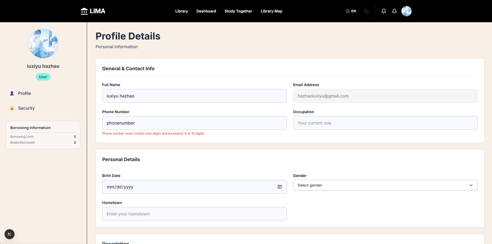
        
<em>Figure P-PROF-02-AF01 – Invalid Profile Information</em>

      </td>
    </tr>
  </tbody>
</table>

---

### UC-PROF-03: Change Avatar

<table width="100%" border="1" cellpadding="8" cellspacing="0" style="border-collapse: collapse; font-family: Arial, sans-serif; font-size: 14px; border: 1px solid #d1d5db; margin-bottom: 20px;">
  <thead>
    <tr style="background-color: #1e3a8a; color: #ffffff;">
      <th colspan="2" style="text-align: left; padding: 12px; font-size: 16px;">
        Use Case: Change Avatar
      </th>
    </tr>
  </thead>
  <tbody>
    <tr>
      <td width="22%" style="background-color: #f8fafc; font-weight: bold; vertical-align: top;">Use Case ID</td>
      <td style="vertical-align: top;"><strong>UC-PROF-03</strong></td>
    </tr>
    <tr>
      <td style="background-color: #f8fafc; font-weight: bold; vertical-align: top;">Brief Description</td>
      <td style="vertical-align: top;">
        Extends the base profile display context to allow users to upload, process, and attach a customized picture graphic to act as their system identity avatar icon.
         <em>(Includes / Extends: <strong>Extends UC-PROF-01 (View Self Profile) — extension point: User selects the profile picture thumbnail element or clicks the "Change Avatar" button action link.</strong>)</em>
      </td>
    </tr>
    <tr>
      <td style="background-color: #f8fafc; font-weight: bold; vertical-align: top;">Actor(s)</td>
      <td style="vertical-align: top;">Logged user</td>
    </tr>
    <tr>
      <td style="background-color: #f8fafc; font-weight: bold; vertical-align: top;">Preconditions</td>
      <td style="vertical-align: top;">
        <ul style="margin: 0; padding-left: 20px; line-height: 1.5;">
          <li><strong>Parent Workspace Alignment:</strong> The user is currently interacting with the visual dashboard space inside `UC-PROF-01`.</li>
        </ul>
      </td>
    </tr>
    <tr>
      <td style="background-color: #f8fafc; font-weight: bold; vertical-align: top;">Flow of Events (Basic Flow)</td>
      <td style="vertical-align: top;">
        <ol style="margin: 0; padding-left: 20px; line-height: 1.6;">
          <li><strong>[Actor Action]:</strong> The user clicks on the "Change Avatar" image editing control button widget.</li>
          <li><strong>[System Response]:</strong> The system triggers a local device filesystem upload dialogue wrapper window prompt.</li>
          <li><strong>[Actor Action]:</strong> The user selects a target image file object and approves submission steps.</li>
          <li><strong>[Data Processing]:</strong> The system validates the asset metadata properties client-side to verify file configuration boundaries match structural rules.</li>
          <li><strong>[Data Processing]:</strong> The system establishes an API communication uplink tunnel to stream the binary image payload object directly out to the external secondary <strong>Storage Service</strong>.</li>
          <li><strong>[Data Processing]:</strong> The <strong>Storage Service</strong> buffers the upload stream, saves the graphic file inside optimized media asset buckets, and passes a unique public reference image URL string parameter back down to the application server.</li>
          <li><strong>[Data Processing]:</strong> The system updates the user's base record rows inside the database, mapping the <code> avatar_url</code> coordinate pointer value to the fresh link string.</li>
          <li><strong>[Display Result]:</strong> The system refreshes image element sources on screen to display the updated profile avatar graphic asset instantly.</li>
        </ol>
      </td>
    </tr>
    <tr>
      <td style="background-color: #f8fafc; font-weight: bold; vertical-align: top;">Alternative / Exception Flows</td>
      <td style="vertical-align: top;">
        <ul style="margin: 0; padding-left: 20px; line-height: 1.5;">
          <li style="margin-bottom: 8px;">
            <strong>File Volume Size Exception (Step 4):</strong> If the selected graphic object file passes boundary parameters for maximum size limits (e.g., file sizes exceed 5MB benchmarks):
            <ol style="margin-top: 4px; margin-bottom: 4px; padding-left: 20px;">
              <li>The system halts processing loops immediately.</li>
              <li>The system alerts users via popup text blocks: "File exceeds maximum size limits."</li>
            </ol>
            <strong>Postcondition (Alternative Flow):</strong> Network payloads are blocked from firing; user profile configuration records undergo zero status value changes.
          </li>
          <li style="margin-bottom: 8px;">
            <strong>Invalid MIME Asset Format (Step 4):</strong> If the file parsing script flags unacceptable format MIME types (e.g., user uploads raw text documents instead of JPEG/PNG engines):
            <ol style="margin-top: 4px; margin-bottom: 4px; padding-left: 20px;">
              <li>The system blocks transfer tasks completely.</li>
              <li>The system prints operational warning instructions to the client panel interface.</li>
            </ol>
            <strong>Postcondition (Alternative Flow):</strong> The system drops data components instantly; upload form workspaces reset back to baseline resting defaults.
          </li>
          <li style="margin-bottom: 8px;">
            <strong>Storage Pipeline Outage Timeout (Step 6):</strong> If the connection interface endpoint linking application nodes to the external Storage Service encounters latency drops or timeouts:
            <ol style="margin-top: 4px; margin-bottom: 4px; padding-left: 20px;">
              <li>The system drops active transaction staging states.</li>
              <li>The system clears target memory buffer pools and fires an application interface error notice.</li>
            </ol>
            <strong>Postcondition (Alternative Flow):</strong> Media record rows within system database tables maintain original data entries; image displays roll back parameters to current images.
          </li>
        </ul>
      </td>
    </tr>
    <tr>
      <td style="background-color: #f8fafc; font-weight: bold; vertical-align: top;">Postconditions</td>
      <td style="vertical-align: top;">
        <ul style="margin: 0; padding-left: 20px;">
          <li><strong>Cloud Asset Mapping Commitment:</strong> Old media file references drop, target accounts link securely to new cloud image URLs, and graphics update across application headers.</li>
        </ul>
      </td>
    </tr>
    <tr>
      <td style="background-color: #f8fafc; font-weight: bold; vertical-align: top;">Special Requirements</td>
      <td style="vertical-align: top;">
        <ul style="margin: 0; padding-left: 20px;">
          <li><strong>Asynchronous Image Compressing Rules:</strong> Upload pipelines must run optimized image compressing scripts asynchronously to crop, square, and scale uploaded source files down to standardized thumbnail dimensions before cloud transmission steps.</li>
        </ul>
      </td>
    </tr>
    <tr>
      <td style="background-color: #f8fafc; font-weight: bold; vertical-align: top;">Extension Points</td>
      <td style="vertical-align: top;">
        None
      </td>
    </tr>
    <tr>
      <td style="background-color: #f8fafc; font-weight: bold; vertical-align: top;">Prototype Screen</td>
      <td style="vertical-align: top;">
        
        
<em>Figure P-PROF-03-BF01 – Crop Avatar</em>

         
        
        
<em>Figure P-PROF-03-BF02 – Avatar Updated</em>

        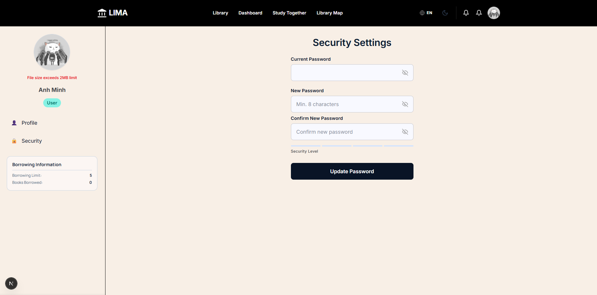
        
<em>Figure P-PROF-03-AF01 – File Too Large</em>

      </td>
    </tr>
  </tbody>
</table>

---

### UC-PROF-04: Change Password

<table width="100%" border="1" cellpadding="8" cellspacing="0" style="border-collapse: collapse; font-family: Arial, sans-serif; font-size: 14px; border: 1px solid #d1d5db; margin-bottom: 20px;">
  <thead>
    <tr style="background-color: #1e3a8a; color: #ffffff;">
      <th colspan="2" style="text-align: left; padding: 12px; font-size: 16px;">
        Use Case: Change Password
      </th>
    </tr>
  </thead>
  <tbody>
    <tr>
      <td width="22%" style="background-color: #f8fafc; font-weight: bold; vertical-align: top;">Use Case ID</td>
      <td style="vertical-align: top;"><strong>UC-PROF-04</strong></td>
    </tr>
    <tr>
      <td style="background-color: #f8fafc; font-weight: bold; vertical-align: top;">Brief Description</td>
      <td style="vertical-align: top;">
        Enables a logged-in system member to securely re-verify their identity credentials and initialize a password modification procedure to overwrite existing authentication keys.
      </td>
    </tr>
    <tr>
      <td style="background-color: #f8fafc; font-weight: bold; vertical-align: top;">Actor(s)</td>
      <td style="vertical-align: top;">Logged user</td>
    </tr>
    <tr>
      <td style="background-color: #f8fafc; font-weight: bold; vertical-align: top;">Preconditions</td>
      <td style="vertical-align: top;">
        <ul style="margin: 0; padding-left: 20px; line-height: 1.5;">
          <li><strong>Validated Configuration Entry Path:</strong> The user maintains verified access status parameters and has loaded the security configurations panel menu space.</li>
        </ul>
      </td>
    </tr>
    <tr>
      <td style="background-color: #f8fafc; font-weight: bold; vertical-align: top;">Flow of Events (Basic Flow)</td>
      <td style="vertical-align: top;">
        <ol style="margin: 0; padding-left: 20px; line-height: 1.6;">
          <li><strong>[Actor Action]:</strong> The user clicks the "Update Account Password" interaction panel control option.</li>
          <li><strong>[System Response]:</strong> The system generates a credential editing secure form layout showcasing input boxes labeled "Current Password", "New Password", and "Confirm New Password".</li>
          <li><strong>[Actor Action]:</strong> The user inputs their current secret key string along with a fresh replacement passphrase combination variant and triggers submission.</li>
          <li><strong>[Data Processing]:</strong> The system securely hashes the input "Current Password" to perform matching comparisons against verification strings recorded inside account user database table indices.</li>
          <li><strong>[Data Processing]:</strong> The system confirms credential accuracy, validates that the "New Password" string satisfies length and complexity parameter algorithms, and checks that both confirmation entries match exactly.</li>
          <li><strong>[Data Processing]:</strong> The system passes the new password text string through structural hashing algorithms, creating a unique replacement secure credential string object.</li>
          <li><strong>[Data Processing]:</strong> The system overrides database user authentication columns with the newly compiled hash values model.</li>
          <li><strong>[Display Result]:</strong> The system renders a transaction complete validation message layout panel block and automatically log-purges other active stale cross-device cookie sessions for safety.</li>
        </ol>
      </td>
    </tr>
    <tr>
      <td style="background-color: #f8fafc; font-weight: bold; vertical-align: top;">Alternative / Exception Flows</td>
      <td style="vertical-align: top;">
        <ul style="margin: 0; padding-left: 20px; line-height: 1.5;">
          <li style="margin-bottom: 8px;">
            <strong>Core Signature Verification Defect (Step 4):</strong> If the validation evaluation proves the entered "Current Password" value fails signature matching metrics:
            <ol style="margin-top: 4px; margin-bottom: 4px; padding-left: 20px;">
              <li>The system stops processing immediately and blocks database update transactions.</li>
              <li>The system returns an error notice banner: "The current password entered is incorrect."</li>
            </ol>
            <strong>Postcondition (Alternative Flow):</strong> Security tracking values count a configuration error instance; baseline account authentication records remain unchanged.
          </li>
          <li style="margin-bottom: 8px;">
            <strong>Density Metrics Criteria Violation (Step 5):</strong> If the new replacement passphrase choice does not meet password density criteria benchmarks:
            <ol style="margin-top: 4px; margin-bottom: 4px; padding-left: 20px;">
              <li>The system refuses form submissions.</li>
              <li>The system underlines broken constraint text rules explicitly below the formatting inputs.</li>
            </ol>
            <strong>Postcondition (Alternative Flow):</strong> Form view panels lock values in place; internal system tables reject any modification updates.
          </li>
          <li style="margin-bottom: 8px;">
            <strong>Prompt Field Input Discrepancy (Step 5):</strong> If the confirmation entry box input differs from the target characters mapped inside the first password initialization prompt field:
            <ol style="margin-top: 4px; margin-bottom: 4px; padding-left: 20px;">
              <li>The system blocks submission pipelines.</li>
              <li>The system prompts the user with warning text indicating: "New password fields do not match."</li>
            </ol>
            <strong>Postcondition (Alternative Flow):</strong> Authentication databases cancel commitment actions; interface layouts await fresh confirmation re-entry typings.
          </li>
        </ul>
      </td>
    </tr>
    <tr>
      <td style="background-color: #f8fafc; font-weight: bold; vertical-align: top;">Postconditions</td>
      <td style="vertical-align: top;">
        <ul style="margin: 0; padding-left: 20px;">
          <li><strong>Production Verification Update:</strong> Core account verification criteria fields update fully within production data layers, forcing all subsequent device sign-in events to map to the fresh secret key strings.</li>
        </ul>
      </td>
    </tr>
    <tr>
      <td style="background-color: #f8fafc; font-weight: bold; vertical-align: top;">Special Requirements</td>
      <td style="vertical-align: top;">
        <ul style="margin: 0; padding-left: 20px;">
          <li><strong>Interface Visibility Masking:</strong> Entry placeholder forms must enforce hidden masking states (`type="password"`) on client interfaces to fully block shoulder-surfing security vulnerabilities.</li>
        </ul>
      </td>
    </tr>
    <tr>
      <td style="background-color: #f8fafc; font-weight: bold; vertical-align: top;">Extension Points</td>
      <td style="vertical-align: top;">
        None
      </td>
    </tr>
    <tr>
      <td style="background-color: #f8fafc; font-weight: bold; vertical-align: top;">Prototype Screen</td>
      <td style="vertical-align: top;">
        
        
<em>Figure P-PROF-04-BF01 – Change Password Form</em>

        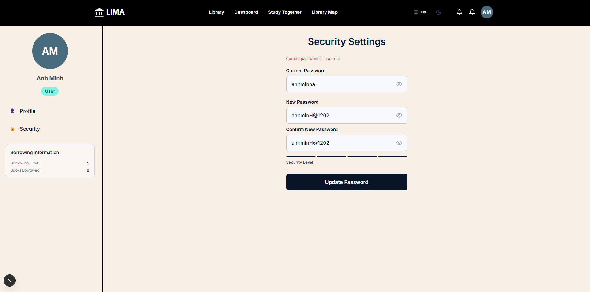
        
<em>Figure P-PROF-04-AF01 – Current Password Incorrect</em>

        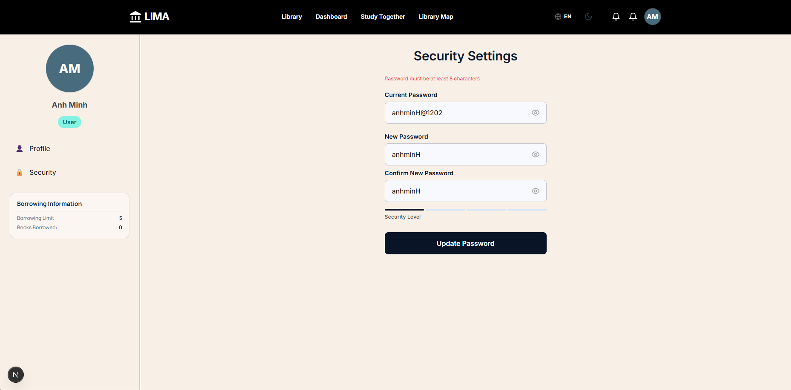
        
<em>Figure P-PROF-04-AF02 – Password Requirements Not Met</em>

        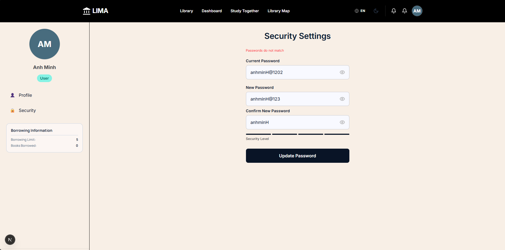
        
<em>Figure P-PROF-04-AF03 – Passwords Do Not Match</em>

      </td>
    </tr>
  </tbody>
</table>

## IV. Books Exploration & Interaction
### Usecase Diagram

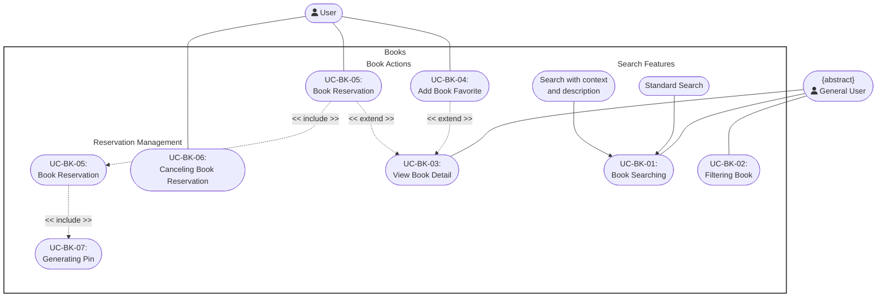
```mermaid
flowchart TD
    %% Actors 
    Actor1(["<center>{abstract} <br> fa:fa-user General User</center>"])
    Actor2(["<center>fa:fa-user User</center>"])

    %% System Boundary Subgraph
    subgraph BooksSystem [Books]
        %% Column 1: Search & Filter Features
        subgraph SearchBlock [Search Features]
            UC_StdSearch(["<center>Standard Search</center>"])
            UC_SemSearch(["<center>Search with context<br>and description</center>"])
            UC_AbsSearching(["<center>UC-BK-01:<br>Book Searching</center>"])
            UC_Filter(["<center>UC-BK-02:<br>Filtering Book</center>"])
        end
        
        %% Column 2: Book Actions
        subgraph ActionBlock [Book Actions]
            UC_ViewDetail(["<center>UC-BK-03:<br>View Book Detail</center>"])
            UC_AddFav(["<center>UC-BK-04:<br>Add Book Favorite</center>"])
            UC_Reserve(["<center>UC-BK-05:<br>Book Reservation</center>"])
        end
        
        %% Column 3: Reservation Management
        subgraph ReserveBlock [Reservation Management]
            UC_CreateReserve(["<center>UC-BK-05:<br>Book Reservation</center>"])
            UC_CancelReserve(["<center>UC-BK-06:<br>Canceling Book Reservation</center>"])
            UC_GenPin(["<center>UC-BK-07:<br>Generating Pin</center>"])
        end
    end

    %% Actor Associations
    Actor1 --- UC_AbsSearching
    Actor1 --- UC_Filter
    Actor1 --- UC_ViewDetail
    Actor2 --- UC_AddFav
    Actor2 --- UC_Reserve
    Actor2 --- UC_CancelReserve

    %% Valid Generalization (Standard/Semantic ARE types of Search)
    UC_StdSearch --> UC_AbsSearching
    UC_SemSearch --> UC_AbsSearching

    %% Extend & Include Relationships
    UC_AddFav -. "<< extend >>" .-> UC_ViewDetail
    UC_Reserve -. "<< extend >>" .-> UC_ViewDetail
    
    %% Generating PIN is an INCLUDED step during reservation creation
    UC_CreateReserve -. "<< include >>" .-> UC_GenPin
    UC_Reserve -. "<< include >>" .-> UC_CreateReserve

    %% Styling
    style BooksSystem fill:#fff,stroke:#333,stroke-width:2px
    style SearchBlock fill:none,stroke:none
    style ActionBlock fill:none,stroke:none
    style ReserveBlock fill:none,stroke:none
```

---

### UC-BK-01: Book Searching

<table width="100%" border="1" cellpadding="8" cellspacing="0" style="border-collapse: collapse; font-family: Arial, sans-serif; font-size: 14px; border: 1px solid #d1d5db; margin-bottom: 20px;">
  <thead>
    <tr style="background-color: #1e3a8a; color: #ffffff;">
      <th colspan="2" style="text-align: left; padding: 12px; font-size: 16px;">
        Use Case: Book Searching
      </th>
    </tr>
  </thead>
  <tbody>
    <tr>
      <td width="22%" style="background-color: #f8fafc; font-weight: bold; vertical-align: top;">Use Case ID</td>
      <td style="vertical-align: top;"><strong>UC-BK-01</strong></td>
    </tr>
    <tr>
      <td style="background-color: #f8fafc; font-weight: bold; vertical-align: top;">Brief Description</td>
      <td style="vertical-align: top;">
        Allows the user to look up specific books within the library system catalog using either explicit keyword parameters (title, author, ISBN strings) or context-aware semantic phrases. The system handles processing configurations via an explicit user mode toggle switch, accommodates minor typos dynamically, triggers automatically upon pressing the "Enter" key, coordinates alongside active metadata filters, and records all query executions into the historical search database.
         <em>(Includes / Extends: <strong>Specialized by Standard Search (Keyword matching) and Semantic search (Context queries).</strong>)</em>
      </td>
    </tr>
    <tr>
      <td style="background-color: #f8fafc; font-weight: bold; vertical-align: top;">Actor(s)</td>
      <td style="vertical-align: top;">User</td>
    </tr>
    <tr>
      <td style="background-color: #f8fafc; font-weight: bold; vertical-align: top;">Preconditions</td>
      <td style="vertical-align: top;">
        <ul style="margin: 0; padding-left: 20px; line-height: 1.5;">
          <li><strong>UI Location Context:</strong> The user has navigated to the catalog query dashboard interface.</li>
          <li><strong>Core Subsystem Verification:</strong> The book relational database index and specialized vector storage AI model database module are active and online.</li>
        </ul>
      </td>
    </tr>
    <tr>
      <td style="background-color: #f8fafc; font-weight: bold; vertical-align: top;">Flow of Events (Basic Flow)</td>
      <td style="vertical-align: top;">
        <ol style="margin: 0; padding-left: 20px; line-height: 1.6;">
          <li><strong>[Actor Action]:</strong> The user accesses the primary catalog search interface view.</li>
          <li><strong>[System Response]:</strong> The system displays the search panel dashboard layout, featuring a text input field, an explicit mode toggle switch (Standard vs. Semantic), and access to metadata filter control panels.</li>
          <li><strong>[Actor Action]:</strong> The user adjusts the toggle switch to their preferred search type (Standard Keyword or Semantic Context).</li>
          <li><strong>[Actor Action]:</strong> *Optional:* The user sets or updates overlapping constraint toggles within the metadata filter panels (e.g., availability status, structural categories, languages, or publication eras).</li>
          <li><strong>[Actor Action]:</strong> The user types their query string into the search input box. (The background typo-tolerance layer dynamically monitors input parameters for character permutations).</li>
          <li><strong>[Actor Action]:</strong> The user executes the query by pressing the <code> Enter</code> key on their keyboard or clicking the search icon button widget.</li>
          <li><strong>[Data Processing]:</strong> The system intercepts the submission runtime event and immediately creates an asynchronous database logging transaction to write the raw search text string, timestamp, applied filter, and User ID parameters into the historical search database log tables.</li>
          <li><strong>[Data Processing]:</strong> The system processes the query payload text by both keywords and context-aware matching.</li>
          <li><strong>[Data Processing]:</strong> The system applies any active metadata filter constraint parameters to strip disqualified records out of the resulting query dataset match array.</li>
          <li><strong>[Display Result]:</strong> The system displays the final ranked, filtered list layout array of matching book cards (cover image, title, author, genre) onto the viewport panel.</li>
          <li><strong>[Actor Action]:</strong> The user may scroll through the results and optionally choose to save a specific book directly to their wishlist.</li>
        </ol>
      </td>
    </tr>
    <tr>
      <td style="background-color: #f8fafc; font-weight: bold; vertical-align: top;">Alternative / Exception Flows</td>
      <td style="vertical-align: top;">
        <ul style="margin: 0; padding-left: 20px; line-height: 1.5;">
          <li style="margin-bottom: 8px;">
            <strong>Search History Logging Failure (Step 7):</strong> If the search history database logging pipeline encounters an error or timeout:
            <ol style="margin-top: 4px; margin-bottom: 4px; padding-left: 20px;">
              <li>The system catches the write exception silently.</li>
              <li>The system logs it within internal application diagnostic error frameworks.</li>
              <li>The system bypasses the historical logging block directly and resumes execution at Step 8 to prevent disrupting the user search lifecycle experience.</li>
            </ol>
            <strong>Postcondition (Alternative Flow):</strong> Search results render normally on the interface viewport layer, but the specific search instance context is omitted from historical user logs.
          </li>
          <li style="margin-bottom: 8px;">
            <strong>Zero Catalog Matches (Step 8):</strong> If the system identifies zero exact, partial, fuzzy, or semantic catalog matches:
            <ol style="margin-top: 4px; margin-bottom: 4px; padding-left: 20px;">
              <li>The system interrupts standard rendering and outputs an empty panel state layout.</li>
            </ol>
            <strong>Postcondition (Alternative Flow):</strong> A zero-match notification prompt window appears on-screen alongside generic default popular listings. Alternate permutations may drop back to standard keyword text match structural summaries (logging an infrastructure error notice behind the scenes) or push cached historical index layers directly into viewport screens with warning alerts flashed.
          </li>
        </ul>
      </td>
    </tr>
    <tr>
      <td style="background-color: #f8fafc; font-weight: bold; vertical-align: top;">Postconditions</td>
      <td style="vertical-align: top;">
        <ul style="margin: 0; padding-left: 20px;">
          <li><strong>Workspace Population:</strong> The relevant search query matches successfully populate the active layout window on screen.</li>
          <li><strong>Transaction Logging Commitment:</strong> The user's query parameters are safely recorded inside the historical database logging framework for analytics and user history dashboards.</li>
        </ul>
      </td>
    </tr>
    <tr>
      <td style="background-color: #f8fafc; font-weight: bold; vertical-align: top;">Special Requirements</td>
      <td style="vertical-align: top;">
        <ul style="margin: 0; padding-left: 20px;">
          <li><strong>Performance SLA Boundaries:</strong> Standard keyword lookup database queries must complete rendering cycles within 1.5 seconds; semantic vector model matching operations must execute under a 3.0-second performance limit window.</li>
          <li><strong>Dynamic Typo Tolerance:</strong> The background fuzzy logic typo-tolerance algorithm must dynamically resolve single/double character transpositions or common character substitutions without creating measurable lookup degradation.</li>
          <li><strong>String Sanitization Injection Guards:</strong> Wildcard processing expressions must pass through string cookies sanitization parameters to fully block malicious SQL pattern injection vectors.</li>
          <li><strong>Non-Blocking Thread Execution:</strong> Search history database insertion commands must be non-blocking and execute strictly on background threads to ensure the UI interface main rendering loop remains highly responsive.</li>
        </ul>
      </td>
    </tr>
    <tr>
      <td style="background-color: #f8fafc; font-weight: bold; vertical-align: top;">Extension Points</td>
      <td style="vertical-align: top;">
        None
      </td>
    </tr>
    <tr>
      <td style="background-color: #f8fafc; font-weight: bold; vertical-align: top;">Prototype Screen</td>
      <td style="vertical-align: top;">
        
        
<em>Figure P-BK-01-BF01 – Search Results</em>

        
        
<em>Figure P-BK-01-AF01 – No Search Results</em>

      </td>
    </tr>
  </tbody>
</table>

---

### UC-BK-02: Filtering Book

<table width="100%" border="1" cellpadding="8" cellspacing="0" style="border-collapse: collapse; font-family: Arial, sans-serif; font-size: 14px; border: 1px solid #d1d5db; margin-bottom: 20px;">
  <thead>
    <tr style="background-color: #1e3a8a; color: #ffffff;">
      <th colspan="2" style="text-align: left; padding: 12px; font-size: 16px;">
        Use Case: Filtering Book
      </th>
    </tr>
  </thead>
  <tbody>
    <tr>
      <td width="22%" style="background-color: #f8fafc; font-weight: bold; vertical-align: top;">Use Case ID</td>
      <td style="vertical-align: top;"><strong>UC-BK-02</strong></td>
    </tr>
    <tr>
      <td style="background-color: #f8fafc; font-weight: bold; vertical-align: top;">Brief Description</td>
      <td style="vertical-align: top;">
        Enables the granular filtering of active displayed collections by parameters such as availability status, structural categories, languages, or publication eras.
      </td>
    </tr>
    <tr>
      <td style="background-color: #f8fafc; font-weight: bold; vertical-align: top;">Actor(s)</td>
      <td style="vertical-align: top;">User</td>
    </tr>
    <tr>
      <td style="background-color: #f8fafc; font-weight: bold; vertical-align: top;">Preconditions</td>
      <td style="vertical-align: top;">
        <ul style="margin: 0; padding-left: 20px; line-height: 1.5;">
          <li><strong>Populated Dataset Context:</strong> An active population list of catalog items is rendered inside the view browser pane area.</li>
        </ul>
      </td>
    </tr>
    <tr>
      <td style="background-color: #f8fafc; font-weight: bold; vertical-align: top;">Flow of Events (Basic Flow)</td>
      <td style="vertical-align: top;">
        <ol style="margin: 0; padding-left: 20px; line-height: 1.6;">
          <li><strong>[Actor Action]:</strong> The user opens the filter settings sidebar control interface module panel.</li>
          <li><strong>[System Response]:</strong> The system shows checkboxes representing system metadata filter categories.</li>
          <li><strong>[Actor Action]:</strong> The user sets multiple overlapping constraint toggle checks.</li>
          <li><strong>[Data Processing]:</strong> The system dynamically updates the query arrays to crop records failing check matches.</li>
          <li><strong>[Display Result]:</strong> The system strips disqualified cards out of view without forcing complete browser workspace reloads.</li>
        </ol>
      </td>
    </tr>
    <tr>
      <td style="background-color: #f8fafc; font-weight: bold; vertical-align: top;">Alternative / Exception Flows</td>
      <td style="vertical-align: top;">
        <ul style="margin: 0; padding-left: 20px; line-height: 1.5;">
          <li style="margin-bottom: 8px;">
            <strong>Overfiltering Outcome (Step 4):</strong> If overfiltering occurs, yielding zero matching index properties:
            <ol style="margin-top: 4px; margin-bottom: 4px; padding-left: 20px;">
              <li>The system presents an active "Reset All Applied Filters" UI component widget inside an explicit helper panel layout block.</li>
            </ol>
            <strong>Postcondition (Alternative Flow):</strong> A null results screen layout element displays along with active reset interaction shortcuts.
          </li>
        </ul>
      </td>
    </tr>
    <tr>
      <td style="background-color: #f8fafc; font-weight: bold; vertical-align: top;">Postconditions</td>
      <td style="vertical-align: top;">
        <ul style="margin: 0; padding-left: 20px;">
          <li><strong>Grid Alignment State:</strong> Active browse window lists map exactly to all applied parameter limit criteria states.</li>
        </ul>
      </td>
    </tr>
    <tr>
      <td style="background-color: #f8fafc; font-weight: bold; vertical-align: top;">Special Requirements</td>
      <td style="vertical-align: top;">
        <ul style="margin: 0; padding-left: 20px;">
          <li><strong>Asynchronous Adjustments:</strong> Filter matrix indexing state checks must be applied asynchronously to guarantee zero-latency listing adjustments.</li>
        </ul>
      </td>
    </tr>
    <tr>
      <td style="background-color: #f8fafc; font-weight: bold; vertical-align: top;">Extension Points</td>
      <td style="vertical-align: top;">
        None
      </td>
    </tr>
    <tr>
      <td style="background-color: #f8fafc; font-weight: bold; vertical-align: top;">Prototype Screen</td>
      <td style="vertical-align: top;">
        
        
<em>Figure P-BK-02-BF01 – Book Filters</em>

        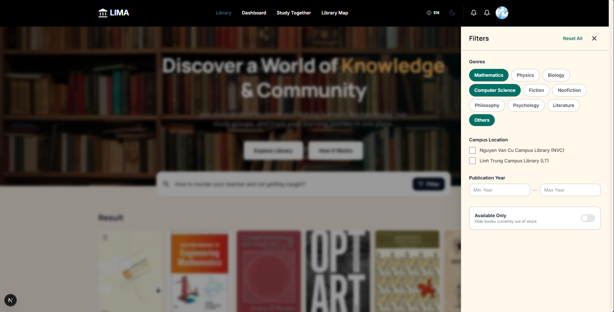
        
<em>Figure P-BK-02-AF01 – No Filter Results</em>

      </td>
    </tr>
  </tbody>
</table>

---

### UC-BK-03: View Book Detail

<table width="100%" border="1" cellpadding="8" cellspacing="0" style="border-collapse: collapse; font-family: Arial, sans-serif; font-size: 14px; border: 1px solid #d1d5db; margin-bottom: 20px;">
  <thead>
    <tr style="background-color: #1e3a8a; color: #ffffff;">
      <th colspan="2" style="text-align: left; padding: 12px; font-size: 16px;">
        Use Case: View Book Detail
      </th>
    </tr>
  </thead>
  <tbody>
    <tr>
      <td width="22%" style="background-color: #f8fafc; font-weight: bold; vertical-align: top;">Use Case ID</td>
      <td style="vertical-align: top;"><strong>UC-BK-03</strong></td>
    </tr>
    <tr>
      <td style="background-color: #f8fafc; font-weight: bold; vertical-align: top;">Brief Description</td>
      <td style="vertical-align: top;">
        Acts as the primary informational hub for a specific catalog asset. It retrieves comprehensive book metadata, real-time inventory counts, user reviews, dynamically compiles a carousel of related books based on genre classification, and hosts entry nodes for user interactions (Wishlist, Favorites, and Reservations).
         <em>(Includes / Extends: <strong>Extended by use cases: UC-BK-04 (Add Book Favorite), UC-BK-05 (Book Reservation).</strong>)</em>
      </td>
    </tr>
    <tr>
      <td style="background-color: #f8fafc; font-weight: bold; vertical-align: top;">Actor(s)</td>
      <td style="vertical-align: top;">User</td>
    </tr>
    <tr>
      <td style="background-color: #f8fafc; font-weight: bold; vertical-align: top;">Preconditions</td>
      <td style="vertical-align: top;">
        <ul style="margin: 0; padding-left: 20px; line-height: 1.5;">
          <li><strong>Visual Target Anchor:</strong> A targeted book item component, link anchor text, or search result card is rendered on the user's active screen layout.</li>
        </ul>
      </td>
    </tr>
    <tr>
      <td style="background-color: #f8fafc; font-weight: bold; vertical-align: top;">Flow of Events (Basic Flow)</td>
      <td style="vertical-align: top;">
        <ol style="margin: 0; padding-left: 20px; line-height: 1.6;">
          <li><strong>[Actor Action]:</strong> The user clicks on a specific book cover visual image component or text link element anchor object from any display grid or search result array.</li>
          <li><strong>[System Response]:</strong> The system captures the event parameter and calls a background object retrieval query to fetch database records tied to the chosen unique identification string (`Book_ID`).</li>
          <li><strong>[Data Processing]:</strong> The system extracts structural descriptive fields (Title, Author, Publisher, Synopsis summary text, and user review message matrices).</li>
          <li><strong>[Data Processing]:</strong> The system requests live, real-time snapshot inventory balance summaries to calculate total copies owned versus active copies currently available for circulation.</li>
          <li><strong>[Data Processing]:</strong> The system queries the book catalog database to isolate up to 10 highly rated or trending books sharing matching genre classifications with the current target book.</li>
          <li><strong>[Display Result]:</strong> The system renders the comprehensive profile view template workspace, mapping metadata, inventory states, and reviews cleanly into upper layout blocks.</li>
          <li><strong>[Display Result]:</strong> The system populates a horizontal, swipeable "Related Books by Genre" carousel grid component at the terminal end of the page viewport layout.</li>
          <li><strong>[System Response]:</strong> The system checks the active user session status token to dynamically expose action controls:   <strong>- For all users:</strong> Exposes basic detail visibility and the related carousel nodes.   <strong>- For authenticated users:</strong> Activates operational interaction buttons for "Add to Wishlist" (heart icon) and "Reserve Book".</li>
          <li><strong>[Actor Action]:</strong> The user reviews the details and can scroll through the carousel, click a related book to transition views, or click an interaction button to trigger a secondary workflow.</li>
        </ol>
      </td>
    </tr>
    <tr>
      <td style="background-color: #f8fafc; font-weight: bold; vertical-align: top;">Alternative / Exception Flows</td>
      <td style="vertical-align: top;">
        <ul style="margin: 0; padding-left: 20px; line-height: 1.5;">
          <li style="margin-bottom: 8px;">
            <strong>Empty Genre Associations (Step 5):</strong> If no related books are found in the matching genre catalog data arrays:
            <ol style="margin-top: 4px; margin-bottom: 4px; padding-left: 20px;">
              <li>The system dynamically alters its query criteria to retrieve a list of random books instead.</li>
              <li>The workflow proceeds directly to Step 6 of the Basic Flow.</li>
            </ol>
          </li>
          <li style="margin-bottom: 8px;">
            <strong>Record Reference Corruption (Step 2):</strong> If the specific `Book_ID` string refers to a record that has been permanently purged or corrupted:
            <ol style="margin-top: 4px; margin-bottom: 4px; padding-left: 20px;">
              <li>The system aborts the page layout compilation script immediately.</li>
              <li>The system triggers a contextual toast notification modal warning window: "The selected book profile is currently unavailable."</li>
              <li>The system routes the user viewport cleanly backward to their previously active listing dashboard workspace.</li>
            </ol>
            <strong>Postcondition (Alternative Flow):</strong> No data attributes modify; the user workspace safely falls back to stable resting panels.
          </li>
        </ul>
      </td>
    </tr>
    <tr>
      <td style="background-color: #f8fafc; font-weight: bold; vertical-align: top;">Postconditions</td>
      <td style="vertical-align: top;">
        <ul style="margin: 0; padding-left: 20px;">
          <li><strong>Sheet Output Delivery:</strong> The requested book detail sheet successfully outputs to the client interface window.</li>
          <li><strong>Entry Node Accessibility:</strong> All relevant context-driven interactive entry paths (Wishlist/Reservation links) sit in a fully receptive, ready-to-click state.</li>
        </ul>
      </td>
    </tr>
    <tr>
      <td style="background-color: #f8fafc; font-weight: bold; vertical-align: top;">Special Requirements</td>
      <td style="vertical-align: top;">
        <ul style="margin: 0; padding-left: 20px;">
          <li><strong>Metadata Performance Thresholds:</strong> The primary page layout metadata elements (Title, Author, Inventory counts) must load within a maximum 1.0-second time ceiling; the lower related genre carousel asset pipeline can execute asynchronously to prevent locking the initial main frame rendering loop.</li>
        </ul>
      </td>
    </tr>
    <tr>
      <td style="background-color: #f8fafc; font-weight: bold; vertical-align: top;">Extension Points</td>
      <td style="vertical-align: top;">
        <ul style="margin: 0; padding-left: 20px;">
          <li><strong>Add Book Favorite:</strong> Location inside event flow: Exposing action controls for authenticated users (Step 8).</li>
          <li><strong>Book Reservation:</strong> Location inside event flow: Exposing action controls for authenticated users (Step 8).</li>
        </ul>
      </td>
    </tr>
    <tr>
      <td style="background-color: #f8fafc; font-weight: bold; vertical-align: top;">Prototype Screen</td>
      <td style="vertical-align: top;">
        
        
<em>Figure P-BK-03-BF01 – Book Details</em>

      </td>
    </tr>
  </tbody>
</table>

---

### UC-BK-04: Add Book Favorite

<table width="100%" border="1" cellpadding="8" cellspacing="0" style="border-collapse: collapse; font-family: Arial, sans-serif; font-size: 14px; border: 1px solid #d1d5db; margin-bottom: 20px;">
  <thead>
    <tr style="background-color: #1e3a8a; color: #ffffff;">
      <th colspan="2" style="text-align: left; padding: 12px; font-size: 16px;">
        Use Case: Add Book Favorite
      </th>
    </tr>
  </thead>
  <tbody>
    <tr>
      <td width="22%" style="background-color: #f8fafc; font-weight: bold; vertical-align: top;">Use Case ID</td>
      <td style="vertical-align: top;"><strong>UC-BK-04</strong></td>
    </tr>
    <tr>
      <td style="background-color: #f8fafc; font-weight: bold; vertical-align: top;">Brief Description</td>
      <td style="vertical-align: top;">
        Extends detailed profiles to allow users to anchor an item to their account collections for rapid retrieval access utilities.
         <em>(Includes / Extends: <strong>Extends UC-BK-03 (View Book Detail) — extension point: Exposing action controls for authenticated users.</strong>)</em>
      </td>
    </tr>
    <tr>
      <td style="background-color: #f8fafc; font-weight: bold; vertical-align: top;">Actor(s)</td>
      <td style="vertical-align: top;">User</td>
    </tr>
    <tr>
      <td style="background-color: #f8fafc; font-weight: bold; vertical-align: top;">Preconditions</td>
      <td style="vertical-align: top;">
        <ul style="margin: 0; padding-left: 20px; line-height: 1.5;">
          <li><strong>Session Verification:</strong> The user account profile state checks match valid system authentication benchmarks.</li>
          <li><strong>Context Parameter:</strong> The user is actively executing active workspace viewing tasks inside `UC-BK-03`.</li>
        </ul>
      </td>
    </tr>
    <tr>
      <td style="background-color: #f8fafc; font-weight: bold; vertical-align: top;">Flow of Events (Basic Flow)</td>
      <td style="vertical-align: top;">
        <ol style="margin: 0; padding-left: 20px; line-height: 1.6;">
          <li><strong>[Actor Action]:</strong> The user initiates a request by clicking the Heart icon on the book details cover pane interface.</li>
          <li><strong>[Data Processing]:</strong> The system inserts a relationship link row tracking User ID to Book ID into the system database.</li>
          <li><strong>[Display Result]:</strong> The system modifies the color of the icon component to red and fires a system status toast announcement to demonstrate successful data binding.</li>
          <li><strong>[Actor Action]:</strong> The user can later review the personal wishlist in their main wishlist dashboard space.</li>
        </ol>
      </td>
    </tr>
    <tr>
      <td style="background-color: #f8fafc; font-weight: bold; vertical-align: top;">Alternative / Exception Flows</td>
      <td style="vertical-align: top;">
        <ul style="margin: 0; padding-left: 20px; line-height: 1.5;">
          <li style="margin-bottom: 8px;">
            <strong>Asset Redundancy (Step 1):</strong> If the selected catalog asset identity string already resides inside active user favorites data arrays:
            <ol style="margin-top: 4px; margin-bottom: 4px; padding-left: 20px;">
              <li>The system registers the action as an intentional favorite deletion prompt.</li>
              <li>The system extracts the relationship string link row from database tables.</li>
              <li>The system clears the heart icon color highlight indicators back to default status configurations.</li>
            </ol>
            <strong>Postcondition (Alternative Flow):</strong> Association metrics delete cleanly; visual markers change status flags back to default baseline states.
          </li>
        </ul>
      </td>
    </tr>
    <tr>
      <td style="background-color: #f8fafc; font-weight: bold; vertical-align: top;">Postconditions</td>
      <td style="vertical-align: top;">
        <ul style="margin: 0; padding-left: 20px;">
          <li><strong>Structural Element UI Changes:</strong> The color of the heart icon turns red on the client side interface.</li>
          <li><strong>Storage Confirmation:</strong> Target catalog objects sit successfully inside user dashboard wishlist modules.</li>
        </ul>
      </td>
    </tr>
    <tr>
      <td style="background-color: #f8fafc; font-weight: bold; vertical-align: top;">Special Requirements</td>
      <td style="vertical-align: top;">
        <ul style="margin: 0; padding-left: 20px;">
          <li><strong>Real-Time Cross-Device Sync:</strong> Favorites list data synchronization configurations must update global account views across cross-device endpoints instantaneously.</li>
        </ul>
      </td>
    </tr>
    <tr>
      <td style="background-color: #f8fafc; font-weight: bold; vertical-align: top;">Extension Points</td>
      <td style="vertical-align: top;">
        <ul style="margin: 0; padding-left: 20px;">
          None
        </ul>
      </td>
    </tr>
    <tr>
      <td style="background-color: #f8fafc; font-weight: bold; vertical-align: top;">Prototype Screen</td>
      <td style="vertical-align: top;">
        
        
<em>Figure P-BK-04-BF01 – Book Added to Favorites</em>

         
        
        
<em>Figure P-BK-04-BF02 – Wishlist Dashboard</em>

        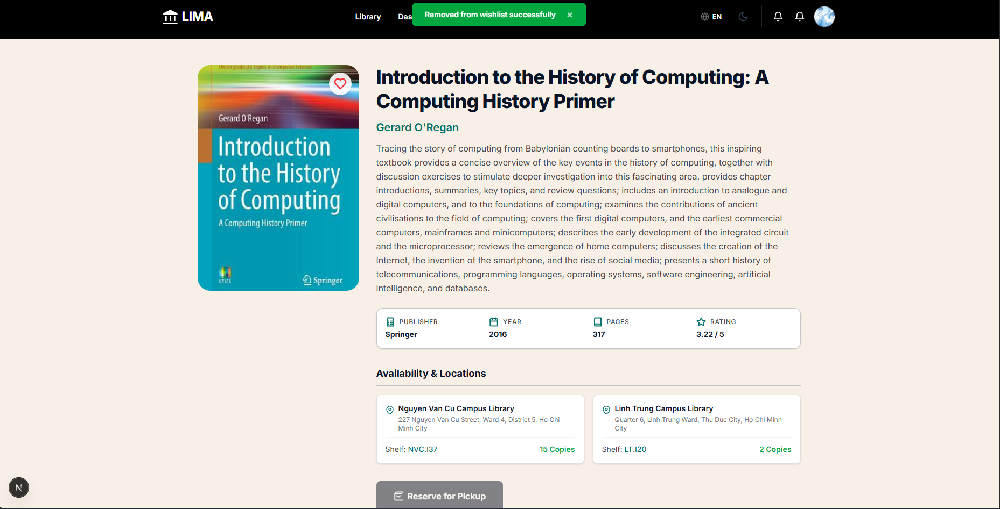
        
<em>Figure P-BK-04-AF01 – Book Removed from Favorites</em>

      </td>
    </tr>
  </tbody>
</table>

---

### UC-BK-05: Book Reservation

<table width="100%" border="1" cellpadding="8" cellspacing="0" style="border-collapse: collapse; font-family: Arial, sans-serif; font-size: 14px; border: 1px solid #d1d5db; margin-bottom: 20px;">
  <thead>
    <tr style="background-color: #1e3a8a; color: #ffffff;">
      <th colspan="2" style="text-align: left; padding: 12px; font-size: 16px;">
        Use Case: Book Reservation
      </th>
    </tr>
  </thead>
  <tbody>
    <tr>
      <td width="22%" style="background-color: #f8fafc; font-weight: bold; vertical-align: top;">Use Case ID</td>
      <td style="vertical-align: top;"><strong>UC-BK-05</strong></td>
    </tr>
    <tr>
      <td style="background-color: #f8fafc; font-weight: bold; vertical-align: top;">Brief Description</td>
      <td style="vertical-align: top;">
        Handles the end-to-end process allowing an authenticated user to place a physical hold on a book copy directly from its details page. The system internally enforces account constraint metrics, checks real-time inventory availability layers, updates catalog status allocations, and writes transaction logs securely.
         <em>(Includes / Extends: <strong>Extends UC-BK-03 (View Book Detail) — extension point: Exposing action controls for authenticated users. Specializes the abstract usecase Managing Reserved Books.</strong>)</em>
      </td>
    </tr>
    <tr>
      <td style="background-color: #f8fafc; font-weight: bold; vertical-align: top;">Actor(s)</td>
      <td style="vertical-align: top;">User</td>
    </tr>
    <tr>
      <td style="background-color: #f8fafc; font-weight: bold; vertical-align: top;">Preconditions</td>
      <td style="vertical-align: top;">
        <ul style="margin: 0; padding-left: 20px; line-height: 1.5;">
          <li><strong>Token Security Check:</strong> The user session tokens maintain authenticated statuses inside core system modules.</li>
          <li><strong>Parent Context Reference:</strong> The user is actively executing workspace view processing steps inside `UC-BK-03`.</li>
        </ul>
      </td>
    </tr>
    <tr>
      <td style="background-color: #f8fafc; font-weight: bold; vertical-align: top;">Flow of Events (Basic Flow)</td>
      <td style="vertical-align: top;">
        <ol style="margin: 0; padding-left: 20px; line-height: 1.6;">
          <li><strong>[Actor Action]:</strong> The user clicks the primary "Reserve Book" action button parameter layout object node on the book details screen.</li>
          <li><strong>[System Response]:</strong> The system intercepts the transaction context request and evaluates the user's active concurrent reservation counts against maximum account allowance thresholds.</li>
          <li><strong>[System Response]:</strong> The system queries internal inventory engines to verify that a physical copy tracking row for the matching asset carries an explicit "Available" tracking tag status.</li>
          <li><strong>[Data Processing]:</strong> The system locks the selected target copy database row record, changing its state configuration status flag from "Available" to "Reserved".</li>
          <li><strong>[Data Processing]:</strong> The system logs a fresh instance tracking transaction entry row detailing unique timestamps, user identifiers, reference keys, and an automated pickup expiration countdown tracker.</li>
          <li><strong>[Display Result]:</strong> The system updates live inventory tracking counts (decrementing available copies) and presents a checkout success overview dashboard containing return deadlines, pickup instructions, and option nodes to view the pickup verification details.</li>
        </ol>
      </td>
    </tr>
    <tr>
      <td style="background-color: #f8fafc; font-weight: bold; vertical-align: top;">Alternative / Exception Flows</td>
      <td style="vertical-align: top;">
        <ul style="margin: 0; padding-left: 20px; line-height: 1.5;">
          <li style="margin-bottom: 8px;">
            <strong>Account Caps Reached (Step 2):</strong> If user metrics show current concurrent items match or pass system cap limits:
            <ol style="margin-top: 4px; margin-bottom: 4px; padding-left: 20px;">
              <li>The system blocks processing workflows and halts the allocation sequence execution.</li>
              <li>The system throws and displays an explicit validation error interface block: "Account Reservation Limit Reached".</li>
            </ol>
          </li>
          <li style="margin-bottom: 8px;">
            <strong>Material Allocation Shortage (Step 3):</strong> If the inventory query reveals that all physical tracking records for the matching asset register zero available quantities:
            <ol style="margin-top: 4px; margin-bottom: 4px; padding-left: 20px;">
              <li>The system cancels the standard booking pathway logic parameters.</li>
              <li>The system updates screen interface element blocks and opens an interactive confirmation modal dialogue box asking if the user desires inclusion on public queue waiting lists.</li>
            </ol>
          </li>
        </ul>
      </td>
    </tr>
    <tr>
      <td style="background-color: #f8fafc; font-weight: bold; vertical-align: top;">Postconditions</td>
      <td style="vertical-align: top;">
        <ul style="margin: 0; padding-left: 20px;">
          <li><strong>Structural Account Allocation:</strong> A digital item hold reservation token binds securely against the user’s account database portfolio records.</li>
          <li><strong>Material Ledger Reduction:</strong> Physical library copy availability allocations drop dynamically, and a transactional database logging instance records securely in history tables.</li>
        </ul>
      </td>
    </tr>
    <tr>
      <td style="background-color: #f8fafc; font-weight: bold; vertical-align: top;">Special Requirements</td>
      <td style="vertical-align: top;">
        <ul style="margin: 0; padding-left: 20px;">
          <li><strong>Strict Data Isolation Concurrency Guards:</strong> Inventory state checking steps and status parameter adjustments must rely entirely on strict isolation transaction patterns (atomic locking mechanisms) to fully block database race conditions or double-booking conflicts during concurrent heavy usage spikes.</li>
        </ul>
      </td>
    </tr>
    <tr>
      <td style="background-color: #f8fafc; font-weight: bold; vertical-align: top;">Extension Points</td>
      <td style="vertical-align: top;">
        None
      </td>
    </tr>
    <tr>
      <td style="background-color: #f8fafc; font-weight: bold; vertical-align: top;">Prototype Screen</td>
      <td style="vertical-align: top;">
        
        
<em>Figure P-BK-05-BF01 – Book Reservation</em>

        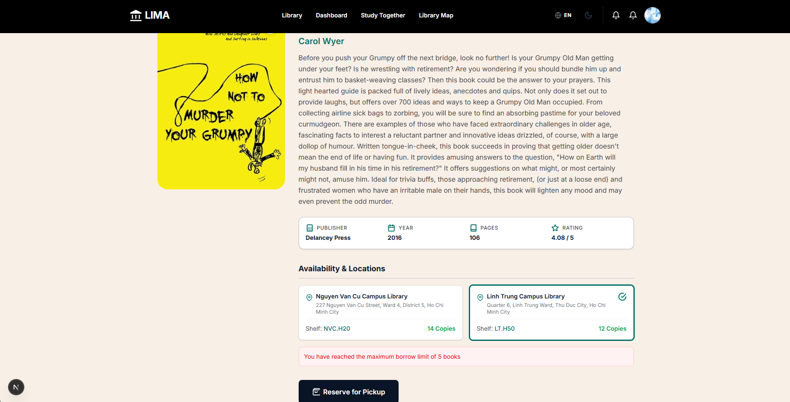
        
<em>Figure P-BK-05-AF01 – Reservation Limit Reached</em>

        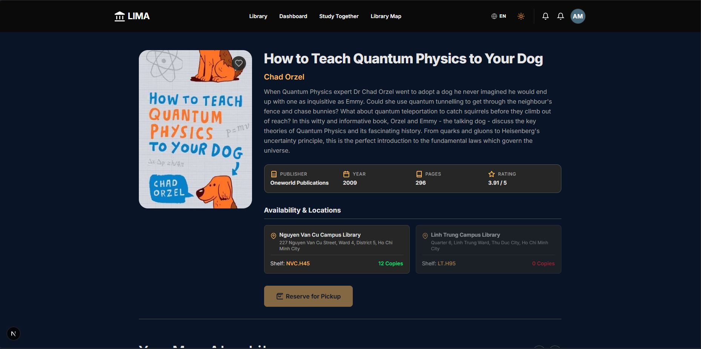
        
<em>Figure P-BK-05-AF02 – No Copies Available</em>

      </td>
    </tr>
  </tbody>
</table>

---

### UC-BK-06: Canceling Book Reservation

<table width="100%" border="1" cellpadding="8" cellspacing="0" style="border-collapse: collapse; font-family: Arial, sans-serif; font-size: 14px; border: 1px solid #d1d5db; margin-bottom: 20px;">
  <thead>
    <tr style="background-color: #1e3a8a; color: #ffffff;">
      <th colspan="2" style="text-align: left; padding: 12px; font-size: 16px;">
        Use Case: Canceling Book Reservation
      </th>
    </tr>
  </thead>
  <tbody>
    <tr>
      <td width="22%" style="background-color: #f8fafc; font-weight: bold; vertical-align: top;">Use Case ID</td>
      <td style="vertical-align: top;"><strong>UC-BK-06</strong></td>
    </tr>
    <tr>
      <td style="background-color: #f8fafc; font-weight: bold; vertical-align: top;">Brief Description</td>
      <td style="vertical-align: top;">
        Allows a user to void outstanding holds on book assets, clearing tracking rows and returning units to open circulation loops.
         <em>(Includes / Extends: <strong>Specializes the abstract usecase Managing Reserved Books.</strong>)</em>
      </td>
    </tr>
    <tr>
      <td style="background-color: #f8fafc; font-weight: bold; vertical-align: top;">Actor(s)</td>
      <td style="vertical-align: top;">User</td>
    </tr>
    <tr>
      <td style="background-color: #f8fafc; font-weight: bold; vertical-align: top;">Preconditions</td>
      <td style="vertical-align: top;">
        <ul style="margin: 0; padding-left: 20px; line-height: 1.5;">
          <li><strong>Identity Check:</strong> The user is authenticated within core security frameworks.</li>
          <li><strong>Extant Record Verification:</strong> An active hold profile row data record exists mapped against the user identifier profile key attributes.</li>
        </ul>
      </td>
    </tr>
    <tr>
      <td style="background-color: #f8fafc; font-weight: bold; vertical-align: top;">Flow of Events (Basic Flow)</td>
      <td style="vertical-align: top;">
        <ol style="margin: 0; padding-left: 20px; line-height: 1.6;">
          <li><strong>[Actor Action]:</strong> The user accesses their account profile reservation review summary board.</li>
          <li><strong>[Actor Action]:</strong> The user identifies the specific reservation card item layout block and clicks the "Cancel Reservation" text control trigger button.</li>
          <li><strong>[Data Processing]:</strong> The system updates tracking records, changing status descriptions to "Cancelled".</li>
          <li><strong>[Data Processing]:</strong> The system increments item allocation numbers, marking the physical inventory asset copy status to "Available".</li>
          <li><strong>[Display Result]:</strong> The system strips the active item block out of current summary layout screens.</li>
        </ol>
      </td>
    </tr>
    <tr>
      <td style="background-color: #f8fafc; font-weight: bold; vertical-align: top;">Alternative / Exception Flows</td>
      <td style="vertical-align: top;">
        <ul style="margin: 0; padding-left: 20px; line-height: 1.5;">
          <li style="margin-bottom: 8px;">
            <strong>Network Drops Mid-Commit (Step 3):</strong> If system network connections drop mid-cancellation updates:
            <ol style="margin-top: 4px; margin-bottom: 4px; padding-left: 20px;">
              <li>The system rolls database operational steps backward cleanly.</li>
              <li>The system prompts users with a warning modal box stating "Action failed, please attempt transaction verification again."</li>
            </ol>
            <strong>Postcondition (Alternative Flow):</strong> Data records drop out of update routines; original reservation statuses maintain their state configurations.
          </li>
        </ul>
      </td>
    </tr>
    <tr>
      <td style="background-color: #f8fafc; font-weight: bold; vertical-align: top;">Postconditions</td>
      <td style="vertical-align: top;">
        <ul style="margin: 0; padding-left: 20px;">
          <li><strong>Account Queue Dropping:</strong> Active reservation entry parameters drop out of active queues; physical library counts update successfully.</li>
        </ul>
      </td>
    </tr>
    <tr>
      <td style="background-color: #f8fafc; font-weight: bold; vertical-align: top;">Special Requirements</td>
      <td style="vertical-align: top;">
        <ul style="margin: 0; padding-left: 20px;">
          <li><strong>Broadcast Synchronicity:</strong> Canceled item inventory allocation changes must synchronize instantaneously across search discovery database pools to reflect open availability fields.</li>
        </ul>
      </td>
    </tr>
    <tr>
      <td style="background-color: #f8fafc; font-weight: bold; vertical-align: top;">Extension Points</td>
      <td style="vertical-align: top;">
        None
      </td>
    </tr>
    <tr>
      <td style="background-color: #f8fafc; font-weight: bold; vertical-align: top;">Prototype Screen</td>
      <td style="vertical-align: top;">
        
        
<em>Figure P-BK-06-BF01 – Reservation Dashboard</em>

        
        
<em>Figure P-BK-06-BF02 – Cancel Reservation</em>

      </td>
    </tr>
  </tbody>
</table>

---

### UC-BK-07: Generating Pin

<table width="100%" border="1" cellpadding="8" cellspacing="0" style="border-collapse: collapse; font-family: Arial, sans-serif; font-size: 14px; border: 1px solid #d1d5db; margin-bottom: 20px;">
  <thead>
    <tr style="background-color: #1e3a8a; color: #ffffff;">
      <th colspan="2" style="text-align: left; padding: 12px; font-size: 16px;">
        Use Case: Generating Pin
      </th>
    </tr>
  </thead>
  <tbody>
    <tr>
      <td width="22%" style="background-color: #f8fafc; font-weight: bold; vertical-align: top;">Use Case ID</td>
      <td style="vertical-align: top;"><strong>UC-BK-07</strong></td>
    </tr>
    <tr>
      <td style="background-color: #f8fafc; font-weight: bold; vertical-align: top;">Brief Description</td>
      <td style="vertical-align: top;">
        Generates temporary, high-security validation passcode tokens to authorize locker retrieval or desk checkout protocols.
         <em>(Includes / Extends: <strong>Specializes the abstract usecase Managing Reserved Books.</strong>)</em>
      </td>
    </tr>
    <tr>
      <td style="background-color: #f8fafc; font-weight: bold; vertical-align: top;">Actor(s)</td>
      <td style="vertical-align: top;">User</td>
    </tr>
    <tr>
      <td style="background-color: #f8fafc; font-weight: bold; vertical-align: top;">Preconditions</td>
      <td style="vertical-align: top;">
        <ul style="margin: 0; padding-left: 20px; line-height: 1.5;">
          <li><strong>Item Pipeline State:</strong> A specific target hold tracking status is officially set to "Ready for Pickup".</li>
        </ul>
      </td>
    </tr>
    <tr>
      <td style="background-color: #f8fafc; font-weight: bold; vertical-align: top;">Flow of Events (Basic Flow)</td>
      <td style="vertical-align: top;">
        <ol style="margin: 0; padding-left: 20px; line-height: 1.6;">
          <li><strong>[Actor Action]:</strong> The user navigates to the active booking details pane within their account hub dashboard.</li>
          <li><strong>[Actor Action]:</strong> The user triggers the "Generate Pickup PIN" transaction button control item.</li>
          <li><strong>[System Response]:</strong> The system runs security hashing modules to output a 6-digit numeric passkey linked to that collection row ID.</li>
          <li><strong>[Data Processing]:</strong> The system stores the passkey in short-term active memory caches with an explicit 15-minute time-to-live parameter.</li>
          <li><strong>[Display Result]:</strong> The system renders the generated PIN digits on-screen using large high-contrast text styling components alongside a live visual countdown progress bar tracker.</li>
        </ol>
      </td>
    </tr>
    <tr>
      <td style="background-color: #f8fafc; font-weight: bold; vertical-align: top;">Alternative / Exception Flows</td>
      <td style="vertical-align: top;">
        <ul style="margin: 0; padding-left: 20px; line-height: 1.5;">
          <li style="margin-bottom: 8px;">
            <strong>Checkout Expiration Time Breach (Step 4):</strong> If the tracking countdown reaches zero before terminal checkouts finish:
            <ol style="margin-top: 4px; margin-bottom: 4px; padding-left: 20px;">
              <li>The system purges the expired passcode token sequence out of live cache parameters.</li>
              <li>The system alters UI layouts to reveal a "Regenerate Expired Token" control shortcut.</li>
            </ol>
            <strong>Postcondition (Alternative Flow):</strong> Authorization passcodes delete out of lookup caches; screen output contents display expired states.
          </li>
        </ul>
      </td>
    </tr>
    <tr>
      <td style="background-color: #f8fafc; font-weight: bold; vertical-align: top;">Postconditions</td>
      <td style="vertical-align: top;">
        <ul style="margin: 0; padding-left: 20px;">
          <li><strong>Instance Authentication Staging:</strong> A secure token instance exists inside application memory, and authentication interfaces display access credentials.</li>
        </ul>
      </td>
    </tr>
    <tr>
      <td style="background-color: #f8fafc; font-weight: bold; vertical-align: top;">Special Requirements</td>
      <td style="vertical-align: top;">
        <ul style="margin: 0; padding-left: 20px;">
          <li><strong>Cryptographic Randomization:</strong> Numeric token generation engines must use cryptographically secure random values to prevent predictable generation strings.</li>
        </ul>
      </td>
    </tr>
    <tr>
      <td style="background-color: #f8fafc; font-weight: bold; vertical-align: top;">Extension Points</td>
      <td style="vertical-align: top;">
        None
      </td>
    </tr>
    <tr>
      <td style="background-color: #f8fafc; font-weight: bold; vertical-align: top;">Prototype Screen</td>
      <td style="vertical-align: top;">
        
        
<em>Figure P-BK-07-BF01 – Generated Pickup PIN</em>

        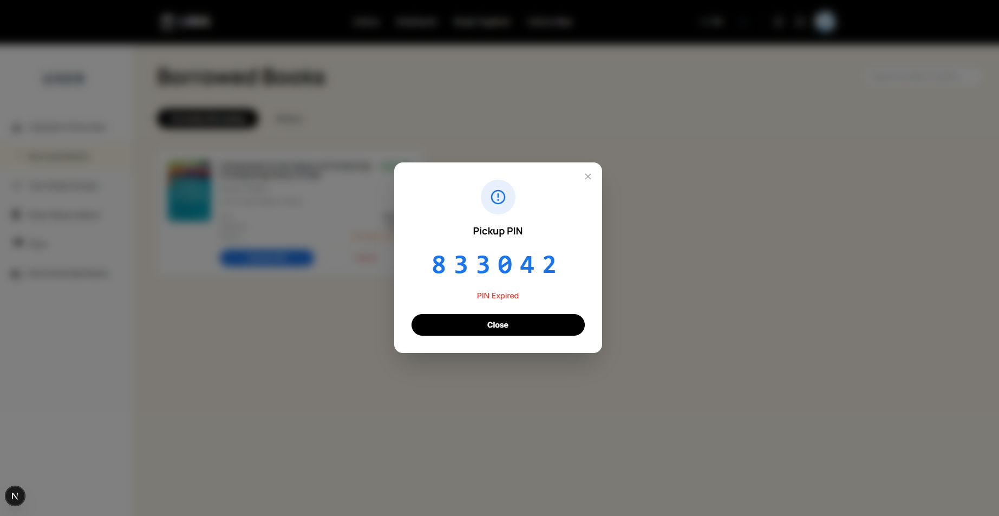
        
<em>Figure P-BK-07-AF01 – Pickup PIN Expired</em>

      </td>
    </tr>
  </tbody>
</table>

---

## V. Study Group Creation & Facility Reservation 

### Use case diagram

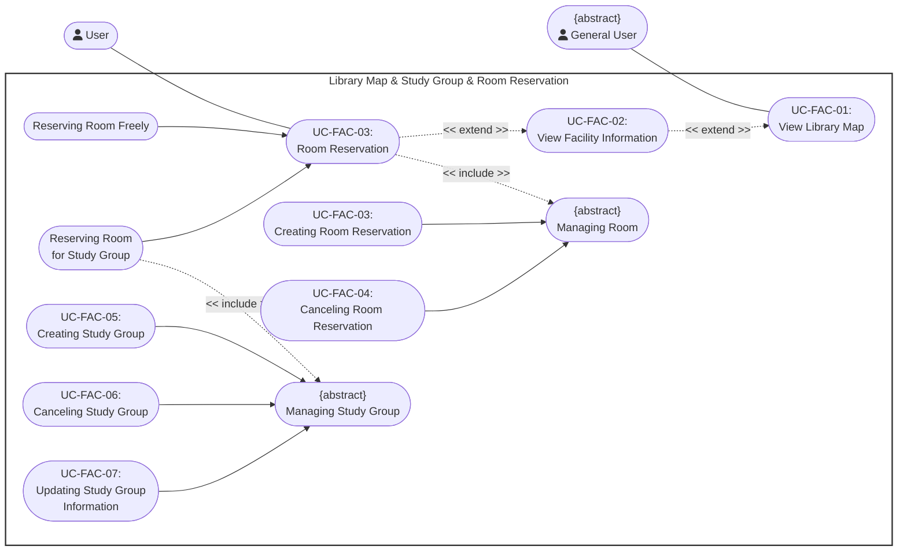
```mermaid
flowchart LR
    %% Actors 
    Actor1(["<center>{abstract} <br> fa:fa-user General User</center>"])
    Actor2(["<center>fa:fa-user User</center>"])

    %% System Boundary Subgraph
    subgraph LibrarySystem [Library Map & Study Group & Room Reservation]
        %% Use Cases (using circle style: ([ ]) )
        UC_ViewMap(["<center>UC-FAC-01:<br>View Library Map</center>"])
        UC_ViewFacility(["<center>UC-FAC-02:<br>View Facility Information</center>"])
        
        UC_AbsReserving(["<center>UC-FAC-03:<br>Room Reservation</center>"])
        UC_ReservingFreely(["<center>Reserving Room Freely</center>"])
        UC_ReservingStudyGroup(["<center>Reserving Room<br>for Study Group</center>"])
        
        UC_AbsManagingRoom(["<center>{abstract} <br> Managing Room</center>"])
        UC_CreateReservation(["<center>UC-FAC-03:<br>Creating Room Reservation</center>"])
        UC_CancelReservation(["<center>UC-FAC-04:<br>Canceling Room Reservation</center>"])
        
        UC_AbsManagingStudy(["<center>{abstract}<br>Managing Study Group</center>"])
        UC_CreateStudyGroup(["<center>UC-FAC-05:<br>Creating Study Group</center>"])
        UC_CancelStudyGroup(["<center>UC-FAC-06:<br>Canceling Study Group</center>"])
        UC_UpdateStudyGroup(["<center>UC-FAC-07:<br>Updating Study Group<br>Information</center>"])
    end

    %% -------------------------------------------------------------
    %% Actor Associations
    %% -------------------------------------------------------------

    Actor1 --- UC_ViewMap
    Actor2 --- UC_AbsReserving

    %% -------------------------------------------------------------
    %% Extend & Include Relationships 
    %% -------------------------------------------------------------
    UC_ViewFacility -. "<< extend >>" .-> UC_ViewMap
    UC_AbsReserving -. "<< extend >>" .-> UC_ViewFacility
    UC_AbsReserving -. "<< include >>" .-> UC_AbsManagingRoom
    UC_ReservingStudyGroup -. "<< include >>" .-> UC_AbsManagingStudy

    %% -------------------------------------------------------------
    %% Generalization Relationships (pointing Specific -> Abstract)
    %% -------------------------------------------------------------
    UC_ReservingFreely --> UC_AbsReserving
    UC_ReservingStudyGroup --> UC_AbsReserving
    
    UC_CreateReservation --> UC_AbsManagingRoom
    UC_CancelReservation --> UC_AbsManagingRoom
    
    UC_CreateStudyGroup --> UC_AbsManagingStudy
    UC_CancelStudyGroup --> UC_AbsManagingStudy
    UC_UpdateStudyGroup --> UC_AbsManagingStudy

    %% Styling
    style LibrarySystem fill:#fff,stroke:#333,stroke-width:2px
```
---

### UC-FAC-01: View Library Map

<table width="100%" border="1" cellpadding="8" cellspacing="0" style="border-collapse: collapse; font-family: Arial, sans-serif; font-size: 14px; border: 1px solid #d1d5db; margin-bottom: 20px;">
  <thead>
    <tr style="background-color: #1e3a8a; color: #ffffff;">
      <th colspan="2" style="text-align: left; padding: 12px; font-size: 16px;">
        Use Case: View Library Map
      </th>
    </tr>
  </thead>
  <tbody>
    <tr>
      <td width="22%" style="background-color: #f8fafc; font-weight: bold; vertical-align: top;">Use Case ID</td>
      <td style="vertical-align: top;"><strong>UC-FAC-01</strong></td>
    </tr>
    <tr>
      <td style="background-color: #f8fafc; font-weight: bold; vertical-align: top;">Brief Description</td>
      <td style="vertical-align: top;">
        Allows a user to view the interactive graphical spatial layout floor plan map of the physical library facilities.
      </td>
    </tr>
    <tr>
      <td style="background-color: #f8fafc; font-weight: bold; vertical-align: top;">Actor(s)</td>
      <td style="vertical-align: top;">User</td>
    </tr>
    <tr>
      <td style="background-color: #f8fafc; font-weight: bold; vertical-align: top;">Preconditions</td>
      <td style="vertical-align: top;">
        <ul style="margin: 0; padding-left: 20px; line-height: 1.5;">
          <li><strong>Interface Initialization:</strong> The user has launched the library digital map display.</li>
        </ul>
      </td>
    </tr>
    <tr>
      <td style="background-color: #f8fafc; font-weight: bold; vertical-align: top;">Flow of Events (Basic Flow)</td>
      <td style="vertical-align: top;">
        <ol style="margin: 0; padding-left: 20px; line-height: 1.6;">
          <li><strong>[Actor Action]:</strong> The user selects the "Interactive Map" tab component link from the primary navigation portal.</li>
          <li><strong>[System Response]:</strong> The system queries the database to load the current geometric library floor map configuration data models.</li>
          <li><strong>[Display Result]:</strong> The system renders the complete high-resolution layout map canvas onto the active user screen interface.</li>
          <li><strong>[Actor Action]:</strong> The user navigates, pans, or zooms around the active floor coordinate spaces.</li>
        </ol>
      </td>
    </tr>
    <tr>
      <td style="background-color: #f8fafc; font-weight: bold; vertical-align: top;">Alternative / Exception Flows</td>
      <td style="vertical-align: top;">
        <ul style="margin: 0; padding-left: 20px; line-height: 1.5;">
          <li style="margin-bottom: 8px;">
            <strong>Asset Loading Failure (Step 2):</strong> If map structural asset vector files fail to load from backend content delivery nodes:
            <ol style="margin-top: 4px; margin-bottom: 4px; padding-left: 20px;">
              <li>The system terminates the display script routine.</li>
              <li>The system defaults to rendering a static text-based directory list layout grid of floors.</li>
            </ol>
            <strong>Postcondition (Alternative Flow):</strong> The active workspace falls back to descriptive layout index directories; errors parse securely into diagnostic logs.
          </li>
        </ul>
      </td>
    </tr>
    <tr>
      <td style="background-color: #f8fafc; font-weight: bold; vertical-align: top;">Postconditions</td>
      <td style="vertical-align: top;">
        <ul style="margin: 0; padding-left: 20px;">
          <li><strong>Interactive Map State:</strong> The digital structural blueprint map is fully loaded and remains interactive within the client application container workspace.</li>
        </ul>
      </td>
    </tr>
    <tr>
      <td style="background-color: #f8fafc; font-weight: bold; vertical-align: top;">Special Requirements</td>
      <td style="vertical-align: top;">
        <ul style="margin: 0; padding-left: 20px;">
          <li><strong>Render Performance Ceiling:</strong> The graphical layout component structure must render interactively within 1.0 second on modern client application endpoints.</li>
        </ul>
      </td>
    </tr>
    <tr>
      <td style="background-color: #f8fafc; font-weight: bold; vertical-align: top;">Extension Points</td>
      <td style="vertical-align: top;">
        None
      </td>
    </tr>
    <tr>
      <td style="background-color: #f8fafc; font-weight: bold; vertical-align: top;">Prototype Screen</td>
      <td style="vertical-align: top;">
        
        
<em>Figure P-FAC-01-BF01 – Library Map</em>

      </td>
    </tr>
  </tbody>
</table>

---

### UC-FAC-02: View Facility Information

<table width="100%" border="1" cellpadding="8" cellspacing="0" style="border-collapse: collapse; font-family: Arial, sans-serif; font-size: 14px; border: 1px solid #d1d5db; margin-bottom: 20px;">
  <thead>
    <tr style="background-color: #1e3a8a; color: #ffffff;">
      <th colspan="2" style="text-align: left; padding: 12px; font-size: 16px;">
        Use Case: View Facility Information
      </th>
    </tr>
  </thead>
  <tbody>
    <tr>
      <td width="22%" style="background-color: #f8fafc; font-weight: bold; vertical-align: top;">Use Case ID</td>
      <td style="vertical-align: top;"><strong>UC-FAC-02</strong></td>
    </tr>
    <tr>
      <td style="background-color: #f8fafc; font-weight: bold; vertical-align: top;">Brief Description</td>
      <td style="vertical-align: top;">
        Extends the active map visualization layout dashboard panel to display specific metadata parameters, operational schedules, capacity thresholds, and equipment summaries for a chosen target room asset.
         <em>(Includes / Extends: <strong>Extends UC-FAC-01 (View Library Map) — extension point: User selects a specific room or point-of-interest zone node anchor element within the visual map array space.</strong>)</em>
      </td>
    </tr>
    <tr>
      <td style="background-color: #f8fafc; font-weight: bold; vertical-align: top;">Actor(s)</td>
      <td style="vertical-align: top;">User</td>
    </tr>
    <tr>
      <td style="background-color: #f8fafc; font-weight: bold; vertical-align: top;">Preconditions</td>
      <td style="vertical-align: top;">
        <ul style="margin: 0; padding-left: 20px; line-height: 1.5;">
          <li><strong>Underlying Map Session Active:</strong> The core baseline `View Library Map (UC-FAC-01)` flow is fully executed and active on screen.</li>
        </ul>
      </td>
    </tr>
    <tr>
      <td style="background-color: #f8fafc; font-weight: bold; vertical-align: top;">Flow of Events (Basic Flow)</td>
      <td style="vertical-align: top;">
        <ol style="margin: 0; padding-left: 20px; line-height: 1.6;">
          <li><strong>[Actor Action]:</strong> The user hovers over and clicks an active structural facility zone/room element node anchor on the map layout model.</li>
          <li><strong>[System Response]:</strong> The system reads the clicked room ID parameter, intercepting the base mapping loop.</li>
          <li><strong>[Data Processing]:</strong> The system queries database profiles to extract targeted capacity indices, itemized equipment inventories, and booking schedule statuses.</li>
          <li><strong>[Display Result]:</strong> The system updates the UI by opening an aligned descriptive contextual informational summary side-drawer panel sheet component over the map workspace.</li>
        </ol>
      </td>
    </tr>
    <tr>
      <td style="background-color: #f8fafc; font-weight: bold; vertical-align: top;">Alternative / Exception Flows</td>
      <td style="vertical-align: top;">
        <ul style="margin: 0; padding-left: 20px; line-height: 1.5;">
          <li style="margin-bottom: 8px;">
            <strong>Legacy Component Deletion (Step 3):</strong> If the chosen facility room identifier parameters match legacy hardware profiles deleted from standard database lookup tables:
            <ol style="margin-top: 4px; margin-bottom: 4px; padding-left: 20px;">
              <li>The system presents a temporary notification popup indicating "Facility configuration parameters updated, listing refresh required."</li>
            </ol>
            <strong>Postcondition (Alternative Flow):</strong> Invalid profile popups close immediately; the base layer interactive map forces an automatic silent index update routine.
          </li>
        </ul>
      </td>
    </tr>
    <tr>
      <td style="background-color: #f8fafc; font-weight: bold; vertical-align: top;">Postconditions</td>
      <td style="vertical-align: top;">
        <ul style="margin: 0; padding-left: 20px;">
          <li><strong>Overlay Statistics Presentation:</strong> Detailed individual facility asset performance metrics, resource lists, and structural availability maps display clearly alongside graphic canvases.</li>
        </ul>
      </td>
    </tr>
    <tr>
      <td style="background-color: #f8fafc; font-weight: bold; vertical-align: top;">Special Requirements</td>
      <td style="vertical-align: top;">
        <ul style="margin: 0; padding-left: 20px;">
          <li><strong>Overlay Interface Non-Disruption:</strong> Context detail slide-drawer components must overlay fluidly without modifying or breaking current canvas viewport layout locations.</li>
          <li><strong>Dynamic Functional Layout Capabilities:</strong> The "reserve" option and capacity information are available explicitly for the study room panel type, while other facility layout zones will display descriptive content matrices only.</li>
        </ul>
      </td>
    </tr>
    <tr>
      <td style="background-color: #f8fafc; font-weight: bold; vertical-align: top;">Extension Points</td>
      <td style="vertical-align: top;">
        None
      </td>
    </tr>
    <tr>
      <td style="background-color: #f8fafc; font-weight: bold; vertical-align: top;">Prototype Screen</td>
      <td style="vertical-align: top;">
        
        
<em>Figure P-FAC-02-BF01 – Facility Information</em>

      </td>
    </tr>
  </tbody>
</table>

---

### UC-FAC-03: Room Reservation

<table width="100%" border="1" cellpadding="8" cellspacing="0" style="border-collapse: collapse; font-family: Arial, sans-serif; font-size: 14px; border: 1px solid #d1d5db; margin-bottom: 20px;">
  <thead>
    <tr style="background-color: #1e3a8a; color: #ffffff;">
      <th colspan="2" style="text-align: left; padding: 12px; font-size: 16px;">
        Use Case: Room Reservation
      </th>
    </tr>
  </thead>
  <tbody>
    <tr>
      <td width="22%" style="background-color: #f8fafc; font-weight: bold; vertical-align: top;">Use Case ID</td>
      <td style="vertical-align: top;"><strong>UC-FAC-03</strong></td>
    </tr>
    <tr>
      <td style="background-color: #f8fafc; font-weight: bold; vertical-align: top;">Brief Description</td>
      <td style="vertical-align: top;">
        Handles the end-to-end process enabling an authenticated user to directly secure a short-term reservation allocation block for an open facility study space. The system dynamically parses target timeline boundaries, enforces duration limits, resolves concurrent race conditions, locks availability grids, and outputs entrance validation credentials.
         <em>(Includes / Extends: <strong>Specialized by Reserve room freely and Reserve room for Study group.</strong>)</em>
      </td>
    </tr>
    <tr>
      <td style="background-color: #f8fafc; font-weight: bold; vertical-align: top;">Actor(s)</td>
      <td style="vertical-align: top;">User</td>
    </tr>
    <tr>
      <td style="background-color: #f8fafc; font-weight: bold; vertical-align: top;">Preconditions</td>
      <td style="vertical-align: top;">
        <ul style="margin: 0; padding-left: 20px; line-height: 1.5;">
          <li><strong>Central Identity Clearance:</strong> The user profile account identity successfully clears central access authorization checks.</li>
          <li><strong>Material Open Status:</strong> The chosen facility room asset calendar matches open, non-restricted booking states.</li>
        </ul>
      </td>
    </tr>
    <tr>
      <td style="background-color: #f8fafc; font-weight: bold; vertical-align: top;">Flow of Events (Basic Flow)</td>
      <td style="vertical-align: top;">
        <ol style="margin: 0; padding-left: 20px; line-height: 1.6;">
          <li><strong>[Actor Action]:</strong> The user opens the structural room booking schedule board tool component layout screen.</li>
          <li><strong>[Actor Action]:</strong> The user isolates an open target timeslot parameter block row on a free room workspace slot and hits the "Book Instantly" action control.</li>
          <li><strong>[Actor Action]:</strong> The user selects the reservation purpose mode (Free Reservation or Study Group Reservation):
            <ul style="margin-top: 4px; margin-bottom: 4px; padding-left: 20px;">
              <li><strong>Free Reservation:</strong> The user proceeds with reserving the room for personal study, and the workflow continues directly.</li>
              <li><strong>Study Group Reservation:</strong> The user selects study group reservation and fills out additional required information (e.g., study group selection/name, study topic/purpose, and member list).</li>
            </ul>
          </li>
          <li><strong>[System Response]:</strong> The system intercepts the transaction context, reads the target facility room item identifier, reservation purpose parameters, and captures the requested operational time window timeline boundaries.</li>
          <li><strong>[Data Processing]:</strong> The system queries the database tables to verify that the target room space record does not contain active, overlapping booking blocks within that specific timeframe.</li>
          <li><strong>[Data Processing]:</strong> The system evaluates the parsed duration parameters against standard account booking thresholds to ensure the timeline conforms to allowed continuous hourly limits.</li>
          <li><strong>[Data Processing]:</strong> The system locks the target calendar matrix block, shifting availability state configurations from "Available" to "Booked / Reserved".</li>
          <li><strong>[Data Processing]:</strong> The system logs a unique transactional allocation receipt index tracking row record detailing room numbers, account keys, reservation purpose mode (Free or Study Group metadata), timestamps, and entry variables.</li>
          <li><strong>[Display Result]:</strong> The system updates the live scheduling UI matrix dynamically to strip the targeted space block parameters out of the public discovery views, and displays a confirmation card layout showing specific room entrance verification PINs.</li>
        </ol>
      </td>
    </tr>
    <tr>
      <td style="background-color: #f8fafc; font-weight: bold; vertical-align: top;">Alternative / Exception Flows</td>
      <td style="vertical-align: top;">
        <ul style="margin: 0; padding-left: 20px; line-height: 1.5;">
          <li style="margin-bottom: 8px;">
            <strong>Incomplete Study Group Details (Step 3):</strong> If the user selects reservation for a Study Group but fails to fill out the mandatory study group information fields:
            <ol style="margin-top: 4px; margin-bottom: 4px; padding-left: 20px;">
              <li>The system interrupts the reservation submission logic.</li>
              <li>The system highlights the unfulfilled study group form fields on screen with an inline validation alert notice.</li>
            </ol>
            <strong>Postcondition (Alternative Flow):</strong> No reservation is submitted or written to the database; the active booking form remains open pending complete data entry.
          </li>
          <li style="margin-bottom: 8px;">
            <strong>Duration Threshold Exception (Step 6):</strong> If the targeted time duration parameters violate application booking limit thresholds:
            <ol style="margin-top: 4px; margin-bottom: 4px; padding-left: 20px;">
              <li>The system interrupts the processing logic routine immediately.</li>
              <li>The system throws an allocation constraint exception flag and blocks database write pipelines from committing changes.</li>
              <li>The system highlights the duration configuration components on screen with a validation alert notice.</li>
            </ol>
            <strong>Postcondition (Alternative Flow):</strong> Internal database state architectures maintain original conditions; the active booking form remains open on the user interface pane pending user boundary revisions.
          </li>
          <li style="margin-bottom: 8px;">
            <strong>Grid Collision Race Condition (Step 7):</strong> If another concurrent transaction session locks the exact same spatial grid slot milliseconds before submission:
            <ol style="margin-top: 4px; margin-bottom: 4px; padding-left: 20px;">
              <li>The system database layer traps the conflict error and rejects the execution command thread.</li>
              <li>The system cancels the workflow block execution and rolls back any pending staging changes.</li>
              <li>The system surfaces a priority alert header bar onto the screen layout stating: "Timeslot reservation conflict encountered; this room slot has already been claimed."</li>
            </ol>
            <strong>Postcondition (Alternative Flow):</strong> The active space booking matrix refreshes its visual structural layout layout immediately to show accurate states; database tables remain fully uncorrupted.
          </li>
        </ul>
      </td>
    </tr>
    <tr>
      <td style="background-color: #f8fafc; font-weight: bold; vertical-align: top;">Postconditions</td>
      <td style="vertical-align: top;">
        <ul style="margin: 0; padding-left: 20px;">
          <li><strong>Account Allocation Locked:</strong> An individual space transaction token instantiates securely, locking the designated room parameters for the designated duration.</li>
          <li><strong>Global Grid Update:</strong> Core database calendar indices update permanently, blocking alternative reservation requests across all client discovery platforms.</li>
        </ul>
      </td>
    </tr>
    <tr>
      <td style="background-color: #f8fafc; font-weight: bold; vertical-align: top;">Special Requirements</td>
      <td style="vertical-align: top;">
        <ul style="margin: 0; padding-left: 20px;">
          <li><strong>Serializable Transaction Isolation:</strong> Calendar scheduling check updates and state parameter adjustments must rely entirely on strict serializable transaction isolation logic rules to fully block duplicate double-booking anomalies during concurrent load spikes.</li>
        </ul>
      </td>
    </tr>
    <tr>
      <td style="background-color: #f8fafc; font-weight: bold; vertical-align: top;">Extension Points</td>
      <td style="vertical-align: top;">
        None
      </td>
    </tr>
    <tr>
      <td style="background-color: #f8fafc; font-weight: bold; vertical-align: top;">Prototype Screen</td>
      <td style="vertical-align: top;">
        
        
<em>Figure P-FAC-03-BF01 – Room Reservations</em>

      </td>
    </tr>
  </tbody>
</table>

---

### UC-FAC-04: Canceling Room Reservation

<table width="100%" border="1" cellpadding="8" cellspacing="0" style="border-collapse: collapse; font-family: Arial, sans-serif; font-size: 14px; border: 1px solid #d1d5db; margin-bottom: 20px;">
  <thead>
    <tr style="background-color: #1e3a8a; color: #ffffff;">
      <th colspan="2" style="text-align: left; padding: 12px; font-size: 16px;">
        Use Case: Canceling Room Reservation
      </th>
    </tr>
  </thead>
  <tbody>
    <tr>
      <td width="22%" style="background-color: #f8fafc; font-weight: bold; vertical-align: top;">Use Case ID</td>
      <td style="vertical-align: top;"><strong>UC-FAC-04</strong></td>
    </tr>
    <tr>
      <td style="background-color: #f8fafc; font-weight: bold; vertical-align: top;">Brief Description</td>
      <td style="vertical-align: top;">
        Processes user request commands to void active outstanding room slot holds, returning spaces into open catalog index pools.
      </td>
    </tr>
    <tr>
      <td style="background-color: #f8fafc; font-weight: bold; vertical-align: top;">Actor(s)</td>
      <td style="vertical-align: top;">User</td>
    </tr>
    <tr>
      <td style="background-color: #f8fafc; font-weight: bold; vertical-align: top;">Preconditions</td>
      <td style="vertical-align: top;">
        <ul style="margin: 0; padding-left: 20px; line-height: 1.5;">
          <li><strong>Matching Relational Hold:</strong> An active space allocation record is mapped under the user profile credentials matching upcoming timeline dates.</li>
        </ul>
      </td>
    </tr>
    <tr>
      <td style="background-color: #f8fafc; font-weight: bold; vertical-align: top;">Flow of Events (Basic Flow)</td>
      <td style="vertical-align: top;">
        <ol style="margin: 0; padding-left: 20px; line-height: 1.6;">
          <li><strong>[Actor Action]:</strong> The user opens their personal active schedule dashboard interface window panel.</li>
          <li><strong>[Actor Action]:</strong> The user selects a target upcoming room reservation object row control card and hits "Cancel Booking".</li>
          <li><strong>[Data Processing]:</strong> The system processes the cancellation call context, modifying the database entry status description tag index values to "Cancelled".</li>
          <li><strong>[Data Processing]:</strong> The system modifies the targeted room structural availability calendar rows back to an "Available" state configuration parameter flag.</li>
          <li><strong>[Display Result]:</strong> The system sends confirmation notices to the user workspace screen while triggering background clearing loops.</li>
        </ol>
      </td>
    </tr>
    <tr>
      <td style="background-color: #f8fafc; font-weight: bold; vertical-align: top;">Alternative / Exception Flows</td>
      <td style="vertical-align: top;">
        <ul style="margin: 0; padding-left: 20px; line-height: 1.5;">
          <li style="margin-bottom: 8px;">
            <strong>Penalty Policy Horizon Encroachment (Step 3):</strong> If the user processes cancellation intents within restricted time lock penalty parameters:
            <ol style="margin-top: 4px; margin-bottom: 4px; padding-left: 20px;">
              <li>The system marks the database transaction status as "Late Cancellation".</li>
              <li>The system flags the account history log index with an automated usage compliance flag warning.</li>
            </ol>
            <strong>Postcondition (Alternative Flow):</strong> The space hold clears out safely; administrative metric systems update account infraction tracking fields.
          </li>
        </ul>
      </td>
    </tr>
    <tr>
      <td style="background-color: #f8fafc; font-weight: bold; vertical-align: top;">Postconditions</td>
      <td style="vertical-align: top;">
        <ul style="margin: 0; padding-left: 20px;">
          <li><strong>Matrix Release Commitment:</strong> Outstanding space tracking parameters invalidate completely; room availability timelines clear to open registration access.</li>
        </ul>
      </td>
    </tr>
    <tr>
      <td style="background-color: #f8fafc; font-weight: bold; vertical-align: top;">Special Requirements</td>
      <td style="vertical-align: top;">
        <ul style="margin: 0; padding-left: 20px;">
          <li><strong>Electronic Lock Synchronization:</strong> Cancel actions must trigger asynchronous event loops that instantly clear associated digital security locks installed at the physical room site coordinates.</li>
        </ul>
      </td>
    </tr>
    <tr>
      <td style="background-color: #f8fafc; font-weight: bold; vertical-align: top;">Extension Points</td>
      <td style="vertical-align: top;">
        None
      </td>
    </tr>
    <tr>
      <td style="background-color: #f8fafc; font-weight: bold; vertical-align: top;">Prototype Screen</td>
      <td style="vertical-align: top;">
        
        
<em>Figure P-FAC-03-BF01 – Room Reservations (reused for canceling a room reservation)</em>

      </td>
    </tr>
  </tbody>
</table>

---

### UC-FAC-05: Creating Study Group

<table width="100%" border="1" cellpadding="8" cellspacing="0" style="border-collapse: collapse; font-family: Arial, sans-serif; font-size: 14px; border: 1px solid #d1d5db; margin-bottom: 20px;">
  <thead>
    <tr style="background-color: #1e3a8a; color: #ffffff;">
      <th colspan="2" style="text-align: left; padding: 12px; font-size: 16px;">
        Use Case: Creating Study Group
      </th>
    </tr>
  </thead>
  <tbody>
    <tr>
      <td width="22%" style="background-color: #f8fafc; font-weight: bold; vertical-align: top;">Use Case ID</td>
      <td style="vertical-align: top;"><strong>UC-FAC-05</strong></td>
    </tr>
    <tr>
      <td style="background-color: #f8fafc; font-weight: bold; vertical-align: top;">Brief Description</td>
      <td style="vertical-align: top;">
        Establishes a fresh data structure instance profile configuring collaborative team metadata, participant rosters, and organizer roles.
         <em>(Includes / Extends: <strong>Child sub-routine supporting parent operational blocks under abstract parent {abstract} Managing Study Group. Included in Reserve room for Study group workflow parameters.</strong>)</em>
      </td>
    </tr>
    <tr>
      <td style="background-color: #f8fafc; font-weight: bold; vertical-align: top;">Actor(s)</td>
      <td style="vertical-align: top;">User</td>
    </tr>
    <tr>
      <td style="background-color: #f8fafc; font-weight: bold; vertical-align: top;">Preconditions</td>
      <td style="vertical-align: top;">
        <ul style="margin: 0; padding-left: 20px; line-height: 1.5;">
          <li><strong>System Roster Identity Active:</strong> The team coordinator account holds active registration statuses within system databases.</li>
        </ul>
      </td>
    </tr>
    <tr>
      <td style="background-color: #f8fafc; font-weight: bold; vertical-align: top;">Flow of Events (Basic Flow)</td>
      <td style="vertical-align: top;">
        <ol style="margin: 0; padding-left: 20px; line-height: 1.6;">
          <li><strong>[Actor Action]:</strong> The user selects "Form New Study Group" via their group coordination tool dashboard panel.</li>
          <li><strong>[System Response]:</strong> The system prompts the user to supply structural identity parameters (Group Name, Subject Classification Tag, Maximum Capacity Limits).</li>
          <li><strong>[Actor Action]:</strong> The user populates the configuration fields and clicks "Confirm Setup".</li>
          <li><strong>[Data Processing]:</strong> The system validates syntax formatting and inserts a fresh team registry record entity row into the active profile databases.</li>
          <li><strong>[Data Processing]:</strong> The system configures the initialization user's security token role parameter index to "Group Owner / Administrator".</li>
          <li><strong>[Display Result]:</strong> The system displays the empty group management cockpit interface screen layout views.</li>
        </ol>
      </td>
    </tr>
    <tr>
      <td style="background-color: #f8fafc; font-weight: bold; vertical-align: top;">Alternative / Exception Flows</td>
      <td style="vertical-align: top;">
        <ul style="margin: 0; padding-left: 20px; line-height: 1.5;">
          <li style="margin-bottom: 8px;">
            <strong>Lexical Blocklist Interception (Step 4):</strong> If the chosen Group Name parameter contains words matching active system text blocklist filters:
            <ol style="margin-top: 4px; margin-bottom: 4px; padding-left: 20px;">
              <li>The system blocks database row creation frameworks.</li>
              <li>The system surfaces explicit text layout warnings and locks submission tools pending correction.</li>
            </ol>
            <strong>Postcondition (Alternative Flow):</strong> Group registry tables experience zero modification tasks; the form setup view model remains open.
          </li>
        </ul>
      </td>
    </tr>
    <tr>
      <td style="background-color: #f8fafc; font-weight: bold; vertical-align: top;">Postconditions</td>
      <td style="vertical-align: top;">
        <ul style="margin: 0; padding-left: 20px;">
          <li><strong>Collaborative Record Instantiated:</strong> A structural collaborative group object profile instantiates within application tables, ready to intercept member mapping data streams.</li>
        </ul>
      </td>
    </tr>
    <tr>
      <td style="background-color: #f8fafc; font-weight: bold; vertical-align: top;">Special Requirements</td>
      <td style="vertical-align: top;">
        None
      </td>
    </tr>
    <tr>
      <td style="background-color: #f8fafc; font-weight: bold; vertical-align: top;">Extension Points</td>
      <td style="vertical-align: top;">
        None
      </td>
    </tr>
    <tr>
      <td style="background-color: #f8fafc; font-weight: bold; vertical-align: top;">Prototype Screen</td>
      <td style="vertical-align: top;">
        
        
<em>Figure P-FAC-05-BF01 – Create Study Group Form</em>

         
        
        
<em>Figure P-FAC-05-BF02 – Study Group Created</em>

        
        
<em>Figure P-FAC-05-BF03 – Your Study Groups</em>

      </td>
    </tr>
  </tbody>
</table>

---

### UC-FAC-06: Canceling Study Group

<table width="100%" border="1" cellpadding="8" cellspacing="0" style="border-collapse: collapse; font-family: Arial, sans-serif; font-size: 14px; border: 1px solid #d1d5db; margin-bottom: 20px;">
  <thead>
    <tr style="background-color: #1e3a8a; color: #ffffff;">
      <th colspan="2" style="text-align: left; padding: 12px; font-size: 16px;">
        Use Case: Canceling Study Group
      </th>
    </tr>
  </thead>
  <tbody>
    <tr>
      <td width="22%" style="background-color: #f8fafc; font-weight: bold; vertical-align: top;">Use Case ID</td>
      <td style="vertical-align: top;"><strong>UC-FAC-06</strong></td>
    </tr>
    <tr>
      <td style="background-color: #f8fafc; font-weight: bold; vertical-align: top;">Brief Description</td>
      <td style="vertical-align: top;">
        Completely disbands an active study group team profile structure entity, purging associated participant mapping rows and linked metadata records.
         <em>(Includes / Extends: <strong>Specializes abstract parent {abstract} Managing Study Group.</strong>)</em>
      </td>
    </tr>
    <tr>
      <td style="background-color: #f8fafc; font-weight: bold; vertical-align: top;">Actor(s)</td>
      <td style="vertical-align: top;">User</td>
    </tr>
    <tr>
      <td style="background-color: #f8fafc; font-weight: bold; vertical-align: top;">Preconditions</td>
      <td style="vertical-align: top;">
        <ul style="margin: 0; padding-left: 20px; line-height: 1.5;">
          <li><strong>Elevated Security Authority:</strong> The actor's account role profile parameter matches explicit "Group Owner / Administrator" authorization permissions keys.</li>
        </ul>
      </td>
    </tr>
    <tr>
      <td style="background-color: #f8fafc; font-weight: bold; vertical-align: top;">Flow of Events (Basic Flow)</td>
      <td style="vertical-align: top;">
        <ol style="margin: 0; padding-left: 20px; line-height: 1.6;">
          <li><strong>[Actor Action]:</strong> The user opens the administrative settings panel inside the target study group configuration dashboard.</li>
          <li><strong>[Actor Action]:</strong> The user clicks the priority action control link labeled "Disband / Delete Study Group".</li>
          <li><strong>[System Response]:</strong> The system raises an interactive safety validation challenge popup confirmation box module.</li>
          <li><strong>[Actor Action]:</strong> The user completes the verification prompt action step.</li>
          <li><strong>[Data Processing]:</strong> The system modifies team data rows, toggling lifecycle status state values to "Terminated / Disbanded".</li>
          <li><strong>[Data Processing]:</strong> The system cascade-purges participant relationship map links out of active session caches.</li>
          <li><strong>[Display Result]:</strong> The system notifies all active team members via operational dashboard alert feeds that the group space has closed.</li>
        </ol>
      </td>
    </tr>
    <tr>
      <td style="background-color: #f8fafc; font-weight: bold; vertical-align: top;">Alternative / Exception Flows</td>
      <td style="vertical-align: top;">
        <ul style="margin: 0; padding-left: 20px; line-height: 1.5;">
          <li style="margin-bottom: 8px;">
            <strong>Unfulfilled Asset Dependency Barriers (Step 5):</strong> If the group entity profile holds active dependencies such as unfulfilled future room reservations:
            <ol style="margin-top: 4px; margin-bottom: 4px; padding-left: 20px;">
              <li>The system prevents structural row delete steps.</li>
              <li>The system displays a prompt screen detailing that the group cannot be killed until outstanding room bookings are resolved or transferred.</li>
            </ol>
            <strong>Postcondition (Alternative Flow):</strong> The group deletion command sequence aborts; operational group entity variables maintain status-quo parameters.
          </li>
        </ul>
      </td>
    </tr>
    <tr>
      <td style="background-color: #f8fafc; font-weight: bold; vertical-align: top;">Postconditions</td>
      <td style="vertical-align: top;">
        <ul style="margin: 0; padding-left: 20px;">
          <li><strong>Relational Dissolution Complete:</strong> Coordinated team database index entities change to a fully inactive state model layout; member groupings break apart cleanly.</li>
        </ul>
      </td>
    </tr>
    <tr>
      <td style="background-color: #f8fafc; font-weight: bold; vertical-align: top;">Special Requirements</td>
      <td style="vertical-align: top;">
        <ul style="margin: 0; padding-left: 20px;">
          <li><strong>Automated Cascade Validation:</strong> Group termination cleanup rules must fully run automated cascade validation checks across linked records to verify zero dangling relational index nodes remain in structural table spaces.</li>
        </ul>
      </td>
    </tr>
    <tr>
      <td style="background-color: #f8fafc; font-weight: bold; vertical-align: top;">Extension Points</td>
      <td style="vertical-align: top;">
        None
      </td>
    </tr>
    <tr>
      <td style="background-color: #f8fafc; font-weight: bold; vertical-align: top;">Prototype Screen</td>
      <td style="vertical-align: top;">
        
        
<em>Figure P-FAC-07-BF01 – Study Group Management (reused for canceling a study group)</em>

      </td>
    </tr>
  </tbody>
</table>

---

### UC-FAC-07: Updating Study Group Information

<table width="100%" border="1" cellpadding="8" cellspacing="0" style="border-collapse: collapse; font-family: Arial, sans-serif; font-size: 14px; border: 1px solid #d1d5db; margin-bottom: 20px;">
  <thead>
    <tr style="background-color: #1e3a8a; color: #ffffff;">
      <th colspan="2" style="text-align: left; padding: 12px; font-size: 16px;">
        Use Case: Updating Study Group Information
      </th>
    </tr>
  </thead>
  <tbody>
    <tr>
      <td width="22%" style="background-color: #f8fafc; font-weight: bold; vertical-align: top;">Use Case ID</td>
      <td style="vertical-align: top;"><strong>UC-FAC-07</strong></td>
    </tr>
    <tr>
      <td style="background-color: #f8fafc; font-weight: bold; vertical-align: top;">Brief Description</td>
      <td style="vertical-align: top;">
        Modifies operational configuration metadata parameters including capacity boundaries, name markers, visibility conditions, or subject categories for an existing active group.
         <em>(Includes / Extends: <strong>Specializes abstract parent {abstract} Managing Study Group.</strong>)</em>
      </td>
    </tr>
    <tr>
      <td style="background-color: #f8fafc; font-weight: bold; vertical-align: top;">Actor(s)</td>
      <td style="vertical-align: top;">User</td>
    </tr>
    <tr>
      <td style="background-color: #f8fafc; font-weight: bold; vertical-align: top;">Preconditions</td>
      <td style="vertical-align: top;">
        <ul style="margin: 0; padding-left: 20px; line-height: 1.5;">
          <li><strong>Ownership Permissions:</strong> The user profile account identity possesses necessary editing permission rights parameters within the group database records.</li>
        </ul>
      </td>
    </tr>
    <tr>
      <td style="background-color: #f8fafc; font-weight: bold; vertical-align: top;">Flow of Events (Basic Flow)</td>
      <td style="vertical-align: top;">
        <ol style="margin: 0; padding-left: 20px; line-height: 1.6;">
          <li><strong>[Actor Action]:</strong> The user navigates to the group configuration editing dashboard profile template view layout.</li>
          <li><strong>[System Response]:</strong> The system populates input data entry text boxes with existing live database parameters.</li>
          <li><strong>[Actor Action]:</strong> The user modifies selected metadata settings (e.g., expanding group capacity thresholds, changing descriptions).</li>
          <li><strong>[Actor Action]:</strong> The user clicks the "Save Modifications" processing control button widget.</li>
          <li><strong>[Data Processing]:</strong> The system performs alignment safety checks to ensure new capacity parameters do not drop below the current count of already enrolled active members.</li>
          <li><strong>[Data Processing]:</strong> The system updates the targeted group configuration database columns with the revised parameters.</li>
          <li><strong>[Display Result]:</strong> The system updates workspace windows, rendering flash confirmation notification banners.</li>
        </ol>
      </td>
    </tr>
    <tr>
      <td style="background-color: #f8fafc; font-weight: bold; vertical-align: top;">Alternative / Exception Flows</td>
      <td style="vertical-align: top;">
        <ul style="margin: 0; padding-left: 20px; line-height: 1.5;">
          <li style="margin-bottom: 8px;">
            <strong>Active Capacity Floor Violation (Step 5):</strong> If the user attempts to reduce group maximum capacity limits below the total number of currently active registered members:
            <ol style="margin-top: 4px; margin-bottom: 4px; padding-left: 20px;">
              <li>The system blocks database modification commands.</li>
              <li>The system flashes validation errors and highlights the capacity text box layout elements in red.</li>
            </ol>
            <strong>Postcondition (Alternative Flow):</strong> Data updates abort entirely; previous configuration fields remain unchanged inside database storage rows.
          </li>
        </ul>
      </td>
    </tr>
    <tr>
      <td style="background-color: #f8fafc; font-weight: bold; vertical-align: top;">Postconditions</td>
      <td style="vertical-align: top;">
        <ul style="margin: 0; padding-left: 20px;">
          <li><strong>Global Property Synchronization:</strong> Modified structural team layout profile properties match user updates instantly across all connected client interfaces.</li>
        </ul>
      </td>
    </tr>
    <tr>
      <td style="background-color: #f8fafc; font-weight: bold; vertical-align: top;">Special Requirements</td>
      <td style="vertical-align: top;">
        None
      </td>
    </tr>
    <tr>
      <td style="background-color: #f8fafc; font-weight: bold; vertical-align: top;">Extension Points</td>
      <td style="vertical-align: top;">
        None
      </td>
    </tr>
    <tr>
      <td style="background-color: #f8fafc; font-weight: bold; vertical-align: top;">Prototype Screen</td>
      <td style="vertical-align: top;">
        
        
<em>Figure P-FAC-07-BF01 – Study Group Management</em>

      </td>
    </tr>
  </tbody>
</table>

---

## VI. Study Group

### Use case diagram

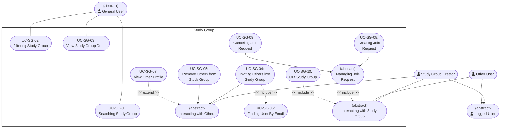
```mermaid
flowchart TD
 subgraph StudyGroup["Study Group"]
        UC1(["<center>UC-SG-01:<br>Searching Study Group</center>"])
        UC2(["<center>UC-SG-02:<br>Filtering Study Group</center>"])
        UC3(["<center>UC-SG-03:<br>View Study Group Detail</center>"])
        UC5(["<center>UC-SG-04:<br>Inviting Others into<br>Study Group</center>"])
        UC4(["<center>{abstract}<br>Interacting with Others</center>"])
        UC6(["<center>UC-SG-05:<br>Remove Others from<br>Study Group</center>"])
        UC7(["<center>UC-SG-06:<br>Finding User By Email</center>"])
        UC8(["<center>UC-SG-07:<br>View Other Profile</center>"])
        UC9(["<center>{abstract}<br>Interacting with Study Group</center>"])
        UC10(["<center>{abstract}<br>Managing Join<br>Request</center>"])
        UC11(["<center>UC-SG-08:<br>Creating Join<br>Request</center>"])
        UC12(["<center>UC-SG-09:<br>Canceling Join<br>Request</center>"])
        UC13(["<center>UC-SG-10:<br>Out Study Group</center>"])
  end
    StudyGroupCreator(["<center>fa:fa-user Study Group Creator</center>"]) --> User(["<center>{abstract}<br>fa:fa-user Logged User</center>"])
    OtherUser(["<center>fa:fa-user Other User</center>"]) --> User
    GeneralUser(["<center>{abstract}<br>fa:fa-user General User</center>"]) ~~~ StudyGroupCreator
    StudyGroupCreator ~~~ User
    GeneralUser ~~~~~ StudyGroup
    GeneralUser --- UC1 & UC2 & UC3
    StudyGroupCreator --- UC4 & UC9
    OtherUser --- UC9

    %% Generalization (Specific -> Abstract)
    UC5 --> UC4
    UC6 --> UC4
    UC11 --> UC10
    UC12 --> UC10

    %% Includes & Extends (Fixed from misuse of generalization)
    UC5 -. "<< include >>" .-> UC7
    UC8 -. "<< extend >>" .-> UC4
    UC10 -. "<< include >>" .-> UC9
    UC13 -. "<< include >>" .-> UC9

    style StudyGroup fill:#fff,stroke:#333,stroke-width:2px
```

---
### UC-SG-01: Searching Study Group

<table width="100%" border="1" cellpadding="8" cellspacing="0" style="border-collapse: collapse; font-family: Arial, sans-serif; font-size: 14px; border: 1px solid #d1d5db; margin-bottom: 20px;">
  <thead>
    <tr style="background-color: #1e3a8a; color: #ffffff;">
      <th colspan="2" style="text-align: left; padding: 12px; font-size: 16px;">
        Use Case: Searching Study Group
      </th>
    </tr>
  </thead>
  <tbody>
    <tr>
      <td width="22%" style="background-color: #f8fafc; font-weight: bold; vertical-align: top;">Use Case ID</td>
      <td style="vertical-align: top;"><strong>UC-SG-01</strong></td>
    </tr>
    <tr>
      <td style="background-color: #f8fafc; font-weight: bold; vertical-align: top;">Brief Description</td>
      <td style="vertical-align: top;">
        Allows a General User to search for study groups by keyword.
      </td>
    </tr>
    <tr>
      <td style="background-color: #f8fafc; font-weight: bold; vertical-align: top;">Actor(s)</td>
      <td style="vertical-align: top;">General User</td>
    </tr>
    <tr>
      <td style="background-color: #f8fafc; font-weight: bold; vertical-align: top;">Preconditions</td>
      <td style="vertical-align: top;">
        <ul style="margin: 0; padding-left: 20px; line-height: 1.5;">
          <li><strong>Feature Availability:</strong> The General User has access to the study group search feature.</li>
        </ul>
      </td>
    </tr>
    <tr>
      <td style="background-color: #f8fafc; font-weight: bold; vertical-align: top;">Flow of Events (Basic Flow)</td>
      <td style="vertical-align: top;">
        <ol style="margin: 0; padding-left: 20px; line-height: 1.6;">
          <li><strong>[Actor Action]:</strong> The General User navigates to the study group search interface.</li>
          <li><strong>[Actor Action]:</strong> The General User enters a search keyword.</li>
          <li><strong>[Data Processing]:</strong> The system validates the input.</li>
          <li><strong>[Data Processing]:</strong> The system retrieves study groups matching the keyword.</li>
          <li><strong>[Display Result]:</strong> The system displays the list of matching study groups.</li>
        </ol>
      </td>
    </tr>
    <tr>
      <td style="background-color: #f8fafc; font-weight: bold; vertical-align: top;">Alternative / Exception Flows</td>
      <td style="vertical-align: top;">
        <ul style="margin: 0; padding-left: 20px; line-height: 1.5;">
          <li style="margin-bottom: 8px;">
            <strong>Empty or Invalid Input (Step 3):</strong> If the entered keyword is empty or invalid:
            <ol style="margin-top: 4px; margin-bottom: 4px; padding-left: 20px;">
              <li>The system rejects the search request.</li>
              <li>The system prompts the General User to enter a valid keyword.</li>
            </ol>
            <strong>Postcondition (Alternative Flow):</strong> No search is executed; the General User remains on the search interface.
          </li>
          <li style="margin-bottom: 8px;">
            <strong>No Matching Results (Step 4):</strong> If no study groups match the keyword:
            <ol style="margin-top: 4px; margin-bottom: 4px; padding-left: 20px;">
              <li>The system displays a "no results found" message.</li>
            </ol>
            <strong>Postcondition (Alternative Flow):</strong> No study group list is displayed.
          </li>
        </ul>
      </td>
    </tr>
    <tr>
      <td style="background-color: #f8fafc; font-weight: bold; vertical-align: top;">Postconditions</td>
      <td style="vertical-align: top;">
        <ul style="margin: 0; padding-left: 20px;">
          <li><strong>Result Display:</strong> A list of study groups matching the search criteria is displayed to the General User.</li>
        </ul>
      </td>
    </tr>
    <tr>
      <td style="background-color: #f8fafc; font-weight: bold; vertical-align: top;">Special Requirements</td>
      <td style="vertical-align: top;">
        <ul style="margin: 0; padding-left: 20px;">
          <li><strong>Response Time:</strong> Search results must be returned within an acceptable response time.</li>
          <li><strong>Input Validation:</strong> Search input must be validated to prevent malformed or malicious queries.</li>
        </ul>
      </td>
    </tr>
    <tr>
      <td style="background-color: #f8fafc; font-weight: bold; vertical-align: top;">Extension Points</td>
      <td style="vertical-align: top;">
        None
      </td>
    </tr>
    <tr>
      <td style="background-color: #f8fafc; font-weight: bold; vertical-align: top;">Prototype Screen</td>
      <td style="vertical-align: top;">
        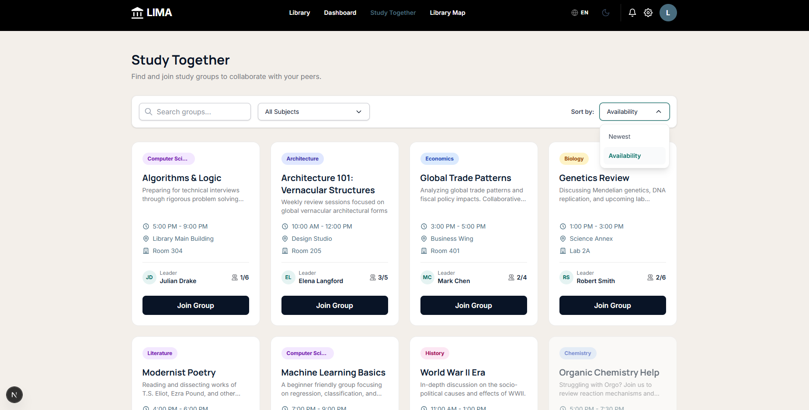
        
<em>Figure P-SG-01-BF01 – Search Study Groups</em>

        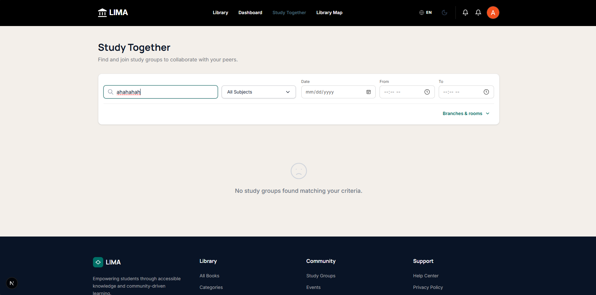
        
<em>Figure P-SG-01-AF02 – No Search Results</em>

      </td>
    </tr>
  </tbody>
</table>

---

### UC-SG-02: Filtering Study Group

<table width="100%" border="1" cellpadding="8" cellspacing="0" style="border-collapse: collapse; font-family: Arial, sans-serif; font-size: 14px; border: 1px solid #d1d5db; margin-bottom: 20px;">
  <thead>
    <tr style="background-color: #1e3a8a; color: #ffffff;">
      <th colspan="2" style="text-align: left; padding: 12px; font-size: 16px;">
        Use Case: Filtering Study Group
      </th>
    </tr>
  </thead>
  <tbody>
    <tr>
      <td width="22%" style="background-color: #f8fafc; font-weight: bold; vertical-align: top;">Use Case ID</td>
      <td style="vertical-align: top;"><strong>UC-SG-02</strong></td>
    </tr>
    <tr>
      <td style="background-color: #f8fafc; font-weight: bold; vertical-align: top;">Brief Description</td>
      <td style="vertical-align: top;">
        Allows a General User to narrow a study group list using filter criteria such as subject, schedule, or size.
      </td>
    </tr>
    <tr>
      <td style="background-color: #f8fafc; font-weight: bold; vertical-align: top;">Actor(s)</td>
      <td style="vertical-align: top;">General User</td>
    </tr>
    <tr>
      <td style="background-color: #f8fafc; font-weight: bold; vertical-align: top;">Preconditions</td>
      <td style="vertical-align: top;">
        <ul style="margin: 0; padding-left: 20px; line-height: 1.5;">
          <li><strong>List Availability:</strong> A list of study groups is available for filtering (e.g., resulting from a search or a default listing).</li>
        </ul>
      </td>
    </tr>
    <tr>
      <td style="background-color: #f8fafc; font-weight: bold; vertical-align: top;">Flow of Events (Basic Flow)</td>
      <td style="vertical-align: top;">
        <ol style="margin: 0; padding-left: 20px; line-height: 1.6;">
          <li><strong>[Actor Action]:</strong> The General User accesses a study group listing.</li>
          <li><strong>[Actor Action]:</strong> The General User selects one or more filter criteria.</li>
          <li><strong>[Data Processing]:</strong> The system validates the selected criteria.</li>
          <li><strong>[Data Processing]:</strong> The system applies the filters to the current list.</li>
          <li><strong>[Display Result]:</strong> The system displays the filtered list.</li>
        </ol>
      </td>
    </tr>
    <tr>
      <td style="background-color: #f8fafc; font-weight: bold; vertical-align: top;">Alternative / Exception Flows</td>
      <td style="vertical-align: top;">
        <ul style="margin: 0; padding-left: 20px; line-height: 1.5;">
          <li style="margin-bottom: 8px;">
            <strong>Invalid Filter Combination (Step 3):</strong> If the selected filters are invalid or conflicting:
            <ol style="margin-top: 4px; margin-bottom: 4px; padding-left: 20px;">
              <li>The system rejects the filter request.</li>
              <li>The system notifies the General User and retains the previous list.</li>
            </ol>
            <strong>Postcondition (Alternative Flow):</strong> The previous study group list remains displayed.
          </li>
          <li style="margin-bottom: 8px;">
            <strong>No Results After Filtering (Step 4):</strong> If no study groups match the filters:
            <ol style="margin-top: 4px; margin-bottom: 4px; padding-left: 20px;">
              <li>The system displays a "no results found" message.</li>
              <li>The system allows the General User to adjust the filters.</li>
            </ol>
            <strong>Postcondition (Alternative Flow):</strong> The filtered list is empty.
          </li>
        </ul>
      </td>
    </tr>
    <tr>
      <td style="background-color: #f8fafc; font-weight: bold; vertical-align: top;">Postconditions</td>
      <td style="vertical-align: top;">
        <ul style="margin: 0; padding-left: 20px;">
          <li><strong>Result Display:</strong> The displayed list of study groups reflects the applied filter criteria.</li>
        </ul>
      </td>
    </tr>
    <tr>
      <td style="background-color: #f8fafc; font-weight: bold; vertical-align: top;">Special Requirements</td>
      <td style="vertical-align: top;">
        <ul style="margin: 0; padding-left: 20px;">
          <li><strong>Filter Usability:</strong> Filter options must be clearly presented and combinable where applicable.</li>
        </ul>
      </td>
    </tr>
    <tr>
      <td style="background-color: #f8fafc; font-weight: bold; vertical-align: top;">Extension Points</td>
      <td style="vertical-align: top;">
        None
      </td>
    </tr>
    <tr>
      <td style="background-color: #f8fafc; font-weight: bold; vertical-align: top;">Prototype Screen</td>
      <td style="vertical-align: top;">
        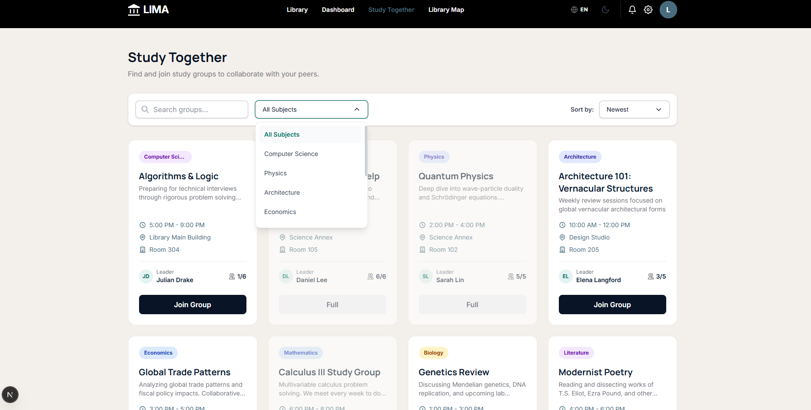
        
<em>Figure P-SG-02-BF01 – Filter Study Groups</em>

      </td>
    </tr>
  </tbody>
</table>

---

### UC-SG-03: View Study Group Detail

<table width="100%" border="1" cellpadding="8" cellspacing="0" style="border-collapse: collapse; font-family: Arial, sans-serif; font-size: 14px; border: 1px solid #d1d5db; margin-bottom: 20px;">
  <thead>
    <tr style="background-color: #1e3a8a; color: #ffffff;">
      <th colspan="2" style="text-align: left; padding: 12px; font-size: 16px;">
        Use Case: View Study Group Detail
      </th>
    </tr>
  </thead>
  <tbody>
    <tr>
      <td width="22%" style="background-color: #f8fafc; font-weight: bold; vertical-align: top;">Use Case ID</td>
      <td style="vertical-align: top;"><strong>UC-SG-03</strong></td>
    </tr>
    <tr>
      <td style="background-color: #f8fafc; font-weight: bold; vertical-align: top;">Brief Description</td>
      <td style="vertical-align: top;">
        Allows a General User to view detailed information about a specific study group.
      </td>
    </tr>
    <tr>
      <td style="background-color: #f8fafc; font-weight: bold; vertical-align: top;">Actor(s)</td>
      <td style="vertical-align: top;">General User</td>
    </tr>
    <tr>
      <td style="background-color: #f8fafc; font-weight: bold; vertical-align: top;">Preconditions</td>
      <td style="vertical-align: top;">
        <ul style="margin: 0; padding-left: 20px; line-height: 1.5;">
          <li><strong>Group Accessibility:</strong> A study group exists and is accessible from a list (search or filtered results).</li>
        </ul>
      </td>
    </tr>
    <tr>
      <td style="background-color: #f8fafc; font-weight: bold; vertical-align: top;">Flow of Events (Basic Flow)</td>
      <td style="vertical-align: top;">
        <ol style="margin: 0; padding-left: 20px; line-height: 1.6;">
          <li><strong>[Actor Action]:</strong> The General User selects a study group from a list.</li>
          <li><strong>[Data Processing]:</strong> The system retrieves the study group's detailed information.</li>
          <li><strong>[Display Result]:</strong> The system displays the study group details, including description, members, and schedule.</li>
        </ol>
      </td>
    </tr>
    <tr>
      <td style="background-color: #f8fafc; font-weight: bold; vertical-align: top;">Alternative / Exception Flows</td>
      <td style="vertical-align: top;">
        <ul style="margin: 0; padding-left: 20px; line-height: 1.5;">
          <li style="margin-bottom: 8px;">
            <strong>Study Group Unavailable (Step 2):</strong> If the selected study group no longer exists or is inaccessible:
            <ol style="margin-top: 4px; margin-bottom: 4px; padding-left: 20px;">
              <li>The system displays an error message.</li>
            </ol>
            <strong>Postcondition (Alternative Flow):</strong> No detail view is displayed.
          </li>
        </ul>
      </td>
    </tr>
    <tr>
      <td style="background-color: #f8fafc; font-weight: bold; vertical-align: top;">Postconditions</td>
      <td style="vertical-align: top;">
        <ul style="margin: 0; padding-left: 20px;">
          <li><strong>Detail Display:</strong> The detailed information of the selected study group is displayed to the General User.</li>
        </ul>
      </td>
    </tr>
    <tr>
      <td style="background-color: #f8fafc; font-weight: bold; vertical-align: top;">Special Requirements</td>
      <td style="vertical-align: top;">
        <ul style="margin: 0; padding-left: 20px;">
          <li><strong>Access Level:</strong> Only information appropriate to the requesting General User's access level is displayed.</li>
        </ul>
      </td>
    </tr>
    <tr>
      <td style="background-color: #f8fafc; font-weight: bold; vertical-align: top;">Extension Points</td>
      <td style="vertical-align: top;">
        None
      </td>
    </tr>
    <tr>
      <td style="background-color: #f8fafc; font-weight: bold; vertical-align: top;">Prototype Screen</td>
      <td style="vertical-align: top;">
        
        
<em>Figure P-SG-03-BF01 – Study Group Details</em>

      </td>
    </tr>
  </tbody>
</table>

---

### UC-SG-04: Inviting Others into Study Group

<table width="100%" border="1" cellpadding="8" cellspacing="0" style="border-collapse: collapse; font-family: Arial, sans-serif; font-size: 14px; border: 1px solid #d1d5db; margin-bottom: 20px;">
  <thead>
    <tr style="background-color: #1e3a8a; color: #ffffff;">
      <th colspan="2" style="text-align: left; padding: 12px; font-size: 16px;">
        Use Case: Inviting Others into Study Group
      </th>
    </tr>
  </thead>
  <tbody>
    <tr>
      <td width="22%" style="background-color: #f8fafc; font-weight: bold; vertical-align: top;">Use Case ID</td>
      <td style="vertical-align: top;"><strong>UC-SG-04</strong></td>
    </tr>
    <tr>
      <td style="background-color: #f8fafc; font-weight: bold; vertical-align: top;">Brief Description</td>
      <td style="vertical-align: top;">
        Allows the Study Group Creator to invite a user to join a study group they manage.
      </td>
    </tr>
    <tr>
      <td style="background-color: #f8fafc; font-weight: bold; vertical-align: top;">Actor(s)</td>
      <td style="vertical-align: top;">Study Group Creator</td>
    </tr>
    <tr>
      <td style="background-color: #f8fafc; font-weight: bold; vertical-align: top;">Preconditions</td>
      <td style="vertical-align: top;">
        <ul style="margin: 0; padding-left: 20px; line-height: 1.5;">
          <li><strong>Authorization State:</strong> The Study Group Creator is authenticated and manages the selected study group.</li>
        </ul>
      </td>
    </tr>
    <tr>
      <td style="background-color: #f8fafc; font-weight: bold; vertical-align: top;">Flow of Events (Basic Flow)</td>
      <td style="vertical-align: top;">
        <ol style="margin: 0; padding-left: 20px; line-height: 1.6;">
          <li><strong>[Actor Action]:</strong> The Study Group Creator selects the study group to invite a member to.</li>
          <li><strong>[Actor Action]:</strong> The Study Group Creator selects a user to invite, optionally using UC-SG-07 (Finding User By Email).</li>
          <li><strong>[Data Processing]:</strong> The system validates that the target user is not already a member of the study group.</li>
          <li><strong>[Data Processing]:</strong> The system sends an invitation to the target user.</li>
          <li><strong>[Display Result]:</strong> The system confirms to the Study Group Creator that the invitation was sent.</li>
        </ol>
      </td>
    </tr>
    <tr>
      <td style="background-color: #f8fafc; font-weight: bold; vertical-align: top;">Alternative / Exception Flows</td>
      <td style="vertical-align: top;">
        <ul style="margin: 0; padding-left: 20px; line-height: 1.5;">
          <li style="margin-bottom: 8px;">
            <strong>Target User Already a Member (Step 3):</strong> If the target user is already a member of the study group:
            <ol style="margin-top: 4px; margin-bottom: 4px; padding-left: 20px;">
              <li>The system displays an error message.</li>
              <li>The system does not send an invitation.</li>
            </ol>
            <strong>Postcondition (Alternative Flow):</strong> No invitation is sent; the study group membership remains unchanged.
          </li>
        </ul>
      </td>
    </tr>
    <tr>
      <td style="background-color: #f8fafc; font-weight: bold; vertical-align: top;">Postconditions</td>
      <td style="vertical-align: top;">
        <ul style="margin: 0; padding-left: 20px;">
          <li><strong>Invitation Issued:</strong> An invitation has been issued to the specified user for the selected study group.</li>
        </ul>
      </td>
    </tr>
    <tr>
      <td style="background-color: #f8fafc; font-weight: bold; vertical-align: top;">Special Requirements</td>
      <td style="vertical-align: top;">
        <ul style="margin: 0; padding-left: 20px;">
          <li><strong>Authorization:</strong> Only the study group creator may issue invitations for a given study group.</li>
          <li><strong>Duplicate Prevention:</strong> Duplicate invitations to the same user for the same study group must be prevented.</li>
        </ul>
      </td>
    </tr>
    <tr>
      <td style="background-color: #f8fafc; font-weight: bold; vertical-align: top;">Extension Points</td>
      <td style="vertical-align: top;">
        None
      </td>
    </tr>
    <tr>
      <td style="background-color: #f8fafc; font-weight: bold; vertical-align: top;">Prototype Screen</td>
      <td style="vertical-align: top;">
        
        
<em>Figure P-SG-04-BF01 – Manage Group Members</em>

        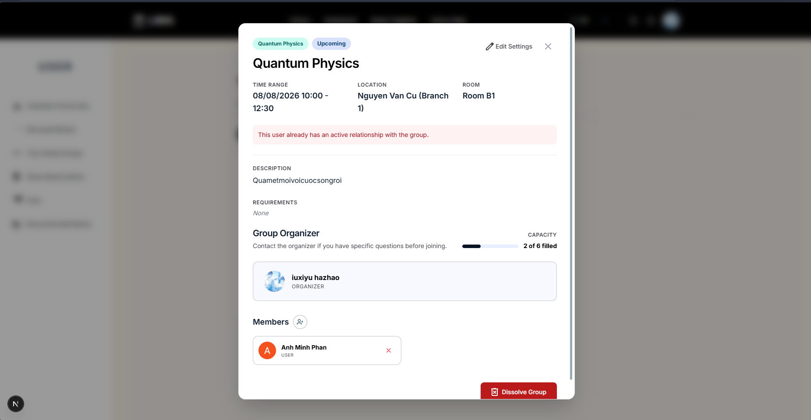
        
<em>Figure P-SG-04-AF01 – User Already a Member</em>

      </td>
    </tr>
  </tbody>
</table>

---

### UC-SG-05: Remove Others from Study Group

<table width="100%" border="1" cellpadding="8" cellspacing="0" style="border-collapse: collapse; font-family: Arial, sans-serif; font-size: 14px; border: 1px solid #d1d5db; margin-bottom: 20px;">
  <thead>
    <tr style="background-color: #1e3a8a; color: #ffffff;">
      <th colspan="2" style="text-align: left; padding: 12px; font-size: 16px;">
        Use Case: Remove Others from Study Group
      </th>
    </tr>
  </thead>
  <tbody>
    <tr>
      <td width="22%" style="background-color: #f8fafc; font-weight: bold; vertical-align: top;">Use Case ID</td>
      <td style="vertical-align: top;"><strong>UC-SG-05</strong></td>
    </tr>
    <tr>
      <td style="background-color: #f8fafc; font-weight: bold; vertical-align: top;">Brief Description</td>
      <td style="vertical-align: top;">
        Allows the Study Group Creator to remove an existing member from a study group they manage.
      </td>
    </tr>
    <tr>
      <td style="background-color: #f8fafc; font-weight: bold; vertical-align: top;">Actor(s)</td>
      <td style="vertical-align: top;">Study Group Creator</td>
    </tr>
    <tr>
      <td style="background-color: #f8fafc; font-weight: bold; vertical-align: top;">Preconditions</td>
      <td style="vertical-align: top;">
        <ul style="margin: 0; padding-left: 20px; line-height: 1.5;">
          <li><strong>Authorization and Membership State:</strong> The Study Group Creator manages the study group; the target user is a current member of the study group.</li>
        </ul>
      </td>
    </tr>
    <tr>
      <td style="background-color: #f8fafc; font-weight: bold; vertical-align: top;">Flow of Events (Basic Flow)</td>
      <td style="vertical-align: top;">
        <ol style="margin: 0; padding-left: 20px; line-height: 1.6;">
          <li><strong>[Actor Action]:</strong> The Study Group Creator selects the study group and views its member list.</li>
          <li><strong>[Actor Action]:</strong> The Study Group Creator selects the member to remove.</li>
          <li><strong>[System Response]:</strong> The system requests confirmation of the removal.</li>
          <li><strong>[Data Processing]:</strong> The system removes the selected member from the study group.</li>
          <li><strong>[Display Result]:</strong> The system confirms the removal to the Study Group Creator.</li>
        </ol>
      </td>
    </tr>
    <tr>
      <td style="background-color: #f8fafc; font-weight: bold; vertical-align: top;">Alternative / Exception Flows</td>
      <td style="vertical-align: top;">
        <ul style="margin: 0; padding-left: 20px; line-height: 1.5;">
          <li style="margin-bottom: 8px;">
            <strong>Removal Canceled (Step 3):</strong> If the Study Group Creator cancels the confirmation:
            <ol style="margin-top: 4px; margin-bottom: 4px; padding-left: 20px;">
              <li>The system cancels the removal process.</li>
            </ol>
            <strong>Postcondition (Alternative Flow):</strong> The study group membership remains unchanged.
          </li>
          <li style="margin-bottom: 8px;">
            <strong>Target User Not a Member (Step 2):</strong> If the selected user is not currently a member:
            <ol style="margin-top: 4px; margin-bottom: 4px; padding-left: 20px;">
              <li>The system displays an error message.</li>
            </ol>
            <strong>Postcondition (Alternative Flow):</strong> The study group membership remains unchanged.
          </li>
        </ul>
      </td>
    </tr>
    <tr>
      <td style="background-color: #f8fafc; font-weight: bold; vertical-align: top;">Postconditions</td>
      <td style="vertical-align: top;">
        <ul style="margin: 0; padding-left: 20px;">
          <li><strong>Membership Update:</strong> The selected member is no longer part of the study group.</li>
        </ul>
      </td>
    </tr>
    <tr>
      <td style="background-color: #f8fafc; font-weight: bold; vertical-align: top;">Special Requirements</td>
      <td style="vertical-align: top;">
        <ul style="margin: 0; padding-left: 20px;">
          <li><strong>Authorization:</strong> Only the study group creator may remove members from a study group they manage.</li>
          <li><strong>Notification:</strong> The affected user should be notified of their removal.</li>
        </ul>
      </td>
    </tr>
    <tr>
      <td style="background-color: #f8fafc; font-weight: bold; vertical-align: top;">Extension Points</td>
      <td style="vertical-align: top;">
        None
      </td>
    </tr>
    <tr>
      <td style="background-color: #f8fafc; font-weight: bold; vertical-align: top;">Prototype Screen</td>
      <td style="vertical-align: top;">
        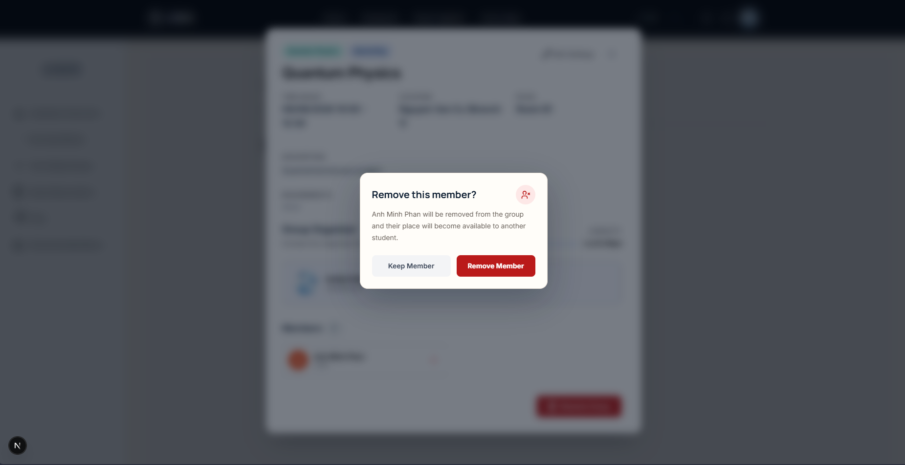
        
<em>Figure P-SG-05-BF01 – Remove Group Member</em>

      </td>
    </tr>
  </tbody>
</table>

---

### UC-SG-06: Finding User By Email

<table width="100%" border="1" cellpadding="8" cellspacing="0" style="border-collapse: collapse; font-family: Arial, sans-serif; font-size: 14px; border: 1px solid #d1d5db; margin-bottom: 20px;">
  <thead>
    <tr style="background-color: #1e3a8a; color: #ffffff;">
      <th colspan="2" style="text-align: left; padding: 12px; font-size: 16px;">
        Use Case: Finding User By Email
      </th>
    </tr>
  </thead>
  <tbody>
    <tr>
      <td width="22%" style="background-color: #f8fafc; font-weight: bold; vertical-align: top;">Use Case ID</td>
      <td style="vertical-align: top;"><strong>UC-SG-06</strong></td>
    </tr>
    <tr>
      <td style="background-color: #f8fafc; font-weight: bold; vertical-align: top;">Brief Description</td>
      <td style="vertical-align: top;">
        Allows the Study Group Creator to locate a registered user by email address, typically in support of inviting them to a study group.
      </td>
    </tr>
    <tr>
      <td style="background-color: #f8fafc; font-weight: bold; vertical-align: top;">Actor(s)</td>
      <td style="vertical-align: top;">Study Group Creator</td>
    </tr>
    <tr>
      <td style="background-color: #f8fafc; font-weight: bold; vertical-align: top;">Preconditions</td>
      <td style="vertical-align: top;">
        <ul style="margin: 0; padding-left: 20px; line-height: 1.5;">
          <li><strong>Feature Availability:</strong> The Study Group Creator has access to the user lookup feature.</li>
        </ul>
      </td>
    </tr>
    <tr>
      <td style="background-color: #f8fafc; font-weight: bold; vertical-align: top;">Flow of Events (Basic Flow)</td>
      <td style="vertical-align: top;">
        <ol style="margin: 0; padding-left: 20px; line-height: 1.6;">
          <li><strong>[Actor Action]:</strong> The Study Group Creator enters an email address to search for.</li>
          <li><strong>[Data Processing]:</strong> The system validates the format of the email address.</li>
          <li><strong>[Data Processing]:</strong> The system searches for a registered user matching the entered email address.</li>
          <li><strong>[Display Result]:</strong> The system displays the matching user's basic profile information.</li>
        </ol>
      </td>
    </tr>
    <tr>
      <td style="background-color: #f8fafc; font-weight: bold; vertical-align: top;">Alternative / Exception Flows</td>
      <td style="vertical-align: top;">
        <ul style="margin: 0; padding-left: 20px; line-height: 1.5;">
          <li style="margin-bottom: 8px;">
            <strong>Invalid Email Format (Step 2):</strong> If the email format is invalid:
            <ol style="margin-top: 4px; margin-bottom: 4px; padding-left: 20px;">
              <li>The system prompts the Study Group Creator to correct the input.</li>
            </ol>
            <strong>Postcondition (Alternative Flow):</strong> No user information is displayed.
          </li>
          <li style="margin-bottom: 8px;">
            <strong>No Matching User (Step 3):</strong> If no registered user matches the provided email:
            <ol style="margin-top: 4px; margin-bottom: 4px; padding-left: 20px;">
              <li>The system displays a "user not found" message.</li>
            </ol>
            <strong>Postcondition (Alternative Flow):</strong> No user information is displayed.
          </li>
        </ul>
      </td>
    </tr>
    <tr>
      <td style="background-color: #f8fafc; font-weight: bold; vertical-align: top;">Postconditions</td>
      <td style="vertical-align: top;">
        <ul style="margin: 0; padding-left: 20px;">
          <li><strong>Result Display:</strong> A user matching the provided email address, if found, is presented to the Study Group Creator.</li>
        </ul>
      </td>
    </tr>
    <tr>
      <td style="background-color: #f8fafc; font-weight: bold; vertical-align: top;">Special Requirements</td>
      <td style="vertical-align: top;">
        <ul style="margin: 0; padding-left: 20px;">
          <li><strong>Privacy:</strong> Only minimal, non-sensitive user information should be exposed through this lookup.</li>
        </ul>
      </td>
    </tr>
    <tr>
      <td style="background-color: #f8fafc; font-weight: bold; vertical-align: top;">Extension Points</td>
      <td style="vertical-align: top;">
        None
      </td>
    </tr>
    <tr>
      <td style="background-color: #f8fafc; font-weight: bold; vertical-align: top;">Prototype Screen</td>
      <td style="vertical-align: top;">
        
        
<em>Figure P-SG-07-BF01 – View Other Profile (reused as the found-user result screen)</em>

        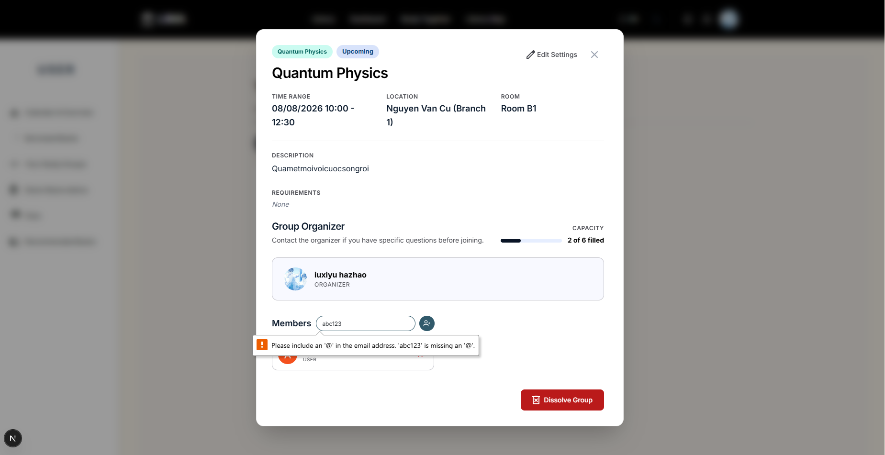
        
<em>Figure P-SG-06-AF01 – Invalid Email</em>

        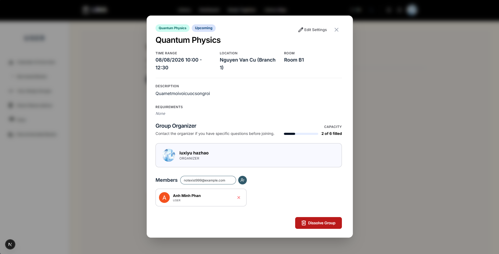
        
<em>Figure P-SG-06-AF02 – User Not Found</em>

      </td>
    </tr>
  </tbody>
</table>

---

### UC-SG-07: View Other Profile

<table width="100%" border="1" cellpadding="8" cellspacing="0" style="border-collapse: collapse; font-family: Arial, sans-serif; font-size: 14px; border: 1px solid #d1d5db; margin-bottom: 20px;">
  <thead>
    <tr style="background-color: #1e3a8a; color: #ffffff;">
      <th colspan="2" style="text-align: left; padding: 12px; font-size: 16px;">
        Use Case: View Other Profile
      </th>
    </tr>
  </thead>
  <tbody>
    <tr>
      <td width="22%" style="background-color: #f8fafc; font-weight: bold; vertical-align: top;">Use Case ID</td>
      <td style="vertical-align: top;"><strong>UC-SG-07</strong></td>
    </tr>
    <tr>
      <td style="background-color: #f8fafc; font-weight: bold; vertical-align: top;">Brief Description</td>
      <td style="vertical-align: top;">
        Allows the Study Group Creator to view the profile information of another user, such as a study group member or a prospective invitee.
      </td>
    </tr>
    <tr>
      <td style="background-color: #f8fafc; font-weight: bold; vertical-align: top;">Actor(s)</td>
      <td style="vertical-align: top;">Study Group Creator</td>
    </tr>
    <tr>
      <td style="background-color: #f8fafc; font-weight: bold; vertical-align: top;">Preconditions</td>
      <td style="vertical-align: top;">
        <ul style="margin: 0; padding-left: 20px; line-height: 1.5;">
          <li><strong>Profile Accessibility:</strong> The target user's profile exists and is accessible to the Study Group Creator.</li>
        </ul>
      </td>
    </tr>
    <tr>
      <td style="background-color: #f8fafc; font-weight: bold; vertical-align: top;">Flow of Events (Basic Flow)</td>
      <td style="vertical-align: top;">
        <ol style="margin: 0; padding-left: 20px; line-height: 1.6;">
          <li><strong>[Actor Action]:</strong> The Study Group Creator selects a user, e.g., from a member list or search result.</li>
          <li><strong>[Data Processing]:</strong> The system retrieves the selected user's profile information according to the target user's visibility settings.</li>
          <li><strong>[Display Result]:</strong> The system displays the profile to the Study Group Creator.</li>
        </ol>
      </td>
    </tr>
    <tr>
      <td style="background-color: #f8fafc; font-weight: bold; vertical-align: top;">Alternative / Exception Flows</td>
      <td style="vertical-align: top;">
        <ul style="margin: 0; padding-left: 20px; line-height: 1.5;">
          <li style="margin-bottom: 8px;">
            <strong>Profile Unavailable (Step 2):</strong> If the target user's profile cannot be retrieved:
            <ol style="margin-top: 4px; margin-bottom: 4px; padding-left: 20px;">
              <li>The system displays an error message.</li>
            </ol>
            <strong>Postcondition (Alternative Flow):</strong> No profile information is displayed.
          </li>
        </ul>
      </td>
    </tr>
    <tr>
      <td style="background-color: #f8fafc; font-weight: bold; vertical-align: top;">Postconditions</td>
      <td style="vertical-align: top;">
        <ul style="margin: 0; padding-left: 20px;">
          <li><strong>Profile Display:</strong> The requested user's profile information is displayed to the Study Group Creator.</li>
        </ul>
      </td>
    </tr>
    <tr>
      <td style="background-color: #f8fafc; font-weight: bold; vertical-align: top;">Special Requirements</td>
      <td style="vertical-align: top;">
        <ul style="margin: 0; padding-left: 20px;">
          <li><strong>Visibility:</strong> Only profile information the target user has made visible/appropriate for this context should be shown.</li>
        </ul>
      </td>
    </tr>
    <tr>
      <td style="background-color: #f8fafc; font-weight: bold; vertical-align: top;">Extension Points</td>
      <td style="vertical-align: top;">
        None
      </td>
    </tr>
    <tr>
      <td style="background-color: #f8fafc; font-weight: bold; vertical-align: top;">Prototype Screen</td>
      <td style="vertical-align: top;">
        
        
<em>Figure P-SG-07-BF01 – View Other Profile</em>

      </td>
    </tr>
  </tbody>
</table>

---

### UC-SG-08: Creating Join Request

<table width="100%" border="1" cellpadding="8" cellspacing="0" style="border-collapse: collapse; font-family: Arial, sans-serif; font-size: 14px; border: 1px solid #d1d5db; margin-bottom: 20px;">
  <thead>
    <tr style="background-color: #1e3a8a; color: #ffffff;">
      <th colspan="2" style="text-align: left; padding: 12px; font-size: 16px;">
        Use Case: Creating Join Request
      </th>
    </tr>
  </thead>
  <tbody>
    <tr>
      <td width="22%" style="background-color: #f8fafc; font-weight: bold; vertical-align: top;">Use Case ID</td>
      <td style="vertical-align: top;"><strong>UC-SG-08</strong></td>
    </tr>
    <tr>
      <td style="background-color: #f8fafc; font-weight: bold; vertical-align: top;">Brief Description</td>
      <td style="vertical-align: top;">
        Allows a user to submit a request to join a study group.
      </td>
    </tr>
    <tr>
      <td style="background-color: #f8fafc; font-weight: bold; vertical-align: top;">Actor(s)</td>
      <td style="vertical-align: top;">Other User</td>
    </tr>
    <tr>
      <td style="background-color: #f8fafc; font-weight: bold; vertical-align: top;">Preconditions</td>
      <td style="vertical-align: top;">
        <ul style="margin: 0; padding-left: 20px; line-height: 1.5;">
          <li><strong>Authentication State:</strong> The Other User is authenticated, and the selected study group exists.</li>
        </ul>
      </td>
    </tr>
    <tr>
      <td style="background-color: #f8fafc; font-weight: bold; vertical-align: top;">Flow of Events (Basic Flow)</td>
      <td style="vertical-align: top;">
        <ol style="margin: 0; padding-left: 20px; line-height: 1.6;">
          <li><strong>[Actor Action]:</strong> The Other User selects the study group they wish to join.</li>
          <li><strong>[Actor Action]:</strong> The Other User submits a request to join.</li>
          <li><strong>[Data Processing]:</strong> The system validates that the Other User is not already a member and has no existing pending request for the study group.</li>
          <li><strong>[Data Processing]:</strong> The system creates the join request and associates it with the study group.</li>
          <li><strong>[Data Processing]:</strong> The system notifies the Study Group Creator of the new join request.</li>
          <li><strong>[Display Result]:</strong> The system confirms to the Other User that the request has been submitted.</li>
        </ol>
      </td>
    </tr>
    <tr>
      <td style="background-color: #f8fafc; font-weight: bold; vertical-align: top;">Alternative / Exception Flows</td>
      <td style="vertical-align: top;">
        <ul style="margin: 0; padding-left: 20px; line-height: 1.5;">
          <li style="margin-bottom: 8px;">
            <strong>User Already a Member (Step 3):</strong> If the Other User is already a member of the study group:
            <ol style="margin-top: 4px; margin-bottom: 4px; padding-left: 20px;">
              <li>The system displays an error message.</li>
              <li>The system does not create a request.</li>
            </ol>
            <strong>Postcondition (Alternative Flow):</strong> No new join request is created.
          </li>
          <li style="margin-bottom: 8px;">
            <strong>Duplicate Pending Request (Step 3):</strong> If a pending join request already exists for the Other User and study group:
            <ol style="margin-top: 4px; margin-bottom: 4px; padding-left: 20px;">
              <li>The system displays a message.</li>
              <li>The system does not create a duplicate request.</li>
            </ol>
            <strong>Postcondition (Alternative Flow):</strong> No new join request is created.
          </li>
        </ul>
      </td>
    </tr>
    <tr>
      <td style="background-color: #f8fafc; font-weight: bold; vertical-align: top;">Postconditions</td>
      <td style="vertical-align: top;">
        <ul style="margin: 0; padding-left: 20px;">
          <li><strong>Request Created:</strong> A pending join request for the Other User exists against the selected study group.</li>
        </ul>
      </td>
    </tr>
    <tr>
      <td style="background-color: #f8fafc; font-weight: bold; vertical-align: top;">Special Requirements</td>
      <td style="vertical-align: top;">
        <ul style="margin: 0; padding-left: 20px;">
          <li><strong>Request Limit:</strong> Each user may have at most one pending join request per study group at any given time.</li>
        </ul>
      </td>
    </tr>
    <tr>
      <td style="background-color: #f8fafc; font-weight: bold; vertical-align: top;">Extension Points</td>
      <td style="vertical-align: top;">
        None
      </td>
    </tr>
    <tr>
      <td style="background-color: #f8fafc; font-weight: bold; vertical-align: top;">Prototype Screen</td>
      <td style="vertical-align: top;">
        
        
<em>Figure P-SG-08-BF01 – Create Join Request</em>

      </td>
    </tr>
  </tbody>
</table>

---

### UC-SG-09: Canceling Join Request

<table width="100%" border="1" cellpadding="8" cellspacing="0" style="border-collapse: collapse; font-family: Arial, sans-serif; font-size: 14px; border: 1px solid #d1d5db; margin-bottom: 20px;">
  <thead>
    <tr style="background-color: #1e3a8a; color: #ffffff;">
      <th colspan="2" style="text-align: left; padding: 12px; font-size: 16px;">
        Use Case: Canceling Join Request
      </th>
    </tr>
  </thead>
  <tbody>
    <tr>
      <td width="22%" style="background-color: #f8fafc; font-weight: bold; vertical-align: top;">Use Case ID</td>
      <td style="vertical-align: top;"><strong>UC-SG-09</strong></td>
    </tr>
    <tr>
      <td style="background-color: #f8fafc; font-weight: bold; vertical-align: top;">Brief Description</td>
      <td style="vertical-align: top;">
        Allows a user to cancel a previously submitted, still-pending join request for a study group.
      </td>
    </tr>
    <tr>
      <td style="background-color: #f8fafc; font-weight: bold; vertical-align: top;">Actor(s)</td>
      <td style="vertical-align: top;">Other User</td>
    </tr>
    <tr>
      <td style="background-color: #f8fafc; font-weight: bold; vertical-align: top;">Preconditions</td>
      <td style="vertical-align: top;">
        <ul style="margin: 0; padding-left: 20px; line-height: 1.5;">
          <li><strong>Authentication State:</strong> The Other User is authenticated.</li>
        </ul>
      </td>
    </tr>
    <tr>
      <td style="background-color: #f8fafc; font-weight: bold; vertical-align: top;">Flow of Events (Basic Flow)</td>
      <td style="vertical-align: top;">
        <ol style="margin: 0; padding-left: 20px; line-height: 1.6;">
          <li><strong>[Actor Action]:</strong> The Other User views their pending join request(s).</li>
          <li><strong>[Actor Action]:</strong> The Other User selects a pending join request to cancel.</li>
          <li><strong>[Data Processing]:</strong> The system validates that the selected request is still pending.</li>
          <li><strong>[Data Processing]:</strong> The system cancels the join request.</li>
          <li><strong>[Display Result]:</strong> The system confirms the cancellation to the Other User.</li>
        </ol>
      </td>
    </tr>
    <tr>
      <td style="background-color: #f8fafc; font-weight: bold; vertical-align: top;">Alternative / Exception Flows</td>
      <td style="vertical-align: top;">
        <ul style="margin: 0; padding-left: 20px; line-height: 1.5;">
          <li style="margin-bottom: 8px;">
            <strong>Request No Longer Pending (Step 3):</strong> If the join request has already been resolved (e.g., approved or previously canceled):
            <ol style="margin-top: 4px; margin-bottom: 4px; padding-left: 20px;">
              <li>The system displays an error message.</li>
              <li>The system takes no action.</li>
            </ol>
            <strong>Postcondition (Alternative Flow):</strong> The join request status remains unchanged.
          </li>
        </ul>
      </td>
    </tr>
    <tr>
      <td style="background-color: #f8fafc; font-weight: bold; vertical-align: top;">Postconditions</td>
      <td style="vertical-align: top;">
        <ul style="margin: 0; padding-left: 20px;">
          <li><strong>Request Removed:</strong> The selected join request no longer exists / is no longer pending.</li>
        </ul>
      </td>
    </tr>
    <tr>
      <td style="background-color: #f8fafc; font-weight: bold; vertical-align: top;">Special Requirements</td>
      <td style="vertical-align: top;">
        <ul style="margin: 0; padding-left: 20px;">
          <li><strong>Authorization:</strong> Only the user who created the join request may cancel it.</li>
        </ul>
      </td>
    </tr>
    <tr>
      <td style="background-color: #f8fafc; font-weight: bold; vertical-align: top;">Extension Points</td>
      <td style="vertical-align: top;">
        <ul style="margin: 0; padding-left: 20px;">
          <li>--</li>
        </ul>
      </td>
    </tr>
    <tr>
      <td style="background-color: #f8fafc; font-weight: bold; vertical-align: top;">Prototype Screen</td>
      <td style="vertical-align: top;">
        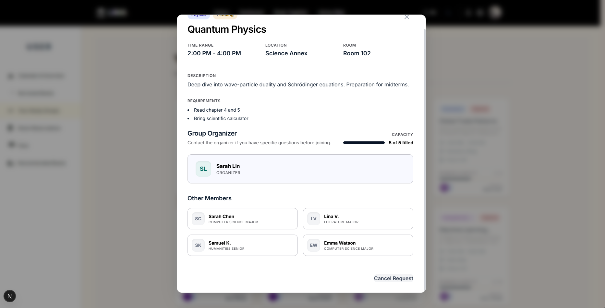
        
<em>Figure P-SG-09-BF01 – Cancel Join Request</em>

      </td>
    </tr>
  </tbody>
</table>

---

### UC-SG-10: Out Study Group

<table width="100%" border="1" cellpadding="8" cellspacing="0" style="border-collapse: collapse; font-family: Arial, sans-serif; font-size: 14px; border: 1px solid #d1d5db; margin-bottom: 20px;">
  <thead>
    <tr style="background-color: #1e3a8a; color: #ffffff;">
      <th colspan="2" style="text-align: left; padding: 12px; font-size: 16px;">
        Use Case: Out Study Group
      </th>
    </tr>
  </thead>
  <tbody>
    <tr>
      <td width="22%" style="background-color: #f8fafc; font-weight: bold; vertical-align: top;">Use Case ID</td>
      <td style="vertical-align: top;"><strong>UC-SG-10</strong></td>
    </tr>
    <tr>
      <td style="background-color: #f8fafc; font-weight: bold; vertical-align: top;">Brief Description</td>
      <td style="vertical-align: top;">
        Allows a study group member (Study Group Creator or Other User) to voluntarily leave a study group they currently belong to.
      </td>
    </tr>
    <tr>
      <td style="background-color: #f8fafc; font-weight: bold; vertical-align: top;">Actor(s)</td>
      <td style="vertical-align: top;">User (Group Member)</td>
    </tr>
    <tr>
      <td style="background-color: #f8fafc; font-weight: bold; vertical-align: top;">Preconditions</td>
      <td style="vertical-align: top;">
        <ul style="margin: 0; padding-left: 20px; line-height: 1.5;">
          <li><strong>Membership State:</strong> The actor is authenticated and is a current member of the selected study group.</li>
        </ul>
      </td>
    </tr>
    <tr>
      <td style="background-color: #f8fafc; font-weight: bold; vertical-align: top;">Flow of Events (Basic Flow)</td>
      <td style="vertical-align: top;">
        <ol style="margin: 0; padding-left: 20px; line-height: 1.6;">
          <li><strong>[Actor Action]:</strong> The actor selects the study group they wish to leave.</li>
          <li><strong>[Actor Action]:</strong> The actor confirms the intent to leave the study group.</li>
          <li><strong>[Data Processing]:</strong> The system removes the actor from the study group's membership.</li>
          <li><strong>[Display Result]:</strong> The system confirms to the actor that they have left the study group.</li>
        </ol>
      </td>
    </tr>
    <tr>
      <td style="background-color: #f8fafc; font-weight: bold; vertical-align: top;">Alternative / Exception Flows</td>
      <td style="vertical-align: top;">
        <ul style="margin: 0; padding-left: 20px; line-height: 1.5;">
          <li style="margin-bottom: 8px;">
            <strong>Leave Not Confirmed (Step 2):</strong> If the actor cancels the confirmation:
            <ol style="margin-top: 4px; margin-bottom: 4px; padding-left: 20px;">
              <li>No membership change occurs.</li>
            </ol>
            <strong>Postcondition (Alternative Flow):</strong> The actor's membership status remains unchanged.
          </li>
        </ul>
      </td>
    </tr>
    <tr>
      <td style="background-color: #f8fafc; font-weight: bold; vertical-align: top;">Postconditions</td>
      <td style="vertical-align: top;">
        <ul style="margin: 0; padding-left: 20px;">
          <li><strong>Membership Update:</strong> The actor is no longer a member of the study group.</li>
        </ul>
      </td>
    </tr>
    <tr>
      <td style="background-color: #f8fafc; font-weight: bold; vertical-align: top;">Special Requirements</td>
      <td style="vertical-align: top;">
        <ul style="margin: 0; padding-left: 20px;">
          <li><strong>Creator Succession:</strong> If the actor is the Study Group Creator, the system must ensure another member is assigned as the creator before the creator can leave.</li>
        </ul>
      </td>
    </tr>
    <tr>
      <td style="background-color: #f8fafc; font-weight: bold; vertical-align: top;">Extension Points</td>
      <td style="vertical-align: top;">
        None
      </td>
    </tr>
    <tr>
      <td style="background-color: #f8fafc; font-weight: bold; vertical-align: top;">Prototype Screen</td>
      <td style="vertical-align: top;">
        
        
<em>Figure P-SG-10-BF01 – Leave Study Group</em>

      </td>
    </tr>
  </tbody>
</table>

## VII. AI Recommendation

### Use case diagram

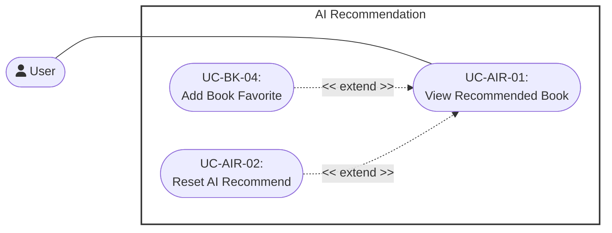
```mermaid
flowchart LR
 subgraph AIRecommendation["AI Recommendation"]
        UC1(["<center>UC-BK-04:<br>Add Book Favorite</center>"])
        UC2(["<center>UC-AIR-01:<br>View Recommended Book</center>"])
        UC3(["<center>UC-AIR-02:<br>Reset AI Recommend</center>"])
  end
    ActorUser(["<center>fa:fa-user User</center>"]) ~~~~ AIRecommendation 
    ActorUser --- UC2
    UC1 -. "<< extend >>" .-> UC2
    UC3 -. "<< extend >>" .-> UC2

    style AIRecommendation fill:#fff,stroke:#333,stroke-width:2px
```

---
### UC-AIR-01: View Recommended Book

<table width="100%" border="1" cellpadding="8" cellspacing="0" style="border-collapse: collapse; font-family: Arial, sans-serif; font-size: 14px; border: 1px solid #d1d5db; margin-bottom: 20px;">
  <thead>
    <tr style="background-color: #1e3a8a; color: #ffffff;">
      <th colspan="2" style="text-align: left; padding: 12px; font-size: 16px;">
        Use Case: View Recommended Book
      </th>
    </tr>
  </thead>
  <tbody>
    <tr>
      <td width="22%" style="background-color: #f8fafc; font-weight: bold; vertical-align: top;">Use Case ID</td>
      <td style="vertical-align: top;"><strong>UC-AIR-01</strong></td>
    </tr>
    <tr>
      <td style="background-color: #f8fafc; font-weight: bold; vertical-align: top;">Brief Description</td>
      <td style="vertical-align: top;">
        Allows the user to view the list of books recommended by the AI recommendation engine.
      </td>
    </tr>
    <tr>
      <td style="background-color: #f8fafc; font-weight: bold; vertical-align: top;">Actor(s)</td>
      <td style="vertical-align: top;">User</td>
    </tr>
    <tr>
      <td style="background-color: #f8fafc; font-weight: bold; vertical-align: top;">Preconditions</td>
      <td style="vertical-align: top;">
        <ul style="margin: 0; padding-left: 20px; line-height: 1.5;">
          <li><strong>Client Identity Verification:</strong> The session context maintains an actively verified and authenticated state flag.</li>
        </ul>
      </td>
    </tr>
    <tr>
      <td style="background-color: #f8fafc; font-weight: bold; vertical-align: top;">Flow of Events (Basic Flow)</td>
      <td style="vertical-align: top;">
        <ol style="margin: 0; padding-left: 20px; line-height: 1.6;">
          <li><strong>[Actor Action]:</strong> The user navigates to the Recommended Book Dashboard within the main Dashboard tab workspace.</li>
          <li><strong>[System Response]:</strong> The system queries backend microservices to retrieve the AI-generated list of recommended books.</li>
          <li><strong>[Display Result]:</strong> The system renders the prioritized list of recommended books (containing 10-15 book items) directly onto the user interface viewport.</li>
          <li><strong>[Actor Action]:</strong> The user reviews the recommendations, opens individual details panes to examine specific book records, and saves relevant candidate titles into their personal favorites collection array.</li>
        </ol>
      </td>
    </tr>
    <tr>
      <td style="background-color: #f8fafc; font-weight: bold; vertical-align: top;">Alternative / Exception Flows</td>
      <td style="vertical-align: top;">
        <ul style="margin: 0; padding-left: 20px; line-height: 1.5;">
          <li style="margin-bottom: 8px;">
            <strong>Recommendation Generation Error (Step 3):</strong> If the system encounters an error or timeout while compiling the recommendation data structures:
            <ol style="margin-top: 4px; margin-bottom: 4px; padding-left: 20px;">
              <li>The system interrupts the presentation flow script.</li>
              <li>The system throws a contextual error notification alert block onto the screen interface.</li>
            </ol>
            <strong>Postcondition (Alternative Flow):</strong> No recommended books are displayed; the user workspace safely handles the failure and informs the individual that no recommendations are currently available.
          </li>
        </ul>
      </td>
    </tr>
    <tr>
      <td style="background-color: #f8fafc; font-weight: bold; vertical-align: top;">Postconditions</td>
      <td style="vertical-align: top;">
        <ul style="margin: 0; padding-left: 20px;">
          <li><strong>Dashboard Presentation Complete:</strong> The targeted AI-generated list of book recommendations populates the visualization grid array successfully.</li>
          <li><strong>Performance Cache Staging:</strong> The calculated recommendation ranking matrix commits to high-speed cache memory systems to accelerate subsequent rendering retrieval loops.</li>
        </ul>
      </td>
    </tr>
    <tr>
      <td style="background-color: #f8fafc; font-weight: bold; vertical-align: top;">Special Requirements</td>
      <td style="vertical-align: top;">
        <ul style="margin: 0; padding-left: 20px;">
          <li><strong>Recent Interest Real-Time Extraction:</strong> The displayed list compilation must dynamically track and accurately reflect the user's most recent reading and query interest parameters.</li>
          <li><strong>Cold start for new users:</strong> Recommendation generation based on global trend (books with high borrow turns or hot keywords).</li>
          <li><strong>Analytical Behavioral Tracking:</strong> The system must actively log all granular user interaction vectors (e.g. searching books, adding entries to wishlists, processing reservations) to continually update and train downstream machine learning recommendations.</li>
        </ul>
      </td>
    </tr>
    <tr>
      <td style="background-color: #f8fafc; font-weight: bold; vertical-align: top;">Extension Points</td>
      <td style="vertical-align: top;">
        <ul style="margin: 0; padding-left: 20px;">
          <li><strong>Reset AI Recommend:</strong> Location inside event flow: Viewing the recommended list grid (Step 4).</li>
        </ul>
      </td>
    </tr>
    <tr>
      <td style="background-color: #f8fafc; font-weight: bold; vertical-align: top;">Prototype Screen</td>
      <td style="vertical-align: top;">
        
        
<em>Figure P-AIR-01-BF01 – Recommended Books</em>

        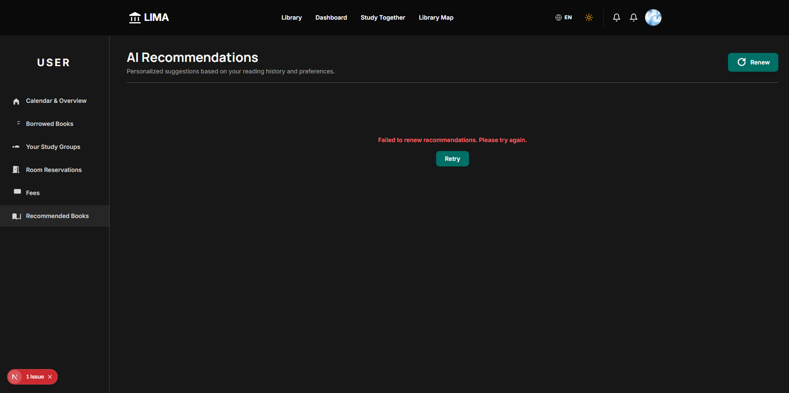
        
<em>Figure P-AIR-01-AF01 – Recommendation Error</em>

      </td>
    </tr>
  </tbody>
</table>

---

### UC-AIR-02: Reset AI Recommend

<table width="100%" border="1" cellpadding="8" cellspacing="0" style="border-collapse: collapse; font-family: Arial, sans-serif; font-size: 14px; border: 1px solid #d1d5db; margin-bottom: 20px;">
  <thead>
    <tr style="background-color: #1e3a8a; color: #ffffff;">
      <th colspan="2" style="text-align: left; padding: 12px; font-size: 16px;">
        Use Case: Reset AI Recommend
      </th>
    </tr>
  </thead>
  <tbody>
    <tr>
      <td width="22%" style="background-color: #f8fafc; font-weight: bold; vertical-align: top;">Use Case ID</td>
      <td style="vertical-align: top;"><strong>UC-AIR-02</strong></td>
    </tr>
    <tr>
      <td style="background-color: #f8fafc; font-weight: bold; vertical-align: top;">Brief Description</td>
      <td style="vertical-align: top;">
        Allows the user to clear their current recommendation cache and trigger the system's background engine to immediately recalculate and regenerate a fresh book recommendation list.
         <em>(Includes / Extends: <strong>Extends UC-AIR-01 (View Recommended Book) — extension point: Regenerating the displayed recommendation list.</strong>)</em>
      </td>
    </tr>
    <tr>
      <td style="background-color: #f8fafc; font-weight: bold; vertical-align: top;">Actor(s)</td>
      <td style="vertical-align: top;">User</td>
    </tr>
    <tr>
      <td style="background-color: #f8fafc; font-weight: bold; vertical-align: top;">Preconditions</td>
      <td style="vertical-align: top;">
        <ul style="margin: 0; padding-left: 20px; line-height: 1.5;">
          <li><strong>Workspace Context Active:</strong> The user is actively executing workspace visualization tasks within <code> UC-AIR-01</code>.</li>
        </ul>
      </td>
    </tr>
    <tr>
      <td style="background-color: #f8fafc; font-weight: bold; vertical-align: top;">Flow of Events (Basic Flow)</td>
      <td style="vertical-align: top;">
        <ol style="margin: 0; padding-left: 20px; line-height: 1.6;">
          <li><strong>[Actor Action]:</strong> While actively viewing the recommended book collection lists, the user selects the <code>Renew</code> buttons.</li>
          <li><strong>[System Response]:</strong> The system intercepts the request command payload and systematically invokes the AI Recommend Module .</li>
          <li><strong>[Data Processing]:</strong> The included AI Recommend Module processes the user's behaviors and evaluates a clean set of recommendations.</li>
          <li><strong>[Data Processing]:</strong> The system purges historical cache frames and overrides the active recommendation data array rows with the newly received listings.</li>
          <li><strong>[Display Result]:</strong> The system refreshes the client screen dashboard panel to render the fresh, updated recommended book list.</li>
        </ol>
      </td>
    </tr>
    <tr>
      <td style="background-color: #f8fafc; font-weight: bold; vertical-align: top;">Alternative / Exception Flows</td>
      <td style="vertical-align: top;">
        <ul style="margin: 0; padding-left: 20px; line-height: 1.5;">
          <li style="margin-bottom: 8px;">
            <strong>Core Module Execution Crash (Step 2):</strong> If the included AI Recommend Module fails to generate a new list due to model processing errors or connectivity breaks:
            <ol style="margin-top: 4px; margin-bottom: 4px; padding-left: 20px;">
              <li>The system aborts the data staging transaction loops.</li>
              <li>The system displays a transactional fallback error alert text block on screen.</li>
              <li>The system retains the previous recommendation list array properties intact within the active display container.</li>
            </ol>
            <strong>Postcondition (Alternative Flow):</strong> No structural changes commit against the user's current recommendation dataset; the user interface notifies the individual of the operational failure.
          </li>
        </ul>
      </td>
    </tr>
    <tr>
      <td style="background-color: #f8fafc; font-weight: bold; vertical-align: top;">Postconditions</td>
      <td style="vertical-align: top;">
        <ul style="margin: 0; padding-left: 20px;">
          <li><strong>Ledger Regeneration Complete:</strong> The user's recommendation data structures are successfully overwritten, cached, and updated across the display interface viewport.</li>
        </ul>
      </td>
    </tr>
    <tr>
      <td style="background-color: #f8fafc; font-weight: bold; vertical-align: top;">Special Requirements</td>
      <td style="vertical-align: top;">
        <ul style="margin: 0; padding-left: 20px;">
          <li><strong>API Rate Limiting Guards:</strong> To prevent heavy backend compute degradation, reset invocation requests must enforce strict rate-limiting caps to control repetitive sequential manual regenerations.</li>
          <li><strong>Candidate Non-Overlap Constraints:</strong> The freshly generated recommendation candidate array rows must be evaluated against the immediately preceding listing to prevent redundant content repetition.</li>
        </ul>
      </td>
    </tr>
    <tr>
      <td style="background-color: #f8fafc; font-weight: bold; vertical-align: top;">Extension Points</td>
      <td style="vertical-align: top;">
        None
      </td>
    </tr>
    <tr>
      <td style="background-color: #f8fafc; font-weight: bold; vertical-align: top;">Prototype Screen</td>
      <td style="vertical-align: top;">
        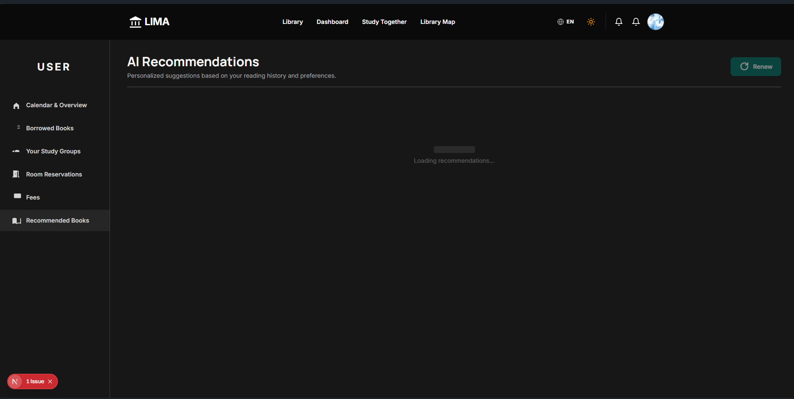
        
<em>Figure P-AIR-02-BF01 – Reset Recommendation Confirmation</em>

      </td>
    </tr>
  </tbody>
</table>

---

## VIII. Librarian

### Use case diagram

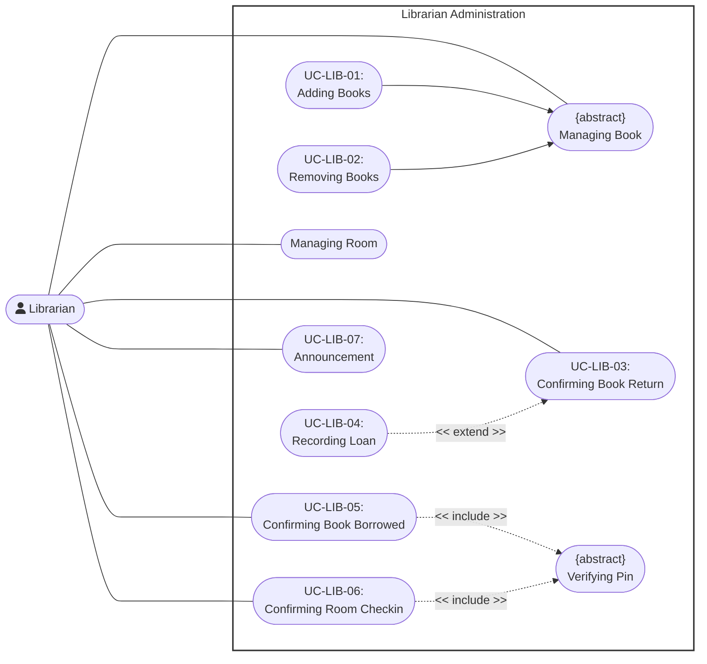
```mermaid
flowchart LR
 subgraph LibrarianAdministration["Librarian Administration"]
        UC1(["<center>{abstract}<br>Managing Book</center>"])
        UC2(["<center>UC-LIB-01:<br>Adding Books</center>"])
        UC3(["<center>UC-LIB-02:<br>Removing Books</center>"])
        UC4(["<center>UC-LIB-03:<br>Confirming Book Return</center>"])
        UC5(["<center>UC-LIB-04:<br>Recording Loan</center>"])
        UC6(["<center>Managing Room</center>"])
        UC7(["<center>{abstract}<br>Verifying Pin</center>"])
        UC8(["<center>UC-LIB-05:<br>Confirming Book Borrowed</center>"])
        UC9(["<center>UC-LIB-06:<br>Confirming Room Checkin</center>"])
        UC10(["<center>UC-LIB-07:<br>Announcement</center>"])
  end
    Librarian(["<center>fa:fa-user Librarian</center>"]) ======= LibrarianAdministration
    Librarian --- UC1 & UC6 & UC10 & UC8 & UC9 & UC4
    
    UC2 --> UC1
    UC3 --> UC1

    UC8 -. "<< include >>" .-> UC7
    UC9 -. "<< include >>" .-> UC7
    UC5 -. "<< extend >>" .-> UC4

    style LibrarianAdministration fill:#fff,stroke:#333,stroke-width:2px
    linkStyle 0 stroke:transparent
```

---
### UC-LIB-01: Adding Books

<table width="100%" border="1" cellpadding="8" cellspacing="0" style="border-collapse: collapse; font-family: Arial, sans-serif; font-size: 14px; border: 1px solid #d1d5db; margin-bottom: 20px;">
  <thead>
    <tr style="background-color: #1e3a8a; color: #ffffff;">
      <th colspan="2" style="text-align: left; padding: 12px; font-size: 16px;">
        Use Case: Adding Books
      </th>
    </tr>
  </thead>
  <tbody>
    <tr>
      <td width="22%" style="background-color: #f8fafc; font-weight: bold; vertical-align: top;">Use Case ID</td>
      <td style="vertical-align: top;"><strong>UC-LIB-01</strong></td>
    </tr>
    <tr>
      <td style="background-color: #f8fafc; font-weight: bold; vertical-align: top;">Brief Description</td>
      <td style="vertical-align: top;">
        Allows the Librarian to add a new book record to the library catalog.
      </td>
    </tr>
    <tr>
      <td style="background-color: #f8fafc; font-weight: bold; vertical-align: top;">Actor(s)</td>
      <td style="vertical-align: top;">Librarian</td>
    </tr>
    <tr>
      <td style="background-color: #f8fafc; font-weight: bold; vertical-align: top;">Preconditions</td>
      <td style="vertical-align: top;">
        <ul style="margin: 0; padding-left: 20px; line-height: 1.5;">
          <li><strong>Verified Authentication State:</strong> The Librarian has successfully authenticated.</li>
          <li><strong>Catalog Uniqueness Check:</strong> The book to be added does not already exist in the catalog.</li>
        </ul>
      </td>
    </tr>
    <tr>
      <td style="background-color: #f8fafc; font-weight: bold; vertical-align: top;">Flow of Events (Basic Flow)</td>
      <td style="vertical-align: top;">
        <ol style="margin: 0; padding-left: 20px; line-height: 1.6;">
          <li><strong>[Actor Action]:</strong> The Librarian selects the "Add Book" option.</li>
          <li><strong>[System Response]:</strong> The system displays the book entry form.</li>
          <li><strong>[Actor Action]:</strong> The Librarian enters the book's details, including title and author.</li>
          <li><strong>[Actor Action]:</strong> The Librarian submits the form.</li>
          <li><strong>[Data Processing]:</strong> The system validates the entered data and confirms the book is not already in the catalog.</li>
          <li><strong>[Data Processing]:</strong> The system stores the new book record.</li>
          <li><strong>[Display Result]:</strong> The system confirms the addition to the Librarian.</li>
        </ol>
      </td>
    </tr>
    <tr>
      <td style="background-color: #f8fafc; font-weight: bold; vertical-align: top;">Alternative / Exception Flows</td>
      <td style="vertical-align: top;">
        <ul style="margin: 0; padding-left: 20px; line-height: 1.5;">
          <li style="margin-bottom: 8px;">
            <strong>Invalid or Duplicate Data (Step 5):</strong> If the entered data is invalid or matches an existing catalog entry:
            <ol style="margin-top: 4px; margin-bottom: 4px; padding-left: 20px;">
              <li>The system rejects the submission.</li>
              <li>The system displays an error message and prompts the Librarian to correct the entry.</li>
            </ol>
            <strong>Postcondition (Alternative Flow):</strong> No new book record is created; the entry form remains open pending correction.
          </li>
        </ul>
      </td>
    </tr>
    <tr>
      <td style="background-color: #f8fafc; font-weight: bold; vertical-align: top;">Postconditions</td>
      <td style="vertical-align: top;">
        <ul style="margin: 0; padding-left: 20px;">
          <li><strong>Catalog Update:</strong> A new book record is stored in the catalog and becomes available for borrowing.</li>
        </ul>
      </td>
    </tr>
    <tr>
      <td style="background-color: #f8fafc; font-weight: bold; vertical-align: top;">Special Requirements</td>
      <td style="vertical-align: top;">
        <ul style="margin: 0; padding-left: 20px;">
          <li><strong>Catalog Uniqueness:</strong> Each book's identifying information must be unique within the catalog.</li>
        </ul>
      </td>
    </tr>
    <tr>
      <td style="background-color: #f8fafc; font-weight: bold; vertical-align: top;">Extension Points</td>
      <td style="vertical-align: top;">
        None
      </td>
    </tr>
    <tr>
      <td style="background-color: #f8fafc; font-weight: bold; vertical-align: top;">Prototype Screen</td>
      <td style="vertical-align: top;">
        
        
<em>Figure P-LIB-01-BF01 – Book Management</em>

        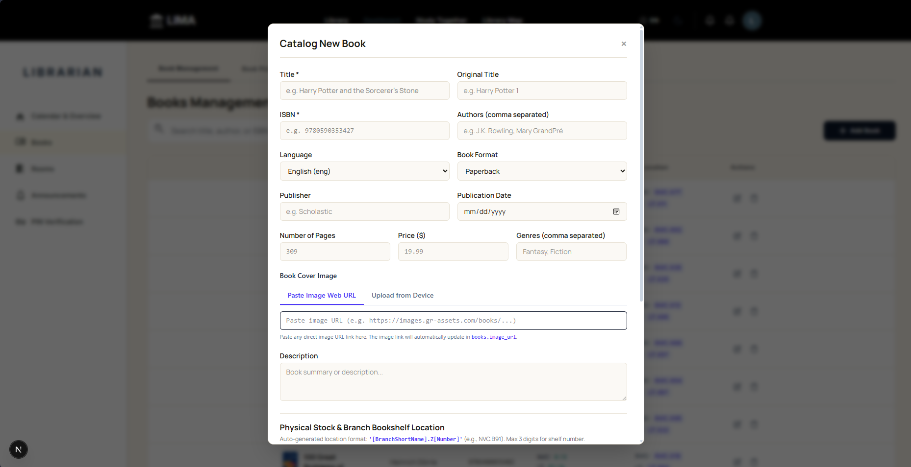
        
<em>Figure P-LIB-01-BF02 – Add Book Form</em>

      </td>
    </tr>
  </tbody>
</table>

---

### UC-LIB-02: Removing Books

<table width="100%" border="1" cellpadding="8" cellspacing="0" style="border-collapse: collapse; font-family: Arial, sans-serif; font-size: 14px; border: 1px solid #d1d5db; margin-bottom: 20px;">
  <thead>
    <tr style="background-color: #1e3a8a; color: #ffffff;">
      <th colspan="2" style="text-align: left; padding: 12px; font-size: 16px;">
        Use Case: Removing Books
      </th>
    </tr>
  </thead>
  <tbody>
    <tr>
      <td width="22%" style="background-color: #f8fafc; font-weight: bold; vertical-align: top;">Use Case ID</td>
      <td style="vertical-align: top;"><strong>UC-LIB-02</strong></td>
    </tr>
    <tr>
      <td style="background-color: #f8fafc; font-weight: bold; vertical-align: top;">Brief Description</td>
      <td style="vertical-align: top;">
        Allows the Librarian to remove an existing book record from the library catalog.
      </td>
    </tr>
    <tr>
      <td style="background-color: #f8fafc; font-weight: bold; vertical-align: top;">Actor(s)</td>
      <td style="vertical-align: top;">Librarian</td>
    </tr>
    <tr>
      <td style="background-color: #f8fafc; font-weight: bold; vertical-align: top;">Preconditions</td>
      <td style="vertical-align: top;">
        <ul style="margin: 0; padding-left: 20px; line-height: 1.5;">
          <li><strong>Verified Authentication State:</strong> The Librarian has successfully authenticated.</li>
          <li><strong>Existing Catalog Entry:</strong> The book to be removed exists in the catalog.</li>
        </ul>
      </td>
    </tr>
    <tr>
      <td style="background-color: #f8fafc; font-weight: bold; vertical-align: top;">Flow of Events (Basic Flow)</td>
      <td style="vertical-align: top;">
        <ol style="margin: 0; padding-left: 20px; line-height: 1.6;">
          <li><strong>[Actor Action]:</strong> The Librarian selects the "Remove Book" option.</li>
          <li><strong>[System Response]:</strong> The system displays a book search interface.</li>
          <li><strong>[Actor Action]:</strong> The Librarian searches for and selects the book to remove.</li>
          <li><strong>[Data Processing]:</strong> The system checks the book's current loan status.</li>
          <li><strong>[Actor Action]:</strong> The Librarian confirms the removal.</li>
          <li><strong>[Data Processing]:</strong> The system removes the book record.</li>
          <li><strong>[Display Result]:</strong> The system confirms the removal to the Librarian.</li>
        </ol>
      </td>
    </tr>
    <tr>
      <td style="background-color: #f8fafc; font-weight: bold; vertical-align: top;">Alternative / Exception Flows</td>
      <td style="vertical-align: top;">
        <ul style="margin: 0; padding-left: 20px; line-height: 1.5;">
          <li style="margin-bottom: 8px;">
            <strong>Book Currently on Loan (Step 4):</strong> If the selected book is currently on loan:
            <ol style="margin-top: 4px; margin-bottom: 4px; padding-left: 20px;">
              <li>The system prevents the removal.</li>
              <li>The system displays a warning to the Librarian.</li>
            </ol>
            <strong>Postcondition (Alternative Flow):</strong> No removal is performed; the book record remains unchanged.
          </li>
        </ul>
      </td>
    </tr>
    <tr>
      <td style="background-color: #f8fafc; font-weight: bold; vertical-align: top;">Postconditions</td>
      <td style="vertical-align: top;">
        <ul style="margin: 0; padding-left: 20px;">
          <li><strong>Catalog Update:</strong> The selected book record is removed from the catalog.</li>
        </ul>
      </td>
    </tr>
    <tr>
      <td style="background-color: #f8fafc; font-weight: bold; vertical-align: top;">Special Requirements</td>
      <td style="vertical-align: top;">
        <ul style="margin: 0; padding-left: 20px;">
          <li><strong>Loan Status Restriction:</strong> A book that is currently on loan cannot be removed until it is returned.</li>
        </ul>
      </td>
    </tr>
    <tr>
      <td style="background-color: #f8fafc; font-weight: bold; vertical-align: top;">Extension Points</td>
      <td style="vertical-align: top;">
        None
      </td>
    </tr>
    <tr>
      <td style="background-color: #f8fafc; font-weight: bold; vertical-align: top;">Prototype Screen</td>
      <td style="vertical-align: top;">
        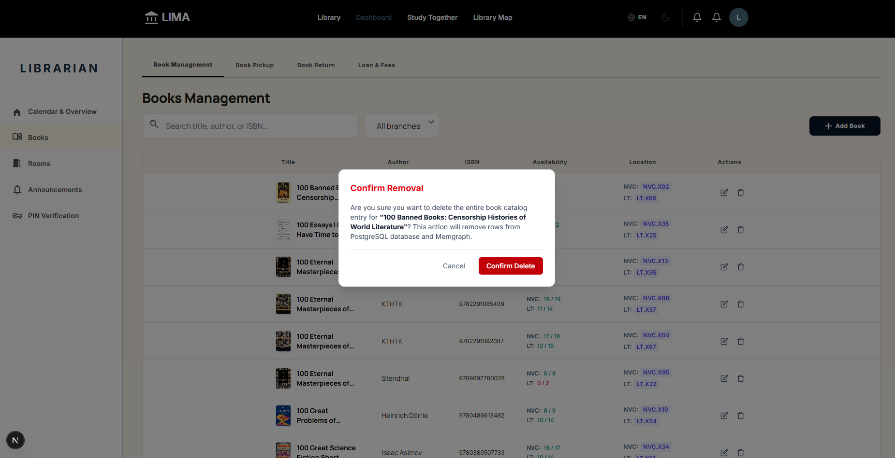
        
<em>Figure P-LIB-02-BF01 – Remove Book Confirmation</em>

      </td>
    </tr>
  </tbody>
</table>

---

### UC-LIB-03: Confirming Book Return

<table width="100%" border="1" cellpadding="8" cellspacing="0" style="border-collapse: collapse; font-family: Arial, sans-serif; font-size: 14px; border: 1px solid #d1d5db; margin-bottom: 20px;">
  <thead>
    <tr style="background-color: #1e3a8a; color: #ffffff;">
      <th colspan="2" style="text-align: left; padding: 12px; font-size: 16px;">
        Use Case: Confirming Book Return
      </th>
    </tr>
  </thead>
  <tbody>
    <tr>
      <td width="22%" style="background-color: #f8fafc; font-weight: bold; vertical-align: top;">Use Case ID</td>
      <td style="vertical-align: top;"><strong>UC-LIB-03</strong></td>
    </tr>
    <tr>
      <td style="background-color: #f8fafc; font-weight: bold; vertical-align: top;">Brief Description</td>
      <td style="vertical-align: top;">
        Allows the Librarian to confirm that a borrowed book has been physically returned, updating the associated loan record.
         <em>(Includes / Extends: <strong>Extended by Recording Loan (at Step 5).</strong>)</em>
      </td>
    </tr>
    <tr>
      <td style="background-color: #f8fafc; font-weight: bold; vertical-align: top;">Actor(s)</td>
      <td style="vertical-align: top;">Librarian</td>
    </tr>
    <tr>
      <td style="background-color: #f8fafc; font-weight: bold; vertical-align: top;">Preconditions</td>
      <td style="vertical-align: top;">
        <ul style="margin: 0; padding-left: 20px; line-height: 1.5;">
          <li><strong>Verified Authentication State:</strong> The Librarian has successfully authenticated.</li>
          <li><strong>Active Loan Record:</strong> An active loan record exists for the book being returned.</li>
        </ul>
      </td>
    </tr>
    <tr>
      <td style="background-color: #f8fafc; font-weight: bold; vertical-align: top;">Flow of Events (Basic Flow)</td>
      <td style="vertical-align: top;">
        <ol style="margin: 0; padding-left: 20px; line-height: 1.6;">
          <li><strong>[Actor Action]:</strong> The Librarian selects the "Confirm Book Return" option.</li>
          <li><strong>[System Response]:</strong> The system displays a search interface for active loans.</li>
          <li><strong>[Actor Action]:</strong> The Librarian selects or scans the book being returned.</li>
          <li><strong>[Data Processing]:</strong> The system marks the associated loan record as returned and updates the book's availability.</li>
          <li><strong>[System Response]:</strong> The system confirms the return and exposes the option to record a new loan for the returned book.</li>
        </ol>
      </td>
    </tr>
    <tr>
      <td style="background-color: #f8fafc; font-weight: bold; vertical-align: top;">Alternative / Exception Flows</td>
      <td style="vertical-align: top;">
        <ul style="margin: 0; padding-left: 20px; line-height: 1.5;">
          <li style="margin-bottom: 8px;">
            <strong>Record New Loan (Step 5):</strong> If the Librarian chooses to loan the returned book to another member immediately:
            <ol style="margin-top: 4px; margin-bottom: 4px; padding-left: 20px;">
              <li>The system invokes Recording Loan (UC-LIB-04).</li>
              <li>Control returns to this use case upon completion, and the use case ends.</li>
            </ol>
            <strong>Postcondition (Alternative Flow):</strong> Control passes to UC-LIB-04 (Recording Loan); the postconditions of that use case apply upon completion.
          </li>
        </ul>
      </td>
    </tr>
    <tr>
      <td style="background-color: #f8fafc; font-weight: bold; vertical-align: top;">Postconditions</td>
      <td style="vertical-align: top;">
        <ul style="margin: 0; padding-left: 20px;">
          <li><strong>Loan Closure:</strong> The loan record is marked as returned and the book is marked as available.</li>
        </ul>
      </td>
    </tr>
    <tr>
      <td style="background-color: #f8fafc; font-weight: bold; vertical-align: top;">Special Requirements</td>
      <td style="vertical-align: top;">
        <ul style="margin: 0; padding-left: 20px;">
          <li><strong>Extension Timing:</strong> The option to record a new loan is available only after the return has been confirmed; invoking it is optional.</li>
        </ul>
      </td>
    </tr>
    <tr>
      <td style="background-color: #f8fafc; font-weight: bold; vertical-align: top;">Extension Points</td>
      <td style="vertical-align: top;">
        <ul style="margin: 0; padding-left: 20px;">
          <li><strong>Recording Loan:</strong> Location inside event flow: After the return is confirmed (Step 5).</li>
        </ul>
      </td>
    </tr>
    <tr>
      <td style="background-color: #f8fafc; font-weight: bold; vertical-align: top;">Prototype Screen</td>
      <td style="vertical-align: top;">
        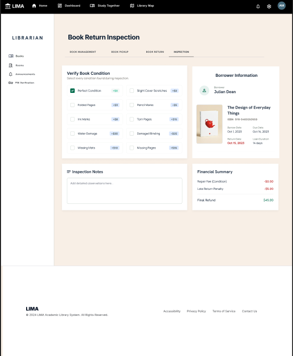
        
<em>Figure P-LIB-03-BF01 – Book Return Inspection</em>

        
        
<em>Figure P-LIB-03-BF02 – Confirm Book Return</em>

      </td>
    </tr>
  </tbody>
</table>

---

### UC-LIB-04: Recording Loan

<table width="100%" border="1" cellpadding="8" cellspacing="0" style="border-collapse: collapse; font-family: Arial, sans-serif; font-size: 14px; border: 1px solid #d1d5db; margin-bottom: 20px;">
  <thead>
    <tr style="background-color: #1e3a8a; color: #ffffff;">
      <th colspan="2" style="text-align: left; padding: 12px; font-size: 16px;">
        Use Case: Recording Loan
      </th>
    </tr>
  </thead>
  <tbody>
    <tr>
      <td width="22%" style="background-color: #f8fafc; font-weight: bold; vertical-align: top;">Use Case ID</td>
      <td style="vertical-align: top;"><strong>UC-LIB-04</strong></td>
    </tr>
    <tr>
      <td style="background-color: #f8fafc; font-weight: bold; vertical-align: top;">Brief Description</td>
      <td style="vertical-align: top;">
        Extends Confirming Book Return to let the Librarian record a new loan of a book to a member. It may also be initiated directly, outside the extension point.
         <em>(Includes / Extends: <strong>Extends UC-LIB-03 (Confirming Book Return) at Step 5 when the Librarian chooses to loan the returned book to another member.</strong>)</em>
      </td>
    </tr>
    <tr>
      <td style="background-color: #f8fafc; font-weight: bold; vertical-align: top;">Actor(s)</td>
      <td style="vertical-align: top;">Librarian</td>
    </tr>
    <tr>
      <td style="background-color: #f8fafc; font-weight: bold; vertical-align: top;">Preconditions</td>
      <td style="vertical-align: top;">
        <ul style="margin: 0; padding-left: 20px; line-height: 1.5;">
          <li><strong>Verified Authentication State:</strong> The Librarian has successfully authenticated.</li>
          <li><strong>Selected Book and Member:</strong> The selected book exists in the catalog and a member has been identified.</li>
        </ul>
      </td>
    </tr>
    <tr>
      <td style="background-color: #f8fafc; font-weight: bold; vertical-align: top;">Flow of Events (Basic Flow)</td>
      <td style="vertical-align: top;">
        <ol style="margin: 0; padding-left: 20px; line-height: 1.6;">
          <li><strong>[Actor Action]:</strong> The Librarian initiates loan recording, either directly or via the extension point of Confirming Book Return.</li>
          <li><strong>[Actor Action]:</strong> The Librarian enters or selects the member's identification.</li>
          <li><strong>[Actor Action]:</strong> The Librarian selects the book to be loaned.</li>
          <li><strong>[Data Processing]:</strong> The system validates the member's eligibility and the book's availability.</li>
          <li><strong>[Data Processing]:</strong> The system creates a new loan record and calculates the due date.</li>
          <li><strong>[Display Result]:</strong> The system confirms the recorded loan to the Librarian.</li>
        </ol>
      </td>
    </tr>
    <tr>
      <td style="background-color: #f8fafc; font-weight: bold; vertical-align: top;">Alternative / Exception Flows</td>
      <td style="vertical-align: top;">
        <ul style="margin: 0; padding-left: 20px; line-height: 1.5;">
          <li style="margin-bottom: 8px;">
            <strong>Member Ineligible (Step 4):</strong> If the member is not eligible to borrow:
            <ol style="margin-top: 4px; margin-bottom: 4px; padding-left: 20px;">
              <li>The system denies the loan.</li>
              <li>The system displays the reason to the Librarian.</li>
            </ol>
            <strong>Postcondition (Alternative Flow):</strong> No loan record is created.
          </li>
        </ul>
      </td>
    </tr>
    <tr>
      <td style="background-color: #f8fafc; font-weight: bold; vertical-align: top;">Postconditions</td>
      <td style="vertical-align: top;">
        <ul style="margin: 0; padding-left: 20px;">
          <li><strong>Loan Creation:</strong> A new loan record is created and the selected book is marked as on loan.</li>
        </ul>
      </td>
    </tr>
    <tr>
      <td style="background-color: #f8fafc; font-weight: bold; vertical-align: top;">Special Requirements</td>
      <td style="vertical-align: top;">
        <ul style="margin: 0; padding-left: 20px;">
          <li><strong>Due Date Calculation:</strong> The due date is calculated according to the library's loan policy.</li>
        </ul>
      </td>
    </tr>
    <tr>
      <td style="background-color: #f8fafc; font-weight: bold; vertical-align: top;">Extension Points</td>
      <td style="vertical-align: top;">
        None
      </td>
    </tr>
    <tr>
      <td style="background-color: #f8fafc; font-weight: bold; vertical-align: top;">Prototype Screen</td>
      <td style="vertical-align: top;">
        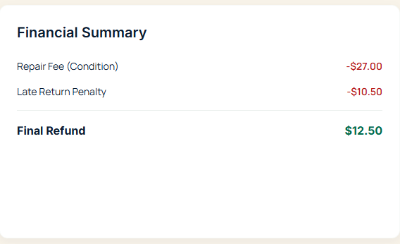
        
<em>Figure P-LIB-04-BF01 – Recording Loan Summary</em>

      </td>
    </tr>
  </tbody>
</table>

---

### UC-LIB-05: Confirming Book Borrowed

<table width="100%" border="1" cellpadding="8" cellspacing="0" style="border-collapse: collapse; font-family: Arial, sans-serif; font-size: 14px; border: 1px solid #d1d5db; margin-bottom: 20px;">
  <thead>
    <tr style="background-color: #1e3a8a; color: #ffffff;">
      <th colspan="2" style="text-align: left; padding: 12px; font-size: 16px;">
        Use Case: Confirming Book Borrowed
      </th>
    </tr>
  </thead>
  <tbody>
    <tr>
      <td width="22%" style="background-color: #f8fafc; font-weight: bold; vertical-align: top;">Use Case ID</td>
      <td style="vertical-align: top;"><strong>UC-LIB-05</strong></td>
    </tr>
    <tr>
      <td style="background-color: #f8fafc; font-weight: bold; vertical-align: top;">Brief Description</td>
      <td style="vertical-align: top;">
        Allows the Librarian to confirm a book borrowing transaction by verifying the borrowing member's PIN.
      </td>
    </tr>
    <tr>
      <td style="background-color: #f8fafc; font-weight: bold; vertical-align: top;">Actor(s)</td>
      <td style="vertical-align: top;">Librarian</td>
    </tr>
    <tr>
      <td style="background-color: #f8fafc; font-weight: bold; vertical-align: top;">Preconditions</td>
      <td style="vertical-align: top;">
        <ul style="margin: 0; padding-left: 20px; line-height: 1.5;">
          <li><strong>Verified Authentication State:</strong> The Librarian has successfully authenticated.</li>
          <li><strong>Pending Transaction:</strong> A book borrowing transaction is in progress and awaiting confirmation.</li>
        </ul>
      </td>
    </tr>
    <tr>
      <td style="background-color: #f8fafc; font-weight: bold; vertical-align: top;">Flow of Events (Basic Flow)</td>
      <td style="vertical-align: top;">
        <ol style="margin: 0; padding-left: 20px; line-height: 1.6;">
          <li><strong>[Actor Action]:</strong> The Librarian initiates confirmation of the book borrowing transaction.</li>
          <li><strong>[System Response]:</strong> The system prompts for the member's PIN.</li>
          <li><strong>[Actor Action]:</strong> The Librarian enters the member's PIN.</li>
          <li><strong>[Data Processing]:</strong> The system verifies the PIN against the member's record.</li>
          <li><strong>[Data Processing]:</strong> The system marks the transaction as confirmed and logs the confirmation.</li>
        </ol>
      </td>
    </tr>
    <tr>
      <td style="background-color: #f8fafc; font-weight: bold; vertical-align: top;">Alternative / Exception Flows</td>
      <td style="vertical-align: top;">
        <ul style="margin: 0; padding-left: 20px; line-height: 1.5;">
          <li style="margin-bottom: 8px;">
            <strong>Incorrect PIN (Step 4):</strong> If the entered PIN is invalid:
            <ol style="margin-top: 4px; margin-bottom: 4px; padding-left: 20px;">
              <li>The system displays an error message.</li>
              <li>The flow returns to Basic Flow step 2.</li>
            </ol>
            <strong>Postcondition (Alternative Flow):</strong> The borrowing transaction remains unconfirmed.
          </li>
        </ul>
      </td>
    </tr>
    <tr>
      <td style="background-color: #f8fafc; font-weight: bold; vertical-align: top;">Postconditions</td>
      <td style="vertical-align: top;">
        <ul style="margin: 0; padding-left: 20px;">
          <li><strong>Transaction Confirmation:</strong> The member's identity is verified and the borrowing transaction is confirmed.</li>
        </ul>
      </td>
    </tr>
    <tr>
      <td style="background-color: #f8fafc; font-weight: bold; vertical-align: top;">Special Requirements</td>
      <td style="vertical-align: top;">
        <ul style="margin: 0; padding-left: 20px;">
          <li><strong>Attempt Limiting:</strong> The system should limit the number of consecutive invalid PIN attempts.</li>
        </ul>
      </td>
    </tr>
    <tr>
      <td style="background-color: #f8fafc; font-weight: bold; vertical-align: top;">Extension Points</td>
      <td style="vertical-align: top;">
        None
      </td>
    </tr>
    <tr>
      <td style="background-color: #f8fafc; font-weight: bold; vertical-align: top;">Prototype Screen</td>
      <td style="vertical-align: top;">
        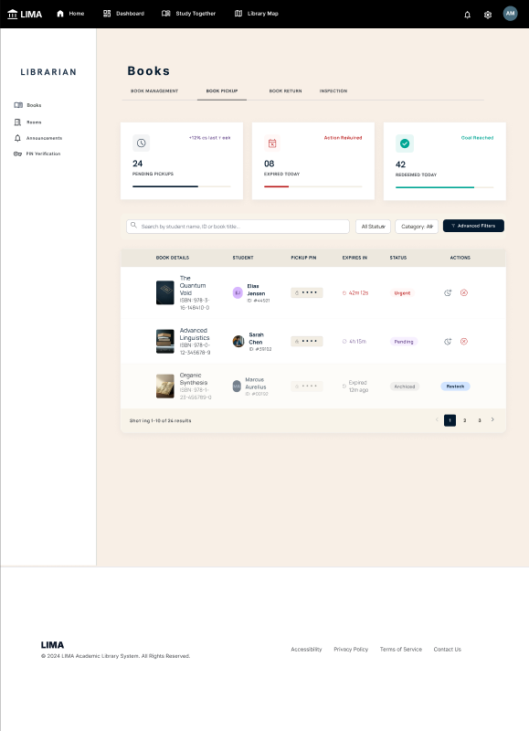
        
<em>Figure P-LIB-05-BF01 – Book Pickup Dashboard</em>

        
        
<em>Figure P-LIB-05-BF02 – Verify Borrowing PIN</em>

        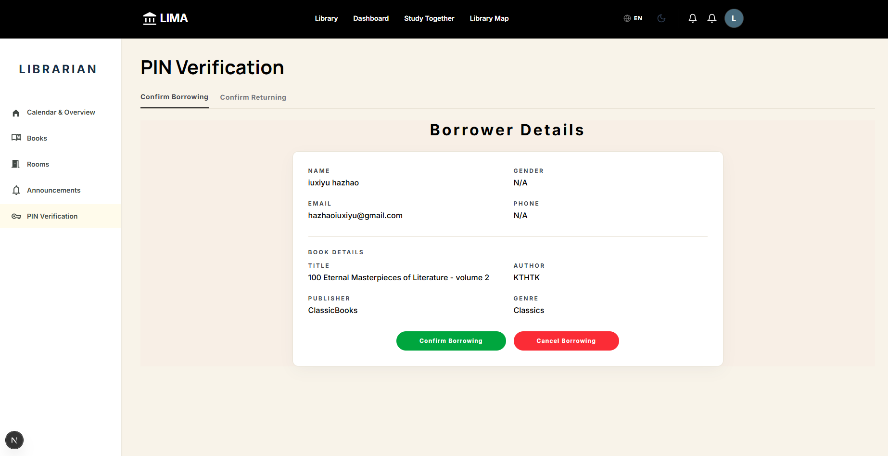
        
<em>Figure P-LIB-05-BF03 – Borrower Details</em>

        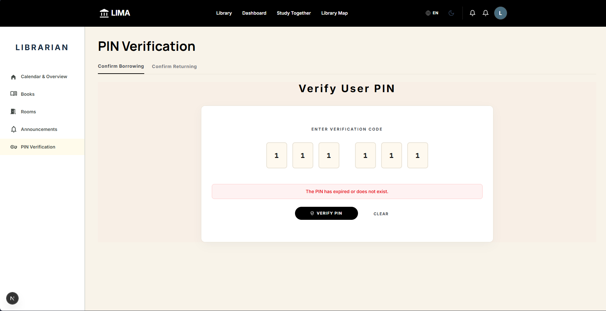
        
<em>Figure P-LIB-05-AF01 – Incorrect PIN</em>

      </td>
    </tr>
  </tbody>
</table>

---

### UC-LIB-06: Confirming Room Checkin

<table width="100%" border="1" cellpadding="8" cellspacing="0" style="border-collapse: collapse; font-family: Arial, sans-serif; font-size: 14px; border: 1px solid #d1d5db; margin-bottom: 20px;">
  <thead>
    <tr style="background-color: #1e3a8a; color: #ffffff;">
      <th colspan="2" style="text-align: left; padding: 12px; font-size: 16px;">
        Use Case: Confirming Room Checkin
      </th>
    </tr>
  </thead>
  <tbody>
    <tr>
      <td width="22%" style="background-color: #f8fafc; font-weight: bold; vertical-align: top;">Use Case ID</td>
      <td style="vertical-align: top;"><strong>UC-LIB-06</strong></td>
    </tr>
    <tr>
      <td style="background-color: #f8fafc; font-weight: bold; vertical-align: top;">Brief Description</td>
      <td style="vertical-align: top;">
        Allows the Librarian to confirm a member's check-in to a library room by verifying the member's PIN.
      </td>
    </tr>
    <tr>
      <td style="background-color: #f8fafc; font-weight: bold; vertical-align: top;">Actor(s)</td>
      <td style="vertical-align: top;">Librarian</td>
    </tr>
    <tr>
      <td style="background-color: #f8fafc; font-weight: bold; vertical-align: top;">Preconditions</td>
      <td style="vertical-align: top;">
        <ul style="margin: 0; padding-left: 20px; line-height: 1.5;">
          <li><strong>Verified Authentication State:</strong> The Librarian has successfully authenticated.</li>
          <li><strong>Pending Transaction:</strong> A room check-in transaction is in progress and awaiting confirmation.</li>
        </ul>
      </td>
    </tr>
    <tr>
      <td style="background-color: #f8fafc; font-weight: bold; vertical-align: top;">Flow of Events (Basic Flow)</td>
      <td style="vertical-align: top;">
        <ol style="margin: 0; padding-left: 20px; line-height: 1.6;">
          <li><strong>[Actor Action]:</strong> The Librarian initiates confirmation of the room check-in transaction.</li>
          <li><strong>[System Response]:</strong> The system prompts for the member's PIN.</li>
          <li><strong>[Actor Action]:</strong> The Librarian enters the member's PIN.</li>
          <li><strong>[Data Processing]:</strong> The system verifies the PIN against the member's record.</li>
          <li><strong>[Data Processing]:</strong> The system marks the member as checked into the room and logs the confirmation.</li>
        </ol>
      </td>
    </tr>
    <tr>
      <td style="background-color: #f8fafc; font-weight: bold; vertical-align: top;">Alternative / Exception Flows</td>
      <td style="vertical-align: top;">
        <ul style="margin: 0; padding-left: 20px; line-height: 1.5;">
          <li style="margin-bottom: 8px;">
            <strong>Incorrect PIN (Step 4):</strong> If the entered PIN is invalid:
            <ol style="margin-top: 4px; margin-bottom: 4px; padding-left: 20px;">
              <li>The system displays an error message.</li>
              <li>The flow returns to Basic Flow step 2.</li>
            </ol>
            <strong>Postcondition (Alternative Flow):</strong> The room check-in remains unconfirmed.
          </li>
        </ul>
      </td>
    </tr>
    <tr>
      <td style="background-color: #f8fafc; font-weight: bold; vertical-align: top;">Postconditions</td>
      <td style="vertical-align: top;">
        <ul style="margin: 0; padding-left: 20px;">
          <li><strong>Transaction Confirmation:</strong> The member's identity is verified and the member is confirmed as checked into the room.</li>
        </ul>
      </td>
    </tr>
    <tr>
      <td style="background-color: #f8fafc; font-weight: bold; vertical-align: top;">Special Requirements</td>
      <td style="vertical-align: top;">
        <ul style="margin: 0; padding-left: 20px;">
          <li><strong>Attempt Limiting:</strong> The system should limit the number of consecutive invalid PIN attempts.</li>
        </ul>
      </td>
    </tr>
    <tr>
      <td style="background-color: #f8fafc; font-weight: bold; vertical-align: top;">Extension Points</td>
      <td style="vertical-align: top;">
        None
      </td>
    </tr>
    <tr>
      <td style="background-color: #f8fafc; font-weight: bold; vertical-align: top;">Prototype Screen</td>
      <td style="vertical-align: top;">
        
        
<em>Figure P-LIB-06-BF01 – Room Reservations</em>

      </td>
    </tr>
  </tbody>
</table>

---

### UC-LIB-07: Announcement

<table width="100%" border="1" cellpadding="8" cellspacing="0" style="border-collapse: collapse; font-family: Arial, sans-serif; font-size: 14px; border: 1px solid #d1d5db; margin-bottom: 20px;">
  <thead>
    <tr style="background-color: #1e3a8a; color: #ffffff;">
      <th colspan="2" style="text-align: left; padding: 12px; font-size: 16px;">
        Use Case: Announcement
      </th>
    </tr>
  </thead>
  <tbody>
    <tr>
      <td width="22%" style="background-color: #f8fafc; font-weight: bold; vertical-align: top;">Use Case ID</td>
      <td style="vertical-align: top;"><strong>UC-LIB-07</strong></td>
    </tr>
    <tr>
      <td style="background-color: #f8fafc; font-weight: bold; vertical-align: top;">Brief Description</td>
      <td style="vertical-align: top;">
        Allows the Librarian to create and publish an announcement for library members.
      </td>
    </tr>
    <tr>
      <td style="background-color: #f8fafc; font-weight: bold; vertical-align: top;">Actor(s)</td>
      <td style="vertical-align: top;">Librarian</td>
    </tr>
    <tr>
      <td style="background-color: #f8fafc; font-weight: bold; vertical-align: top;">Preconditions</td>
      <td style="vertical-align: top;">
        <ul style="margin: 0; padding-left: 20px; line-height: 1.5;">
          <li><strong>Verified Authentication State:</strong> The Librarian has successfully authenticated.</li>
        </ul>
      </td>
    </tr>
    <tr>
      <td style="background-color: #f8fafc; font-weight: bold; vertical-align: top;">Flow of Events (Basic Flow)</td>
      <td style="vertical-align: top;">
        <ol style="margin: 0; padding-left: 20px; line-height: 1.6;">
          <li><strong>[Actor Action]:</strong> The Librarian selects the "Create Announcement" option.</li>
          <li><strong>[System Response]:</strong> The system displays the announcement entry form.</li>
          <li><strong>[Actor Action]:</strong> The Librarian enters the announcement details.</li>
          <li><strong>[Actor Action]:</strong> The Librarian submits the announcement.</li>
          <li><strong>[Data Processing]:</strong> The system validates the content and publishes the announcement.</li>
          <li><strong>[Display Result]:</strong> The system confirms the publication to the Librarian.</li>
        </ol>
      </td>
    </tr>
    <tr>
      <td style="background-color: #f8fafc; font-weight: bold; vertical-align: top;">Alternative / Exception Flows</td>
      <td style="vertical-align: top;">
        <ul style="margin: 0; padding-left: 20px; line-height: 1.5;">
          <li style="margin-bottom: 8px;">
            <strong>Invalid Content (Step 5):</strong> If required fields are missing or the content is invalid:
            <ol style="margin-top: 4px; margin-bottom: 4px; padding-left: 20px;">
              <li>The system rejects the submission.</li>
              <li>The system displays a validation error and prompts the Librarian to correct the entry.</li>
            </ol>
            <strong>Postcondition (Alternative Flow):</strong> No announcement is published; the entry form remains open pending correction.
          </li>
        </ul>
      </td>
    </tr>
    <tr>
      <td style="background-color: #f8fafc; font-weight: bold; vertical-align: top;">Postconditions</td>
      <td style="vertical-align: top;">
        <ul style="margin: 0; padding-left: 20px;">
          <li><strong>Publication:</strong> The announcement is published and stored in the system.</li>
        </ul>
      </td>
    </tr>
    <tr>
      <td style="background-color: #f8fafc; font-weight: bold; vertical-align: top;">Special Requirements</td>
      <td style="vertical-align: top;">
        <ul style="margin: 0; padding-left: 20px;">
          <li><strong>Content Validation:</strong> Required fields, such as title and content, must be validated before publication.</li>
        </ul>
      </td>
    </tr>
    <tr>
      <td style="background-color: #f8fafc; font-weight: bold; vertical-align: top;">Extension Points</td>
      <td style="vertical-align: top;">
        None
      </td>
    </tr>
    <tr>
      <td style="background-color: #f8fafc; font-weight: bold; vertical-align: top;">Prototype Screen</td>
      <td style="vertical-align: top;">
        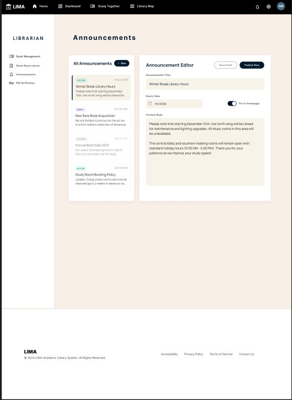
        
<em>Figure P-LIB-07-BF01 – Announcement Management</em>

        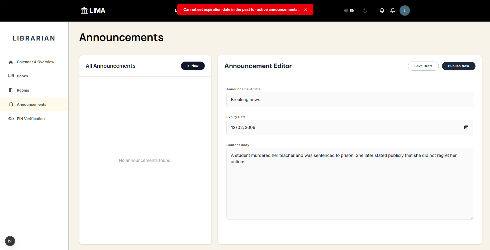
        
<em>Figure P-LIB-07-AF01 – Invalid Announcement Content</em>

      </td>
    </tr>
  </tbody>
</table>

---

## IX. Admin

### Use case diagram

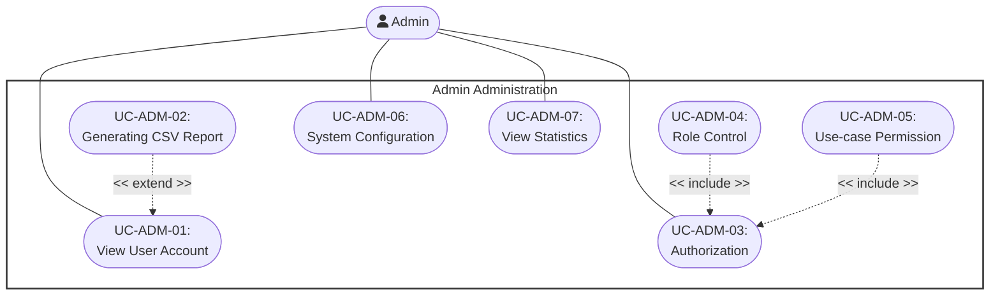
```mermaid
flowchart TD
 subgraph AdminAdministration["Admin Administration"]
        UC1(["<center>UC-ADM-01:<br>View User Account</center>"])
        UC2(["<center>UC-ADM-02:<br>Generating CSV Report</center>"])
        UC3(["<center>UC-ADM-03:<br>Authorization</center>"])
        UC4(["<center>UC-ADM-04:<br>Role Control</center>"])
        UC5(["<center>UC-ADM-05:<br>Use-case Permission</center>"])
        UC6(["<center>UC-ADM-06:<br>System Configuration</center>"])
        UC7(["<center>UC-ADM-07:<br>View Statistics</center>"])
  end
    Admin(["<center>fa:fa-user Admin</center>"]) ~~~~ AdminAdministration
    Admin --- UC1 & UC3 & UC6 & UC7
    UC2 -. "<< extend >>" .-> UC1
    UC4 -. "<< include >>" .-> UC3
    UC5 -. "<< include >>" .-> UC3

    style AdminAdministration fill:#fff,stroke:#333,stroke-width:2px
```

---

### UC-ADM-01: View User Account

<table width="100%" border="1" cellpadding="8" cellspacing="0" style="border-collapse: collapse; font-family: Arial, sans-serif; font-size: 14px; border: 1px solid #d1d5db; margin-bottom: 20px;">
  <thead>
    <tr style="background-color: #1e3a8a; color: #ffffff;">
      <th colspan="2" style="text-align: left; padding: 12px; font-size: 16px;">
        Use Case: View User Account
      </th>
    </tr>
  </thead>
  <tbody>
    <tr>
      <td width="22%" style="background-color: #f8fafc; font-weight: bold; vertical-align: top;">Use Case ID</td>
      <td style="vertical-align: top;"><strong>UC-ADM-01</strong></td>
    </tr>
    <tr>
      <td style="background-color: #f8fafc; font-weight: bold; vertical-align: top;">Brief Description</td>
      <td style="vertical-align: top;">
        Allows the Admin to browse the list of registered user accounts and inspect the details of a selected account.
         <em>(Includes / Extends: <strong>Extended by Generating CSV Report (UC-ADM-02) at Step 5.</strong>)</em>
      </td>
    </tr>
    <tr>
      <td style="background-color: #f8fafc; font-weight: bold; vertical-align: top;">Actor(s)</td>
      <td style="vertical-align: top;">Admin</td>
    </tr>
    <tr>
      <td style="background-color: #f8fafc; font-weight: bold; vertical-align: top;">Preconditions</td>
      <td style="vertical-align: top;">
        <ul style="margin: 0; padding-left: 20px; line-height: 1.5;">
          <li><strong>Verified Authentication State:</strong> The Admin is authenticated.</li>
        </ul>
      </td>
    </tr>
    <tr>
      <td style="background-color: #f8fafc; font-weight: bold; vertical-align: top;">Flow of Events (Basic Flow)</td>
      <td style="vertical-align: top;">
        <ol style="margin: 0; padding-left: 20px; line-height: 1.6;">
          <li><strong>[Actor Action]:</strong> The Admin navigates to the User Account section.</li>
          <li><strong>[Data Processing]:</strong> The system retrieves the list of registered user accounts.</li>
          <li><strong>[Display Result]:</strong> The system displays the list of user accounts to the Admin.</li>
          <li><strong>[Actor Action]:</strong> The Admin selects a specific user account to inspect.</li>
          <li><strong>[Display Result]:</strong> The system retrieves and displays the detailed information of the selected account.</li>
        </ol>
      </td>
    </tr>
    <tr>
      <td style="background-color: #f8fafc; font-weight: bold; vertical-align: top;">Alternative / Exception Flows</td>
      <td style="vertical-align: top;">
        <ul style="margin: 0; padding-left: 20px; line-height: 1.5;">
          <li style="margin-bottom: 8px;">
            <strong>No User Accounts Exist (Step 2):</strong> If no user accounts exist in the system:
            <ol style="margin-top: 4px; margin-bottom: 4px; padding-left: 20px;">
              <li>The system displays an empty-state message instead of a list.</li>
            </ol>
            <strong>Postcondition (Alternative Flow):</strong> No account data is displayed; system state remains unchanged.
          </li>
          <li style="margin-bottom: 8px;">
            <strong>Selected Account No Longer Exists (Step 4):</strong> If the selected account no longer exists (e.g., it was deleted):
            <ol style="margin-top: 4px; margin-bottom: 4px; padding-left: 20px;">
              <li>The system displays an error message.</li>
              <li>The system returns the Admin to the account list; the Basic Flow resumes at step 3.</li>
            </ol>
            <strong>Postcondition (Alternative Flow):</strong> No detail view is rendered; the Admin remains on the account list.
          </li>
        </ul>
      </td>
    </tr>
    <tr>
      <td style="background-color: #f8fafc; font-weight: bold; vertical-align: top;">Postconditions</td>
      <td style="vertical-align: top;">
        <ul style="margin: 0; padding-left: 20px;">
          <li><strong>Account Details Displayed:</strong> The requested user account information is displayed to the Admin; no account data is modified.</li>
        </ul>
      </td>
    </tr>
    <tr>
      <td style="background-color: #f8fafc; font-weight: bold; vertical-align: top;">Special Requirements</td>
      <td style="vertical-align: top;">
        <ul style="margin: 0; padding-left: 20px;">
          <li><strong>Read-Only Access:</strong> This use case is strictly read-only; it must not permit modification of account data.</li>
          <li><strong>Sensitive Field Masking:</strong> Sensitive account fields (e.g., stored credentials) must not be exposed in the displayed details.</li>
        </ul>
      </td>
    </tr>
    <tr>
      <td style="background-color: #f8fafc; font-weight: bold; vertical-align: top;">Extension Points</td>
      <td style="vertical-align: top;">
        <ul style="margin: 0; padding-left: 20px;">
          <li><strong>Generating CSV Report:</strong> Location inside event flow: While account data is currently displayed (after Step 5).</li>
        </ul>
      </td>
    </tr>
    <tr>
      <td style="background-color: #f8fafc; font-weight: bold; vertical-align: top;">Prototype Screen</td>
      <td style="vertical-align: top;">
        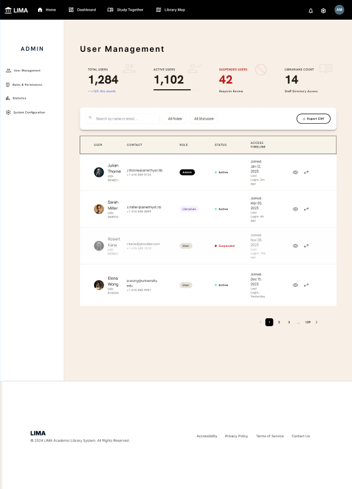
        
<em>Figure P-ADM-01-BF01 – User Management</em>

      </td>
    </tr>
  </tbody>
</table>

---

### UC-ADM-02: Generating CSV Report

<table width="100%" border="1" cellpadding="8" cellspacing="0" style="border-collapse: collapse; font-family: Arial, sans-serif; font-size: 14px; border: 1px solid #d1d5db; margin-bottom: 20px;">
  <thead>
    <tr style="background-color: #1e3a8a; color: #ffffff;">
      <th colspan="2" style="text-align: left; padding: 12px; font-size: 16px;">
        Use Case: Generating CSV Report
      </th>
    </tr>
  </thead>
  <tbody>
    <tr>
      <td width="22%" style="background-color: #f8fafc; font-weight: bold; vertical-align: top;">Use Case ID</td>
      <td style="vertical-align: top;"><strong>UC-ADM-02</strong></td>
    </tr>
    <tr>
      <td style="background-color: #f8fafc; font-weight: bold; vertical-align: top;">Brief Description</td>
      <td style="vertical-align: top;">
        Extends the account view to let the Admin export the currently displayed user account data into a downloadable CSV file.
         <em>(Includes / Extends: <strong>Extends View User Account (UC-ADM-01) — extension point: the Admin selects "Generate CSV Report" while account data is displayed.</strong>)</em>
      </td>
    </tr>
    <tr>
      <td style="background-color: #f8fafc; font-weight: bold; vertical-align: top;">Actor(s)</td>
      <td style="vertical-align: top;">Admin</td>
    </tr>
    <tr>
      <td style="background-color: #f8fafc; font-weight: bold; vertical-align: top;">Preconditions</td>
      <td style="vertical-align: top;">
        <ul style="margin: 0; padding-left: 20px; line-height: 1.5;">
          <li><strong>Active Base Context Display:</strong> The base use case <code>View User Account (UC-ADM-01)</code> must be currently active and displaying account data.</li>
        </ul>
      </td>
    </tr>
    <tr>
      <td style="background-color: #f8fafc; font-weight: bold; vertical-align: top;">Flow of Events (Basic Flow)</td>
      <td style="vertical-align: top;">
        <ol style="margin: 0; padding-left: 20px; line-height: 1.6;">
          <li><strong>[Actor Action]:</strong> While viewing user account data, the Admin selects the "Generate CSV Report" option.</li>
          <li><strong>[Data Processing]:</strong> The system compiles the currently displayed user account data into CSV format.</li>
          <li><strong>[Data Processing]:</strong> The system generates the CSV file.</li>
          <li><strong>[System Response]:</strong> The system prompts the Admin to download the generated file.</li>
          <li><strong>[Data Processing]:</strong> The system initiates the download.</li>
          <li><strong>[Display Result]:</strong> The system delivers the CSV file to the Admin.</li>
        </ol>
      </td>
    </tr>
    <tr>
      <td style="background-color: #f8fafc; font-weight: bold; vertical-align: top;">Alternative / Exception Flows</td>
      <td style="vertical-align: top;">
        <ul style="margin: 0; padding-left: 20px; line-height: 1.5;">
          <li style="margin-bottom: 8px;">
            <strong>No Data Available to Export (Step 2):</strong> If there is no data available to export:
            <ol style="margin-top: 4px; margin-bottom: 4px; padding-left: 20px;">
              <li>The system notifies the Admin that no report can be generated.</li>
            </ol>
            <strong>Postcondition (Alternative Flow):</strong> No CSV file is generated; the Admin remains on the current view.
          </li>
          <li style="margin-bottom: 8px;">
            <strong>File Generation Fails (Step 3):</strong> If the system encounters an internal error while generating the file:
            <ol style="margin-top: 4px; margin-bottom: 4px; padding-left: 20px;">
              <li>The system displays an error message; no file is produced.</li>
            </ol>
            <strong>Postcondition (Alternative Flow):</strong> No CSV file is produced; the Admin is notified of the failure.
          </li>
        </ul>
      </td>
    </tr>
    <tr>
      <td style="background-color: #f8fafc; font-weight: bold; vertical-align: top;">Postconditions</td>
      <td style="vertical-align: top;">
        <ul style="margin: 0; padding-left: 20px;">
          <li><strong>CSV File Delivered:</strong> A CSV file containing the requested user account data is generated and made available to the Admin.</li>
        </ul>
      </td>
    </tr>
    <tr>
      <td style="background-color: #f8fafc; font-weight: bold; vertical-align: top;">Special Requirements</td>
      <td style="vertical-align: top;">
        <ul style="margin: 0; padding-left: 20px;">
          <li><strong>Sensitive Field Exclusion:</strong> Exported CSV files must exclude sensitive fields such as passwords or authentication tokens.</li>
          <li><strong>Encoding Standard:</strong> The CSV file must use a standard, widely-compatible encoding (e.g., UTF-8).</li>
        </ul>
      </td>
    </tr>
    <tr>
      <td style="background-color: #f8fafc; font-weight: bold; vertical-align: top;">Extension Points</td>
      <td style="vertical-align: top;">
        None
      </td>
    </tr>
    <tr>
      <td style="background-color: #f8fafc; font-weight: bold; vertical-align: top;">Prototype Screen</td>
      <td style="vertical-align: top;">
        
        
<em>Figure P-ADM-01-BF01 – User Management (reused as the CSV report entry screen)</em>

      </td>
    </tr>
  </tbody>
</table>

---

### UC-ADM-03: Authorization

<table width="100%" border="1" cellpadding="8" cellspacing="0" style="border-collapse: collapse; font-family: Arial, sans-serif; font-size: 14px; border: 1px solid #d1d5db; margin-bottom: 20px;">
  <thead>
    <tr style="background-color: #1e3a8a; color: #ffffff;">
      <th colspan="2" style="text-align: left; padding: 12px; font-size: 16px;">
        Use Case: Authorization
      </th>
    </tr>
  </thead>
  <tbody>
    <tr>
      <td width="22%" style="background-color: #f8fafc; font-weight: bold; vertical-align: top;">Use Case ID</td>
      <td style="vertical-align: top;"><strong>UC-ADM-03</strong></td>
    </tr>
    <tr>
      <td style="background-color: #f8fafc; font-weight: bold; vertical-align: top;">Brief Description</td>
      <td style="vertical-align: top;">
        Verifies the Admin's identity and permission to perform a requested administrative function. Invoked internally by other use cases.
         <em>(Includes / Extends: <strong>Included by Role Control (UC-ADM-04) and Use-case Permission (UC-ADM-05).</strong>)</em>
      </td>
    </tr>
    <tr>
      <td style="background-color: #f8fafc; font-weight: bold; vertical-align: top;">Actor(s)</td>
      <td style="vertical-align: top;">Admin</td>
    </tr>
    <tr>
      <td style="background-color: #f8fafc; font-weight: bold; vertical-align: top;">Preconditions</td>
      <td style="vertical-align: top;">
        <ul style="margin: 0; padding-left: 20px; line-height: 1.5;">
          <li><strong>Valid Credentials or Session:</strong> The Admin possesses valid credentials or an active session.</li>
        </ul>
      </td>
    </tr>
    <tr>
      <td style="background-color: #f8fafc; font-weight: bold; vertical-align: top;">Flow of Events (Basic Flow)</td>
      <td style="vertical-align: top;">
        <ol style="margin: 0; padding-left: 20px; line-height: 1.6;">
          <li><strong>[Actor Action]:</strong> The invoking use case requests authorization.</li>
          <li><strong>[Data Processing]:</strong> The system validates the Admin's credentials or session token.</li>
          <li><strong>[Data Processing]:</strong> The system retrieves the Admin's assigned roles and permissions.</li>
          <li><strong>[Data Processing]:</strong> The system evaluates whether the Admin is authorized for the requested function.</li>
          <li><strong>[System Response]:</strong> The system returns the authorization result to the invoking use case.</li>
        </ol>
      </td>
    </tr>
    <tr>
      <td style="background-color: #f8fafc; font-weight: bold; vertical-align: top;">Alternative / Exception Flows</td>
      <td style="vertical-align: top;">
        <ul style="margin: 0; padding-left: 20px; line-height: 1.5;">
          <li style="margin-bottom: 8px;">
            <strong>Invalid Credentials or Session (Step 2):</strong> If the credentials or session are invalid:
            <ol style="margin-top: 4px; margin-bottom: 4px; padding-left: 20px;">
              <li>The system denies access and displays an authentication error.</li>
              <li>The failed attempt is logged.</li>
            </ol>
            <strong>Postcondition (Alternative Flow):</strong> Access is denied; the failed attempt is logged.
          </li>
          <li style="margin-bottom: 8px;">
            <strong>Insufficient Permission (Step 4):</strong> If the Admin lacks sufficient permission for the requested function:
            <ol style="margin-top: 4px; margin-bottom: 4px; padding-left: 20px;">
              <li>The system denies access and displays an authorization error.</li>
              <li>The attempt is logged.</li>
            </ol>
            <strong>Postcondition (Alternative Flow):</strong> Access to the requested function is denied; the attempt is logged.
          </li>
        </ul>
      </td>
    </tr>
    <tr>
      <td style="background-color: #f8fafc; font-weight: bold; vertical-align: top;">Postconditions</td>
      <td style="vertical-align: top;">
        <ul style="margin: 0; padding-left: 20px;">
          <li><strong>Authorization Result Determined:</strong> The Admin's authorization status has been determined and returned to the invoking use case.</li>
        </ul>
      </td>
    </tr>
    <tr>
      <td style="background-color: #f8fafc; font-weight: bold; vertical-align: top;">Special Requirements</td>
      <td style="vertical-align: top;">
        <ul style="margin: 0; padding-left: 20px;">
          <li><strong>Secure Credential Validation:</strong> Credential validation must be performed securely.</li>
          <li><strong>Audit Logging:</strong> Failed authorization attempts must be logged for security auditing.</li>
          <li><strong>Session Timeout Policy:</strong> Sessions must be subject to a defined timeout policy.</li>
        </ul>
      </td>
    </tr>
    <tr>
      <td style="background-color: #f8fafc; font-weight: bold; vertical-align: top;">Extension Points</td>
      <td style="vertical-align: top;">
        None
      </td>
    </tr>
    <tr>
      <td style="background-color: #f8fafc; font-weight: bold; vertical-align: top;">Prototype Screen</td>
      <td style="vertical-align: top;">
        
        
<em>Figure P-ADM-04-BF01 – Roles and Permissions (reused for authorization)</em>

      </td>
    </tr>
  </tbody>
</table>

---

### UC-ADM-04: Role Control

<table width="100%" border="1" cellpadding="8" cellspacing="0" style="border-collapse: collapse; font-family: Arial, sans-serif; font-size: 14px; border: 1px solid #d1d5db; margin-bottom: 20px;">
  <thead>
    <tr style="background-color: #1e3a8a; color: #ffffff;">
      <th colspan="2" style="text-align: left; padding: 12px; font-size: 16px;">
        Use Case: Role Control
      </th>
    </tr>
  </thead>
  <tbody>
    <tr>
      <td width="22%" style="background-color: #f8fafc; font-weight: bold; vertical-align: top;">Use Case ID</td>
      <td style="vertical-align: top;"><strong>UC-ADM-04</strong></td>
    </tr>
    <tr>
      <td style="background-color: #f8fafc; font-weight: bold; vertical-align: top;">Brief Description</td>
      <td style="vertical-align: top;">
        Allows the Admin to create, modify, and delete roles within the system.
         <em>(Includes / Extends: <strong>Includes Authorization (UC-ADM-03).</strong>)</em>
      </td>
    </tr>
    <tr>
      <td style="background-color: #f8fafc; font-weight: bold; vertical-align: top;">Actor(s)</td>
      <td style="vertical-align: top;">Admin</td>
    </tr>
    <tr>
      <td style="background-color: #f8fafc; font-weight: bold; vertical-align: top;">Preconditions</td>
      <td style="vertical-align: top;">
        <ul style="margin: 0; padding-left: 20px; line-height: 1.5;">
          <li><strong>Verified Authentication State:</strong> The Admin is authenticated.</li>
        </ul>
      </td>
    </tr>
    <tr>
      <td style="background-color: #f8fafc; font-weight: bold; vertical-align: top;">Flow of Events (Basic Flow)</td>
      <td style="vertical-align: top;">
        <ol style="margin: 0; padding-left: 20px; line-height: 1.6;">
          <li><strong>[Actor Action]:</strong> The Admin navigates to the Role Control section.</li>
          <li><strong>[Data Processing]:</strong> The system invokes <code>Authorization (UC-ADM-03)</code> to verify the Admin's permission to manage roles.</li>
          <li><strong>[Display Result]:</strong> Upon successful authorization, the system displays the list of existing roles.</li>
          <li><strong>[Actor Action]:</strong> The Admin creates, edits, or deletes a role.</li>
          <li><strong>[Data Processing]:</strong> The system validates the submitted role data.</li>
          <li><strong>[Data Processing]:</strong> The system saves the changes and confirms the update to the Admin.</li>
        </ol>
      </td>
    </tr>
    <tr>
      <td style="background-color: #f8fafc; font-weight: bold; vertical-align: top;">Alternative / Exception Flows</td>
      <td style="vertical-align: top;">
        <ul style="margin: 0; padding-left: 20px; line-height: 1.5;">
          <li style="margin-bottom: 8px;">
            <strong>Authorization Fails (Step 2):</strong> If <code>Authorization (UC-ADM-03)</code> denies access:
            <ol style="margin-top: 4px; margin-bottom: 4px; padding-left: 20px;">
              <li>The use case terminates.</li>
            </ol>
            <strong>Postcondition (Alternative Flow):</strong> No role data is displayed or modified; access is denied.
          </li>
          <li style="margin-bottom: 8px;">
            <strong>Validation Fails (Step 5):</strong> If the submitted data is invalid (e.g., duplicate role name):
            <ol style="margin-top: 4px; margin-bottom: 4px; padding-left: 20px;">
              <li>The system displays an error and prompts the Admin for correction.</li>
              <li>The Admin resubmits corrected data; the Basic Flow resumes at step 5.</li>
            </ol>
            <strong>Postcondition (Alternative Flow):</strong> No role changes are saved; the Admin is prompted to correct the input.
          </li>
        </ul>
      </td>
    </tr>
    <tr>
      <td style="background-color: #f8fafc; font-weight: bold; vertical-align: top;">Postconditions</td>
      <td style="vertical-align: top;">
        <ul style="margin: 0; padding-left: 20px;">
          <li><strong>Role Data Persisted:</strong> Role data is created, updated, or deleted and persisted in the system.</li>
        </ul>
      </td>
    </tr>
    <tr>
      <td style="background-color: #f8fafc; font-weight: bold; vertical-align: top;">Special Requirements</td>
      <td style="vertical-align: top;">
        <ul style="margin: 0; padding-left: 20px;">
          <li><strong>Audit Logging:</strong> Role modifications must be logged for audit purposes.</li>
          <li><strong>Unique Role Names:</strong> Role names must be unique within the system.</li>
        </ul>
      </td>
    </tr>
    <tr>
      <td style="background-color: #f8fafc; font-weight: bold; vertical-align: top;">Extension Points</td>
      <td style="vertical-align: top;">
        None
      </td>
    </tr>
    <tr>
      <td style="background-color: #f8fafc; font-weight: bold; vertical-align: top;">Prototype Screen</td>
      <td style="vertical-align: top;">
        
        
<em>Figure P-ADM-04-BF01 – Roles and Permissions</em>

      </td>
    </tr>
  </tbody>
</table>

---

### UC-ADM-05: Use-case Permission

<table width="100%" border="1" cellpadding="8" cellspacing="0" style="border-collapse: collapse; font-family: Arial, sans-serif; font-size: 14px; border: 1px solid #d1d5db; margin-bottom: 20px;">
  <thead>
    <tr style="background-color: #1e3a8a; color: #ffffff;">
      <th colspan="2" style="text-align: left; padding: 12px; font-size: 16px;">
        Use Case: Use-case Permission
      </th>
    </tr>
  </thead>
  <tbody>
    <tr>
      <td width="22%" style="background-color: #f8fafc; font-weight: bold; vertical-align: top;">Use Case ID</td>
      <td style="vertical-align: top;"><strong>UC-ADM-05</strong></td>
    </tr>
    <tr>
      <td style="background-color: #f8fafc; font-weight: bold; vertical-align: top;">Brief Description</td>
      <td style="vertical-align: top;">
        Allows the Admin to assign or modify the permissions required to access specific use cases or system functions.
         <em>(Includes / Extends: <strong>Includes Authorization (UC-ADM-03).</strong>)</em>
      </td>
    </tr>
    <tr>
      <td style="background-color: #f8fafc; font-weight: bold; vertical-align: top;">Actor(s)</td>
      <td style="vertical-align: top;">Admin</td>
    </tr>
    <tr>
      <td style="background-color: #f8fafc; font-weight: bold; vertical-align: top;">Preconditions</td>
      <td style="vertical-align: top;">
        <ul style="margin: 0; padding-left: 20px; line-height: 1.5;">
          <li><strong>Verified Authentication State:</strong> The Admin is authenticated.</li>
        </ul>
      </td>
    </tr>
    <tr>
      <td style="background-color: #f8fafc; font-weight: bold; vertical-align: top;">Flow of Events (Basic Flow)</td>
      <td style="vertical-align: top;">
        <ol style="margin: 0; padding-left: 20px; line-height: 1.6;">
          <li><strong>[Actor Action]:</strong> The Admin navigates to the Use-case Permission section.</li>
          <li><strong>[Data Processing]:</strong> The system invokes <code>Authorization (UC-ADM-03)</code> to verify the Admin's permission to manage use-case permissions.</li>
          <li><strong>[Display Result]:</strong> Upon successful authorization, the system displays the list of use cases along with their current permission settings.</li>
          <li><strong>[Actor Action]:</strong> The Admin modifies the permission configuration for a selected use case.</li>
          <li><strong>[Data Processing]:</strong> The system validates the submitted configuration.</li>
          <li><strong>[Data Processing]:</strong> The system saves the changes and confirms the update to the Admin.</li>
        </ol>
      </td>
    </tr>
    <tr>
      <td style="background-color: #f8fafc; font-weight: bold; vertical-align: top;">Alternative / Exception Flows</td>
      <td style="vertical-align: top;">
        <ul style="margin: 0; padding-left: 20px; line-height: 1.5;">
          <li style="margin-bottom: 8px;">
            <strong>Authorization Fails (Step 2):</strong> If <code>Authorization (UC-ADM-03)</code> denies access:
            <ol style="margin-top: 4px; margin-bottom: 4px; padding-left: 20px;">
              <li>The use case terminates.</li>
            </ol>
            <strong>Postcondition (Alternative Flow):</strong> No permission data is displayed or modified; access is denied.
          </li>
          <li style="margin-bottom: 8px;">
            <strong>Invalid Configuration (Step 5):</strong> If the submitted configuration is invalid:
            <ol style="margin-top: 4px; margin-bottom: 4px; padding-left: 20px;">
              <li>The system displays an error and does not save the change.</li>
              <li>The Admin resubmits a corrected configuration; the Basic Flow resumes at step 5.</li>
            </ol>
            <strong>Postcondition (Alternative Flow):</strong> No permission changes are saved; the Admin is prompted to correct the configuration.
          </li>
        </ul>
      </td>
    </tr>
    <tr>
      <td style="background-color: #f8fafc; font-weight: bold; vertical-align: top;">Postconditions</td>
      <td style="vertical-align: top;">
        <ul style="margin: 0; padding-left: 20px;">
          <li><strong>Permission Settings Persisted:</strong> Use-case permission settings are updated and persisted in the system.</li>
        </ul>
      </td>
    </tr>
    <tr>
      <td style="background-color: #f8fafc; font-weight: bold; vertical-align: top;">Special Requirements</td>
      <td style="vertical-align: top;">
        <ul style="margin: 0; padding-left: 20px;">
          <li><strong>Audit Logging:</strong> Permission changes must be logged for audit purposes.</li>
          <li><strong>Change Propagation:</strong> Permission changes should take effect immediately or, at minimum, upon the affected user's next session.</li>
        </ul>
      </td>
    </tr>
    <tr>
      <td style="background-color: #f8fafc; font-weight: bold; vertical-align: top;">Extension Points</td>
      <td style="vertical-align: top;">
        None
      </td>
    </tr>
    <tr>
      <td style="background-color: #f8fafc; font-weight: bold; vertical-align: top;">Prototype Screen</td>
      <td style="vertical-align: top;">
        
        
<em>Figure P-ADM-04-BF01 – Roles and Permissions (reused for use-case permission)</em>

      </td>
    </tr>
  </tbody>
</table>

---

### UC-ADM-06: System Configuration

<table width="100%" border="1" cellpadding="8" cellspacing="0" style="border-collapse: collapse; font-family: Arial, sans-serif; font-size: 14px; border: 1px solid #d1d5db; margin-bottom: 20px;">
  <thead>
    <tr style="background-color: #1e3a8a; color: #ffffff;">
      <th colspan="2" style="text-align: left; padding: 12px; font-size: 16px;">
        Use Case: System Configuration
      </th>
    </tr>
  </thead>
  <tbody>
    <tr>
      <td width="22%" style="background-color: #f8fafc; font-weight: bold; vertical-align: top;">Use Case ID</td>
      <td style="vertical-align: top;"><strong>UC-ADM-06</strong></td>
    </tr>
    <tr>
      <td style="background-color: #f8fafc; font-weight: bold; vertical-align: top;">Brief Description</td>
      <td style="vertical-align: top;">
        Allows the Admin to view and modify system-wide configuration settings.
      </td>
    </tr>
    <tr>
      <td style="background-color: #f8fafc; font-weight: bold; vertical-align: top;">Actor(s)</td>
      <td style="vertical-align: top;">Admin</td>
    </tr>
    <tr>
      <td style="background-color: #f8fafc; font-weight: bold; vertical-align: top;">Preconditions</td>
      <td style="vertical-align: top;">
        <ul style="margin: 0; padding-left: 20px; line-height: 1.5;">
          <li><strong>Verified Authentication State:</strong> The Admin is authenticated and holds sufficient privileges to access system configuration.</li>
        </ul>
      </td>
    </tr>
    <tr>
      <td style="background-color: #f8fafc; font-weight: bold; vertical-align: top;">Flow of Events (Basic Flow)</td>
      <td style="vertical-align: top;">
        <ol style="margin: 0; padding-left: 20px; line-height: 1.6;">
          <li><strong>[Actor Action]:</strong> The Admin navigates to the System Configuration section.</li>
          <li><strong>[Data Processing]:</strong> The system retrieves the current configuration settings.</li>
          <li><strong>[Display Result]:</strong> The system displays the settings to the Admin.</li>
          <li><strong>[Actor Action]:</strong> The Admin modifies one or more configuration values.</li>
          <li><strong>[Data Processing]:</strong> The system validates the submitted values.</li>
          <li><strong>[Data Processing]:</strong> The system saves the updated configuration.</li>
        </ol>
      </td>
    </tr>
    <tr>
      <td style="background-color: #f8fafc; font-weight: bold; vertical-align: top;">Alternative / Exception Flows</td>
      <td style="vertical-align: top;">
        <ul style="margin: 0; padding-left: 20px; line-height: 1.5;">
          <li style="margin-bottom: 8px;">
            <strong>Invalid Configuration Value (Step 5):</strong> If a submitted value is invalid:
            <ol style="margin-top: 4px; margin-bottom: 4px; padding-left: 20px;">
              <li>The system displays a validation error and does not save the change.</li>
              <li>The Admin resubmits a corrected value; the Basic Flow resumes at step 5.</li>
            </ol>
            <strong>Postcondition (Alternative Flow):</strong> Configuration remains unchanged; the Admin is prompted to correct the invalid value.
          </li>
        </ul>
      </td>
    </tr>
    <tr>
      <td style="background-color: #f8fafc; font-weight: bold; vertical-align: top;">Postconditions</td>
      <td style="vertical-align: top;">
        <ul style="margin: 0; padding-left: 20px;">
          <li><strong>Configuration Updated:</strong> The system configuration is updated and the new settings take effect.</li>
        </ul>
      </td>
    </tr>
    <tr>
      <td style="background-color: #f8fafc; font-weight: bold; vertical-align: top;">Special Requirements</td>
      <td style="vertical-align: top;">
        <ul style="margin: 0; padding-left: 20px;">
          <li><strong>Audit Logging:</strong> Configuration changes should be logged for audit purposes.</li>
          <li><strong>Restart Dependency:</strong> Certain configuration changes may require a system restart or reload to take full effect.</li>
        </ul>
      </td>
    </tr>
    <tr>
      <td style="background-color: #f8fafc; font-weight: bold; vertical-align: top;">Extension Points</td>
      <td style="vertical-align: top;">
        None
      </td>
    </tr>
    <tr>
      <td style="background-color: #f8fafc; font-weight: bold; vertical-align: top;">Prototype Screen</td>
      <td style="vertical-align: top;">
        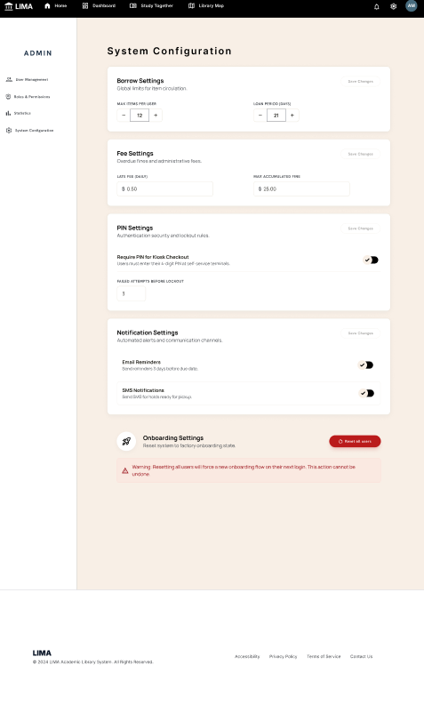
        
<em>Figure P-ADM-06-BF01 – System Configuration</em>

        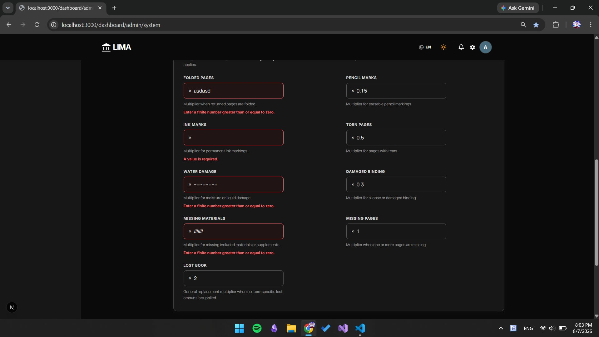
        
<em>Figure P-ADM-06-AF01 – Invalid Configuration Value</em>

      </td>
    </tr>
  </tbody>
</table>

---

### UC-ADM-07: View Statistics

<table width="100%" border="1" cellpadding="8" cellspacing="0" style="border-collapse: collapse; font-family: Arial, sans-serif; font-size: 14px; border: 1px solid #d1d5db; margin-bottom: 20px;">
  <thead>
    <tr style="background-color: #1e3a8a; color: #ffffff;">
      <th colspan="2" style="text-align: left; padding: 12px; font-size: 16px;">
        Use Case: View Statistics
      </th>
    </tr>
  </thead>
  <tbody>
    <tr>
      <td width="22%" style="background-color: #f8fafc; font-weight: bold; vertical-align: top;">Use Case ID</td>
      <td style="vertical-align: top;"><strong>UC-ADM-07</strong></td>
    </tr>
    <tr>
      <td style="background-color: #f8fafc; font-weight: bold; vertical-align: top;">Brief Description</td>
      <td style="vertical-align: top;">
        Allows the Admin to view system usage and operational statistics.
      </td>
    </tr>
    <tr>
      <td style="background-color: #f8fafc; font-weight: bold; vertical-align: top;">Actor(s)</td>
      <td style="vertical-align: top;">Admin</td>
    </tr>
    <tr>
      <td style="background-color: #f8fafc; font-weight: bold; vertical-align: top;">Preconditions</td>
      <td style="vertical-align: top;">
        <ul style="margin: 0; padding-left: 20px; line-height: 1.5;">
          <li><strong>Verified Authentication State:</strong> The Admin is authenticated and holds sufficient privileges to access system statistics.</li>
        </ul>
      </td>
    </tr>
    <tr>
      <td style="background-color: #f8fafc; font-weight: bold; vertical-align: top;">Flow of Events (Basic Flow)</td>
      <td style="vertical-align: top;">
        <ol style="margin: 0; padding-left: 20px; line-height: 1.6;">
          <li><strong>[Actor Action]:</strong> The Admin navigates to the Statistics section.</li>
          <li><strong>[Data Processing]:</strong> The system aggregates relevant statistical data.</li>
          <li><strong>[Display Result]:</strong> The system displays the statistics to the Admin.</li>
          <li><strong>[Actor Action]:</strong> The Admin optionally filters the statistics by date range or category.</li>
          <li><strong>[Display Result]:</strong> The system updates the displayed statistics based on the selected filter.</li>
        </ol>
      </td>
    </tr>
    <tr>
      <td style="background-color: #f8fafc; font-weight: bold; vertical-align: top;">Alternative / Exception Flows</td>
      <td style="vertical-align: top;">
        <ul style="margin: 0; padding-left: 20px; line-height: 1.5;">
          <li style="margin-bottom: 8px;">
            <strong>No Data Available for Requested Period or Category (Step 2):</strong> If no data is available for the requested period or category:
            <ol style="margin-top: 4px; margin-bottom: 4px; padding-left: 20px;">
              <li>The system displays an empty-state message.</li>
            </ol>
            <strong>Postcondition (Alternative Flow):</strong> No statistical data is displayed; the Admin remains on the Statistics section.
          </li>
        </ul>
      </td>
    </tr>
    <tr>
      <td style="background-color: #f8fafc; font-weight: bold; vertical-align: top;">Postconditions</td>
      <td style="vertical-align: top;">
        <ul style="margin: 0; padding-left: 20px;">
          <li><strong>Statistics Displayed:</strong> The requested statistics are displayed to the Admin.</li>
        </ul>
      </td>
    </tr>
    <tr>
      <td style="background-color: #f8fafc; font-weight: bold; vertical-align: top;">Special Requirements</td>
      <td style="vertical-align: top;">
        <ul style="margin: 0; padding-left: 20px;">
          <li><strong>Read-Only Access:</strong> This use case is strictly read-only.</li>
          <li><strong>Data Freshness:</strong> Displayed statistics should reflect a defined refresh interval or be clearly timestamped.</li>
        </ul>
      </td>
    </tr>
    <tr>
      <td style="background-color: #f8fafc; font-weight: bold; vertical-align: top;">Extension Points</td>
      <td style="vertical-align: top;">
        None
      </td>
    </tr>
    <tr>
      <td style="background-color: #f8fafc; font-weight: bold; vertical-align: top;">Prototype Screen</td>
      <td style="vertical-align: top;">
        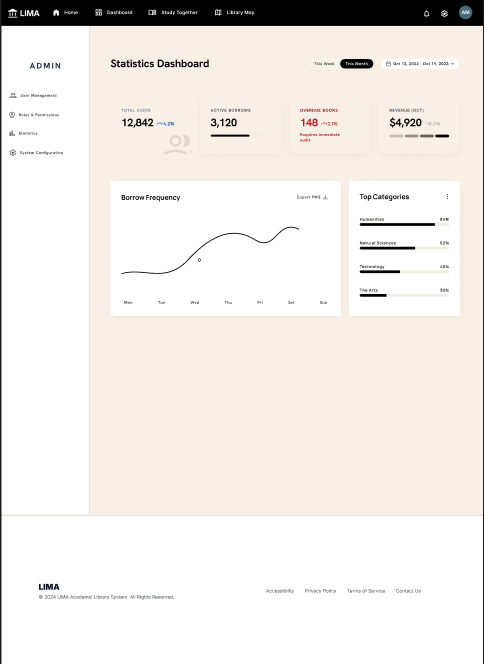
        
<em>Figure P-ADM-07-BF01 – Statistics Dashboard</em>

      </td>
    </tr>
  </tbody>
</table>
