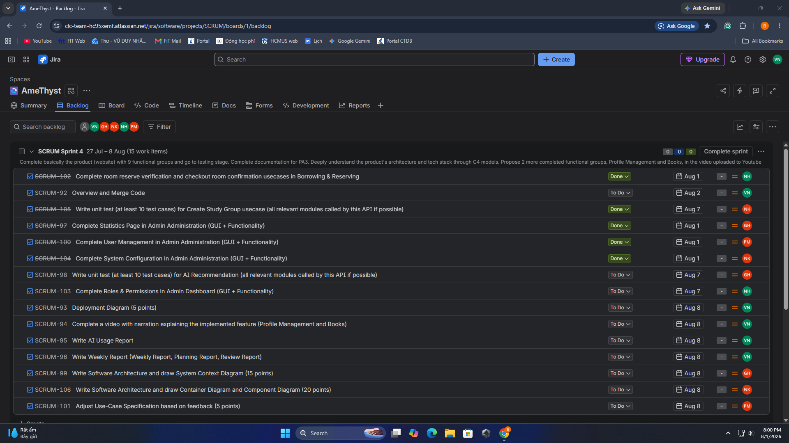

# Weekly Report

    Project: Modern Library Management System
    Course: CS300 – CSC13002 – Introduction to Software Engineering
    Group ID: 03
    Group Name: AmeThyst
    Assignment: PA4-2026

Performed by: Vũ Duy Nhất | Reviewed by: All Other Members | Edited by: Vũ Duy Nhất

## I. Meeting Minutes: 2/8/2026

- **Team member present:**
  - Vũ Duy Nhất
  - Trần Lê Hoàng Gia
  - Phan Lê Anh Minh
  - Nguyễn Nhựt Huy
  - Nguyễn Lê Hoàng Khải
- **Status Report:**
  - **Vũ Duy Nhất**:
    - Completed task
      - Complete a video with narration explaining the implemented feature (Profile Management and Books)
    - To-do task
      - Deployment Diagram (5 points)
      - AI Usage Report + Weekly Report (5 points)
    - Obstacles/Issues: None
  - **Trần Lê Hoàng Gia**
    - Completed task
      - Complete Statistics Page in Admin Administration (GUI + Functionality)
    - To-do task
      - Write unit test (at least 10 test cases) for AI Recommendation (all relevant modules called by this API if possible)
      - Software Architecture: System Context Diagram (15 points)
    - Obstacles/Issues
      - Having trouble finding the appropriate chart to present the data
      - Need to inject more mock data to test the feature
  - **Phan Lê Anh Minh**
    - Completed task
      - Complete User Management in Admin Administration (GUI + Functionality)
    - To-do task
      - Revised Use-Case Specification (5 points)
    - Obstacle/Issues
      - Need to add more fields into the users table and open the admin_log table to fully implement the feature.
  - **Nguyễn Nhựt Huy**
    - Completed task
      - Complete room reserve verification and checkout room confirmation usecases in Borrowing & Reserving
    - To-do task
      - Complete Roles & Permissions in Admin Dashboard (GUI + Functionality)
    - Obstacles/Issues
      - Need to synchronize the UI to display the study room booking timeline
  - **Nguyễn Lê Hoàng Khải**
    - Completed task
      - Complete System Configuration in Admin Administration (GUI + Functionality)
      - Write unit test (at least 10 test cases) for Create Study Group usecase (all relevant modules called by this API if possible)
    - To-do task
      - Software Architecture: Container Diagram and Component Diagram (20 points)
    - Obstacles/Issues
      - Need to list out all global variables to implement system configuration
      - Initially lacked a clear understanding of unit testing
- **Action:**
  - **Trần Lê Hoàng Gia:** Prepare updated SQL scripts, snapshots, and Cypher files for source code submission.
  - **Vũ Duy Nhất:** Update the physical ERD with the newly added fields and tables in the database.
- **Summary of the meeting:** Firstly, the team reviewed the progress completed during the sprint. The newly implemented features were tested, and the product was estimated to be approximately 90% complete, with the Admin Authorization use case remaining as the only unfinished functional area. The team then discussed the upcoming software architecture documentation for PA4, covering the C4 model diagrams (System Context, Container, and Component), including guidance on how to read and interpret each diagram level. Finally, the team leader outlined the remaining tasks for the following week and provided implementation ideas to support each member in their assignments.

## II. Meeting Minutes: 7/8/2026

- **Team member present:**
  - Vũ Duy Nhất
  - Trần Lê Hoàng Gia
  - Phan Lê Anh Minh
  - Nguyễn Nhựt Huy
  - Nguyễn Lê Hoàng Khải
- **Status Report:**
  - **Vũ Duy Nhất**:
    - Completed task
      - Deployment Diagram (5 points)
    - To-do task
       - Overview and Merge Code
       - AI Usage Report + Weekly Report (5 points)
    - Obstacles/Issues
       - Editing diagrams using Mermaid script is quite hard.
       - Need to review the system overview to describe the components.
  - **Trần Lê Hoàng Gia**
    - Completed task
      - Software Architecture: System Context Diagram (15 points)
    - To-do task
      - Write the remain test cases for AI Recommendation
      - Complete preparation of SQL, snapshot and Cypher files
    - Obstacles/Issues
       - Editing diagrams using Mermaid script is quite hard.
       - Need to review the system overview to describe the components.
  - **Phan Lê Anh Minh**
    - Completed task: None
    - To-do task
      - Revised Use-Case Specification (5 points)
    - Obstacles/Issues: None
  - **Nguyễn Nhựt Huy**
    - Completed task
      - Complete Roles & Permissions in Admin Dashboard (GUI + Functionality)
    - To-do task:
      - Prepare unit testing for reserve book and pin verification use cases
    - Obstacles/Issues:
      - Need to add more fields into the users table and open the authorize_history table to fully implement the feature.
  - **Nguyễn Lê Hoàng Khải**
    - Completed task
      - Software Architecture: Container Diagram and Component Diagram (20 points)
    - To-do task
      - Fix bugs the implemented features if any
    - Obstacles/Issues
      - Editing diagrams using Mermaid script is quite hard.
      - Need to review the system overview to describe the components.
- **Action:**
  - **Vũ Duy Nhất**: Update the physical ERD with the newly added fields and tables in the database.
  - **Trần Lê Hoàng Gia**: Update the Use-Case Diagram based on TA's feedback
  - **Phan Lê Anh Minh**: Update the Use-Case Specification based on TA's feedback
- **Summary of the meeting:** Firstly, the team reviewed the overall progress and confirmed that the product was essentially complete, with the project entering the bug-fixing and unit testing refinement phase. The team then conducted a collective overview and evaluation of the C4 architecture diagrams—covering the System Context, Container, and Component diagrams—to deepen the team's shared understanding of the system structure and ensure consistency across documents. Additionally, the team discussed feedback received from the TA regarding the Use-Case Diagram and Use-Case Specification, and proposed concrete revision strategies to address the identified issues. Finally, the team leader summarized the remaining work needed to fully complete Sprint 4 and provided implementation ideas to guide each member's next steps.

## III. Task Screenshot on Jira (Week 1: 27/7 - 2/8 & Week 2: 3/8 - 8/8)

