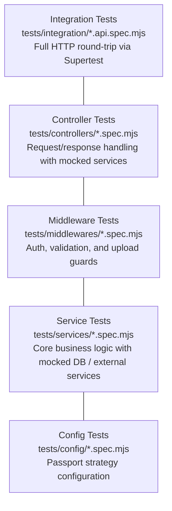
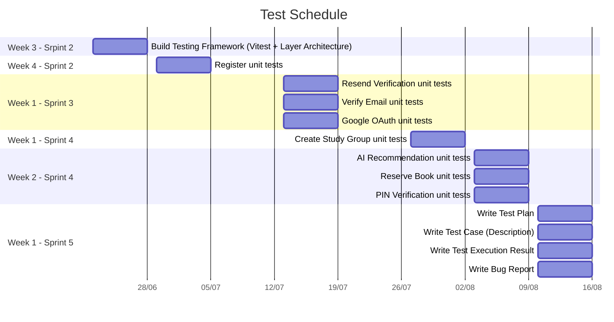

# Test Plan

    Project: Modern Library Management System
    Course: CS300 – CSC13002 – Introduction to Software Engineering
    Group ID: 03
    Group Name: AmeThyst
    Assignment: PA5-2026

Performed by: Vũ Duy Nhất | Reviewed by: All Members | Edited by: Vũ Duy Nhất

---

## Table of Contents

- [Test Plan](#test-plan)
  - [Table of Contents](#table-of-contents)
  - [1. Test Objectives and Scope](#1-test-objectives-and-scope)
    - [1.1 Objectives](#11-objectives)
    - [1.2 Scope](#12-scope)
      - [In Scope](#in-scope)
      - [Out of Scope](#out-of-scope)
  - [2. Features to Be Tested](#2-features-to-be-tested)
    - [2.1 Register](#21-register)
    - [2.2 Google OAuth](#22-google-oauth)
    - [2.3 Resend Verification](#23-resend-verification)
    - [2.4 Verify Email](#24-verify-email)
    - [2.5 Reserve Book](#25-reserve-book)
    - [2.6 Verify PIN](#26-verify-pin)
    - [2.7 Create Study Group](#27-create-study-group)
    - [2.8 AI Recommendation](#28-ai-recommendation)
  - [3. Test Environment and Tools](#3-test-environment-and-tools)
    - [3.1 Testing Tools \& Environment](#31-testing-tools--environment)
    - [3.2 Running Tests](#32-running-tests)
    - [3.3 Test Layers](#33-test-layers)
  - [4. Test Schedule and Responsibilities](#4-test-schedule-and-responsibilities)
    - [4.1 Schedule](#41-schedule)
    - [4.2 Responsibilities](#42-responsibilities)
  - [5. Entry and Exit Criteria](#5-entry-and-exit-criteria)
    - [5.1 Entry Criteria](#51-entry-criteria)
      - [General Criteria (All Layers)](#general-criteria-all-layers)
      - [Config-Layer Tests](#config-layer-tests)
      - [Middleware-Layer Tests](#middleware-layer-tests)
      - [Service-Layer Tests](#service-layer-tests)
      - [Controller-Layer Tests](#controller-layer-tests)
      - [Integration Tests](#integration-tests)
    - [5.2 Exit Criteria](#52-exit-criteria)
  - [6. AI Usage Note](#6-ai-usage-note)
    - [AI Tool 1](#ai-tool-1)
    - [AI Tool 2](#ai-tool-2)


---

## 1. Test Objectives and Scope


### 1.1 Objectives

The goal of this test plan is to verify the correctness, reliability, and security of the AmeThyst Library system - a full-stack application composed of:

- **Frontend** — Next.js (React) client running on `http://localhost:3000`
- **Backend** — Node.js/Express API server running on `http://localhost:5000`
- **Database** — PostgreSQL and Neo4j (Memgraph) managed via Docker

> **Note:** The above describes the application's production architecture. The automated test suite covered by this plan (Section 3) does **not** require a live PostgreSQL, Neo4j, or Docker instance to run — all persistence and external services are mocked at every test layer, including integration tests. See Section 3.1 for details.

The testing effort aims to:

1. Validate that all business requirements are correctly implemented across the authentication, library management, room reservation, study group, user profile, and administration feature domains.
2. Confirm that the backend API layer behaves correctly at the unit (service), component (controller/middleware), and integration (HTTP) levels.
3. Verify data integrity, transactional correctness, and error handling under infrastructure failures.
4. Ensure proper security controls — JWT authentication, role-based authorization, bcrypt password hashing, and OAuth 2.0 flows.
5. Confirm the AI-powered recommendation engine produces coherent and contextually relevant outputs.


### 1.2 Scope

#### In Scope

| Layer | What is Tested |
|---|---|
| **Service layer** | Business logic functions in `src/server/src/services/` |
| **Controller layer** | Request/response handling in `src/server/src/controllers/` |
| **Middleware layer** | Auth, role, validation, and multer middlewares in `src/server/src/middlewares/` |
| **Integration (API)** | Full HTTP request/response cycle via Supertest, with database and external services (email, OAuth) mocked — no live DB connection |
| **Configuration** | Google OAuth Passport strategy configuration |

#### Out of Scope

| Area | Reason |
|---|---|
| Frontend UI rendering | UI is built with Next.js; visual regression and E2E browser testing are deferred to a separate plan |
| Database schema migrations | Not applicable — the test suite (including integration tests) runs entirely against mocked persistence layers, not a live seeded database |
| Third-party OAuth provider | Google's authorization server itself is not under test; Passport strategy stubs are used |
| Load / performance testing | Not part of the current iteration |
| Mobile responsiveness | Covered by manual review; not part of the automated suite |

---

## 2. Features to Be Tested

### 2.1 Register

**Aim**: Validates the local email-and-password registration flow end-to-end, from form submission through email verification to JWT issuance.

**Planned Testing:**

| Scenario | What is Tested | Layer |
|---|---|---|
| Register Service | Registration business logic, data persistence mocking, and hashing | Service |
| Register Controller | Request and response handling for registration endpoint | Controller |
| Register API | Full HTTP integration flow for user registration | Integration |

**API endpoints:**

| Method | Endpoint | Role |
|---|---|---|
| `POST` | `/auth/register` | Public |

### 2.2 Google OAuth

**Aim**: Validates Google OAuth 2.0 sign-in for both first-time users (auto-provisioning) and returning users.

**Planned Testing:**

| Scenario | What is Tested | Layer |
|---|---|---|
| Google Auth Strategy | Google OAuth Passport strategy configuration and callback handling | Config |
| Google Auth Controller | Request and response handling for Google OAuth flow | Controller |
| Google Auth API | Full HTTP integration flow for Google OAuth | Integration |

**API endpoints:**

| Method | Endpoint | Role |
|---|---|---|
| `GET` | `/auth/google` | Public |
| `GET` | `/auth/google/callback` | Public |

### 2.3 Resend Verification

**Aim**: Validates that a user can request a new verification email, that the token TTL is refreshed, and that the old token is invalidated.

**Planned Testing:**

| Scenario | What is Tested | Layer |
|---|---|---|
| Resend Verification Service | Business logic for checking user status and generating new verification tokens | Service |
| Resend Verification Controller | Request and response handling for resend verification endpoint | Controller |
| Resend Verification API | Full HTTP integration flow for resending verification email | Integration |

**API endpoints:**

| Method | Endpoint | Role |
|---|---|---|
| `POST` | `/auth/resend-verification` | Public |

### 2.4 Verify Email

**Aim**: Validates that a pending registration is promoted to a full account upon submission of a valid verification token, and that expired or reused tokens are rejected.

**Planned Testing:**

| Scenario | What is Tested | Layer |
|---|---|---|
| Verify Email Service | Business logic for verifying tokens and updating user status | Service |
| Verify Email Controller | Request and response handling for verify email endpoint | Controller |
| Verify Email API | Full HTTP integration flow for verifying email | Integration |

**API endpoints:**

| Method | Endpoint | Role |
|---|---|---|
| `POST` | `/auth/verify-email` | Public |

### 2.5 Reserve Book

**Aim**: Validates the book reservation flow — stock availability check, borrow-limit enforcement, and reservation record creation.

**Planned Testing:**

| Scenario | What is Tested | Layer |
|---|---|---|
| Library Reserve Service | Business logic for creating reservations and checking availability | Service |
| Library Services | Core library domain logic and catalog access | Service |
| Library Reserve Controller | Request and response handling for reserve book endpoints | Controller |
| Library Reserve Middleware | Input validation and authorization guards for reservations | Middleware |

**API endpoints:**

| Method | Endpoint | Role |
|---|---|---|
| `GET` | `/api/library/books` | Public |
| `GET` | `/api/library/books/:id` | Public |
| `POST` | `/api/library/reserve` | `user` |

### 2.6 Verify PIN

**Aim**: Validates the PIN-based borrow pickup and book-return flow between the user and the librarian.

**Planned Testing:**

| Scenario | What is Tested | Layer |
|---|---|---|
| Dashboard User PIN Service | Business logic for generating and managing user PINs | Service |
| Dashboard Librarian PIN Service | Business logic for verifying PINs and updating borrowing status | Service |
| Dashboard User PIN Controller | Request and response handling for user PIN endpoints | Controller |
| Dashboard Librarian PIN Controller | Request and response handling for librarian PIN verification endpoints | Controller |

**API endpoints:**

| Method | Endpoint | Role |
|---|---|---|
| `POST` | `/dashboard/user/reserve/:reservationId/pin` | Authenticated |
| `POST` | `/dashboard/user/reserve/:reservationId/pin/cleanup` | Authenticated |
| `POST` | `/dashboard/user/borrowed/generate-return-pin` | Authenticated |
| `POST` | `/dashboard/librarian/verify-pin` | `librarian` |
| `POST` | `/dashboard/librarian/confirm-borrowing` | `librarian` |
| `POST` | `/dashboard/librarian/verify-return-pin` | `librarian` |
| `POST` | `/dashboard/librarian/confirm-return` | `librarian` |

### 2.7 Create Study Group

**Aim**: Validates the atomic creation of a study group and its linked room reservation, including input validation, slot availability checks, persistence orchestration, and real-time notification dispatch.

**Planned Testing:**

| Scenario | What is Tested | Layer |
|---|---|---|
| Create Study Group Service | Business logic for atomic creation of study groups and room reservations | Service |
| Create Study Group Middleware | Input validation and authorization guards for study group creation | Middleware |
| Create Study Group Controller | Request and response handling for study group endpoint | Controller |
| Create Study Group API | Full HTTP integration flow for creating study groups | Integration |

**API endpoints:**

| Method | Endpoint | Role |
|---|---|---|
| `POST` | `/study-groups/` | `user` |

### 2.8 AI Recommendation

**Aim**: Validates the recommendation engine — collaborative filtering, content-based filtering, embedding lookup, and graph traversal via Neo4j/Memgraph.

**Planned Testing:**

| Scenario | What is Tested | Layer |
|---|---|---|
| Recommendation Services | Business logic for collaborative and content-based filtering algorithms | Service |

**API endpoints:**

| Method | Endpoint | Role |
|---|---|---|
| `GET` | `/api/dashboard/user/recommendations` | Authenticated |
| `POST` | `/api/dashboard/user/recommendations/renew` | Authenticated |
| `POST` | `/api/dashboard/user/recommendations/:bookId/click` | Authenticated |

---

## 3. Test Environment and Tools

### 3.1 Testing Tools & Environment

**Tools**

| Component | Technology | Version |
|---|---|---|
| Test Framework | **Vitest** | ^4.1.9 |
| HTTP Integration Testing | **Supertest** | ^7.0.0 |
| Vitest UI | `@vitest/ui` | ^4.1.9 |

**Environment**

| Requirement | Needed to run tests? | Notes |
|---|---|---|
| Node.js runtime | Yes | Required to run `npm test` in `src/server/` |
| PostgreSQL | **No** | All database calls are mocked (`vi.mock`) at the service layer |
| Neo4j / Memgraph | **No** | Graph queries for recommendations are mocked |
| Docker | **No** | Not required for any test layer, including Integration |
| Live Google OAuth credentials | **No** | Passport strategy is stubbed (see Section 1.2, Out of Scope) |
| SMTP / email service | **No** | Email sending is mocked; delivery is not verified end-to-end |


The test suite is fully self-contained: cloning the repo and running `npm install` + `npm test` in `src/server/` is sufficient — no external service needs to be started first.

All backend test configuration is defined in `src/server/vitest.config.mjs`.

### 3.2 Running Tests

```bash
cd src/server

# Run the entire test suite
npm test

# Watch mode
npm run test:watch

# Visual UI
npm run test:ui

```

### 3.3 Test Layers

Each Vitest project exercises five complementary test layers, progressing from isolated unit tests to full HTTP integration:



---

## 4. Test Schedule and Responsibilities

### 4.1 Schedule

| Week |Sprint| Period | Activity |
|---|---|---|---|
| **Week 3** | 2 | 22/6 – 28/6 | Build Testing Framework (Vitest + Layer Architecture) |
| **Week 4** | 2 | 29/6 – 5/7 | Write unit tests (≥ 10 test cases) for **Register** use case |
| **Week 1** | 3 | 13/7 – 19/7 | Write unit tests (≥ 10 test cases) for **Resend Verification**, **Verify Email**, and **Google OAuth** use cases |
| **Week 1** | 4 | 27/7 – 2/8 | Write unit tests (≥ 10 test cases) for **Create Study Group** use case |
| **Week 2** | 4 | 3/8 – 9/8 | Write unit tests (≥ 10 test cases) for **AI Recommendation**, **Reserve Book**, and **PIN Verification** use cases |
| **Week 1** | 5 | 10/8 – 16/8 | Write Test Plan · Write Test Case (Description) · Write Test Execution Result · Write Bug Report |


### 4.2 Responsibilities

| Member | Role | Responsibilities |
|---|---|---|
| **Vũ Duy Nhất** | Team Leader / Project Manager | Review all test cases; Build Testing Framework (Vitest + Layer Architecture); Write Test Plan |
| **Trần Lê Hoàng Gia** | Full Stack Developer / Tester | Write unit tests (≥ 10 test cases) for AI Recommendation feature |
| **Phan Lê Anh Minh** | Full Stack Developer / Tester | Write unit tests (≥ 10 test cases) for Register, Resend Verification, Verify Email, and Google OAuth use cases |
| **Nguyễn Nhựt Huy** | Full Stack Developer / Tester | Write unit tests (≥ 10 test cases) for Reserve Book and PIN Verification use cases |
| **Nguyễn Lê Hoàng Khải** | Full Stack Developer / Tester | Write unit test (≥ 10 test cases) for Create Study Group use case |
| **All Members** | Tester | Write Test Case (Description); Write Test Execution Result; Write Bug Report |

## 5. Entry and Exit Criteria

### 5.1 Entry Criteria

Entry criteria are divided by test layers to reflect the specific prerequisites needed before testing begins at each level.

#### General Criteria (All Layers)

| # | Criterion |
|---|---|
| 1 | The feature branch has been created from `dev` and the implementation is code-complete. |
| 2 | Dependencies are installed (`npm install` completed without errors in `src/server/`). |
| 3 | A Vitest project entry has been added to `vitest.config.mjs` with `include` globs pointing to the new test files. |

#### Config-Layer Tests

Since config tests verify setup behavior in isolation, their entry criteria are:

| # | Criterion |
|---|---|
| 1 | Configuration files and strategy setups (e.g., Passport Google OAuth) are completely defined. |
| 2 | Any required environment variables for the configuration are mocked or set to testing defaults. |
| 3 | The initialization and configuration loading processes are isolated and ready for testing. |

#### Middleware-Layer Tests

Since middleware tests verify guards and input modifications, their entry criteria are:

| # | Criterion |
|---|---|
| 1 | The middleware logic (such as authentication, role verification, or input validation guards) is complete. |
| 2 | The `next()` function, `req` object, and `res` methods are properly mocked. |
| 3 | Test cases are designed to cover both scenarios: where the middleware correctly allows the request to pass (calling `next()`), and where it correctly blocks/intercepts the request. |

#### Service-Layer Tests

Since service tests run entirely with mocked dependencies and require no database or running server, their specific entry criteria are:

| # | Criterion |
|---|---|
| 1 | The business logic implementation for the specific service is complete. |
| 2 | All database interactions, repository calls, and external third-party services are properly mocked using Vitest (`vi.mock`). |
| 3 | Test cases are designed to cover core domain logic, happy paths, edge cases, and error scenarios. |

#### Controller-Layer Tests

Since controller tests verify the request and response logic with mocked dependencies, their entry criteria are:

| # | Criterion |
|---|---|
| 1 | The request and response handling logic in the controller is complete. |
| 2 | All underlying services called by the controller are properly mocked to isolate the controller's behavior. |
| 3 | Test cases are designed to verify different HTTP status code returns (e.g., 200, 400, 404, 500) based on valid and invalid inputs or service responses. |

#### Integration Tests

These tests cover the full HTTP request/response cycle via Supertest.

| # | Criterion |
|---|---|
| 1 | All underlying unit tests (Service, Controller, Middleware) for the feature are completed and passing. |
| 2 | Express routes, middleware chains, and controllers are fully wired together and exported for Supertest. |
| 3 | External side-effects and persistence layers are correctly mocked at the API level (no live DB connection required). |


### 5.2 Exit Criteria

A feature's test phase is considered complete (and the PR is eligible for merge to `dev`) when **all** of the following are satisfied:

| # | Criterion |
|---|---|
| 1 | **All tests pass:** `npm test` exits with code `0` — no failing tests, no unhandled errors. |
| 2 | **Happy path covered:** The primary success path for each feature endpoint is verified at the integration level. |
| 3 | **Critical error paths covered:** Infrastructure failures (DB error, SMTP failure), invalid input, unauthorized access, and duplicate-resource scenarios all have corresponding test cases. |
| 4 | **Security invariants verified:** Passwords are not stored in plain text (bcrypt rounds >= 10), JWTs contain no sensitive fields (e.g., raw password), and protected routes reject unauthenticated or unauthorized requests with the correct HTTP status codes (`401`/`403`). |
| 5 | **No regressions:** The full suite (`npm test`) passes without any previously-green tests turning red. |


## 6. AI Usage Note

This document was drafted and refined with the assistance of AI tools, declared as follows:

### AI Tool 1

- **Tool name:** Antigravity Agent (Claude Sonnet 4.6 Thinking)
- **Access time:** August 12, 2026 – 21:56 ICT
- **Prompt:** *Based on TestPlanRequirement in docs folder and src folder, create TestPlan.md file and write the test plan*
- **Purpose:** To accelerate the initial drafting of the test plan document by automatically extracting and cross-referencing project information from multiple source files — including `docs/TestPlanRequirement.md`, `src/README.md`, `src/server/vitest.config.mjs`, `docs/test/index.md`, and all API route files under `src/server/src/routes/` — and organising that information into the five required sections (objectives and scope, features to be tested, test environment and tools, schedule and responsibilities, and entry/exit criteria).
- **Content generated by AI:**
  - Section 1 — Test Objectives and Scope (objectives list, in-scope and out-of-scope tables)
  - Section 2 — Features to Be Tested (all sub-sections 2.1 through 2.8, including per-feature "Planned Testing" tables and API endpoint tables derived from the route files)
  - Section 3 — Test Environment and Tools (technology stack table, environment requirements table, `npm test` command examples, and the Mermaid test-layer diagram)
  - Section 4 — Test Schedule and Responsibilities (weekly schedule table and role-responsibility matrix)
  - Section 5 — Entry and Exit Criteria (entry and exit criteria tables)
- **Student's work and validation:** The AI-generated content was reviewed against the actual source files to verify the accuracy of feature descriptions, API route paths, HTTP methods, role guards, and planned test-layer mappings for each feature. The API endpoint tables were cross-checked against each `*.routes.mjs` file, and the environment requirements table (Section 3) was verified against the actual test setup (mocked persistence, no live DB/Docker dependency). This AI Usage Note section was added by the student.

### AI Tool 2

- **Tool name:** Antigravity Agent (Claude Sonnet 4.6 Thinking)
- **Access time:** August 14, 2026 – 21:05 ICT
- **Prompt:** *Based on section 1 (Schedule) in Test Scheduling.md, can you draw gantt chart using keyword gantt in mermaid and insert it below the table in section 4.1 schedule in TestPlan.md*
- **Purpose:** To generate a Mermaid Gantt chart from the weekly schedule defined in `docs/Test Scheduling.md` and embed it in Section 4.1 of the Test Plan as a visual timeline.
- **Content generated by AI:**
  - Section 4.1 — Mermaid `gantt` chart with 6 weekly sections, individual task bars per use case, and `axisFormat %d/%m` date labels
- **Student's work and validation:** The generated Gantt chart date ranges were cross-checked against the schedule table in `docs/Test Scheduling.md`. Task labels and week groupings were verified to match the written schedule above the chart.


