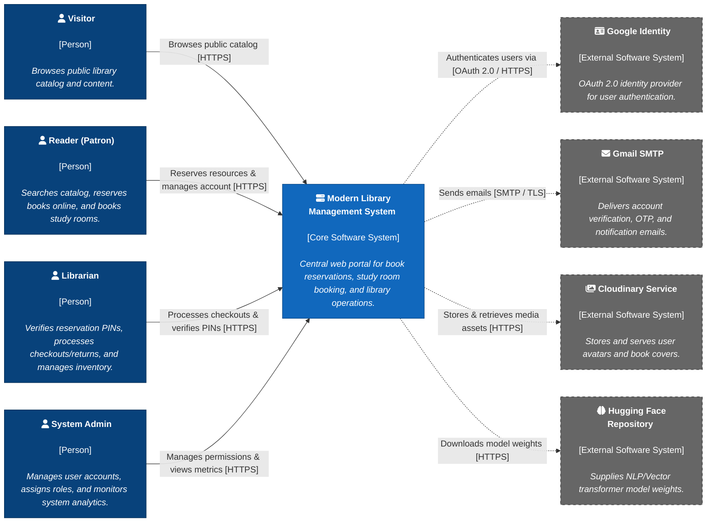

```mermaid
flowchart LR
    %% Actors
    Visitor["<b><center> fa:fa-user Visitor</b></center><br/><center>[Person]</center><br/><i>Browses public library catalog and content.</i>"]
    Readers["<b><center> fa:fa-user Reader (Patron)</b></center><br/><center>[Person]</center><br/><i>Searches catalog, reserves books online, and books study rooms.</i>"]
    Librarian["<b><center>fa:fa-user Librarian</center></b><br><center>[Person]</center><br><i>Verifies reservation PINs, processes checkouts/returns, and manages inventory.</i>"]
    SysAdmin["<b><center> fa:fa-user System Admin</center></b><br/><center>[Person]</center><br/><i>Manages user accounts, assigns roles, and monitors system analytics.</i>"]

    %% Core System
    CoreSystem["<b><center> fa:fa-server Modern Library Management System </center></b><br/><center>[Core Software System]</center><br/><i>Central web portal for book reservations, study room booking, and library operations.</i>"]

    %% External Systems
    GoogleOAuth["<b><center> fa:fa-id-card Google Identity</center></b><br><center>[External Software System]</center><br><i>OAuth 2.0 identity provider for user authentication.</i>"]
    GmailSMTP["<b><center> fa:fa-envelope Gmail SMTP</center></b><br><center>[External Software System]</center><br><i>Delivers account verification, OTP, and notification emails.</i>"]
    Cloudinary["<b><center> fa:fa-images Cloudinary Service</b> </center><br><center>[External Software System]</center><br><i>Stores and serves user avatars and book covers.</i>"]
    HuggingFace["<b><center> fa:fa-brain Hugging Face Repository</b> </center><br><center>[External Software System]</center><br><i>Supplies NLP/Vector transformer model weights.</i>"]

    %% Relationships
    Visitor -->|"Browses public catalog [HTTPS]"| CoreSystem
    Readers -->|"Reserves resources & manages account [HTTPS]"| CoreSystem
    Librarian -->|"Processes checkouts & verifies PINs [HTTPS]"| CoreSystem
    SysAdmin -->|"Manages permissions & views metrics [HTTPS]"| CoreSystem

    CoreSystem -.->|"Authenticates users via [OAuth 2.0 / HTTPS]"| GoogleOAuth
    CoreSystem -.->|"Sends emails [SMTP / TLS]"| GmailSMTP
    CoreSystem -.->|"Stores & retrieves media assets [HTTPS]"| Cloudinary
    CoreSystem -.->|"Downloads model weights [HTTPS]"| HuggingFace

    %% Styling
    classDef person fill:#08427b,stroke:#052e56,color:#fff;
    classDef coreSystem fill:#1168bd,stroke:#0b4884,color:#fff;
    classDef extSystem fill:#666666,stroke:#333333,color:#fff,stroke-dasharray:5 5;

    class Visitor,Readers,SysAdmin,Librarian person;
    class CoreSystem coreSystem;
    class GoogleOAuth,GmailSMTP,Cloudinary,HuggingFace extSystem;
```