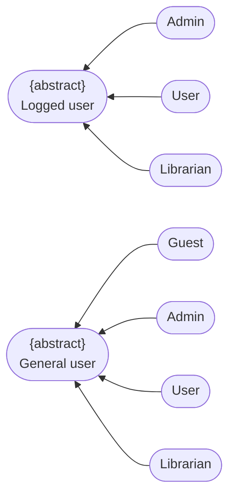
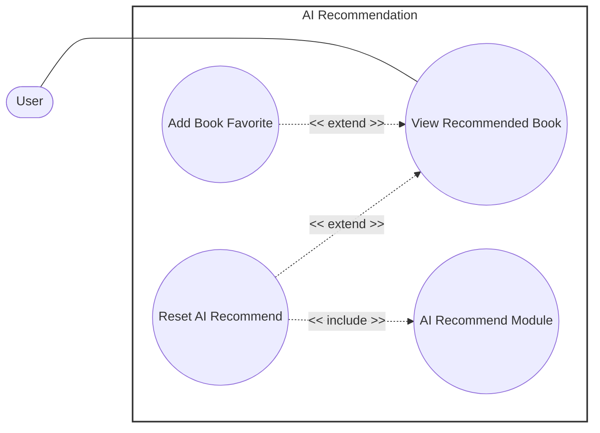

# Use-Case Specification: AI Recommendation Package

**Group Name:** Amethyst

**Project Name:** Modern Library Management System

**Version:** 1.1

**Date:** 20-Jul-2026

**Document Identifier:** NGLP-SRS-AIR-001

---

## Revision History

| Date | Version | Description | Author |
| --- | --- | --- | --- |
| 20-Jul-2026 | 1.1 | AI Recommendation (RUP format layout). | Anh Minh, Hoang Gia |

---

## Table of Contents
1. [Regulation](#regulation)
2. [Use case diagram](https://www.google.com/search?q=%23use-case-diagram)
3. [UC-AIR-01: View Recommended Book](#uc-air-01-view-recommended-book)
4. [UC-AIR-03: Reset AI Recommend](#uc-air-03-reset-ai-recommend)
5. [UC-AIR-04: AI Recommend Module](https://www.google.com/search?q=%23uc-air-04-ai-recommend-module)

---

## Regulation

---

## Use case diagram

---
## UC-AIR-01: View Recommended Book

<table width="100%" border="1" cellpadding="8" cellspacing="0" style="border-collapse: collapse; font-family: Arial, sans-serif; font-size: 14px; border: 1px solid #d1d5db; margin-bottom: 20px;">
  <thead>
    <tr style="background-color: #1e3a8a; color: #ffffff;">
      <th colspan="2" style="text-align: left; padding: 12px; font-size: 16px;">
        Use Case: View Recommended Book
      </th>
    </tr>
  </thead>
  <tbody>
    <tr>
      <td width="22%" style="background-color: #f8fafc; font-weight: bold; vertical-align: top;">Use Case ID</td>
      <td style="vertical-align: top;"><strong>UC-AIR-01</strong></td>
    </tr>
    <tr>
      <td style="background-color: #f8fafc; font-weight: bold; vertical-align: top;">Brief Description</td>
      <td style="vertical-align: top;">
        Allows the user to view the list of books recommended by the AI recommendation engine.
      </td>
    </tr>
    <tr>
      <td style="background-color: #f8fafc; font-weight: bold; vertical-align: top;">Actor(s)</td>
      <td style="vertical-align: top;">User</td>
    </tr>
    <tr>
      <td style="background-color: #f8fafc; font-weight: bold; vertical-align: top;">Preconditions</td>
      <td style="vertical-align: top;">
        <ul style="margin: 0; padding-left: 20px; line-height: 1.5;">
          <li><strong>Client Identity Verification:</strong> The session context maintains an actively verified and authenticated state flag.</li>
        </ul>
      </td>
    </tr>
    <tr>
      <td style="background-color: #f8fafc; font-weight: bold; vertical-align: top;">Flow of Events (Basic Flow)</td>
      <td style="vertical-align: top;">
        <ol style="margin: 0; padding-left: 20px; line-height: 1.6;">
          <li><strong>[Actor Action]:</strong> The user navigates to the Recommended Book Dashboard within the main Dashboard tab workspace.</li>
          <li><strong>[System Response]:</strong> The system queries backend microservices to retrieve the AI-generated list of recommended books.</li>
          <li><strong>[Display Result]:</strong> The system renders the prioritized list of recommended books (containing 10-15 book items) directly onto the user interface viewport.</li>
          <li><strong>[Actor Action]:</strong> The user reviews the recommendations, opens individual details panes to examine specific book records, and saves relevant candidate titles into their personal favorites collection array.</li>
        </ol>
      </td>
    </tr>
    <tr>
      <td style="background-color: #f8fafc; font-weight: bold; vertical-align: top;">Alternative / Exception Flows</td>
      <td style="vertical-align: top;">
        <ul style="margin: 0; padding-left: 20px; line-height: 1.5;">
          <li style="margin-bottom: 8px;">
            <strong>Recommendation Generation Error (Step 3):</strong> If the system encounters an error or timeout while compiling the recommendation data structures:
            <ol style="margin-top: 4px; margin-bottom: 4px; padding-left: 20px;">
              <li>The system interrupts the presentation flow script.</li>
              <li>The system throws a contextual error notification alert block onto the screen interface.</li>
            </ol>
            <strong>Postcondition (Alternative Flow):</strong> No recommended books are displayed; the user workspace safely handles the failure and informs the individual that no recommendations are currently available.
          </li>
        </ul>
      </td>
    </tr>
    <tr>
      <td style="background-color: #f8fafc; font-weight: bold; vertical-align: top;">Postconditions</td>
      <td style="vertical-align: top;">
        <ul style="margin: 0; padding-left: 20px;">
          <li><strong>Dashboard Presentation Complete:</strong> The targeted AI-generated list of book recommendations populates the visualization grid array successfully.</li>
          <li><strong>Performance Cache Staging:</strong> The calculated recommendation ranking matrix commits to high-speed cache memory systems to accelerate subsequent rendering retrieval loops.</li>
        </ul>
      </td>
    </tr>
    <tr>
      <td style="background-color: #f8fafc; font-weight: bold; vertical-align: top;">Special Requirements</td>
      <td style="vertical-align: top;">
        <ul style="margin: 0; padding-left: 20px;">
          <li><strong>Recent Interest Real-Time Extraction:</strong> The displayed list compilation must dynamically track and accurately reflect the user's most recent reading and query interest parameters.</li>
          <li><strong>Analytical Behavioral Tracking:</strong> The system must actively log all granular user interaction vectors (e.g., viewing profiles, adding entries to wishlists, processing reservations) to continually update and train downstream machine learning recommendations.</li>
        </ul>
      </td>
    </tr>
    <tr>
      <td style="background-color: #f8fafc; font-weight: bold; vertical-align: top;">Extension Points</td>
      <td style="vertical-align: top;">
        <ul style="margin: 0; padding-left: 20px;">
          <li><strong>Reset AI Recommend:</strong> Location inside event flow: Viewing the recommended list grid (Step 4).</li>
        </ul>
      </td>
    </tr>
    <tr>
      <td style="background-color: #f8fafc; font-weight: bold; vertical-align: top;">Prototype Screen</td>
      <td style="vertical-align: top;">
        
      </td>
    </tr>
  </tbody>
</table>

---

## UC-AIR-02: Reset AI Recommend

<table width="100%" border="1" cellpadding="8" cellspacing="0" style="border-collapse: collapse; font-family: Arial, sans-serif; font-size: 14px; border: 1px solid #d1d5db; margin-bottom: 20px;">
  <thead>
    <tr style="background-color: #1e3a8a; color: #ffffff;">
      <th colspan="2" style="text-align: left; padding: 12px; font-size: 16px;">
        Use Case: Reset AI Recommend
      </th>
    </tr>
  </thead>
  <tbody>
    <tr>
      <td width="22%" style="background-color: #f8fafc; font-weight: bold; vertical-align: top;">Use Case ID</td>
      <td style="vertical-align: top;"><strong>UC-AIR-02</strong></td>
    </tr>
    <tr>
      <td style="background-color: #f8fafc; font-weight: bold; vertical-align: top;">Brief Description</td>
      <td style="vertical-align: top;">
        Allows the user to clear their current recommendation cache and trigger the system's background engine to immediately recalculate and regenerate a fresh book recommendation list.
         <em>(Includes / Extends: <strong>Extends UC-AIR-01 (View Recommended Book) — extension point: Regenerating the displayed recommendation list. Includes UC-AIR-03 (AI Recommend Module).</strong>)</em>
      </td>
    </tr>
    <tr>
      <td style="background-color: #f8fafc; font-weight: bold; vertical-align: top;">Actor(s)</td>
      <td style="vertical-align: top;">User</td>
    </tr>
    <tr>
      <td style="background-color: #f8fafc; font-weight: bold; vertical-align: top;">Preconditions</td>
      <td style="vertical-align: top;">
        <ul style="margin: 0; padding-left: 20px; line-height: 1.5;">
          <li><strong>Workspace Context Active:</strong> The user is actively executing workspace visualization tasks within `UC-AIR-01`.</li>
        </ul>
      </td>
    </tr>
    <tr>
      <td style="background-color: #f8fafc; font-weight: bold; vertical-align: top;">Flow of Events (Basic Flow)</td>
      <td style="vertical-align: top;">
        <ol style="margin: 0; padding-left: 20px; line-height: 1.6;">
          <li><strong>[Actor Action]:</strong> While actively viewing the recommended book collection grid, the user selects the "Reset AI Recommend" interface control node option.</li>
          <li><strong>[System Response]:</strong> The system intercepts the request command payload and systematically invokes the mandatory include sub-routine **AI Recommend Module (UC-AIR-04)**.</li>
          <li><strong>[Data Processing]:</strong> The included AI Recommend Module processes the user's behavioral metrics dataset rows and evaluates a clean set of recommendations.</li>
          <li><strong>[Data Processing]:</strong> The system purges historical cache frames and overrides the active recommendation data array rows with the newly received listings.</li>
          <li><strong>[Display Result]:</strong> The system refreshes the client screen dashboard panel to render the fresh, updated recommended book list.</li>
        </ol>
      </td>
    </tr>
    <tr>
      <td style="background-color: #f8fafc; font-weight: bold; vertical-align: top;">Alternative / Exception Flows</td>
      <td style="vertical-align: top;">
        <ul style="margin: 0; padding-left: 20px; line-height: 1.5;">
          <li style="margin-bottom: 8px;">
            <strong>Core Module Execution Crash (Step 2):</strong> If the included AI Recommend Module fails to generate a new list due to model processing errors or connectivity breaks:
            <ol style="margin-top: 4px; margin-bottom: 4px; padding-left: 20px;">
              <li>The system aborts the data staging transaction loops.</li>
              <li>The system displays a transactional fallback error alert text block on screen.</li>
              <li>The system retains the previous recommendation list array properties intact within the active display container.</li>
            </ol>
            <strong>Postcondition (Alternative Flow):</strong> No structural changes commit against the user's current recommendation dataset; the user interface notifies the individual of the operational failure.
          </li>
        </ul>
      </td>
    </tr>
    <tr>
      <td style="background-color: #f8fafc; font-weight: bold; vertical-align: top;">Postconditions</td>
      <td style="vertical-align: top;">
        <ul style="margin: 0; padding-left: 20px;">
          <li><strong>Ledger Regeneration Complete:</strong> The user's recommendation data structures are successfully overwritten, cached, and updated across the display interface viewport.</li>
        </ul>
      </td>
    </tr>
    <tr>
      <td style="background-color: #f8fafc; font-weight: bold; vertical-align: top;">Special Requirements</td>
      <td style="vertical-align: top;">
        <ul style="margin: 0; padding-left: 20px;">
          <li><strong>API Rate Limiting Guards:</strong> To prevent heavy backend compute degradation, reset invocation requests must enforce strict rate-limiting caps to control repetitive sequential manual regenerations.</li>
          <li><strong>Candidate Non-Overlap Constraints:</strong> The freshly generated recommendation candidate array rows must be evaluated against the immediately preceding listing to prevent redundant content repetition.</li>
        </ul>
      </td>
    </tr>
    <tr>
      <td style="background-color: #f8fafc; font-weight: bold; vertical-align: top;">Extension Points</td>
      <td style="vertical-align: top;">
        None
      </td>
    </tr>
    <tr>
      <td style="background-color: #f8fafc; font-weight: bold; vertical-align: top;">Prototype Screen</td>
      <td style="vertical-align: top;">
        
      </td>
    </tr>
  </tbody>
</table>

---

## UC-AIR-03: AI Recommend Module

<table width="100%" border="1" cellpadding="8" cellspacing="0" style="border-collapse: collapse; font-family: Arial, sans-serif; font-size: 14px; border: 1px solid #d1d5db; margin-bottom: 20px;">
  <thead>
    <tr style="background-color: #1e3a8a; color: #ffffff;">
      <th colspan="2" style="text-align: left; padding: 12px; font-size: 16px;">
        Use Case: AI Recommend Module
      </th>
    </tr>
  </thead>
  <tbody>
    <tr>
      <td width="22%" style="background-color: #f8fafc; font-weight: bold; vertical-align: top;">Use Case ID</td>
      <td style="vertical-align: top;"><strong>UC-AIR-03</strong></td>
    </tr>
    <tr>
      <td style="background-color: #f8fafc; font-weight: bold; vertical-align: top;">Brief Description</td>
      <td style="vertical-align: top;">
        Internal algorithmic processing service handling the aggregation of user profile features, execution of ML recommendation graphs, and output generation of recommendation datasets.
         <em>(Includes / Extends: <strong>Included UC supporting parent operational blocks under UC-AIR-02 (Reset AI Recommend).</strong>)</em>
      </td>
    </tr>
    <tr>
      <td style="background-color: #f8fafc; font-weight: bold; vertical-align: top;">Actor(s)</td>
      <td style="vertical-align: top;">System (AI Recommendation Engine)</td>
    </tr>
    <tr>
      <td style="background-color: #f8fafc; font-weight: bold; vertical-align: top;">Preconditions</td>
      <td style="vertical-align: top;">
        <ul style="margin: 0; padding-left: 20px; line-height: 1.5;">
          <li><strong>Relational Data Accessibility:</strong> Target profile behavioral tables (reading histories, interaction flags, item favorites) are completely online and available for parsing queries.</li>
        </ul>
      </td>
    </tr>
    <tr>
      <td style="background-color: #f8fafc; font-weight: bold; vertical-align: top;">Flow of Events (Basic Flow)</td>
      <td style="vertical-align: top;">
        <ol style="margin: 0; padding-left: 20px; line-height: 1.6;">
          <li><strong>[System Response]:</strong> An external invoking orchestration use case dispatches an execution request payload demanding a new recommendation candidate array.</li>
          <li><strong>[Data Processing]:</strong> The system queries active data store layers to extract user profile vectors, including favorites matrices, check-out reading history logs, and categorical interest preferences.</li>
          <li><strong>[Data Processing]:</strong> The system pipes the gathered data arrays directly through the AI recommendation machine learning model engine.</li>
          <li><strong>[Data Processing]:</strong> The model processes the input fields and outputs a newly calculated list structure of recommended book identifiers.</li>
          <li><strong>[System Response]:</strong> The system packages the resulting dataset array and returns the completion callback variables directly to the high-level invoking orchestrator workflow.</li>
        </ol>
      </td>
    </tr>
    <tr>
      <td style="background-color: #f8fafc; font-weight: bold; vertical-align: top;">Alternative / Exception Flows</td>
      <td style="vertical-align: top;">
        <ul style="margin: 0; padding-left: 20px; line-height: 1.5;">
          <li style="margin-bottom: 8px;">
            <strong>Cold-Start Insufficient User Data (Step 2):</strong> If the target user account history records register empty rows or fall below the minimum training thresholds:
            <ol style="margin-top: 4px; margin-bottom: 4px; padding-left: 20px;">
              <li>The system catches the data boundary constraint condition.</li>
              <li>The system routes processing logic patterns away from custom modeling, generating a default standard recommendation list based on global catalog popularity indexes instead.</li>
              <li>The system passes the global default dataset back to the master orchestration block.</li>
            </ol>
            <strong>Postcondition (Alternative Flow):</strong> A standard, non-personalized default recommendation collection list generates and returns to avoid application interface rendering breaks.
          </li>
          <li style="margin-bottom: 8px;">
            <strong>Processing Architecture Exception (Step 3):</strong> If the recommendation machine learning framework throws a pipeline error or memory crunch during computation:
            <ol style="margin-top: 4px; margin-bottom: 4px; padding-left: 20px;">
              <li>The system traps the model exception block securely.</li>
              <li>The system drops execution and returns a structured processing failure error code back out to the invoking use case.</li>
            </ol>
            <strong>Postcondition (Alternative Flow):</strong> No fresh recommendation list commits; the parent calling orchestrator receives an explicit processing failure callback warning.
          </li>
        </ul>
      </td>
    </tr>
    <tr>
      <td style="background-color: #f8fafc; font-weight: bold; vertical-align: top;">Postconditions</td>
      <td style="vertical-align: top;">
        <ul style="margin: 0; padding-left: 20px;">
          <li><strong>Matrix Object Return Commitment:</strong> A fresh set of recommendation index keys compiles completely and maps back into the parent caller workflow instance variables.</li>
        </ul>
      </td>
    </tr>
    <tr>
      <td style="background-color: #f8fafc; font-weight: bold; vertical-align: top;">Special Requirements</td>
      <td style="vertical-align: top;">
        <ul style="margin: 0; padding-left: 20px;">
          <li><strong>Model Latency Constraints:</strong> Model processing execution intervals and vector space distance parsing routines must operate within strict time thresholds to block prominent client rendering latency.</li>
        </ul>
      </td>
    </tr>
    <tr>
      <td style="background-color: #f8fafc; font-weight: bold; vertical-align: top;">Extension Points</td>
      <td style="vertical-align: top;">
        None
      </td>
    </tr>
    <tr>
      <td style="background-color: #f8fafc; font-weight: bold; vertical-align: top;">Prototype Screen</td>
      <td style="vertical-align: top;">
        None
      </td>
    </tr>
  </tbody>
</table>
