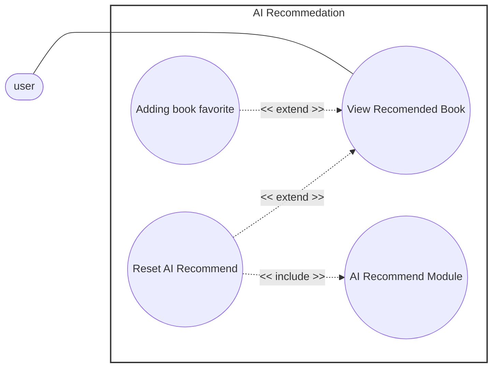

# Use-Case Specification – AI Recommendation

## 1. View Recommended Book

| Field | Description |
|---|---|
| **Use case ID** | UC-AIR-01 |
| **Use Case Name** | View Recommended Book |
| **Description** | Allows the user to view the list of books recommended by the AI recommendation engine. |
| **Actor(s)** | user (primary) |
| **Preconditions** | User is authenticated. |

### Main Flow
1. User navigates to the Recommended Book Dashboard (in Dashboard tab).
2. System retrieves the AI-generated list of recommended books.
3. System displays the recommended books to the user (10-15 books).
4. User can view the book detail in the list and save the interesting ones into favourits.

### Postconditions
- The AI-generated list of recommended books is displayed to the user.
- The ranking list is cached to speed up the response. 

### Alternative / Exception Flows
- **3a:** If the system encounters error in generating recommendation lists, it throw error notification.

### Postconditions (Alternative Flows)
- No-recommendations flow: No recommended books are displayed; user is informed that no recommendations are currently available.

### Special Requirements
- The displayed list should reflect the user's recent interest.
- The system tracks the user interaction with data (e.g. view details, add to wishlist, reserve...) to infer later recommendation. 

---

## 3. Reset AI Recommend

*Extends UC-AIR-01 (View Recommended Book) — extension point: regenerating the displayed recommendation list.*

*Includes UC-AIR-04 (AI Recommend Module).*

| Field | Description |
|---|---|
| **Use case ID** | UC-AIR-03 |
| **Use Case Name** | Reset AI Recommend |
| **Description** | Allows the user to reset the current recommendation results, triggering the AI Recommend Module to regenerate the recommendation list. |
| **Actor(s)** | user (primary) |
| **Preconditions** | User is viewing the recommended book list (UC-AIR-01). |

### Main Flow
1. While viewing the recommended book list, user selects "Reset AI Recommend".
2. System invokes the AI Recommend Module (UC-AIR-04) to regenerate the recommendation list.
3. AI Recommend Module processes the user's data and produces a new recommendation list.
4. System replaces the current recommendation list with the newly generated list.
5. System displays the updated recommended book list to the user.

### Postconditions
The user's recommendation list is regenerated and updated.

### Alternative / Exception Flows
- **2a:** If the AI Recommend Module fails to generate a new list, the system displays an error message and retains the previous recommendation list.

### Postconditions (Alternative Flows)
- Regeneration-failure flow: No changes are made to the existing recommendation list; user is notified of the failure.

### Special Requirements
- Reset requests may be rate-limited to prevent excessive regeneration.
- The newly generated candidates should not overlap the previous list. 
  
***

## 4. AI Recommend Module

| Field | Description |
|---|---|
| **Use case ID** | UC-AIR-04 |
| **Use Case Name** | AI Recommend Module |
| **Description** | This use case is included by UC-AIR-03 to generate a new AI-based book recommendation list for the user. |
| **Actor(s)** | system (internal) |
| **Preconditions** | User data relevant to recommendation generation (e.g., favorites, reading history, preferences) is available. |

### Main Flow
1. The invoking use case requests a new recommendation list.
2. System collects the user's relevant data (favorites, reading history, preferences).
3. System runs the AI recommendation model on the collected data.
4. System generates a new list of recommended books.
5. System returns the generated list to the invoking use case.

### Postconditions
A new recommendation list has been generated and returned to the invoking use case.

### Alternative / Exception Flows
- **2a:** If insufficient user data is available, the system generates a default/general recommendation list.
- **3a:** If model processing fails, the system returns an error to the invoking use case.

### Postconditions (Alternative Flows)
- Insufficient-data flow: A default recommendation list is generated and returned instead of a personalized list.
- Processing-failure flow: No new recommendation list is generated; the invoking use case is notified of the failure.

### Special Requirements
- Model processing time should be kept within an acceptable range to avoid noticeable delay to the user.

# Use case diagram

