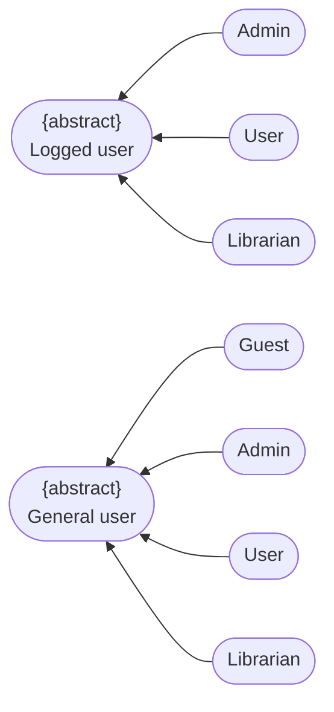
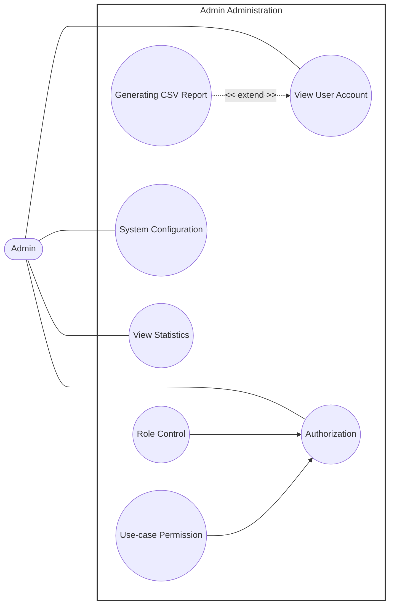

# Use-Case Specification: Admin Administration

**Group Name:** Amethyst

**Project Name:** Modern Library Management System

**Version:** 1.1

**Date:** 21-Jul-2026

**Document Identifier:** NGLP-SRS-ADM-001

---

## Revision History

| Date | Version | Description | Author |
| --- | --- | --- | --- |
| 21-Jul-2026 | 1.1 | Admin Administration use-case specifications (RUP specification layout) | Phan Lê Anh Minh, Trần Lê Hoàng Gia |

---

## Table of Contents
1. [Regulation](#regulation)
2. [Use case diagram](#use-case-diagram)
3. [UC-ADM-01: View User Account](#uc-adm-01-view-user-account)
4. [UC-ADM-02: Generating CSV Report](#uc-adm-02-generating-csv-report)
5. [UC-ADM-03: Authorization](#uc-adm-07-authorization)
6. [UC-ADM-04: Role Control](#uc-adm-05-role-control)
7. [UC-ADM-05: Use-case Permission](#uc-adm-06-use-case-permission)
8. [UC-ADM-06: System Configuration](#uc-adm-03-system-configuration)
9. [UC-ADM-07: View Statistics](#uc-adm-04-view-statistics)

---

## Regulation

---

## Use case diagram

---
## UC-ADM-01: View User Account

<table width="100%" border="1" cellpadding="8" cellspacing="0" style="border-collapse: collapse; font-family: Arial, sans-serif; font-size: 14px; border: 1px solid #d1d5db; margin-bottom: 20px;">
  <thead>
    <tr style="background-color: #1e3a8a; color: #ffffff;">
      <th colspan="2" style="text-align: left; padding: 12px; font-size: 16px;">
        Use Case: View User Account
      </th>
    </tr>
  </thead>
  <tbody>
    <tr>
      <td width="22%" style="background-color: #f8fafc; font-weight: bold; vertical-align: top;">Use Case ID</td>
      <td style="vertical-align: top;"><strong>UC-ADM-01</strong></td>
    </tr>
    <tr>
      <td style="background-color: #f8fafc; font-weight: bold; vertical-align: top;">Brief Description</td>
      <td style="vertical-align: top;">
        Allows the Admin to browse the list of registered user accounts and inspect the details of a selected account.
         <em>(Includes / Extends: <strong>Extended by Generating CSV Report (UC-ADM-02) at Step 5.</strong>)</em>
      </td>
    </tr>
    <tr>
      <td style="background-color: #f8fafc; font-weight: bold; vertical-align: top;">Actor(s)</td>
      <td style="vertical-align: top;">Admin</td>
    </tr>
    <tr>
      <td style="background-color: #f8fafc; font-weight: bold; vertical-align: top;">Preconditions</td>
      <td style="vertical-align: top;">
        <ul style="margin: 0; padding-left: 20px; line-height: 1.5;">
          <li><strong>Verified Authentication State:</strong> The Admin is authenticated.</li>
        </ul>
      </td>
    </tr>
    <tr>
      <td style="background-color: #f8fafc; font-weight: bold; vertical-align: top;">Flow of Events (Basic Flow)</td>
      <td style="vertical-align: top;">
        <ol style="margin: 0; padding-left: 20px; line-height: 1.6;">
          <li><strong>[Actor Action]:</strong> The Admin navigates to the User Account section.</li>
          <li><strong>[Data Processing]:</strong> The system retrieves the list of registered user accounts.</li>
          <li><strong>[Display Result]:</strong> The system displays the list of user accounts to the Admin.</li>
          <li><strong>[Actor Action]:</strong> The Admin selects a specific user account to inspect.</li>
          <li><strong>[Display Result]:</strong> The system retrieves and displays the detailed information of the selected account.</li>
        </ol>
      </td>
    </tr>
    <tr>
      <td style="background-color: #f8fafc; font-weight: bold; vertical-align: top;">Alternative / Exception Flows</td>
      <td style="vertical-align: top;">
        <ul style="margin: 0; padding-left: 20px; line-height: 1.5;">
          <li style="margin-bottom: 8px;">
            <strong>No User Accounts Exist (Step 2):</strong> If no user accounts exist in the system:
            <ol style="margin-top: 4px; margin-bottom: 4px; padding-left: 20px;">
              <li>The system displays an empty-state message instead of a list.</li>
            </ol>
            <strong>Postcondition (Alternative Flow):</strong> No account data is displayed; system state remains unchanged.
          </li>
          <li style="margin-bottom: 8px;">
            <strong>Selected Account No Longer Exists (Step 4):</strong> If the selected account no longer exists (e.g., it was deleted):
            <ol style="margin-top: 4px; margin-bottom: 4px; padding-left: 20px;">
              <li>The system displays an error message.</li>
              <li>The system returns the Admin to the account list; the Basic Flow resumes at step 3.</li>
            </ol>
            <strong>Postcondition (Alternative Flow):</strong> No detail view is rendered; the Admin remains on the account list.
          </li>
        </ul>
      </td>
    </tr>
    <tr>
      <td style="background-color: #f8fafc; font-weight: bold; vertical-align: top;">Postconditions</td>
      <td style="vertical-align: top;">
        <ul style="margin: 0; padding-left: 20px;">
          <li><strong>Account Details Displayed:</strong> The requested user account information is displayed to the Admin; no account data is modified.</li>
        </ul>
      </td>
    </tr>
    <tr>
      <td style="background-color: #f8fafc; font-weight: bold; vertical-align: top;">Special Requirements</td>
      <td style="vertical-align: top;">
        <ul style="margin: 0; padding-left: 20px;">
          <li><strong>Read-Only Access:</strong> This use case is strictly read-only; it must not permit modification of account data.</li>
          <li><strong>Sensitive Field Masking:</strong> Sensitive account fields (e.g., stored credentials) must not be exposed in the displayed details.</li>
        </ul>
      </td>
    </tr>
    <tr>
      <td style="background-color: #f8fafc; font-weight: bold; vertical-align: top;">Extension Points</td>
      <td style="vertical-align: top;">
        <ul style="margin: 0; padding-left: 20px;">
          <li><strong>Generating CSV Report:</strong> Location inside event flow: While account data is currently displayed (after Step 5).</li>
        </ul>
      </td>
    </tr>
    <tr>
      <td style="background-color: #f8fafc; font-weight: bold; vertical-align: top;">Prototype Screen</td>
      <td style="vertical-align: top;">
        
      </td>
    </tr>
  </tbody>
</table>

---

## UC-ADM-02: Generating CSV Report

<table width="100%" border="1" cellpadding="8" cellspacing="0" style="border-collapse: collapse; font-family: Arial, sans-serif; font-size: 14px; border: 1px solid #d1d5db; margin-bottom: 20px;">
  <thead>
    <tr style="background-color: #1e3a8a; color: #ffffff;">
      <th colspan="2" style="text-align: left; padding: 12px; font-size: 16px;">
        Use Case: Generating CSV Report
      </th>
    </tr>
  </thead>
  <tbody>
    <tr>
      <td width="22%" style="background-color: #f8fafc; font-weight: bold; vertical-align: top;">Use Case ID</td>
      <td style="vertical-align: top;"><strong>UC-ADM-02</strong></td>
    </tr>
    <tr>
      <td style="background-color: #f8fafc; font-weight: bold; vertical-align: top;">Brief Description</td>
      <td style="vertical-align: top;">
        Extends the account view to let the Admin export the currently displayed user account data into a downloadable CSV file.
         <em>(Includes / Extends: <strong>Extends View User Account (UC-ADM-01) — extension point: the Admin selects "Generate CSV Report" while account data is displayed.</strong>)</em>
      </td>
    </tr>
    <tr>
      <td style="background-color: #f8fafc; font-weight: bold; vertical-align: top;">Actor(s)</td>
      <td style="vertical-align: top;">Admin</td>
    </tr>
    <tr>
      <td style="background-color: #f8fafc; font-weight: bold; vertical-align: top;">Preconditions</td>
      <td style="vertical-align: top;">
        <ul style="margin: 0; padding-left: 20px; line-height: 1.5;">
          <li><strong>Active Base Context Display:</strong> The base use case `View User Account (UC-ADM-01)` must be currently active and displaying account data.</li>
        </ul>
      </td>
    </tr>
    <tr>
      <td style="background-color: #f8fafc; font-weight: bold; vertical-align: top;">Flow of Events (Basic Flow)</td>
      <td style="vertical-align: top;">
        <ol style="margin: 0; padding-left: 20px; line-height: 1.6;">
          <li><strong>[Actor Action]:</strong> While viewing user account data, the Admin selects the "Generate CSV Report" option.</li>
          <li><strong>[Data Processing]:</strong> The system compiles the currently displayed user account data into CSV format.</li>
          <li><strong>[Data Processing]:</strong> The system generates the CSV file.</li>
          <li><strong>[System Response]:</strong> The system prompts the Admin to download the generated file.</li>
          <li><strong>[Data Processing]:</strong> The system initiates the download.</li>
          <li><strong>[Display Result]:</strong> The system delivers the CSV file to the Admin.</li>
        </ol>
      </td>
    </tr>
    <tr>
      <td style="background-color: #f8fafc; font-weight: bold; vertical-align: top;">Alternative / Exception Flows</td>
      <td style="vertical-align: top;">
        <ul style="margin: 0; padding-left: 20px; line-height: 1.5;">
          <li style="margin-bottom: 8px;">
            <strong>No Data Available to Export (Step 2):</strong> If there is no data available to export:
            <ol style="margin-top: 4px; margin-bottom: 4px; padding-left: 20px;">
              <li>The system notifies the Admin that no report can be generated.</li>
            </ol>
            <strong>Postcondition (Alternative Flow):</strong> No CSV file is generated; the Admin remains on the current view.
          </li>
          <li style="margin-bottom: 8px;">
            <strong>File Generation Fails (Step 3):</strong> If the system encounters an internal error while generating the file:
            <ol style="margin-top: 4px; margin-bottom: 4px; padding-left: 20px;">
              <li>The system displays an error message; no file is produced.</li>
            </ol>
            <strong>Postcondition (Alternative Flow):</strong> No CSV file is produced; the Admin is notified of the failure.
          </li>
        </ul>
      </td>
    </tr>
    <tr>
      <td style="background-color: #f8fafc; font-weight: bold; vertical-align: top;">Postconditions</td>
      <td style="vertical-align: top;">
        <ul style="margin: 0; padding-left: 20px;">
          <li><strong>CSV File Delivered:</strong> A CSV file containing the requested user account data is generated and made available to the Admin.</li>
        </ul>
      </td>
    </tr>
    <tr>
      <td style="background-color: #f8fafc; font-weight: bold; vertical-align: top;">Special Requirements</td>
      <td style="vertical-align: top;">
        <ul style="margin: 0; padding-left: 20px;">
          <li><strong>Sensitive Field Exclusion:</strong> Exported CSV files must exclude sensitive fields such as passwords or authentication tokens.</li>
          <li><strong>Encoding Standard:</strong> The CSV file must use a standard, widely-compatible encoding (e.g., UTF-8).</li>
        </ul>
      </td>
    </tr>
    <tr>
      <td style="background-color: #f8fafc; font-weight: bold; vertical-align: top;">Extension Points</td>
      <td style="vertical-align: top;">
        None
      </td>
    </tr>
    <tr>
      <td style="background-color: #f8fafc; font-weight: bold; vertical-align: top;">Prototype Screen</td>
      <td style="vertical-align: top;">
        
      </td>
    </tr>
  </tbody>
</table>

---

## UC-ADM-03: Authorization

<table width="100%" border="1" cellpadding="8" cellspacing="0" style="border-collapse: collapse; font-family: Arial, sans-serif; font-size: 14px; border: 1px solid #d1d5db; margin-bottom: 20px;">
  <thead>
    <tr style="background-color: #1e3a8a; color: #ffffff;">
      <th colspan="2" style="text-align: left; padding: 12px; font-size: 16px;">
        Use Case: Authorization
      </th>
    </tr>
  </thead>
  <tbody>
    <tr>
      <td width="22%" style="background-color: #f8fafc; font-weight: bold; vertical-align: top;">Use Case ID</td>
      <td style="vertical-align: top;"><strong>UC-ADM-03</strong></td>
    </tr>
    <tr>
      <td style="background-color: #f8fafc; font-weight: bold; vertical-align: top;">Brief Description</td>
      <td style="vertical-align: top;">
        Verifies the Admin's identity and permission to perform a requested administrative function. Invoked internally by other use cases.
         <em>(Includes / Extends: <strong>Included by Role Control (UC-ADM-05) and Use-case Permission (UC-ADM-06).</strong>)</em>
      </td>
    </tr>
    <tr>
      <td style="background-color: #f8fafc; font-weight: bold; vertical-align: top;">Actor(s)</td>
      <td style="vertical-align: top;">Admin</td>
    </tr>
    <tr>
      <td style="background-color: #f8fafc; font-weight: bold; vertical-align: top;">Preconditions</td>
      <td style="vertical-align: top;">
        <ul style="margin: 0; padding-left: 20px; line-height: 1.5;">
          <li><strong>Valid Credentials or Session:</strong> The Admin possesses valid credentials or an active session.</li>
        </ul>
      </td>
    </tr>
    <tr>
      <td style="background-color: #f8fafc; font-weight: bold; vertical-align: top;">Flow of Events (Basic Flow)</td>
      <td style="vertical-align: top;">
        <ol style="margin: 0; padding-left: 20px; line-height: 1.6;">
          <li><strong>[Actor Action]:</strong> The invoking use case requests authorization.</li>
          <li><strong>[Data Processing]:</strong> The system validates the Admin's credentials or session token.</li>
          <li><strong>[Data Processing]:</strong> The system retrieves the Admin's assigned roles and permissions.</li>
          <li><strong>[Data Processing]:</strong> The system evaluates whether the Admin is authorized for the requested function.</li>
          <li><strong>[System Response]:</strong> The system returns the authorization result to the invoking use case.</li>
        </ol>
      </td>
    </tr>
    <tr>
      <td style="background-color: #f8fafc; font-weight: bold; vertical-align: top;">Alternative / Exception Flows</td>
      <td style="vertical-align: top;">
        <ul style="margin: 0; padding-left: 20px; line-height: 1.5;">
          <li style="margin-bottom: 8px;">
            <strong>Invalid Credentials or Session (Step 2):</strong> If the credentials or session are invalid:
            <ol style="margin-top: 4px; margin-bottom: 4px; padding-left: 20px;">
              <li>The system denies access and displays an authentication error.</li>
              <li>The failed attempt is logged.</li>
            </ol>
            <strong>Postcondition (Alternative Flow):</strong> Access is denied; the failed attempt is logged.
          </li>
          <li style="margin-bottom: 8px;">
            <strong>Insufficient Permission (Step 4):</strong> If the Admin lacks sufficient permission for the requested function:
            <ol style="margin-top: 4px; margin-bottom: 4px; padding-left: 20px;">
              <li>The system denies access and displays an authorization error.</li>
              <li>The attempt is logged.</li>
            </ol>
            <strong>Postcondition (Alternative Flow):</strong> Access to the requested function is denied; the attempt is logged.
          </li>
        </ul>
      </td>
    </tr>
    <tr>
      <td style="background-color: #f8fafc; font-weight: bold; vertical-align: top;">Postconditions</td>
      <td style="vertical-align: top;">
        <ul style="margin: 0; padding-left: 20px;">
          <li><strong>Authorization Result Determined:</strong> The Admin's authorization status has been determined and returned to the invoking use case.</li>
        </ul>
      </td>
    </tr>
    <tr>
      <td style="background-color: #f8fafc; font-weight: bold; vertical-align: top;">Special Requirements</td>
      <td style="vertical-align: top;">
        <ul style="margin: 0; padding-left: 20px;">
          <li><strong>Secure Credential Validation:</strong> Credential validation must be performed securely.</li>
          <li><strong>Audit Logging:</strong> Failed authorization attempts must be logged for security auditing.</li>
          <li><strong>Session Timeout Policy:</strong> Sessions must be subject to a defined timeout policy.</li>
        </ul>
      </td>
    </tr>
    <tr>
      <td style="background-color: #f8fafc; font-weight: bold; vertical-align: top;">Extension Points</td>
      <td style="vertical-align: top;">
        None
      </td>
    </tr>
    <tr>
      <td style="background-color: #f8fafc; font-weight: bold; vertical-align: top;">Prototype Screen</td>
      <td style="vertical-align: top;">
        
      </td>
    </tr>
  </tbody>
</table>

---

## UC-ADM-04: Role Control

<table width="100%" border="1" cellpadding="8" cellspacing="0" style="border-collapse: collapse; font-family: Arial, sans-serif; font-size: 14px; border: 1px solid #d1d5db; margin-bottom: 20px;">
  <thead>
    <tr style="background-color: #1e3a8a; color: #ffffff;">
      <th colspan="2" style="text-align: left; padding: 12px; font-size: 16px;">
        Use Case: Role Control
      </th>
    </tr>
  </thead>
  <tbody>
    <tr>
      <td width="22%" style="background-color: #f8fafc; font-weight: bold; vertical-align: top;">Use Case ID</td>
      <td style="vertical-align: top;"><strong>UC-ADM-04</strong></td>
    </tr>
    <tr>
      <td style="background-color: #f8fafc; font-weight: bold; vertical-align: top;">Brief Description</td>
      <td style="vertical-align: top;">
        Allows the Admin to create, modify, and delete roles within the system.
         <em>(Includes / Extends: <strong>Includes Authorization (UC-ADM-07).</strong>)</em>
      </td>
    </tr>
    <tr>
      <td style="background-color: #f8fafc; font-weight: bold; vertical-align: top;">Actor(s)</td>
      <td style="vertical-align: top;">Admin</td>
    </tr>
    <tr>
      <td style="background-color: #f8fafc; font-weight: bold; vertical-align: top;">Preconditions</td>
      <td style="vertical-align: top;">
        <ul style="margin: 0; padding-left: 20px; line-height: 1.5;">
          <li><strong>Verified Authentication State:</strong> The Admin is authenticated.</li>
        </ul>
      </td>
    </tr>
    <tr>
      <td style="background-color: #f8fafc; font-weight: bold; vertical-align: top;">Flow of Events (Basic Flow)</td>
      <td style="vertical-align: top;">
        <ol style="margin: 0; padding-left: 20px; line-height: 1.6;">
          <li><strong>[Actor Action]:</strong> The Admin navigates to the Role Control section.</li>
          <li><strong>[Data Processing]:</strong> The system invokes `Authorization (UC-ADM-07)` to verify the Admin's permission to manage roles.</li>
          <li><strong>[Display Result]:</strong> Upon successful authorization, the system displays the list of existing roles.</li>
          <li><strong>[Actor Action]:</strong> The Admin creates, edits, or deletes a role.</li>
          <li><strong>[Data Processing]:</strong> The system validates the submitted role data.</li>
          <li><strong>[Data Processing]:</strong> The system saves the changes and confirms the update to the Admin.</li>
        </ol>
      </td>
    </tr>
    <tr>
      <td style="background-color: #f8fafc; font-weight: bold; vertical-align: top;">Alternative / Exception Flows</td>
      <td style="vertical-align: top;">
        <ul style="margin: 0; padding-left: 20px; line-height: 1.5;">
          <li style="margin-bottom: 8px;">
            <strong>Authorization Fails (Step 2):</strong> If `Authorization (UC-ADM-07)` denies access:
            <ol style="margin-top: 4px; margin-bottom: 4px; padding-left: 20px;">
              <li>The use case terminates.</li>
            </ol>
            <strong>Postcondition (Alternative Flow):</strong> No role data is displayed or modified; access is denied.
          </li>
          <li style="margin-bottom: 8px;">
            <strong>Validation Fails (Step 5):</strong> If the submitted data is invalid (e.g., duplicate role name):
            <ol style="margin-top: 4px; margin-bottom: 4px; padding-left: 20px;">
              <li>The system displays an error and prompts the Admin for correction.</li>
              <li>The Admin resubmits corrected data; the Basic Flow resumes at step 5.</li>
            </ol>
            <strong>Postcondition (Alternative Flow):</strong> No role changes are saved; the Admin is prompted to correct the input.
          </li>
        </ul>
      </td>
    </tr>
    <tr>
      <td style="background-color: #f8fafc; font-weight: bold; vertical-align: top;">Postconditions</td>
      <td style="vertical-align: top;">
        <ul style="margin: 0; padding-left: 20px;">
          <li><strong>Role Data Persisted:</strong> Role data is created, updated, or deleted and persisted in the system.</li>
        </ul>
      </td>
    </tr>
    <tr>
      <td style="background-color: #f8fafc; font-weight: bold; vertical-align: top;">Special Requirements</td>
      <td style="vertical-align: top;">
        <ul style="margin: 0; padding-left: 20px;">
          <li><strong>Audit Logging:</strong> Role modifications must be logged for audit purposes.</li>
          <li><strong>Unique Role Names:</strong> Role names must be unique within the system.</li>
        </ul>
      </td>
    </tr>
    <tr>
      <td style="background-color: #f8fafc; font-weight: bold; vertical-align: top;">Extension Points</td>
      <td style="vertical-align: top;">
        None
      </td>
    </tr>
    <tr>
      <td style="background-color: #f8fafc; font-weight: bold; vertical-align: top;">Prototype Screen</td>
      <td style="vertical-align: top;">
        
      </td>
    </tr>
  </tbody>
</table>

---

## UC-ADM-05: Use-case Permission

<table width="100%" border="1" cellpadding="8" cellspacing="0" style="border-collapse: collapse; font-family: Arial, sans-serif; font-size: 14px; border: 1px solid #d1d5db; margin-bottom: 20px;">
  <thead>
    <tr style="background-color: #1e3a8a; color: #ffffff;">
      <th colspan="2" style="text-align: left; padding: 12px; font-size: 16px;">
        Use Case: Use-case Permission
      </th>
    </tr>
  </thead>
  <tbody>
    <tr>
      <td width="22%" style="background-color: #f8fafc; font-weight: bold; vertical-align: top;">Use Case ID</td>
      <td style="vertical-align: top;"><strong>UC-ADM-05</strong></td>
    </tr>
    <tr>
      <td style="background-color: #f8fafc; font-weight: bold; vertical-align: top;">Brief Description</td>
      <td style="vertical-align: top;">
        Allows the Admin to assign or modify the permissions required to access specific use cases or system functions.
         <em>(Includes / Extends: <strong>Includes Authorization (UC-ADM-07).</strong>)</em>
      </td>
    </tr>
    <tr>
      <td style="background-color: #f8fafc; font-weight: bold; vertical-align: top;">Actor(s)</td>
      <td style="vertical-align: top;">Admin</td>
    </tr>
    <tr>
      <td style="background-color: #f8fafc; font-weight: bold; vertical-align: top;">Preconditions</td>
      <td style="vertical-align: top;">
        <ul style="margin: 0; padding-left: 20px; line-height: 1.5;">
          <li><strong>Verified Authentication State:</strong> The Admin is authenticated.</li>
        </ul>
      </td>
    </tr>
    <tr>
      <td style="background-color: #f8fafc; font-weight: bold; vertical-align: top;">Flow of Events (Basic Flow)</td>
      <td style="vertical-align: top;">
        <ol style="margin: 0; padding-left: 20px; line-height: 1.6;">
          <li><strong>[Actor Action]:</strong> The Admin navigates to the Use-case Permission section.</li>
          <li><strong>[Data Processing]:</strong> The system invokes `Authorization (UC-ADM-07)` to verify the Admin's permission to manage use-case permissions.</li>
          <li><strong>[Display Result]:</strong> Upon successful authorization, the system displays the list of use cases along with their current permission settings.</li>
          <li><strong>[Actor Action]:</strong> The Admin modifies the permission configuration for a selected use case.</li>
          <li><strong>[Data Processing]:</strong> The system validates the submitted configuration.</li>
          <li><strong>[Data Processing]:</strong> The system saves the changes and confirms the update to the Admin.</li>
        </ol>
      </td>
    </tr>
    <tr>
      <td style="background-color: #f8fafc; font-weight: bold; vertical-align: top;">Alternative / Exception Flows</td>
      <td style="vertical-align: top;">
        <ul style="margin: 0; padding-left: 20px; line-height: 1.5;">
          <li style="margin-bottom: 8px;">
            <strong>Authorization Fails (Step 2):</strong> If `Authorization (UC-ADM-07)` denies access:
            <ol style="margin-top: 4px; margin-bottom: 4px; padding-left: 20px;">
              <li>The use case terminates.</li>
            </ol>
            <strong>Postcondition (Alternative Flow):</strong> No permission data is displayed or modified; access is denied.
          </li>
          <li style="margin-bottom: 8px;">
            <strong>Invalid Configuration (Step 5):</strong> If the submitted configuration is invalid:
            <ol style="margin-top: 4px; margin-bottom: 4px; padding-left: 20px;">
              <li>The system displays an error and does not save the change.</li>
              <li>The Admin resubmits a corrected configuration; the Basic Flow resumes at step 5.</li>
            </ol>
            <strong>Postcondition (Alternative Flow):</strong> No permission changes are saved; the Admin is prompted to correct the configuration.
          </li>
        </ul>
      </td>
    </tr>
    <tr>
      <td style="background-color: #f8fafc; font-weight: bold; vertical-align: top;">Postconditions</td>
      <td style="vertical-align: top;">
        <ul style="margin: 0; padding-left: 20px;">
          <li><strong>Permission Settings Persisted:</strong> Use-case permission settings are updated and persisted in the system.</li>
        </ul>
      </td>
    </tr>
    <tr>
      <td style="background-color: #f8fafc; font-weight: bold; vertical-align: top;">Special Requirements</td>
      <td style="vertical-align: top;">
        <ul style="margin: 0; padding-left: 20px;">
          <li><strong>Audit Logging:</strong> Permission changes must be logged for audit purposes.</li>
          <li><strong>Change Propagation:</strong> Permission changes should take effect immediately or, at minimum, upon the affected user's next session.</li>
        </ul>
      </td>
    </tr>
    <tr>
      <td style="background-color: #f8fafc; font-weight: bold; vertical-align: top;">Extension Points</td>
      <td style="vertical-align: top;">
        None
      </td>
    </tr>
    <tr>
      <td style="background-color: #f8fafc; font-weight: bold; vertical-align: top;">Prototype Screen</td>
      <td style="vertical-align: top;">
        
      </td>
    </tr>
  </tbody>
</table>

---

## UC-ADM-06: System Configuration

<table width="100%" border="1" cellpadding="8" cellspacing="0" style="border-collapse: collapse; font-family: Arial, sans-serif; font-size: 14px; border: 1px solid #d1d5db; margin-bottom: 20px;">
  <thead>
    <tr style="background-color: #1e3a8a; color: #ffffff;">
      <th colspan="2" style="text-align: left; padding: 12px; font-size: 16px;">
        Use Case: System Configuration
      </th>
    </tr>
  </thead>
  <tbody>
    <tr>
      <td width="22%" style="background-color: #f8fafc; font-weight: bold; vertical-align: top;">Use Case ID</td>
      <td style="vertical-align: top;"><strong>UC-ADM-06</strong></td>
    </tr>
    <tr>
      <td style="background-color: #f8fafc; font-weight: bold; vertical-align: top;">Brief Description</td>
      <td style="vertical-align: top;">
        Allows the Admin to view and modify system-wide configuration settings.
      </td>
    </tr>
    <tr>
      <td style="background-color: #f8fafc; font-weight: bold; vertical-align: top;">Actor(s)</td>
      <td style="vertical-align: top;">Admin</td>
    </tr>
    <tr>
      <td style="background-color: #f8fafc; font-weight: bold; vertical-align: top;">Preconditions</td>
      <td style="vertical-align: top;">
        <ul style="margin: 0; padding-left: 20px; line-height: 1.5;">
          <li><strong>Verified Authentication State:</strong> The Admin is authenticated and holds sufficient privileges to access system configuration.</li>
        </ul>
      </td>
    </tr>
    <tr>
      <td style="background-color: #f8fafc; font-weight: bold; vertical-align: top;">Flow of Events (Basic Flow)</td>
      <td style="vertical-align: top;">
        <ol style="margin: 0; padding-left: 20px; line-height: 1.6;">
          <li><strong>[Actor Action]:</strong> The Admin navigates to the System Configuration section.</li>
          <li><strong>[Data Processing]:</strong> The system retrieves the current configuration settings.</li>
          <li><strong>[Display Result]:</strong> The system displays the settings to the Admin.</li>
          <li><strong>[Actor Action]:</strong> The Admin modifies one or more configuration values.</li>
          <li><strong>[Data Processing]:</strong> The system validates the submitted values.</li>
          <li><strong>[Data Processing]:</strong> The system saves the updated configuration.</li>
        </ol>
      </td>
    </tr>
    <tr>
      <td style="background-color: #f8fafc; font-weight: bold; vertical-align: top;">Alternative / Exception Flows</td>
      <td style="vertical-align: top;">
        <ul style="margin: 0; padding-left: 20px; line-height: 1.5;">
          <li style="margin-bottom: 8px;">
            <strong>Invalid Configuration Value (Step 5):</strong> If a submitted value is invalid:
            <ol style="margin-top: 4px; margin-bottom: 4px; padding-left: 20px;">
              <li>The system displays a validation error and does not save the change.</li>
              <li>The Admin resubmits a corrected value; the Basic Flow resumes at step 5.</li>
            </ol>
            <strong>Postcondition (Alternative Flow):</strong> Configuration remains unchanged; the Admin is prompted to correct the invalid value.
          </li>
        </ul>
      </td>
    </tr>
    <tr>
      <td style="background-color: #f8fafc; font-weight: bold; vertical-align: top;">Postconditions</td>
      <td style="vertical-align: top;">
        <ul style="margin: 0; padding-left: 20px;">
          <li><strong>Configuration Updated:</strong> The system configuration is updated and the new settings take effect.</li>
        </ul>
      </td>
    </tr>
    <tr>
      <td style="background-color: #f8fafc; font-weight: bold; vertical-align: top;">Special Requirements</td>
      <td style="vertical-align: top;">
        <ul style="margin: 0; padding-left: 20px;">
          <li><strong>Audit Logging:</strong> Configuration changes should be logged for audit purposes.</li>
          <li><strong>Restart Dependency:</strong> Certain configuration changes may require a system restart or reload to take full effect.</li>
        </ul>
      </td>
    </tr>
    <tr>
      <td style="background-color: #f8fafc; font-weight: bold; vertical-align: top;">Extension Points</td>
      <td style="vertical-align: top;">
        None
      </td>
    </tr>
    <tr>
      <td style="background-color: #f8fafc; font-weight: bold; vertical-align: top;">Prototype Screen</td>
      <td style="vertical-align: top;">
        
      </td>
    </tr>
  </tbody>
</table>

---

## UC-ADM-07: View Statistics

<table width="100%" border="1" cellpadding="8" cellspacing="0" style="border-collapse: collapse; font-family: Arial, sans-serif; font-size: 14px; border: 1px solid #d1d5db; margin-bottom: 20px;">
  <thead>
    <tr style="background-color: #1e3a8a; color: #ffffff;">
      <th colspan="2" style="text-align: left; padding: 12px; font-size: 16px;">
        Use Case: View Statistics
      </th>
    </tr>
  </thead>
  <tbody>
    <tr>
      <td width="22%" style="background-color: #f8fafc; font-weight: bold; vertical-align: top;">Use Case ID</td>
      <td style="vertical-align: top;"><strong>UC-ADM-07</strong></td>
    </tr>
    <tr>
      <td style="background-color: #f8fafc; font-weight: bold; vertical-align: top;">Brief Description</td>
      <td style="vertical-align: top;">
        Allows the Admin to view system usage and operational statistics.
      </td>
    </tr>
    <tr>
      <td style="background-color: #f8fafc; font-weight: bold; vertical-align: top;">Actor(s)</td>
      <td style="vertical-align: top;">Admin</td>
    </tr>
    <tr>
      <td style="background-color: #f8fafc; font-weight: bold; vertical-align: top;">Preconditions</td>
      <td style="vertical-align: top;">
        <ul style="margin: 0; padding-left: 20px; line-height: 1.5;">
          <li><strong>Verified Authentication State:</strong> The Admin is authenticated and holds sufficient privileges to access system statistics.</li>
        </ul>
      </td>
    </tr>
    <tr>
      <td style="background-color: #f8fafc; font-weight: bold; vertical-align: top;">Flow of Events (Basic Flow)</td>
      <td style="vertical-align: top;">
        <ol style="margin: 0; padding-left: 20px; line-height: 1.6;">
          <li><strong>[Actor Action]:</strong> The Admin navigates to the Statistics section.</li>
          <li><strong>[Data Processing]:</strong> The system aggregates relevant statistical data.</li>
          <li><strong>[Display Result]:</strong> The system displays the statistics to the Admin.</li>
          <li><strong>[Actor Action]:</strong> The Admin optionally filters the statistics by date range or category.</li>
          <li><strong>[Display Result]:</strong> The system updates the displayed statistics based on the selected filter.</li>
        </ol>
      </td>
    </tr>
    <tr>
      <td style="background-color: #f8fafc; font-weight: bold; vertical-align: top;">Alternative / Exception Flows</td>
      <td style="vertical-align: top;">
        <ul style="margin: 0; padding-left: 20px; line-height: 1.5;">
          <li style="margin-bottom: 8px;">
            <strong>No Data Available for Requested Period or Category (Step 2):</strong> If no data is available for the requested period or category:
            <ol style="margin-top: 4px; margin-bottom: 4px; padding-left: 20px;">
              <li>The system displays an empty-state message.</li>
            </ol>
            <strong>Postcondition (Alternative Flow):</strong> No statistical data is displayed; the Admin remains on the Statistics section.
          </li>
        </ul>
      </td>
    </tr>
    <tr>
      <td style="background-color: #f8fafc; font-weight: bold; vertical-align: top;">Postconditions</td>
      <td style="vertical-align: top;">
        <ul style="margin: 0; padding-left: 20px;">
          <li><strong>Statistics Displayed:</strong> The requested statistics are displayed to the Admin.</li>
        </ul>
      </td>
    </tr>
    <tr>
      <td style="background-color: #f8fafc; font-weight: bold; vertical-align: top;">Special Requirements</td>
      <td style="vertical-align: top;">
        <ul style="margin: 0; padding-left: 20px;">
          <li><strong>Read-Only Access:</strong> This use case is strictly read-only.</li>
          <li><strong>Data Freshness:</strong> Displayed statistics should reflect a defined refresh interval or be clearly timestamped.</li>
        </ul>
      </td>
    </tr>
    <tr>
      <td style="background-color: #f8fafc; font-weight: bold; vertical-align: top;">Extension Points</td>
      <td style="vertical-align: top;">
        None
      </td>
    </tr>
    <tr>
      <td style="background-color: #f8fafc; font-weight: bold; vertical-align: top;">Prototype Screen</td>
      <td style="vertical-align: top;">
        
      </td>
    </tr>
  </tbody>
</table>
