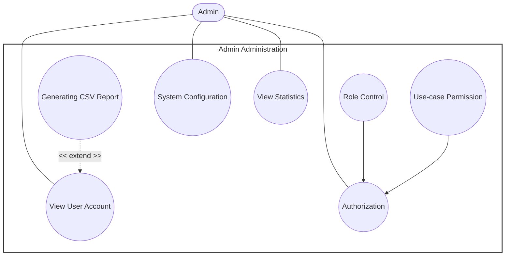

# Use-Case Specification – Admin Administration

## 1. View User Account

| Field | Description |
|---|---|
| **Use case ID** | UC-ADM-01 |
| **Use Case Name** | View User Account |
| **Description** | Enables the Admin to browse and inspect the details of user accounts registered in the system. |
| **Actor(s)** | Admin (primary) |
| **Preconditions** | Admin is authenticated. |

### Main Flow
1. Admin navigates to the User Account section.
2. System retrieves the list of registered user accounts.
3. System displays the list of user accounts to the Admin.
4. Admin selects a specific user account to inspect.
5. System retrieves and displays the detailed information of the selected account.

### Postconditions
The requested user account information is successfully displayed to the Admin. No account data is modified.

### Alternative / Exception Flows
- **2a:** If no user accounts exist in the system, the system displays an empty-state message instead of a list.
- **4a:** If the selected account no longer exists (e.g., was deleted), the system displays an error message and returns the Admin to the account list.

### Postconditions (Alternative Flows)
- Empty-state flow: No account data is displayed; system state remains unchanged.
- Deleted-account flow: No detail view is rendered; Admin remains on the account list.

### Special Requirements
- This use case is strictly read-only; it must not permit modification of account data.
- Sensitive account fields (e.g., stored credentials) must not be exposed in the displayed details.

---

## 2. Generating CSV Report

*Extends UC-ADM-01 (View User Account) — extension point: exporting the currently displayed user account data.*

| Field | Description |
|---|---|
| **Use case ID** | UC-ADM-02 |
| **Use Case Name** | Generating CSV Report |
| **Description** | Allows the Admin to export currently displayed user account data into a downloadable CSV file. |
| **Actor(s)** | Admin (primary) |
| **Preconditions** | Admin is currently viewing user account data (UC-ADM-01). |

### Main Flow
1. While viewing user account data, Admin selects the "Generate CSV Report" option.
2. System compiles the currently displayed user account data into CSV format.
3. System generates the CSV file.
4. System prompts the Admin to download the generated file.
5. System initiates the download.
6. System delivers the CSV file to the Admin.

### Postconditions
A CSV file containing the requested user account data is generated and made available to the Admin.

### Alternative / Exception Flows
- **2a:** If there is no data available to export, the system notifies the Admin that no report can be generated.
- **3a:** If file generation fails (e.g., internal error), the system displays an error message and no file is produced.

### Postconditions (Alternative Flows)
- No-data flow: No CSV file is generated; Admin remains on the current view.
- Generation-failure flow: No CSV file is produced; Admin is notified of the failure.

### Special Requirements
- Exported CSV files must exclude sensitive fields such as passwords or authentication tokens.
- The CSV file must use a standard, widely-compatible encoding (e.g., UTF-8).

---

## 3. System Configuration

| Field | Description |
|---|---|
| **Use case ID** | UC-ADM-03 |
| **Use Case Name** | System Configuration |
| **Description** | Allows the Admin to view and modify system-wide configuration settings. |
| **Actor(s)** | Admin (primary) |
| **Preconditions** | Admin is authenticated and holds sufficient privileges to access system configuration. |

### Main Flow
1. Admin navigates to the System Configuration section.
2. System retrieves the current configuration settings.
3. System displays the settings to the Admin.
4. Admin modifies one or more configuration values.
5. System validates the submitted values.
6. System saves the updated configuration.

### Postconditions
The system configuration is updated and the new settings take effect.

### Alternative / Exception Flows
- **5a:** If a submitted value is invalid, the system displays a validation error and does not save the change.

### Postconditions (Alternative Flows)
- Validation-failure flow: Configuration remains unchanged; Admin is prompted to correct the invalid value.

### Special Requirements
- Configuration changes should be logged for audit purposes.
- Certain configuration changes may require a system restart or reload to take full effect.

---

## 4. View Statistics

| Field | Description |
|---|---|
| **Use case ID** | UC-ADM-04 |
| **Use Case Name** | View Statistics |
| **Description** | Allows the Admin to view system usage and operational statistics. |
| **Actor(s)** | Admin (primary) |
| **Preconditions** | Admin is authenticated and holds sufficient privileges to access system statistics. |

### Main Flow
1. Admin navigates to the Statistics section.
2. System aggregates relevant statistical data.
3. System displays the statistics to the Admin.
4. Admin optionally filters the statistics by date range or category.
5. System updates the displayed statistics based on the selected filter.

### Postconditions
The requested statistics are successfully displayed to the Admin.

### Alternative / Exception Flows
- **2a:** If no data is available for the requested period or category, the system displays an empty-state message.

### Postconditions (Alternative Flows)
- No-data flow: No statistical data is displayed; Admin remains on the Statistics section.

### Special Requirements
- This use case is strictly read-only.
- Displayed statistics should reflect a defined refresh interval or be clearly timestamped.

---

## 5. Role Control

*Includes UC-ADM-07 (Authorization).*

| Field | Description |
|---|---|
| **Use case ID** | UC-ADM-05 |
| **Use Case Name** | Role Control |
| **Description** | Allows the Admin to create, modify, and delete roles within the system. |
| **Actor(s)** | Admin (primary) |
| **Preconditions** | Admin is authenticated. |

### Main Flow
1. Admin navigates to the Role Control section.
2. System invokes the Authorization use case (UC-ADM-07) to verify the Admin's permission to manage roles.
3. Upon successful authorization, system displays the list of existing roles.
4. Admin creates, edits, or deletes a role.
5. System validates the submitted role data.
6. System saves the changes and confirms the update to the Admin.

### Postconditions
Role data is created, updated, or deleted and persisted in the system.

### Alternative / Exception Flows
- **2a:** If authorization fails, the system denies access and terminates the use case.
- **5a:** If validation fails (e.g., duplicate role name), the system displays an error and prompts the Admin for correction.

### Postconditions (Alternative Flows)
- Authorization-failure flow: No role data is displayed or modified; access is denied.
- Validation-failure flow: No role changes are saved; Admin is prompted to correct the input.

### Special Requirements
- Role modifications must be logged for audit purposes.
- Role names must be unique within the system.

---

## 6. Use-case Permission

*Includes UC-ADM-07 (Authorization).*

| Field | Description |
|---|---|
| **Use case ID** | UC-ADM-06 |
| **Use Case Name** | Use-case Permission |
| **Description** | Allows the Admin to assign or modify the permissions required to access specific use cases or system functions. |
| **Actor(s)** | Admin (primary) |
| **Preconditions** | Admin is authenticated. |

### Main Flow
1. Admin navigates to the Use-case Permission section.
2. System invokes the Authorization use case (UC-ADM-07) to verify the Admin's permission to manage use-case permissions.
3. Upon successful authorization, system displays the list of use cases along with their current permission settings.
4. Admin modifies the permission configuration for a selected use case.
5. System validates the submitted configuration.
6. System saves the changes and confirms the update to the Admin.

### Postconditions
Use-case permission settings are updated and persisted in the system.

### Alternative / Exception Flows
- **2a:** If authorization fails, the system denies access and terminates the use case.
- **5a:** If the submitted configuration is invalid, the system displays an error and does not save the change.

### Postconditions (Alternative Flows)
- Authorization-failure flow: No permission data is displayed or modified; access is denied.
- Validation-failure flow: No permission changes are saved; Admin is prompted to correct the configuration.

### Special Requirements
- Permission changes must be logged for audit purposes.
- Permission changes should take effect immediately or, at minimum, upon the affected user's next session.

---

## 7. Authorization

| Field | Description |
|---|---|
| **Use case ID** | UC-ADM-07 |
| **Use Case Name** | Authorization |
| **Description** | This use case is included by UC-ADM-05 and UC-ADM-06 to verify the Admin's authorization. |
| **Actor(s)** | Admin (primary) |
| **Preconditions** | Admin possesses valid credentials or an active session. |

### Main Flow
1. The invoking use case requests authorization.
2. System validates the Admin's credentials or session token.
3. System retrieves the Admin's assigned roles and permissions.
4. System evaluates whether the Admin is authorized for the requested function.
5. System returns the authorization result to the invoking use case.

### Postconditions
The Admin's authorization status has been determined.

### Alternative / Exception Flows
- **2a:** If credentials or session are invalid, the system denies access and displays an authentication error.
- **4a:** If the Admin lacks sufficient permission for the requested function, the system denies access and displays an authorization error.

### Postconditions (Alternative Flows)
- Invalid-credentials flow: Access is denied; the failed attempt is logged.
- Insufficient-permission flow: Access to the requested function is denied; the attempt is logged.

### Special Requirements
- Credential validation must be performed securely.
- Failed authorization attempts must be logged for security auditing.
- Sessions must be subject to a defined timeout policy.

# Use case diagram

