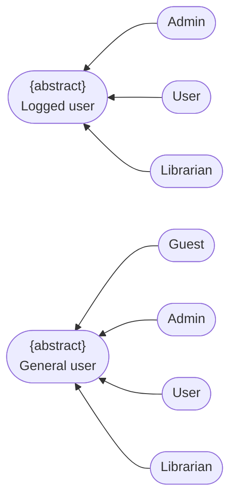

# Use-Case Specification: Authentication

**Group Name:** Amethyst

**Project Name:** Modern Library Management System

**Version:** 1.1

**Date:** 20-Jul-2026

**Document Identifier:** NGLP-SRS-AUTH-001

---

## Revision History

| Date | Version | Description | Author |
| --- | --- | --- | --- |
| 20-Jul-2026 | 1.1 | Authentication Use case specificaiton (RUP format layout). | Anh Minh, Hoang Gia |

---

## Table of Contents
1. [Regulation](#regulation)
2. [Use case diagram](#use-case-diagram)
3. [UC-AUTH-01: Register](#uc-auth-01-register)
4. [UC-AUTH-03: Google OAuth](#uc-auth-02-verify-by-email)
5. [UC-AUTH-04: Login](#uc-auth-03-google-oauth)
6. [UC-AUTH-05: Forget Password](#uc-auth-04-login)
7. [UC-AUTH-02: Verify By Email](#uc-auth-05-forget-password)
8. [UC-AUTH-06: Verify By OTP](#uc-auth-06-verify-by-otp)
9. [UC-AUTH-07: Change Password](#uc-auth-07-change-password)
    
---

## Regulation

---

## Use case diagram

---

## UC-AUTH-01: Register

*Includes UC-AUTH-02 (Verify By Email).* 

### 1. Use-Case Name

Register 

#### 1.1 Brief Description

Allows a new guest user to create an account within the system by providing an email address and creating a secure password. 

### 2. Flow of Events

#### 2.1 Basic Flow

1. **[Actor Action]**: The user enters their name, email address, password, and password confirmation into the designated registration fields. 
2. **[Actor Action]**: The user submits the registration form. 
3. **[Data Processing]**: The system validates that the email format is correct and checks the database to verify the email is not already associated with an existing account. 
4. **[System Response]**: The system executes the mandatory include sub-routine **Verify By Email (UC-AUTH-02)** to issue a verification link. 
5. **[Data Processing]**: The system hashes the password using a secure cryptographic algorithm and saves a new user record with a "Pending Verification" status flag. 
6. **[Display Result]**: The system displays a registration success message instructing the user to check their email inbox to complete the verification sequence. 

#### 2.2 Alternative Flows

##### 2.2.1 Email Redundancy (Step 3)

If the email address already exists in the system database:

1. The system terminates the registration sequence. 
2. The system prevents record creation and displays an inline validation error: "Email address is already registered." 

* **Postcondition (Alternative Flow):** No database writes commit; the registration form state remains intact with user inputs preserved. 

##### 2.2.2 Password Complexity Rejection (Step 3)

If the password complexity requirements are not met:

1. The system rejects the payload payload parameters. 
2. The system returns a detailed structural validation notice detailing missing criteria (e.g., character length, special symbols). 

* **Postcondition (Alternative Flow):** The account parameters are unchanged; the interface updates to highlight the non-compliant password fields. 

### 3. Special Requirements

#### 3.1 TLS Transit Encryption

All client-side transmission payloads containing passwords must be encrypted in transit via TLS. 

### 4. Preconditions

#### 4.1 Session Isolation

The user is not currently authenticated within the active session environment. 

#### 4.2 UI Navigation Context

The user has opened the registration view layout component. 

### 5. Postconditions

#### 5.1 Staged Database Profile

A new user profile record is instantiated in the database with a status set to "Pending Verification". 

### 6. Extension Points

None.

### 7. Prototype Screen

---

## UC-AUTH-02: Verify By Email

*Included UC supporting parent operational blocks under UC-AUTH-01 (Register).* 

### 1. Use-Case Name

Verify By Email 

#### 1.1 Brief Description

Internal system routine handling verification token string generation, external email transactional routing, and account activation logic. 

### 2. Flow of Events

#### 2.1 Basic Flow

1. **[Data Processing]**: The system generates a cryptographically secure, time-limited verification token string link. 
2. **[Data Processing]**: The system packages a transactional email notification payload enclosing the activation token URI link parameters. 
3. **[Data Processing]**: The system dispatches the compilation payload out to the external Transactional Email Service Provider engine API. 
4. **[Actor Action]**: The user opens their personal email client workspace, opens the message, and clicks the enclosed activation link parameter object. 
5. **[System Response]**: The system interceptor parses the incoming request URI, confirms token validity, updates the matching user account status parameter flag from "Pending" to "Active", and returns a verification success confirmation callback to the parent context. 

#### 2.2 Alternative Flows

##### 2.2.1 Boundary Horizon Exceeded (Step 5)

If the user clicks the validation link after the expiration boundary has passed:

1. The system flags the token lifecycle entry as invalid. 
2. The system renders a "Link Expired" error block layout panel and provides an interface node to request a new verification message block. 

* **Postcondition (Alternative Flow):** Account attributes retain their unverified resting states; target token entries purge from the operational caching memory layer. 

### 3. Special Requirements

#### 3.1 Nonce Cryptographic Signature

Verification tokens must be unique nonces signed with an HMAC signature protocol layer. 

### 4. Preconditions

#### 4.1 Registration Pipeline Activation

An orchestration call framework request is actively triggered via a parent user registration event. 

### 5. Postconditions

#### 5.1 Account Modification Activation

User profile database rows convert permanently to fully verified "Active" operation states. 

### 6. Extension Points

None.

### 7. Prototype Screen

---

## UC-AUTH-03: Google OAuth

### 1. Use-Case Name

Google OAuth 

#### 1.1 Brief Description

Allows a user to instantly log in or register a new profile by authenticating via their external Google account credentials. 

### 2. Flow of Events

#### 2.1 Basic Flow

1. **[Actor Action]**: The user clicks the "Continue with Google" layout control object node. 
2. **[System Response]**: The system redirects the user's browser context to the secure Google Identity Provider authentication interface page. 
3. **[Actor Action]**: The user logs into their Google account (if not already logged in) and grants authorization permissions to the application. 
4. **[System Response]**: The Google Identity Provider returns a secure authorization token callback signal parameter to the system's redirect URI. 
5. **[Data Processing]**: The system verifies the token integrity with Google's servers, extracts the user profile data (email, name, external ID), and checks if the user exists. 
6. **[System Response]**: The system instantiates a valid authenticated application session token block and routes the user directly to the home dashboard view workspace. 

#### 2.2 Alternative Flows

##### 2.2.1 Identity Provider Cancellation (Step 4)

If the user cancels the authentication request on the Google portal side:

1. The external provider passes a cancellation callback parameter string. 
2. The system catches the state error and returns the user back to the default login screen workspace. 

* **Postcondition (Alternative Flow):** Session token flags maintain an unauthenticated resting state; no user data modifications occur. 

##### 2.2.2 Suspended Account Access (Step 5)

If the user account linked to the incoming Google email address has been explicitly suspended/banned internally:

1. The system drops the incoming token lifecycle validation processing. 
2. The system presents an account blockade notification card layout component. 

* **Postcondition (Alternative Flow):** Authentication is denied; security tracking logs record the blocked access attempt instance. 

### 3. Special Requirements

#### 3.1 Endpoint Latency Fallbacks

The system must fallback gracefully if third-party token validation endpoints experience sudden latency spikes or service outages. 

### 4. Preconditions

#### 4.1 Integration Mapping Active

The system maintains a valid OAuth client integration configuration mapping with Google APIs. 

### 5. Postconditions

#### 5.1 Client Session Bound

A secure application session token binds to the client browser, establishing a fully authenticated state. 

### 6. Extension Points

None.

### 7. Prototype Screen 

---

## UC-AUTH-04: Login

### 1. Use-Case Name

Login 

#### 1.1 Brief Description

Authenticates an existing user utilizing their registered email address and password string credentials. 

### 2. Flow of Events

#### 2.1 Basic Flow

1. **[Actor Action]**: The user inputs their email address and account password into the login card component interface fields. 
2. **[Actor Action]**: The user hits the primary "Login" submission action node control. 
3. **[System Response]**: The system queries the identity tables to locate the matching user profile by the supplied email parameter identifier. 
4. **[Data Processing]**: The system extracts the saved hashed password string and runs a comparison matrix check against the incoming plain text password. 
5. **[Data Processing]**: The system initializes an active authenticated session context array block and updates the user's "Last Login" metadata timestamp log row. 
6. **[Display Result]**: The system redirects the active UI framework viewport into the central authenticated landing layout dashboard. 

#### 2.2 Alternative Flows

##### 2.2.1 Mismatched Credentials Validation Failure (Step 3 / Step 4)

If the supplied email parameter does not exist, or the computed password hash fails verification checks:

1. The system blocks credential confirmation parameters. 
2. The system displays a generalized interface summary error: "Invalid email or password combination." 

* **Postcondition (Alternative Flow):** Session context objects remain completely unauthenticated; internal login failure counter logs increment. 

##### 2.2.2 Unverified Registration Blockade (Step 5)

If the target account profile maintains an unverified state flag (e.g., registration incomplete):

1. The system interrupts the standard loading routine parameter scripts. 
2. The system redirects the user viewport frame to a dynamic email re-verification workflow layout. 

* **Postcondition (Alternative Flow):** Access to secure workspaces remains blocked; the user is locked to the verification dashboard lane. 

### 3. Special Requirements

#### 3.1 Brute-Force Rate Limiting

To prevent brute-force profiling vectors, the login endpoint must enforce strict rate-limiting mechanics after 5 sequential authentication failures. 

### 4. Preconditions

#### 4.1 Verified Roster Record

The user possesses an active, fully verified account record inside the system database. 

### 5. Postconditions

#### 5.1 Context Workspace Mounted

An active authenticated session token mounts securely inside the user workspace context environment. 

### 6. Extension Points

None.

### 7. Prototype Screen 

---

## UC-AUTH-05: Forget Password

*Includes UC-AUTH-06 (Verify By OTP) and UC-AUTH-07 (Change Password).* 

### 1. Use-Case Name

Forget Password 

#### 1.1 Brief Description

Orchestrates the multi-stage account recovery sequence allowing a user who lost their credentials to re-secure account access via dynamic secondary channel checks. 

### 2. Flow of Events

#### 2.1 Basic Flow

1. **[Actor Action]**: The user clicks the "Forgot Password?" text link navigation node on the login view panel layout. 
2. **[Actor Action]**: The user inputs their registered account email identifier into the recovery prompt and submits. 
3. **[System Response]**: The system verifies the user record exists and triggers the mandatory include sub-routine **Verify By OTP (UC-AUTH-06)** to validate identity. 
4. **[System Response]**: Upon catching a successful callback validation status from the OTP routine, the system invokes the mandatory include sub-routine **Change Password (UC-AUTH-07)**. 
5. **[Display Result]**: The system presents a password reset complete confirmation view layout with a redirection button linking back to the login page. 

#### 2.2 Alternative Flows

##### 2.2.1 User Enumeration Guard Obscurity (Step 3)

If the provided email parameter cannot be found inside active database records:

1. The system executes a silent fallback dummy path (to prevent user enumeration exploits). 
2. The system surfaces an identical notification layout screen block: "Recovery steps dispatched if account exists." 

* **Postcondition (Alternative Flow):** No background system variables update; downstream OTP generation routines abort safely. 

### 3. Special Requirements

#### 3.1 Token Expiration Ceiling

The recovery orchestration flow lifecycle must expire within 15 minutes of initial generation token stamping. 

### 4. Preconditions

#### 4.1 Lost Access Context

The user cannot access their account due to forgotten credential parameters. 

### 5. Postconditions

#### 5.1 Operational Account Commit

The targeted user account credentials update to the new password configuration block successfully. 

### 6. Extension Points

None.

### 7. Prototype Screen

---

## UC-AUTH-06: Verify By OTP

*Included UC supporting parent operational blocks under UC-AUTH-05 (Forget Password).* 

### 1. Use-Case Name

Verify By OTP 

#### 1.1 Brief Description

Internal identity verification framework routine processing temporary One-Time Password generation, delivery routing, and validation. 

### 2. Flow of Events

#### 2.1 Basic Flow

1. **[Data Processing]**: The system generates a highly localized 6-digit numeric One-Time Password parameter token. 
2. **[Data Processing]**: The system saves the generated OTP token to a short-lived memory cache with an explicit 5-minute time-to-live parameter. 
3. **[Data Processing]**: The system routes the OTP payload to the user's secondary verification channel via the External Messaging Service Provider API. 
4. **[Actor Action]**: The user receives the numeric passcode, types the characters into the application UI validation interface layout box, and submits. 
5. **[System Response]**: The system references the cache layer to verify match alignment and returns a successful verification completion token callback. 

#### 2.2 Alternative Flows

##### 2.2.1 Mismatched Passcode Entry (Step 5)

If the user inputs a numeric sequence that does not match the active cached value:

1. The system blocks transaction submission loops. 
2. The system increments a failure tally index row and throws a validation mismatch warning notice. 

* **Postcondition (Alternative Flow):** The verification validation step remains unfulfilled; if failures surpass 3 consecutive attempts, the session token blocks completely. 

##### 2.2.2 Cache Expiration Cleared (Step 5)

If the user interface session remains idle until the 5-minute TTL cache window completely clears:

1. The system invalidates the current recovery attempt path parameters. 
2. The system forces a fresh configuration request iteration workflow. 

* **Postcondition (Alternative Flow):** The memory cache layer purges the entry parameters cleanly; the user interface falls back to step 1. 

### 3. Special Requirements

#### 3.1 Frequency Generation Caps

The system must prevent brute forcing by restricting individual OTP generation requests to a maximum frequency of once per 60 seconds per user profile. 

### 4. Preconditions

#### 4.1 Master Invocation Context

Context validation parameters are received systematically via parent recovery orchestration flows. 

### 5. Postconditions

#### 5.1 Temporary Authentication Staging

The current browser session context earns a temporary "Identity Confirmed" verification token pass. 

### 6. Extension Points

None.

### 7. Prototype Screen

---

## UC-AUTH-07: Change Password

*Included UC supporting parent operational blocks under UC-AUTH-05 (Forget Password).* 

### 1. Use-Case Name

Change Password 

#### 1.1 Brief Description

Internal business utility module managing new password parameter capture, verification constraints check, and core database credential updates. 

### 2. Flow of Events

#### 2.1 Basic Flow

1. **[Display Result]**: The system displays a structural "Reset Password" input entry form layout component framework. 
2. **[Actor Action]**: The user inputs a fresh password string value and completes the verifying confirmation field duplication text box. 
3. **[System Response]**: The system evaluates the input parameters to ensure both entries align perfectly and clear complexity criteria check limits. 
4. **[Data Processing]**: The system hashes the fresh input password selection payload using cryptographic salt properties and writes the value directly to the user profile table column database space. 
5. **[Data Processing]**: The system clears out any active external session token allocations for this user to enforce a global logout across all peripheral devices. 
6. **[System Response]**: The system issues a successful operation completion code signal return back out to the master workflow orchestrator. 

#### 2.2 Alternative Flows

##### 2.2.1 Form Match Verification Defect (Step 3)

If the secondary confirmation verification text input does not match the primary new password string entry:

1. The system blocks submission pipelines. 
2. The system displays a localized validation text warning notice: "Passwords do not match." 

* **Postcondition (Alternative Flow):** Security credentials preserve historical states exactly; write operations are intercepted and discarded prior to database execution threads. 

### 3. Special Requirements

None. 

### 4. Preconditions

#### 4.1 Validation Staging Verification

The current transaction flow state contains a valid "Identity Confirmed" pass flag passed forward from `UC-AUTH-06`. 

### 5. Postconditions

#### 5.1 Ledger Attribute Mutation

The underlying application database records permanent structural mutations over the user's credential secret parameter attributes. 

### 6. Extension Points

None.

### 7. Prototype Screen

