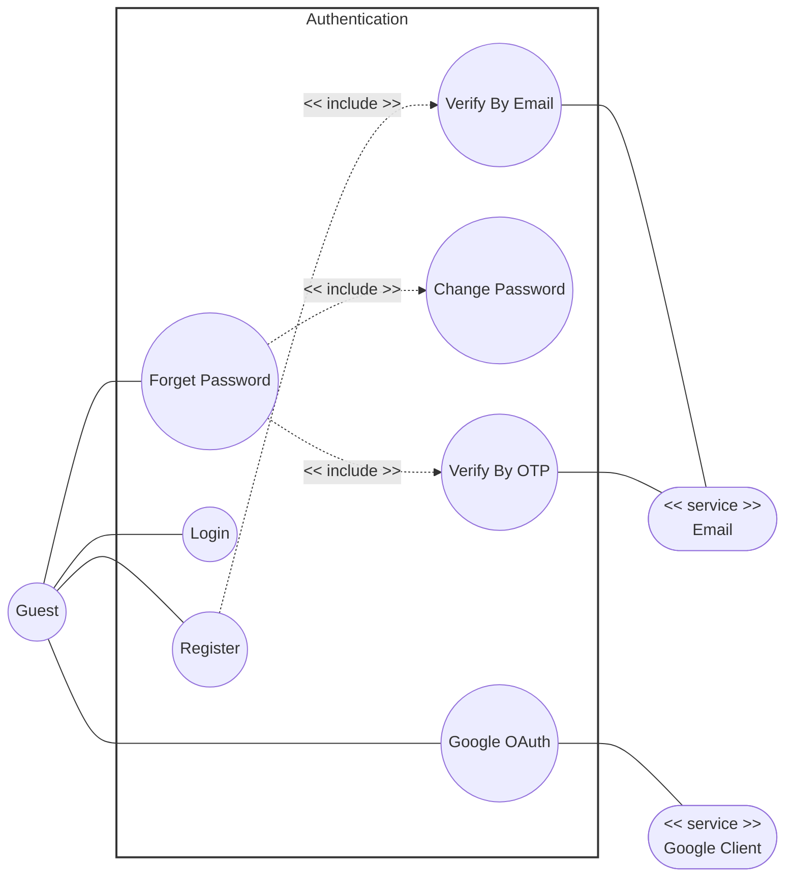

# Use-Case Specification: Authentication

**Group Name:** Amethyst

**Project Name:** Modern Library Management System

**Version:** 1.1

**Date:** 20-Jul-2026

**Document Identifier:** NGLP-SRS-AUTH-001

---

## Revision History

| Date | Version | Description | Author |
| --- | --- | --- | --- |
| 20-Jul-2026 | 1.1 | Authentication Use case specificaiton (RUP format layout). | Anh Minh, Hoang Gia |

---

## Table of Contents
1. [Regulation](#regulation)
2. [Use case diagram](#use-case-diagram)
3. [UC-AUTH-01: Register](#uc-auth-01-register)
4. [UC-AUTH-03: Google OAuth](#uc-auth-02-verify-by-email)
5. [UC-AUTH-04: Login](#uc-auth-03-google-oauth)
6. [UC-AUTH-05: Forget Password](#uc-auth-04-login)
7. [UC-AUTH-02: Verify By Email](#uc-auth-05-forget-password)
8. [UC-AUTH-06: Verify By OTP](#uc-auth-06-verify-by-otp)
9. [UC-AUTH-07: Change Password](#uc-auth-07-change-password)
    
---

## Regulation

---

## Use case diagram

---
## UC-AUTH-01: Register

<table width="100%" border="1" cellpadding="8" cellspacing="0" style="border-collapse: collapse; font-family: Arial, sans-serif; font-size: 14px; border: 1px solid #d1d5db; margin-bottom: 20px;">
  <thead>
    <tr style="background-color: #1e3a8a; color: #ffffff;">
      <th colspan="2" style="text-align: left; padding: 12px; font-size: 16px;">
        Use Case: Register
      </th>
    </tr>
  </thead>
  <tbody>
    <tr>
      <td width="22%" style="background-color: #f8fafc; font-weight: bold; vertical-align: top;">Use Case ID</td>
      <td style="vertical-align: top;"><strong>UC-AUTH-01</strong></td>
    </tr>
    <tr>
      <td style="background-color: #f8fafc; font-weight: bold; vertical-align: top;">Brief Description</td>
      <td style="vertical-align: top;">
        Allows a new guest user to create an account within the system by providing an email address and creating a secure password.
         <em>(Includes / Extends: <strong>Includes UC-AUTH-02 (Verify By Email).</strong>)</em>
      </td>
    </tr>
    <tr>
      <td style="background-color: #f8fafc; font-weight: bold; vertical-align: top;">Actor(s)</td>
      <td style="vertical-align: top;">Guest / User</td>
    </tr>
    <tr>
      <td style="background-color: #f8fafc; font-weight: bold; vertical-align: top;">Preconditions</td>
      <td style="vertical-align: top;">
        <ul style="margin: 0; padding-left: 20px; line-height: 1.5;">
          <li><strong>Session Isolation:</strong> The user is not currently authenticated within the active session environment.</li>
          <li><strong>UI Navigation Context:</strong> The user has opened the registration view layout component.</li>
        </ul>
      </td>
    </tr>
    <tr>
      <td style="background-color: #f8fafc; font-weight: bold; vertical-align: top;">Flow of Events (Basic Flow)</td>
      <td style="vertical-align: top;">
        <ol style="margin: 0; padding-left: 20px; line-height: 1.6;">
          <li><strong>[Actor Action]:</strong> The user enters their name, email address, password, and password confirmation into the designated registration fields.</li>
          <li><strong>[Actor Action]:</strong> The user submits the registration form.</li>
          <li><strong>[Data Processing]:</strong> The system validates that the email format is correct and checks the database to verify the email is not already associated with an existing account.</li>
          <li><strong>[System Response]:</strong> The system executes the mandatory include sub-routine **Verify By Email (UC-AUTH-02)** to issue a verification link.</li>
          <li><strong>[Data Processing]:</strong> The system hashes the password using a secure cryptographic algorithm and saves a new user record with a "Pending Verification" status flag.</li>
          <li><strong>[Display Result]:</strong> The system displays a registration success message instructing the user to check their email inbox to complete the verification sequence.</li>
        </ol>
      </td>
    </tr>
    <tr>
      <td style="background-color: #f8fafc; font-weight: bold; vertical-align: top;">Alternative / Exception Flows</td>
      <td style="vertical-align: top;">
        <ul style="margin: 0; padding-left: 20px; line-height: 1.5;">
          <li style="margin-bottom: 8px;">
            <strong>Email Redundancy (Step 3):</strong> If the email address already exists in the system database:
            <ol style="margin-top: 4px; margin-bottom: 4px; padding-left: 20px;">
              <li>The system terminates the registration sequence.</li>
              <li>The system prevents record creation and displays an inline validation error: "Email address is already registered."</li>
            </ol>
            <strong>Postcondition (Alternative Flow):</strong> No database writes commit; the registration form state remains intact with user inputs preserved.
          </li>
          <li style="margin-bottom: 8px;">
            <strong>Password Complexity Rejection (Step 3):</strong> If the password complexity requirements are not met:
            <ol style="margin-top: 4px; margin-bottom: 4px; padding-left: 20px;">
              <li>The system rejects the payload payload parameters.</li>
              <li>The system returns a detailed structural validation notice detailing missing criteria (e.g., character length, special symbols).</li>
            </ol>
            <strong>Postcondition (Alternative Flow):</strong> The account parameters are unchanged; the interface updates to highlight the non-compliant password fields.
          </li>
        </ul>
      </td>
    </tr>
    <tr>
      <td style="background-color: #f8fafc; font-weight: bold; vertical-align: top;">Postconditions</td>
      <td style="vertical-align: top;">
        <ul style="margin: 0; padding-left: 20px;">
          <li><strong>Staged Database Profile:</strong> A new user profile record is instantiated in the database with a status set to "Pending Verification".</li>
        </ul>
      </td>
    </tr>
    <tr>
      <td style="background-color: #f8fafc; font-weight: bold; vertical-align: top;">Special Requirements</td>
      <td style="vertical-align: top;">
        <ul style="margin: 0; padding-left: 20px;">
          <li><strong>TLS Transit Encryption:</strong> All client-side transmission payloads containing passwords must be encrypted in transit via TLS.</li>
        </ul>
      </td>
    </tr>
    <tr>
      <td style="background-color: #f8fafc; font-weight: bold; vertical-align: top;">Extension Points</td>
      <td style="vertical-align: top;">
        None
      </td>
    </tr>
    <tr>
      <td style="background-color: #f8fafc; font-weight: bold; vertical-align: top;">Prototype Screen</td>
      <td style="vertical-align: top;">
        
      </td>
    </tr>
  </tbody>
</table>

---

## UC-AUTH-02: Verify By Email

<table width="100%" border="1" cellpadding="8" cellspacing="0" style="border-collapse: collapse; font-family: Arial, sans-serif; font-size: 14px; border: 1px solid #d1d5db; margin-bottom: 20px;">
  <thead>
    <tr style="background-color: #1e3a8a; color: #ffffff;">
      <th colspan="2" style="text-align: left; padding: 12px; font-size: 16px;">
        Use Case: Verify By Email
      </th>
    </tr>
  </thead>
  <tbody>
    <tr>
      <td width="22%" style="background-color: #f8fafc; font-weight: bold; vertical-align: top;">Use Case ID</td>
      <td style="vertical-align: top;"><strong>UC-AUTH-02</strong></td>
    </tr>
    <tr>
      <td style="background-color: #f8fafc; font-weight: bold; vertical-align: top;">Brief Description</td>
      <td style="vertical-align: top;">
        Internal system routine handling verification token string generation, external email transactional routing, and account activation logic.
         <em>(Includes / Extends: <strong>Included UC supporting parent operational blocks under UC-AUTH-01 (Register).</strong>)</em>
      </td>
    </tr>
    <tr>
      <td style="background-color: #f8fafc; font-weight: bold; vertical-align: top;">Actor(s)</td>
      <td style="vertical-align: top;">User</td>
    </tr>
    <tr>
      <td style="background-color: #f8fafc; font-weight: bold; vertical-align: top;">Preconditions</td>
      <td style="vertical-align: top;">
        <ul style="margin: 0; padding-left: 20px; line-height: 1.5;">
          <li><strong>Registration Pipeline Activation:</strong> An orchestration call framework request is actively triggered via a parent user registration event.</li>
        </ul>
      </td>
    </tr>
    <tr>
      <td style="background-color: #f8fafc; font-weight: bold; vertical-align: top;">Flow of Events (Basic Flow)</td>
      <td style="vertical-align: top;">
        <ol style="margin: 0; padding-left: 20px; line-height: 1.6;">
          <li><strong>[Data Processing]:</strong> The system generates a cryptographically secure, time-limited verification token string link.</li>
          <li><strong>[Data Processing]:</strong> The system packages a transactional email notification payload enclosing the activation token URI link parameters.</li>
          <li><strong>[Data Processing]:</strong> The system dispatches the compilation payload out to the external Transactional Email Service Provider engine API.</li>
          <li><strong>[Actor Action]:</strong> The user opens their personal email client workspace, opens the message, and clicks the enclosed activation link parameter object.</li>
          <li><strong>[System Response]:</strong> The system interceptor parses the incoming request URI, confirms token validity, updates the matching user account status parameter flag from "Pending" to "Active", and returns a verification success confirmation callback to the parent context.</li>
        </ol>
      </td>
    </tr>
    <tr>
      <td style="background-color: #f8fafc; font-weight: bold; vertical-align: top;">Alternative / Exception Flows</td>
      <td style="vertical-align: top;">
        <ul style="margin: 0; padding-left: 20px; line-height: 1.5;">
          <li style="margin-bottom: 8px;">
            <strong>Boundary Horizon Exceeded (Step 5):</strong> If the user clicks the validation link after the expiration boundary has passed:
            <ol style="margin-top: 4px; margin-bottom: 4px; padding-left: 20px;">
              <li>The system flags the token lifecycle entry as invalid.</li>
              <li>The system renders a "Link Expired" error block layout panel and provides an interface node to request a new verification message block.</li>
            </ol>
            <strong>Postcondition (Alternative Flow):</strong> Account attributes retain their unverified resting states; target token entries purge from the operational caching memory layer.
          </li>
        </ul>
      </td>
    </tr>
    <tr>
      <td style="background-color: #f8fafc; font-weight: bold; vertical-align: top;">Postconditions</td>
      <td style="vertical-align: top;">
        <ul style="margin: 0; padding-left: 20px;">
          <li><strong>Account Modification Activation:</strong> User profile database rows convert permanently to fully verified "Active" operation states.</li>
        </ul>
      </td>
    </tr>
    <tr>
      <td style="background-color: #f8fafc; font-weight: bold; vertical-align: top;">Special Requirements</td>
      <td style="vertical-align: top;">
        <ul style="margin: 0; padding-left: 20px;">
          <li><strong>Nonce Cryptographic Signature:</strong> Verification tokens must be unique nonces signed with an HMAC signature protocol layer.</li>
        </ul>
      </td>
    </tr>
    <tr>
      <td style="background-color: #f8fafc; font-weight: bold; vertical-align: top;">Extension Points</td>
      <td style="vertical-align: top;">
        None
      </td>
    </tr>
    <tr>
      <td style="background-color: #f8fafc; font-weight: bold; vertical-align: top;">Prototype Screen</td>
      <td style="vertical-align: top;">
        
      </td>
    </tr>
  </tbody>
</table>

---

## UC-AUTH-03: Google OAuth

<table width="100%" border="1" cellpadding="8" cellspacing="0" style="border-collapse: collapse; font-family: Arial, sans-serif; font-size: 14px; border: 1px solid #d1d5db; margin-bottom: 20px;">
  <thead>
    <tr style="background-color: #1e3a8a; color: #ffffff;">
      <th colspan="2" style="text-align: left; padding: 12px; font-size: 16px;">
        Use Case: Google OAuth
      </th>
    </tr>
  </thead>
  <tbody>
    <tr>
      <td width="22%" style="background-color: #f8fafc; font-weight: bold; vertical-align: top;">Use Case ID</td>
      <td style="vertical-align: top;"><strong>UC-AUTH-03</strong></td>
    </tr>
    <tr>
      <td style="background-color: #f8fafc; font-weight: bold; vertical-align: top;">Brief Description</td>
      <td style="vertical-align: top;">
        Allows a user to instantly log in or register a new profile by authenticating via their external Google account credentials.
      </td>
    </tr>
    <tr>
      <td style="background-color: #f8fafc; font-weight: bold; vertical-align: top;">Actor(s)</td>
      <td style="vertical-align: top;">User</td>
    </tr>
    <tr>
      <td style="background-color: #f8fafc; font-weight: bold; vertical-align: top;">Preconditions</td>
      <td style="vertical-align: top;">
        <ul style="margin: 0; padding-left: 20px; line-height: 1.5;">
          <li><strong>Integration Mapping Active:</strong> The system maintains a valid OAuth client integration configuration mapping with Google APIs.</li>
        </ul>
      </td>
    </tr>
    <tr>
      <td style="background-color: #f8fafc; font-weight: bold; vertical-align: top;">Flow of Events (Basic Flow)</td>
      <td style="vertical-align: top;">
        <ol style="margin: 0; padding-left: 20px; line-height: 1.6;">
          <li><strong>[Actor Action]:</strong> The user clicks the "Continue with Google" layout control object node.</li>
          <li><strong>[System Response]:</strong> The system redirects the user's browser context to the secure Google Identity Provider authentication interface page.</li>
          <li><strong>[Actor Action]:</strong> The user logs into their Google account (if not already logged in) and grants authorization permissions to the application.</li>
          <li><strong>[System Response]:</strong> The Google Identity Provider returns a secure authorization token callback signal parameter to the system's redirect URI.</li>
          <li><strong>[Data Processing]:</strong> The system verifies the token integrity with Google's servers, extracts the user profile data (email, name, external ID), and checks if the user exists.</li>
          <li><strong>[System Response]:</strong> The system instantiates a valid authenticated application session token block and routes the user directly to the home dashboard view workspace.</li>
        </ol>
      </td>
    </tr>
    <tr>
      <td style="background-color: #f8fafc; font-weight: bold; vertical-align: top;">Alternative / Exception Flows</td>
      <td style="vertical-align: top;">
        <ul style="margin: 0; padding-left: 20px; line-height: 1.5;">
          <li style="margin-bottom: 8px;">
            <strong>Identity Provider Cancellation (Step 4):</strong> If the user cancels the authentication request on the Google portal side:
            <ol style="margin-top: 4px; margin-bottom: 4px; padding-left: 20px;">
              <li>The external provider passes a cancellation callback parameter string.</li>
              <li>The system catches the state error and returns the user back to the default login screen workspace.</li>
            </ol>
            <strong>Postcondition (Alternative Flow):</strong> Session token flags maintain an unauthenticated resting state; no user data modifications occur.
          </li>
          <li style="margin-bottom: 8px;">
            <strong>Suspended Account Access (Step 5):</strong> If the user account linked to the incoming Google email address has been explicitly suspended/banned internally:
            <ol style="margin-top: 4px; margin-bottom: 4px; padding-left: 20px;">
              <li>The system drops the incoming token lifecycle validation processing.</li>
              <li>The system presents an account blockade notification card layout component.</li>
            </ol>
            <strong>Postcondition (Alternative Flow):</strong> Authentication is denied; security tracking logs record the blocked access attempt instance.
          </li>
        </ul>
      </td>
    </tr>
    <tr>
      <td style="background-color: #f8fafc; font-weight: bold; vertical-align: top;">Postconditions</td>
      <td style="vertical-align: top;">
        <ul style="margin: 0; padding-left: 20px;">
          <li><strong>Client Session Bound:</strong> A secure application session token binds to the client browser, establishing a fully authenticated state.</li>
        </ul>
      </td>
    </tr>
    <tr>
      <td style="background-color: #f8fafc; font-weight: bold; vertical-align: top;">Special Requirements</td>
      <td style="vertical-align: top;">
        <ul style="margin: 0; padding-left: 20px;">
          <li><strong>Endpoint Latency Fallbacks:</strong> The system must fallback gracefully if third-party token validation endpoints experience sudden latency spikes or service outages.</li>
        </ul>
      </td>
    </tr>
    <tr>
      <td style="background-color: #f8fafc; font-weight: bold; vertical-align: top;">Extension Points</td>
      <td style="vertical-align: top;">
        None
      </td>
    </tr>
    <tr>
      <td style="background-color: #f8fafc; font-weight: bold; vertical-align: top;">Prototype Screen</td>
      <td style="vertical-align: top;">
        
      </td>
    </tr>
  </tbody>
</table>

---

## UC-AUTH-04: Login

<table width="100%" border="1" cellpadding="8" cellspacing="0" style="border-collapse: collapse; font-family: Arial, sans-serif; font-size: 14px; border: 1px solid #d1d5db; margin-bottom: 20px;">
  <thead>
    <tr style="background-color: #1e3a8a; color: #ffffff;">
      <th colspan="2" style="text-align: left; padding: 12px; font-size: 16px;">
        Use Case: Login
      </th>
    </tr>
  </thead>
  <tbody>
    <tr>
      <td width="22%" style="background-color: #f8fafc; font-weight: bold; vertical-align: top;">Use Case ID</td>
      <td style="vertical-align: top;"><strong>UC-AUTH-04</strong></td>
    </tr>
    <tr>
      <td style="background-color: #f8fafc; font-weight: bold; vertical-align: top;">Brief Description</td>
      <td style="vertical-align: top;">
        Authenticates an existing user utilizing their registered email address and password string credentials.
      </td>
    </tr>
    <tr>
      <td style="background-color: #f8fafc; font-weight: bold; vertical-align: top;">Actor(s)</td>
      <td style="vertical-align: top;">User</td>
    </tr>
    <tr>
      <td style="background-color: #f8fafc; font-weight: bold; vertical-align: top;">Preconditions</td>
      <td style="vertical-align: top;">
        <ul style="margin: 0; padding-left: 20px; line-height: 1.5;">
          <li><strong>Verified Roster Record:</strong> The user possesses an active, fully verified account record inside the system database.</li>
        </ul>
      </td>
    </tr>
    <tr>
      <td style="background-color: #f8fafc; font-weight: bold; vertical-align: top;">Flow of Events (Basic Flow)</td>
      <td style="vertical-align: top;">
        <ol style="margin: 0; padding-left: 20px; line-height: 1.6;">
          <li><strong>[Actor Action]:</strong> The user inputs their email address and account password into the login card component interface fields.</li>
          <li><strong>[Actor Action]:</strong> The user hits the primary "Login" submission action node control.</li>
          <li><strong>[System Response]:</strong> The system queries the identity tables to locate the matching user profile by the supplied email parameter identifier.</li>
          <li><strong>[Data Processing]:</strong> The system extracts the saved hashed password string and runs a comparison matrix check against the incoming plain text password.</li>
          <li><strong>[Data Processing]:</strong> The system initializes an active authenticated session context array block and updates the user's "Last Login" metadata timestamp log row.</li>
          <li><strong>[Display Result]:</strong> The system redirects the active UI framework viewport into the central authenticated landing layout dashboard.</li>
        </ol>
      </td>
    </tr>
    <tr>
      <td style="background-color: #f8fafc; font-weight: bold; vertical-align: top;">Alternative / Exception Flows</td>
      <td style="vertical-align: top;">
        <ul style="margin: 0; padding-left: 20px; line-height: 1.5;">
          <li style="margin-bottom: 8px;">
            <strong>Mismatched Credentials Validation Failure (Step 3 / Step 4):</strong> If the supplied email parameter does not exist, or the computed password hash fails verification checks:
            <ol style="margin-top: 4px; margin-bottom: 4px; padding-left: 20px;">
              <li>The system blocks credential confirmation parameters.</li>
              <li>The system displays a generalized interface summary error: "Invalid email or password combination."</li>
            </ol>
            <strong>Postcondition (Alternative Flow):</strong> Session context objects remain completely unauthenticated; internal login failure counter logs increment.
          </li>
          <li style="margin-bottom: 8px;">
            <strong>Unverified Registration Blockade (Step 5):</strong> If the target account profile maintains an unverified state flag (e.g., registration incomplete):
            <ol style="margin-top: 4px; margin-bottom: 4px; padding-left: 20px;">
              <li>The system interrupts the standard loading routine parameter scripts.</li>
              <li>The system redirects the user viewport frame to a dynamic email re-verification workflow layout.</li>
            </ol>
            <strong>Postcondition (Alternative Flow):</strong> Access to secure workspaces remains blocked; the user is locked to the verification dashboard lane.
          </li>
        </ul>
      </td>
    </tr>
    <tr>
      <td style="background-color: #f8fafc; font-weight: bold; vertical-align: top;">Postconditions</td>
      <td style="vertical-align: top;">
        <ul style="margin: 0; padding-left: 20px;">
          <li><strong>Context Workspace Mounted:</strong> An active authenticated session token mounts securely inside the user workspace context environment.</li>
        </ul>
      </td>
    </tr>
    <tr>
      <td style="background-color: #f8fafc; font-weight: bold; vertical-align: top;">Special Requirements</td>
      <td style="vertical-align: top;">
        <ul style="margin: 0; padding-left: 20px;">
          <li><strong>Brute-Force Rate Limiting:</strong> To prevent brute-force profiling vectors, the login endpoint must enforce strict rate-limiting mechanics after 5 sequential authentication failures.</li>
        </ul>
      </td>
    </tr>
    <tr>
      <td style="background-color: #f8fafc; font-weight: bold; vertical-align: top;">Extension Points</td>
      <td style="vertical-align: top;">
        None
      </td>
    </tr>
    <tr>
      <td style="background-color: #f8fafc; font-weight: bold; vertical-align: top;">Prototype Screen</td>
      <td style="vertical-align: top;">
        
      </td>
    </tr>
  </tbody>
</table>

---

## UC-AUTH-05: Forget Password

<table width="100%" border="1" cellpadding="8" cellspacing="0" style="border-collapse: collapse; font-family: Arial, sans-serif; font-size: 14px; border: 1px solid #d1d5db; margin-bottom: 20px;">
  <thead>
    <tr style="background-color: #1e3a8a; color: #ffffff;">
      <th colspan="2" style="text-align: left; padding: 12px; font-size: 16px;">
        Use Case: Forget Password
      </th>
    </tr>
  </thead>
  <tbody>
    <tr>
      <td width="22%" style="background-color: #f8fafc; font-weight: bold; vertical-align: top;">Use Case ID</td>
      <td style="vertical-align: top;"><strong>UC-AUTH-05</strong></td>
    </tr>
    <tr>
      <td style="background-color: #f8fafc; font-weight: bold; vertical-align: top;">Brief Description</td>
      <td style="vertical-align: top;">
        Orchestrates the multi-stage account recovery sequence allowing a user who lost their credentials to re-secure account access via dynamic secondary channel checks.
         <em>(Includes / Extends: <strong>Includes UC-AUTH-06 (Verify By OTP) and UC-AUTH-07 (Change Password).</strong>)</em>
      </td>
    </tr>
    <tr>
      <td style="background-color: #f8fafc; font-weight: bold; vertical-align: top;">Actor(s)</td>
      <td style="vertical-align: top;">User</td>
    </tr>
    <tr>
      <td style="background-color: #f8fafc; font-weight: bold; vertical-align: top;">Preconditions</td>
      <td style="vertical-align: top;">
        <ul style="margin: 0; padding-left: 20px; line-height: 1.5;">
          <li><strong>Lost Access Context:</strong> The user cannot access their account due to forgotten credential parameters.</li>
        </ul>
      </td>
    </tr>
    <tr>
      <td style="background-color: #f8fafc; font-weight: bold; vertical-align: top;">Flow of Events (Basic Flow)</td>
      <td style="vertical-align: top;">
        <ol style="margin: 0; padding-left: 20px; line-height: 1.6;">
          <li><strong>[Actor Action]:</strong> The user clicks the "Forgot Password?" text link navigation node on the login view panel layout.</li>
          <li><strong>[Actor Action]:</strong> The user inputs their registered account email identifier into the recovery prompt and submits.</li>
          <li><strong>[System Response]:</strong> The system verifies the user record exists and triggers the mandatory include sub-routine **Verify By OTP (UC-AUTH-06)** to validate identity.</li>
          <li><strong>[System Response]:</strong> Upon catching a successful callback validation status from the OTP routine, the system invokes the mandatory include sub-routine **Change Password (UC-AUTH-07)**.</li>
          <li><strong>[Display Result]:</strong> The system presents a password reset complete confirmation view layout with a redirection button linking back to the login page.</li>
        </ol>
      </td>
    </tr>
    <tr>
      <td style="background-color: #f8fafc; font-weight: bold; vertical-align: top;">Alternative / Exception Flows</td>
      <td style="vertical-align: top;">
        <ul style="margin: 0; padding-left: 20px; line-height: 1.5;">
          <li style="margin-bottom: 8px;">
            <strong>User Enumeration Guard Obscurity (Step 3):</strong> If the provided email parameter cannot be found inside active database records:
            <ol style="margin-top: 4px; margin-bottom: 4px; padding-left: 20px;">
              <li>The system executes a silent fallback dummy path (to prevent user enumeration exploits).</li>
              <li>The system surfaces an identical notification layout screen block: "Recovery steps dispatched if account exists."</li>
            </ol>
            <strong>Postcondition (Alternative Flow):</strong> No background system variables update; downstream OTP generation routines abort safely.
          </li>
        </ul>
      </td>
    </tr>
    <tr>
      <td style="background-color: #f8fafc; font-weight: bold; vertical-align: top;">Postconditions</td>
      <td style="vertical-align: top;">
        <ul style="margin: 0; padding-left: 20px;">
          <li><strong>Operational Account Commit:</strong> The targeted user account credentials update to the new password configuration block successfully.</li>
        </ul>
      </td>
    </tr>
    <tr>
      <td style="background-color: #f8fafc; font-weight: bold; vertical-align: top;">Special Requirements</td>
      <td style="vertical-align: top;">
        <ul style="margin: 0; padding-left: 20px;">
          <li><strong>Token Expiration Ceiling:</strong> The recovery orchestration flow lifecycle must expire within 15 minutes of initial generation token stamping.</li>
        </ul>
      </td>
    </tr>
    <tr>
      <td style="background-color: #f8fafc; font-weight: bold; vertical-align: top;">Extension Points</td>
      <td style="vertical-align: top;">
        None
      </td>
    </tr>
    <tr>
      <td style="background-color: #f8fafc; font-weight: bold; vertical-align: top;">Prototype Screen</td>
      <td style="vertical-align: top;">
        
      </td>
    </tr>
  </tbody>
</table>

---

## UC-AUTH-06: Verify By OTP

<table width="100%" border="1" cellpadding="8" cellspacing="0" style="border-collapse: collapse; font-family: Arial, sans-serif; font-size: 14px; border: 1px solid #d1d5db; margin-bottom: 20px;">
  <thead>
    <tr style="background-color: #1e3a8a; color: #ffffff;">
      <th colspan="2" style="text-align: left; padding: 12px; font-size: 16px;">
        Use Case: Verify By OTP
      </th>
    </tr>
  </thead>
  <tbody>
    <tr>
      <td width="22%" style="background-color: #f8fafc; font-weight: bold; vertical-align: top;">Use Case ID</td>
      <td style="vertical-align: top;"><strong>UC-AUTH-06</strong></td>
    </tr>
    <tr>
      <td style="background-color: #f8fafc; font-weight: bold; vertical-align: top;">Brief Description</td>
      <td style="vertical-align: top;">
        Internal identity verification framework routine processing temporary One-Time Password generation, delivery routing, and validation.
         <em>(Includes / Extends: <strong>Included UC supporting parent operational blocks under UC-AUTH-05 (Forget Password).</strong>)</em>
      </td>
    </tr>
    <tr>
      <td style="background-color: #f8fafc; font-weight: bold; vertical-align: top;">Actor(s)</td>
      <td style="vertical-align: top;">User</td>
    </tr>
    <tr>
      <td style="background-color: #f8fafc; font-weight: bold; vertical-align: top;">Preconditions</td>
      <td style="vertical-align: top;">
        <ul style="margin: 0; padding-left: 20px; line-height: 1.5;">
          <li><strong>Master Invocation Context:</strong> Context validation parameters are received systematically via parent recovery orchestration flows.</li>
        </ul>
      </td>
    </tr>
    <tr>
      <td style="background-color: #f8fafc; font-weight: bold; vertical-align: top;">Flow of Events (Basic Flow)</td>
      <td style="vertical-align: top;">
        <ol style="margin: 0; padding-left: 20px; line-height: 1.6;">
          <li><strong>[Data Processing]:</strong> The system generates a highly localized 6-digit numeric One-Time Password parameter token.</li>
          <li><strong>[Data Processing]:</strong> The system saves the generated OTP token to a short-lived memory cache with an explicit 5-minute time-to-live parameter.</li>
          <li><strong>[Data Processing]:</strong> The system routes the OTP payload to the user's secondary verification channel via the External Messaging Service Provider API.</li>
          <li><strong>[Actor Action]:</strong> The user receives the numeric passcode, types the characters into the application UI validation interface layout box, and submits.</li>
          <li><strong>[System Response]:</strong> The system references the cache layer to verify match alignment and returns a successful verification completion token callback.</li>
        </ol>
      </td>
    </tr>
    <tr>
      <td style="background-color: #f8fafc; font-weight: bold; vertical-align: top;">Alternative / Exception Flows</td>
      <td style="vertical-align: top;">
        <ul style="margin: 0; padding-left: 20px; line-height: 1.5;">
          <li style="margin-bottom: 8px;">
            <strong>Mismatched Passcode Entry (Step 5):</strong> If the user inputs a numeric sequence that does not match the active cached value:
            <ol style="margin-top: 4px; margin-bottom: 4px; padding-left: 20px;">
              <li>The system blocks transaction submission loops.</li>
              <li>The system increments a failure tally index row and throws a validation mismatch warning notice.</li>
            </ol>
            <strong>Postcondition (Alternative Flow):</strong> The verification validation step remains unfulfilled; if failures surpass 3 consecutive attempts, the session token blocks completely.
          </li>
          <li style="margin-bottom: 8px;">
            <strong>Cache Expiration Cleared (Step 5):</strong> If the user interface session remains idle until the 5-minute TTL cache window completely clears:
            <ol style="margin-top: 4px; margin-bottom: 4px; padding-left: 20px;">
              <li>The system invalidates the current recovery attempt path parameters.</li>
              <li>The system forces a fresh configuration request iteration workflow.</li>
            </ol>
            <strong>Postcondition (Alternative Flow):</strong> The memory cache layer purges the entry parameters cleanly; the user interface falls back to step 1.
          </li>
        </ul>
      </td>
    </tr>
    <tr>
      <td style="background-color: #f8fafc; font-weight: bold; vertical-align: top;">Postconditions</td>
      <td style="vertical-align: top;">
        <ul style="margin: 0; padding-left: 20px;">
          <li><strong>Temporary Authentication Staging:</strong> The current browser session context earns a temporary "Identity Confirmed" verification token pass.</li>
        </ul>
      </td>
    </tr>
    <tr>
      <td style="background-color: #f8fafc; font-weight: bold; vertical-align: top;">Special Requirements</td>
      <td style="vertical-align: top;">
        <ul style="margin: 0; padding-left: 20px;">
          <li><strong>Frequency Generation Caps:</strong> The system must prevent brute forcing by restricting individual OTP generation requests to a maximum frequency of once per 60 seconds per user profile.</li>
        </ul>
      </td>
    </tr>
    <tr>
      <td style="background-color: #f8fafc; font-weight: bold; vertical-align: top;">Extension Points</td>
      <td style="vertical-align: top;">
        None
      </td>
    </tr>
    <tr>
      <td style="background-color: #f8fafc; font-weight: bold; vertical-align: top;">Prototype Screen</td>
      <td style="vertical-align: top;">
        
      </td>
    </tr>
  </tbody>
</table>

---

## UC-AUTH-07: Change Password

<table width="100%" border="1" cellpadding="8" cellspacing="0" style="border-collapse: collapse; font-family: Arial, sans-serif; font-size: 14px; border: 1px solid #d1d5db; margin-bottom: 20px;">
  <thead>
    <tr style="background-color: #1e3a8a; color: #ffffff;">
      <th colspan="2" style="text-align: left; padding: 12px; font-size: 16px;">
        Use Case: Change Password
      </th>
    </tr>
  </thead>
  <tbody>
    <tr>
      <td width="22%" style="background-color: #f8fafc; font-weight: bold; vertical-align: top;">Use Case ID</td>
      <td style="vertical-align: top;"><strong>UC-AUTH-07</strong></td>
    </tr>
    <tr>
      <td style="background-color: #f8fafc; font-weight: bold; vertical-align: top;">Brief Description</td>
      <td style="vertical-align: top;">
        Internal business utility module managing new password parameter capture, verification constraints check, and core database credential updates.
         <em>(Includes / Extends: <strong>Included UC supporting parent operational blocks under UC-AUTH-05 (Forget Password).</strong>)</em>
      </td>
    </tr>
    <tr>
      <td style="background-color: #f8fafc; font-weight: bold; vertical-align: top;">Actor(s)</td>
      <td style="vertical-align: top;">Logged user</td>
    </tr>
    <tr>
      <td style="background-color: #f8fafc; font-weight: bold; vertical-align: top;">Preconditions</td>
      <td style="vertical-align: top;">
        <ul style="margin: 0; padding-left: 20px; line-height: 1.5;">
          <li><strong>Validation Staging Verification:</strong> The current transaction flow state contains a valid "Identity Confirmed" pass flag passed forward from `UC-AUTH-06`.</li>
        </ul>
      </td>
    </tr>
    <tr>
      <td style="background-color: #f8fafc; font-weight: bold; vertical-align: top;">Flow of Events (Basic Flow)</td>
      <td style="vertical-align: top;">
        <ol style="margin: 0; padding-left: 20px; line-height: 1.6;">
          <li><strong>[Display Result]:</strong> The system displays a structural "Reset Password" input entry form layout component framework.</li>
          <li><strong>[Actor Action]:</strong> The user inputs a fresh password string value and completes the verifying confirmation field duplication text box.</li>
          <li><strong>[System Response]:</strong> The system evaluates the input parameters to ensure both entries align perfectly and clear complexity criteria check limits.</li>
          <li><strong>[Data Processing]:</strong> The system hashes the fresh input password selection payload using cryptographic salt properties and writes the value directly to the user profile table column database space.</li>
          <li><strong>[Data Processing]:</strong> The system clears out any active external session token allocations for this user to enforce a global logout across all peripheral devices.</li>
          <li><strong>[System Response]:</strong> The system issues a successful operation completion code signal return back out to the master workflow orchestrator.</li>
        </ol>
      </td>
    </tr>
    <tr>
      <td style="background-color: #f8fafc; font-weight: bold; vertical-align: top;">Alternative / Exception Flows</td>
      <td style="vertical-align: top;">
        <ul style="margin: 0; padding-left: 20px; line-height: 1.5;">
          <li style="margin-bottom: 8px;">
            <strong>Form Match Verification Defect (Step 3):</strong> If the secondary confirmation verification text input does not match the primary new password string entry:
            <ol style="margin-top: 4px; margin-bottom: 4px; padding-left: 20px;">
              <li>The system blocks submission pipelines.</li>
              <li>The system displays a localized validation text warning notice: "Passwords do not match."</li>
            </ol>
            <strong>Postcondition (Alternative Flow):</strong> Security credentials preserve historical states exactly; write operations are intercepted and discarded prior to database execution threads.
          </li>
        </ul>
      </td>
    </tr>
    <tr>
      <td style="background-color: #f8fafc; font-weight: bold; vertical-align: top;">Postconditions</td>
      <td style="vertical-align: top;">
        <ul style="margin: 0; padding-left: 20px;">
          <li><strong>Ledger Attribute Mutation:</strong> The underlying application database records permanent structural mutations over the user's credential secret parameter attributes.</li>
        </ul>
      </td>
    </tr>
    <tr>
      <td style="background-color: #f8fafc; font-weight: bold; vertical-align: top;">Special Requirements</td>
      <td style="vertical-align: top;">
        None
      </td>
    </tr>
    <tr>
      <td style="background-color: #f8fafc; font-weight: bold; vertical-align: top;">Extension Points</td>
      <td style="vertical-align: top;">
        None
      </td>
    </tr>
    <tr>
      <td style="background-color: #f8fafc; font-weight: bold; vertical-align: top;">Prototype Screen</td>
      <td style="vertical-align: top;">
        
         
        
      </td>
    </tr>
  </tbody>
</table>
