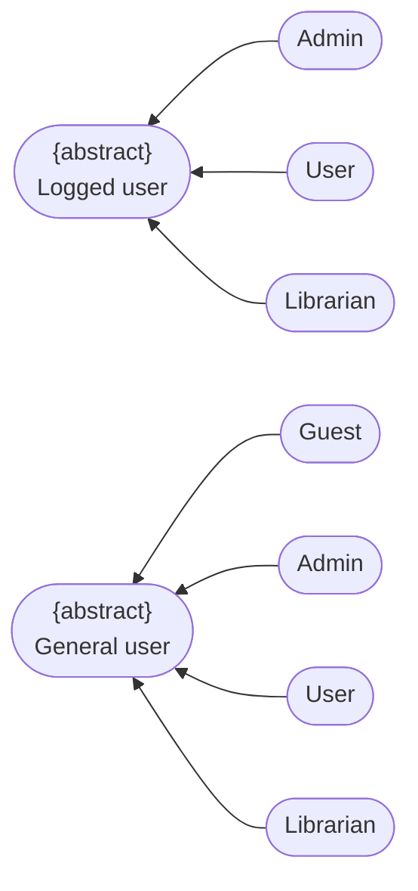

# Use-Case Specification: Books Package

**Group Name:** Amethyst

**Project Name:** Amethyst Library Management System

**Version:** 1.1

**Date:** 20-Jul-2026

**Document Identifier:** NGLP-SRS-BK-001

---

## Revision History

| Date | Version | Description | Author |
| --- | --- | --- | --- |
| 20-Jul-2026 | 1.1 | Books Use case (RUP format layout). | Anh Minh, Hoang Gia |

---

## Table of Contents
1. [Regulation](#regulation)
2. [Usecase Diagram](#usecase-diagram)
3. [UC-BK-01: Book Searching](#uc-bk-01-book-searching)
4. [UC-BK-02: Filtering Book](#uc-bk-02-filtering-book)
5. [UC-BK-03: View Book Detail](#uc-bk-03-view-book-detail)
6. [UC-BK-04: Add Book Favorite](#uc-bk-04-add-book-favorite)
7. [UC-BK-05: Book Reservation](#uc-bk-05-book-reservation)
8. [UC-BK-06: Canceling Book Reservation](#uc-bk-06-canceling-book-reservation)
9. [UC-BK-07: Generating Pin](#uc-bk-07-generating-pin)

---

## Regulation

---

## Usecase Diagram

---
## UC-BK-01: Book Searching

<table width="100%" border="1" cellpadding="8" cellspacing="0" style="border-collapse: collapse; font-family: Arial, sans-serif; font-size: 14px; border: 1px solid #d1d5db; margin-bottom: 20px;">
  <thead>
    <tr style="background-color: #1e3a8a; color: #ffffff;">
      <th colspan="2" style="text-align: left; padding: 12px; font-size: 16px;">
        Use Case: Book Searching
      </th>
    </tr>
  </thead>
  <tbody>
    <tr>
      <td width="22%" style="background-color: #f8fafc; font-weight: bold; vertical-align: top;">Use Case ID</td>
      <td style="vertical-align: top;"><strong>UC-BK-01</strong></td>
    </tr>
    <tr>
      <td style="background-color: #f8fafc; font-weight: bold; vertical-align: top;">Brief Description</td>
      <td style="vertical-align: top;">
        Allows the user to look up specific books within the library system catalog using either explicit keyword parameters (title, author, ISBN strings) or context-aware semantic phrases. The system handles processing configurations via an explicit user mode toggle switch, accommodates minor typos dynamically, triggers automatically upon pressing the "Enter" key, coordinates alongside active metadata filters, and records all query executions into the historical search database.
         <em>(Includes / Extends: <strong>Specialized by Standard Search (Keyword matching) and Semantic search (Context queries).</strong>)</em>
      </td>
    </tr>
    <tr>
      <td style="background-color: #f8fafc; font-weight: bold; vertical-align: top;">Actor(s)</td>
      <td style="vertical-align: top;">User</td>
    </tr>
    <tr>
      <td style="background-color: #f8fafc; font-weight: bold; vertical-align: top;">Preconditions</td>
      <td style="vertical-align: top;">
        <ul style="margin: 0; padding-left: 20px; line-height: 1.5;">
          <li><strong>UI Location Context:</strong> The user has navigated to the catalog query dashboard interface.</li>
          <li><strong>Core Subsystem Verification:</strong> The book relational database index and specialized vector storage AI model database module are active and online.</li>
        </ul>
      </td>
    </tr>
    <tr>
      <td style="background-color: #f8fafc; font-weight: bold; vertical-align: top;">Flow of Events (Basic Flow)</td>
      <td style="vertical-align: top;">
        <ol style="margin: 0; padding-left: 20px; line-height: 1.6;">
          <li><strong>[Actor Action]:</strong> The user accesses the primary catalog search interface view.</li>
          <li><strong>[System Response]:</strong> The system displays the search panel dashboard layout, featuring a text input field, an explicit mode toggle switch (Standard vs. Semantic), and access to metadata filter control panels.</li>
          <li><strong>[Actor Action]:</strong> The user adjusts the toggle switch to their preferred search type (Standard Keyword or Semantic Context).</li>
          <li><strong>[Actor Action]:</strong> *Optional:* The user sets or updates overlapping constraint toggles within the metadata filter panels (e.g., availability status, structural categories, languages, or publication eras).</li>
          <li><strong>[Actor Action]:</strong> The user types their query string into the search input box. (The background typo-tolerance layer dynamically monitors input parameters for character permutations).</li>
          <li><strong>[Actor Action]:</strong> The user executes the query by pressing the **Enter** key on their keyboard or clicking the search icon button widget.</li>
          <li><strong>[Data Processing]:</strong> The system intercepts the submission runtime event and immediately creates an asynchronous database logging transaction to write the raw search text string, timestamp, applied filter, and User ID parameters into the historical search database log tables.</li>
          <li><strong>[Data Processing]:</strong> The system processes the query payload text by both keywords and context-aware matching.</li>
          <li><strong>[Data Processing]:</strong> The system applies any active metadata filter constraint parameters to strip disqualified records out of the resulting query dataset match array.</li>
          <li><strong>[Display Result]:</strong> The system displays the final ranked, filtered list layout array of matching book cards (cover image, title, author, genre) onto the viewport panel.</li>
          <li><strong>[Actor Action]:</strong> The user may scroll through the results and optionally choose to save a specific book directly to their wishlist.</li>
        </ol>
      </td>
    </tr>
    <tr>
      <td style="background-color: #f8fafc; font-weight: bold; vertical-align: top;">Alternative / Exception Flows</td>
      <td style="vertical-align: top;">
        <ul style="margin: 0; padding-left: 20px; line-height: 1.5;">
          <li style="margin-bottom: 8px;">
            <strong>Search History Logging Failure (Step 7):</strong> If the search history database logging pipeline encounters an error or timeout:
            <ol style="margin-top: 4px; margin-bottom: 4px; padding-left: 20px;">
              <li>The system catches the write exception silently.</li>
              <li>The system logs it within internal application diagnostic error frameworks.</li>
              <li>The system bypasses the historical logging block directly and resumes execution at Step 8 to prevent disrupting the user search lifecycle experience.</li>
            </ol>
            <strong>Postcondition (Alternative Flow):</strong> Search results render normally on the interface viewport layer, but the specific search instance context is omitted from historical user logs.
          </li>
          <li style="margin-bottom: 8px;">
            <strong>Zero Catalog Matches (Step 8):</strong> If the system identifies zero exact, partial, fuzzy, or semantic catalog matches:
            <ol style="margin-top: 4px; margin-bottom: 4px; padding-left: 20px;">
              <li>The system interrupts standard rendering and outputs an empty panel state layout.</li>
            </ol>
            <strong>Postcondition (Alternative Flow):</strong> A zero-match notification prompt window appears on-screen alongside generic default popular listings. Alternate permutations may drop back to standard keyword text match structural summaries (logging an infrastructure error notice behind the scenes) or push cached historical index layers directly into viewport screens with warning alerts flashed.
          </li>
        </ul>
      </td>
    </tr>
    <tr>
      <td style="background-color: #f8fafc; font-weight: bold; vertical-align: top;">Postconditions</td>
      <td style="vertical-align: top;">
        <ul style="margin: 0; padding-left: 20px;">
          <li><strong>Workspace Population:</strong> The relevant search query matches successfully populate the active layout window on screen.</li>
          <li><strong>Transaction Logging Commitment:</strong> The user's query parameters are safely recorded inside the historical database logging framework for analytics and user history dashboards.</li>
        </ul>
      </td>
    </tr>
    <tr>
      <td style="background-color: #f8fafc; font-weight: bold; vertical-align: top;">Special Requirements</td>
      <td style="vertical-align: top;">
        <ul style="margin: 0; padding-left: 20px;">
          <li><strong>Performance SLA Boundaries:</strong> Standard keyword lookup database queries must complete rendering cycles within 1.5 seconds; semantic vector model matching operations must execute under a 3.0-second performance limit window.</li>
          <li><strong>Dynamic Typo Tolerance:</strong> The background fuzzy logic typo-tolerance algorithm must dynamically resolve single/double character transpositions or common character substitutions without creating measurable lookup degradation.</li>
          <li><strong>String Sanitization Injection Guards:</strong> Wildcard processing expressions must pass through string cookies sanitization parameters to fully block malicious SQL pattern injection vectors.</li>
          <li><strong>Non-Blocking Thread Execution:</strong> Search history database insertion commands must be non-blocking and execute strictly on background threads to ensure the UI interface main rendering loop remains highly responsive.</li>
        </ul>
      </td>
    </tr>
    <tr>
      <td style="background-color: #f8fafc; font-weight: bold; vertical-align: top;">Extension Points</td>
      <td style="vertical-align: top;">
        None
      </td>
    </tr>
    <tr>
      <td style="background-color: #f8fafc; font-weight: bold; vertical-align: top;">Prototype Screen</td>
      <td style="vertical-align: top;">
        
      </td>
    </tr>
  </tbody>
</table>

---

## UC-BK-02: Filtering Book

<table width="100%" border="1" cellpadding="8" cellspacing="0" style="border-collapse: collapse; font-family: Arial, sans-serif; font-size: 14px; border: 1px solid #d1d5db; margin-bottom: 20px;">
  <thead>
    <tr style="background-color: #1e3a8a; color: #ffffff;">
      <th colspan="2" style="text-align: left; padding: 12px; font-size: 16px;">
        Use Case: Filtering Book
      </th>
    </tr>
  </thead>
  <tbody>
    <tr>
      <td width="22%" style="background-color: #f8fafc; font-weight: bold; vertical-align: top;">Use Case ID</td>
      <td style="vertical-align: top;"><strong>UC-BK-02</strong></td>
    </tr>
    <tr>
      <td style="background-color: #f8fafc; font-weight: bold; vertical-align: top;">Brief Description</td>
      <td style="vertical-align: top;">
        Enables the granular filtering of active displayed collections by parameters such as availability status, structural categories, languages, or publication eras.
      </td>
    </tr>
    <tr>
      <td style="background-color: #f8fafc; font-weight: bold; vertical-align: top;">Actor(s)</td>
      <td style="vertical-align: top;">User</td>
    </tr>
    <tr>
      <td style="background-color: #f8fafc; font-weight: bold; vertical-align: top;">Preconditions</td>
      <td style="vertical-align: top;">
        <ul style="margin: 0; padding-left: 20px; line-height: 1.5;">
          <li><strong>Populated Dataset Context:</strong> An active population list of catalog items is rendered inside the view browser pane area.</li>
        </ul>
      </td>
    </tr>
    <tr>
      <td style="background-color: #f8fafc; font-weight: bold; vertical-align: top;">Flow of Events (Basic Flow)</td>
      <td style="vertical-align: top;">
        <ol style="margin: 0; padding-left: 20px; line-height: 1.6;">
          <li><strong>[Actor Action]:</strong> The user opens the filter settings sidebar control interface module panel.</li>
          <li><strong>[System Response]:</strong> The system shows checkboxes representing system metadata filter categories.</li>
          <li><strong>[Actor Action]:</strong> The user sets multiple overlapping constraint toggle checks.</li>
          <li><strong>[Data Processing]:</strong> The system dynamically updates the query arrays to crop records failing check matches.</li>
          <li><strong>[Display Result]:</strong> The system strips disqualified cards out of view without forcing complete browser workspace reloads.</li>
        </ol>
      </td>
    </tr>
    <tr>
      <td style="background-color: #f8fafc; font-weight: bold; vertical-align: top;">Alternative / Exception Flows</td>
      <td style="vertical-align: top;">
        <ul style="margin: 0; padding-left: 20px; line-height: 1.5;">
          <li style="margin-bottom: 8px;">
            <strong>Overfiltering Outcome (Step 4):</strong> If overfiltering occurs, yielding zero matching index properties:
            <ol style="margin-top: 4px; margin-bottom: 4px; padding-left: 20px;">
              <li>The system presents an active "Reset All Applied Filters" UI component widget inside an explicit helper panel layout block.</li>
            </ol>
            <strong>Postcondition (Alternative Flow):</strong> A null results screen layout element displays along with active reset interaction shortcuts.
          </li>
        </ul>
      </td>
    </tr>
    <tr>
      <td style="background-color: #f8fafc; font-weight: bold; vertical-align: top;">Postconditions</td>
      <td style="vertical-align: top;">
        <ul style="margin: 0; padding-left: 20px;">
          <li><strong>Grid Alignment State:</strong> Active browse window lists map exactly to all applied parameter limit criteria states.</li>
        </ul>
      </td>
    </tr>
    <tr>
      <td style="background-color: #f8fafc; font-weight: bold; vertical-align: top;">Special Requirements</td>
      <td style="vertical-align: top;">
        <ul style="margin: 0; padding-left: 20px;">
          <li><strong>Asynchronous Adjustments:</strong> Filter matrix indexing state checks must be applied asynchronously to guarantee zero-latency listing adjustments.</li>
        </ul>
      </td>
    </tr>
    <tr>
      <td style="background-color: #f8fafc; font-weight: bold; vertical-align: top;">Extension Points</td>
      <td style="vertical-align: top;">
        None
      </td>
    </tr>
    <tr>
      <td style="background-color: #f8fafc; font-weight: bold; vertical-align: top;">Prototype Screen</td>
      <td style="vertical-align: top;">
        
      </td>
    </tr>
  </tbody>
</table>

---

## UC-BK-03: View Book Detail

<table width="100%" border="1" cellpadding="8" cellspacing="0" style="border-collapse: collapse; font-family: Arial, sans-serif; font-size: 14px; border: 1px solid #d1d5db; margin-bottom: 20px;">
  <thead>
    <tr style="background-color: #1e3a8a; color: #ffffff;">
      <th colspan="2" style="text-align: left; padding: 12px; font-size: 16px;">
        Use Case: View Book Detail
      </th>
    </tr>
  </thead>
  <tbody>
    <tr>
      <td width="22%" style="background-color: #f8fafc; font-weight: bold; vertical-align: top;">Use Case ID</td>
      <td style="vertical-align: top;"><strong>UC-BK-03</strong></td>
    </tr>
    <tr>
      <td style="background-color: #f8fafc; font-weight: bold; vertical-align: top;">Brief Description</td>
      <td style="vertical-align: top;">
        Acts as the primary informational hub for a specific catalog asset. It retrieves comprehensive book metadata, real-time inventory counts, user reviews, dynamically compiles a carousel of related books based on genre classification, and hosts entry nodes for user interactions (Wishlist, Favorites, and Reservations).
         <em>(Includes / Extends: <strong>Extended by use cases: UC-BK-04 (Add Book Favorite), UC-BK-05 (Book Reservation).</strong>)</em>
      </td>
    </tr>
    <tr>
      <td style="background-color: #f8fafc; font-weight: bold; vertical-align: top;">Actor(s)</td>
      <td style="vertical-align: top;">User</td>
    </tr>
    <tr>
      <td style="background-color: #f8fafc; font-weight: bold; vertical-align: top;">Preconditions</td>
      <td style="vertical-align: top;">
        <ul style="margin: 0; padding-left: 20px; line-height: 1.5;">
          <li><strong>Visual Target Anchor:</strong> A targeted book item component, link anchor text, or search result card is rendered on the user's active screen layout.</li>
        </ul>
      </td>
    </tr>
    <tr>
      <td style="background-color: #f8fafc; font-weight: bold; vertical-align: top;">Flow of Events (Basic Flow)</td>
      <td style="vertical-align: top;">
        <ol style="margin: 0; padding-left: 20px; line-height: 1.6;">
          <li><strong>[Actor Action]:</strong> The user clicks on a specific book cover visual image component or text link element anchor object from any display grid or search result array.</li>
          <li><strong>[System Response]:</strong> The system captures the event parameter and calls a background object retrieval query to fetch database records tied to the chosen unique identification string (`Book_ID`).</li>
          <li><strong>[Data Processing]:</strong> The system extracts structural descriptive fields (Title, Author, Publisher, Synopsis summary text, and user review message matrices).</li>
          <li><strong>[Data Processing]:</strong> The system requests live, real-time snapshot inventory balance summaries to calculate total copies owned versus active copies currently available for circulation.</li>
          <li><strong>[Data Processing]:</strong> The system queries the book catalog database to isolate up to 10 highly rated or trending books sharing matching genre classifications with the current target book.</li>
          <li><strong>[Display Result]:</strong> The system renders the comprehensive profile view template workspace, mapping metadata, inventory states, and reviews cleanly into upper layout blocks.</li>
          <li><strong>[Display Result]:</strong> The system populates a horizontal, swipeable "Related Books by Genre" carousel grid component at the terminal end of the page viewport layout.</li>
          <li><strong>[System Response]:</strong> The system checks the active user session status token to dynamically expose action controls: * **For all users:** Exposes basic detail visibility and the related carousel nodes. * **For authenticated users:** Activates operational interaction buttons for "Add to Wishlist" (heart icon) and "Reserve Book".</li>
          <li><strong>[Actor Action]:</strong> The user reviews the details and can scroll through the carousel, click a related book to transition views, or click an interaction button to trigger a secondary workflow.</li>
        </ol>
      </td>
    </tr>
    <tr>
      <td style="background-color: #f8fafc; font-weight: bold; vertical-align: top;">Alternative / Exception Flows</td>
      <td style="vertical-align: top;">
        <ul style="margin: 0; padding-left: 20px; line-height: 1.5;">
          <li style="margin-bottom: 8px;">
            <strong>Empty Genre Associations (Step 5):</strong> If no related books are found in the matching genre catalog data arrays:
            <ol style="margin-top: 4px; margin-bottom: 4px; padding-left: 20px;">
              <li>The system dynamically alters its query criteria to retrieve a list of random books instead.</li>
              <li>The workflow proceeds directly to Step 6 of the Basic Flow.</li>
            </ol>
          </li>
          <li style="margin-bottom: 8px;">
            <strong>Record Reference Corruption (Step 2):</strong> If the specific `Book_ID` string refers to a record that has been permanently purged or corrupted:
            <ol style="margin-top: 4px; margin-bottom: 4px; padding-left: 20px;">
              <li>The system aborts the page layout compilation script immediately.</li>
              <li>The system triggers a contextual toast notification modal warning window: "The selected book profile is currently unavailable."</li>
              <li>The system routes the user viewport cleanly backward to their previously active listing dashboard workspace.</li>
            </ol>
            <strong>Postcondition (Alternative Flow):</strong> No data attributes modify; the user workspace safely falls back to stable resting panels.
          </li>
        </ul>
      </td>
    </tr>
    <tr>
      <td style="background-color: #f8fafc; font-weight: bold; vertical-align: top;">Postconditions</td>
      <td style="vertical-align: top;">
        <ul style="margin: 0; padding-left: 20px;">
          <li><strong>Sheet Output Delivery:</strong> The requested book detail sheet successfully outputs to the client interface window.</li>
          <li><strong>Entry Node Accessibility:</strong> All relevant context-driven interactive entry paths (Wishlist/Reservation links) sit in a fully receptive, ready-to-click state.</li>
        </ul>
      </td>
    </tr>
    <tr>
      <td style="background-color: #f8fafc; font-weight: bold; vertical-align: top;">Special Requirements</td>
      <td style="vertical-align: top;">
        <ul style="margin: 0; padding-left: 20px;">
          <li><strong>Metadata Performance Thresholds:</strong> The primary page layout metadata elements (Title, Author, Inventory counts) must load within a maximum 1.0-second time ceiling; the lower related genre carousel asset pipeline can execute asynchronously to prevent locking the initial main frame rendering loop.</li>
        </ul>
      </td>
    </tr>
    <tr>
      <td style="background-color: #f8fafc; font-weight: bold; vertical-align: top;">Extension Points</td>
      <td style="vertical-align: top;">
        <ul style="margin: 0; padding-left: 20px;">
          <li><strong>Add Book Favorite:</strong> Location inside event flow: Exposing action controls for authenticated users (Step 8).</li>
          <li><strong>Book Reservation:</strong> Location inside event flow: Exposing action controls for authenticated users (Step 8).</li>
        </ul>
      </td>
    </tr>
    <tr>
      <td style="background-color: #f8fafc; font-weight: bold; vertical-align: top;">Prototype Screen</td>
      <td style="vertical-align: top;">
        
      </td>
    </tr>
  </tbody>
</table>

---

## UC-BK-04: Add Book Favorite

<table width="100%" border="1" cellpadding="8" cellspacing="0" style="border-collapse: collapse; font-family: Arial, sans-serif; font-size: 14px; border: 1px solid #d1d5db; margin-bottom: 20px;">
  <thead>
    <tr style="background-color: #1e3a8a; color: #ffffff;">
      <th colspan="2" style="text-align: left; padding: 12px; font-size: 16px;">
        Use Case: Add Book Favorite
      </th>
    </tr>
  </thead>
  <tbody>
    <tr>
      <td width="22%" style="background-color: #f8fafc; font-weight: bold; vertical-align: top;">Use Case ID</td>
      <td style="vertical-align: top;"><strong>UC-BK-04</strong></td>
    </tr>
    <tr>
      <td style="background-color: #f8fafc; font-weight: bold; vertical-align: top;">Brief Description</td>
      <td style="vertical-align: top;">
        Extends detailed profiles to allow users to anchor an item to their account collections for rapid retrieval access utilities.
         <em>(Includes / Extends: <strong>Extends UC-BK-03 (View Book Detail) — extension point: Exposing action controls for authenticated users.</strong>)</em>
      </td>
    </tr>
    <tr>
      <td style="background-color: #f8fafc; font-weight: bold; vertical-align: top;">Actor(s)</td>
      <td style="vertical-align: top;">User</td>
    </tr>
    <tr>
      <td style="background-color: #f8fafc; font-weight: bold; vertical-align: top;">Preconditions</td>
      <td style="vertical-align: top;">
        <ul style="margin: 0; padding-left: 20px; line-height: 1.5;">
          <li><strong>Session Verification:</strong> The user account profile state checks match valid system authentication benchmarks.</li>
          <li><strong>Context Parameter:</strong> The user is actively executing active workspace viewing tasks inside `UC-BK-03`.</li>
        </ul>
      </td>
    </tr>
    <tr>
      <td style="background-color: #f8fafc; font-weight: bold; vertical-align: top;">Flow of Events (Basic Flow)</td>
      <td style="vertical-align: top;">
        <ol style="margin: 0; padding-left: 20px; line-height: 1.6;">
          <li><strong>[Actor Action]:</strong> The user initiates a request by clicking the Heart icon on the book details cover pane interface.</li>
          <li><strong>[Data Processing]:</strong> The system inserts a relationship link row tracking User ID to Book ID into the system database.</li>
          <li><strong>[Display Result]:</strong> The system modifies the color of the icon component to red and fires a system status toast announcement to demonstrate successful data binding.</li>
          <li><strong>[Actor Action]:</strong> The user can later review the personal wishlist in their main wishlist dashboard space.</li>
        </ol>
      </td>
    </tr>
    <tr>
      <td style="background-color: #f8fafc; font-weight: bold; vertical-align: top;">Alternative / Exception Flows</td>
      <td style="vertical-align: top;">
        <ul style="margin: 0; padding-left: 20px; line-height: 1.5;">
          <li style="margin-bottom: 8px;">
            <strong>Asset Redundancy (Step 1):</strong> If the selected catalog asset identity string already resides inside active user favorites data arrays:
            <ol style="margin-top: 4px; margin-bottom: 4px; padding-left: 20px;">
              <li>The system registers the action as an intentional favorite deletion prompt.</li>
              <li>The system extracts the relationship string link row from database tables.</li>
              <li>The system clears the heart icon color highlight indicators back to default status configurations.</li>
            </ol>
            <strong>Postcondition (Alternative Flow):</strong> Association metrics delete cleanly; visual markers change status flags back to default baseline states.
          </li>
        </ul>
      </td>
    </tr>
    <tr>
      <td style="background-color: #f8fafc; font-weight: bold; vertical-align: top;">Postconditions</td>
      <td style="vertical-align: top;">
        <ul style="margin: 0; padding-left: 20px;">
          <li><strong>Structural Element UI Changes:</strong> The color of the heart icon turns red on the client side interface.</li>
          <li><strong>Storage Confirmation:</strong> Target catalog objects sit successfully inside user dashboard wishlist modules.</li>
        </ul>
      </td>
    </tr>
    <tr>
      <td style="background-color: #f8fafc; font-weight: bold; vertical-align: top;">Special Requirements</td>
      <td style="vertical-align: top;">
        <ul style="margin: 0; padding-left: 20px;">
          <li><strong>Real-Time Cross-Device Sync:</strong> Favorites list data synchronization configurations must update global account views across cross-device endpoints instantaneously.</li>
        </ul>
      </td>
    </tr>
    <tr>
      <td style="background-color: #f8fafc; font-weight: bold; vertical-align: top;">Extension Points</td>
      <td style="vertical-align: top;">
        <ul style="margin: 0; padding-left: 20px;">
          <li>--</li>
        </ul>
      </td>
    </tr>
    <tr>
      <td style="background-color: #f8fafc; font-weight: bold; vertical-align: top;">Prototype Screen</td>
      <td style="vertical-align: top;">
        
         
        
      </td>
    </tr>
  </tbody>
</table>

---

## UC-BK-05: Book Reservation

<table width="100%" border="1" cellpadding="8" cellspacing="0" style="border-collapse: collapse; font-family: Arial, sans-serif; font-size: 14px; border: 1px solid #d1d5db; margin-bottom: 20px;">
  <thead>
    <tr style="background-color: #1e3a8a; color: #ffffff;">
      <th colspan="2" style="text-align: left; padding: 12px; font-size: 16px;">
        Use Case: Book Reservation
      </th>
    </tr>
  </thead>
  <tbody>
    <tr>
      <td width="22%" style="background-color: #f8fafc; font-weight: bold; vertical-align: top;">Use Case ID</td>
      <td style="vertical-align: top;"><strong>UC-BK-05</strong></td>
    </tr>
    <tr>
      <td style="background-color: #f8fafc; font-weight: bold; vertical-align: top;">Brief Description</td>
      <td style="vertical-align: top;">
        Handles the end-to-end process allowing an authenticated user to place a physical hold on a book copy directly from its details page. The system internally enforces account constraint metrics, checks real-time inventory availability layers, updates catalog status allocations, and writes transaction logs securely.
         <em>(Includes / Extends: <strong>Extends UC-BK-03 (View Book Detail) — extension point: Exposing action controls for authenticated users. Specializes the abstract usecase Managing Reserved Books.</strong>)</em>
      </td>
    </tr>
    <tr>
      <td style="background-color: #f8fafc; font-weight: bold; vertical-align: top;">Actor(s)</td>
      <td style="vertical-align: top;">User</td>
    </tr>
    <tr>
      <td style="background-color: #f8fafc; font-weight: bold; vertical-align: top;">Preconditions</td>
      <td style="vertical-align: top;">
        <ul style="margin: 0; padding-left: 20px; line-height: 1.5;">
          <li><strong>Token Security Check:</strong> The user session tokens maintain authenticated statuses inside core system modules.</li>
          <li><strong>Parent Context Reference:</strong> The user is actively executing workspace view processing steps inside `UC-BK-03`.</li>
        </ul>
      </td>
    </tr>
    <tr>
      <td style="background-color: #f8fafc; font-weight: bold; vertical-align: top;">Flow of Events (Basic Flow)</td>
      <td style="vertical-align: top;">
        <ol style="margin: 0; padding-left: 20px; line-height: 1.6;">
          <li><strong>[Actor Action]:</strong> The user clicks the primary "Reserve Book" action button parameter layout object node on the book details screen.</li>
          <li><strong>[System Response]:</strong> The system intercepts the transaction context request and evaluates the user's active concurrent reservation counts against maximum account allowance thresholds.</li>
          <li><strong>[System Response]:</strong> The system queries internal inventory engines to verify that a physical copy tracking row for the matching asset carries an explicit "Available" tracking tag status.</li>
          <li><strong>[Data Processing]:</strong> The system locks the selected target copy database row record, changing its state configuration status flag from "Available" to "Reserved".</li>
          <li><strong>[Data Processing]:</strong> The system logs a fresh instance tracking transaction entry row detailing unique timestamps, user identifiers, reference keys, and an automated pickup expiration countdown tracker.</li>
          <li><strong>[Display Result]:</strong> The system updates live inventory tracking counts (decrementing available copies) and presents a checkout success overview dashboard containing return deadlines, pickup instructions, and option nodes to view the pickup verification details.</li>
        </ol>
      </td>
    </tr>
    <tr>
      <td style="background-color: #f8fafc; font-weight: bold; vertical-align: top;">Alternative / Exception Flows</td>
      <td style="vertical-align: top;">
        <ul style="margin: 0; padding-left: 20px; line-height: 1.5;">
          <li style="margin-bottom: 8px;">
            <strong>Account Caps Reached (Step 2):</strong> If user metrics show current concurrent items match or pass system cap limits:
            <ol style="margin-top: 4px; margin-bottom: 4px; padding-left: 20px;">
              <li>The system blocks processing workflows and halts the allocation sequence execution.</li>
              <li>The system throws and displays an explicit validation error interface block: "Account Reservation Limit Reached".</li>
            </ol>
          </li>
          <li style="margin-bottom: 8px;">
            <strong>Material Allocation Shortage (Step 3):</strong> If the inventory query reveals that all physical tracking records for the matching asset register zero available quantities:
            <ol style="margin-top: 4px; margin-bottom: 4px; padding-left: 20px;">
              <li>The system cancels the standard booking pathway logic parameters.</li>
              <li>The system updates screen interface element blocks and opens an interactive confirmation modal dialogue box asking if the user desires inclusion on public queue waiting lists.</li>
            </ol>
          </li>
        </ul>
      </td>
    </tr>
    <tr>
      <td style="background-color: #f8fafc; font-weight: bold; vertical-align: top;">Postconditions</td>
      <td style="vertical-align: top;">
        <ul style="margin: 0; padding-left: 20px;">
          <li><strong>Structural Account Allocation:</strong> A digital item hold reservation token binds securely against the user’s account database portfolio records.</li>
          <li><strong>Material Ledger Reduction:</strong> Physical library copy availability allocations drop dynamically, and a transactional database logging instance records securely in history tables.</li>
        </ul>
      </td>
    </tr>
    <tr>
      <td style="background-color: #f8fafc; font-weight: bold; vertical-align: top;">Special Requirements</td>
      <td style="vertical-align: top;">
        <ul style="margin: 0; padding-left: 20px;">
          <li><strong>Strict Data Isolation Concurrency Guards:</strong> Inventory state checking steps and status parameter adjustments must rely entirely on strict isolation transaction patterns (atomic locking mechanisms) to fully block database race conditions or double-booking conflicts during concurrent heavy usage spikes.</li>
        </ul>
      </td>
    </tr>
    <tr>
      <td style="background-color: #f8fafc; font-weight: bold; vertical-align: top;">Extension Points</td>
      <td style="vertical-align: top;">
        None
      </td>
    </tr>
    <tr>
      <td style="background-color: #f8fafc; font-weight: bold; vertical-align: top;">Prototype Screen</td>
      <td style="vertical-align: top;">
        
      </td>
    </tr>
  </tbody>
</table>

---

## UC-BK-06: Canceling Book Reservation

<table width="100%" border="1" cellpadding="8" cellspacing="0" style="border-collapse: collapse; font-family: Arial, sans-serif; font-size: 14px; border: 1px solid #d1d5db; margin-bottom: 20px;">
  <thead>
    <tr style="background-color: #1e3a8a; color: #ffffff;">
      <th colspan="2" style="text-align: left; padding: 12px; font-size: 16px;">
        Use Case: Canceling Book Reservation
      </th>
    </tr>
  </thead>
  <tbody>
    <tr>
      <td width="22%" style="background-color: #f8fafc; font-weight: bold; vertical-align: top;">Use Case ID</td>
      <td style="vertical-align: top;"><strong>UC-BK-06</strong></td>
    </tr>
    <tr>
      <td style="background-color: #f8fafc; font-weight: bold; vertical-align: top;">Brief Description</td>
      <td style="vertical-align: top;">
        Allows a user to void outstanding holds on book assets, clearing tracking rows and returning units to open circulation loops.
         <em>(Includes / Extends: <strong>Specializes the abstract usecase Managing Reserved Books.</strong>)</em>
      </td>
    </tr>
    <tr>
      <td style="background-color: #f8fafc; font-weight: bold; vertical-align: top;">Actor(s)</td>
      <td style="vertical-align: top;">User</td>
    </tr>
    <tr>
      <td style="background-color: #f8fafc; font-weight: bold; vertical-align: top;">Preconditions</td>
      <td style="vertical-align: top;">
        <ul style="margin: 0; padding-left: 20px; line-height: 1.5;">
          <li><strong>Identity Check:</strong> The user is authenticated within core security frameworks.</li>
          <li><strong>Extant Record Verification:</strong> An active hold profile row data record exists mapped against the user identifier profile key attributes.</li>
        </ul>
      </td>
    </tr>
    <tr>
      <td style="background-color: #f8fafc; font-weight: bold; vertical-align: top;">Flow of Events (Basic Flow)</td>
      <td style="vertical-align: top;">
        <ol style="margin: 0; padding-left: 20px; line-height: 1.6;">
          <li><strong>[Actor Action]:</strong> The user accesses their account profile reservation review summary board.</li>
          <li><strong>[Actor Action]:</strong> The user identifies the specific reservation card item layout block and clicks the "Cancel Reservation" text control trigger button.</li>
          <li><strong>[Data Processing]:</strong> The system updates tracking records, changing status descriptions to "Cancelled".</li>
          <li><strong>[Data Processing]:</strong> The system increments item allocation numbers, marking the physical inventory asset copy status to "Available".</li>
          <li><strong>[Display Result]:</strong> The system strips the active item block out of current summary layout screens.</li>
        </ol>
      </td>
    </tr>
    <tr>
      <td style="background-color: #f8fafc; font-weight: bold; vertical-align: top;">Alternative / Exception Flows</td>
      <td style="vertical-align: top;">
        <ul style="margin: 0; padding-left: 20px; line-height: 1.5;">
          <li style="margin-bottom: 8px;">
            <strong>Network Drops Mid-Commit (Step 3):</strong> If system network connections drop mid-cancellation updates:
            <ol style="margin-top: 4px; margin-bottom: 4px; padding-left: 20px;">
              <li>The system rolls database operational steps backward cleanly.</li>
              <li>The system prompts users with a warning modal box stating "Action failed, please attempt transaction verification again."</li>
            </ol>
            <strong>Postcondition (Alternative Flow):</strong> Data records drop out of update routines; original reservation statuses maintain their state configurations.
          </li>
        </ul>
      </td>
    </tr>
    <tr>
      <td style="background-color: #f8fafc; font-weight: bold; vertical-align: top;">Postconditions</td>
      <td style="vertical-align: top;">
        <ul style="margin: 0; padding-left: 20px;">
          <li><strong>Account Queue Dropping:</strong> Active reservation entry parameters drop out of active queues; physical library counts update successfully.</li>
        </ul>
      </td>
    </tr>
    <tr>
      <td style="background-color: #f8fafc; font-weight: bold; vertical-align: top;">Special Requirements</td>
      <td style="vertical-align: top;">
        <ul style="margin: 0; padding-left: 20px;">
          <li><strong>Broadcast Synchronicity:</strong> Canceled item inventory allocation changes must synchronize instantaneously across search discovery database pools to reflect open availability fields.</li>
        </ul>
      </td>
    </tr>
    <tr>
      <td style="background-color: #f8fafc; font-weight: bold; vertical-align: top;">Extension Points</td>
      <td style="vertical-align: top;">
        None
      </td>
    </tr>
    <tr>
      <td style="background-color: #f8fafc; font-weight: bold; vertical-align: top;">Prototype Screen</td>
      <td style="vertical-align: top;">
        
      </td>
    </tr>
  </tbody>
</table>

---

## UC-BK-07: Generating Pin

<table width="100%" border="1" cellpadding="8" cellspacing="0" style="border-collapse: collapse; font-family: Arial, sans-serif; font-size: 14px; border: 1px solid #d1d5db; margin-bottom: 20px;">
  <thead>
    <tr style="background-color: #1e3a8a; color: #ffffff;">
      <th colspan="2" style="text-align: left; padding: 12px; font-size: 16px;">
        Use Case: Generating Pin
      </th>
    </tr>
  </thead>
  <tbody>
    <tr>
      <td width="22%" style="background-color: #f8fafc; font-weight: bold; vertical-align: top;">Use Case ID</td>
      <td style="vertical-align: top;"><strong>UC-BK-07</strong></td>
    </tr>
    <tr>
      <td style="background-color: #f8fafc; font-weight: bold; vertical-align: top;">Brief Description</td>
      <td style="vertical-align: top;">
        Generates temporary, high-security validation passcode tokens to authorize locker retrieval or desk checkout protocols.
         <em>(Includes / Extends: <strong>Specializes the abstract usecase Managing Reserved Books.</strong>)</em>
      </td>
    </tr>
    <tr>
      <td style="background-color: #f8fafc; font-weight: bold; vertical-align: top;">Actor(s)</td>
      <td style="vertical-align: top;">User</td>
    </tr>
    <tr>
      <td style="background-color: #f8fafc; font-weight: bold; vertical-align: top;">Preconditions</td>
      <td style="vertical-align: top;">
        <ul style="margin: 0; padding-left: 20px; line-height: 1.5;">
          <li><strong>Item Pipeline State:</strong> A specific target hold tracking status is officially set to "Ready for Pickup".</li>
        </ul>
      </td>
    </tr>
    <tr>
      <td style="background-color: #f8fafc; font-weight: bold; vertical-align: top;">Flow of Events (Basic Flow)</td>
      <td style="vertical-align: top;">
        <ol style="margin: 0; padding-left: 20px; line-height: 1.6;">
          <li><strong>[Actor Action]:</strong> The user navigates to the active booking details pane within their account hub dashboard.</li>
          <li><strong>[Actor Action]:</strong> The user triggers the "Generate Pickup PIN" transaction button control item.</li>
          <li><strong>[System Response]:</strong> The system runs security hashing modules to output a 6-digit numeric passkey linked to that collection row ID.</li>
          <li><strong>[Data Processing]:</strong> The system stores the passkey in short-term active memory caches with an explicit 15-minute time-to-live parameter.</li>
          <li><strong>[Display Result]:</strong> The system renders the generated PIN digits on-screen using large high-contrast text styling components alongside a live visual countdown progress bar tracker.</li>
        </ol>
      </td>
    </tr>
    <tr>
      <td style="background-color: #f8fafc; font-weight: bold; vertical-align: top;">Alternative / Exception Flows</td>
      <td style="vertical-align: top;">
        <ul style="margin: 0; padding-left: 20px; line-height: 1.5;">
          <li style="margin-bottom: 8px;">
            <strong>Checkout Expiration Time Breach (Step 4):</strong> If the tracking countdown reaches zero before terminal checkouts finish:
            <ol style="margin-top: 4px; margin-bottom: 4px; padding-left: 20px;">
              <li>The system purges the expired passcode token sequence out of live cache parameters.</li>
              <li>The system alters UI layouts to reveal a "Regenerate Expired Token" control shortcut.</li>
            </ol>
            <strong>Postcondition (Alternative Flow):</strong> Authorization passcodes delete out of lookup caches; screen output contents display expired states.
          </li>
        </ul>
      </td>
    </tr>
    <tr>
      <td style="background-color: #f8fafc; font-weight: bold; vertical-align: top;">Postconditions</td>
      <td style="vertical-align: top;">
        <ul style="margin: 0; padding-left: 20px;">
          <li><strong>Instance Authentication Staging:</strong> A secure token instance exists inside application memory, and authentication interfaces display access credentials.</li>
        </ul>
      </td>
    </tr>
    <tr>
      <td style="background-color: #f8fafc; font-weight: bold; vertical-align: top;">Special Requirements</td>
      <td style="vertical-align: top;">
        <ul style="margin: 0; padding-left: 20px;">
          <li><strong>Cryptographic Randomization:</strong> Numeric token generation engines must use cryptographically secure random values to prevent predictable generation strings.</li>
        </ul>
      </td>
    </tr>
    <tr>
      <td style="background-color: #f8fafc; font-weight: bold; vertical-align: top;">Extension Points</td>
      <td style="vertical-align: top;">
        None
      </td>
    </tr>
    <tr>
      <td style="background-color: #f8fafc; font-weight: bold; vertical-align: top;">Prototype Screen</td>
      <td style="vertical-align: top;">
        
      </td>
    </tr>
  </tbody>
</table>
