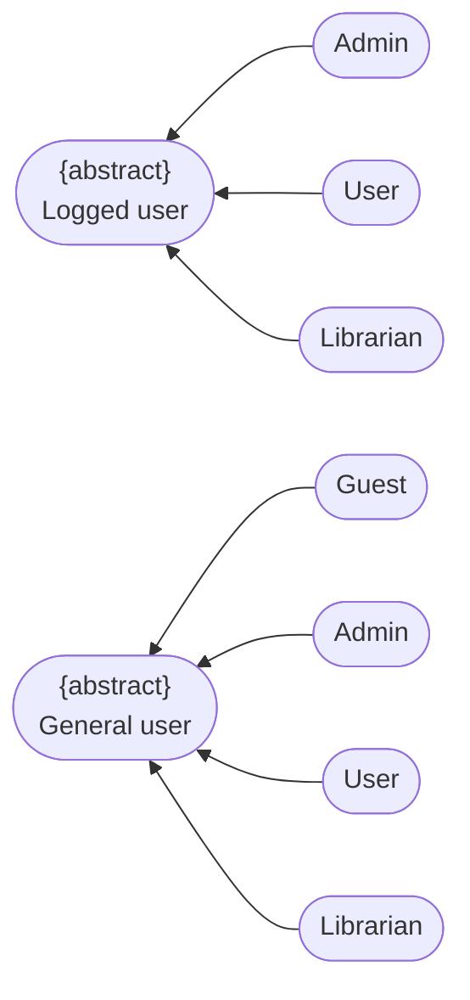
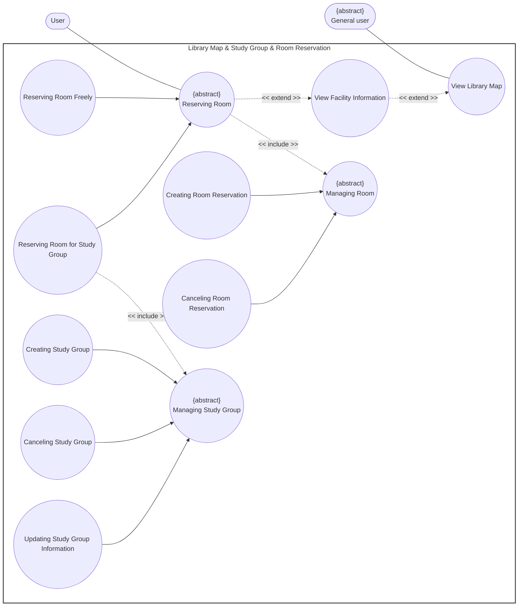

# Use-Case Specification: Library Map & Study Group & Room Reservation Package

**Group Name:** Amethyst

**Project Name:** Modern Library Management System

**Version:** 1.1

**Date:** 20-Jul-2026

**Document Identifier:** NGLP-SRS-LIB-001

---

## Revision History

| Date | Version | Description | Author |
| --- | --- | --- | --- |
| 20-Jul-2026 | 1.1 | Facility and Reserving room Use case (RUP format layout). | Anh Minh, Hoang Gia |

---

## Table of Contents
1. [Regulation](#regulation)
8. [Use case diagram](#use-case-diagram)
1. [UC-LIB-01: View Library Map](#uc-lib-01-view-library-map)
2. [UC-LIB-02: View Facility Information](#uc-lib-02-view-facility-information)
3. [UC-LIB-03: Room Reservation](#uc-lib-03-room-reservation)
4. [UC-LIB-04: Canceling Room Reservation](#uc-lib-04-canceling-room-reservation)
5. [UC-LIB-05: Creating Study Group](#uc-lib-05-creating-study-group)
6. [UC-LIB-06: Canceling Study Group](#uc-lib-06-canceling-study-group)
7. [UC-LIB-07: Updating Study Group Information](#uc-lib-07-updating-study-group-information)

---

## Regulation

---

## Use case diagram

---
## UC-LIB-01: View Library Map

<table width="100%" border="1" cellpadding="8" cellspacing="0" style="border-collapse: collapse; font-family: Arial, sans-serif; font-size: 14px; border: 1px solid #d1d5db; margin-bottom: 20px;">
  <thead>
    <tr style="background-color: #1e3a8a; color: #ffffff;">
      <th colspan="2" style="text-align: left; padding: 12px; font-size: 16px;">
        Use Case: View Library Map
      </th>
    </tr>
  </thead>
  <tbody>
    <tr>
      <td width="22%" style="background-color: #f8fafc; font-weight: bold; vertical-align: top;">Use Case ID</td>
      <td style="vertical-align: top;"><strong>UC-LIB-01</strong></td>
    </tr>
    <tr>
      <td style="background-color: #f8fafc; font-weight: bold; vertical-align: top;">Brief Description</td>
      <td style="vertical-align: top;">
        Allows a user to view the interactive graphical spatial layout floor plan map of the physical library facilities.
      </td>
    </tr>
    <tr>
      <td style="background-color: #f8fafc; font-weight: bold; vertical-align: top;">Actor(s)</td>
      <td style="vertical-align: top;">User</td>
    </tr>
    <tr>
      <td style="background-color: #f8fafc; font-weight: bold; vertical-align: top;">Preconditions</td>
      <td style="vertical-align: top;">
        <ul style="margin: 0; padding-left: 20px; line-height: 1.5;">
          <li><strong>Interface Initialization:</strong> The user has launched the library digital map display.</li>
        </ul>
      </td>
    </tr>
    <tr>
      <td style="background-color: #f8fafc; font-weight: bold; vertical-align: top;">Flow of Events (Basic Flow)</td>
      <td style="vertical-align: top;">
        <ol style="margin: 0; padding-left: 20px; line-height: 1.6;">
          <li><strong>[Actor Action]:</strong> The user selects the "Interactive Map" tab component link from the primary navigation portal.</li>
          <li><strong>[System Response]:</strong> The system queries the database to load the current geometric library floor map configuration data models.</li>
          <li><strong>[Display Result]:</strong> The system renders the complete high-resolution layout map canvas onto the active user screen interface.</li>
          <li><strong>[Actor Action]:</strong> The user navigates, pans, or zooms around the active floor coordinate spaces.</li>
        </ol>
      </td>
    </tr>
    <tr>
      <td style="background-color: #f8fafc; font-weight: bold; vertical-align: top;">Alternative / Exception Flows</td>
      <td style="vertical-align: top;">
        <ul style="margin: 0; padding-left: 20px; line-height: 1.5;">
          <li style="margin-bottom: 8px;">
            <strong>Asset Loading Failure (Step 2):</strong> If map structural asset vector files fail to load from backend content delivery nodes:
            <ol style="margin-top: 4px; margin-bottom: 4px; padding-left: 20px;">
              <li>The system terminates the display script routine.</li>
              <li>The system defaults to rendering a static text-based directory list layout grid of floors.</li>
            </ol>
            <strong>Postcondition (Alternative Flow):</strong> The active workspace falls back to descriptive layout index directories; errors parse securely into diagnostic logs.
          </li>
        </ul>
      </td>
    </tr>
    <tr>
      <td style="background-color: #f8fafc; font-weight: bold; vertical-align: top;">Postconditions</td>
      <td style="vertical-align: top;">
        <ul style="margin: 0; padding-left: 20px;">
          <li><strong>Interactive Map State:</strong> The digital structural blueprint map is fully loaded and remains interactive within the client application container workspace.</li>
        </ul>
      </td>
    </tr>
    <tr>
      <td style="background-color: #f8fafc; font-weight: bold; vertical-align: top;">Special Requirements</td>
      <td style="vertical-align: top;">
        <ul style="margin: 0; padding-left: 20px;">
          <li><strong>Render Performance Ceiling:</strong> The graphical layout component structure must render interactively within 1.0 second on modern client application endpoints.</li>
        </ul>
      </td>
    </tr>
    <tr>
      <td style="background-color: #f8fafc; font-weight: bold; vertical-align: top;">Extension Points</td>
      <td style="vertical-align: top;">
        None
      </td>
    </tr>
    <tr>
      <td style="background-color: #f8fafc; font-weight: bold; vertical-align: top;">Prototype Screen</td>
      <td style="vertical-align: top;">
        
      </td>
    </tr>
  </tbody>
</table>

---

## UC-LIB-02: View Facility Information

<table width="100%" border="1" cellpadding="8" cellspacing="0" style="border-collapse: collapse; font-family: Arial, sans-serif; font-size: 14px; border: 1px solid #d1d5db; margin-bottom: 20px;">
  <thead>
    <tr style="background-color: #1e3a8a; color: #ffffff;">
      <th colspan="2" style="text-align: left; padding: 12px; font-size: 16px;">
        Use Case: View Facility Information
      </th>
    </tr>
  </thead>
  <tbody>
    <tr>
      <td width="22%" style="background-color: #f8fafc; font-weight: bold; vertical-align: top;">Use Case ID</td>
      <td style="vertical-align: top;"><strong>UC-LIB-02</strong></td>
    </tr>
    <tr>
      <td style="background-color: #f8fafc; font-weight: bold; vertical-align: top;">Brief Description</td>
      <td style="vertical-align: top;">
        Extends the active map visualization layout dashboard panel to display specific metadata parameters, operational schedules, capacity thresholds, and equipment summaries for a chosen target room asset.
         <em>(Includes / Extends: <strong>Extends UC-LIB-01 (View Library Map) — extension point: User selects a specific room or point-of-interest zone node anchor element within the visual map array space.</strong>)</em>
      </td>
    </tr>
    <tr>
      <td style="background-color: #f8fafc; font-weight: bold; vertical-align: top;">Actor(s)</td>
      <td style="vertical-align: top;">User</td>
    </tr>
    <tr>
      <td style="background-color: #f8fafc; font-weight: bold; vertical-align: top;">Preconditions</td>
      <td style="vertical-align: top;">
        <ul style="margin: 0; padding-left: 20px; line-height: 1.5;">
          <li><strong>Underlying Map Session Active:</strong> The core baseline `View Library Map (UC-LIB-01)` flow is fully executed and active on screen.</li>
        </ul>
      </td>
    </tr>
    <tr>
      <td style="background-color: #f8fafc; font-weight: bold; vertical-align: top;">Flow of Events (Basic Flow)</td>
      <td style="vertical-align: top;">
        <ol style="margin: 0; padding-left: 20px; line-height: 1.6;">
          <li><strong>[Actor Action]:</strong> The user hovers over and clicks an active structural facility zone/room element node anchor on the map layout model.</li>
          <li><strong>[System Response]:</strong> The system reads the clicked room ID parameter, intercepting the base mapping loop.</li>
          <li><strong>[Data Processing]:</strong> The system queries database profiles to extract targeted capacity indices, itemized equipment inventories, and booking schedule statuses.</li>
          <li><strong>[Display Result]:</strong> The system updates the UI by opening an aligned descriptive contextual informational summary side-drawer panel sheet component over the map workspace.</li>
        </ol>
      </td>
    </tr>
    <tr>
      <td style="background-color: #f8fafc; font-weight: bold; vertical-align: top;">Alternative / Exception Flows</td>
      <td style="vertical-align: top;">
        <ul style="margin: 0; padding-left: 20px; line-height: 1.5;">
          <li style="margin-bottom: 8px;">
            <strong>Legacy Component Deletion (Step 3):</strong> If the chosen facility room identifier parameters match legacy hardware profiles deleted from standard database lookup tables:
            <ol style="margin-top: 4px; margin-bottom: 4px; padding-left: 20px;">
              <li>The system presents a temporary notification popup indicating "Facility configuration parameters updated, listing refresh required."</li>
            </ol>
            <strong>Postcondition (Alternative Flow):</strong> Invalid profile popups close immediately; the base layer interactive map forces an automatic silent index update routine.
          </li>
        </ul>
      </td>
    </tr>
    <tr>
      <td style="background-color: #f8fafc; font-weight: bold; vertical-align: top;">Postconditions</td>
      <td style="vertical-align: top;">
        <ul style="margin: 0; padding-left: 20px;">
          <li><strong>Overlay Statistics Presentation:</strong> Detailed individual facility asset performance metrics, resource lists, and structural availability maps display clearly alongside graphic canvases.</li>
        </ul>
      </td>
    </tr>
    <tr>
      <td style="background-color: #f8fafc; font-weight: bold; vertical-align: top;">Special Requirements</td>
      <td style="vertical-align: top;">
        <ul style="margin: 0; padding-left: 20px;">
          <li><strong>Overlay Interface Non-Disruption:</strong> Context detail slide-drawer components must overlay fluidly without modifying or breaking current canvas viewport layout locations.</li>
          <li><strong>Dynamic Functional Layout Capabilities:</strong> The "reserve" option and capacity information are available explicitly for the study room panel type, while other facility layout zones will display descriptive content matrices only.</li>
        </ul>
      </td>
    </tr>
    <tr>
      <td style="background-color: #f8fafc; font-weight: bold; vertical-align: top;">Extension Points</td>
      <td style="vertical-align: top;">
        None
      </td>
    </tr>
    <tr>
      <td style="background-color: #f8fafc; font-weight: bold; vertical-align: top;">Prototype Screen</td>
      <td style="vertical-align: top;">
        
      </td>
    </tr>
  </tbody>
</table>

---

## UC-LIB-03: Room Reservation

<table width="100%" border="1" cellpadding="8" cellspacing="0" style="border-collapse: collapse; font-family: Arial, sans-serif; font-size: 14px; border: 1px solid #d1d5db; margin-bottom: 20px;">
  <thead>
    <tr style="background-color: #1e3a8a; color: #ffffff;">
      <th colspan="2" style="text-align: left; padding: 12px; font-size: 16px;">
        Use Case: Room Reservation
      </th>
    </tr>
  </thead>
  <tbody>
    <tr>
      <td width="22%" style="background-color: #f8fafc; font-weight: bold; vertical-align: top;">Use Case ID</td>
      <td style="vertical-align: top;"><strong>UC-LIB-03</strong></td>
    </tr>
    <tr>
      <td style="background-color: #f8fafc; font-weight: bold; vertical-align: top;">Brief Description</td>
      <td style="vertical-align: top;">
        Handles the end-to-end process enabling an authenticated user to directly secure a short-term reservation allocation block for an open facility study space. The system dynamically parses target timeline boundaries, enforces duration limits, resolves concurrent race conditions, locks availability grids, and outputs entrance validation credentials.
         <em>(Includes / Extends: <strong>Specialized by Reserve room freely and Reserve room for Study group.</strong>)</em>
      </td>
    </tr>
    <tr>
      <td style="background-color: #f8fafc; font-weight: bold; vertical-align: top;">Actor(s)</td>
      <td style="vertical-align: top;">User</td>
    </tr>
    <tr>
      <td style="background-color: #f8fafc; font-weight: bold; vertical-align: top;">Preconditions</td>
      <td style="vertical-align: top;">
        <ul style="margin: 0; padding-left: 20px; line-height: 1.5;">
          <li><strong>Central Identity Clearance:</strong> The user profile account identity successfully clears central access authorization checks.</li>
          <li><strong>Material Open Status:</strong> The chosen facility room asset calendar matches open, non-restricted booking states.</li>
        </ul>
      </td>
    </tr>
    <tr>
      <td style="background-color: #f8fafc; font-weight: bold; vertical-align: top;">Flow of Events (Basic Flow)</td>
      <td style="vertical-align: top;">
        <ol style="margin: 0; padding-left: 20px; line-height: 1.6;">
          <li><strong>[Actor Action]:</strong> The user opens the structural room booking schedule board tool component layout screen.</li>
          <li><strong>[Actor Action]:</strong> The user isolates an open target timeslot parameter block row on a free room workspace slot and hits the "Book Instantly" action control.</li>
          <li><strong>[System Response]:</strong> The system intercepts the transaction context, reads the target facility room item identifier, and captures the requested operational time window timeline boundaries.</li>
          <li><strong>[Data Processing]:</strong> The system queries the database tables to verify that the target room space record does not contain active, overlapping booking blocks within that specific timeframe.</li>
          <li><strong>[Data Processing]:</strong> The system evaluates the parsed duration parameters against standard account booking thresholds to ensure the timeline conforms to allowed continuous hourly limits.</li>
          <li><strong>[Data Processing]:</strong> The system locks the target calendar matrix block, shifting availability state configurations from "Available" to "Booked / Reserved".</li>
          <li><strong>[Data Processing]:</strong> The system logs a unique transactional allocation receipt index tracking row record detailing room numbers, account keys, timestamps, and entry variables.</li>
          <li><strong>[Display Result]:</strong> The system updates the live scheduling UI matrix dynamically to strip the targeted space block parameters out of the public discovery views, and displays a confirmation card layout showing specific room entrance verification PINs.</li>
        </ol>
      </td>
    </tr>
    <tr>
      <td style="background-color: #f8fafc; font-weight: bold; vertical-align: top;">Alternative / Exception Flows</td>
      <td style="vertical-align: top;">
        <ul style="margin: 0; padding-left: 20px; line-height: 1.5;">
          <li style="margin-bottom: 8px;">
            <strong>Duration Threshold Exception (Step 5):</strong> If the targeted time duration parameters violate application booking limit thresholds:
            <ol style="margin-top: 4px; margin-bottom: 4px; padding-left: 20px;">
              <li>The system interrupts the processing logic routine immediately.</li>
              <li>The system throws an allocation constraint exception flag and blocks database write pipelines from committing changes.</li>
              <li>The system highlights the duration configuration components on screen with a validation alert notice.</li>
            </ol>
            <strong>Postcondition (Alternative Flow):</strong> Internal database state architectures maintain original conditions; the active booking form remains open on the user interface pane pending user boundary revisions.
          </li>
          <li style="margin-bottom: 8px;">
            <strong>Grid Collision Race Condition (Step 6):</strong> If another concurrent transaction session locks the exact same spatial grid slot milliseconds before submission:
            <ol style="margin-top: 4px; margin-bottom: 4px; padding-left: 20px;">
              <li>The system database layer traps the conflict error and rejects the execution command thread.</li>
              <li>The system cancels the workflow block execution and rolls back any pending staging changes.</li>
              <li>The system surfaces a priority alert header bar onto the screen layout stating: "Timeslot reservation conflict encountered; this room slot has already been claimed."</li>
            </ol>
            <strong>Postcondition (Alternative Flow):</strong> The active space booking matrix refreshes its visual structural layout layout immediately to show accurate states; database tables remain fully uncorrupted.
          </li>
        </ul>
      </td>
    </tr>
    <tr>
      <td style="background-color: #f8fafc; font-weight: bold; vertical-align: top;">Postconditions</td>
      <td style="vertical-align: top;">
        <ul style="margin: 0; padding-left: 20px;">
          <li><strong>Account Allocation Locked:</strong> An individual space transaction token instantiates securely, locking the designated room parameters for the designated duration.</li>
          <li><strong>Global Grid Update:</strong> Core database calendar indices update permanently, blocking alternative reservation requests across all client discovery platforms.</li>
        </ul>
      </td>
    </tr>
    <tr>
      <td style="background-color: #f8fafc; font-weight: bold; vertical-align: top;">Special Requirements</td>
      <td style="vertical-align: top;">
        <ul style="margin: 0; padding-left: 20px;">
          <li><strong>Serializable Transaction Isolation:</strong> Calendar scheduling check updates and state parameter adjustments must rely entirely on strict serializable transaction isolation logic rules to fully block duplicate double-booking anomalies during concurrent load spikes.</li>
        </ul>
      </td>
    </tr>
    <tr>
      <td style="background-color: #f8fafc; font-weight: bold; vertical-align: top;">Extension Points</td>
      <td style="vertical-align: top;">
        None
      </td>
    </tr>
    <tr>
      <td style="background-color: #f8fafc; font-weight: bold; vertical-align: top;">Prototype Screen</td>
      <td style="vertical-align: top;">
        
      </td>
    </tr>
  </tbody>
</table>

---

## UC-LIB-04: Canceling Room Reservation

<table width="100%" border="1" cellpadding="8" cellspacing="0" style="border-collapse: collapse; font-family: Arial, sans-serif; font-size: 14px; border: 1px solid #d1d5db; margin-bottom: 20px;">
  <thead>
    <tr style="background-color: #1e3a8a; color: #ffffff;">
      <th colspan="2" style="text-align: left; padding: 12px; font-size: 16px;">
        Use Case: Canceling Room Reservation
      </th>
    </tr>
  </thead>
  <tbody>
    <tr>
      <td width="22%" style="background-color: #f8fafc; font-weight: bold; vertical-align: top;">Use Case ID</td>
      <td style="vertical-align: top;"><strong>UC-LIB-04</strong></td>
    </tr>
    <tr>
      <td style="background-color: #f8fafc; font-weight: bold; vertical-align: top;">Brief Description</td>
      <td style="vertical-align: top;">
        Processes user request commands to void active outstanding room slot holds, returning spaces into open catalog index pools.
      </td>
    </tr>
    <tr>
      <td style="background-color: #f8fafc; font-weight: bold; vertical-align: top;">Actor(s)</td>
      <td style="vertical-align: top;">User</td>
    </tr>
    <tr>
      <td style="background-color: #f8fafc; font-weight: bold; vertical-align: top;">Preconditions</td>
      <td style="vertical-align: top;">
        <ul style="margin: 0; padding-left: 20px; line-height: 1.5;">
          <li><strong>Matching Relational Hold:</strong> An active space allocation record is mapped under the user profile credentials matching upcoming timeline dates.</li>
        </ul>
      </td>
    </tr>
    <tr>
      <td style="background-color: #f8fafc; font-weight: bold; vertical-align: top;">Flow of Events (Basic Flow)</td>
      <td style="vertical-align: top;">
        <ol style="margin: 0; padding-left: 20px; line-height: 1.6;">
          <li><strong>[Actor Action]:</strong> The user opens their personal active schedule dashboard interface window panel.</li>
          <li><strong>[Actor Action]:</strong> The user selects a target upcoming room reservation object row control card and hits "Cancel Booking".</li>
          <li><strong>[Data Processing]:</strong> The system processes the cancellation call context, modifying the database entry status description tag index values to "Cancelled".</li>
          <li><strong>[Data Processing]:</strong> The system modifies the targeted room structural availability calendar rows back to an "Available" state configuration parameter flag.</li>
          <li><strong>[Display Result]:</strong> The system sends confirmation notices to the user workspace screen while triggering background clearing loops.</li>
        </ol>
      </td>
    </tr>
    <tr>
      <td style="background-color: #f8fafc; font-weight: bold; vertical-align: top;">Alternative / Exception Flows</td>
      <td style="vertical-align: top;">
        <ul style="margin: 0; padding-left: 20px; line-height: 1.5;">
          <li style="margin-bottom: 8px;">
            <strong>Penalty Policy Horizon Encroachment (Step 3):</strong> If the user processes cancellation intents within restricted time lock penalty parameters:
            <ol style="margin-top: 4px; margin-bottom: 4px; padding-left: 20px;">
              <li>The system marks the database transaction status as "Late Cancellation".</li>
              <li>The system flags the account history log index with an automated usage compliance flag warning.</li>
            </ol>
            <strong>Postcondition (Alternative Flow):</strong> The space hold clears out safely; administrative metric systems update account infraction tracking fields.
          </li>
        </ul>
      </td>
    </tr>
    <tr>
      <td style="background-color: #f8fafc; font-weight: bold; vertical-align: top;">Postconditions</td>
      <td style="vertical-align: top;">
        <ul style="margin: 0; padding-left: 20px;">
          <li><strong>Matrix Release Commitment:</strong> Outstanding space tracking parameters invalidate completely; room availability timelines clear to open registration access.</li>
        </ul>
      </td>
    </tr>
    <tr>
      <td style="background-color: #f8fafc; font-weight: bold; vertical-align: top;">Special Requirements</td>
      <td style="vertical-align: top;">
        <ul style="margin: 0; padding-left: 20px;">
          <li><strong>Electronic Lock Synchronization:</strong> Cancel actions must trigger asynchronous event loops that instantly clear associated digital security locks installed at the physical room site coordinates.</li>
        </ul>
      </td>
    </tr>
    <tr>
      <td style="background-color: #f8fafc; font-weight: bold; vertical-align: top;">Extension Points</td>
      <td style="vertical-align: top;">
        None
      </td>
    </tr>
    <tr>
      <td style="background-color: #f8fafc; font-weight: bold; vertical-align: top;">Prototype Screen</td>
      <td style="vertical-align: top;">
        
      </td>
    </tr>
  </tbody>
</table>

---

## UC-LIB-05: Creating Study Group

<table width="100%" border="1" cellpadding="8" cellspacing="0" style="border-collapse: collapse; font-family: Arial, sans-serif; font-size: 14px; border: 1px solid #d1d5db; margin-bottom: 20px;">
  <thead>
    <tr style="background-color: #1e3a8a; color: #ffffff;">
      <th colspan="2" style="text-align: left; padding: 12px; font-size: 16px;">
        Use Case: Creating Study Group
      </th>
    </tr>
  </thead>
  <tbody>
    <tr>
      <td width="22%" style="background-color: #f8fafc; font-weight: bold; vertical-align: top;">Use Case ID</td>
      <td style="vertical-align: top;"><strong>UC-LIB-05</strong></td>
    </tr>
    <tr>
      <td style="background-color: #f8fafc; font-weight: bold; vertical-align: top;">Brief Description</td>
      <td style="vertical-align: top;">
        Establishes a fresh data structure instance profile configuring collaborative team metadata, participant rosters, and organizer roles.
         <em>(Includes / Extends: <strong>Child sub-routine supporting parent operational blocks under abstract parent {abstract} Managing Study Group. Included in Reserve room for Study group workflow parameters.</strong>)</em>
      </td>
    </tr>
    <tr>
      <td style="background-color: #f8fafc; font-weight: bold; vertical-align: top;">Actor(s)</td>
      <td style="vertical-align: top;">User</td>
    </tr>
    <tr>
      <td style="background-color: #f8fafc; font-weight: bold; vertical-align: top;">Preconditions</td>
      <td style="vertical-align: top;">
        <ul style="margin: 0; padding-left: 20px; line-height: 1.5;">
          <li><strong>System Roster Identity Active:</strong> The team coordinator account holds active registration statuses within system databases.</li>
        </ul>
      </td>
    </tr>
    <tr>
      <td style="background-color: #f8fafc; font-weight: bold; vertical-align: top;">Flow of Events (Basic Flow)</td>
      <td style="vertical-align: top;">
        <ol style="margin: 0; padding-left: 20px; line-height: 1.6;">
          <li><strong>[Actor Action]:</strong> The user selects "Form New Study Group" via their group coordination tool dashboard panel.</li>
          <li><strong>[System Response]:</strong> The system prompts the user to supply structural identity parameters (Group Name, Subject Classification Tag, Maximum Capacity Limits).</li>
          <li><strong>[Actor Action]:</strong> The user populates the configuration fields and clicks "Confirm Setup".</li>
          <li><strong>[Data Processing]:</strong> The system validates syntax formatting and inserts a fresh team registry record entity row into the active profile databases.</li>
          <li><strong>[Data Processing]:</strong> The system configures the initialization user's security token role parameter index to "Group Owner / Administrator".</li>
          <li><strong>[Display Result]:</strong> The system displays the empty group management cockpit interface screen layout views.</li>
        </ol>
      </td>
    </tr>
    <tr>
      <td style="background-color: #f8fafc; font-weight: bold; vertical-align: top;">Alternative / Exception Flows</td>
      <td style="vertical-align: top;">
        <ul style="margin: 0; padding-left: 20px; line-height: 1.5;">
          <li style="margin-bottom: 8px;">
            <strong>Lexical Blocklist Interception (Step 4):</strong> If the chosen Group Name parameter contains words matching active system text blocklist filters:
            <ol style="margin-top: 4px; margin-bottom: 4px; padding-left: 20px;">
              <li>The system blocks database row creation frameworks.</li>
              <li>The system surfaces explicit text layout warnings and locks submission tools pending correction.</li>
            </ol>
            <strong>Postcondition (Alternative Flow):</strong> Group registry tables experience zero modification tasks; the form setup view model remains open.
          </li>
        </ul>
      </td>
    </tr>
    <tr>
      <td style="background-color: #f8fafc; font-weight: bold; vertical-align: top;">Postconditions</td>
      <td style="vertical-align: top;">
        <ul style="margin: 0; padding-left: 20px;">
          <li><strong>Collaborative Record Instantiated:</strong> A structural collaborative group object profile instantiates within application tables, ready to intercept member mapping data streams.</li>
        </ul>
      </td>
    </tr>
    <tr>
      <td style="background-color: #f8fafc; font-weight: bold; vertical-align: top;">Special Requirements</td>
      <td style="vertical-align: top;">
        None
      </td>
    </tr>
    <tr>
      <td style="background-color: #f8fafc; font-weight: bold; vertical-align: top;">Extension Points</td>
      <td style="vertical-align: top;">
        None
      </td>
    </tr>
    <tr>
      <td style="background-color: #f8fafc; font-weight: bold; vertical-align: top;">Prototype Screen</td>
      <td style="vertical-align: top;">
        
         
        
      </td>
    </tr>
  </tbody>
</table>

---

## UC-LIB-06: Canceling Study Group

<table width="100%" border="1" cellpadding="8" cellspacing="0" style="border-collapse: collapse; font-family: Arial, sans-serif; font-size: 14px; border: 1px solid #d1d5db; margin-bottom: 20px;">
  <thead>
    <tr style="background-color: #1e3a8a; color: #ffffff;">
      <th colspan="2" style="text-align: left; padding: 12px; font-size: 16px;">
        Use Case: Canceling Study Group
      </th>
    </tr>
  </thead>
  <tbody>
    <tr>
      <td width="22%" style="background-color: #f8fafc; font-weight: bold; vertical-align: top;">Use Case ID</td>
      <td style="vertical-align: top;"><strong>UC-LIB-06</strong></td>
    </tr>
    <tr>
      <td style="background-color: #f8fafc; font-weight: bold; vertical-align: top;">Brief Description</td>
      <td style="vertical-align: top;">
        Completely disbands an active study group team profile structure entity, purging associated participant mapping rows and linked metadata records.
         <em>(Includes / Extends: <strong>Specializes abstract parent {abstract} Managing Study Group.</strong>)</em>
      </td>
    </tr>
    <tr>
      <td style="background-color: #f8fafc; font-weight: bold; vertical-align: top;">Actor(s)</td>
      <td style="vertical-align: top;">User</td>
    </tr>
    <tr>
      <td style="background-color: #f8fafc; font-weight: bold; vertical-align: top;">Preconditions</td>
      <td style="vertical-align: top;">
        <ul style="margin: 0; padding-left: 20px; line-height: 1.5;">
          <li><strong>Elevated Security Authority:</strong> The actor's account role profile parameter matches explicit "Group Owner / Administrator" authorization permissions keys.</li>
        </ul>
      </td>
    </tr>
    <tr>
      <td style="background-color: #f8fafc; font-weight: bold; vertical-align: top;">Flow of Events (Basic Flow)</td>
      <td style="vertical-align: top;">
        <ol style="margin: 0; padding-left: 20px; line-height: 1.6;">
          <li><strong>[Actor Action]:</strong> The user opens the administrative settings panel inside the target study group configuration dashboard.</li>
          <li><strong>[Actor Action]:</strong> The user clicks the priority action control link labeled "Disband / Delete Study Group".</li>
          <li><strong>[System Response]:</strong> The system raises an interactive safety validation challenge popup confirmation box module.</li>
          <li><strong>[Actor Action]:</strong> The user completes the verification prompt action step.</li>
          <li><strong>[Data Processing]:</strong> The system modifies team data rows, toggling lifecycle status state values to "Terminated / Disbanded".</li>
          <li><strong>[Data Processing]:</strong> The system cascade-purges participant relationship map links out of active session caches.</li>
          <li><strong>[Display Result]:</strong> The system notifies all active team members via operational dashboard alert feeds that the group space has closed.</li>
        </ol>
      </td>
    </tr>
    <tr>
      <td style="background-color: #f8fafc; font-weight: bold; vertical-align: top;">Alternative / Exception Flows</td>
      <td style="vertical-align: top;">
        <ul style="margin: 0; padding-left: 20px; line-height: 1.5;">
          <li style="margin-bottom: 8px;">
            <strong>Unfulfilled Asset Dependency Barriers (Step 5):</strong> If the group entity profile holds active dependencies such as unfulfilled future room reservations:
            <ol style="margin-top: 4px; margin-bottom: 4px; padding-left: 20px;">
              <li>The system prevents structural row delete steps.</li>
              <li>The system displays a prompt screen detailing that the group cannot be killed until outstanding room bookings are resolved or transferred.</li>
            </ol>
            <strong>Postcondition (Alternative Flow):</strong> The group deletion command sequence aborts; operational group entity variables maintain status-quo parameters.
          </li>
        </ul>
      </td>
    </tr>
    <tr>
      <td style="background-color: #f8fafc; font-weight: bold; vertical-align: top;">Postconditions</td>
      <td style="vertical-align: top;">
        <ul style="margin: 0; padding-left: 20px;">
          <li><strong>Relational Dissolution Complete:</strong> Coordinated team database index entities change to a fully inactive state model layout; member groupings break apart cleanly.</li>
        </ul>
      </td>
    </tr>
    <tr>
      <td style="background-color: #f8fafc; font-weight: bold; vertical-align: top;">Special Requirements</td>
      <td style="vertical-align: top;">
        <ul style="margin: 0; padding-left: 20px;">
          <li><strong>Automated Cascade Validation:</strong> Group termination cleanup rules must fully run automated cascade validation checks across linked records to verify zero dangling relational index nodes remain in structural table spaces.</li>
        </ul>
      </td>
    </tr>
    <tr>
      <td style="background-color: #f8fafc; font-weight: bold; vertical-align: top;">Extension Points</td>
      <td style="vertical-align: top;">
        None
      </td>
    </tr>
    <tr>
      <td style="background-color: #f8fafc; font-weight: bold; vertical-align: top;">Prototype Screen</td>
      <td style="vertical-align: top;">
        
      </td>
    </tr>
  </tbody>
</table>

---

## UC-LIB-07: Updating Study Group Information

<table width="100%" border="1" cellpadding="8" cellspacing="0" style="border-collapse: collapse; font-family: Arial, sans-serif; font-size: 14px; border: 1px solid #d1d5db; margin-bottom: 20px;">
  <thead>
    <tr style="background-color: #1e3a8a; color: #ffffff;">
      <th colspan="2" style="text-align: left; padding: 12px; font-size: 16px;">
        Use Case: Updating Study Group Information
      </th>
    </tr>
  </thead>
  <tbody>
    <tr>
      <td width="22%" style="background-color: #f8fafc; font-weight: bold; vertical-align: top;">Use Case ID</td>
      <td style="vertical-align: top;"><strong>UC-LIB-07</strong></td>
    </tr>
    <tr>
      <td style="background-color: #f8fafc; font-weight: bold; vertical-align: top;">Brief Description</td>
      <td style="vertical-align: top;">
        Modifies operational configuration metadata parameters including capacity boundaries, name markers, visibility conditions, or subject categories for an existing active group.
         <em>(Includes / Extends: <strong>Specializes abstract parent {abstract} Managing Study Group.</strong>)</em>
      </td>
    </tr>
    <tr>
      <td style="background-color: #f8fafc; font-weight: bold; vertical-align: top;">Actor(s)</td>
      <td style="vertical-align: top;">User</td>
    </tr>
    <tr>
      <td style="background-color: #f8fafc; font-weight: bold; vertical-align: top;">Preconditions</td>
      <td style="vertical-align: top;">
        <ul style="margin: 0; padding-left: 20px; line-height: 1.5;">
          <li><strong>Ownership Permissions:</strong> The user profile account identity possesses necessary editing permission rights parameters within the group database records.</li>
        </ul>
      </td>
    </tr>
    <tr>
      <td style="background-color: #f8fafc; font-weight: bold; vertical-align: top;">Flow of Events (Basic Flow)</td>
      <td style="vertical-align: top;">
        <ol style="margin: 0; padding-left: 20px; line-height: 1.6;">
          <li><strong>[Actor Action]:</strong> The user navigates to the group configuration editing dashboard profile template view layout.</li>
          <li><strong>[System Response]:</strong> The system populates input data entry text boxes with existing live database parameters.</li>
          <li><strong>[Actor Action]:</strong> The user modifies selected metadata settings (e.g., expanding group capacity thresholds, changing descriptions).</li>
          <li><strong>[Actor Action]:</strong> The user clicks the "Save Modifications" processing control button widget.</li>
          <li><strong>[Data Processing]:</strong> The system performs alignment safety checks to ensure new capacity parameters do not drop below the current count of already enrolled active members.</li>
          <li><strong>[Data Processing]:</strong> The system updates the targeted group configuration database columns with the revised parameters.</li>
          <li><strong>[Display Result]:</strong> The system updates workspace windows, rendering flash confirmation notification banners.</li>
        </ol>
      </td>
    </tr>
    <tr>
      <td style="background-color: #f8fafc; font-weight: bold; vertical-align: top;">Alternative / Exception Flows</td>
      <td style="vertical-align: top;">
        <ul style="margin: 0; padding-left: 20px; line-height: 1.5;">
          <li style="margin-bottom: 8px;">
            <strong>Active Capacity Floor Violation (Step 5):</strong> If the user attempts to reduce group maximum capacity limits below the total number of currently active registered members:
            <ol style="margin-top: 4px; margin-bottom: 4px; padding-left: 20px;">
              <li>The system blocks database modification commands.</li>
              <li>The system flashes validation errors and highlights the capacity text box layout elements in red.</li>
            </ol>
            <strong>Postcondition (Alternative Flow):</strong> Data updates abort entirely; previous configuration fields remain unchanged inside database storage rows.
          </li>
        </ul>
      </td>
    </tr>
    <tr>
      <td style="background-color: #f8fafc; font-weight: bold; vertical-align: top;">Postconditions</td>
      <td style="vertical-align: top;">
        <ul style="margin: 0; padding-left: 20px;">
          <li><strong>Global Property Synchronization:</strong> Modified structural team layout profile properties match user updates instantly across all connected client interfaces.</li>
        </ul>
      </td>
    </tr>
    <tr>
      <td style="background-color: #f8fafc; font-weight: bold; vertical-align: top;">Special Requirements</td>
      <td style="vertical-align: top;">
        None
      </td>
    </tr>
    <tr>
      <td style="background-color: #f8fafc; font-weight: bold; vertical-align: top;">Extension Points</td>
      <td style="vertical-align: top;">
        None
      </td>
    </tr>
    <tr>
      <td style="background-color: #f8fafc; font-weight: bold; vertical-align: top;">Prototype Screen</td>
      <td style="vertical-align: top;">
        
      </td>
    </tr>
  </tbody>
</table>
