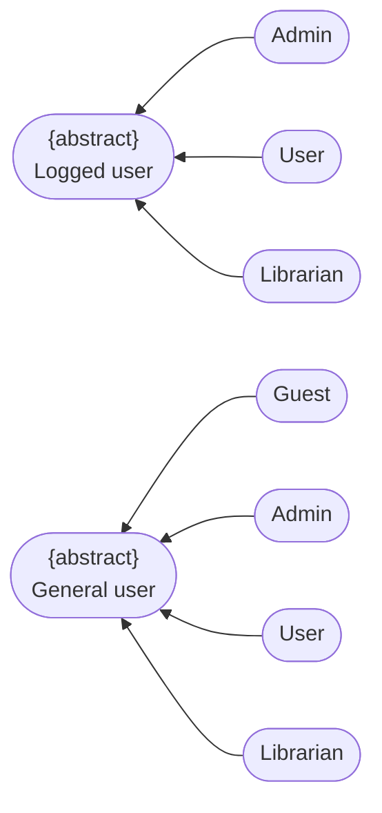
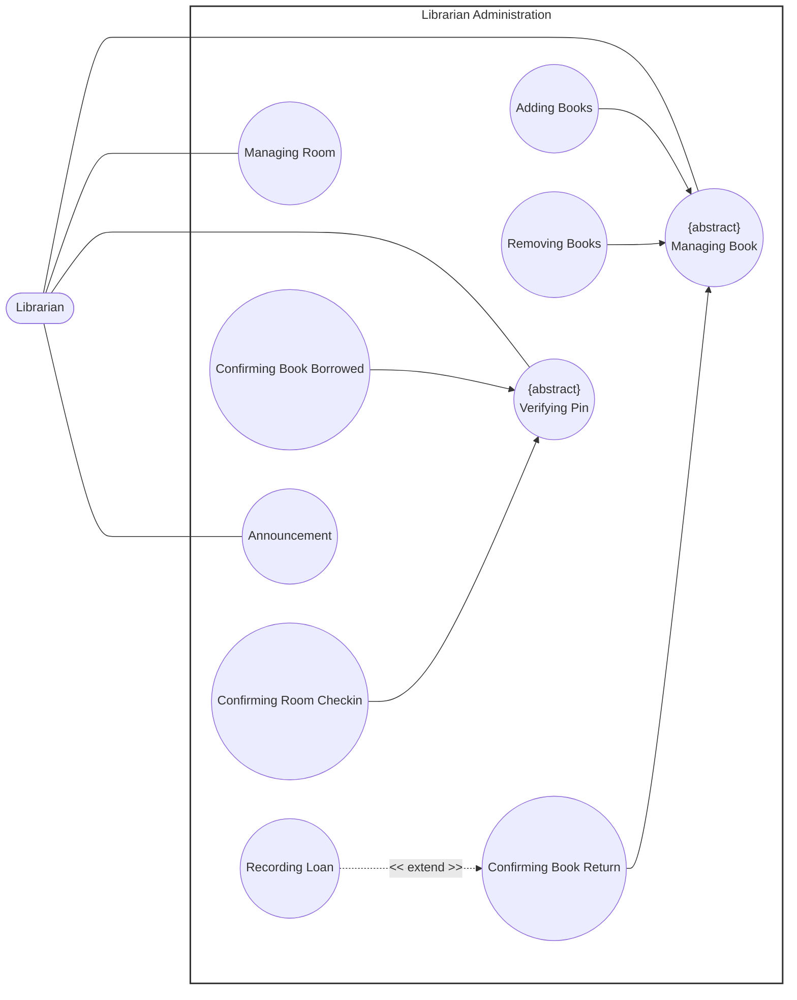
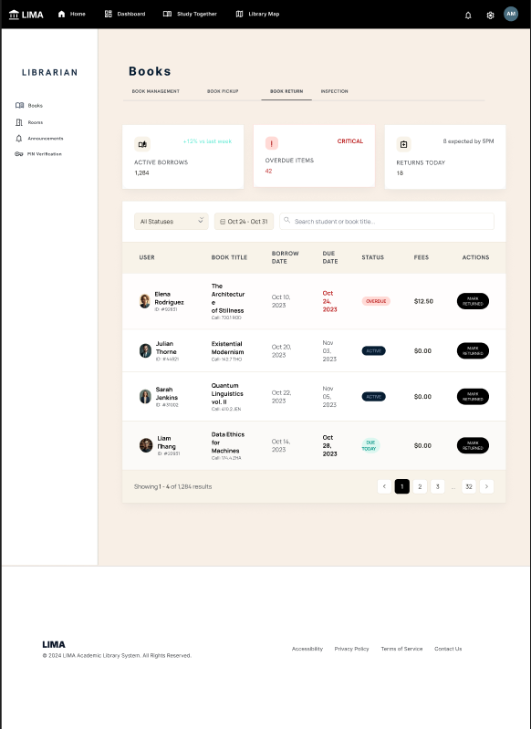

# Use-Case Specification: Librarian Administration

**Group Name:** Amethyst

**Project Name:** Modern Library Management System

**Version:** 1.1

**Date:** 21-Jul-2026

**Document Identifier:** NGLP-SRS-LIB-001

---

## Revision History

| Date | Version | Description | Author |
| --- | --- | --- | --- |
| 21-Jul-2026 | 1.1 | Librarian Administration use case specification (RUP specification layout). | Phan Lê Anh Minh, Trần Lê Hoàng Gia |

---

## Table of Contents
1. [Regulation](#regulation)
2. [Use case diagram](#use-case-diagram)
3. [UC-LIB-01: Managing Book (abstract)](#uc-lib-01-managing-book-abstract)
4. [UC-LIB-02: Adding Books](#uc-lib-02-adding-books)
5. [UC-LIB-03: Removing Books](#uc-lib-03-removing-books)
6. [UC-LIB-04: Confirming Book Return](#uc-lib-04-confirming-book-return)
7. [UC-LIB-05: Recording Loan](#uc-lib-05-recording-loan)
8. [UC-LIB-06: Managing Room (abstract)](#uc-lib-06-managing-room-abstract)
9. [UC-LIB-07: Verifying Pin (abstract)](#uc-lib-07-verifying-pin-abstract)
10. [UC-LIB-08: Confirming Book Borrowed](#uc-lib-08-confirming-book-borrowed)
11. [UC-LIB-09: Confirming Room Checkin](#uc-lib-09-confirming-room-checkin)
12. [UC-LIB-10: Announcement](#uc-lib-10-announcement)

---

## Regulation

---

## Use case diagram

---

## UC-LIB-01: Managing Book (abstract)

*Specialized by Adding Books, Removing Books, and Confirming Book Return.*

### 1. Use-Case Name

Managing Book

#### 1.1 Brief Description

Abstract use case representing the Librarian's general capability to manage book records in the catalog. It is not instantiated directly; its behavior is defined entirely by its specializations.

### 2. Flow of Events

#### 2.1 Basic Flow

Not applicable. As an abstract use case, Managing Book has no independent flow of events.

#### 2.2 Alternative Flows

Not applicable.

### 3. Special Requirements

This use case cannot be instantiated on its own; it is realized exclusively through UC-LIB-02 (Adding Books), UC-LIB-03 (Removing Books), and UC-LIB-04 (Confirming Book Return).

### 4. Preconditions

Not applicable.

### 5. Postconditions

Not applicable.

### 6. Extension Points

None.

---

## UC-LIB-02: Adding Books

*Specializes UC-LIB-01 (Managing Book).*

### 1. Use-Case Name

Adding Books

#### 1.1 Brief Description

Allows the Librarian to add a new book record to the library catalog.

### 2. Flow of Events

#### 2.1 Basic Flow

1. **[Actor Action]**: The Librarian selects the "Add Book" option.
2. **[System Response]**: The system displays the book entry form.
3. **[Actor Action]**: The Librarian enters the book's details, including title and author.
4. **[Actor Action]**: The Librarian submits the form.
5. **[Data Processing]**: The system validates the entered data and confirms the book is not already in the catalog.
6. **[Data Processing]**: The system stores the new book record.
7. **[Display Result]**: The system confirms the addition to the Librarian.

#### 2.2 Alternative Flows

##### 2.2.1 Invalid or Duplicate Data (Step 5)

If the entered data is invalid or matches an existing catalog entry:

1. The system rejects the submission.
2. The system displays an error message and prompts the Librarian to correct the entry.

* **Postcondition (Alternative Flow):** No new book record is created; the entry form remains open pending correction.

### 3. Special Requirements

#### 3.1 Catalog Uniqueness

Each book's identifying information must be unique within the catalog.

### 4. Preconditions

#### 4.1 Verified Authentication State

The Librarian has successfully authenticated.

#### 4.2 Catalog Uniqueness Check

The book to be added does not already exist in the catalog.

### 5. Postconditions

#### 5.1 Catalog Update

A new book record is stored in the catalog and becomes available for borrowing.

### 6. Extension Points

None.

### 7. Prototype Screen

---

## UC-LIB-03: Removing Books

*Specializes UC-LIB-01 (Managing Book).*

### 1. Use-Case Name

Removing Books

#### 1.1 Brief Description

Allows the Librarian to remove an existing book record from the library catalog.

### 2. Flow of Events

#### 2.1 Basic Flow

1. **[Actor Action]**: The Librarian selects the "Remove Book" option.
2. **[System Response]**: The system displays a book search interface.
3. **[Actor Action]**: The Librarian searches for and selects the book to remove.
4. **[Data Processing]**: The system checks the book's current loan status.
5. **[Actor Action]**: The Librarian confirms the removal.
6. **[Data Processing]**: The system removes the book record.
7. **[Display Result]**: The system confirms the removal to the Librarian.

#### 2.2 Alternative Flows

##### 2.2.1 Book Currently on Loan (Step 4)

If the selected book is currently on loan:

1. The system prevents the removal.
2. The system displays a warning to the Librarian.

* **Postcondition (Alternative Flow):** No removal is performed; the book record remains unchanged.

### 3. Special Requirements

#### 3.1 Loan Status Restriction

A book that is currently on loan cannot be removed until it is returned.

### 4. Preconditions

#### 4.1 Verified Authentication State

The Librarian has successfully authenticated.

#### 4.2 Existing Catalog Entry

The book to be removed exists in the catalog.

### 5. Postconditions

#### 5.1 Catalog Update

The selected book record is removed from the catalog.

### 6. Extension Points

None.

### 7. Prototype Screen

---

## UC-LIB-04: Confirming Book Return

*Extended by Recording Loan (at Step 5). Specializes UC-LIB-01 (Managing Book).*

### 1. Use-Case Name

Confirming Book Return

#### 1.1 Brief Description

Allows the Librarian to confirm that a borrowed book has been physically returned, updating the associated loan record.

### 2. Flow of Events

#### 2.1 Basic Flow

1. **[Actor Action]**: The Librarian selects the "Confirm Book Return" option.
2. **[System Response]**: The system displays a search interface for active loans.
3. **[Actor Action]**: The Librarian selects or scans the book being returned.
4. **[Data Processing]**: The system marks the associated loan record as returned and updates the book's availability.
5. **[System Response]**: The system confirms the return and exposes the option to record a new loan for the returned book.

#### 2.2 Alternative Flows

##### 2.2.1 Record New Loan (Step 5)

If the Librarian chooses to loan the returned book to another member immediately:

1. The system invokes Recording Loan (UC-LIB-05).
2. Control returns to this use case upon completion, and the use case ends.

* **Postcondition (Alternative Flow):** Control passes to UC-LIB-05 (Recording Loan); the postconditions of that use case apply upon completion.

### 3. Special Requirements

#### 3.1 Extension Timing

The option to record a new loan is available only after the return has been confirmed; invoking it is optional.

### 4. Preconditions

#### 4.1 Verified Authentication State

The Librarian has successfully authenticated.

#### 4.2 Active Loan Record

An active loan record exists for the book being returned.

### 5. Postconditions

#### 5.1 Loan Closure

The loan record is marked as returned and the book is marked as available.

### 6. Extension Points

#### 6.1 Recording Loan

* Location inside event flow: After the return is confirmed (Step 5).

### 7. Prototype Screen

---

## UC-LIB-05: Recording Loan

*Extends UC-LIB-04 (Confirming Book Return) — extension point: The Librarian chooses to loan the returned book to another member (at Step 5).*

### 1. Use-Case Name

Recording Loan

#### 1.1 Brief Description

Extends Confirming Book Return to let the Librarian record a new loan of a book to a member. It may also be initiated directly, outside the extension point.

### 2. Flow of Events

#### 2.1 Basic Flow

1. **[Actor Action]**: The Librarian initiates loan recording, either directly or via the extension point of Confirming Book Return.
2. **[Actor Action]**: The Librarian enters or selects the member's identification.
3. **[Actor Action]**: The Librarian selects the book to be loaned.
4. **[Data Processing]**: The system validates the member's eligibility and the book's availability.
5. **[Data Processing]**: The system creates a new loan record and calculates the due date.
6. **[Display Result]**: The system confirms the recorded loan to the Librarian.

#### 2.2 Alternative Flows

##### 2.2.1 Member Ineligible (Step 4)

If the member is not eligible to borrow:

1. The system denies the loan.
2. The system displays the reason to the Librarian.

* **Postcondition (Alternative Flow):** No loan record is created.

### 3. Special Requirements

#### 3.1 Due Date Calculation

The due date is calculated according to the library's loan policy.

### 4. Preconditions

#### 4.1 Verified Authentication State

The Librarian has successfully authenticated.

#### 4.2 Selected Book and Member

The selected book exists in the catalog and a member has been identified.

### 5. Postconditions

#### 5.1 Loan Creation

A new loan record is created and the selected book is marked as on loan.

### 6. Extension Points

None.

### 7. Prototype Screen

---

## UC-LIB-06: Managing Room (abstract)

*Abstract use case; the use case diagram does not depict any specialization for this functional group.*

### 1. Use-Case Name

Managing Room

#### 1.1 Brief Description

Abstract use case representing the Librarian's general capability to manage library rooms.

### 2. Flow of Events

#### 2.1 Basic Flow

Not applicable. As an abstract use case, Managing Room has no independent flow of events.

#### 2.2 Alternative Flows

Not applicable.

### 3. Special Requirements

This use case cannot be instantiated on its own. No concrete specialization is currently documented for this functional group.

### 4. Preconditions

Not applicable.

### 5. Postconditions

Not applicable.

### 6. Extension Points

None.

---

## UC-LIB-07: Verifying Pin (abstract)

*Specialized by Confirming Book Borrowed and Confirming Room Checkin.*

### 1. Use-Case Name

Verifying Pin

#### 1.1 Brief Description

Abstract use case representing the shared purpose of the Librarian's PIN-verification use cases: confirming a book borrowing and confirming a room check-in.

### 2. Flow of Events

#### 2.1 Basic Flow

Not applicable. As an abstract use case, Verifying Pin has no independent flow of events.

#### 2.2 Alternative Flows

Not applicable.

### 3. Special Requirements

This use case cannot be instantiated on its own; it is realized exclusively through UC-LIB-08 (Confirming Book Borrowed) and UC-LIB-09 (Confirming Room Checkin).

### 4. Preconditions

Not applicable.

### 5. Postconditions

Not applicable.

### 6. Extension Points

None.

---

## UC-LIB-08: Confirming Book Borrowed

*Specializes UC-LIB-07 (Verifying Pin).*

### 1. Use-Case Name

Confirming Book Borrowed

#### 1.1 Brief Description

Allows the Librarian to confirm a book borrowing transaction by verifying the borrowing member's PIN.

### 2. Flow of Events

#### 2.1 Basic Flow

1. **[Actor Action]**: The Librarian initiates confirmation of the book borrowing transaction.
2. **[System Response]**: The system prompts for the member's PIN.
3. **[Actor Action]**: The Librarian enters the member's PIN.
4. **[Data Processing]**: The system verifies the PIN against the member's record.
5. **[Data Processing]**: The system marks the transaction as confirmed and logs the confirmation.

#### 2.2 Alternative Flows

##### 2.2.1 Incorrect PIN (Step 4)

If the entered PIN is invalid:

1. The system displays an error message.
2. The flow returns to Basic Flow step 2.

* **Postcondition (Alternative Flow):** The borrowing transaction remains unconfirmed.

### 3. Special Requirements

#### 3.1 Attempt Limiting

The system should limit the number of consecutive invalid PIN attempts.

### 4. Preconditions

#### 4.1 Verified Authentication State

The Librarian has successfully authenticated.

#### 4.2 Pending Transaction

A book borrowing transaction is in progress and awaiting confirmation.

### 5. Postconditions

#### 5.1 Transaction Confirmation

The member's identity is verified and the borrowing transaction is confirmed.

### 6. Extension Points

None.

### 7. Prototype Screen

---

## UC-LIB-09: Confirming Room Checkin

*Specializes UC-LIB-07 (Verifying Pin).*

### 1. Use-Case Name

Confirming Room Checkin

#### 1.1 Brief Description

Allows the Librarian to confirm a member's check-in to a library room by verifying the member's PIN.

### 2. Flow of Events

#### 2.1 Basic Flow

1. **[Actor Action]**: The Librarian initiates confirmation of the room check-in transaction.
2. **[System Response]**: The system prompts for the member's PIN.
3. **[Actor Action]**: The Librarian enters the member's PIN.
4. **[Data Processing]**: The system verifies the PIN against the member's record.
5. **[Data Processing]**: The system marks the member as checked into the room and logs the confirmation.

#### 2.2 Alternative Flows

##### 2.2.1 Incorrect PIN (Step 4)

If the entered PIN is invalid:

1. The system displays an error message.
2. The flow returns to Basic Flow step 2.

* **Postcondition (Alternative Flow):** The room check-in remains unconfirmed.

### 3. Special Requirements

#### 3.1 Attempt Limiting

The system should limit the number of consecutive invalid PIN attempts.

### 4. Preconditions

#### 4.1 Verified Authentication State

The Librarian has successfully authenticated.

#### 4.2 Pending Transaction

A room check-in transaction is in progress and awaiting confirmation.

### 5. Postconditions

#### 5.1 Transaction Confirmation

The member's identity is verified and the member is confirmed as checked into the room.

### 6. Extension Points

None.

### 7. Prototype Screen

---

## UC-LIB-10: Announcement

### 1. Use-Case Name

Announcement

#### 1.1 Brief Description

Allows the Librarian to create and publish an announcement for library members.

### 2. Flow of Events

#### 2.1 Basic Flow

1. **[Actor Action]**: The Librarian selects the "Create Announcement" option.
2. **[System Response]**: The system displays the announcement entry form.
3. **[Actor Action]**: The Librarian enters the announcement details.
4. **[Actor Action]**: The Librarian submits the announcement.
5. **[Data Processing]**: The system validates the content and publishes the announcement.
6. **[Display Result]**: The system confirms the publication to the Librarian.

#### 2.2 Alternative Flows

##### 2.2.1 Invalid Content (Step 5)

If required fields are missing or the content is invalid:

1. The system rejects the submission.
2. The system displays a validation error and prompts the Librarian to correct the entry.

* **Postcondition (Alternative Flow):** No announcement is published; the entry form remains open pending correction.

### 3. Special Requirements

#### 3.1 Content Validation

Required fields, such as title and content, must be validated before publication.

### 4. Preconditions

#### 4.1 Verified Authentication State

The Librarian has successfully authenticated.

### 5. Postconditions

#### 5.1 Publication

The announcement is published and stored in the system.

### 6. Extension Points

None.

### 7. Prototype Screen
