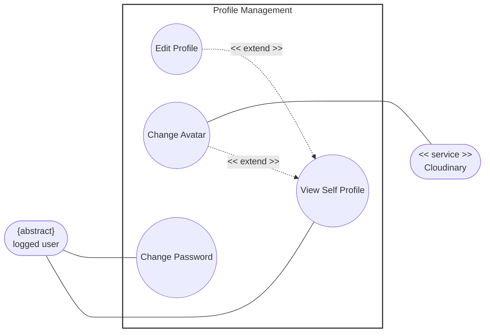

# Profile Management Usecase

## 1. View Self Profile

*Extended by `Edit profile` and `Change avatar` (at step 5)*

|**Field**|**Description**|
|---|---|
|**Use case ID**|UC-PROF-01|
|**Use Case Name**|View Self Profile|
|**Description**|Allows an authenticated user to view their personal profile page dashboard, showcasing their account metadata, current avatar, and personal details.|
|**Actor(s)**|Authenticated User, Cloud storage|
|**Preconditions**|- The user has successfully authenticated and holds an active session token.      - The user has navigated to the account settings layout area.|

### Main Flow

1. The user clicks on the "My Profile" item link within the primary navigation menu layout.
    
2. The system fetches the corresponding profile record metrics from the user database partition.
    
3. The system maps and populates user data fields (Display Name, Account Email, Registration Date) into the view interface template.
    
4. The system requests the active profile image thumbnail link to render the user's avatar image block.
    
5. The system exposes extension interface interaction triggers ("Edit Profile" and "Change Avatar" button widgets).
    

### Postconditions

- The user's complete private profile view profile template renders securely onto the client interface screen.
    

**Alternative / Exception Flows**

- **2'.1** Profile data records fail to resolve due to localized database connection drops: The system halts dashboard compilation steps and overlays a persistent error component banner layout: "Profile details are temporarily offline."
    

### Postconditions (Alternative Flows)

- **2'.1**: The screen display shows a structural retrieval error indicator; no empty form entry containers open.
    

### Special Requirements

- The profile dashboard viewport screen must obscure highly sensitive configuration values (such as underlying token identifiers) from plain view elements.
    

## 2. Edit Profile

_Extends UC-PROF-01 (View Self Profile) — extension point: User triggers the active "Edit Profile" control button link within the profile dashboard view layout._

|**Field**|**Description**|
|---|---|
|**Use case ID**|UC-PROF-02|
|**Use Case Name**|Edit Profile|
|**Description**|Extends the basic profile view dashboard by converting plain-text data fields into dynamic, editable input forms to let users update their personal details.|
|**Actor(s)**|Authenticated user|
|**Preconditions**|- The base use case `View Self Profile (UC-PROF-01)` must be currently active and rendering data on screen.|

### Main Flow

1. The user clicks the "Edit Profile" action button component widget.
    
2. The system toggles the dashboard interface layout state variables, swapping static display texts for live text input boxes.
    
3. The user modifies targeted data entry string values (e.g., changes their Display Name or Bio summary details).
    
4. The user clicks the "Save Changes" configuration submit button.
    
5. The system parses inputs, sanitizes string objects, and executes a database update sequence transaction against the target user data row columns.
    
6. The system switches the view screen state criteria back to the standard text-display layout mode and surfaces a brief confirmation success toast banner notice.
    

### Postconditions

- Revised personal metadata values write securely to production databases and update globally across active user session viewports.
    

**Alternative / Exception Flows**

- **5'.1**: Input text parsing rules flag validation constraint breakages (e.g. illegal structural characters in name elements): The system prevents data persistence steps, returns visual focus to the problem field element, and displays explicit error tips.
    

### Postconditions (Alternative Flows)

- **5'.1**: Database table values remain locked to historical state values; the input edit layout remains active pending string correction actions.
    

### Special Requirements

- None.
    

## 3. Change Avatar

*Extends UC-PROF-01 (View Self Profile) — extension point: User selects the profile picture thumbnail element or clicks the "Change Avatar" button action link.*

|**Field**|**Description**|
|---|---|
|**Use case ID**|UC-PROF-03|
|**Use Case Name**|Change Avatar|
|**Description**|Extends the base profile display context to allow users to upload, process, and attach a customized picture graphic to act as their system identity avatar icon.|
|**Actor(s)**|Authenticated user, Storage Service|
|**Preconditions**|- The user is currently interacting with the visual dashboard space inside `UC-PROF-01`.|

### Main Flow

1. The user clicks on the "Change Avatar" image editing control button widget.
    
2. The system triggers a local device filesystem upload dialogue wrapper window prompt.
    
3. The user selects a target image file object and approves submission steps.
    
4. The system validates the asset metadata properties client-side to verify file configuration boundaries match structural rules.
    
5. The system establishes an API communication uplink tunnel to stream the binary image payload object directly out to the external secondary **Storage Service**.
    
6. The **Storage Service** buffers the upload stream, saves the graphic file inside optimized media asset buckets, and passes a unique public reference image URL string parameter back down to the application server.
    
7. The system updates the user's base record rows inside the database, mapping the `avatar_url` coordinate pointer value to the fresh link string.
    
8. The system refreshes image element sources on screen to display the updated profile avatar graphic asset instantly.
    

### Postconditions

- Old media file references drop, target accounts link securely to new cloud image URLs, and graphics update across application headers.
    

**Alternative / Exception Flows**

- **4'.1** The selected graphic object file passes boundary parameters for maximum size limits (e.g., file sizes exceed 5MB benchmarks): The system halts processing loops immediately and alerts users via popup text blocks: "File exceeds maximum size limits."
    
- **4'.2** The file parsing script flags unacceptable format MIME types (e.g., user uploads raw text documents instead of JPEG/PNG engines): The system blocks transfer tasks and prints warning instructions.
    
- **6'.1** The connection interface endpoint linking application nodes to the external Storage Service encounters latency drops or timeouts: The system drops transaction states, clears target buffers, and fires an application interface error notice.
    

### Postconditions (Alternative Flows)

- **4'.1**: Network payloads are blocked from firing; user profile configuration records undergo zero status value changes.
    
- **4'.2**: The system drops data components instantly; upload form workspaces reset back to baseline resting defaults.
    
- **6'.1**: Media record rows within system database tables maintain original data entries; image displays roll back parameters to current images.
    

### Special Requirements

- Upload pipelines must run optimized image compressing scripts asynchronously to crop, square, and scale uploaded source files down to standardized thumbnail dimensions before cloud transmission steps.
    

## 4. Change Password

|**Field**|**Description**|
|---|---|
|**Use case ID**|UC-PROF-04|
|**Use Case Name**|Change Password|
|**Description**|Enables a logged-in system member to securely re-verify their identity credentials and initialize a password modification procedure to overwrite existing authentication keys.|
|**Actor(s)**|User|
|**Preconditions**|- The user maintains verified access status parameters and has loaded the security configurations panel menu space.|

### Main Flow

1. The user clicks the "Update Account Password" interaction panel control option.
    
2. The system generates a credential editing secure form layout showcasing input boxes labeled "Current Password", "New Password", and "Confirm New Password".
    
3. The user inputs their current secret key string along with a fresh replacement passphrase combination variant and triggers submission.
    
4. The system securely hashes the input "Current Password" to perform matching comparisons against verification strings recorded inside account user database table indices.
    
5. The system confirms credential accuracy, validates that the "New Password" string satisfies length and complexity parameter algorithms, and checks that both confirmation entries match exactly.
    
6. The system passes the new password text string through structural hashing algorithms, creating a unique replacement secure credential string object.
    
7. The system overrides database user authentication columns with the newly compiled hash values model.
    
8. The system renders a transaction complete validation message layout panel block and automatically log-purges other active stale cross-device cookie sessions for safety.
    

### Postconditions

- Core account verification criteria fields update fully within production data layers, forcing all subsequent device sign-in events to map to the fresh secret key strings.
    

**Alternative / Exception Flows**

- **4'.1** The validation evaluation proves the entered "Current Password" value fails signature matching metrics: The system stops processing, blocks database update transactions, and returns an error notice banner: "The current password entered is incorrect."
    
- **5'.1** The new replacement passphrase choice does not meet password density criteria benchmarks: The system refuses form submissions and underlines broken constraint text rules explicitly below the formatting inputs.
    
- **5'.2** The confirmation entry box input differs from the target characters mapped inside the first password initialization prompt field: The system prompts the user with warning text indicating: "New password fields do not match."
    

### Postconditions (Alternative Flows)

- 4'.1: Security tracking values count a configuration error instance; baseline account authentication records remain unchanged.
    
- 5'.1: Form view panels lock values in place; internal system tables reject any modification updates.
    
- 5'.2: Authentication databases cancel commitment actions; interface layouts await fresh confirmation re-entry typings.
    

### Special Requirements

- Entry placeholder forms must enforce hidden masking states (`type="password"`) on client interfaces to fully block shoulder-surfing security vulnerabilities.

# Use case diagram

