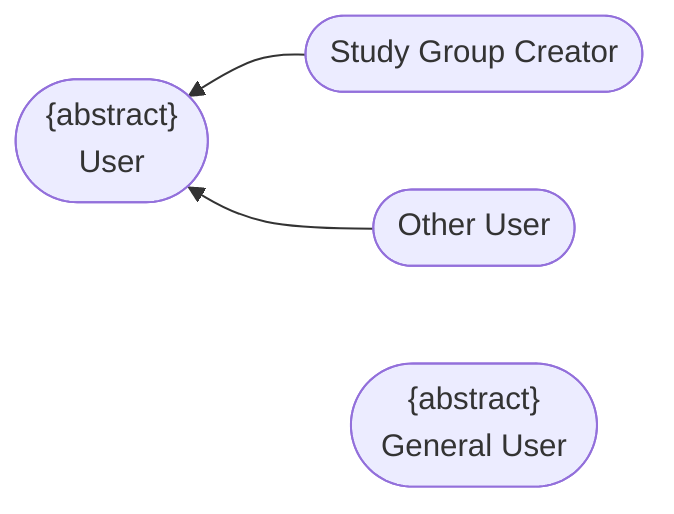
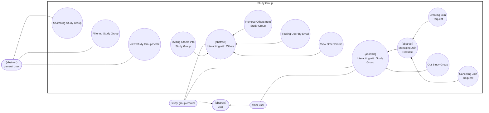

# Use-Case Specification: Study Group

**Group Name:** Amethyst

**Project Name:** Modern Library Management System

**Version:** 1.1

**Date:** 21-Jul-2026

**Document Identifier:** NGLP-SRS-SG-001

---

## Revision History

| Date | Version | Description | Author |
| --- | --- | --- | --- |
| 21-Jul-2026 | 1.1 | Study Group use case specification (RUP specification layout). | Phan Lê Anh Minh, Trần Lê Hoàng Gia |

---

## Table of Contents
1. [Regulation](#regulation)
2. [Use case diagram](#use-case-diagram)
3. [UC-SG-01: Searching Study Group](#uc-sg-01-searching-study-group)
4. [UC-SG-02: Filtering Study Group](#uc-sg-02-filtering-study-group)
5. [UC-SG-03: View Study Group Detail](#uc-sg-03-view-study-group-detail)
6. [UC-SG-04: Interacting with Others](#uc-sg-04-interacting-with-others)
7. [UC-SG-05: Inviting Others into Study Group](#uc-sg-05-inviting-others-into-study-group)
8. [UC-SG-06: Remove Others from Study Group](#uc-sg-06-remove-others-from-study-group)
9. [UC-SG-07: Finding User By Email](#uc-sg-07-finding-user-by-email)
10. [UC-SG-08: View Other Profile](#uc-sg-08-view-other-profile)
11. [UC-SG-09: Interacting with Study Group](#uc-sg-09-interacting-with-study-group)
12. [UC-SG-10: Managing Join Request](#uc-sg-10-managing-join-request)
13. [UC-SG-11: Creating Join Request](#uc-sg-11-creating-join-request)
14. [UC-SG-12: Canceling Join Request](#uc-sg-12-canceling-join-request)
15. [UC-SG-13: Out Study Group](#uc-sg-13-out-study-group)

---

## Regulation

*Note: General User is an independent actor for public browsing use cases and is not a specialization of User.*

---

## Use case diagram

---

## UC-SG-01: Searching Study Group

### 1. Use-Case Name

Searching Study Group

#### 1.1 Brief Description

Allows a General User to search for study groups by keyword.

### 2. Flow of Events

#### 2.1 Basic Flow

1. **[Actor Action]**: The General User navigates to the study group search interface.
2. **[Actor Action]**: The General User enters a search keyword.
3. **[Data Processing]**: The system validates the input.
4. **[Data Processing]**: The system retrieves study groups matching the keyword.
5. **[Display Result]**: The system displays the list of matching study groups.

#### 2.2 Alternative Flows

##### 2.2.1 Empty or Invalid Input (Step 3)

If the entered keyword is empty or invalid:

1. The system rejects the search request.
2. The system prompts the General User to enter a valid keyword.

* **Postcondition (Alternative Flow):** No search is executed; the General User remains on the search interface.

##### 2.2.2 No Matching Results (Step 4)

If no study groups match the keyword:

1. The system displays a "no results found" message.

* **Postcondition (Alternative Flow):** No study group list is displayed.

### 3. Special Requirements

#### 3.1 Response Time

Search results must be returned within an acceptable response time.

#### 3.2 Input Validation

Search input must be validated to prevent malformed or malicious queries.

### 4. Preconditions

#### 4.1 Feature Availability

The General User has access to the study group search feature.

### 5. Postconditions

#### 5.1 Result Display

A list of study groups matching the search criteria is displayed to the General User.

### 6. Extension Points

None.

### 7. Prototype Screen

### 7. Prototype Screen

---

## UC-SG-02: Filtering Study Group

### 1. Use-Case Name

Filtering Study Group

#### 1.1 Brief Description

Allows a General User to narrow a study group list using filter criteria such as subject, schedule, or size.

### 2. Flow of Events

#### 2.1 Basic Flow

1. **[Actor Action]**: The General User accesses a study group listing.
2. **[Actor Action]**: The General User selects one or more filter criteria.
3. **[Data Processing]**: The system validates the selected criteria.
4. **[Data Processing]**: The system applies the filters to the current list.
5. **[Display Result]**: The system displays the filtered list.

#### 2.2 Alternative Flows

##### 2.2.1 Invalid Filter Combination (Step 3)

If the selected filters are invalid or conflicting:

1. The system rejects the filter request.
2. The system notifies the General User and retains the previous list.

* **Postcondition (Alternative Flow):** The previous study group list remains displayed.

##### 2.2.2 No Results After Filtering (Step 4)

If no study groups match the filters:

1. The system displays a "no results found" message.
2. The system allows the General User to adjust the filters.

* **Postcondition (Alternative Flow):** The filtered list is empty.

### 3. Special Requirements

#### 3.1 Filter Usability

Filter options must be clearly presented and combinable where applicable.

### 4. Preconditions

#### 4.1 List Availability

A list of study groups is available for filtering (e.g., resulting from a search or a default listing).

### 5. Postconditions

#### 5.1 Result Display

The displayed list of study groups reflects the applied filter criteria.

### 6. Extension Points

None.

### 7. Prototype Screen

---

## UC-SG-03: View Study Group Detail

### 1. Use-Case Name

View Study Group Detail

#### 1.1 Brief Description

Allows a General User to view detailed information about a specific study group.

### 2. Flow of Events

#### 2.1 Basic Flow

1. **[Actor Action]**: The General User selects a study group from a list.
2. **[Data Processing]**: The system retrieves the study group's detailed information.
3. **[Display Result]**: The system displays the study group details, including description, members, and schedule.

#### 2.2 Alternative Flows

##### 2.2.1 Study Group Unavailable (Step 2)

If the selected study group no longer exists or is inaccessible:

1. The system displays an error message.

* **Postcondition (Alternative Flow):** No detail view is displayed.

### 3. Special Requirements

#### 3.1 Access Level

Only information appropriate to the requesting General User's access level is displayed.

### 4. Preconditions

#### 4.1 Group Accessibility

A study group exists and is accessible from a list (search or filtered results).

### 5. Postconditions

#### 5.1 Detail Display

The detailed information of the selected study group is displayed to the General User.

### 6. Extension Points

None.

### 7. Prototype Screen

---

## UC-SG-04: Interacting with Others

*Abstract use case.*

### 1. Use-Case Name

Interacting with Others

#### 1.1 Brief Description

Abstract use case representing the common purpose of the actions a Study Group Creator performs regarding other users associated with a study group.

### 2. Flow of Events

Not applicable; this is an abstract use case realized through its specializations.

### 3. Special Requirements

#### 3.1 Specializations

This use case is realized through:
- UC-SG-05 (Inviting Others into Study Group)
- UC-SG-06 (Remove Others from Study Group)
- UC-SG-07 (Finding User By Email)
- UC-SG-08 (View Other Profile)

### 4. Preconditions

Not applicable.

### 5. Postconditions

Not applicable.

### 6. Extension Points

None.

### 7. Prototype Screen

---

## UC-SG-05: Inviting Others into Study Group

*Specializes UC-SG-04 (Interacting with Others).*

### 1. Use-Case Name

Inviting Others into Study Group

#### 1.1 Brief Description

Allows the Study Group Creator to invite a user to join a study group they manage.

### 2. Flow of Events

#### 2.1 Basic Flow

1. **[Actor Action]**: The Study Group Creator selects the study group to invite a member to.
2. **[Actor Action]**: The Study Group Creator selects a user to invite, optionally using UC-SG-07 (Finding User By Email).
3. **[Data Processing]**: The system validates that the target user is not already a member of the study group.
4. **[Data Processing]**: The system sends an invitation to the target user.
5. **[Display Result]**: The system confirms to the Study Group Creator that the invitation was sent.

#### 2.2 Alternative Flows

##### 2.2.1 Target User Already a Member (Step 3)

If the target user is already a member of the study group:

1. The system displays an error message.
2. The system does not send an invitation.

* **Postcondition (Alternative Flow):** No invitation is sent; the study group membership remains unchanged.

### 3. Special Requirements

#### 3.1 Authorization

Only the study group creator may issue invitations for a given study group.

#### 3.2 Duplicate Prevention

Duplicate invitations to the same user for the same study group must be prevented.

### 4. Preconditions

#### 4.1 Authorization State

The Study Group Creator is authenticated and manages the selected study group.

### 5. Postconditions

#### 5.1 Invitation Issued

An invitation has been issued to the specified user for the selected study group.

### 6. Extension Points

None.

### 7. Prototype Screen

---

## UC-SG-06: Remove Others from Study Group

*Specializes UC-SG-04 (Interacting with Others).*

### 1. Use-Case Name

Remove Others from Study Group

#### 1.1 Brief Description

Allows the Study Group Creator to remove an existing member from a study group they manage.

### 2. Flow of Events

#### 2.1 Basic Flow

1. **[Actor Action]**: The Study Group Creator selects the study group and views its member list.
2. **[Actor Action]**: The Study Group Creator selects the member to remove.
3. **[System Response]**: The system requests confirmation of the removal.
4. **[Data Processing]**: The system removes the selected member from the study group.
5. **[Display Result]**: The system confirms the removal to the Study Group Creator.

#### 2.2 Alternative Flows

##### 2.2.1 Removal Canceled (Step 3)

If the Study Group Creator cancels the confirmation:

1. The system cancels the removal process.

* **Postcondition (Alternative Flow):** The study group membership remains unchanged.

##### 2.2.2 Target User Not a Member (Step 2)

If the selected user is not currently a member:

1. The system displays an error message.

* **Postcondition (Alternative Flow):** The study group membership remains unchanged.

### 3. Special Requirements

#### 3.1 Authorization

Only the study group creator may remove members from a study group they manage.

#### 3.2 Notification

The affected user should be notified of their removal.

### 4. Preconditions

#### 4.1 Authorization and Membership State

The Study Group Creator manages the study group; the target user is a current member of the study group.

### 5. Postconditions

#### 5.1 Membership Update

The selected member is no longer part of the study group.

### 6. Extension Points

None.

### 7. Prototype Screen

---

## UC-SG-07: Finding User By Email

*Specializes UC-SG-04 (Interacting with Others).*

### 1. Use-Case Name

Finding User By Email

#### 1.1 Brief Description

Allows the Study Group Creator to locate a registered user by email address, typically in support of inviting them to a study group.

### 2. Flow of Events

#### 2.1 Basic Flow

1. **[Actor Action]**: The Study Group Creator enters an email address to search for.
2. **[Data Processing]**: The system validates the format of the email address.
3. **[Data Processing]**: The system searches for a registered user matching the entered email address.
4. **[Display Result]**: The system displays the matching user's basic profile information.

#### 2.2 Alternative Flows

##### 2.2.1 Invalid Email Format (Step 2)

If the email format is invalid:

1. The system prompts the Study Group Creator to correct the input.

* **Postcondition (Alternative Flow):** No user information is displayed.

##### 2.2.2 No Matching User (Step 3)

If no registered user matches the provided email:

1. The system displays a "user not found" message.

* **Postcondition (Alternative Flow):** No user information is displayed.

### 3. Special Requirements

#### 3.1 Privacy

Only minimal, non-sensitive user information should be exposed through this lookup.

### 4. Preconditions

#### 4.1 Feature Availability

The Study Group Creator has access to the user lookup feature.

### 5. Postconditions

#### 5.1 Result Display

A user matching the provided email address, if found, is presented to the Study Group Creator.

### 6. Extension Points

None.

### 7. Prototype Screen

---

## UC-SG-08: View Other Profile

*Specializes UC-SG-04 (Interacting with Others).*

### 1. Use-Case Name

View Other Profile

#### 1.1 Brief Description

Allows the Study Group Creator to view the profile information of another user, such as a study group member or a prospective invitee.

### 2. Flow of Events

#### 2.1 Basic Flow

1. **[Actor Action]**: The Study Group Creator selects a user, e.g., from a member list or search result.
2. **[Data Processing]**: The system retrieves the selected user's profile information according to the target user's visibility settings.
3. **[Display Result]**: The system displays the profile to the Study Group Creator.

#### 2.2 Alternative Flows

##### 2.2.1 Profile Unavailable (Step 2)

If the target user's profile cannot be retrieved:

1. The system displays an error message.

* **Postcondition (Alternative Flow):** No profile information is displayed.

### 3. Special Requirements

#### 3.1 Visibility

Only profile information the target user has made visible/appropriate for this context should be shown.

### 4. Preconditions

#### 4.1 Profile Accessibility

The target user's profile exists and is accessible to the Study Group Creator.

### 5. Postconditions

#### 5.1 Profile Display

The requested user's profile information is displayed to the Study Group Creator.

### 6. Extension Points

None.

### 7. Prototype Screen

---

## UC-SG-09: Interacting with Study Group

*Abstract use case.*

### 1. Use-Case Name

Interacting with Study Group

#### 1.1 Brief Description

Abstract use case representing the common purpose of the actions a study group member (Study Group Creator or Other User) performs regarding their own participation in a study group.

### 2. Flow of Events

Not applicable; this is an abstract use case realized through its specializations.

### 3. Special Requirements

#### 3.1 Specializations

This use case is realized through:
- UC-SG-10 (Managing Join Request)
- UC-SG-13 (Out Study Group)

### 4. Preconditions

Not applicable.

### 5. Postconditions

Not applicable.

### 6. Extension Points

None.

### 7. Prototype Screen

---

## UC-SG-10: Managing Join Request

*Abstract use case.* *Specializes UC-SG-09 (Interacting with Study Group).*

### 1. Use-Case Name

Managing Join Request

#### 1.1 Brief Description

Abstract use case representing the common purpose of the actions related to a user's request to join a study group.

### 2. Flow of Events

Not applicable; this is an abstract use case realized through its specializations.

### 3. Special Requirements

#### 3.1 Specializations

This use case is realized through:
- UC-SG-11 (Creating Join Request)
- UC-SG-12 (Canceling Join Request)

### 4. Preconditions

Not applicable.

### 5. Postconditions

Not applicable.

### 6. Extension Points

None.

### 7. Prototype Screen

---

## UC-SG-11: Creating Join Request

*Specializes UC-SG-10 (Managing Join Request).*

### 1. Use-Case Name

Creating Join Request

#### 1.1 Brief Description

Allows a user to submit a request to join a study group.

### 2. Flow of Events

#### 2.1 Basic Flow

1. **[Actor Action]**: The Other User selects the study group they wish to join.
2. **[Actor Action]**: The Other User submits a request to join.
3. **[Data Processing]**: The system validates that the Other User is not already a member and has no existing pending request for the study group.
4. **[Data Processing]**: The system creates the join request and associates it with the study group.
5. **[Data Processing]**: The system notifies the Study Group Creator of the new join request.
6. **[Display Result]**: The system confirms to the Other User that the request has been submitted.

#### 2.2 Alternative Flows

##### 2.2.1 User Already a Member (Step 3)

If the Other User is already a member of the study group:

1. The system displays an error message.
2. The system does not create a request.

* **Postcondition (Alternative Flow):** No new join request is created.

##### 2.2.2 Duplicate Pending Request (Step 3)

If a pending join request already exists for the Other User and study group:

1. The system displays a message.
2. The system does not create a duplicate request.

* **Postcondition (Alternative Flow):** No new join request is created.

### 3. Special Requirements

#### 3.1 Request Limit

Each user may have at most one pending join request per study group at any given time.

### 4. Preconditions

#### 4.1 Authentication State

The Other User is authenticated, and the selected study group exists.

### 5. Postconditions

#### 5.1 Request Created

A pending join request for the Other User exists against the selected study group.

### 6. Extension Points

None.

### 7. Prototype Screen

---

## UC-SG-12: Canceling Join Request

*Specializes UC-SG-10 (Managing Join Request).*

### 1. Use-Case Name

Canceling Join Request

#### 1.1 Brief Description

Allows a user to cancel a previously submitted, still-pending join request for a study group.

### 2. Flow of Events

#### 2.1 Basic Flow

1. **[Actor Action]**: The Other User views their pending join request(s).
2. **[Actor Action]**: The Other User selects a pending join request to cancel.
3. **[Data Processing]**: The system validates that the selected request is still pending.
4. **[Data Processing]**: The system cancels the join request.
5. **[Display Result]**: The system confirms the cancellation to the Other User.

#### 2.2 Alternative Flows

##### 2.2.1 Request No Longer Pending (Step 3)

If the join request has already been resolved (e.g., approved or previously canceled):

1. The system displays an error message.
2. The system takes no action.

* **Postcondition (Alternative Flow):** The join request status remains unchanged.

### 3. Special Requirements

#### 3.1 Authorization

Only the user who created the join request may cancel it.

### 4. Preconditions

#### 4.1 Authentication State

The Other User is authenticated.

### 5. Postconditions

#### 5.1 Request Removed

The selected join request no longer exists / is no longer pending.

### 6. Extension Points

None.

---

## UC-SG-13: Out Study Group

*Specializes UC-SG-09 (Interacting with Study Group).*

### 1. Use-Case Name

Out Study Group

#### 1.1 Brief Description

Allows a study group member (Study Group Creator or Other User) to voluntarily leave a study group they currently belong to.

### 2. Flow of Events

#### 2.1 Basic Flow

1. **[Actor Action]**: The actor selects the study group they wish to leave.
2. **[Actor Action]**: The actor confirms the intent to leave the study group.
3. **[Data Processing]**: The system removes the actor from the study group's membership.
4. **[Display Result]**: The system confirms to the actor that they have left the study group.

#### 2.2 Alternative Flows

##### 2.2.1 Leave Not Confirmed (Step 2)

If the actor cancels the confirmation:

1. No membership change occurs.

* **Postcondition (Alternative Flow):** The actor's membership status remains unchanged.

### 3. Special Requirements

#### 3.1 Creator Succession

If the actor is the Study Group Creator, the system must ensure another member is assigned as the creator before the creator can leave.

### 4. Preconditions

#### 4.1 Membership State

The actor is authenticated and is a current member of the selected study group.

### 5. Postconditions

#### 5.1 Membership Update

The actor is no longer a member of the study group.

### 6. Extension Points

None.

### 7. Prototype Screen

