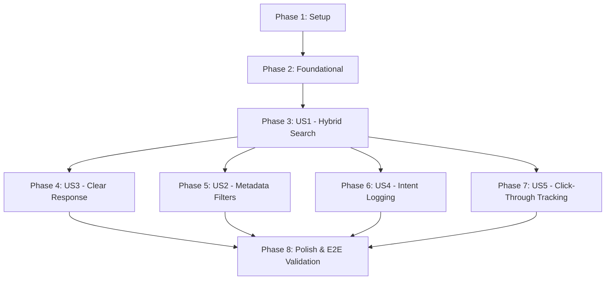

# Tasks: Hybrid Book Searching & Analytics Refinement

**Input**: Design documents from `specs/008-book-searching/`

**Prerequisites**: [plan.md](plan.md) (required), [spec.md](spec.md) (required for user stories), [research.md](research.md), [data-model.md](data-model.md), [contracts/api-contract.md](contracts/api-contract.md)

**Organization**: Tasks are grouped by setup, foundational components, and user story phases to ensure independent implementation, verification, and testing of each piece of functionality.

---

## Format: `- [ ] [ID] [P?] [Story?] Description with file path`

- **[P]**: Can run in parallel (different files, no dependencies)
- **[Story]**: Label indicating the specific user story (US1, US2, US3, US4, US5)
- Clear file paths must be included in each task's description.

---

## Phase 1: Setup (Shared Infrastructure)

**Purpose**: Project initialization and package installation

- [X] T001 Add local transformer dependencies (`@xenova/transformers`) to the server package descriptor `server/package.json`

---

## Phase 2: Foundational (Blocking Prerequisites)

**Purpose**: Core database schema modifications and index creations that MUST be completed before implementing any user story.

**⚠️ CRITICAL**: No user story task can begin until this phase is complete.

- [X] T003 Execute migration queries to load `pg_trgm` and `pgvector` extensions and create indices (`idx_books_title_trgm`, `idx_books_publisher_trgm`, `idx_books_author_trgm`, and `idx_books_embedding_hnsw`) in database setup script/migration
- [X] T005 [P] Update model database fields mapping to support `search_content` in `server/src/models/history.models.mjs`

**Checkpoint**: Foundation ready - database indices and table layout are prepared.

---

## Phase 3: User Story 1 - Hybrid Search (Priority: P1) 🎯 MVP

**Goal**: Execute a single hybrid search combining trigram-based keyword search and pgvector semantic similarity search, merged using Reciprocal Rank Fusion (RRF).

**Independent Test**: Enter query `"teh harry poter adn goblet"` on the catalog page. Confirm that misspelled logical connectors (`teh`, `adn`) are stripped, exact/trigram and semantic similarity models execute simultaneously, RRF merges results, and matching books (e.g., "Harry Potter and the Goblet of Fire") are rendered in-place.

- [X] T006 [P] [US1] Load the local transformer model `all-MiniLM-L6-v2` and implement raw vector embedding generation in `server/src/services/embedding.services.mjs`
- [X] T007 [US1] Implement regex pre-processing to filter out misspelled connector strings and extract query fragments in `server/src/services/search.services.mjs`
- [X] T008 [US1] Implement trigram similarity SQL query logic for the Text Path in `server/src/services/search.services.mjs`
- [X] T009 [US1] Implement pgvector cosine similarity SQL query logic for the Semantic Path in `server/src/services/search.services.mjs`
- [X] T010 [US1] Implement the Reciprocal Rank Fusion (RRF) algorithm to rank and merge results from both paths in `server/src/services/search.services.mjs`
- [X] T011 [US1] Update the controllers to coordinate search request inputs and invoke the hybrid search service in `server/src/controllers/search.controllers.mjs`
- [X] T012 [US1] Update frontend search query parsing and submission handlers inside `client/app/components/molecules/SearchBar.tsx`
- [X] T013 [US1] Update state management to fetch from the `/api/search` endpoint and trigger catalog rendering inside `client/app/library/page.tsx`
- [X] T014 [US1] Modify catalog layout to fetch and display the hybrid results in-place inside `client/app/components/organisms/PopularPublishes.tsx`

**Checkpoint**: Hybrid search is fully functional and replaces the default catalog view on `/library` dynamically.

---

## Phase 4: User Story 3 - Clear Response for No Matches (Priority: P1)

**Goal**: Display a user-friendly message and suggestions when a hybrid search query yields zero results.

**Independent Test**: Enter a random string of characters (e.g., `"xyzqwe123"`) in the search bar. Verify that the catalog grid renders a clean empty-state message with suggestions rather than crashing or showing a blank grid.

- [X] T015 [US3] Add fallback UI and tips rendering for empty search arrays in `client/app/components/organisms/PopularPublishes.tsx`
- [X] T016 [US3] Create or edit error feedback component `client/app/components/molecules/EmptySearchResults.tsx` to display helpful spelling or filter reset suggestions

**Checkpoint**: Zero-result searches degrade gracefully to empty-state guides.

---

## Phase 5: User Story 2 - Metadata Filtering in Hybrid Search (Priority: P2)

**Goal**: Apply metadata filters (Genre, publication year range, page count, and language) in-place on top of the RRF-ranked hybrid search results.

**Independent Test**: Execute a hybrid search for `"wizard academy"`, apply the genre filter `"Fantasy"` and language `"English"` from the slide-out panel, and verify the results grid updates in-place to only list books matching those filters.

- [X] T017 [US2] Remove the Search Mode toggle selector (Standard vs Semantic) from the filter panel drawer UI in `client/app/components/organisms/FilterPanel.tsx`
- [X] T018 [US2] Update state bindings to pass active filter options (genres, yearRange, pageCount, languages) from `client/app/library/page.tsx` to search payloads
- [X] T019 [US2] Implement filter clause application logic on top of the RRF fused book list in `server/src/services/search.services.mjs`

**Checkpoint**: In-place filtering correctly refines hybrid search results.

---

## Phase 6: User Story 4 - Debounced Search vs. Intent History Logging (Priority: P2)

**Goal**: Debounce keystroke-based searches passing `logHistory: false` to prevent database log pollution, while writing a single persistent record to `search_history` with `search_content` when the search is submitted or filters are applied.

**Independent Test**: Type `"harry"` slowly. Confirm results update (debounced) but no DB writes occur. Hit Enter or apply a filter; check the database to confirm a single record is written under `search_content` capturing the composed string of query and active filter parameters.

- [X] T020 [US4] Implement composed string generation for query + filter parameters logging in `server/src/services/history.services.mjs`
- [X] T021 [US4] Update controller execution to conditionally invoke history logs depending on the `logHistory` parameter in `server/src/controllers/search.controllers.mjs`
- [X] T022 [US4] Implement request debouncing and logging parameter logic (logHistory: false during typing, logHistory: true on Enter/Filter change) in `client/app/library/page.tsx`
- [X] T023 [US4] Coordinate search submit event triggers inside search bar input keyup handlers in `client/app/components/molecules/SearchBar.tsx`

**Checkpoint**: Live typing fetches search results in-place without writing to database logs; search history is stored only on explicit user submissions.

---

## Phase 7: User Story 5 - Click-Through Tracking (Intent vs. Passive Clicks) (Priority: P2)

**Goal**: Link clicked result books with the corresponding search history log entry to record user intent, distinguishing result click-throughs from passive catalog browsing.

**Independent Test**: Search for a book, click it in the result list. Verify `POST /api/search/history/click` is sent and the book's ID is saved in the history log row. Passive clicks on the catalog without search queries must not trigger click tracking.

- [X] T024 [US5] Implement the POST API endpoint `/api/search/history/click` to append book IDs to `clickedBookIds` in `server/src/controllers/search.controllers.mjs`
- [X] T025 [US5] Add endpoint route registration for logging click events in `server/src/routes/search.routes.mjs`
- [X] T026 [US5] Implement results click tracking event trigger inside the card click click-through callbacks in `client/app/components/molecules/BookCard.tsx`
- [X] T027 [US5] Track active `searchHistoryId` returned in search responses and hook details navigations to trigger click logs in `client/app/library/page.tsx`

**Checkpoint**: Interacting with search result cards logs intent clicks directly linked to the user's search session.

---

## Phase 8: Polish & Cross-Cutting Concerns

**Purpose**: Fine-tuning, localization updates, and end-to-end integration validations.

- [X] T028 Update translation dictionary keys for empty search placeholders and status updates in `client/app/providers/I18nProvider.tsx` locale source files `en.json` and `vi.json`
- [X] T029 Perform code cleanup, unused CSS purging, and formatting verification across modified files
- [X] T030 Validate all five testing paths defined in `quickstart.md` to ensure correct hybrid lookup, graceful falls, and RRF reranking

---

## Dependencies & Execution Order

### Phase Dependencies



- **Setup (Phase 1)**: Must be executed first to install required packages.
- **Foundational (Phase 2)**: Sets up database migrations, columns, and indexes. It blocks all subsequent user stories.
- **User Story 1 (Phase 3)**: MVP target. Blocks other stories as it implements the core endpoint and page layout integrations.
- **User Stories 2, 3, 4, 5 (Phases 4-7)**: Dependent on US1 completion. Can be worked on in parallel.
- **Polish (Phase 8)**: Executed after all user stories are complete.

### Parallel Opportunities

- **T006 (embedding generator)** and **T007-T010 (SQL triggers and RRF matching)** can be implemented concurrently by separate backend developers.
- **T015 (grid empty states)** and **T016 (empty search card indicators)** can be built in parallel.
- **T017 (Filter panel update)** and **T018 (Client state hook updates)** are parallelizable.
- Once the backend POST click-tracking routes (**T024-T025**) are complete, the client card interaction logic (**T026-T027**) can be developed in parallel.

---

## Parallel Execution Example: User Story 1 Implementation

```bash
# Parallel Step 1: Model Setup & SQL Trigram Research
Task: "T006 [P] [US1] Load the local transformer model all-MiniLM-L6-v2 and implement raw vector embedding generation in server/src/services/embedding.services.mjs"
Task: "T007 [US1] Implement regex pre-processing to filter out misspelled connector strings and extract query fragments in server/src/services/search.services.mjs"

# Parallel Step 2: Client Visual Bindings
Task: "T012 [P] [US1] Update frontend search query parsing and submission handlers inside client/app/components/molecules/SearchBar.tsx"
Task: "T014 [US1] Modify catalog layout to fetch and display the hybrid results in-place inside client/app/components/organisms/PopularPublishes.tsx"
```

---

## Implementation Strategy

### MVP First (User Story 1 & 3 Only)

1. **Setup & Foundations**: Install `@xenova/transformers`, create GIN/HNSW indices, and rename the log table column.
2. **Hybrid Core**: Write the regex connector cleaner, concurrent trigram + pgvector SQL query, and RRF rank fusion logic.
3. **In-place Catalog Render**: Bind SearchBar Enter actions to trigger results fetching, rendering results in-place in PopularPublishes catalog.
4. **Empty Fallback**: Handle zero-result states safely using guidelines suggestions.
5. **Checkpoint validation**: Perform search queries for typos, exact titles, and concepts. Verify correct books return and catalog updates in-place.

### Incremental Feature Expansion

1. **Filtering Integration**: Update FilterPanel to drop the toggle and pass genres/year limits directly to the hybrid search endpoint.
2. **Conditional History logs**: Implement `logHistory: boolean` and debouncing typing hooks to prevent logging transient characters.
3. **Click metrics**: Map click-through event listener to search result book cards and save intent click references.
4. **E2E verification**: Validate full i18n support, local models failover logs, and final layout adjustments.
