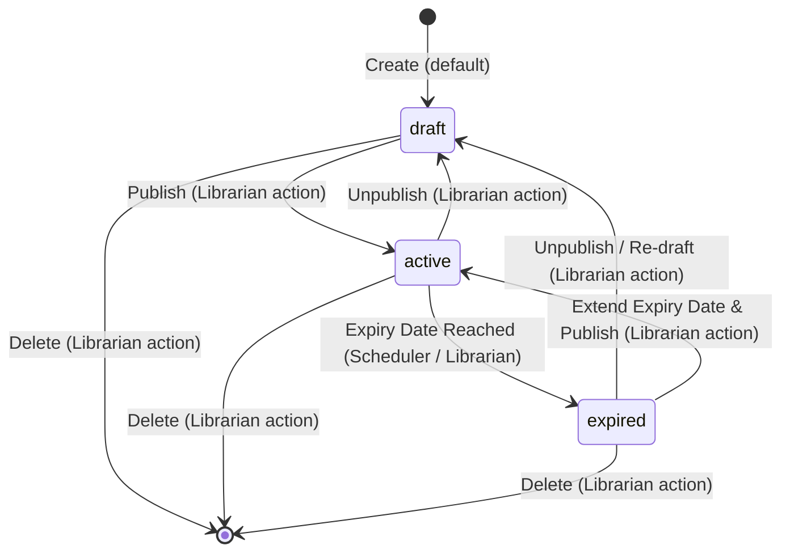

# Data Model: Announcement Management

This document details the database schema, entity attributes, validation rules, and state transitions for the Announcement entity.

## 1. Schema Definitions

The `announcements` table schema includes the following structure:

### `announcements` Table

| Column Name | Data Type | Constraints | Default | Description |
|-------------|-----------|-------------|---------|-------------|
| `announce_id` | `UUID` | `PRIMARY KEY` | `gen_random_uuid()` | Unique identifier for each announcement |
| `created_at` | `TIMESTAMP` | `NOT NULL` | `CURRENT_TIMESTAMP` | Date and time when the record was created |
| `expired_date` | `DATE` | `NULLABLE` | `NULL` | Optional date after which the announcement is expired |
| `title` | `TEXT` | `NOT NULL` | - | The title of the announcement |
| `content` | `TEXT` | `NOT NULL` | - | The body content of the announcement |
| `status` | `VARCHAR(20)` | `NOT NULL`, `CHECK (status IN ('draft', 'active', 'expired'))` | `'draft'` | The status of the announcement |

## 2. Entity States and Transitions

The announcement status field undergoes the following lifecycle transitions:

### Transition Triggers

1. **Librarian Create (Default)**: Creates a new record in `draft` status.
2. **Librarian Publish**: Moves the announcement status from `draft` to `active` to make it publicly viewable.
3. **Librarian Unpublish**: Resets status from `active` back to `draft`.
4. **Auto-Expiration (Scheduler)**: Background task runs and automatically changes status from `active` to `expired` if `expired_date` is strictly less than the current date (today).
5. **Librarian Edit**: If an announcement's expiration date is extended and status is republished, it transitions back to `active`.
6. **Librarian Delete**: Permanently removes the record from the database.
