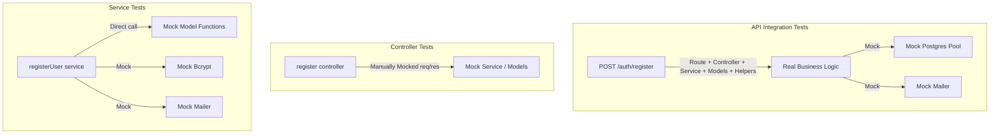

# Implementation Plan: Account Registration (Register) Flow Test Coverage

**Branch**: `022-register-test-coverage` | **Date**: 2026-07-03 | **Spec**: [/specs/022-register-test-coverage/spec.md](file:///D:/HK3/Library/AmeThyst-Library/src/specs/022-register-test-coverage/spec.md)

---

## Architecture Review

The Account Registration (`Register`) flow is a multi-layered process that coordinates validation, persistence, password encryption, and notifications:
1. **HTTP/Routing**: The client sends a `POST /auth/register` request containing `email`, `password`, and `username`.
2. **Controller (`register` in `auth.controllers.mjs`)**: Extracts parameters from the request body, invokes the registration service, and handles response mapping. Success results in status `201`. Errors containing conflict keywords return `409`, while database/network errors default to status `400`.
3. **Service (`registerUser` in `auth.services.mjs`)**:
   - Checks if the email exists in the `users` table via `findUserByEmail`.
   - Checks if an active pending registration exists in the `pending_users` table via `getPendingByEmail`.
   - If an expired pending registration exists (TTL > 5 minutes), it deletes it via `deletePendingByEmail`.
   - Encrypts the password using `bcrypt.hash` with 10 salt rounds.
   - Saves the pending registration inside a database transaction (`withTransaction` wrapping `replacePendingUser` to insert a token, email, username, and expiration time).
   - Triggers verification email delivery via `sendVerificationEmail`.
4. **Model/Data (`auth.models.mjs`)**: Issues parameterized queries to the PostgreSQL connection pool.
5. **Mailer (`mailer.mjs`)**: Utilizes `nodemailer` to dispatch SMTP emails containing the registration link.

---

## Test Architecture

The testing plan covers three distinct architectural layers to guarantee correctness across all components:



- **API Integration Tests**: Responsible for checking routing, Express JSON body parsing, parameter mapping, status codes, and error body shapes. It verifies the collaboration of Route, Controller, Service, Models, and AuthHelpers as a single unit, with only external network boundaries (Database and SMTP) mocked.
- **Controller Tests**: Responsible for verifying that the controller properly parses input requests and maps service-level outputs/exceptions into the appropriate HTTP status codes (`201`, `409`, `400`) and JSON error payloads.
- **Service Tests**: Responsible for verifying the specific workflows, conditional checks (active vs. expired pending registrations), encryption execution, transactional writes, and email triggers in isolation.

---

## Files to Create

The following new files will be created or initialized:
- `src/server/tests/integration/register.api.spec.mjs`: Holds the API-level integration tests utilizing a lightweight Express app and `supertest`.

---

## Files to Modify

The following existing files will be updated:
- `src/server/package.json`: Add `supertest` to `devDependencies` to support routing integration tests.
- `src/server/tests/controllers/register.controller.spec.mjs`: Complete the 10 scenarios at the controller layer using manually mocked `req` and `res` objects.
- `src/server/tests/services/register.service.spec.mjs`: Expand the existing test suite to cover all 10 registration scenarios directly at the service layer (`registerUser`).

---

## Mock Strategy

Only external infrastructure will be mocked. All internal business logic, validation rules, query string formats, and transaction orchestration must remain real.

- **Database Mocking**:
  - *Service and Controller Tests*: Mock higher-level model functions (`findUserByEmail`, `getPendingByEmail`, `deletePendingByEmail`) and helper functions (`withTransaction`, `replacePendingUser`) to test layer behavior in isolation.
  - *API Integration Tests*: Mock `src/server/src/config/postgres.mjs` directly by stubbing the pg `pool` object. Provide a mocked client return value for `pool.connect()` that supports simulated query responses (`query: vi.fn()`) and transactional controls (`BEGIN`, `COMMIT`, `ROLLBACK`).
- **SMTP/Email Mocking**:
  - Mock `src/server/src/utils/mailer.mjs` across all test layers to track `sendVerificationEmail` calls, verifying that email triggers execute with correct tokens and destination emails.
- **Bcrypt Mocking**:
  - Mock the `bcryptjs` module to return static hash strings, isolating test execution speed from bcrypt hashing workloads.

---

## Integration Strategy

Integration tests will test the actual routing pipeline without binding to a live network port:
1. Initialize a lightweight Express application inside the integration test:
   ```javascript
   import express from 'express';
   import authRoutes from '../../src/routes/auth.routes.mjs';
   
   const app = express();
   app.use(express.json());
   app.use('/auth', authRoutes);
   ```
2. Import `supertest` to dispatch simulated HTTP requests directly to the express pipeline.
3. Stub the pg `pool` query outputs for each test case to simulate user/pending records in various states.
4. Issue requests using `supertest(app).post('/auth/register')` and assert HTTP status codes and JSON payloads.

---

## Validation Strategy

All tests will adhere to existing conventions:
- **Vitest Framework**: Use default assertion conventions (`expect`, `vi.mock`, `vi.fn`, `beforeEach`).
- **No Architectural Drift**: Do not introduce custom testing utilities, testing frameworks, or alternative database abstraction classes.
- **Express Conventions**: Build standard request/response mocks (`req = { body: ... }`, `res.status().json()`) matching the codebase's existing pattern.

---

## Risk Analysis

- **Dependency installation in offline environments**: If the testing environment has restricted network access, adding `supertest` to `package.json` might fail.
  *Mitigation*: Verify network state and install `supertest` immediately. If installation is restricted, use a lightweight, hand-rolled HTTP test client wrapping the express router directly.
- **Vitest ESM Mocking Caveats**: In ES modules, module mocks (`vi.mock`) must be declared at the top of the file to ensure correct hoisting.
  *Mitigation*: Place all `vi.mock` declarations immediately below imports and verify mock isolation using `vi.clearAllMocks()` in `beforeEach`.
- **Database transaction mocking complexity**: Simulating client checkouts (`pool.connect`) and query executions inside transactions can lead to verbose test setup.
  *Mitigation*: Implement a clean, modular helper function within the integration test to easily setup mock database client states.

---

## Verification Plan

Verify the complete suite using the following commands:

1. **Controller Verification**:
   ```bash
   npx vitest run tests/controllers/register.controller.spec.mjs
   ```
2. **Service Verification**:
   ```bash
   npx vitest run tests/services/register.service.spec.mjs
   ```
3. **Integration Verification**:
   ```bash
   npx vitest run tests/integration/register.api.spec.mjs
   ```
4. **Full Suite Check**:
   Run `npm test` or `npx vitest run` from `src/server` to ensure all registration tests pass without regressions.
