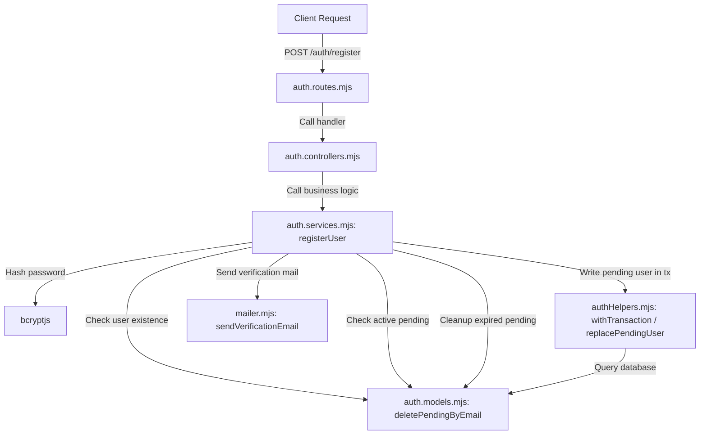

# Feature Specification: Account Registration (Register) Flow Test Coverage

**Feature Branch**: `022-register-test-coverage`

**Created**: 2026-07-03

**Status**: Completed

---

## 1. Feature Overview

The Account Registration (`Register`) flow of the AmeThyst Library handles the initial signup process for new users (e.g. students). The flow does NOT create a real user record immediately. Instead, it follows a secure multi-step verification model:
1. The user submits their registration details (`email`, `password`, `username`).
2. The system checks if the email is already in use by a real user or has an active pending registration.
3. If valid, the system hashes the password, creates a temporary pending user record with an expiration timestamp (5-minute TTL) and a unique verification token.
4. The system sends a verification email containing a link with the unique token.
5. The real user record is only created when the user verifies their email (out of scope for this feature specification).

---

## 2. Existing Architecture

The registration feature spans the following backend modules under `src/server/src/`:



- **Route (`routes/auth.routes.mjs`)**: Mounts the registration endpoint at `POST /auth/register` and maps it directly to the registration controller.
- **Controller (`controllers/auth.controllers.mjs`)**: Processes requests, extracts input parameters, triggers the service logic, handles exceptions, and returns appropriate status codes (201 for success, 409 for conflicts, 400 for general failures).
- **Service (`services/auth.services.mjs`)**: Coordinates the sequential workflow steps of registration, password encryption, database operations, and mail delivery.
- **Models (`models/auth.models.mjs`)**: Executes queries on the PostgreSQL pool (represented by `pool`) for users and pending registrations.
- **Auth Helpers (`utils/authHelpers.mjs`)**: Manages transactions (`withTransaction`) and handles the atomic creation/replacement of the pending registration row (`replacePendingUser`).
- **Mailer (`utils/mailer.mjs`)**: Configures nodemailer with SMTP settings to deliver the verification emails to target mailboxes.

---

## 3. Scope

This feature specification defines the complete automated test coverage for every layer of the registration flow to ensure it acts securely and reliably under normal and failure states. The testing scope includes:
- **API Integration Tests**: Testing the endpoint `POST /auth/register` to verify routing, headers, payload mapping, and end-to-end integration with mocked database/mail layers.
- **Controller Tests**: Isolated unit tests of the `register` route handler using manual Express-style `req` and `res` mocks, verifying correct mapping of service successes or exceptions to HTTP codes (201, 400, 409).
- **Service Tests**: Isolated testing of `registerUser` service logic, verifying function-level assertions and sequence boundaries.

---

## 4. Out of Scope

The following flows and components are not modified or covered by this test-coverage feature:
- The email verification flow (`verify-email` route/service).
- The resend verification flow (`resend-verification` route/service).
- User login, session management, password resets, and Google OAuth flows.
- Frontend components and UI pages in the Next.js app (`src/client`).
- Modification of existing production business logic or database schemas.

---

## 5. Testing Strategy

All tests will run in-memory utilizing Vitest's mocking facilities to prevent external side effects:
- **Zero Real Database Interaction**: Mocks `src/server/src/models/auth.models.mjs` and the connection pool query execution inside `src/server/src/utils/authHelpers.mjs`.
- **Zero Real SMTP Delivery**: Mocks `sendVerificationEmail` in `src/server/src/utils/mailer.mjs` to track calls without initiating actual SMTP requests.
- **Bcrypt Hashing Mock**: Mocks `bcryptjs` to guarantee consistent password hashing and isolate execution tests from bcrypt speed limits.
- **Express Mocks**: Builds manual request (`req.body`) and response mocks (`res.status`, `res.json`) to test HTTP layers in isolation.

---

## 6. Directory Structure

The files involved in the registration flow and their corresponding test files are outlined below:

```text
src/
├── server/
│   ├── src/
│   │   ├── routes/
│   │   │   └── auth.routes.mjs                     # Route mapping (POST /register)
│   │   ├── controllers/
│   │   │   └── auth.controllers.mjs                # Controller layer
│   │   ├── services/
│   │   │   └── auth.services.mjs                   # Service layer
│   │   ├── models/
│   │   │   └── auth.models.mjs                     # Model layer (DB queries)
│   │   └── utils/
│   │       ├── authHelpers.mjs                     # Transaction and TTL helper functions
│   │       └── mailer.mjs                          # SMTP email utility
│   └── tests/
│       ├── controllers/
│       │   └── register.controller.spec.mjs        # Controller-level unit tests
│       ├── services/
│       │   └── register.service.spec.mjs           # Service-level unit tests
│       └── integration/
│           └── register.api.spec.mjs               # Route/API integration tests
└── specs/
    └── 022-register-test-coverage/
        ├── spec.md                                 # This specification
        └── plan.md                                 # Implementation plan
```

---

## 7. Acceptance Criteria (Required Scenarios)

The test suites must cover exactly the following ten registration scenarios:

### Scenario 1: Successful registration
- **Given** a valid registration payload (`email`, `password`, `username`) where the email does not exist in the database,
- **When** the registration request is processed,
- **Then** the system:
  - Hashes the plaintext password.
  - Inserts exactly one pending user record containing the hashed password and a 5-minute TTL.
  - Sends a verification email containing a unique verification token.
  - Returns a success status code **201** with the success message.

### Scenario 2: Duplicate email
- **Given** a registration payload with an email that is already registered to a real user in the `users` table,
- **When** the registration request is processed,
- **Then** the system:
  - Aborts execution immediately.
  - Does NOT hash the password.
  - Does NOT write to the database or send an email.
  - Returns status code **409** with a conflict message.

### Scenario 3: Existing pending registration
- **Given** a registration payload with an email that has a pending record in `pending_users` which has NOT expired (active TTL),
- **When** the registration request is processed,
- **Then** the system:
  - Aborts execution immediately.
  - Leaves the existing pending user record intact (no deletion, no replacement).
  - Does NOT hash the password or send a new email.
  - Returns status code **409** with a conflict message.

### Scenario 4: Expired pending registration
- **Given** a registration payload with an email that has a pending record in `pending_users` which HAS expired (exceeded 5-minute TTL),
- **When** the registration request is processed,
- **Then** the system:
  - Deletes the expired pending record.
  - Hashes the password and creates a new pending user record.
  - Sends a new verification email.
  - Returns status code **201** with a success message.

### Scenario 5: Database failure while checking existing user
- **Given** an infrastructure error occurs (e.g. database down) when checking if the user already exists in the `users` table,
- **When** the registration request is processed,
- **Then** the system:
  - Halts execution immediately at the point of failure.
  - Propagates the error safely without crashing.
  - Returns status code **400** with the error details.
  - Performs no subsequent steps (no pending checks, no password hashing, no db inserts, no email sends).

### Scenario 6: Database failure while checking pending registration
- **Given** the user check succeeds, but an infrastructure error occurs when querying the `pending_users` table,
- **When** the registration request is processed,
- **Then** the system:
  - Halts execution immediately at the point of failure.
  - Propagates the error safely.
  - Returns status code **400** with the error details.
  - Performs no password hashing, database mutations, or email sends.

### Scenario 7: Password hashing failure
- **Given** database checks succeed, but the encryption function (`bcrypt.hash`) throws an error,
- **When** the registration request is processed,
- **Then** the system:
  - Halts execution immediately.
  - Returns status code **400** with the error details.
  - Does NOT create a pending user record or send an email.

### Scenario 8: Transaction / pending-user creation failure
- **Given** password hashing succeeds, but the database transaction to insert the pending user into the `pending_users` table fails,
- **When** the registration request is processed,
- **Then** the system:
  - Rolls back the transaction immediately.
  - Does NOT write any data (guaranteeing no half-finished records exist).
  - Does NOT trigger email delivery.
  - Returns status code **400** with the error details.

### Scenario 9: Verification email sending failure
- **Given** the pending registration record is successfully written to the database, but the email delivery function fails,
- **When** the registration request is processed,
- **Then** the system:
  - Propagates the mailing error safely.
  - Returns status code **400** with the error details.
  - *Note: As per existing business logic, the created pending row remains written in the DB.*

### Scenario 10: Expired pending cleanup failure
- **Given** an expired pending registration exists, but the database deletion query fails during the cleanup step,
- **When** the registration request is processed,
- **Then** the system:
  - Halts execution immediately.
  - Returns status code **400** with the error details.
  - Does NOT continue to hash the password or insert a new pending user row.

---

## 8. Non-functional Requirements

- **Security (Password Protection)**: Plainttext passwords must NEVER be saved, logged, or stored. Hashing must use `bcryptjs` with 10 salt rounds.
- **Integrity (Atomic States)**: Database state changes must be guarded by transactions so database operations do not leave partial/broken records.
- **Execution Performance**: The test suite must run purely in-memory. Individual tests must execute in less than 100ms to maintain fast CI/CD pipeline runs.
- **Stability**: The application must catch and bubble up all database/network anomalies gracefully to prevent server hanging or crashes.

---

## 9. Test Coverage

The following coverage targets must be satisfied:
- **100% path coverage** for the `registerUser` service method in `src/server/src/services/auth.services.mjs`.
- **100% path coverage** for the `register` route controller in `src/server/src/controllers/auth.controllers.mjs`.
- **100% validation coverage** across all ten specified scenarios across routes, controllers, and services.
- **API endpoint validation** covering routing and status responses for `POST /auth/register`.
