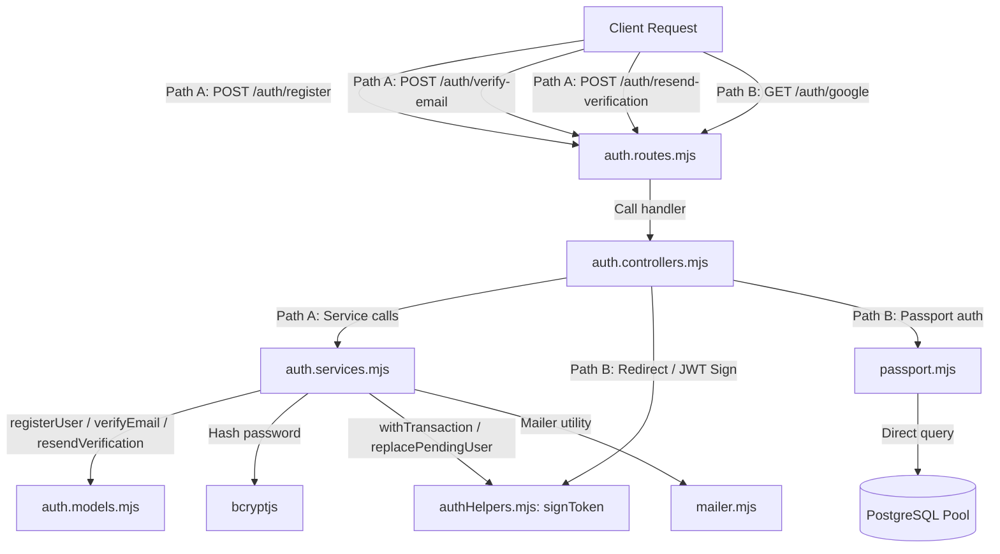

# Feature Specification: Account Registration (Register) Flow Test Coverage

**Feature Branch**: `022-register-test-coverage`

**Created**: 2026-07-03 (Updated: 2026-07-18)

**Status**: Completed (Amended: 2026-07-18)

---

## 1. Feature Overview

The Account Registration (`Register`) flow of the AmeThyst Library represents the complete journey of user account creation. The registration journey supports two distinct entry paths that both converge on a verified user record in the `users` table and an issued JSON Web Token (JWT) for authentication:

### Path A: Email/Password (Multi-Step, Token-Based Verification)
1. **Initiate (`POST /auth/register`)**: The user submits registration details. The system checks for existing records, hashes the password, and creates a pending record in `pending_users` with a 5-minute Time-To-Live (TTL). A verification email is sent; no record is written to the `users` table.
2. **Verify (`POST /auth/verify-email`)**: The user submits their token. The system verifies the token, moves the user payload into the `users` table inside a transaction, deletes the pending row, and returns a signed JWT and user payload.
3. **Resend (`POST /auth/resend-verification`)**: Refreshes the TTL and generates a new token for an existing pending registration, reusing the hashed password. Works regardless of whether the current token is active or expired.

### Path B: Google OAuth (Single-Step, Automated Provisioning)
4. **OAuth Flow (`GET /auth/google` → `GET /auth/google/callback`)**: Authenticates via Google. The callback handler in [passport.mjs](file:///D:/HK3/Library/AmeThyst-Library/src/server/src/config/passport.mjs) queries the database directly to check if the email exists. If not, it creates a user record immediately with `password_hash = 'GOOGLE_AUTH'`. The controller then signs a JWT and redirects the browser to `${CLIENT_URL}/auth/callback?token=...&user=...`.

---

## 2. Existing Architecture & Module Map

The registration and OAuth flow spans the following backend modules:



*   **Routes ([auth.routes.mjs](file:///D:/HK3/Library/AmeThyst-Library/src/server/src/routes/auth.routes.mjs))**: Mounts the routing endpoints for `POST /register`, `POST /verify-email`, `POST /resend-verification`, `GET /google`, and `GET /google/callback`.
*   **Controllers ([auth.controllers.mjs](file:///D:/HK3/Library/AmeThyst-Library/src/server/src/controllers/auth.controllers.mjs))**: Extracts HTTP bodies/queries, invokes services, maps exceptions to status codes, signs JWTs, and handles HTTP redirections.
*   **Services ([auth.services.mjs](file:///D:/HK3/Library/AmeThyst-Library/src/server/src/services/auth.services.mjs))**: Contains the business logic coordinating user searches, encryption, database transactions, TTL validation, and email dispatches.
*   **Models ([auth.models.mjs](file:///D:/HK3/Library/AmeThyst-Library/src/server/src/models/auth.models.mjs))**: Executes database queries on `users` and `pending_users`.
*   **Passport Configuration ([passport.mjs](file:///D:/HK3/Library/AmeThyst-Library/src/server/src/config/passport.mjs))**: Extends the Passport `GoogleStrategy` verify callback, querying the database pool directly to resolve existing emails and auto-provisioning new rows.
*   **Auth Helpers ([authHelpers.mjs](file:///D:/HK3/Library/AmeThyst-Library/src/server/src/utils/authHelpers.mjs))**: Handles transaction wrappers ([withTransaction](file:///D:/HK3/Library/AmeThyst-Library/src/server/src/utils/authHelpers.mjs#L22)), pending row replacement ([replacePendingUser](file:///D:/HK3/Library/AmeThyst-Library/src/server/src/utils/authHelpers.mjs#L42)), token signing ([signToken](file:///D:/HK3/Library/AmeThyst-Library/src/server/src/utils/authHelpers.mjs#L7)), and data mappings ([buildUserPayload](file:///D:/HK3/Library/AmeThyst-Library/src/server/src/utils/authHelpers.mjs#L14)).
*   **Mailer ([mailer.mjs](file:///D:/HK3/Library/AmeThyst-Library/src/server/src/utils/mailer.mjs))**: Transmits HTML mail via Nodemailer.

---

## 3. Scope

This specification covers the automated unit, controller, and API-level integration tests asserting the behavior of:
*   [auth.routes.mjs](file:///D:/HK3/Library/AmeThyst-Library/src/server/src/routes/auth.routes.mjs)
*   [auth.controllers.mjs](file:///D:/HK3/Library/AmeThyst-Library/src/server/src/controllers/auth.controllers.mjs)
*   [auth.services.mjs](file:///D:/HK3/Library/AmeThyst-Library/src/server/src/services/auth.services.mjs)
*   [auth.models.mjs](file:///D:/HK3/Library/AmeThyst-Library/src/server/src/models/auth.models.mjs)
*   [passport.mjs](file:///D:/HK3/Library/AmeThyst-Library/src/server/src/config/passport.mjs)
*   [authHelpers.mjs](file:///D:/HK3/Library/AmeThyst-Library/src/server/src/utils/authHelpers.mjs)
*   [mailer.mjs](file:///D:/HK3/Library/AmeThyst-Library/src/server/src/utils/mailer.mjs)

### Out of Scope
*   Standard username/password login flows ([loginUser](file:///D:/HK3/Library/AmeThyst-Library/src/server/src/services/auth.services.mjs#L99)).
*   OTP-based password recovery flows (`forgotPassword`, `verifyOtp`, and `resetPassword` services in [otp.service.mjs](file:///D:/HK3/Library/AmeThyst-Library/src/server/src/services/otp.service.mjs)).
*   Client-side Next.js interfaces and OAuth callback redirection pages.
*   Altering production database schemas or modifying underlying validation constraints.
*   Resolving the Google OAuth account-linking logic (retaining original password hash vs. overwriting).
*   Undocumented helper test file [authHelpers.spec.mjs](file:///D:/HK3/Library/AmeThyst-Library/src/server/tests/utils/authHelpers.spec.mjs), which is outside the scope of Feature 022.


---

## 4. Unified Business Scenarios

The test coverage validates exactly 10 unified business scenarios across the entire registration and account-creation journey:

### 1. Successful End-to-End Registration (Register → Verify → JWT Issued)
*   **Given**: A registration payload with an email that is neither in the `users` table nor exists in `pending_users`.
*   **When**: The user calls `POST /auth/register` and subsequently triggers `POST /auth/verify-email` using the received token.
*   **Then**:
    *   **Route/HTTP**: `POST /auth/register` returns `201 Created` with a confirmation message JSON. `POST /auth/verify-email` returns `200 OK` with JSON containing a `{ token, user }` payload.
    *   **Controller**: [register](file:///D:/HK3/Library/AmeThyst-Library/src/server/src/controllers/auth.controllers.mjs#L9) invokes [registerUser](file:///D:/HK3/Library/AmeThyst-Library/src/server/src/services/auth.services.mjs#L22); [verifyEmailHandler](file:///D:/HK3/Library/AmeThyst-Library/src/server/src/controllers/auth.controllers.mjs#L20) invokes [verifyEmail](file:///D:/HK3/Library/AmeThyst-Library/src/server/src/services/auth.services.mjs#L46).
    *   **Service**: [registerUser](file:///D:/HK3/Library/AmeThyst-Library/src/server/src/services/auth.services.mjs#L22) hashes the password and writes a pending record. [verifyEmail](file:///D:/HK3/Library/AmeThyst-Library/src/server/src/services/auth.services.mjs#L46) validates the token, signs a JWT, and filters the user payload.
    *   **Model/Database**:
        *   Checks [findUserByEmail](file:///D:/HK3/Library/AmeThyst-Library/src/server/src/models/auth.models.mjs#L5) and [getPendingByEmail](file:///D:/HK3/Library/AmeThyst-Library/src/server/src/models/auth.models.mjs#L23) (both return null).
        *   Writes to `pending_users` via [replacePendingUser](file:///D:/HK3/Library/AmeThyst-Library/src/server/src/utils/authHelpers.mjs#L42) within a transaction.
        *   Fetches row from `pending_users` by token, checks [findUserByEmail](file:///D:/HK3/Library/AmeThyst-Library/src/server/src/models/auth.models.mjs#L5) (returns null), writes to `users` via [insertUserFromPending](file:///D:/HK3/Library/AmeThyst-Library/src/server/src/models/auth.models.mjs#L39), and calls [deletePendingByToken](file:///D:/HK3/Library/AmeThyst-Library/src/server/src/models/auth.models.mjs#L31) inside a transaction.
    *   **Third-Party/Mailer**: [sendVerificationEmail](file:///D:/HK3/Library/AmeThyst-Library/src/server/src/utils/mailer.mjs#L27) is called with the generated token and sends an email.

### 2. Reject Duplicate Email Across Entry Points
*   **Given**: An email address that already belongs to a registered user in the `users` table.
*   **When**:
    *   **Path A.1**: Request `POST /auth/register` with this email.
    *   **Path A.2**: Request `POST /auth/verify-email` with a pending token having this email.
    *   **Path B**: Perform Google OAuth callback with this email.
*   **Then**:
    *   **Path A.1**:
        *   **Route/HTTP**: Returns `409 Conflict` containing the conflict error string.
        *   **Service/Model**: [findUserByEmail](file:///D:/HK3/Library/AmeThyst-Library/src/server/src/models/auth.models.mjs#L5) detects the record, throws an error, and halts execution before hashing or inserting.
    *   **Path A.2**:
        *   **Route/HTTP**: Returns `400 Bad Request` with `"Email already exists."`.
        *   **Service/Model**: [verifyEmail](file:///D:/HK3/Library/AmeThyst-Library/src/server/src/services/auth.services.mjs#L46) detects that the email was registered while this token was pending, deletes the pending token via [deletePendingByToken](file:///D:/HK3/Library/AmeThyst-Library/src/server/src/models/auth.models.mjs#L31), and throws.
    *   **Path B**:
        *   **Route/HTTP**: Refuses authentication if the existing account has a password (`password_hash !== 'GOOGLE_AUTH'`), returning `302 Found` redirecting to the client login page (`${CLIENT_URL}/login`). If it has a Google hash (`password_hash === 'GOOGLE_AUTH'`), it authenticates successfully and redirects to the client callback URL.
        *   **Strategy/Model**: Passport looks up the email directly via `pool.query`. If the found user has `password_hash !== 'GOOGLE_AUTH'`, the strategy callback invokes `done(null, false, { message: 'account_exists_with_password' })`. Otherwise, it returns the matching user row to be authenticated.

### 3. Pending-Registration and Verification-Token TTL Lifecycle
*   **Given**: A pending user row in `pending_users` with a specific expiration timestamp.
*   **When / Then**:
    *   **Active Pending (Current Time < `expired_at`)**:
        *   Action: Re-register the same email via `POST /auth/register`.
        *   Observable behavior: Returns `409 Conflict`. [registerUser](file:///D:/HK3/Library/AmeThyst-Library/src/server/src/services/auth.services.mjs#L22) throws `"A verification email has already been sent..."`. Database state remains unchanged.
    *   **Expired Pending (Current Time > `expired_at` during registration)**:
        *   Action: Re-register the same email via `POST /auth/register`.
        *   Observable behavior: Returns `201 Created`. [deletePendingByEmail](file:///D:/HK3/Library/AmeThyst-Library/src/server/src/models/auth.models.mjs#L35) is executed, a new hash is computed, and a new pending row is created inside a transaction.
    *   **Non-existent Token**:
        *   Action: Request `POST /auth/verify-email` with an unknown token.
        *   Observable behavior: Returns `400 Bad Request`. [verifyEmail](file:///D:/HK3/Library/AmeThyst-Library/src/server/src/services/auth.services.mjs#L46) receives `null` from the model query and throws `"Invalid or expired verification link."`.
    *   **Expired Token (Current Time > `expired_at` during verification)**:
        *   Action: Request `POST /auth/verify-email` with an expired token.
        *   Observable behavior: Returns `410 Gone`. [verifyEmail](file:///D:/HK3/Library/AmeThyst-Library/src/server/src/services/auth.services.mjs#L46) compares dates, deletes the row using [deletePendingByToken](file:///D:/HK3/Library/AmeThyst-Library/src/server/src/models/auth.models.mjs#L31), and throws.
    *   **Exact Boundary Case (Current Time = `expired_at` exactly)**:
        *   Action: Request `POST /auth/verify-email` at the exact millisecond matching the token's expiration.
        *   Observable behavior: Returns `200 OK`. The validation check `new Date() > new Date(row.expired_at)` evaluates to `false`. The verification completes successfully.

### 4. Resend Verification Email (TTL Refresh & Re-use)
*   **Given**: An email address that may or may not have a record in `pending_users`.
*   **When**: Calling `POST /auth/resend-verification` with `{ email }`.
*   **Then**:
    *   **Missing email**: HTTP `400 Bad Request` with `"Email is required"`.
    *   **No pending registration exists**: HTTP `400 Bad Request` with `"No pending registration found for this email. Please register again."`.
    *   **Pending registration exists**:
        *   **Route/HTTP**: Returns `200 OK` with JSON success message.
        *   **Service**: [resendVerificationEmailService](file:///D:/HK3/Library/AmeThyst-Library/src/server/src/services/auth.services.mjs#L79) checks the database, extracts the existing password hash and username, calls [replacePendingUser](file:///D:/HK3/Library/AmeThyst-Library/src/server/src/utils/authHelpers.mjs#L42) in a transaction to update the pending record with a refreshed 5-minute TTL and new token, and invokes the mailer.
        *   **Model/Database**: Triggers a deletion of the old pending row by email, and inserts a new pending row with a refreshed expiration date and new token uuid.
        *   **Third-Party/Mailer**: Nodemailer sends an email containing the new token.

### 5. Google OAuth First-Time Sign-In (Auto-Provisioning)
*   **Given**: A user authenticates via Google OAuth for the first time, providing a profile containing an email, a displayName, and an optional avatar photo.
*   **When**: The callback `GET /auth/google/callback` is triggered.
*   **Then**:
    *   **Route/HTTP**: Redirects (`302`) to `${CLIENT_URL}/auth/callback?token=...&user=...` where the user payload is serialized and URI-encoded. If Passport fails, redirects to `${CLIENT_URL}/login`. Never returns JSON.
    *   **Passport Strategy**: The verify callback extracts:
        *   `email`: mapped from `profile.emails[0].value`.
        *   `username`: mapped from `profile.displayName`.
        *   `avatar`: mapped from `profile.photos[0].value` (or `null` if missing).
    *   **Model/Database**:
        *   Directly queries the database pool (`pool.query('SELECT * FROM users WHERE email = $1')`), bypassing model helper files.
        *   Finding no records, it immediately inserts a new row: `INSERT INTO users (email, username, avatar, password_hash, role) VALUES ($1, $2, $3, $4, $5)` with parameters `[email, username, avatar, 'GOOGLE_AUTH', 'user']`. No transactional wrappers are used.

### 6. Google OAuth Returning User
*   **Given**: An existing user in the `users` table who previously authenticated via Google OAuth (having `password_hash = 'GOOGLE_AUTH'`).
*   **When**: The user authenticates again via Google OAuth callback.
*   **Then**:
    *   **Route/HTTP**: Redirects (`302`) to `${CLIENT_URL}/auth/callback?token=...&user=...` containing a signed JWT.
    *   **Strategy/Model**: The verify callback queries the pool for the email, finds the row, skips insertion, and calls `done(null, user)`. No new database records are created.

### 7. Security and Data-Shape Invariants Across All Flows
*   **Given**: Any registration or Google OAuth request execution.
*   **When / Then**:
    *   **Plaintext Password Confidentiality**: Plaintext passwords must never be saved, logged, or returned. Hashing must use `bcryptjs` with `10` salt rounds before database insertion.
    *   **Password Hash Leakage**: The database column `password_hash` (including `'GOOGLE_AUTH'`) must be stripped before sending payload data. The [buildUserPayload](file:///D:/HK3/Library/AmeThyst-Library/src/server/src/utils/authHelpers.mjs#L14) utility must strictly return a mapped object containing only `{ userId, email, username, avatar, role }`.
    *   **Default Role**: Every newly registered user and Google OAuth user must be provisioned with the default role `'user'`.
    *   **JWT Shape & Signature**: All JWTs generated ([signToken](file:///D:/HK3/Library/AmeThyst-Library/src/server/src/utils/authHelpers.mjs#L7)) must contain exactly `{ userId, email }`, be signed with the environment's `JWT_SECRET`, and be set to expire in `7d`.

### 8. Infrastructure Failure Handling
*   **Given**: An external dependency (PostgreSQL database pool, bcrypt library, or Nodemailer SMTP server) experiences a connection failure or throws an error.
*   **When**: Executing registration, verification, resending, or Google callbacks.
*   **Then**:
    *   **POST /auth/register**: Catches the database/bcrypt/mailer error, halts immediately, prevents server crashes, and returns HTTP `400 Bad Request` with `{ error: err.message }`.
    *   **POST /auth/verify-email**: Database failures halt the transaction, roll back writes, and return HTTP `400 Bad Request`.
    *   **POST /auth/resend-verification**: Unexpected database or mailer errors (after validation) are caught by the controller and explicitly mapped to HTTP `500 Internal Server Error` (unlike register's 400 response).
    *   **GET /auth/google/callback**: Database query errors inside the Passport callback are caught, passed to `done(err, null)`, and trigger a `302` redirection to `${CLIENT_URL}/login` via Passport's `failureRedirect` wrapper. No error logs or stack traces leak to the client.

### 9. Transactional Consistency and its Documented Absence
*   **Given**: Multi-step operations modifying the database state.
*   **When / Then**:
    *   **Path A.1 (Register)**: Uses [withTransaction](file:///D:/HK3/Library/AmeThyst-Library/src/server/src/utils/authHelpers.mjs#L22). Overwriting the pending registration (deleting the old record and writing the new row) is atomic. If the write fails, the deletion is rolled back.
    *   **Path A.2 (Verify)**: Uses [withTransaction](file:///D:/HK3/Library/AmeThyst-Library/src/server/src/utils/authHelpers.mjs#L22). Moving the pending user to the `users` table and deleting the pending row are atomic. If the deletion fails, the user insertion is rolled back.
    *   **Path A.3 (Resend)**: Uses [withTransaction](file:///D:/HK3/Library/AmeThyst-Library/src/server/src/utils/authHelpers.mjs#L22). Overwriting the pending registration is atomic.
    *   **Path B (Google OAuth)**: Note the documented **ABSENCE** of transaction boundaries. The query sequence in [passport.mjs](file:///D:/HK3/Library/AmeThyst-Library/src/server/src/config/passport.mjs) (performing a SELECT check followed by a conditional INSERT) is executed directly on the pool without transaction encapsulation. This design results in a race-condition window under concurrent requests, which tests must assert as known, expected behavior.

### 10. Correct HTTP Response/Redirect Matrix
*   **Given**: Authentication inputs yielding specific system outcomes.
*   **When / Then**: Matches the following response behavior exactly at the HTTP layer:

| Route | Condition | Status Code | Output Type | Payload/Destination |
| :--- | :--- | :--- | :--- | :--- |
| `POST /auth/register` | Success | `201 Created` | JSON | `{ message: 'Verification email...' }` |
| `POST /auth/register` | Existing user / Active pending | `409 Conflict` | JSON | `{ error: '...' }` |
| `POST /auth/register` | Database / Bcrypt error | `400 Bad Request` | JSON | `{ error: '...' }` |
| `POST /auth/verify-email` | Success | `200 OK` | JSON | `{ token, user }` |
| `POST /auth/verify-email` | Missing token | `400 Bad Request` | JSON | `{ error: 'Verification token...' }` |
| `POST /auth/verify-email` | Expired token | `410 Gone` | JSON | `{ error: 'Verification link has expired...' }` |
| `POST /auth/verify-email` | Invalid token / Duplicate User | `400 Bad Request` | JSON | `{ error: '...' }` |
| `POST /auth/resend-verification` | Success | `200 OK` | JSON | `{ message: 'Verification email resent...' }` |
| `POST /auth/resend-verification` | Missing email | `400 Bad Request` | JSON | `{ error: 'Email is required' }` |
| `POST /auth/resend-verification` | No pending user row | `400 Bad Request` | JSON | `{ error: 'No pending registration...' }` |
| `POST /auth/resend-verification` | Database / Mailer failure | `500 Internal Server Error` | JSON | `{ error: '...' }` |
| `GET /auth/google/callback` | Success (New/Returning User) | `302 Found` | Redirect | `${CLIENT_URL}/auth/callback?token=...&user=...` |
| `GET /auth/google/callback` | Strategy Failure / Pre-existing password account / DB Query Error | `302 Found` | Redirect | `${CLIENT_URL}/login` |

---

## 5. Non-Functional Requirements

### Security: Password Protection & JWT Standard
*   Plaintext passwords must never be stored in files, logs, or cache layers.
*   Hashing must use `bcryptjs` with exactly 10 salt rounds.
*   The signed JWT payload must consist strictly of `{ userId, email }` and must expire in 7 days.

### Database State Integrity & Transaction Boundaries
*   Email/Password pending registration writes and verification promotions must execute inside atomic transaction contexts using [withTransaction](file:///D:/HK3/Library/AmeThyst-Library/src/server/src/utils/authHelpers.mjs#L22).

### Execution Performance & Testing Isolation
*   Test suites must execute purely in-memory using Vitest mock objects to stub external database connections and email mailers.
*   Tests must run in under 100ms per test file to support fast CI pipeline execution.

### Security: Refusal of Google Sign-In with Pre-existing Password Account (Resolved: 2026-07-18)
> [!IMPORTANT]
> **Account Takeover Prevention**: If a user initiates Google OAuth using an email address that is already registered with a standard password (having a bcrypt password hash in the `users` table, not `GOOGLE_AUTH`), the Google verify strategy callback in [passport.mjs](file:///D:/HK3/Library/AmeThyst-Library/src/server/src/config/passport.mjs) detects the pre-existing password account and refuses authentication by calling `done(null, false, { message: 'account_exists_with_password' })`.
> 
> This triggers Passport's failure handler, which redirects the user (302) to `${CLIENT_URL}/login`. Only accounts with `password_hash = 'GOOGLE_AUTH'` may authenticate via Google.

---

## 6. Verification and Testing Commands

Execute test suites from the `src/server` directory using the following commands:

```bash
# Verify the auth services
npx vitest run tests/services/register.service.spec.mjs

# Verify the controllers
npx vitest run tests/controllers/register.controller.spec.mjs

# Verify the end-to-end integration and routing
npx vitest run tests/integration/register.api.spec.mjs

# Execute all backend tests
npm test
```

---

## 7. Vitest Scenario Tagging Convention

To support the execution of tests targeted by unified business scenarios, a metadata-tagging convention is applied across the newly added backend test files. This enables developer-level filtering and selective execution of test suites aligned with specific business scenarios.

### 7.1 Covered Test Files and Exclusions

This tagging convention is applied exclusively to the level-2 `describe()` blocks (representing individual "Test N" suites) in the following files:

*   **Google Strategy Callback**: [googleAuth.strategy.spec.mjs](file:///D:/HK3/Library/AmeThyst-Library/src/server/tests/config/googleAuth.strategy.spec.mjs)
*   **Service Layer**:
    *   [verifyEmail.service.spec.mjs](file:///D:/HK3/Library/AmeThyst-Library/src/server/tests/services/verifyEmail.service.spec.mjs)
    *   [resendVerification.service.spec.mjs](file:///D:/HK3/Library/AmeThyst-Library/src/server/tests/services/resendVerification.service.spec.mjs)
    *   [register.service.spec.mjs](file:///D:/HK3/Library/AmeThyst-Library/src/server/tests/services/register.service.spec.mjs)
*   **Controller Layer**:
    *   [verifyEmail.controller.spec.mjs](file:///D:/HK3/Library/AmeThyst-Library/src/server/tests/controllers/verifyEmail.controller.spec.mjs)
    *   [resendVerification.controller.spec.mjs](file:///D:/HK3/Library/AmeThyst-Library/src/server/tests/controllers/resendVerification.controller.spec.mjs)
    *   [googleAuth.controller.spec.mjs](file:///D:/HK3/Library/AmeThyst-Library/src/server/tests/controllers/googleAuth.controller.spec.mjs)
    *   [register.controller.spec.mjs](file:///D:/HK3/Library/AmeThyst-Library/src/server/tests/controllers/register.controller.spec.mjs)
*   **API Integration Layer**:
    *   [verifyEmail.api.spec.mjs](file:///D:/HK3/Library/AmeThyst-Library/src/server/tests/integration/verifyEmail.api.spec.mjs)
    *   [resendVerification.api.spec.mjs](file:///D:/HK3/Library/AmeThyst-Library/src/server/tests/integration/resendVerification.api.spec.mjs)
    *   [googleAuth.api.spec.mjs](file:///D:/HK3/Library/AmeThyst-Library/src/server/tests/integration/googleAuth.api.spec.mjs)
    *   [register.api.spec.mjs](file:///D:/HK3/Library/AmeThyst-Library/src/server/tests/integration/register.api.spec.mjs)

> [!NOTE]
> Under the tagging amendment expansion, standard registration flow test files ([register.service.spec.mjs](file:///D:/HK3/Library/AmeThyst-Library/src/server/tests/services/register.service.spec.mjs), [register.controller.spec.mjs](file:///D:/HK3/Library/AmeThyst-Library/src/server/tests/controllers/register.controller.spec.mjs), and [register.api.spec.mjs](file:///D:/HK3/Library/AmeThyst-Library/src/server/tests/integration/register.api.spec.mjs)) are no longer excluded and are fully tagged using the same @A_R1–@A_R10 scenario tagging convention. The undocumented helper test file [authHelpers.spec.mjs](file:///D:/HK3/Library/AmeThyst-Library/src/server/tests/utils/authHelpers.spec.mjs) remains out of scope and untouched.


### 7.2 Scenario Tagging Syntax and Constraints

Tags are applied by passing an options object containing the `tags` property (Vitest's built-in tag key; there is no separate singular `tag` key) as the second argument to the level-2 `describe()` blocks.

*   **Singular Tag Syntax**: `{ tags: '@A_Rx' }` where `@A_Rx` represents a unified business scenario (e.g., `@A_R1` through `@A_R10`).
*   **Multiple Tag Syntax (Array)**: `{ tags: ['@A_Rx', '@A_Ry'] }` where a test suite asserts behaviors spanning more than one business scenario.

> [!IMPORTANT]
> **Implementation Constraints**:
> *   This change is strictly **metadata/annotation-only**.
> *   The only allowed code modification in test files is the addition of the options object as the second argument to `describe()`.
> *   No existing describe/it text, assertions, mock setups, lifecycle functions (`beforeEach`, `afterEach`), or other implementation code may be altered.
> *   All existing and new tests must continue to pass successfully after tagging.

### 7.3 Test Suite-to-Business Scenario Mapping Matrix

Below is the complete mapping of level-2 describe suites in the targeted test files to the unified business scenarios (S1–S10), derived strictly from the Scenario-to-Layer Coverage Matrix and implementation tasks:

#### Google Strategy Callback Test Suite Mapping
File: [googleAuth.strategy.spec.mjs](file:///D:/HK3/Library/AmeThyst-Library/src/server/tests/config/googleAuth.strategy.spec.mjs)

| Suite Block Title | Scenarios Addressed | Tag Annotation |
| :--- | :--- | :--- |
| `describe('Test 1 - Google OAuth first-time sign-in (Auto-provisioning)', ...)` | S5 (First-Time Sign-in), S7 (Invariants) | `{ tags: ['@A_R5', '@A_R7'] }` |
| `describe('Test 2 - Google OAuth returning user', ...)` | S6 (Returning User) | `{ tags: '@A_R6' }` |
| `describe('Test 3 - Google Sign-In with Pre-existing Password Account (NFR)', ...)` | S2 (Reject Duplicate Email) | `{ tags: '@A_R2' }` |
| `describe('Test 4 - Infrastructure failure handling', ...)` | S8 (Infrastructure Failure) | `{ tags: '@A_R8' }` |
| `describe('Test 5 - Transactional consistency (documented absence)', ...)` | S9 (Transaction Boundaries) | `{ tags: '@A_R9' }` |

#### Service Layer Test Suite Mappings
File: [verifyEmail.service.spec.mjs](file:///D:/HK3/Library/AmeThyst-Library/src/server/tests/services/verifyEmail.service.spec.mjs)

| Suite Block Title | Scenarios Addressed | Tag Annotation |
| :--- | :--- | :--- |
| `describe('Test 1 - Successful end-to-end email verification', ...)` | S1 (Successful E2E) | `{ tags: '@A_R1' }` |
| `describe('Test 2 - Reject duplicate email during verification', ...)` | S2 (Reject Duplicate Email) | `{ tags: '@A_R2' }` |
| `describe('Test 3 - TTL and token validation lifecycle', ...)` | S3 (TTL Lifecycle) | `{ tags: '@A_R3' }` |
| `describe('Test 4 - Security and data-shape invariants', ...)` | S7 (Invariants) | `{ tags: '@A_R7' }` |
| `describe('Test 5 - Infrastructure failure handling', ...)` | S8 (Infrastructure Failure) | `{ tags: '@A_R8' }` |
| `describe('Test 6 - Transactional consistency', ...)` | S9 (Transaction Boundaries) | `{ tags: '@A_R9' }` |

File: [resendVerification.service.spec.mjs](file:///D:/HK3/Library/AmeThyst-Library/src/server/tests/services/resendVerification.service.spec.mjs)

| Suite Block Title | Scenarios Addressed | Tag Annotation |
| :--- | :--- | :--- |
| `describe('Test 1 - Resend verification email', ...)` | S4 (Resend Verification) | `{ tags: '@A_R4' }` |
| `describe('Test 2 - Security and data-shape invariants', ...)` | S7 (Invariants) | `{ tags: '@A_R7' }` |
| `describe('Test 3 - Infrastructure failure handling', ...)` | S8 (Infrastructure Failure) | `{ tags: '@A_R8' }` |
| `describe('Test 4 - Transactional consistency', ...)` | S9 (Transaction Boundaries) | `{ tags: '@A_R9' }` |

File: [register.service.spec.mjs](file:///D:/HK3/Library/AmeThyst-Library/src/server/tests/services/register.service.spec.mjs)

| Suite Block Title | Scenarios Addressed | Tag Annotation |
| :--- | :--- | :--- |
| `describe('Test 1 - Successful registration', ...)` | S1 (Successful E2E) | `{ tags: '@A_R1' }` |
| `describe('Test 2 - Reject duplicate email', ...)` | S2 (Reject Duplicate Email) | `{ tags: '@A_R2' }` |
| `describe('Test 3 - Reject active pending registration', ...)` | S3 (TTL Lifecycle) | `{ tags: '@A_R3' }` |
| `describe('Test 4 - Allow registration after pending registration expires', ...)` | S3 (TTL Lifecycle) | `{ tags: '@A_R3' }` |
| `describe('Test 5 - Send verification email', ...)` | S1 (Successful E2E) | `{ tags: '@A_R1' }` |
| `describe('Test 6 - Protect password confidentiality', ...)` | S7 (Invariants) | `{ tags: '@A_R7' }` |
| `describe('Test 7 - Assign default user role', ...)` | S7 (Invariants) | `{ tags: '@A_R7' }` |
| `describe('Test 8 - Handle unexpected failures', ...)` | S8 (Infrastructure Failure) | `{ tags: '@A_R8' }` |
| `describe('Test 9 - Maintain registration state consistency', ...)` | S9 (Transaction Boundaries) | `{ tags: '@A_R9' }` |

#### Controller Layer Test Suite Mappings
File: [verifyEmail.controller.spec.mjs](file:///D:/HK3/Library/AmeThyst-Library/src/server/tests/controllers/verifyEmail.controller.spec.mjs)

| Suite Block Title | Scenarios Addressed | Tag Annotation |
| :--- | :--- | :--- |
| `describe('Test 1 - Correct HTTP response/redirect for every outcome', ...)` | S10 (HTTP Matrix) | `{ tags: '@A_R10' }` |
| `describe('Test 2 - TTL and token validation lifecycle mappings', ...)` | S3 (TTL Lifecycle) | `{ tags: '@A_R3' }` |
| `describe('Test 3 - Infrastructure failure mapping', ...)` | S8 (Infrastructure Failure) | `{ tags: '@A_R8' }` |
| `describe('Test 4 - Reject duplicate email during verification', ...)` | S2 (Reject Duplicate Email) | `{ tags: '@A_R2' }` |

File: [resendVerification.controller.spec.mjs](file:///D:/HK3/Library/AmeThyst-Library/src/server/tests/controllers/resendVerification.controller.spec.mjs)

| Suite Block Title | Scenarios Addressed | Tag Annotation |
| :--- | :--- | :--- |
| `describe('Test 1 - Correct HTTP response/redirect for every outcome', ...)` | S10 (HTTP Matrix) | `{ tags: '@A_R10' }` |
| `describe('Test 2 - Infrastructure failure mapping (500 vs 400)', ...)` | S4 (Resend Verification), S8 (Infrastructure Failure) | `{ tags: ['@A_R4', '@A_R8'] }` |

File: [googleAuth.controller.spec.mjs](file:///D:/HK3/Library/AmeThyst-Library/src/server/tests/controllers/googleAuth.controller.spec.mjs)

| Suite Block Title | Scenarios Addressed | Tag Annotation |
| :--- | :--- | :--- |
| `describe('Test 1 - Correct HTTP response/redirect for Google callback', ...)` | S5 (First-Time Sign-in), S6 (Returning User), S10 (HTTP Matrix) | `{ tags: ['@A_R5', '@A_R6', '@A_R10'] }` |
| `describe('Test 2 - Security and data-shape invariants (Google Callback)', ...)` | S7 (Invariants) | `{ tags: '@A_R7' }` |

File: [register.controller.spec.mjs](file:///D:/HK3/Library/AmeThyst-Library/src/server/tests/controllers/register.controller.spec.mjs)

| Suite Block Title | Scenarios Addressed | Tag Annotation |
| :--- | :--- | :--- |
| `describe('Test 1 - Successful registration', ...)` | S1 (Successful E2E) | `{ tags: '@A_R1' }` |
| `describe('Test 2 - Reject duplicate email', ...)` | S2 (Reject Duplicate Email) | `{ tags: '@A_R2' }` |
| `describe('Test 3 - Reject active pending registration', ...)` | S3 (TTL Lifecycle) | `{ tags: '@A_R3' }` |
| `describe('Test 4 - Allow registration after pending registration expires', ...)` | S3 (TTL Lifecycle) | `{ tags: '@A_R3' }` |
| `describe('Test 5 - Send verification email', ...)` | S1 (Successful E2E) | `{ tags: '@A_R1' }` |
| `describe('Test 6 - Protect password confidentiality', ...)` | S7 (Invariants) | `{ tags: '@A_R7' }` |
| `describe('Test 7 - Assign default user role', ...)` | S7 (Invariants) | `{ tags: '@A_R7' }` |
| `describe('Test 8 - Handle unexpected failures', ...)` | S8 (Infrastructure Failure) | `{ tags: '@A_R8' }` |
| `describe('Test 9 - Maintain registration state consistency', ...)` | S9 (Transaction Boundaries) | `{ tags: '@A_R9' }` |
| *(Removed)* `Test 10 - Return appropriate registration response` — dropped as duplicate coverage of Tests 1–3; S10 is not separately tagged at this layer (see §7 in plan.md). | — | — |

#### API Integration Layer Test Suite Mappings
File: [verifyEmail.api.spec.mjs](file:///D:/HK3/Library/AmeThyst-Library/src/server/tests/integration/verifyEmail.api.spec.mjs)

| Suite Block Title | Scenarios Addressed | Tag Annotation |
| :--- | :--- | :--- |
| `describe('Test 1 - Successful verification', ...)` | S1 (Successful E2E), S7 (Invariants), S9 (Transaction Boundaries), S10 (HTTP Matrix) | `{ tags: ['@A_R1', '@A_R7', '@A_R9', '@A_R10'] }` |
| `describe('Test 2 - Duplicate email rejection', ...)` | S2 (Reject Duplicate Email), S10 (HTTP Matrix) | `{ tags: ['@A_R2', '@A_R10'] }` |
| `describe('Test 3 - Token lifecycle and error codes', ...)` | S3 (TTL Lifecycle), S10 (HTTP Matrix) | `{ tags: ['@A_R3', '@A_R10'] }` |
| `describe('Test 4 - Infrastructure failures and rollbacks', ...)` | S8 (Infrastructure Failure), S9 (Transaction Boundaries), S10 (HTTP Matrix) | `{ tags: ['@A_R8', '@A_R9', '@A_R10'] }` |

File: [resendVerification.api.spec.mjs](file:///D:/HK3/Library/AmeThyst-Library/src/server/tests/integration/resendVerification.api.spec.mjs)

| Suite Block Title | Scenarios Addressed | Tag Annotation |
| :--- | :--- | :--- |
| `describe('Test 1 - Successful resend', ...)` | S4 (Resend Verification), S9 (Transaction Boundaries), S10 (HTTP Matrix) | `{ tags: ['@A_R4', '@A_R9', '@A_R10'] }` |
| `describe('Test 2 - Validation errors', ...)` | S4 (Resend Verification), S10 (HTTP Matrix) | `{ tags: ['@A_R4', '@A_R10'] }` |
| `describe('Test 3 - Infrastructure failures mapping to 500', ...)` | S8 (Infrastructure Failure), S9 (Transaction Boundaries), S10 (HTTP Matrix) | `{ tags: ['@A_R8', '@A_R9', '@A_R10'] }` |

File: [googleAuth.api.spec.mjs](file:///D:/HK3/Library/AmeThyst-Library/src/server/tests/integration/googleAuth.api.spec.mjs)

| Suite Block Title | Scenarios Addressed | Tag Annotation |
| :--- | :--- | :--- |
| `describe('Test 1 - Correct HTTP response/redirect for Google Auth Initiator', ...)` | S10 (HTTP Matrix) | `{ tags: '@A_R10' }` |
| `describe('Test 2 - Successful Google callback redirect', ...)` | S5 (First-Time Sign-in), S6 (Returning User), S10 (HTTP Matrix) | `{ tags: ['@A_R5', '@A_R6', '@A_R10'] }` |
| `describe('Test 3 - Callback failure redirect', ...)` | S2 (Reject Duplicate Email), S8 (Infrastructure Failure), S10 (HTTP Matrix) | `{ tags: ['@A_R2', '@A_R8', '@A_R10'] }` |

File: [register.api.spec.mjs](file:///D:/HK3/Library/AmeThyst-Library/src/server/tests/integration/register.api.spec.mjs)

| Suite Block Title | Scenarios Addressed | Tag Annotation |
| :--- | :--- | :--- |
| `describe('Test 1 - Successful registration', ...)` | S1 (Successful E2E) | `{ tags: '@A_R1' }` |
| `describe('Test 2 - Reject duplicate email', ...)` | S2 (Reject Duplicate Email) | `{ tags: '@A_R2' }` |
| `describe('Test 3 - Reject active pending registration', ...)` | S3 (TTL Lifecycle) | `{ tags: '@A_R3' }` |
| `describe('Test 4 - Allow registration after pending registration expires', ...)` | S3 (TTL Lifecycle) | `{ tags: '@A_R3' }` |
| `describe('Test 5 - Send verification email', ...)` | S1 (Successful E2E) | `{ tags: '@A_R1' }` |
| `describe('Test 6 - Protect password confidentiality', ...)` | S7 (Invariants) | `{ tags: '@A_R7' }` |
| `describe('Test 7 - Assign default user role', ...)` | S7 (Invariants) | `{ tags: '@A_R7' }` |
| `describe('Test 8 - Handle unexpected failures', ...)` | S8 (Infrastructure Failure) | `{ tags: '@A_R8' }` |
| `describe('Test 9 - Maintain registration state consistency', ...)` | S9 (Transaction Boundaries) | `{ tags: '@A_R9' }` |
| *(Removed)* `Test 10 - Return appropriate registration response` — dropped as duplicate coverage of Tests 1–3; S10 is not separately tagged at this layer (see §7 in plan.md). | — | — |

### 7.4 CLI Filtering Commands (Vitest 4.1.x)

To execute tests filtered by specific scenarios using Vitest's built-in tag support, run the test runner with the `--tags-filter` option.

```bash
# Execute only tests validating Successful End-to-End Registration (Scenario 1)
npx vitest run --tags-filter=@A_R1

# Execute all tests covering duplicate email checks (Scenario 2)
npx vitest run --tags-filter=@A_R2

# Execute tests covering both Scenario 1 and Scenario 10
npx vitest run --tags-filter="@A_R1 and @A_R10"

# Alternatively, run via npm scripts with custom arguments
npm test -- --tags-filter=@A_R1
```

> [!NOTE]
> When executing scenario-based filtering via CLI, Vitest still parses the test files to identify tags. For optimal test-runner performance, specify the target directory or files alongside the tag filter (e.g., `npx vitest run tests/services --tags-filter=@A_R3`).