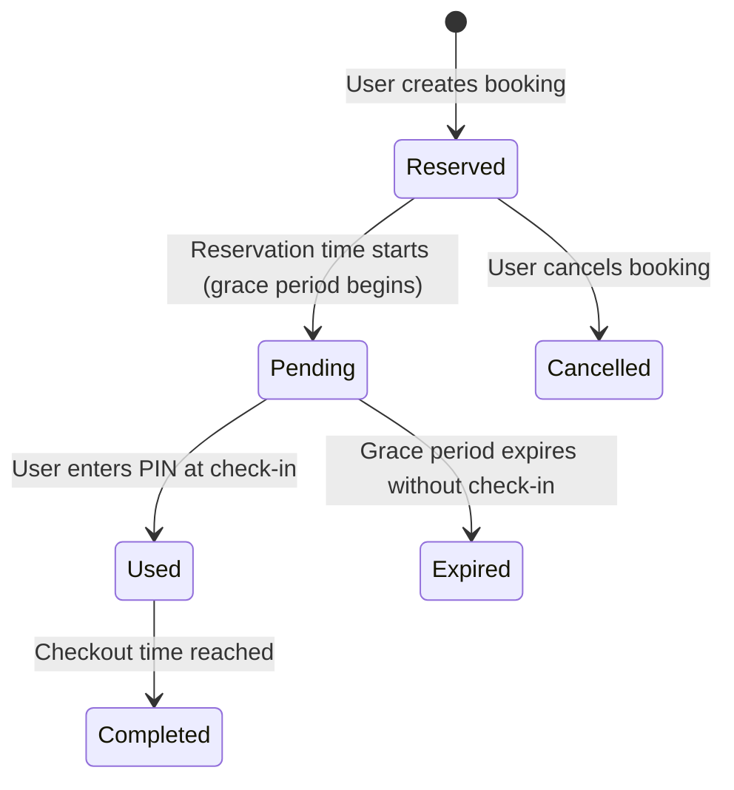

# Data Model: Interactive Floor Plan Map

This document describes the schema structure, validation rules, relationships, and initial seed data for the Interactive Floor Plan Map feature.

## Relational Entity Schema

### 1. `study_room`
Represents a physical room or reservable space mapped to the visual floor plans.

| Column | Type | Constraints | Description |
|---|---|---|---|
| `room_id` | `serial` | Primary Key | Auto-incremented unique room identifier. |
| `branch_id` | `integer` | Foreign Key (references `branches.branch_id`) | Library branch where the room is located. |
| `room_name` | `varchar(30)` | Unique, Not Null | Coded name matching the SVG element `id` attribute. |
| `tv_num` | `integer` | Default 0, >= 0 | Number of TVs in the room. |
| `board_num` | `integer` | Default 0, >= 0 | Number of whiteboards in the room. |
| `socket_num` | `integer` | Default 0, >= 0 | Number of power sockets available. |
| `capacity` | `integer` | Default 1, >= 1 | Maximum capacity of study group members. |
| `description` | `text` | Nullable | Detailed amenities or descriptions. |

---

### 2. `room_avail`
Defines time intervals/slots during which a specific study room can be booked.

| Column | Type | Constraints | Description |
|---|---|---|---|
| `avail_id` | `serial` | Primary Key | Unique slot identifier. |
| `room_id` | `integer` | Foreign Key (references `study_room.room_id`) | Target room this slot belongs to. |
| `start_time` | `time` | Not Null | Starting time of the slot. |
| `end_time` | `time` | Not Null | Ending time of the slot. |

- **Constraint**: `start_time < end_time`

---

### 3. `reserve_room`
Stores the active reservations for study room slots.

| Column | Type | Constraints | Description |
|---|---|---|---|
| `reserve_id` | `uuid` | Primary Key, Default `gen_random_uuid()` | Unique reservation identifier. |
| `user_id` | `uuid` | Foreign Key (references `users.user_id`) | User who reserved the room. |
| `avail_id` | `integer` | Foreign Key (references `room_avail.avail_id`) | Target slot booked. |
| `start_date` | `date` | Not Null | Booking date. |
| `checkin_time` | `timestamp` | Nullable | Actual check-in timestamp. |
| `pin` | `varchar(10)` | Unique, Nullable | 4 to 6 digit verification PIN code. |
| `expired_at` | `timestamp` | Nullable | Expiry deadline if user does not check in. |
| `status` | `varchar(20)` | Default 'reserved' | 'reserved', 'pending', or 'used'. |

---

## State Transition Diagrams



---

## SQL Seeding Script

Run the following queries to populate `study_room` and `room_avail` for **Map 1 (Branch 1: NVC)** and **Map 2 (Branch 2: LT)**.

### Seed Rooms
```sql
-- Branch 1 (NVC) Room Seeds (matches Map 1 SVGs ids)
-- Note: Rooms with capacity = 1 will be informative-only (description only, no reservation elements).
INSERT INTO public.study_room (branch_id, room_name, tv_num, board_num, socket_num, capacity, description) VALUES
(1, 'meetingRoom1', 1, 1, 4, 8, 'Large group study room with projector and whiteboard.'),
(1, 'meetingRoom2', 1, 1, 4, 6, 'Medium group discussion room with TV screen.'),
(1, 'meetingRoom3', 0, 1, 2, 4, 'Small study group room.'),
(1, 'lounge1', 0, 0, 8, 12, 'Comfortable open lounge area for quiet discussions.'),
(1, 'lounge2', 0, 0, 6, 10, 'Relaxed seating section with couches.'),
(1, 'studyZone1', 0, 0, 16, 20, 'Silent individual study zone with partitioned desks.'),
(1, 'studyZone2', 0, 0, 12, 15, 'Open collaborative study benches.'),
(1, 'computerArea1', 0, 0, 10, 10, 'PC workstation section (PCs 1-10).'),
(1, 'computerArea2', 0, 0, 8, 8, 'PC workstation section (PCs 11-18).'),
(1, 'computerArea3', 0, 0, 6, 6, 'Laptop plugin stations.'),
(1, 'reception', 0, 0, 2, 3, 'Library support desk.'),
(1, 'locker', 0, 0, 0, 1, 'Personal storage lockers area (informative only).'),
(1, 'circlebookshelf', 0, 0, 0, 1, 'Circular fiction bookshelf display (informative only).'),
(1, 'table1', 0, 0, 4, 4, 'Open study table near windows.'),
(1, 'table2', 0, 0, 4, 4, 'Open study table near bookshelves.');

-- Branch 2 (LT) Room Seeds (matches Map 2 SVGs ids)
INSERT INTO public.study_room (branch_id, room_name, tv_num, board_num, socket_num, capacity, description) VALUES
(2, 'meetingRoom1', 1, 1, 6, 10, 'Executive study room with smart board.'),
(2, 'meetingRoom2', 1, 1, 4, 6, 'Standard project meeting room.'),
(2, 'meetingRoom3', 1, 1, 4, 8, 'Spacious discussion room.'),
(2, 'lounge', 0, 0, 12, 15, 'Central community relaxation and reading zone.'),
(2, 'studyZone1', 0, 0, 16, 24, 'Quiet open desks with table lamps.'),
(2, 'studyZone2', 0, 0, 8, 12, 'Collaborative bench workspace.'),
(2, 'computerCenter', 0, 0, 24, 24, 'High performance workstation computers.'),
(2, 'reception', 0, 0, 3, 4, 'Branch circulation and info desk.'),
(2, 'locker', 0, 0, 0, 1, 'Self-service storage lockers (informative only).');
```

### Seed Availability Slots
```sql
-- Generate availability slots (08:00 - 20:00, 2-hour blocks) for all rooms
DO $$
DECLARE
    r RECORD;
    i INT;
    start_t TIME;
    end_t TIME;
BEGIN
    FOR r IN SELECT room_id FROM public.study_room LOOP
        -- Seed 6 slots: 08-10, 10-12, 12-14, 14-16, 16-18, 18-20
        FOR i IN 0..5 LOOP
            start_t := CAST((8 + i * 2) || ':00:00' AS TIME);
            end_t := CAST((10 + i * 2) || ':00:00' AS TIME);
            INSERT INTO public.room_avail (room_id, start_time, end_time)
            VALUES (r.room_id, start_t, end_t);
        END LOOP;
    END LOOP;
END $$;
```
