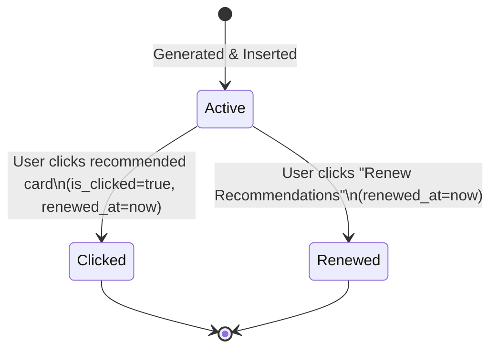

# Data Model: AI User Recommendations

This document defines the schema designs, indexes, and state transitions for the AI recommendation feature in both PostgreSQL and Memgraph.

## 1. PostgreSQL Schema Design

A dedicated `recommends` table is required in PostgreSQL to track impressions, clicks, scores, and renewal (archive) states of personalized recommendations.

### `public.recommends` Table Definition
```sql
CREATE TABLE public.recommends (
    recommend_id UUID DEFAULT gen_random_uuid() NOT NULL,
    user_id UUID NOT NULL,
    book_id VARCHAR(20) NOT NULL,
    score REAL NOT NULL,
    showed_at TIMESTAMP DEFAULT CURRENT_TIMESTAMP NOT NULL,
    is_clicked BOOLEAN DEFAULT FALSE NOT NULL,
    renewed_at TIMESTAMP WITHOUT TIME ZONE,
    CONSTRAINT recommends_pkey PRIMARY KEY (recommend_id),
    CONSTRAINT fk_recommends_user FOREIGN KEY (user_id) REFERENCES public.users(user_id) ON DELETE CASCADE,
    CONSTRAINT fk_recommends_book FOREIGN KEY (book_id) REFERENCES public.books(book_id) ON DELETE CASCADE
);

-- Unique index to prevent duplicate active recommendations for a user-book combination
CREATE UNIQUE INDEX idx_active_recommendations ON public.recommends(user_id, book_id) 
WHERE (renewed_at IS NULL);

-- Indexes for performance queries
CREATE INDEX idx_recommends_user_active ON public.recommends(user_id) WHERE (renewed_at IS NULL);
CREATE INDEX idx_recommends_click_features ON public.recommends(user_id, book_id, is_clicked, renewed_at);
```

### PostgreSQL Schema Fields Description
- `recommend_id`: Unique identifier for each log entry.
- `user_id`: Links to the `users` table (FK).
- `book_id`: Links to the `books` table (FK).
- `score`: The ranking score calculated by the model.
- `showed_at`: Timestamp when the recommendation was generated.
- `is_clicked`: Tracks whether the user clicked this book card on their dashboard.
- `renewed_at`: Set to the current timestamp when a user click occurs or when a user clicks "Renew Recommendations" (effectively archiving the recommendations). If `renewed_at` is null, the recommendation is active and visible.

---

## 2. Memgraph Schema Design

The Memgraph database uses a corresponding relationship `RECOMMENDED` connecting `User` and `Book` nodes.

### `[:RECOMMENDED]` Relationship Properties
- `score`: `Float` (corresponds to the model scoring).
- `generated_at`: `String` (ISO 8601 timestamp mapping to PostgreSQL `showed_at`).
- `is_clicked`: `Boolean` (tracks clicks).
- `renewed_at`: `String` (ISO 8601 timestamp mapping to PostgreSQL `renewed_at`).

### Memgraph Cypher Queries

#### Sync Recommendation Insertion
```cypher
MERGE (u:User {id: $userId})
MERGE (b:Book {id: $bookId})
CREATE (u)-[r:RECOMMENDED {
  score: toFloat($score),
  generated_at: $generatedAt,
  is_clicked: false
}]->(b);
```

#### Sync Recommendation Click
```cypher
MATCH (u:User {id: $userId})-[r:RECOMMENDED {is_clicked: false}]->(b:Book {id: $bookId})
WHERE r.renewed_at IS NULL
SET r.is_clicked = true, r.renewed_at = $clickedAt;
```

#### Sync Recommendation Renewal (Archive all active recommendations)
```cypher
MATCH (u:User {id: $userId})-[r:RECOMMENDED]->(b:Book)
WHERE r.renewed_at IS NULL
SET r.renewed_at = $renewedAt;
```

---

## 3. Recommendation State Transitions

Recommendations progress through a simple lifecycle:



1. **Active**: The recommendation is generated and saved. It appears on the user's dashboard carousels.
2. **Clicked**: The user clicks the card. This immediately marks it as clicked and sets the `renewed_at` timestamp. It is removed from the active recommendation list but is preserved in history for future model training.
3. **Renewed (Archived)**: The user clicks the refresh button. All active recommendations (where `renewed_at` is null) are updated with `renewed_at = CURRENT_TIMESTAMP`. They will no longer display, and a new active batch is created.
