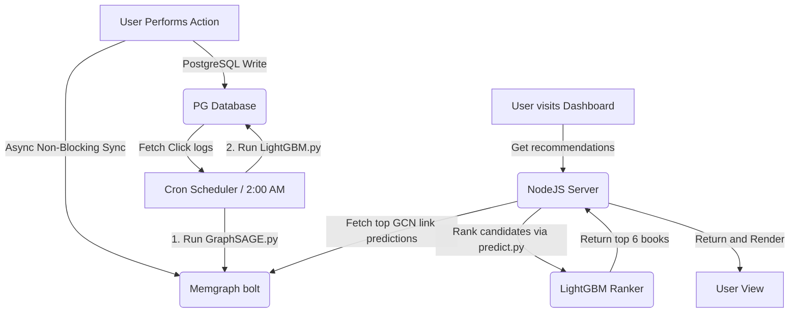

# Research & Architectural Decisions: AI User Recommendations

This document outlines the research findings, design decisions, and training logic modifications for the AI personalized recommendation feature.

## 1. Machine Learning Retraining Workflow

The recommendation system consists of two primary models:
1. **GraphSAGE** (on Memgraph): Learns graph embeddings and computes link prediction scores based on node topology and relationships.
2. **LightGBM** (GBDT Ranker): Takes candidate book lists and ranks them based on user-specific session features (impressions, months, click-through history).

### Retraining Schedule and Automation

- **Schedule**: Retraining will occur on a weekly basis during off-peak hours (e.g., Sunday at 2:00 AM) to minimize database locks and CPU overhead.
- **Automation Service**: A Node.js background scheduler (`scheduler.services.mjs` using `node-cron`) will run inside the backend server container.
- **Retraining Process**:
  1. Trigger GraphSAGE retraining by running `python database/Init_data/GraphSAGE.py`. This regenerates the weighted `INTERACTED` edges in Memgraph and refits the GCN model.
  2. Trigger LightGBM retraining by running `python database/Init_data/LightGBM.py`. This reads historical recommends logs from Postgres, trains a binary classifier, and saves model weights to `database/Init_data/lightgbm_ranker.txt`.
  3. Log retraining status (start, success/failure, metrics, and duration) to a file `logs/recommendation_retraining.log` for administrator visibility.

## 2. Prioritizing User Input Behavior in Training Logic

### Current Issue in `GraphSAGE.py`
In the initial `GraphSAGE.py` script, all recommendation edges are treated equally:
```cypher
MATCH (u:User)-[r:RECOMMENDED]->(bk:Book)
```
This query fetches all recommendations (whether the user clicked them or not) and injects them into the training graph. This creates a feedback loop that reinforces recommended items regardless of actual user interest.

### Modified Training Logic Decision
To prioritize user behavior, we must distinguish between:
- **Active User Input Behaviors**: Borrows (`BORROWED`), returns (`RETURNED`), wishlists (`WISHED`), search clicks (`SEARCHED`), and clicked recommendations.
- **Passive System Impressions**: Recommended books that the user saw but did NOT click.

We will modify the training edge generation query in `GraphSAGE.py` for recommendations as follows:
- **Only include clicked recommendations** (`is_clicked = true`) in the `INTERACTED` edge construction.
- Recommended books that were not clicked will be excluded from the training dataset.
- This ensures that the model learns from actual user behavior, avoiding training bias from system recommendations.

## 3. Data Synchronization & Inference Architecture



### Recommendation API & Inference Flow
When a logged-in user requests recommendations or triggers a "Renew":
1. **Candidate Retrieval**: NodeJS queries Memgraph for the top 50 books with the highest link prediction scores or cosine similarity embeddings compared to the user's recently interacted books (borrowed, wishlisted, or searched).
2. **Filter Exclusions**: The NodeJS service queries PostgreSQL to fetch the user's current wishlist and borrowed books, and removes them from the 50 candidate IDs.
3. **Ranking via LightGBM**:
   - The NodeJS backend calls a lightweight Python script `server/src/recommendation/predict.py` passing the `user_id` and filtered candidate IDs.
   - `predict.py` connects to PostgreSQL to fetch each candidate's feature: `past_impressions_count` (how many times this user was recommended this book without clicking).
   - It loads the model `lightgbm_ranker.txt` and predicts the click probability.
   - It returns the sorted candidates to the NodeJS server.
4. **Display and Save**:
   - NodeJS takes the top 6 books, writes them to the PostgreSQL `recommends` table (with `is_clicked = false` and `renewed_at = NULL`).
   - It triggers an async background write to Memgraph to create `RECOMMENDED` edges.
   - It returns the books to the Next.js frontend.

## 4. Alternatives Considered

- **Alternative 1: Direct SQL-based Collaborative Filtering**
  - *Rejected*: PostgreSQL is not optimized for complex graph traversals or link prediction. It lacks the ability to capture multi-hop relations (e.g., User -> Branch -> Book -> Author).
- **Alternative 2: Node.js LightGBM Inference Port**
  - *Rejected*: Running C-bindings for LightGBM directly in Node.js introduces compiling issues on Windows/Linux environments. Spawning a python script wrapper `predict.py` is safer and maintains consistency with the python training flow.
