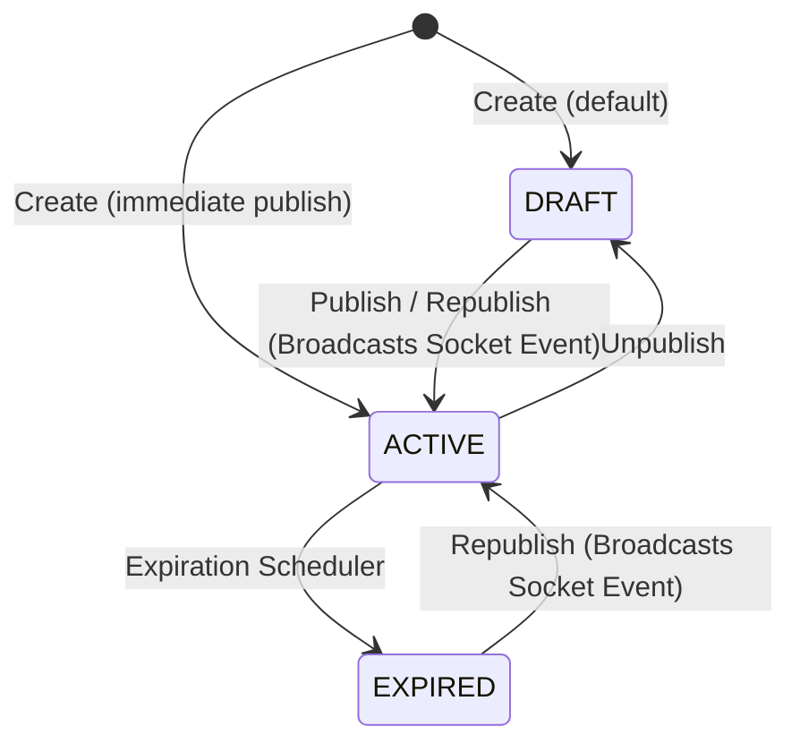

# Phase 1 Data Model: Announcement & Notification Unification

This document details the data schemas, states, and client-side storage keys involved in this feature. There are no database migrations; all new state tracking is frontend-only.

---

## 1. Baseline Database Schema (Unchanged)

### A. Announcements Table (`public.announcements`)
The PostgreSQL schema for announcements remains identical to the baseline:
```sql
CREATE TABLE public.announcements (
    announce_id uuid DEFAULT gen_random_uuid() NOT NULL,
    created_at timestamp without time zone DEFAULT CURRENT_TIMESTAMP,
    expired_date date,
    title text,
    content text,
    status character varying(20) DEFAULT 'draft'::character varying NOT NULL,
    CONSTRAINT chk_status CHECK (
        status::text = ANY (
            ARRAY[
                'draft'::character varying,
                'active'::character varying,
                'expired'::character varying
            ]::text[]
        )
    )
);
```

### B. Study Group Participation (`public.study_group_participation`)
Tracks requests and invitations. Read-only usage from this feature:
* `request_id` (uuid, Primary Key)
* `group_id` (uuid, Foreign Key)
* `user_id` (uuid, Foreign Key)
* `status` (varchar(20), e.g. `'pending'`, `'approved'`, `'denied'`)
* `type` (varchar(10), `'request'` or `'invite'`)
* `created_at` (timestamp)

---

## 2. LocalStorage Key Mapping & Schemas

To maintain per-user isolation, all keys incorporate the authenticated user's `userId`:

1. **Seen Announcement IDs**:
   - **Key**: `amethyst:announcements:seenIds:${userId}`
   - **Type**: JSON Array of strings (UUIDs)
   - **Purpose**: Holds the list of UUIDs of all announcements that the user has seen/read.
   - **Migration**: The client automatically migrates any legacy `amethyst:announcements:lastSeenId:${userId}` key by populating `seenIds` with the legacy value and all announcements published at or before it when first fetched.

3. **Study Group System Notifications**:
   - **Key**: `study-group-system-notifications:${userId}`
   - **Type**: JSON Array of `StudyGroupLifecycleNotification` objects (max 50).
   - **Unread check**: Items where `item.read === false` are unread.

4. **Study Group Invitation Read Flags**:
   - **Key**: `study-group-invitation-read:${userId}`
   - **Type**: JSON Array of strings (containing `requestId`s of invitations seen).
   - **Unread check**: Invitations whose `requestId` is not in this array are unread.

---

## 3. Normalized Notification View Model

The dropdown renders a unified feed. All incoming items are mapped into a single frontend view-model:

export type UnifiedNotificationItem =
  | {
      id: string;              // announceId
      type: 'announcement';
      title: string;
      subtitle?: string;
      description?: string;
      timestamp: string;
      read: boolean;
      rawItem: BellAnnouncement;
    }
  | {
      id: string;              // requestId
      type: 'study_group_invitation';
      title: string;
      subtitle?: string;
      description?: string;
      timestamp: string;
      read: boolean;
      rawItem: StudyGroupInvitation;
    }
  | {
      id: string;              // notification.id
      type: 'study_group_lifecycle';
      title: string;
      subtitle?: string;
      description?: string;
      timestamp: string;
      read: boolean;
      rawItem: StudyGroupLifecycleNotification;
    };

### Sorting Rule
Items are sorted in descending order:
1. Primary sort: `timestamp` descending.
2. Secondary sort (tie-breaker): `id` string descending.

---

## 4. State Transitions & Invariants



### Transition Operations

| Source Status | Destination Status | Event Action | Client LocalStorage Effect |
|---------------|--------------------|--------------|----------------------------|
| `draft` / `expired` | `active` | `'republished'` | Filter out `announceId` from `amethyst:announcements:seenIds:${userId}` |
| `active` | `draft` / `expired` | `'status_changed'` (inactive) | (No unread flag added) |
| `active` | `active` (edit details) | `'updated'` | (No unread flag added) |

### Invariants
* **UUID Unchanged**: Updating status of an announcement (publishing/republishing) MUST NOT alter the existing `announce_id`.
* **Creation Time Unchanged**: Updating status of an announcement MUST NOT overwrite its `created_at` timestamp.
* **No Database Migrations**: No schema alterations are permitted.
* **No Cross-Device Sync**: Read states are client-side only and local to the browser's `localStorage` instances.
