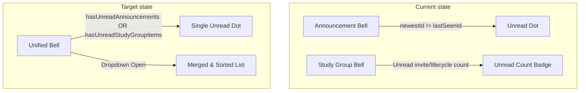

# Implementation Plan: Announcement & Notification Unification

**Branch**: `029-announcement-notification-unification` | **Date**: 2026-08-01 | **Spec**: [`spec.md`](../../../src/specs/029-announcement-notification-unification/spec.md)

---

## 1. Summary

This plan outlines the concrete implementation steps to resolve issues with announcement expiry validation, restore unread indicator status on announcement republish events, and unify librarian announcement and study group notifications under a single notification bell dropdown panel. All modifications conform strictly to the specifications and do not alter the database schema or execute migrations.

---

## 2. Technical Baseline & Context

### A. Languages & Frameworks
*   **Backend**: Node.js, Express, PostgreSQL (via `pg`), Socket.IO (v4)
*   **Frontend**: React (v19), Next.js (v16) App Router, Socket.IO Client (v4)
*   **Testing**: Vitest (`npm run test` inside `src/server`)

### B. Database Schema (No Alterations Permitted)
*   `public.announcements` table holds `announce_id` (UUID), `created_at` (timestamp), `expired_date` (date), `title` (text), `content` (text), and `status` ('draft', 'active', 'expired').

### C. Translation / Localization Keys
*   `src/client/app/locales/en.json` and `vi.json` will be updated to support the localized error message `announcements.validation_expiry_past` ("Cannot set expiration date in the past.").

---

## 3. Mandatory Baseline Symbols & Render Sites

Based on `HEAD` and the `dev` branch codebase, the following files represent the baseline implementation:

1.  **Announcement API Services**:
    *   [`src/server/src/services/announcement.services.mjs`](../../../src/server/src/services/announcement.services.mjs) (Contains validation, status transition logic, and Socket.IO emission).
2.  **Announcement API Controllers**:
    *   [`src/server/src/controllers/announcement.controllers.mjs`](../../../src/server/src/controllers/announcement.controllers.mjs) (Handles request routing and response packaging).
3.  **Librarian Announcement Manager**:
    *   [`src/client/app/hooks/useAnnouncementManager.ts`](../../../src/client/app/hooks/useAnnouncementManager.ts) (Validates and submits edits/creation on the admin frontend).
4.  **Unified Notification Hook**:
    *   [`src/client/app/hooks/useAnnouncementBell.ts`](../../../src/client/app/hooks/useAnnouncementBell.ts) (Orchestrates announcement fetching, socket subscriptions, and study group invitations/lifecycle loads).
5.  **Canonical Bell Component**:
    *   [`src/client/app/components/molecules/NotificationBell.tsx`](../../../src/client/app/components/molecules/NotificationBell.tsx) (Single render site in `NavBar.tsx` that handles dropdown toggle and decision modals).
6.  **Dropdown UI Panel**:
    *   [`src/client/app/components/molecules/NotificationDropdownPanel.tsx`](../../../src/client/app/components/molecules/NotificationDropdownPanel.tsx) (Renders the unified chronological list of notifications).
7.  **Inline Study Group Utilities & Types**:
    *   Defined directly within [`src/client/app/hooks/useAnnouncementBell.ts`](../../../src/client/app/hooks/useAnnouncementBell.ts) and [`src/client/app/components/molecules/NotificationBell.tsx`](../../../src/client/app/components/molecules/NotificationBell.tsx) to adhere to the zero-new-production-file constraint.
8.  **Test Infrastructure**:
    *   Vitest runner in `src/server`. Tests reside under `src/server/tests/`.

---

## 4. Current-State vs Target-State Flow



---

## 5. Implementation Roadmap

### Phase 1: Backend Date Validation & Status Transition (US1 & US2)

#### Step 1.1: Timezone-Safe Date Strings in `announcement.services.mjs`
*   Refactor the validation logic to convert both values to local timezone date-only strings (`YYYY-MM-DD`) and verify them lexicographically:
    ```javascript
    const getTodayString = () => {
      const today = new Date();
      const year = today.getFullYear();
      const month = String(today.getMonth() + 1).padStart(2, '0');
      const date = String(today.getDate()).padStart(2, '0');
      return `${year}-${month}-${date}`;
    };
    ```
*   Update `validateExpiredDate` to reject dates if `expiredDate < todayString`.

#### Step 1.2: Unconditional Expiry Validation
*   Apply the date validation inside `createAnnouncementService` and `editAnnouncementDetailsService` regardless of whether the status is `active` or `draft`.

#### Step 1.3: Status Transition and Socket Emission
*   In `updateAnnouncementStatusService(announceId, status)`, retrieve the current announcement from the database prior to updating.
*   If the transition is from a non-active status (`draft` or `expired`) to `active`, flag this as a **republish** event.
*   Broadcast exactly one Socket.IO event:
    ```javascript
    emitAnnouncementChanged('republished', updated);
    ```
*   If the transition does not match this condition, emit with action `'status_changed'` or `'updated'`.
*   Ensure that failed updates do not emit any socket events.

---

### Phase 2: Client-Side Read Tracking & Socket Integration (US2)

#### Step 2.1: Client-Side Seen Array Scoping
*   In `useAnnouncementBell.ts`, initialize the seen array in `localStorage` under `amethyst:announcements:seenIds:${userId}`.
*   An announcement is unread if its ID does not exist in the array.
*   When the bell dropdown is toggled open, add all currently loaded active announcement IDs to the `seenIds` array and save it.

#### Step 2.2: Realtime Socket Listener Integration
*   In the socket listener for `announcement:changed`, intercept the payload:
    *   If `data.action === 'republished'`, locate the announcement's ID and remove it from `seenIds` in local storage, making it unread again.
    *   Trigger a recalculation of the unified unread indicator state.
    *   Refetch the active announcements list.

#### Step 2.3: Idempotent Updates
*   Ensure that multiple receipt of the same socket event does not result in duplicate entries by using a Javascript `Set` or filtering duplicates based on ID before writing or updating React states.

---

### Phase 3: Unification of the Bell & Dropdown (US3)

#### Step 3.1: Bell Consolidation
*   Open `AuthActions.tsx` and delete the custom Study Group bell button element, dropdown handler state, and any list elements.
*   Retain only the single `<NotificationBell ... />` rendering site.
*   Ensure that responsive layouts do not render hidden separate bells that create duplicate Socket connections.

#### Step 3.2: Hook Expansion (`useAnnouncementBell.ts`)
*   In `useAnnouncementBell.ts`, check user authentication roles:
    *   If `role === 'user'`, execute `listStudyGroupInvitations()` and pull Study Group system notifications from local storage.
    *   If role is `admin` or `librarian`, skip these calls to prevent unauthorized API requests (HTTP `403 Forbidden`).

#### Step 3.3: Notification Normalization
*   Inside `NotificationBell.tsx`, map all incoming streams (Announcements, Study Group Invitations, and Lifecycle Notifications) to a single array of `UnifiedNotificationItem` objects.
*   Namespace each item ID to prevent React key collisions:
    *   Announcements: `key = "announcement:" + ann.announceId`
    *   Study Group Invitations: `key = "study_group_invitation:" + invite.requestId`
    *   Study Group Lifecycle: `key = "study_group_lifecycle:" + lifecycle.id`

#### Step 3.4: Chronological Sorting
*   Sort the unified list chronologically in descending order (newest first). If timestamps are identical, sort by ID.

#### Step 3.5: Unified Notification Dot Logic
*   Trigger the notification dot on the bell if:
    *   There is any unread announcement (not present in `seenIds`).
    *   There is any unread Study Group invitation (not present in `study-group-invitation-read:${userId}`).
    *   There is any unread Study Group system notification.

#### Step 3.6: Action Integration and Modal Mounting
*   Integrate modals inside the `NotificationBell.tsx` tree so they open correctly:
    *   Announcements click: Opens `AnnouncementReadingModal`.
    *   Study Group invitation click: Opens invitation decision modal with Accept/Reject buttons invoking `acceptStudyGroupInvitation` or `denyStudyGroupInvitation`.
    *   Study Group lifecycle click: Opens lifecycle details modal and navigates to the group's dashboard view.

---

## 6. Testing & Validation Strategy

### A. Backend Service Tests
*   Create `src/server/tests/services/announcement.services.spec.mjs` and implement Vitest test cases:
    1.  Create an announcement with a past expiration date $\rightarrow$ verify validation fails with `400 Bad Request`.
    2.  Update a draft announcement to a past expiration date $\rightarrow$ verify validation fails.
    3.  Create an announcement with today's date $\rightarrow$ verify validation passes.
    4.  Verify status transitions: transitioning draft $\rightarrow$ active emits a socket payload with `'republished'`.

### B. Execution Command
*   Run the test suite:
    ```bash
    npm run test
    ```
    Ensure that all 14 baseline test suites pass without regression.

---

## 7. Assumptions & Boundaries

*   **Role Isolation**: Users with role `'admin'` or `'librarian'` do not have collaborative study groups. They must not receive study group notifications, invitations, or query invitations endpoints.
*   **Local Storage Limitations**: Cross-device unread synchronization is out of scope. Seen status is saved in local storage and is device-specific.
*   **Offline State**: Clients returning online will fetch current notifications and compute their read/unread status against local storage seen tables. Storing offline delivery buffers on the backend database is a non-goal.
*   **Study Group APIs**: Reuses the endpoints `/api/study-groups/:groupId/invitations/:requestId/accept` and `/deny` directly as designed in the `feature/StudyGroup` branch.
