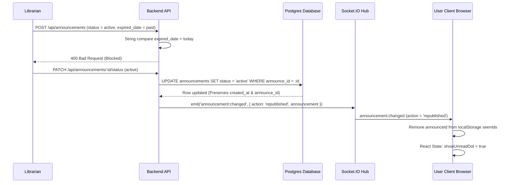

# Feature Specification: Announcement & Notification Unification

**Feature Branch**: `029-announcement-notification-unification`  
**Created**: 2026-08-01  
**Status**: Draft  
**Input**: User description: "Unify the Announcement and Notification experience. Implement strict past date validation for announcement expiry on create, update, and status change. Implement unread status restoration on announcement republish using Socket.IO events and user-scoped localStorage read states without database schema changes. Unify Announcement and Study Group notification bells into one canonical NotificationBell rendering a single dropdown sorting combined items chronologically."

---

## 1. User Scenarios & Testing *(Given/When/Then)*

The following scenarios define the acceptance criteria for this feature. They must be validated as functional end-to-end tests.

### Scenario 1 — Past, Current, and Future Expiry Dates
*   **Given** a logged-in librarian is creating or editing an announcement (either as a draft or published),
*   **When** they attempt to select a date in the past (yesterday or earlier), today's calendar date, or a future date as the `expired_date`,
*   **Then** the frontend date input prevents selecting past dates (e.g., disabling dates in the calendar picker using a `min` attribute set to today), and if they manually enter the date and submit the form:
    *   **Yesterday or earlier**: The submission is blocked, showing a validation error.
    *   **Today**: The submission succeeds, and the announcement is successfully saved.
    *   **Future date**: The submission succeeds, and the announcement is successfully saved.

### Scenario 2 — Direct Backend Request Bypassing Frontend Validation
*   **Given** an API client (or attacker) bypasses the user interface and sends a raw HTTP request directly to the backend (`POST /api/announcements` or `PUT /api/announcements/:id`),
*   **When** the request payload contains an `expired_date` before the current calendar date (yesterday or earlier),
*   **Then** the backend validates the date independently of the client and rejects the request with an HTTP `400 Bad Request` status and a validation error message.

### Scenario 3 — Initial Publication of a Draft
*   **Given** an announcement exists in the database with a status of `draft`,
*   **When** a librarian changes its status to `active` (initial publication),
*   **Then** the backend transitions the status field, persists it to the database, emits exactly one Socket.IO event (`announcement:changed`) indicating the new announcement is active, and online clients display the unread notification dot on the bell.

### Scenario 4 — Reading Announcements
*   Given a regular user sees a notification dot on the bell icon,
*   When they click the bell and open the dropdown panel,
*   Then all currently loaded announcements are marked as read for this user, their IDs are added to the local list of seen IDs in `localStorage` under `amethyst:announcements:seenIds:${userId}`, and the notification dot is dismissed.

### Scenario 5 — Unpublishing and Republishing the Same Row
*   **Given** an announcement exists in the database with `status = 'active'`,
*   **When** a librarian changes its status from `active` to `draft` (unpublishing it) and later transitions it back from `draft` to `active` (republishing it),
*   **Then** the backend transitions the status in the database, emits exactly one Socket.IO event on the active transition, and does not emit success events for failed updates.

### Scenario 6 — Notification Dot Returning after Republish
*   **Given** a user has already read an announcement (its ID exists in `seenIds` in `localStorage`) and the notification dot is currently off,
*   **When** the librarian republishes that same announcement (transitioning it from a non-active status to `active`),
*   **Then** the client receives the realtime socket event, removes that announcement ID from its local `seenIds` list in `localStorage`, and the notification dot immediately returns on the bell icon.

### Scenario 7 — UUID and `created_at` Remaining Unchanged
*   **Given** a librarian unpublishes and republishes an announcement,
*   **When** the state transitions are saved in the database,
*   **Then** the database updates only the status field, ensuring the `announce_id` (UUID) remains identical, the original `created_at` timestamp remains unchanged (never updated), and no new rows are inserted.

### Scenario 8 — Active $\rightarrow$ Active Producing No False Republish Event
*   **Given** an announcement is already in the `active` status,
*   **When** a librarian edits its title, content, or expiration date while maintaining the status as `active`,
*   **Then** the backend performs a normal update, does not treat this as a republish event, and does not broadcast a republish event that would trigger a false unread state or reappear the notification dot for users who already read it.

### Scenario 9 — Duplicate Socket Event Delivery
*   **Given** the client application is connected to the realtime Socket.IO server,
*   **When** the socket client receives duplicate `announcement:changed` events for the same republish action,
*   **Then** the client performs idempotent writes to local storage and updates the state without appending duplicate items in the dropdown list.

### Scenario 10 — Announcement and Study Group Items in One Dropdown
*   **Given** a user has active announcements, pending Study Group invitations, and Study Group lifecycle notifications,
*   **When** they click the unified bell icon,
*   **Then** a single dropdown menu displays all items together in a consolidated list, sorted chronologically by timestamp in descending order (newest first).

### Scenario 11 — Study Group Accept/Reject and Lifecycle Behavior
*   **Given** a Study Group invitation is listed inside the unified dropdown,
*   **When** the user clicks the item to trigger accept/reject actions, or clicks a lifecycle item,
*   **Then** the system opens the existing Study Group detail/invitation modal, allowing the user to accept/reject or navigate, without altering the database timestamps or rebuilding the Study Group code.

### Scenario 12 — User Switching Without Leaking Read State
*   **Given** User A has read all notifications on the browser,
*   **When** User A logs out and User B logs in on the same browser,
*   **Then** User B's unread states are loaded from keys scoped under User B's ID (`amethyst:announcements:seenIds:${userId}`), ensuring User A's read state does not leak.

---

## 2. Requirements

### Functional Requirements

#### US1 — Expiry Date Validation
*   **FR-1.1**: The frontend MUST prevent users from selecting a date prior to today for the `expired_date` input by setting the `min` attribute of the date picker to the current local date formatted as `YYYY-MM-DD`.
*   **FR-1.2**: The backend MUST validate the `expired_date` value on all creation (`POST`), update (`PUT`), and status patching requests. If the date is earlier than today's local date, it must return an HTTP `400 Bad Request`.
*   **FR-1.3**: To prevent timezone conversion issues (e.g., UTC adjustments shifting the date by a day), all date comparisons MUST be performed on date-only strings formatted as `YYYY-MM-DD` (e.g., `expiryString < todayString`).
*   **FR-1.4**: Expiration dates set to the current calendar date (today) or `null` (no expiration) MUST be accepted.

#### US2 — Announcement Republishing & Dot Reappearance
*   **FR-2.1**: The database schema and table structure for `public.announcements` MUST remain unchanged. No migrations or column additions (e.g. `published_at`) are permitted.
*   **FR-2.2**: The backend MUST reuse the existing announcement database row on republish, preserving the original `announce_id` and the original `created_at` timestamp.
*   **FR-2.3**: During a status update, the backend MUST detect if the status changes from non-active (`draft`, `expired`) to `active`. Under this transition, the backend MUST broadcast a single Socket.IO event `announcement:changed` with action `republished`.
*   **FR-2.4**: The client-side read/unread state MUST be scoped by the authenticated user's `userId`. The client MUST maintain an array of read announcement UUIDs in `localStorage` under the key `amethyst:announcements:seenIds:${userId}`.
*   **FR-2.5**: When the client receives a Socket.IO event indicating a republish (action `republished`), it MUST remove that announcement ID from the local `seenIds` array. This makes the announcement unread again and immediately restores the notification dot.
*   **FR-2.6**: The notification dot on the bell MUST display if any active announcement ID is missing from the local `seenIds` array.
*   **FR-2.7**: Normal announcement listings MUST display only active announcements (`status === 'active'`) sorted by their original `created_at` timestamp.

#### US3 — One Unified Notification Bell
*   **FR-3.1**: Exactly one notification bell owner MUST be mounted in the global navigation bar at a time. The duplicate bell button in `AuthActions.tsx` MUST be removed.
*   **FR-3.2**: Layout wrappers and responsive page headers MUST NOT render separate hidden instances of the bell button that would result in multiple active connections or duplicate fetches.
*   **FR-3.3**: The `NotificationBell` component MUST serve as the unified bell. For standard users, it MUST fetch and merge:
    1. Active announcements (via API call to `/api/announcements`).
    2. Study Group invitations (via helper `listStudyGroupInvitations()`).
    3. Study Group lifecycle notifications (from `localStorage` key `study-group-system-notifications:${userId}`).
*   **FR-3.4**: All notification types MUST be normalized into a single interface before rendering:
    ```typescript
    export type UnifiedNotificationItem =
      | {
          id: string;
          type: 'announcement';
          title: string;
          description: string;
          timestamp: string;
          read: boolean;
          rawItem: BellAnnouncement;
        }
      | {
          id: string;
          type: 'study_group_invitation';
          title: string;
          description: string;
          timestamp: string;
          read: boolean;
          rawItem: StudyGroupInvitation;
        }
      | {
          id: string;
          type: 'study_group_lifecycle';
          title: string;
          description: string;
          timestamp: string;
          read: boolean;
          rawItem: StudyGroupLifecycleNotification;
        };
    ```
*   **FR-3.5**: The unified dropdown list MUST sort normalized items chronologically by `timestamp` descending (newest first).
*   **FR-3.6**: To prevent key collisions in React, list items MUST use the namespaced ID (`type + ':' + originalId`) as their React `key`.
*   **FR-3.7**: Clicking an announcement MUST open the reading view overlay modal. Clicking a Study Group invitation or lifecycle notification MUST invoke the existing Study Group detail/invitation modal.
*   **FR-3.8**: Role-based routing MUST be enforced: roles without Study Group access (e.g. `admin`, `librarian`) MUST NOT call Study Group notification handlers or APIs, avoiding authorization failures.

---

## 3. Data Structures & Flows



### React Namespacing and Key Prevention
When mapping items from different databases or structures in the React component:
```typescript
const normalizedItems: UnifiedNotificationItem[] = [
  ...announcements.map(ann => ({
    id: `announcement-${ann.announceId}`,
    type: 'announcement',
    title: ann.title,
    description: ann.content,
    timestamp: ann.createdAt,
    read: seenIds.includes(ann.announceId),
    rawItem: ann
  })),
  ...invitations.map(invite => ({
    id: `study-group-invite-${invite.id}`,
    type: 'study_group_invitation',
    title: `Invite: ${invite.title}`,
    description: invite.description,
    timestamp: invite.time,
    read: readInviteIds.includes(invite.id),
    rawItem: invite
  }))
];
```

---

## 4. Success Criteria & Metrics

| ID | Metric | Measurement Method |
| :--- | :--- | :--- |
| **SC-001** | **Past Date Rejection** | 100% of creation/update requests with an `expired_date` in the past are rejected with HTTP 400. |
| **SC-002** | **Zero Database Alteration** | Git diff shows no modifications to `src/database/` schema or SQL files. |
| **SC-003** | **Republish Notification Dot** | Verification that switching status from draft to active removes the ID from the client's seen array, immediately rendering the orange unread dot on the bell icon. |
| **SC-004** | **No Duplicate Items** | Receiving duplicate socket updates yields a single unique rendering of the item (checked by React keys). |
| **SC-005** | **Single Bell Component** | DOM audit verifies that exactly one bell component (with one Socket connection) is active on the viewport. |
| **SC-006** | **Chronological Sorting** | Combined notifications dropdown displays items sorted by timestamp descending, regardless of notification domain. |
| **SC-007** | **Zero Leakage on Logout** | Logging out clears `seenIds` in active React state, and logging in as a different user loads the appropriate local state namespace. |

---

## 5. Assumptions & Constraints

*   **Study Group Domain**: Existing Study Group logic is assumed correct and functional. Spec 029 does not alter or re-implement Study Group models, endpoints, or mock databases.
*   **Timezone Boundaries**: Standardizing date validation on YYYY-MM-DD string comparisons assumes the client and server clocks are reasonably synchronized within a day.
*   **Local Storage Limitations**: Storing read status in browser `localStorage` limits unread tracking to the current device and browser. Syncing read states across devices is explicitly out of scope.
*   **Offline Notifications**: Realtime republish notifications are dependent on Socket.IO event delivery. If a client is offline when a republish event is emitted, they will miss the event and the ID will remain in their local `seenIds` list (marking it as read). This is a known limitation of client-side tracking, as backend-driven offline delivery buffers are out of scope.
