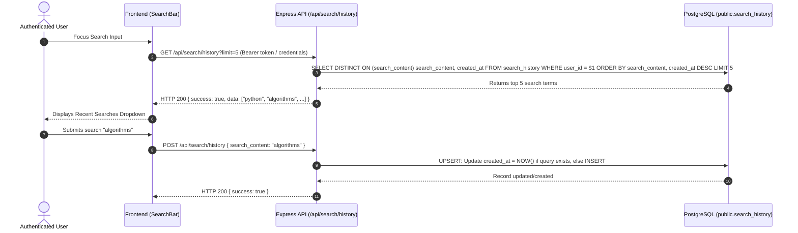

# Data Model: Recent Search History for Logged-In Users

## Entities

### `SearchHistory` Entity
Represents a recorded search event submitted by a registered library user.

#### Database Table: `public.search_history`

| Column | Type | Constraints | Description |
|---|---|---|---|
| `search_id` | `uuid` | `PRIMARY KEY`, `DEFAULT gen_random_uuid()` | Unique record identifier |
| `user_id` | `uuid` | `NOT NULL`, `FK -> public.users(user_id)` | Owner user account ID |
| `search_content` | `text` | `NOT NULL` | Trimmed search query string |
| `created_at` | `timestamp` | `DEFAULT CURRENT_TIMESTAMP`, `NOT NULL` | Timestamp of search submission/refresh |
| `filters` | `jsonb` | `NULLABLE` | Optional JSON object containing applied filters |

---

## Validation & Business Rules

1. **User Scope & Isolation**:
   - Every `search_history` record MUST belong to a valid `user_id`.
   - Guest queries (`user_id` is null) MUST NOT be persisted to `public.search_history`.

2. **Deduplication & Recency**:
   - A user MUST NOT have duplicate `search_content` strings in their active search history.
   - When a user submits a search query that already exists for their `user_id`, the system MUST update `created_at = NOW()` for that existing record instead of inserting a new row.

3. **Limit Boundary**:
   - Queries retrieving user search history MUST return at most 5 items ordered by `created_at DESC`.

---

## Data Flow Diagram

