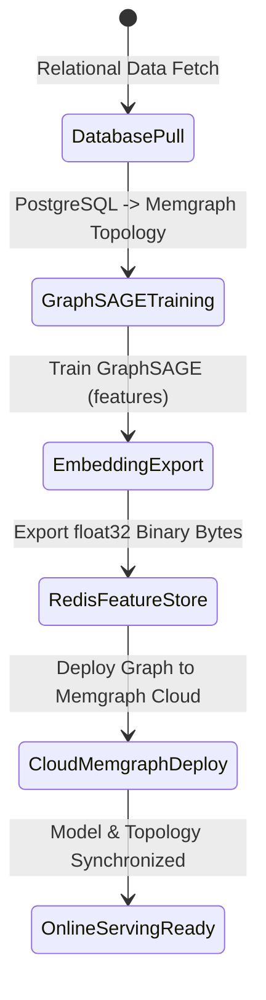

# Data Model & Key Entities: AI Recommendation System Infrastructure & Cloud Deployment Pipeline

## Feature Data Entities

### 1. Redis User Embedding Vector (`emb:user:<user_id>`)
- **Storage**: Key-Value in Redis (DB 0)
- **Key Format**: `emb:user:<user_id>` (e.g., `emb:user:28e1e0be-7a2b-444f-ab9f-5477109a29e5`)
- **Value Type**: Binary `float32` byte array (length: $384 \times 4 = 1536$ bytes)
- **Source**: Memgraph `User` node property `n.features` generated by GraphSAGE link prediction
- **TTL**: Persistent (overwritten on pipeline retraining execution)

---

### 2. Redis Item Embedding Vector (`emb:item:<book_id>`)
- **Storage**: Key-Value in Redis (DB 0)
- **Key Format**: `emb:item:<book_id>` (e.g., `emb:item:1020049`)
- **Value Type**: Binary `float32` byte array (length: $384 \times 4 = 1536$ bytes)
- **Source**: Memgraph `Book` node property `n.features` / PostgreSQL native text embedding
- **TTL**: Persistent (overwritten on pipeline retraining execution)

---

### 3. Recommendation Candidate Payload (IPC Socket API)
- **Format**: JSON Line over TCP Socket (Port 5001)
- **Attributes**:
  - `id`: Book UUID / string ID
  - `session_month`: Integer (1-12) representing current calendar month
  - `past_impressions_count`: Integer representing unclicked impression history count
  - `is_in_wishlist`: Integer (0 or 1) indicating user wishlist status
  - `global_available_copies`: Integer total available copies across branches
  - `gcn_score`: Float baseline prediction score from Memgraph GraphSAGE query

---

### 4. Ranked Recommendation Output Entity
- **Attributes**:
  - `id`: Book ID
  - `score`: Float composite score computed by LightGBM micro-ranker
  - `penalized_score`: Float score adjusted by exponential skip penalty ($0.65^{\text{past\_impressions\_count}}$)
  - `showed_at`: ISO timestamp string recorded when recommendations are shown to user

---

## State Transitions & Workflow Sequences

