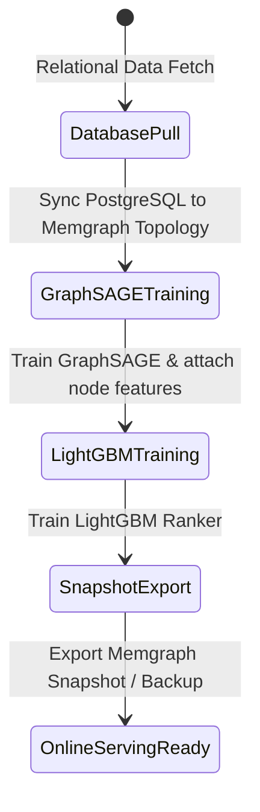

# Data Model & Key Entities: AI Recommendation System Infrastructure (No Redis)

## Feature Data Entities

### 1. Memgraph User Node Entity (`(:User)`)
- **Storage**: Node property in Memgraph Database
- **Label**: `:User`
- **Key Attributes**: `id` (String UUID)
- **Vector Property**: `u.features` / `u.embedding` (List of Float values, dimension: 384)
- **Source**: GraphSAGE link prediction & topological training

---

### 2. Memgraph Book Node Entity (`(:Book)`)
- **Storage**: Node property in Memgraph Database
- **Label**: `:Book`
- **Key Attributes**: `id` (String Book ID), `title`, `author`
- **Vector Property**: `b.features` / `b.embedding` (List of Float values, dimension: 384)
- **Source**: Text embeddings / GraphSAGE node representations

---

### 3. Recommendation Candidate Payload (IPC Socket API)
- **Format**: JSON Line over TCP Socket (Port 5001)
- **Attributes**:
  - `user_id`: User UUID / string ID
  - `candidates`: Array of Candidate Objects:
    - `id`: Book ID
    - `session_month`: Integer (1-12)
    - `past_impressions_count`: Integer representing unclicked impression history count
    - `is_in_wishlist`: Integer (0 or 1) indicating user wishlist status
    - `global_available_copies`: Integer total available copies across branches
    - `gcn_score`: Float baseline prediction score from Memgraph GraphSAGE query

---

### 4. Ranked Recommendation Output Entity
- **Attributes**:
  - `id`: Book ID
  - `score`: Float composite score computed by LightGBM micro-ranker
  - `penalized_score`: Float score adjusted by exponential skip penalty ($0.65^{\text{past\_impressions\_count}}$)
  - `showed_at`: ISO timestamp string recorded when recommendations are shown to user

---

## State Transitions & Workflow Sequences

